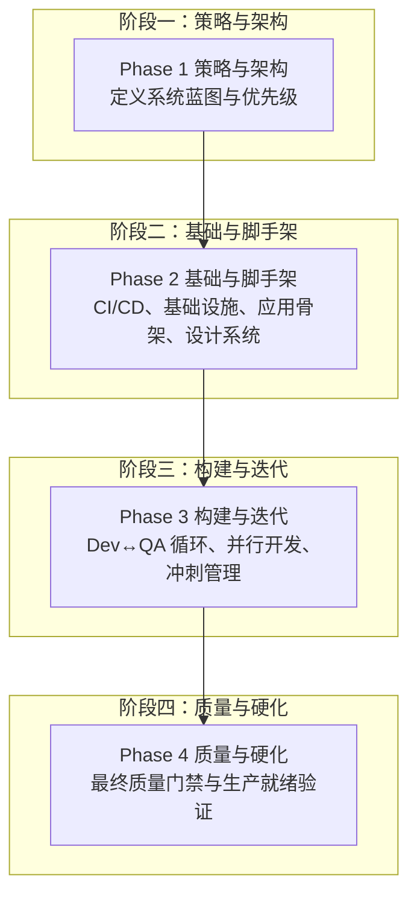
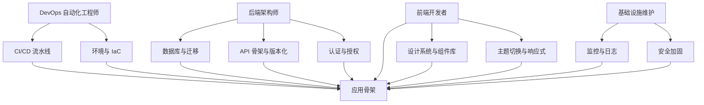
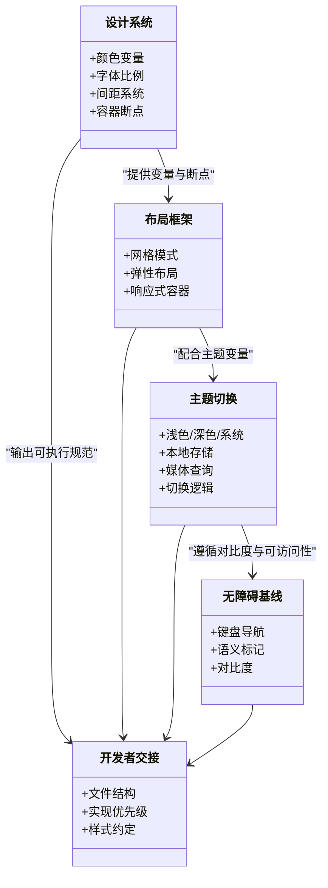
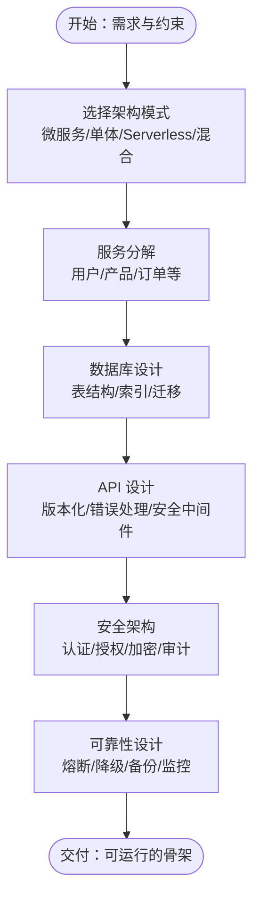
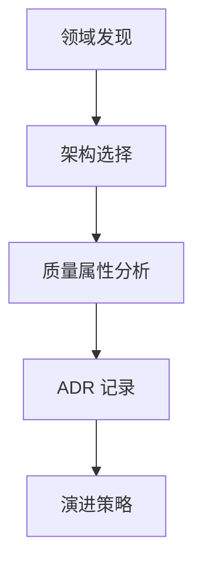
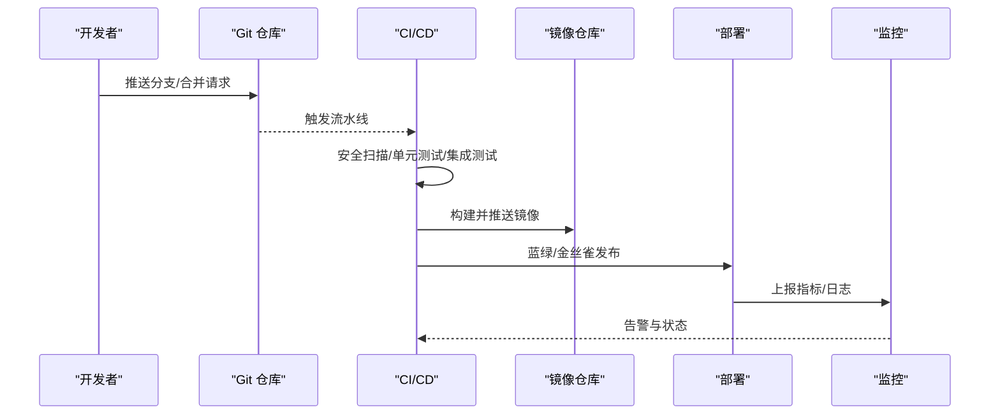
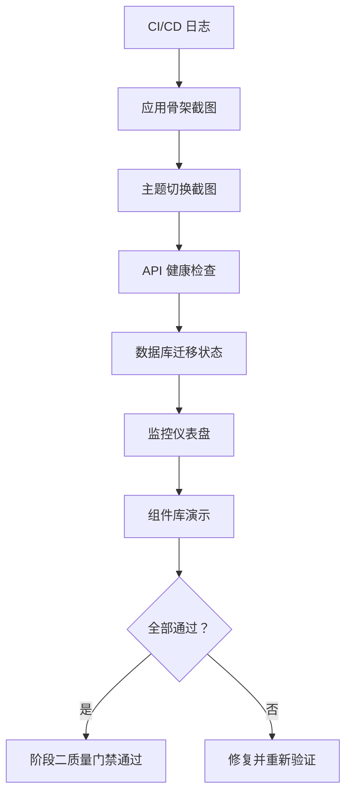
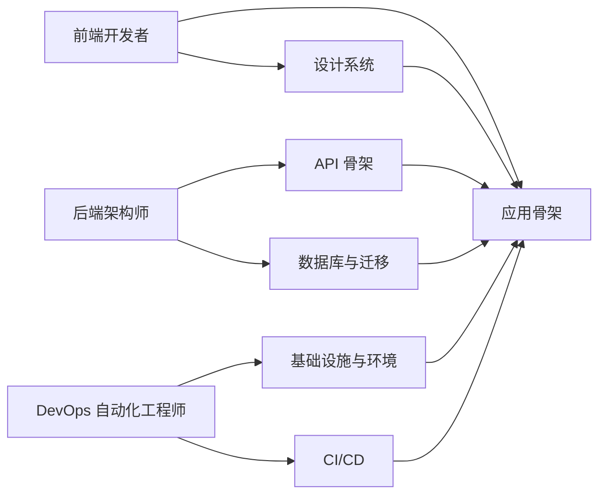

# 阶段二：技术架构设计

<cite>
**本文引用的文件**
- [README.md](file://README.md)
- [QUICKSTART.md](file://strategy/QUICKSTART.md)
- [EXECUTIVE-BRIEF.md](file://strategy/EXECUTIVE-BRIEF.md)
- [phase-1-strategy.md](file://strategy/playbooks/phase-1-strategy.md)
- [phase-2-foundation.md](file://strategy/playbooks/phase-2-foundation.md)
- [phase-3-build.md](file://strategy/playbooks/phase-3-build.md)
- [phase-4-hardening.md](file://strategy/playbooks/phase-4-hardening.md)
- [handoff-templates.md](file://strategy/coordination/handoff-templates.md)
- [scenario-startup-mvp.md](file://strategy/runbooks/scenario-startup-mvp.md)
- [scenario-enterprise-feature.md](file://strategy/runbooks/scenario-enterprise-feature.md)
- [engineering-backend-architect.md](file://engineering/engineering-backend-architect.md)
- [engineering-software-architect.md](file://engineering/engineering-software-architect.md)
- [design-ux-architect.md](file://design/design-ux-architect.md)
</cite>

## 目录
1. [引言](#引言)
2. [项目结构](#项目结构)
3. [核心组件](#核心组件)
4. [架构总览](#架构总览)
5. [详细组件分析](#详细组件分析)
6. [依赖关系分析](#依赖关系分析)
7. [性能考量](#性能考量)
8. [故障排查指南](#故障排查指南)
9. [结论](#结论)
10. [附录](#附录)

## 引言
本阶段聚焦“技术架构设计”，目标是将项目需求转化为可执行的技术蓝图，并建立跨职能团队在统一框架下的协作机制。重点职责包括：
- ArchitectUX 代理的架构设计能力：以开发者为中心，提供可落地的前端基础、设计系统与实现路径。
- 技术栈选择策略：结合业务域、团队能力与演进约束，进行权衡决策与记录（ADR）。
- 系统设计原则：可扩展、可观测、安全、可维护与可演进。
- 架构蓝图构建：前端架构、后端架构、数据库设计、API 规划、安全架构等。
- 文档规范与评审：质量门禁、证据驱动、可重复的评审流程。
- 设计模式与可扩展性：微服务/事件驱动/模块化单体等模式的选择与适用场景。
- 性能优化与风险控制：容量规划、负载测试、合规与安全审计。

## 项目结构
该仓库以“多智能体工作流”为核心，通过 NEXUS 模型将不同领域的专家智能体组织为分阶段的流水线。阶段二“基础与脚手架”是后续构建与硬化的根基，强调基础设施、CI/CD、应用骨架与设计系统的落地。

图示来源
- [phase-1-strategy.md:1-239](file://strategy/playbooks/phase-1-strategy.md#L1-L239)
- [phase-2-foundation.md:1-279](file://strategy/playbooks/phase-2-foundation.md#L1-L279)
- [phase-3-build.md:1-287](file://strategy/playbooks/phase-3-build.md#L1-L287)
- [phase-4-hardening.md:1-333](file://strategy/playbooks/phase-4-hardening.md#L1-L333)

章节来源
- [README.md:1-886](file://README.md#L1-L886)
- [QUICKSTART.md:1-195](file://strategy/QUICKSTART.md#L1-L195)
- [EXECUTIVE-BRIEF.md:1-96](file://strategy/EXECUTIVE-BRIEF.md#L1-L96)

## 核心组件
- ArchitectUX（UX 架构师）
  - 提供 CSS 设计系统、布局框架、组件架构与信息架构，确保开发者有清晰的实现路径与一致性。
  - 关键交付：设计系统变量、响应式容器与网格、主题切换、无障碍基线。
- 后端架构师
  - 定义系统架构、数据库设计、API 规范、认证授权与安全架构，确保可扩展、可观测与高可用。
  - 关键交付：架构模式、服务分解、数据库模式、API 规范与安全策略。
- 软件架构师
  - 进行领域建模、架构模式选择、权衡分析与 ADR 记录，指导系统演进与技术决策。
  - 关键交付：ADR 模板、领域发现、质量属性分析、模式选型矩阵。
- DevOps 自动化工程师
  - 建立 CI/CD 流水线、基础设施即代码、环境配置与监控告警，保障可重复部署与可观测性。
- 前端开发者
  - 基于设计系统实现应用骨架、组件库与主题切换，保证跨设备一致体验。
- 质量与验收
  - Evidence Collector、API Tester、性能基准、合规检查等，贯穿各阶段的质量门禁。

章节来源
- [design-ux-architect.md:1-469](file://design/design-ux-architect.md#L1-L469)
- [engineering-backend-architect.md:1-235](file://engineering/engineering-backend-architect.md#L1-L235)
- [engineering-software-architect.md:1-82](file://engineering/engineering-software-architect.md#L1-L82)
- [phase-2-foundation.md:1-279](file://strategy/playbooks/phase-2-foundation.md#L1-L279)
- [phase-3-build.md:1-287](file://strategy/playbooks/phase-3-build.md#L1-L287)
- [phase-4-hardening.md:1-333](file://strategy/playbooks/phase-4-hardening.md#L1-L333)

## 架构总览
阶段二的总体目标是“打地基”。在此阶段，需要完成：
- CI/CD 流水线与基础设施准备（IaC、容器编排、网络与安全配置）
- 数据库与 API 的骨架实现（含认证、版本化与健康检查）
- 前端应用骨架与设计系统（组件库、主题切换、响应式布局）
- 监控与日志体系的上线与验证
- Git 工作流与协作模板的标准化

图示来源
- [phase-2-foundation.md:19-279](file://strategy/playbooks/phase-2-foundation.md#L19-L279)
- [engineering-backend-architect.md:92-186](file://engineering/engineering-backend-architect.md#L92-L186)
- [design-ux-architect.md:64-295](file://design/design-ux-architect.md#L64-L295)

## 详细组件分析

### ArchitectUX 组件分析
ArchitectUX 的职责是“为开发者提供可落地的基础”。其核心能力包括：
- CSS 设计系统：颜色、字体、间距、容器与断点的变量化与主题化。
- 布局框架：网格、弹性布局与响应式容器，覆盖移动端到桌面端。
- 主题切换：本地存储偏好、系统跟随与即时切换的 JS 实现。
- 无障碍基线：键盘导航、语义标记与对比度要求。
- 开发者交接：明确的文件结构、优先级与实现指引。

图示来源
- [design-ux-architect.md:64-295](file://design/design-ux-architect.md#L64-L295)

章节来源
- [design-ux-architect.md:19-469](file://design/design-ux-architect.md#L19-L469)

### 后端架构组件分析
后端架构师负责系统架构蓝图与工程化落地，关键点包括：
- 架构模式：微服务/单体/Serverless/混合，通信模式（REST/GraphQL/gRPC/事件驱动），数据模式（CQRS/事件溯源/传统 CRUD）。
- 服务分解：用户、产品、订单等核心服务的边界与职责。
- 数据库设计：表结构、索引策略、软删除与查询优化。
- API 设计：版本化、错误处理、速率限制与安全中间件。
- 安全与可靠性：最小权限、加密、熔断降级、备份与灾难恢复、监控与告警。

图示来源
- [engineering-backend-architect.md:64-186](file://engineering/engineering-backend-architect.md#L64-L186)

章节来源
- [engineering-backend-architect.md:19-235](file://engineering/engineering-backend-architect.md#L19-L235)

### 软件架构组件分析
软件架构师强调“权衡与记录”，通过以下流程支撑架构决策：
- 领域发现：事件风暴识别有界上下文、聚合与命令/事件。
- 架构选型：模块化单体、微服务、事件驱动、CQRS 的使用场景与规避条件。
- 质量属性：可扩展性、可靠性、可维护性、可观测性。
- 决策记录：ADR 模板记录背景、选项、决策与后果。

图示来源
- [engineering-software-architect.md:37-82](file://engineering/engineering-software-architect.md#L37-L82)

章节来源
- [engineering-software-architect.md:19-82](file://engineering/engineering-software-architect.md#L19-L82)

### DevOps 自动化组件分析
DevOps 自动化工程师负责基础设施与流水线的自动化，关键交付包括：
- CI/CD：扫描、测试、构建、容器化、蓝绿/金丝雀发布与自动回滚。
- IaC：环境 provision、编排、网络与安全配置。
- 环境配置：密钥管理、环境变量与多环境一致性。
- 监控与日志：指标、仪表盘、集中式日志与告警。

图示来源
- [phase-2-foundation.md:21-50](file://strategy/playbooks/phase-2-foundation.md#L21-L50)

章节来源
- [phase-2-foundation.md:19-279](file://strategy/playbooks/phase-2-foundation.md#L19-L279)

### 质量与验收组件分析
阶段二的验证由 Evidence Collector 执行，关键验证点：
- CI/CD 成功运行（日志截图）
- 应用骨架在桌面/移动端可加载
- 主题切换功能正常
- API 健康检查响应
- 数据库可访问与迁移状态
- 监控仪表盘可用
- 组件库渲染正常

图示来源
- [phase-2-foundation.md:204-242](file://strategy/playbooks/phase-2-foundation.md#L204-L242)

章节来源
- [phase-2-foundation.md:204-279](file://strategy/playbooks/phase-2-foundation.md#L204-L279)

## 依赖关系分析
阶段二的依赖关系围绕“基础设施—应用骨架—设计系统—质量验证”展开，DevOps 与后端/前端形成强耦合，ArchitectUX 为前端提供可复用的实现基线。

图示来源
- [phase-2-foundation.md:19-279](file://strategy/playbooks/phase-2-foundation.md#L19-L279)
- [design-ux-architect.md:64-295](file://design/design-ux-architect.md#L64-L295)
- [engineering-backend-architect.md:92-186](file://engineering/engineering-backend-architect.md#L92-L186)

章节来源
- [phase-2-foundation.md:19-279](file://strategy/playbooks/phase-2-foundation.md#L19-L279)

## 性能考量
- 查询性能：索引策略、查询优化、读写分离与缓存层设计。
- 响应时间：前端关键路径优化、CDN 与静态资源缓存、服务端异步处理。
- 可扩展性：水平扩展、无状态设计、服务拆分与事件驱动。
- 负载测试：在 10 倍预期流量下验证 P95、LCP、CLS 等指标。
- 监控与告警：关键指标阈值设定、异常检测与自动告警。

章节来源
- [phase-4-hardening.md:86-111](file://strategy/playbooks/phase-4-hardening.md#L86-L111)
- [engineering-backend-architect.md:42-61](file://engineering/engineering-backend-architect.md#L42-L61)

## 故障排查指南
- 常见问题
  - CI/CD 失败：检查流水线日志、依赖安装与测试失败用例。
  - 应用无法启动：确认环境变量、数据库连接与迁移状态。
  - 主题切换无效：检查 CSS 变量、JS 初始化与本地存储。
  - API 未响应：核对路由、中间件链与健康检查端点。
  - 监控缺失：确认探针配置、采集器与仪表盘连接。
- 处理流程
  - 快速定位：日志与截图证据收集
  - 问题分类：功能/性能/安全/合规
  - 修复与回退：最小变更、自动回滚与回归验证
  - 记录与复盘：问题根因与改进措施

章节来源
- [phase-4-hardening.md:32-140](file://strategy/playbooks/phase-4-hardening.md#L32-L140)
- [phase-2-foundation.md:204-242](file://strategy/playbooks/phase-2-foundation.md#L204-L242)

## 结论
阶段二通过“基础设施—应用骨架—设计系统—质量验证”的闭环，为后续构建与硬化的高质量交付奠定基础。ArchitectUX 以开发者为中心提供可执行的前端基础；后端架构师与软件架构师共同定义可演进的系统蓝图；DevOps 自动化工程师确保可重复、可观测与可回滚的交付；质量与验收环节以证据驱动，确保每个交付物符合既定标准。

## 附录

### 架构文档生成规范
- 系统架构规格：包含架构模式、通信与数据模式、部署模式。
- 服务分解清单：核心服务边界、数据库、API 与事件。
- 数据库架构：表结构、索引、迁移与查询优化。
- API 设计规范：版本化、错误码、鉴权与限流。
- 安全与合规：认证授权、加密、审计与合规检查清单。
- ADR 模板：背景、选项、决策、后果与追踪。

章节来源
- [engineering-backend-architect.md:64-186](file://engineering/engineering-backend-architect.md#L64-L186)
- [engineering-software-architect.md:37-82](file://engineering/engineering-software-architect.md#L37-L82)

### 设计模式与可扩展性
- 架构模式选型矩阵：根据团队规模、边界清晰度与独立扩展需求选择模块化单体或微服务。
- 事件驱动：适用于松耦合与异步工作流，避免强一致带来的复杂性。
- CQRS：读写分离与复杂查询优化，适合读多写少场景。
- 无状态与水平扩展：API 网关与会话抽象，支持弹性伸缩。

章节来源
- [engineering-software-architect.md:63-76](file://engineering/engineering-software-architect.md#L63-L76)

### 性能优化策略
- 前端：关键渲染路径优化、懒加载、CDN 与缓存策略。
- 后端：数据库索引与查询优化、缓存命中率提升、异步任务与队列。
- 基础设施：容器编排与自动扩缩容、网络与安全组优化。

章节来源
- [phase-4-hardening.md:86-111](file://strategy/playbooks/phase-4-hardening.md#L86-L111)
- [engineering-backend-architect.md:42-61](file://engineering/engineering-backend-architect.md#L42-L61)

### 架构评审标准与风险评估
- 评审标准
  - 功能完整性：是否覆盖 100% 规格要求
  - 性能达标：响应时间、并发与核心 Web 指标
  - 安全合规：零关键漏洞、隐私与合规实现
  - 可维护性：架构清晰、文档完备、可演进
- 风险评估
  - 技术债：接口不兼容、重复实现、文档缺失
  - 运维风险：部署失败、监控盲区、回滚困难
  - 业务风险：需求偏差、范围蔓延、合规缺失

章节来源
- [phase-4-hardening.md:257-268](file://strategy/playbooks/phase-4-hardening.md#L257-L268)
- [phase-1-strategy.md:184-195](file://strategy/playbooks/phase-1-strategy.md#L184-L195)

### 实际架构设计示例
- 启动型 MVP（4-6 周）
  - 压缩 Discovery + Architecture，快速产出设计系统、系统架构与数据库骨架，随后进入 Dev↔QA 循环与质量硬化。
- 企业特性开发（6-12 周）
  - 更严格的合规与治理，特征分支与灰度发布，持续集成测试与 A/B 测试，定期干系人汇报。

章节来源
- [scenario-startup-mvp.md:1-155](file://strategy/runbooks/scenario-startup-mvp.md#L1-L155)
- [scenario-enterprise-feature.md:1-158](file://strategy/runbooks/scenario-enterprise-feature.md#L1-L158)