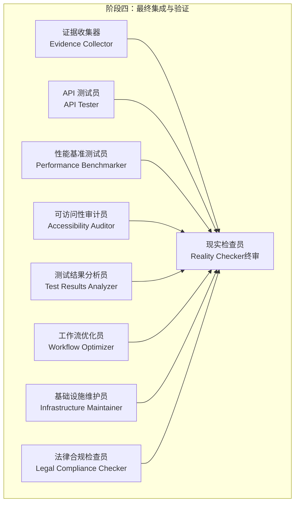
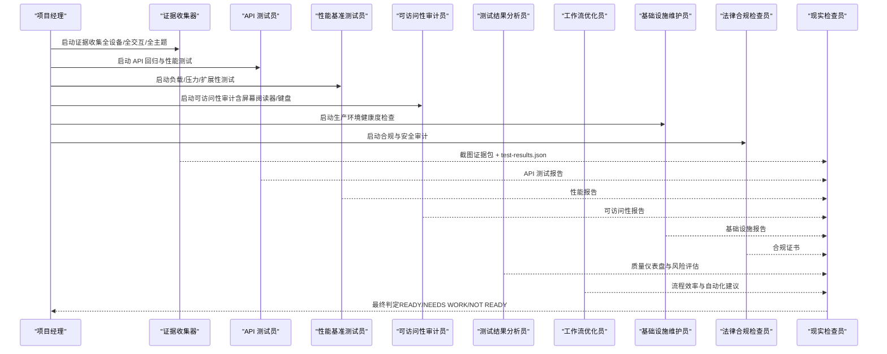
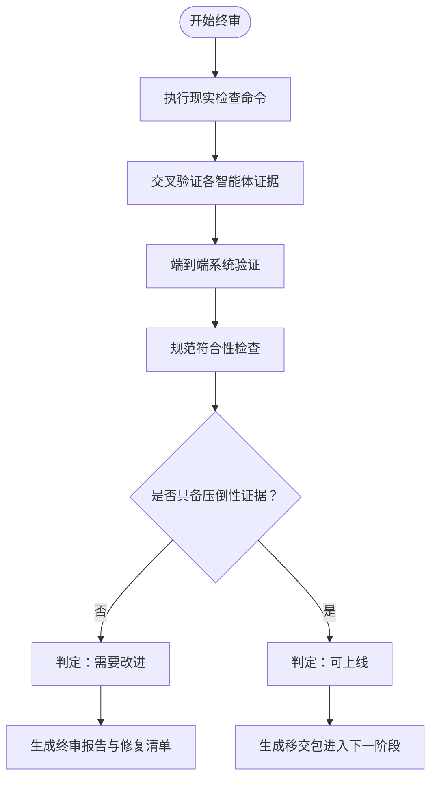
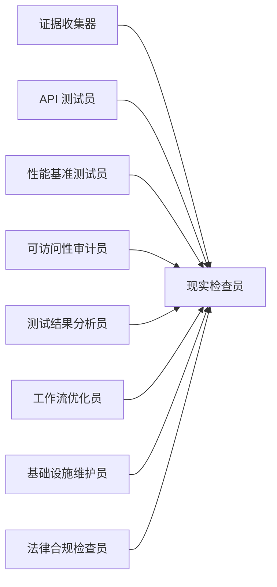

# 阶段四：最终集成与验证

<cite>
**本文引用的文件**
- [testing-reality-checker.md](file://testing/testing-reality-checker.md)
- [phase-4-hardening.md](file://strategy/playbooks/phase-4-hardening.md)
- [testing-evidence-collector.md](file://testing/testing-evidence-collector.md)
- [testing-api-tester.md](file://testing/testing-api-tester.md)
- [testing-performance-benchmarker.md](file://testing/testing-performance-benchmarker.md)
- [testing-accessibility-auditor.md](file://testing/testing-accessibility-auditor.md)
- [testing-test-results-analyzer.md](file://testing/testing-test-results-analyzer.md)
- [testing-workflow-optimizer.md](file://testing/testing-workflow-optimizer.md)
- [support-infrastructure-maintainer.md](file://support/support-infrastructure-maintainer.md)
- [support-legal-compliance-checker.md](file://support/support-legal-compliance-checker.md)
</cite>

## 目录
1. [引言](#引言)
2. [项目结构](#项目结构)
3. [核心组件](#核心组件)
4. [架构总览](#架构总览)
5. [详细组件分析](#详细组件分析)
6. [依赖关系分析](#依赖关系分析)
7. [性能考量](#性能考量)
8. [故障排查指南](#故障排查指南)
9. [结论](#结论)
10. [附录](#附录)

## 引言
本阶段是产品从“可运行”走向“可发布”的最终关卡。目标是通过系统化的证据收集、交叉验证与最终判定，确保系统在真实用户场景下具备端到端的稳定性、一致性与合规性，并形成可追溯、可复现的质量报告与决策依据。本阶段由“Reality Checker（现实检查员）”作为唯一“终审把关者”，默认“需要改进”，除非能以无可辩驳的证据证明已达到生产就绪水平。

## 项目结构
阶段四围绕“证据收集—交叉验证—系统验证—最终判定”四大步骤展开，协同多个测试与支持类智能体，形成闭环的质量门禁。

图表来源
- [phase-4-hardening.md:30-256](file://strategy/playbooks/phase-4-hardening.md#L30-L256)

章节来源
- [phase-4-hardening.md:1-333](file://strategy/playbooks/phase-4-hardening.md#L1-L333)

## 核心组件
- 证据收集器：负责生成全设备、全交互、全主题的自动化截图证据包，并进行“现实检查命令”验证，确保“所见即所得”。
- API 测试员：执行端到端 API 回归测试，覆盖认证授权、输入校验、错误响应、并发与边缘场景，输出可追溯的测试报告。
- 性能基准测试员：以 k6 等工具进行负载、压力、持续与扩展性测试，产出核心 Web 指标与瓶颈分析。
- 可访问性审计员：基于 WCAG 2.2 AA 的标准，结合屏幕阅读器与键盘导航，发现自动化工具难以覆盖的可用性问题。
- 测试结果分析员：对多源测试数据进行统计分析，识别模式、预测缺陷、评估发布风险，生成质量仪表盘与建议。
- 工作流优化员：从流程效率角度审视 Dev↔QA 循环，提出自动化与过程改进建议，支撑长期运营质量。
- 基础设施维护员：验证生产环境健康度、监控告警、灾备与安全配置，确保部署前置条件满足。
- 法律合规检查员：验证隐私政策、数据加密、认证安全、监管合规与可访问性要求，形成合规证书。
- 现实检查员（终审）：整合上述证据，进行跨域一致性、端到端用户旅程、规范符合性与性能验证，最终给出“READY/NEEDS WORK/NOT READY”。

章节来源
- [testing-evidence-collector.md:1-211](file://testing/testing-evidence-collector.md#L1-L211)
- [testing-api-tester.md:1-306](file://testing/testing-api-tester.md#L1-L306)
- [testing-performance-benchmarker.md:1-268](file://testing/testing-performance-benchmarker.md#L1-L268)
- [testing-accessibility-auditor.md:1-317](file://testing/testing-accessibility-auditor.md#L1-L317)
- [testing-test-results-analyzer.md:1-305](file://testing/testing-test-results-analyzer.md#L1-L305)
- [testing-workflow-optimizer.md:1-450](file://testing/testing-workflow-optimizer.md#L1-L450)
- [support-infrastructure-maintainer.md](file://support/support-infrastructure-maintainer.md)
- [support-legal-compliance-checker.md](file://support/support-legal-compliance-checker.md)
- [testing-reality-checker.md:1-237](file://testing/testing-reality-checker.md#L1-L237)

## 架构总览
阶段四采用“并行证据采集 + 并行分析 + 串行终审”的流水线式架构，确保各维度质量要素被独立验证后，再由现实检查员进行统一裁决。

图表来源
- [phase-4-hardening.md:30-256](file://strategy/playbooks/phase-4-hardening.md#L30-L256)

## 详细组件分析

### 现实检查员（终审把关者）
- 角色定位：最终集成测试与生产就绪性评估的“现实检查员”，默认“需要改进”，需以压倒性证据才可判定“READY”。
- 关键职责：
  - 步骤一：执行“现实检查命令”，核对实现物、交叉验证宣称功能、抓取专业级截图、审查 test-results.json。
  - 步骤二：交叉验证各智能体证据，确认 QA 发现、API 结果、性能数据与合规结论一致。
  - 步骤三：端到端系统验证，覆盖完整用户旅程、跨设备一致性、交互连贯性与性能指标。
  - 步骤四：规范符合性检查，逐条比对原始规格与实际实现，形成差距分析与合规结论。
- 自动失败触发：
  - 夸大宣传（零缺陷、完美评分、奢侈品宣称、无证生产就绪）。
  - 缺失证据（无法提供截图、证据与宣称不符、问题仍存在）。
  - 系统性问题（用户旅程断裂、跨设备不一致、性能超阈、交互失效）。
- 报告模板：包含“现实检查验证、完整系统证据、集成测试结果、问题汇总、质量认证、部署准备评估、成功指标”等模块。

图表来源
- [testing-reality-checker.md:39-256](file://testing/testing-reality-checker.md#L39-L256)

章节来源
- [testing-reality-checker.md:1-237](file://testing/testing-reality-checker.md#L1-L237)

### 证据收集器（视觉证据与规格对照）
- 方法论：以 Playwright 截图为核心，覆盖桌面、平板、移动端与主题切换；对比“实际实现 vs. 规格原文”，记录差距。
- 关键流程：
  - 步骤一：执行现实检查命令（截图、列出构建产物、搜索宣称特性、审查 test-results.json）。
  - 步骤二：可视化证据分析，明确“所见即所得”的质量等级。
  - 步骤三：交互元素专项测试（手风琴、表单、导航、移动端、主题切换）。
- 自动失败触发：宣称与证据不符、截图缺失、功能断裂、基础样式冒充“奢侈品”。

章节来源
- [testing-evidence-collector.md:1-211](file://testing/testing-evidence-collector.md#L1-L211)

### API 测试员（端到端 API 回归与性能）
- 方法论：功能、性能、安全三线并进，使用现代框架构建自动化套件，覆盖认证、授权、输入校验、错误处理、并发与边缘场景。
- 关键交付：端点回归报告、性能 SLA 符合性、安全漏洞评估、可扩展性与资源利用率分析。

章节来源
- [testing-api-tester.md:1-306](file://testing/testing-api-tester.md#L1-L306)

### 性能基准测试员（负载/压力/扩展性）
- 方法论：以 k6 为代表的负载测试，设计暖机、正常、峰值、持续峰值、压力与冷却阶段，建立阈值与置信区间。
- 关键交付：负载/压力/可扩展性/耐久性测试结果、Core Web Vitals 分析、数据库与应用层瓶颈分析、优化建议与 ROI 评估。

章节来源
- [testing-performance-benchmarker.md:1-268](file://testing/testing-performance-benchmarker.md#L1-L268)

### 可访问性审计员（WCAG 2.2 AA）
- 方法论：自动化扫描 + 屏幕阅读器 + 键盘导航 + 视觉测试（缩放、高对比、减少动态），识别自动化工具难以发现的可用性问题。
- 关键交付：可访问性审计报告、问题分级与修复建议、重测计划与验证清单。

章节来源
- [testing-accessibility-auditor.md:1-317](file://testing/testing-accessibility-auditor.md#L1-L317)

### 测试结果分析员（质量度量与风险评估）
- 方法论：统计分析、趋势建模、缺陷预测、风险量化，输出质量仪表盘与发布建议。
- 关键交付：整体质量得分、类别分解、问题优先级、风险概率与影响、去噪建议与改进机会。

章节来源
- [testing-test-results-analyzer.md:1-305](file://testing/testing-test-results-analyzer.md#L1-L305)

### 工作流优化员（Dev↔QA 循环与自动化）
- 方法论：瓶颈识别、流程映射、自动化机会评估、实施路线图与 ROI 分析。
- 关键交付：流程效率分析、瓶颈与时间到解决统计、自动化建议与实施计划。

章节来源
- [testing-workflow-optimizer.md:1-450](file://testing/testing-workflow-optimizer.md#L1-L450)

### 基础设施维护员（生产就绪性检查）
- 关键检查项：服务健康、自动伸缩、负载均衡、SSL/TLS、监控告警、日志聚合、灾备与恢复、防火墙与密钥管理、漏洞扫描清零。

章节来源
- [support-infrastructure-maintainer.md](file://support/support-infrastructure-maintainer.md)

### 法律合规检查员（隐私/安全/监管/可访问性）
- 关键检查项：隐私政策准确性、同意管理、数据主体权利、Cookie 同意、数据加密、认证安全、输入净化、OWASP Top 10、GDPR/CCPA/行业特定要求、WCAG 2.1 AA。

章节来源
- [support-legal-compliance-checker.md](file://support/support-legal-compliance-checker.md)

## 依赖关系分析
阶段四各智能体之间存在“输入-输出”与“证据共享”的依赖关系，最终由现实检查员进行统一裁决。

图表来源
- [phase-4-hardening.md:30-256](file://strategy/playbooks/phase-4-hardening.md#L30-L256)

章节来源
- [phase-4-hardening.md:257-333](file://strategy/playbooks/phase-4-hardening.md#L257-L333)

## 性能考量
- 性能基线：所有系统必须在 95% 置信度下满足 SLA；Web 性能以 Core Web Vitals 为参考，关注 LCP、FID、CLS 等指标。
- 负载策略：至少 10 倍于预期流量的负载测试，识别 P95 响应时间、吞吐量、错误率与资源利用情况。
- 扩展性：验证水平/垂直扩展能力与成本-性能权衡，评估数据库与缓存策略的有效性。
- 回归与监控：将性能测试纳入 CI/CD，建立性能回归门禁与实时监控预警。

## 故障排查指南
- 截图证据缺失或与宣称不符：回溯证据收集器的现实检查命令，确认 Playwright 截图与 test-results.json 是否齐全。
- 用户旅程断裂：结合现实检查员的端到端验证清单，逐环节比对 before/after 截图与 test-results.json 的交互状态。
- 性能超阈：由性能基准测试员提供 P95、吞吐量与资源利用报告，定位数据库查询、缓存与网络瓶颈。
- 可访问性问题：依据可访问性审计员的报告，优先修复关键/严重问题，确保键盘与屏幕阅读器可用性。
- 合规与安全：法律合规检查员提供合规证书与漏洞扫描结果，确保隐私与安全控制到位。
- 基础设施问题：基础设施维护员验证生产环境健康度、监控与灾备，确保部署前置条件满足。

章节来源
- [testing-reality-checker.md:122-141](file://testing/testing-reality-checker.md#L122-L141)
- [testing-performance-benchmarker.md:42-56](file://testing/testing-performance-benchmarker.md#L42-L56)
- [testing-accessibility-auditor.md:48-67](file://testing/testing-accessibility-auditor.md#L48-L67)
- [support-legal-compliance-checker.md](file://support/support-legal-compliance-checker.md)
- [support-infrastructure-maintainer.md](file://support/support-infrastructure-maintainer.md)

## 结论
阶段四通过“证据驱动、交叉验证、系统验证、最终判定”的闭环机制，将“主观评级”转化为“客观证据”，将“功能完成”升级为“用户可用”。现实检查员以“需要改进”为默认立场，只有当证据足以证明系统在端到端用户旅程、跨设备一致性、性能与合规方面均达到生产就绪水平时，方可授予“READY”。这一过程既保障了质量门槛，也为后续发布与运营打下坚实基础。

## 附录

### 最终验收标准与质量阈值
- 用户旅程完整：关键路径端到端工作（截图证据）。
- 跨设备一致性：桌面/平板/移动端均可用（响应式截图）。
- 性能达标：P95 < 200ms、LCP < 2.5s、可用性 > 99.9%（性能报告）。
- 安全验证：零关键漏洞（安全扫描 + 合规报告）。
- 合规认证：隐私、认证、输入净化、监管与可访问性全部满足（合规证书）。
- 规范符合：100% 实现规格要求（逐条比对与差距分析）。
- 基础设施就绪：生产环境健康、监控告警、灾备与安全配置完备（基础设施报告）。

章节来源
- [phase-4-hardening.md:259-268](file://strategy/playbooks/phase-4-hardening.md#L259-L268)

### 验收报告模板（摘要）
- 现实检查验证：执行的命令、收集的证据、交叉验证结论。
- 完整系统证据：全设备截图、用户旅程截图序列、跨浏览器对比。
- 集成测试结果：端到端旅程、跨设备一致性、性能验证、规范符合性。
- 综合问题评估：QA 未解决问题、新增问题、关键/中等问题清单。
- 真实质量认证：总体质量等级、设计实现层级、系统完成度、生产就绪状态。
- 部署准备评估：状态、所需修复、上线时间预估、是否需要修订周期。
- 下一步成功指标：具体改进方向、质量目标、证明改进所需的截图/测试。

章节来源
- [testing-reality-checker.md:142-202](file://testing/testing-reality-checker.md#L142-L202)

### 风险评估与发布决策
- 风险评估：基于测试结果分析员的质量仪表盘与趋势模型，量化关键风险的概率与影响。
- 决策标准：仅当“证据压倒性支持 READY”且“所有质量阈值达标”时批准发布；否则退回至“需要改进”并进入修订循环。
- 回归测试策略：将性能、API 与可访问性测试纳入 CI/CD，建立性能回归门禁与可访问性验收标准。

章节来源
- [testing-test-results-analyzer.md:28-56](file://testing/testing-test-results-analyzer.md#L28-L56)
- [phase-4-hardening.md:269-333](file://strategy/playbooks/phase-4-hardening.md#L269-L333)