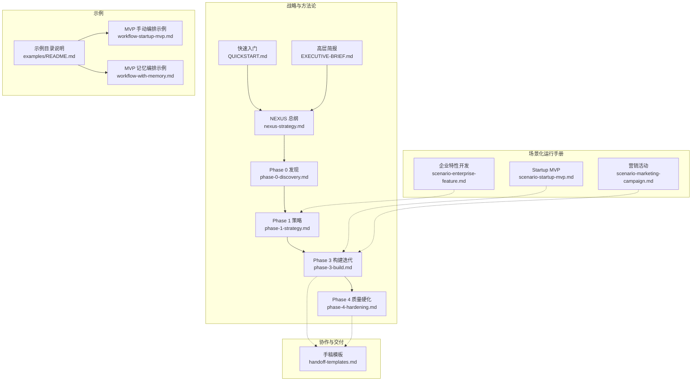
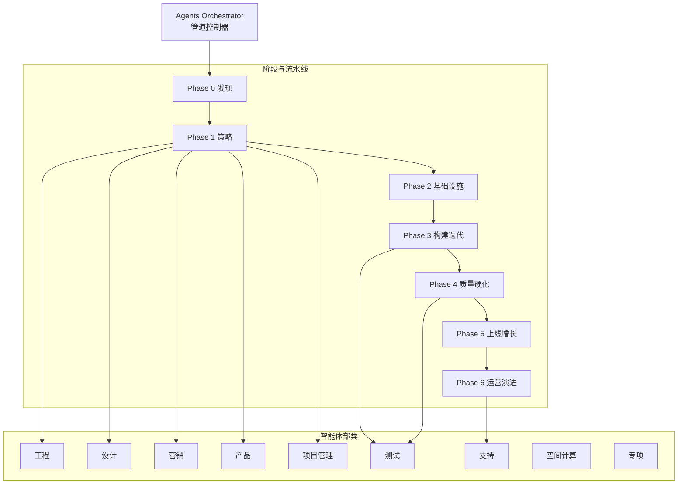
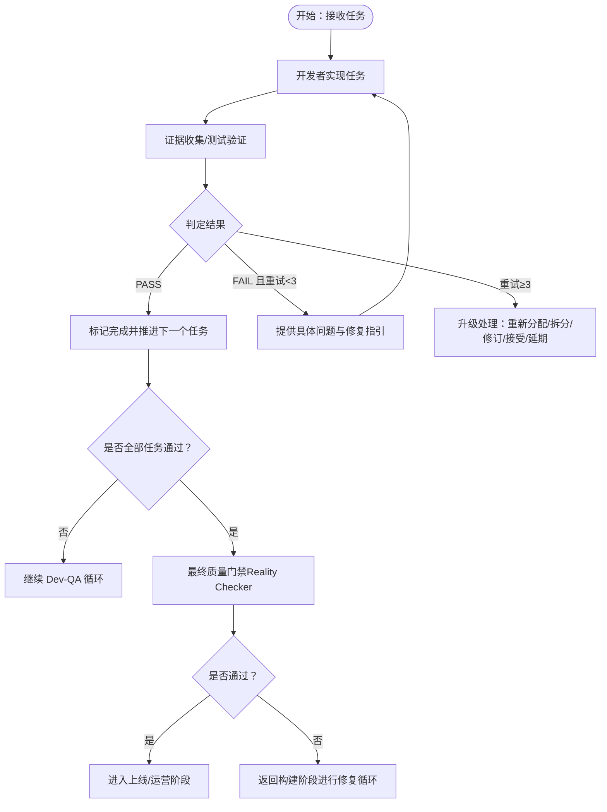
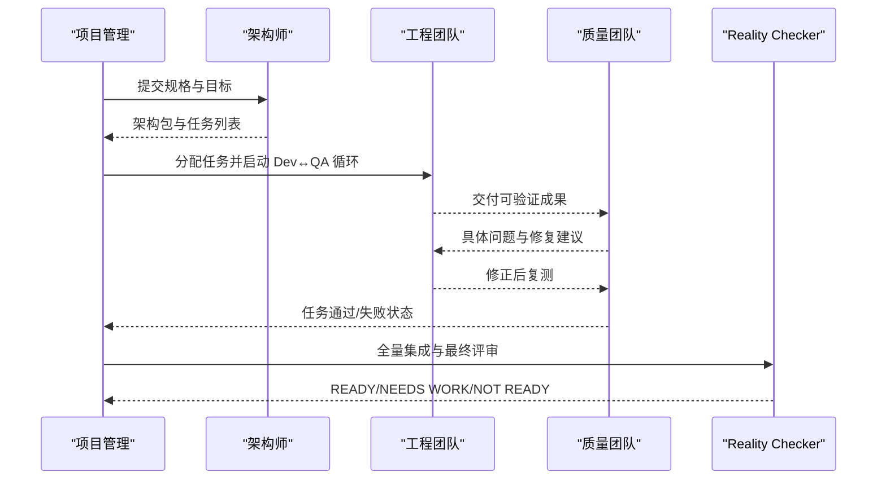
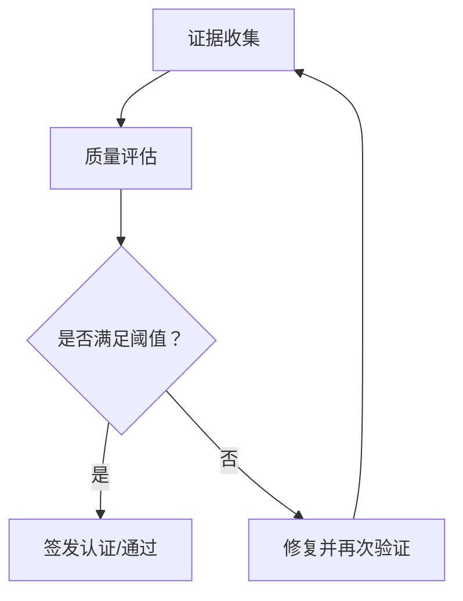
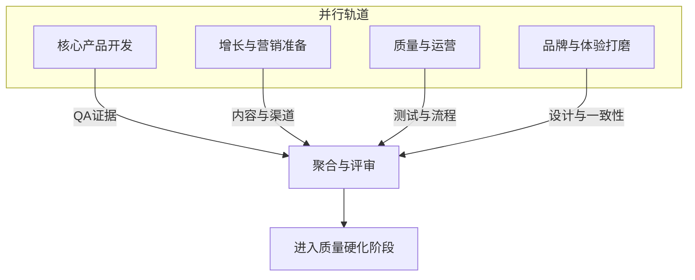
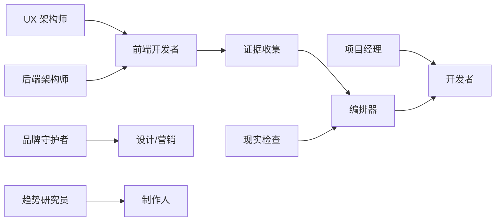

# 工作流编排

<cite>
**本文引用的文件**
- [specialized/agents-orchestrator.md](file://specialized/agents-orchestrator.md)
- [strategy/QUICKSTART.md](file://strategy/QUICKSTART.md)
- [strategy/nexus-strategy.md](file://strategy/nexus-strategy.md)
- [strategy/EXECUTIVE-BRIEF.md](file://strategy/EXECUTIVE-BRIEF.md)
- [strategy/playbooks/phase-0-discovery.md](file://strategy/playbooks/phase-0-discovery.md)
- [strategy/playbooks/phase-1-strategy.md](file://strategy/playbooks/phase-1-strategy.md)
- [strategy/playbooks/phase-3-build.md](file://strategy/playbooks/phase-3-build.md)
- [strategy/playbooks/phase-4-hardening.md](file://strategy/playbooks/phase-4-hardening.md)
- [strategy/coordination/handoff-templates.md](file://strategy/coordination/handoff-templates.md)
- [examples/README.md](file://examples/README.md)
- [examples/workflow-startup-mvp.md](file://examples/workflow-startup-mvp.md)
- [examples/workflow-with-memory.md](file://examples/workflow-with-memory.md)
- [strategy/runbooks/scenario-startup-mvp.md](file://strategy/runbooks/scenario-startup-mvp.md)
- [strategy/runbooks/scenario-enterprise-feature.md](file://strategy/runbooks/scenario-enterprise-feature.md)
- [strategy/runbooks/scenario-marketing-campaign.md](file://strategy/runbooks/scenario-marketing-campaign.md)
</cite>

## 目录
1. [简介](#简介)
2. [项目结构](#项目结构)
3. [核心组件](#核心组件)
4. [架构总览](#架构总览)
5. [详细组件分析](#详细组件分析)
6. [依赖关系分析](#依赖关系分析)
7. [性能考量](#性能考量)
8. [故障排查指南](#故障排查指南)
9. [结论](#结论)
10. [附录](#附录)

## 简介
本文件面向 agency-agents 的工作流编排系统，系统性阐述 Agents Orchestrator 的职责与用法，覆盖多代理协调、工作流管理、质量门禁机制；并基于 NEXUS 战略文档体系，说明从快速入门到分阶段执行（Phase 0-6）再到运行手册的设计理念与落地方法。文档同时给出复杂项目的编排模式、质量保证流程、定制化工作流的方法论与实践案例，帮助读者在不同场景中高效落地。

## 项目结构
该仓库围绕“多智能体编排”构建了完整的战略与执行体系：
- 战略与方法论：QUICKSTART、EXECUTIVE-BRIEF、nexus-strategy 及各阶段 Playbook
- 协作与交付：Handoff 模板、质量门禁、风险与度量
- 场景化运行手册：Startup MVP、Enterprise Feature、Marketing Campaign 等
- 示例与演示：多代理协同输出样例、带记忆的自动化编排示例

图表来源
- [strategy/QUICKSTART.md:1-195](file://strategy/QUICKSTART.md#L1-L195)
- [strategy/EXECUTIVE-BRIEF.md:1-96](file://strategy/EXECUTIVE-BRIEF.md#L1-L96)
- [strategy/nexus-strategy.md:1-800](file://strategy/nexus-strategy.md#L1-L800)
- [strategy/playbooks/phase-0-discovery.md:1-179](file://strategy/playbooks/phase-0-discovery.md#L1-L179)
- [strategy/playbooks/phase-1-strategy.md:1-239](file://strategy/playbooks/phase-1-strategy.md#L1-L239)
- [strategy/playbooks/phase-3-build.md:1-287](file://strategy/playbooks/phase-3-build.md#L1-L287)
- [strategy/playbooks/phase-4-hardening.md:1-333](file://strategy/playbooks/phase-4-hardening.md#L1-L333)
- [strategy/coordination/handoff-templates.md:1-358](file://strategy/coordination/handoff-templates.md#L1-L358)
- [examples/README.md:1-49](file://examples/README.md#L1-L49)
- [examples/workflow-startup-mvp.md:1-156](file://examples/workflow-startup-mvp.md#L1-L156)
- [examples/workflow-with-memory.md:1-239](file://examples/workflow-with-memory.md#L1-L239)
- [strategy/runbooks/scenario-startup-mvp.md:1-155](file://strategy/runbooks/scenario-startup-mvp.md#L1-L155)
- [strategy/runbooks/scenario-enterprise-feature.md:1-158](file://strategy/runbooks/scenario-enterprise-feature.md#L1-L158)
- [strategy/runbooks/scenario-marketing-campaign.md:1-188](file://strategy/runbooks/scenario-marketing-campaign.md#L1-L188)

章节来源
- [strategy/QUICKSTART.md:1-195](file://strategy/QUICKSTART.md#L1-L195)
- [strategy/EXECUTIVE-BRIEF.md:1-96](file://strategy/EXECUTIVE-BRIEF.md#L1-L96)
- [strategy/nexus-strategy.md:1-800](file://strategy/nexus-strategy.md#L1-L800)

## 核心组件
- Agents Orchestrator：全生命周期的管道控制器，负责多代理协调、任务推进、质量门禁、状态追踪与报告生成。其职责包括：
  - 阶段间质量门禁与决策
  - 任务级 Dev-QA 循环与重试策略
  - 上下游上下文传递与证据要求
  - 进度与质量指标统计与汇报
- NEXUS 模式与阶段：提供三种部署模式（Full/Sprint/Micro），以及七阶段流水线（Discovery → Strategy → Foundation → Build → Harden → Launch → Operate）。
- 质量门禁与证据：每个阶段与关键节点均设定明确门槛与证据清单，Reality Checker 作为最终权威裁决者。
- 协作与交付：标准化的手稿模板、QA 反馈与升级流程，确保上下文连续与可追溯。

章节来源
- [specialized/agents-orchestrator.md:1-367](file://specialized/agents-orchestrator.md#L1-L367)
- [strategy/nexus-strategy.md:70-800](file://strategy/nexus-strategy.md#L70-L800)
- [strategy/coordination/handoff-templates.md:1-358](file://strategy/coordination/handoff-templates.md#L1-L358)

## 架构总览
NEXUS 将九大学科部类的智能体组织为统一的编排网络，通过阶段化的流水线与质量门禁实现端到端交付。Agents Orchestrator 作为控制器贯穿全流程，协调工程、设计、营销、产品、项目管理、测试、支持、空间计算与专项智能体。

图表来源
- [strategy/nexus-strategy.md:75-116](file://strategy/nexus-strategy.md#L75-L116)
- [strategy/QUICKSTART.md:21-42](file://strategy/QUICKSTART.md#L21-L42)

## 详细组件分析

### Agents Orchestrator 组件分析
- 角色定位：自主型管道管理者与质量编排者，负责从规格到交付的完整流程控制。
- 关键能力：
  - 多代理协调与上下文传递
  - 任务级 Dev-QA 循环与重试上限
  - 质量门禁与最终裁决
  - 进度追踪与报告模板
- 决策逻辑：
  - 逐任务验证，PASS 后进入下一任务；FAIL 则回退开发者并附带具体反馈；超过最大重试次数则升级处理。
  - 仅在全部任务 PASS 后进入最终集成与验收。
- 可用智能体矩阵：涵盖工程、设计、营销、产品、项目管理、测试、支持、空间计算与专项智能体，按任务类型自动匹配。

图表来源
- [specialized/agents-orchestrator.md:112-168](file://specialized/agents-orchestrator.md#L112-L168)
- [strategy/playbooks/phase-3-build.md:191-232](file://strategy/playbooks/phase-3-build.md#L191-L232)

章节来源
- [specialized/agents-orchestrator.md:1-367](file://specialized/agents-orchestrator.md#L1-L367)
- [strategy/playbooks/phase-3-build.md:1-287](file://strategy/playbooks/phase-3-build.md#L1-L287)

### 阶段化工作流（Phase 0-6）
- Phase 0：情报与发现。并行产出市场、用户、技术、合规与数据评估，由 Executive Summary Generator 形成 GO/NO-GO/PIVOT 决策。
- Phase 1：策略与架构。并行完成战略、品牌、财务与技术架构，形成可执行的架构包与优先级计划。
- Phase 2：基础与脚手架。基础设施、应用骨架与设计系统就绪，CI/CD 与监控可用。
- Phase 3：构建与迭代。Dev↔QA 循环，任务级质量门禁，支持并行多轨道。
- Phase 4：质量与硬化。证据收集、回归测试、性能与合规认证，Reality Checker 最终裁决。
- Phase 5：上线与增长。跨渠道投放、监控与优化。
- Phase 6：运营与演进。持续改进与稳定运营。

图表来源
- [strategy/playbooks/phase-1-strategy.md:1-239](file://strategy/playbooks/phase-1-strategy.md#L1-L239)
- [strategy/playbooks/phase-3-build.md:1-287](file://strategy/playbooks/phase-3-build.md#L1-L287)
- [strategy/playbooks/phase-4-hardening.md:1-333](file://strategy/playbooks/phase-4-hardening.md#L1-L333)

章节来源
- [strategy/playbooks/phase-0-discovery.md:1-179](file://strategy/playbooks/phase-0-discovery.md#L1-L179)
- [strategy/playbooks/phase-1-strategy.md:1-239](file://strategy/playbooks/phase-1-strategy.md#L1-L239)
- [strategy/playbooks/phase-3-build.md:1-287](file://strategy/playbooks/phase-3-build.md#L1-L287)
- [strategy/playbooks/phase-4-hardening.md:1-333](file://strategy/playbooks/phase-4-hardening.md#L1-L333)

### 质量保证流程（证据收集、现实检查、性能基准）
- 证据收集：针对每个任务与阶段，要求截图、测试报告与数据证据，避免“仅凭声明”。
- 现实检查：Reality Checker 以“NEEDS WORK”为默认立场，需以证据证明生产就绪。
- 性能基准：负载测试、核心 Web 指标与可用性门槛，确保上线即稳定。

图表来源
- [strategy/playbooks/phase-4-hardening.md:32-139](file://strategy/playbooks/phase-4-hardening.md#L32-L139)
- [strategy/playbooks/phase-4-hardening.md:141-214](file://strategy/playbooks/phase-4-hardening.md#L141-L214)
- [strategy/playbooks/phase-4-hardening.md:216-255](file://strategy/playbooks/phase-4-hardening.md#L216-L255)

章节来源
- [strategy/playbooks/phase-4-hardening.md:1-333](file://strategy/playbooks/phase-4-hardening.md#L1-L333)

### 复杂项目编排模式
- 并行多轨道：核心产品、增长营销、质量运营、品牌体验四轨并行，缩短整体周期。
- 依赖管理：有依赖的任务等待前置任务通过 QA 后再启动，无依赖任务可并发执行。
- 跨阶段交接：通过标准化手稿模板与证据清单，确保上下文完整与可追溯。

图表来源
- [strategy/playbooks/phase-3-build.md:77-132](file://strategy/playbooks/phase-3-build.md#L77-L132)

章节来源
- [strategy/playbooks/phase-3-build.md:1-287](file://strategy/playbooks/phase-3-build.md#L1-L287)

### 实际应用案例与成功模式
- Startup MVP：从概念到可运营的最小可行产品，强调快速验证与阶段性质量门禁。
- 企业特性开发：强调合规、安全与治理，采用更严格的架构评审与质量门槛。
- 营销活动：跨平台、数据驱动与品牌一致性，强调策略先行与效果追踪。

章节来源
- [examples/workflow-startup-mvp.md:1-156](file://examples/workflow-startup-mvp.md#L1-L156)
- [examples/workflow-with-memory.md:1-239](file://examples/workflow-with-memory.md#L1-L239)
- [strategy/runbooks/scenario-startup-mvp.md:1-155](file://strategy/runbooks/scenario-startup-mvp.md#L1-L155)
- [strategy/runbooks/scenario-enterprise-feature.md:1-158](file://strategy/runbooks/scenario-enterprise-feature.md#L1-L158)
- [strategy/runbooks/scenario-marketing-campaign.md:1-188](file://strategy/runbooks/scenario-marketing-campaign.md#L1-L188)

## 依赖关系分析
- 智能体依赖矩阵：明确各部类之间的产出与消费关系，确保上游交付物成为下游输入。
- 关键交接对：如项目经理→开发者、架构师→前端、证据收集→编排器、现实检查→编排器等，形成高频率、高价值的交接链路。
- 风险与升级路径：针对技术债、安全、性能、品牌、范围蔓延、预算、合规、市场变化、瓶颈与质量回归等风险，明确负责人与响应时间。

图表来源
- [strategy/nexus-strategy.md:554-594](file://strategy/nexus-strategy.md#L554-L594)
- [strategy/nexus-strategy.md:729-744](file://strategy/nexus-strategy.md#L729-L744)

章节来源
- [strategy/nexus-strategy.md:554-744](file://strategy/nexus-strategy.md#L554-L744)

## 性能考量
- 并行执行：多轨道并行显著压缩周期，典型可节省 40%-60%。
- Dev↔QA 循环：在早期捕获缺陷，减少后期硬化时间。
- 证据驱动：避免“幻想审批”，提升质量与交付稳定性。
- 流程效率：通过流程优化与工具评估持续改进。

## 故障排查指南
- 手稿模板：标准化的交接文档、QA 反馈与升级报告，确保问题可追溯与可修复。
- 升级流程：超过最大重试次数的任务进入升级通道，明确根因分析与解决建议。
- 阶段门禁失败：由门禁守卫生成失败报告，编排器路由至相关责任人，最多三次重审。

章节来源
- [strategy/coordination/handoff-templates.md:1-358](file://strategy/coordination/handoff-templates.md#L1-L358)
- [strategy/nexus-strategy.md:716-725](file://strategy/nexus-strategy.md#L716-L725)

## 结论
NEXUS 将多智能体协作从“散点式专家”升级为“统一编排网络”，通过阶段化流水线、质量门禁与证据驱动，实现从洞察到交付的稳定与高效。Agents Orchestrator 作为控制器，确保上下文连续、过程可审计、结果可验证。结合运行手册与示例，可在不同场景中快速复制成功模式，并根据项目需求灵活定制阶段顺序、里程碑与风险管理策略。

## 附录
- 快速入门：三分钟选择模式，五分钟激活 NEXUS-Full/Sprint/Micro。
- 高层简报：总结关键发现、业务影响与推荐行动。
- 模板与手册：标准化手稿、QA 反馈、升级报告、场景化运行手册与示例输出。

章节来源
- [strategy/QUICKSTART.md:1-195](file://strategy/QUICKSTART.md#L1-L195)
- [strategy/EXECUTIVE-BRIEF.md:1-96](file://strategy/EXECUTIVE-BRIEF.md#L1-L96)
- [examples/README.md:1-49](file://examples/README.md#L1-L49)