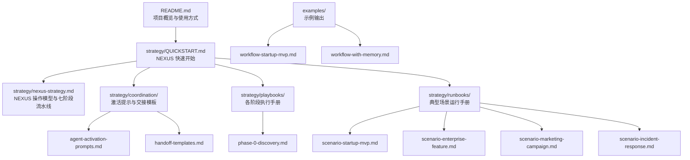
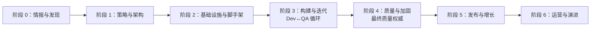
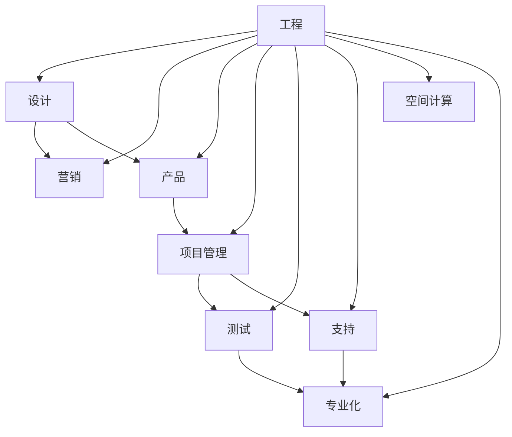

# NEXUS 快速开始指南

<cite>
**本文引用的文件**
- [README.md](file://README.md)
- [QUICKSTART.md](file://strategy/QUICKSTART.md)
- [nexus-strategy.md](file://strategy/nexus-strategy.md)
- [agent-activation-prompts.md](file://strategy/coordination/agent-activation-prompts.md)
- [handoff-templates.md](file://strategy/coordination/handoff-templates.md)
- [phase-0-discovery.md](file://strategy/playbooks/phase-0-discovery.md)
- [scenario-startup-mvp.md](file://strategy/runbooks/scenario-startup-mvp.md)
- [scenario-enterprise-feature.md](file://strategy/runbooks/scenario-enterprise-feature.md)
- [scenario-marketing-campaign.md](file://strategy/runbooks/scenario-marketing-campaign.md)
- [scenario-incident-response.md](file://strategy/runbooks/scenario-incident-response.md)
- [workflow-startup-mvp.md](file://examples/workflow-startup-mvp.md)
- [workflow-with-memory.md](file://examples/workflow-with-memory.md)
- [examples/README.md](file://examples/README.md)
</cite>

## 目录
1. [简介](#简介)
2. [项目结构](#项目结构)
3. [核心组件](#核心组件)
4. [架构总览](#架构总览)
5. [详细组件分析](#详细组件分析)
6. [依赖关系分析](#依赖关系分析)
7. [性能考虑](#性能考虑)
8. [故障排查指南](#故障排查指南)
9. [结论](#结论)
10. [附录](#附录)

## 简介
本指南面向希望在 5 分钟内从零开始建立“协调的多代理管道”的用户。NEXUS 将 The Agency 的 AI 专家整合为统一的“网络”，通过明确的角色分工、严格的证据驱动质量门禁、标准化的代理交接与 Dev↔QA 循环，实现从发现到运营的全生命周期协同。

## 项目结构
- 核心文档位于 strategy 目录，包含 NEXUS 操作模型、分阶段执行手册、激活提示与交接模板。
- examples 目录提供真实场景示例，展示多代理协作的实际效果。
- 各专业领域（工程、设计、营销、产品、项目管理、测试、支持、空间计算、专业化）下均有对应 agent 文件，体现“强个性、可交付、可度量”的设计哲学。

图表来源
- [README.md](file://README.md)
- [QUICKSTART.md](file://strategy/QUICKSTART.md)
- [nexus-strategy.md](file://strategy/nexus-strategy.md)
- [agent-activation-prompts.md](file://strategy/coordination/agent-activation-prompts.md)
- [handoff-templates.md](file://strategy/coordination/handoff-templates.md)
- [phase-0-discovery.md](file://strategy/playbooks/phase-0-discovery.md)
- [scenario-startup-mvp.md](file://strategy/runbooks/scenario-startup-mvp.md)
- [scenario-enterprise-feature.md](file://strategy/runbooks/scenario-enterprise-feature.md)
- [scenario-marketing-campaign.md](file://strategy/runbooks/scenario-marketing-campaign.md)
- [scenario-incident-response.md](file://strategy/runbooks/scenario-incident-response.md)
- [workflow-startup-mvp.md](file://examples/workflow-startup-mvp.md)
- [workflow-with-memory.md](file://examples/workflow-with-memory.md)

章节来源
- [README.md](file://README.md)
- [QUICKSTART.md](file://strategy/QUICKSTART.md)

## 核心组件
- NEXUS 模式选择
  - NEXUS-Full：完整项目，覆盖所有阶段，适合企业级产品从零到一。
  - NEXUS-Sprint：功能或 MVP，聚焦短周期迭代，适合 2-6 周的特性开发。
  - NEXUS-Micro：具体任务，如缺陷修复、内容活动、合规审计等，适合 1-5 天的专项任务。
- 关键概念
  - 质量门禁：每个阶段必须通过门禁才能进入下一阶段。
  - Dev↔QA 循环：每个任务先实现再验证，失败最多重试 3 次，随后升级处理。
  - 代理交接：结构化上下文传递，避免“冷启动”。
  - 证据优先：以截图、测试结果、数据为准，而非口头陈述。
  - 最终质量权威：Reality Checker 默认“需要改进”，需用充分证据证明“已就绪”。

章节来源
- [QUICKSTART.md](file://strategy/QUICKSTART.md)
- [nexus-strategy.md](file://strategy/nexus-strategy.md)

## 架构总览
NEXUS 的七阶段流水线将“情报与发现 → 策略与架构 → 基础设施与脚手架 → 构建与迭代 → 质量与加固 → 发布与增长 → 运营与演进”串联起来；每个阶段之间设置质量门禁，并通过代理交接模板确保上下文连续性。

图表来源
- [nexus-strategy.md](file://strategy/nexus-strategy.md)

## 详细组件分析

### 三种模式与激活提示模板
- NEXUS-Full（完整项目）
  - 适用：企业级产品从零到一，12-24 周。
  - 激活要点：明确项目名称与规格，按阶段清单逐项推进，严格证据要求与最大重试次数。
  - 参考路径：[QUICKSTART.md](file://strategy/QUICKSTART.md)
- NEXUS-Sprint（功能或 MVP）
  - 适用：2-6 周的特性开发或 MVP 构建。
  - 激活要点：跳过阶段 0（市场已验证），直接从阶段 1 开始，强调 Dev↔QA 循环与最终质量门禁。
  - 参考路径：[scenario-startup-mvp.md](file://strategy/runbooks/scenario-startup-mvp.md)
- NEXUS-Micro（具体任务）
  - 适用：缺陷修复、营销活动、合规审计、性能诊断、市场研究、UX 改进等专项任务。
  - 激活要点：按场景选择合适代理组合，明确范围与证据要求，必要时进行回溯与修复。
  - 参考路径：[QUICKSTART.md](file://strategy/QUICKSTART.md)

章节来源
- [QUICKSTART.md](file://strategy/QUICKSTART.md)
- [scenario-startup-mvp.md](file://strategy/runbooks/scenario-startup-mvp.md)

### 质量门禁与最终质量权威
- 阶段门禁
  - 阶段 0 → 1：发现门禁（Executive Summary Generator）
  - 阶段 1 → 2：架构门禁（Studio Producer + Reality Checker）
  - 阶段 2 → 3：基础门禁（DevOps Automator + Evidence Collector）
  - 阶段 3 → 4：特性门禁（Agents Orchestrator）
  - 阶段 4 → 5：生产门禁（Reality Checker 独任）
  - 阶段 5 → 6：发布门禁（Studio Producer + Analytics Reporter）
- 最终质量权威
  - Reality Checker 默认“需要改进”，需用充分证据证明“已就绪”。
  - 参考路径：[nexus-strategy.md](file://strategy/nexus-strategy.md)

章节来源
- [nexus-strategy.md](file://strategy/nexus-strategy.md)

### Dev↔QA 循环与重试机制
- 流程
  - 开发者实现任务 → Evidence Collector 或相应 QA 代理验证 → PASS 则进入下一任务；FAIL 则反馈问题与修复指令，最多重试 3 次；超过 3 次则升级处理。
- 任务分配矩阵
  - 不同类型任务由不同开发者代理负责，QA 代理与专项支持代理配合，确保质量与效率。
- 参考路径：[nexus-strategy.md](file://strategy/nexus-strategy.md)

章节来源
- [nexus-strategy.md](file://strategy/nexus-strategy.md)

### 代理交接与证据收集
- 标准交接模板
  - 包含元数据、上下文、交付请求、验收标准、证据要求与后续交接对象。
- QA 反馈协议
  - 明确失败原因、证据来源、修复指令与再次提交规则。
- 升级与风险处理
  - 超过重试上限的任务进入升级报告，包含失败历史、根因分析与建议方案。
- 参考路径：[handoff-templates.md](file://strategy/coordination/handoff-templates.md)

章节来源
- [handoff-templates.md](file://strategy/coordination/handoff-templates.md)

### 典型场景运行手册
- 启动式 MVP（4-6 周）
  - 团队组成：Agents Orchestrator、Senior Project Manager、Sprint Prioritizer、UX Architect、Frontend Developer、Backend Architect、DevOps Automator、Evidence Collector、Reality Checker。
  - 执行节奏：压缩发现与架构 → 基础设施与脚手架 → 核心构建与 QA 循环 → 质量冲刺与最终检查 → 发布与优化。
  - 参考路径：[scenario-startup-mvp.md](file://strategy/runbooks/scenario-startup-mvp.md)
- 企业特性开发（6-12 周）
  - 团队组成：跨职能团队 + 合规与治理 + 质量保证。
  - 执行节奏：需求与架构 → 基础设施 → 构建与 QA → 质量与加固 → 上线与监控。
  - 参考路径：[scenario-enterprise-feature.md](file://strategy/runbooks/scenario-enterprise-feature.md)
- 多渠道营销活动（2-4 周）
  - 团队组成：Social Media Strategist、Content Creator、平台专家、品牌与合规支持。
  - 执行节奏：策略与内容 → 预热与发布 → 优化与复盘。
  - 参考路径：[scenario-marketing-campaign.md](file://strategy/runbooks/scenario-marketing-campaign.md)
- 生产事故响应（分钟到小时）
  - 严重级别分级与响应团队，检测 → 调查 → 缓解 → 验证 → 复盘。
  - 参考路径：[scenario-incident-response.md](file://strategy/runbooks/scenario-incident-response.md)

章节来源
- [scenario-startup-mvp.md](file://strategy/runbooks/scenario-startup-mvp.md)
- [scenario-enterprise-feature.md](file://strategy/runbooks/scenario-enterprise-feature.md)
- [scenario-marketing-campaign.md](file://strategy/runbooks/scenario-marketing-campaign.md)
- [scenario-incident-response.md](file://strategy/runbooks/scenario-incident-response.md)

### 实际案例与多代理协作
- 示例：空间发现练习
  - 场景：8 个代理并行评估一个软件机会，产出统一的产品蓝图。
  - 参考路径：[examples/README.md](file://examples/README.md)
- 示例：从想法到上线的 MVP 工作流
  - 步骤：Sprint Prioritizer → UX Researcher → Backend Architect → Frontend Developer → 中期与最终 Reality Check → 发布与优化。
  - 参考路径：[workflow-startup-mvp.md](file://examples/workflow-startup-mvp.md)
- 示例：带持久记忆的多代理工作流
  - 优势：自动回忆上下文、减少复制粘贴、支持回滚与恢复。
  - 参考路径：[workflow-with-memory.md](file://examples/workflow-with-memory.md)

章节来源
- [examples/README.md](file://examples/README.md)
- [workflow-startup-mvp.md](file://examples/workflow-startup-mvp.md)
- [workflow-with-memory.md](file://examples/workflow-with-memory.md)

## 依赖关系分析
- 代理间依赖矩阵
  - 工程、设计、营销、产品、项目管理、测试、支持、空间计算、专业化等九个部门之间存在明确的产出与消费关系。
- 关键交接对
  - Senior Project Manager → 开发者：任务清单
  - UX Architect → 前端开发者：CSS 设计系统与布局规范
  - Backend Architect → 前端开发者：API 规范
  - Evidence Collector → Agents Orchestrator：QA 结果
  - Reality Checker → Agents Orchestrator：集成结论
- 参考路径：[nexus-strategy.md](file://strategy/nexus-strategy.md)

图表来源
- [nexus-strategy.md](file://strategy/nexus-strategy.md)

章节来源
- [nexus-strategy.md](file://strategy/nexus-strategy.md)

## 性能考虑
- Dev↔QA 循环中的性能目标
  - API 响应时间 P95 < 200ms
  - 页面加载时间 LCP < 2.5s
  - 系统可用性 > 99.9%
- 质量门禁指标
  - 首次通过 QA 率 > 70%
  - 平均重试次数 < 1.5
  - 质量门禁首次通过率 > 80%

章节来源
- [nexus-strategy.md](file://strategy/nexus-strategy.md)

## 故障排查指南
- 常见问题
  - 上下文丢失：使用标准交接模板，确保“元数据、上下文、交付请求、证据要求、后续交接对象”齐全。
  - 任务反复失败：遵循 QA 反馈协议，仅修复反馈的问题，避免引入新功能；超过 3 次则进入升级报告。
  - 门禁未通过：对照质量门禁清单逐条核验证据，补齐缺失材料。
  - 事故响应不及时：按严重级别激活相应团队，遵循检测→调查→缓解→验证→复盘的流程。
- 参考路径：[handoff-templates.md](file://strategy/coordination/handoff-templates.md)、[scenario-incident-response.md](file://strategy/runbooks/scenario-incident-response.md)

章节来源
- [handoff-templates.md](file://strategy/coordination/handoff-templates.md)
- [scenario-incident-response.md](file://strategy/runbooks/scenario-incident-response.md)

## 结论
NEXUS 通过“模式化部署、证据驱动的质量门禁、标准化的代理交接与 Dev↔QA 循环”，将 The Agency 的 AI 专家转化为可预测、可扩展的智能协作网络。无论你是构建 MVP、企业特性，还是开展营销活动或处理生产事故，都可以在 5 分钟内选择合适的模式并启动协调的多代理管道。

## 附录
- 快速开始步骤
  - 选择模式：NEXUS-Full、NEXUS-Sprint 或 NEXUS-Micro
  - 使用激活提示模板：在 Agents Orchestrator 中声明模式与项目信息，按阶段清单激活相应代理
  - 严格遵守质量门禁与 Dev↔QA 循环，使用交接模板传递上下文
  - 在需要时启用持久记忆（MCP Memory）以减少手工交接成本
- 参考路径：[QUICKSTART.md](file://strategy/QUICKSTART.md)、[agent-activation-prompts.md](file://strategy/coordination/agent-activation-prompts.md)、[handoff-templates.md](file://strategy/coordination/handoff-templates.md)、[workflow-with-memory.md](file://examples/workflow-with-memory.md)

章节来源
- [QUICKSTART.md](file://strategy/QUICKSTART.md)
- [agent-activation-prompts.md](file://strategy/coordination/agent-activation-prompts.md)
- [handoff-templates.md](file://strategy/coordination/handoff-templates.md)
- [workflow-with-memory.md](file://examples/workflow-with-memory.md)