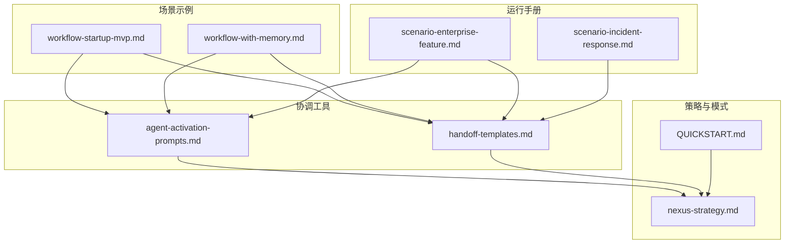
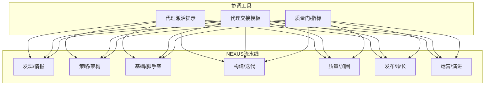
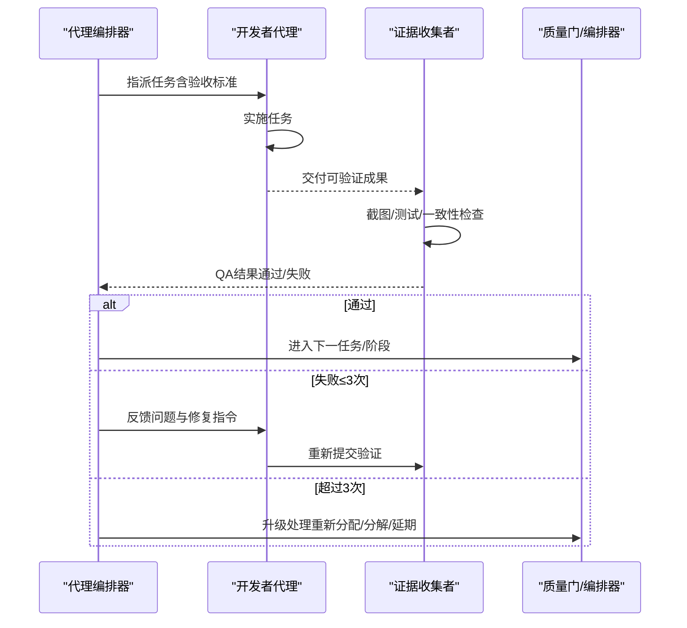
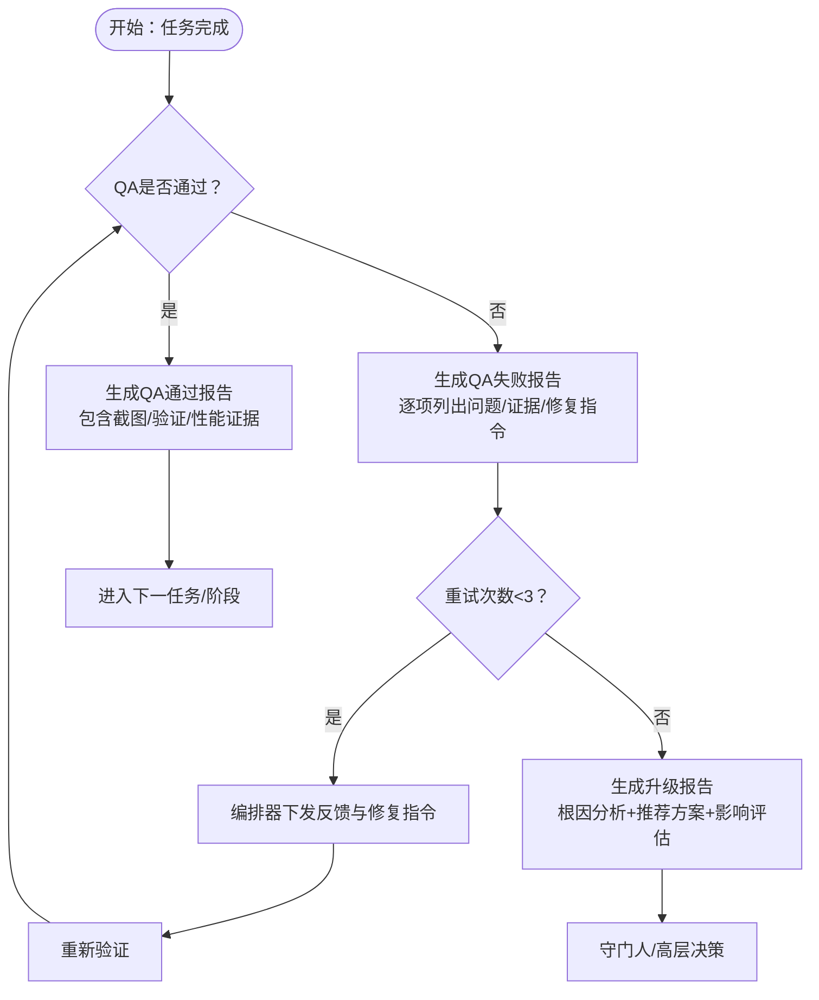
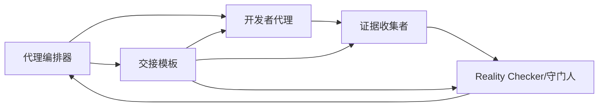

# 协调工具与模板

<cite>
**本文引用的文件**
- [agent-activation-prompts.md](file://strategy/coordination/agent-activation-prompts.md)
- [handoff-templates.md](file://strategy/coordination/handoff-templates.md)
- [nexus-strategy.md](file://strategy/nexus-strategy.md)
- [QUICKSTART.md](file://strategy/QUICKSTART.md)
- [workflow-startup-mvp.md](file://examples/workflow-startup-mvp.md)
- [workflow-with-memory.md](file://examples/workflow-with-memory.md)
- [scenario-enterprise-feature.md](file://strategy/runbooks/scenario-enterprise-feature.md)
- [scenario-incident-response.md](file://strategy/runbooks/scenario-incident-response.md)
</cite>

## 目录
1. [简介](#简介)
2. [项目结构](#项目结构)
3. [核心组件](#核心组件)
4. [架构总览](#架构总览)
5. [详细组件分析](#详细组件分析)
6. [依赖关系分析](#依赖关系分析)
7. [性能考量](#性能考量)
8. [故障排除指南](#故障排除指南)
9. [结论](#结论)
10. [附录](#附录)

## 简介
本文件系统化梳理“协调工具与模板”，聚焦两类关键资产：
- 代理激活提示（Agent Activation Prompts）：为不同角色与场景提供即用型提示词模板，确保代理在正确阶段、按正确流程、携带完整上下文执行任务。
- 代理交接模板（Handoff Templates）：标准化跨代理工作移交的格式，涵盖标准交接、QA反馈、升级报告、阶段门、冲刺交接、事件响应等场景，确保上下文连续性与可追溯性。

通过这些工具，NEXUS实现多代理高效协作、降低沟通成本、提升交付质量与效率，并提供可操作的使用示例与故障排除建议。

## 项目结构
围绕“协调工具与模板”的相关文件主要位于 strategy/coordination 与 strategy 下的策略与运行手册中，同时 examples 与 runbooks 提供真实场景演练与参考。

图表来源
- [agent-activation-prompts.md:1-402](file://strategy/coordination/agent-activation-prompts.md#L1-L402)
- [handoff-templates.md:1-358](file://strategy/coordination/handoff-templates.md#L1-L358)
- [nexus-strategy.md:1-1111](file://strategy/nexus-strategy.md#L1-L1111)
- [QUICKSTART.md:1-195](file://strategy/QUICKSTART.md#L1-L195)
- [workflow-startup-mvp.md:1-156](file://examples/workflow-startup-mvp.md#L1-L156)
- [workflow-with-memory.md:1-239](file://examples/workflow-with-memory.md#L1-L239)
- [scenario-enterprise-feature.md:1-158](file://strategy/runbooks/scenario-enterprise-feature.md#L1-L158)
- [scenario-incident-response.md:1-218](file://strategy/runbooks/scenario-incident-response.md#L1-L218)

章节来源
- [agent-activation-prompts.md:1-402](file://strategy/coordination/agent-activation-prompts.md#L1-L402)
- [handoff-templates.md:1-358](file://strategy/coordination/handoff-templates.md#L1-L358)
- [nexus-strategy.md:1-1111](file://strategy/nexus-strategy.md#L1-L1111)
- [QUICKSTART.md:1-195](file://strategy/QUICKSTART.md#L1-L195)
- [workflow-startup-mvp.md:1-156](file://examples/workflow-startup-mvp.md#L1-L156)
- [workflow-with-memory.md:1-239](file://examples/workflow-with-memory.md#L1-L239)
- [scenario-enterprise-feature.md:1-158](file://strategy/runbooks/scenario-enterprise-feature.md#L1-L158)
- [scenario-incident-response.md:1-218](file://strategy/runbooks/scenario-incident-response.md#L1-L218)

## 核心组件
- 代理激活提示（Agent Activation Prompts）
  - 面向不同角色（工程、设计、测试、产品、支持、空间计算、专门化等）与场景（全生命周期、冲刺、微任务），提供标准化提示词模板，明确任务目标、参考文档、验收标准、质量要求与后续动作。
  - 关键特性：可复制即用、参数占位符清晰、与NEXUS阶段/质量门一致。
- 代理交接模板（Handoff Templates）
  - 标准化跨代理工作移交，包含元数据、上下文、交付请求、质量期望等；覆盖QA通过/失败、升级报告、阶段门、冲刺交接、事件响应等场景。
  - 关键特性：结构化字段、证据要求、可追踪的升级路径。

章节来源
- [agent-activation-prompts.md:7-402](file://strategy/coordination/agent-activation-prompts.md#L7-L402)
- [handoff-templates.md:7-358](file://strategy/coordination/handoff-templates.md#L7-L358)

## 架构总览
NEXUS将多代理编排为统一的流水线，协调工具与模板贯穿每个阶段与边界，确保“上下文连续、证据驱动、质量门禁、快速失败”。

图表来源
- [nexus-strategy.md:75-116](file://strategy/nexus-strategy.md#L75-L116)
- [nexus-strategy.md:118-127](file://strategy/nexus-strategy.md#L118-L127)
- [QUICKSTART.md:21-42](file://strategy/QUICKSTART.md#L21-L42)

## 详细组件分析

### 代理激活提示（Agent Activation Prompts）
- 设计原则
  - 明确阶段与模式：支持 Full/Sprint/Micro 三种部署模式，匹配不同项目规模与时长。
  - 角色职责清晰：为工程、设计、测试、产品、支持、空间计算、专门化等各分部定义具体角色与交付物。
  - 质量优先：强调证据导向、无质量门不前进、最大重试次数限制、QA循环。
  - 上下文完整：要求携带规范、设计系统、品牌指南、API规范等参考材料。
- 参数配置与占位符
  - 项目名称、阶段、任务ID/描述、验收标准、参考文档路径、时间约束、假设与度量等。
- 最佳实践
  - 使用前先激活“代理编排器”（Agents Orchestrator）进行全局控制与质量门管理。
  - 在Dev↔QA循环中，开发者完成→证据收集者验证→通过则进入下一任务，失败则最多重试三次并记录升级。
  - 严格遵循验收标准与证据要求，避免主观判断。

图表来源
- [agent-activation-prompts.md:36-59](file://strategy/coordination/agent-activation-prompts.md#L36-L59)
- [nexus-strategy.md:291-314](file://strategy/nexus-strategy.md#L291-L314)

章节来源
- [agent-activation-prompts.md:7-402](file://strategy/coordination/agent-activation-prompts.md#L7-L402)
- [nexus-strategy.md:291-314](file://strategy/nexus-strategy.md#L291-L314)

### 代理交接模板（Handoff Templates）
- 标准交接模板
  - 元数据：来源/去向代理、阶段、任务引用、优先级、时间戳。
  - 上下文：项目、当前状态、相关文件、依赖、约束。
  - 交付请求：具体可测量的交付物、验收标准、参考材料。
  - 质量期望：必须通过的质量标准、所需证据、下一步接收方与格式。
- QA反馈模板
  - PASS：列出截图、功能验证、品牌一致性、可访问性、性能等证据。
  - FAIL：逐项列出问题类别/严重性、预期/实际差异、证据、修复指令、需修改文件列表，并给出重试指引。
- 升级报告模板
  - 记录三次尝试的历史、根因分析、推荐解决方案（重分配/分解/修订/接受/延期）、影响评估与决策要求。
- 阶段门交接模板
  - 记录从哪一阶段到下一阶段、守门人、门禁结果、门禁标准结果、携带文档、下一阶段约束、代理激活计划、风险转移。
- 冲刺交接模板
  - 冲刺摘要、完成状态、质量指标、结转任务、回顾洞察、下一冲刺预览。
- 事件响应交接模板
  - 事件分类（P0-P3）、检测与处置、当前状态、交接上下文、利益相关者沟通。

图表来源
- [handoff-templates.md:49-144](file://strategy/coordination/handoff-templates.md#L49-L144)
- [handoff-templates.md:148-204](file://strategy/coordination/handoff-templates.md#L148-L204)
- [nexus-strategy.md:668-700](file://strategy/nexus-strategy.md#L668-L700)

章节来源
- [handoff-templates.md:7-358](file://strategy/coordination/handoff-templates.md#L7-L358)
- [nexus-strategy.md:597-700](file://strategy/nexus-strategy.md#L597-L700)

### 实际使用示例

#### 启动全生命周期项目（NEXUS-Full）
- 步骤要点
  - 激活“代理编排器”于 Full 模式，指定项目与规格。
  - 按阶段顺序执行：发现→策略→基础→构建→质量加固→发布→运营。
  - 每个阶段设置质量门，证据驱动审批。
- 参考
  - [QUICKSTART.md:21-42](file://strategy/QUICKSTART.md#L21-L42)
  - [nexus-strategy.md:75-116](file://strategy/nexus-strategy.md#L75-L116)

#### 启动MVP（NEXUS-Sprint）
- 步骤要点
  - 选择 Sprint 模式，跳过发现阶段，直接进入策略与基础。
  - 团队构成：项目经理、设计师、工程师、QA、支持。
  - Dev↔QA 循环贯穿构建期，Reality Checker 批准后方可发布。
- 参考
  - [QUICKSTART.md:46-67](file://strategy/QUICKSTART.md#L46-L67)
  - [workflow-startup-mvp.md:21-156](file://examples/workflow-startup-mvp.md#L21-L156)

#### 带持久记忆的多代理工作流
- 特点
  - 使用 MCP 内存服务器存储/召回/回滚，消除手工交接粘贴。
  - 每个交付物按项目标签与接收代理标签存储，自动检索。
- 参考
  - [workflow-with-memory.md:26-37](file://examples/workflow-with-memory.md#L26-L37)
  - [workflow-with-memory.md:227-232](file://examples/workflow-with-memory.md#L227-L232)

#### 企业特性开发（NEXUS-Sprint）
- 特点
  - 强合规、强安全、强质量门，多干系人对齐。
  - 分阶段执行：需求与架构→基础→构建→加固→上线→运营。
- 参考
  - [scenario-enterprise-feature.md:1-158](file://strategy/runbooks/scenario-enterprise-feature.md#L1-L158)

#### 事件响应（NEXUS-Micro）
- 特点
  - 严重性分级（P0-P3），按级别激活响应团队。
  - 快速检测→调查→缓解→验证→复盘。
- 参考
  - [scenario-incident-response.md:1-218](file://strategy/runbooks/scenario-incident-response.md#L1-L218)

章节来源
- [QUICKSTART.md:21-67](file://strategy/QUICKSTART.md#L21-L67)
- [workflow-startup-mvp.md:21-156](file://examples/workflow-startup-mvp.md#L21-L156)
- [workflow-with-memory.md:26-37](file://examples/workflow-with-memory.md#L26-L37)
- [scenario-enterprise-feature.md:1-158](file://strategy/runbooks/scenario-enterprise-feature.md#L1-L158)
- [scenario-incident-response.md:1-218](file://strategy/runbooks/scenario-incident-response.md#L1-L218)

## 依赖关系分析
- 协调工具与策略的耦合
  - 代理激活提示与交接模板均与 NEXUS 阶段、质量门、Dev↔QA 循环保持一致。
- 关键依赖链
  - 编排器（Agents Orchestrator）→ 开发者代理 → 证据收集者 → 质量门/守门人 → 下一任务/阶段或升级。
  - 交接模板贯穿所有边界，保证上下文连续与证据可追溯。
- 交叉依赖
  - 不同分部之间存在生产者→消费者依赖，如 UX Architect→Frontend Developer、Backend Architect→Frontend Developer 等。

图表来源
- [nexus-strategy.md:576-594](file://strategy/nexus-strategy.md#L576-L594)
- [nexus-strategy.md:597-700](file://strategy/nexus-strategy.md#L597-L700)

章节来源
- [nexus-strategy.md:576-594](file://strategy/nexus-strategy.md#L576-L594)
- [nexus-strategy.md:597-700](file://strategy/nexus-strategy.md#L597-L700)

## 性能考量
- 减少上下文丢失与重复劳动
  - 使用标准化交接模板与持久记忆，避免手工粘贴与会话超时导致的信息丢失。
- 并行与串行的平衡
  - 在阶段内并行推进多个工作流，同时在边界处设置质量门，避免积压。
- 质量门与重试上限
  - 通过最大重试次数与升级机制，防止低效循环与资源浪费。
- 指标监控
  - 任务首验通过率、平均重试次数、周期时间、质量门通过率等作为持续改进依据。

## 故障排除指南
- 常见问题与对策
  - QA反复失败：使用“QA失败报告”模板逐项列出问题与修复指令，限定仅修复已识别问题，避免引入新功能。
  - 上下文缺失：使用“标准交接模板”强制填写元数据、上下文、相关文件、依赖与约束。
  - 升级无果：使用“升级报告”模板进行根因分析与推荐方案汇总，明确影响与决策要求。
  - 事件响应迟缓：按严重性分级激活相应团队，遵循检测→调查→缓解→验证→复盘流程。
- 工具与流程建议
  - 在 Dev↔QA 循环中坚持“证据优先”，截图与测试报告不可省略。
  - 使用 Pipeline 状态报告模板定期汇报进度与风险，便于高层决策。
  - 对于长期项目，启用持久记忆以减少交接成本与回溯难度。

章节来源
- [handoff-templates.md:49-144](file://strategy/coordination/handoff-templates.md#L49-L144)
- [handoff-templates.md:148-204](file://strategy/coordination/handoff-templates.md#L148-L204)
- [scenario-incident-response.md:51-147](file://strategy/runbooks/scenario-incident-response.md#L51-L147)
- [nexus-strategy.md:1030-1081](file://strategy/nexus-strategy.md#L1030-L1081)

## 结论
通过“代理激活提示”与“代理交接模板”，NEXUS 将多代理协作从“经验驱动”转变为“流程驱动”，显著降低沟通成本、减少上下文丢失、提升交付质量与效率。配合质量门、Dev↔QA 循环与升级机制，形成闭环的协作体系。建议在实际项目中：
- 优先采用标准化模板，确保每次交接都包含必要元数据与证据。
- 在复杂项目中引入持久记忆，减少手工交接负担。
- 定期使用状态报告与指标监控，持续优化流程与产出。

## 附录
- 快速启动
  - 选择模式（Full/Sprint/Micro），复制对应激活提示，按阶段推进并设置质量门。
  - 参考：[QUICKSTART.md:21-120](file://strategy/QUICKSTART.md#L21-L120)
- 场景参考
  - 启动MVP：[workflow-startup-mvp.md:1-156](file://examples/workflow-startup-mvp.md#L1-L156)
  - 带记忆的工作流：[workflow-with-memory.md:1-239](file://examples/workflow-with-memory.md#L1-L239)
  - 企业特性开发：[scenario-enterprise-feature.md:1-158](file://strategy/runbooks/scenario-enterprise-feature.md#L1-L158)
  - 事件响应：[scenario-incident-response.md:1-218](file://strategy/runbooks/scenario-incident-response.md#L1-L218)