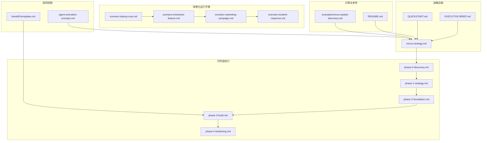
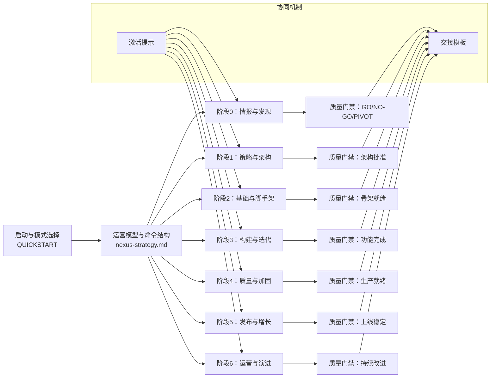
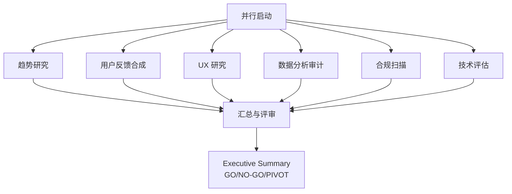
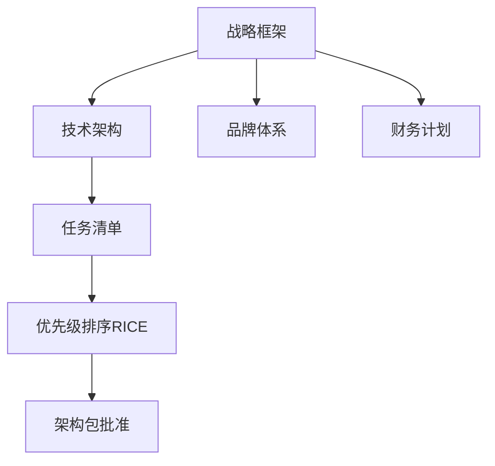
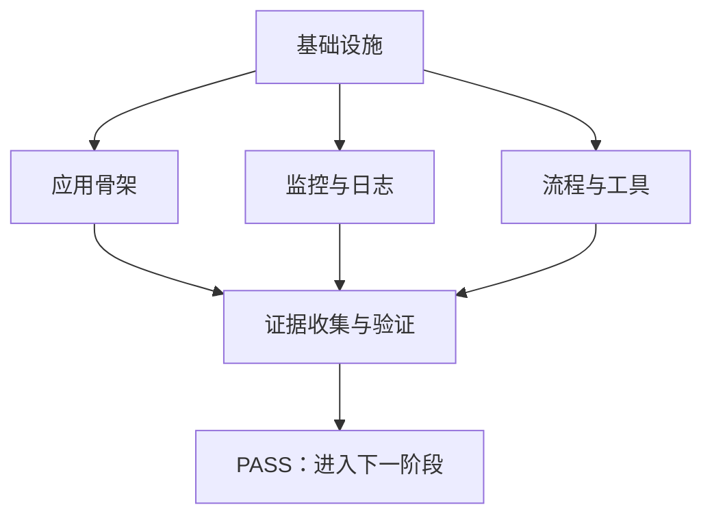
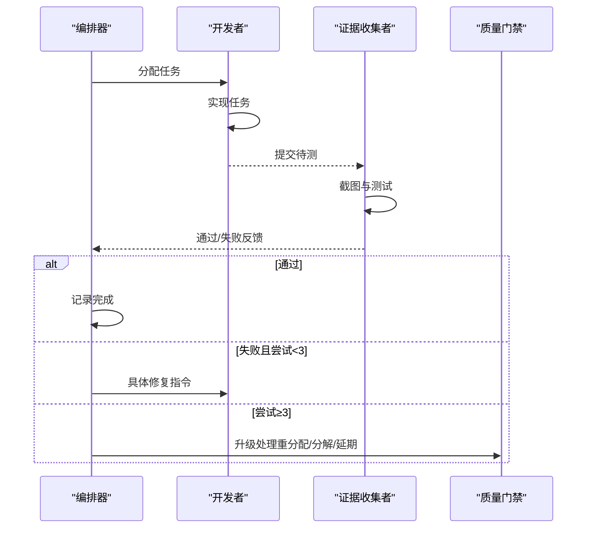
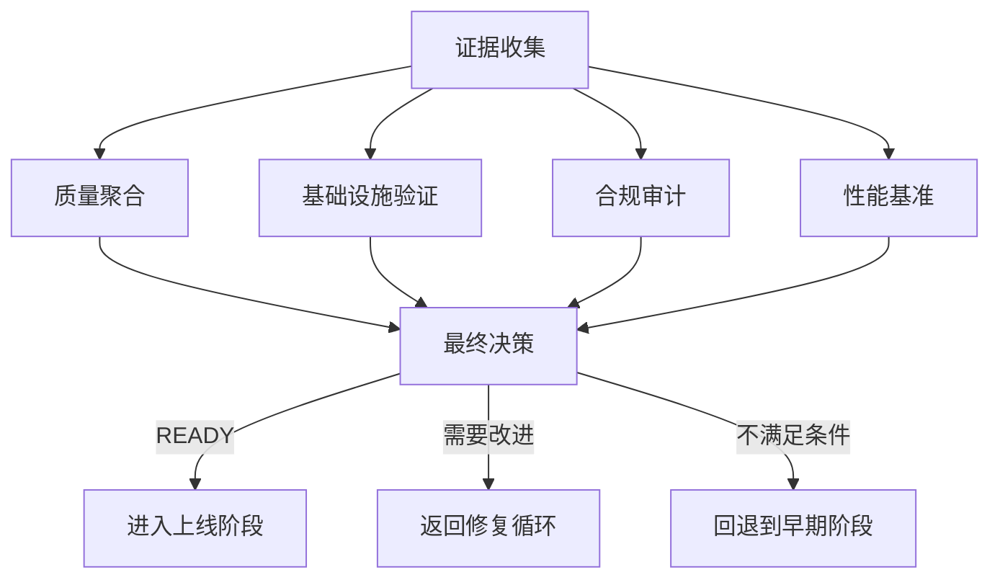
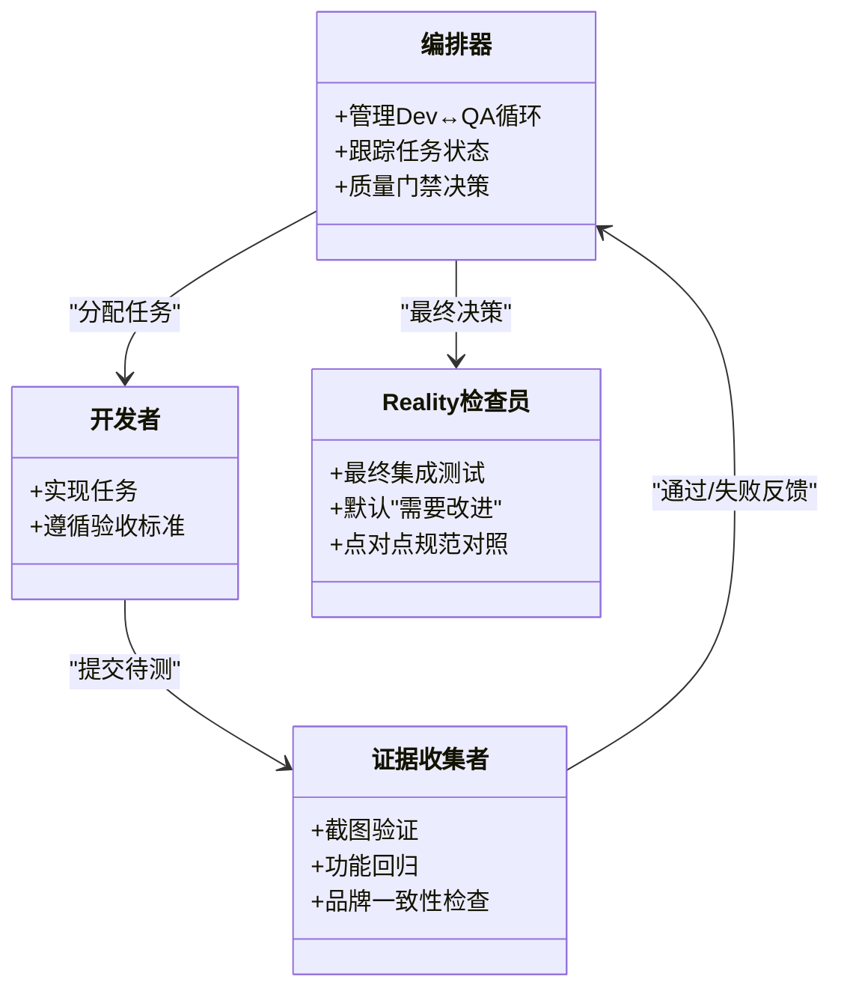
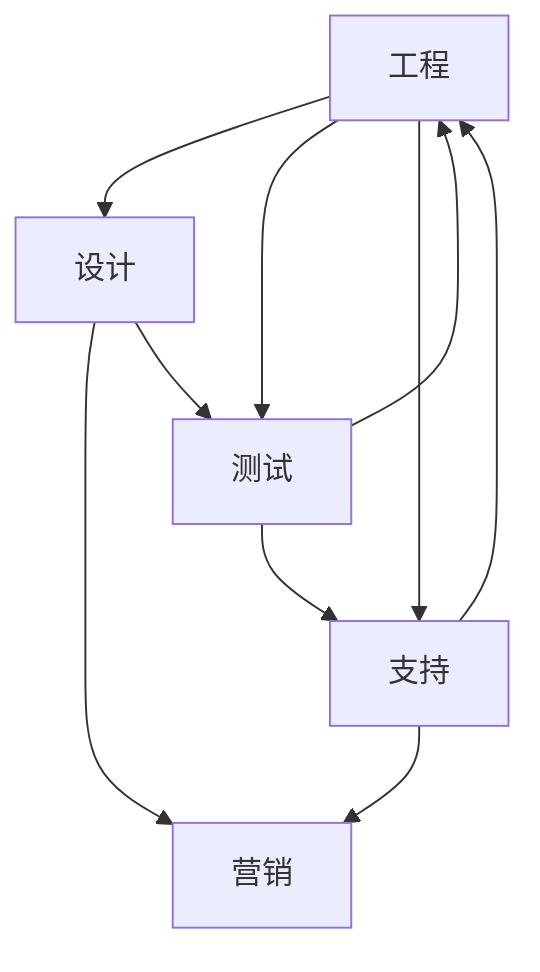

# 战略文档体系

<cite>
**本文档引用的文件**
- [QUICKSTART.md](file://strategy/QUICKSTART.md)
- [nexus-strategy.md](file://strategy/nexus-strategy.md)
- [EXECUTIVE-BRIEF.md](file://strategy/EXECUTIVE-BRIEF.md)
- [README.md](file://README.md)
- [phase-0-discovery.md](file://strategy/playbooks/phase-0-discovery.md)
- [phase-1-strategy.md](file://strategy/playbooks/phase-1-strategy.md)
- [phase-2-foundation.md](file://strategy/playbooks/phase-2-foundation.md)
- [phase-3-build.md](file://strategy/playbooks/phase-3-build.md)
- [phase-4-hardening.md](file://strategy/playbooks/phase-4-hardening.md)
- [scenario-startup-mvp.md](file://strategy/runbooks/scenario-startup-mvp.md)
- [scenario-enterprise-feature.md](file://strategy/runbooks/scenario-enterprise-feature.md)
- [scenario-marketing-campaign.md](file://strategy/runbooks/scenario-marketing-campaign.md)
- [scenario-incident-response.md](file://strategy/runbooks/scenario-incident-response.md)
- [agent-activation-prompts.md](file://strategy/coordination/agent-activation-prompts.md)
- [nexus-spatial-discovery.md](file://examples/nexus-spatial-discovery.md)
</cite>

## 目录
1. [引言](#引言)
2. [项目结构](#项目结构)
3. [核心组件](#核心组件)
4. [架构总览](#架构总览)
5. [详细组件分析](#详细组件分析)
6. [依赖关系分析](#依赖关系分析)
7. [性能考虑](#性能考虑)
8. [故障排除指南](#故障排除指南)
9. [结论](#结论)
10. [附录](#附录)

## 引言
本文件系统性梳理 agency-agents 项目中的战略文档体系，重点围绕 NEXUS 多智能体编排体系，提供从快速上手到分阶段执行、从企业场景到应急响应的完整方法论与实践指南。内容覆盖：
- Nexus 快速开始指南的设计理念与使用方法
- 阶段化工作流（Phase 0-6）的目标、交付物与实施路径
- 运行手册（Runbook）在不同业务场景下的模板与落地步骤
- 实际应用案例与成功模式，帮助团队按需选择策略文档

## 项目结构
战略文档体系由“总纲 + 分阶段执行 + 协同机制 + 场景化运行手册”四层构成，辅以示例输出与工具集成说明。

**图表来源**
- [nexus-strategy.md](file://strategy/nexus-strategy.md)
- [QUICKSTART.md](file://strategy/QUICKSTART.md)
- [EXECUTIVE-BRIEF.md](file://strategy/EXECUTIVE-BRIEF.md)
- [phase-0-discovery.md](file://strategy/playbooks/phase-0-discovery.md)
- [phase-1-strategy.md](file://strategy/playbooks/phase-1-strategy.md)
- [phase-2-foundation.md](file://strategy/playbooks/phase-2-foundation.md)
- [phase-3-build.md](file://strategy/playbooks/phase-3-build.md)
- [phase-4-hardening.md](file://strategy/playbooks/phase-4-hardening.md)
- [scenario-startup-mvp.md](file://strategy/runbooks/scenario-startup-mvp.md)
- [scenario-enterprise-feature.md](file://strategy/runbooks/scenario-enterprise-feature.md)
- [scenario-marketing-campaign.md](file://strategy/runbooks/scenario-marketing-campaign.md)
- [scenario-incident-response.md](file://strategy/runbooks/scenario-incident-response.md)
- [agent-activation-prompts.md](file://strategy/coordination/agent-activation-prompts.md)
- [nexus-spatial-discovery.md](file://examples/nexus-spatial-discovery.md)
- [README.md](file://README.md)

**章节来源**
- [nexus-strategy.md](file://strategy/nexus-strategy.md)
- [QUICKSTART.md](file://strategy/QUICKSTART.md)
- [EXECUTIVE-BRIEF.md](file://strategy/EXECUTIVE-BRIEF.md)
- [README.md](file://README.md)

## 核心组件
- 总体战略：定义 NEXUS 的目标、原则、组织结构与质量门禁，形成统一的多智能体编排范式。
- 分阶段执行：将复杂项目拆解为可验证的阶段性目标，确保每一步都有证据与交付物。
- 协同机制：标准化的激活提示、交接模板与反馈协议，保障跨职能协作的上下文连续性。
- 场景化运行手册：针对不同业务目标（MVP、企业特性、营销活动、应急响应）提供可复用的执行模板。

**章节来源**
- [nexus-strategy.md](file://strategy/nexus-strategy.md)
- [QUICKSTART.md](file://strategy/QUICKSTART.md)
- [EXECUTIVE-BRIEF.md](file://strategy/EXECUTIVE-BRIEF.md)

## 架构总览
NEXUS 将独立的 AI 专家智能体整合为统一的“网络”，通过七阶段流水线、质量门禁与证据驱动的决策机制，实现从洞察到运营的闭环。

**图表来源**
- [nexus-strategy.md](file://strategy/nexus-strategy.md)
- [QUICKSTART.md](file://strategy/QUICKSTART.md)
- [phase-0-discovery.md](file://strategy/playbooks/phase-0-discovery.md)
- [phase-1-strategy.md](file://strategy/playbooks/phase-1-strategy.md)
- [phase-2-foundation.md](file://strategy/playbooks/phase-2-foundation.md)
- [phase-3-build.md](file://strategy/playbooks/phase-3-build.md)
- [phase-4-hardening.md](file://strategy/playbooks/phase-4-hardening.md)

## 详细组件分析

### Nexus 快速开始指南（设计理念与使用方法）
- 设计理念
  - 将分散的智能体整合为“网络”，通过明确的角色分工、任务序列与证据门禁，避免“各自为政”的低效与质量断层。
  - 提供三种部署模式（Full/Sprint/Micro），适配从完整产品生命周期到单次任务执行的不同需求。
- 使用方法
  - 选择模式：根据项目规模与时间窗口选择 NEXUS-Full、NEXUS-Sprint 或 NEXUS-Micro。
  - 启动流水线：按照各阶段 Playbook 的激活顺序与质量门禁要求推进。
  - 关键原则：证据优先、失败快返、上下文连续、并行执行压缩周期。
- 常用工具与参考
  - 策略总纲：nexus-strategy.md
  - 快速上手：QUICKSTART.md
  - 执行清单：各阶段 Playbook 与质量门禁检查表

**章节来源**
- [QUICKSTART.md](file://strategy/QUICKSTART.md)
- [nexus-strategy.md](file://strategy/nexus-strategy.md)

### 阶段化工作流（Phase 0-6）

#### 阶段0：情报与发现（Discovery）
- 目标：在投入资源前验证问题、市场与监管路径，避免盲目开发。
- 主要产出：市场分析、用户洞察、数据基线、合规矩阵、技术栈评估。
- 质量门禁：Executive Summary Generator 综合判定 GO/NO-GO/PIVOT。
- 关键动作：并行工作流（市场情报、用户研究、数据审计、合规扫描、技术评估）收敛至统一摘要。

**图表来源**
- [phase-0-discovery.md](file://strategy/playbooks/phase-0-discovery.md)

**章节来源**
- [phase-0-discovery.md](file://strategy/playbooks/phase-0-discovery.md)
- [nexus-strategy.md](file://strategy/nexus-strategy.md)

#### 阶段1：策略与架构（Strategy & Architecture）
- 目标：在编码前定义“做什么、怎么做、成功标准是什么”，确保架构与预算、品牌一致。
- 主要产出：战略组合计划、品牌体系、财务计划、架构规范、任务清单、优先级计划。
- 质量门禁：双签（Studio Producer + Reality Checker）确认架构包。
- 关键动作：并行完成战略框架、技术架构与优先级排序，随后进行点对点验证。

**图表来源**
- [phase-1-strategy.md](file://strategy/playbooks/phase-1-strategy.md)

**章节来源**
- [phase-1-strategy.md](file://strategy/playbooks/phase-1-strategy.md)
- [nexus-strategy.md](file://strategy/nexus-strategy.md)

#### 阶段2：基础与脚手架（Foundation & Scaffolding）
- 目标：搭建可工作的基础设施与应用骨架，确保后续开发有据可依。
- 主要产出：CI/CD 流水线、数据库与 API 模板、前端骨架与设计系统、监控与日志。
- 质量门禁：DevOps Automator + Evidence Collector 双签。
- 关键动作：基础设施与应用骨架并行，最终以截图证据验收。

**图表来源**
- [phase-2-foundation.md](file://strategy/playbooks/phase-2-foundation.md)

**章节来源**
- [phase-2-foundation.md](file://strategy/playbooks/phase-2-foundation.md)
- [nexus-strategy.md](file://strategy/nexus-strategy.md)

#### 阶段3：构建与迭代（Build & Iterate）
- 目标：通过 Dev↔QA 循环持续交付功能，每个任务都必须先验证再进入下一个任务。
- 核心机制：任务分配矩阵 + 并行构建轨道（核心产品、增长准备、质量与运营、品牌与体验）。
- 质量门禁：Agents Orchestrator 统一跟踪与决策。
- 关键动作：每日状态报告、冲刺评审与回顾、失败最多三次重试，超限则升级处理。

**图表来源**
- [phase-3-build.md](file://strategy/playbooks/phase-3-build.md)

**章节来源**
- [phase-3-build.md](file://strategy/playbooks/phase-3-build.md)
- [nexus-strategy.md](file://strategy/nexus-strategy.md)

#### 阶段4：质量与加固（Quality & Hardening）
- 目标：最终质量门槛，Reality Checker 默认“需要改进”，必须以压倒性证据证明“可以上线”。
- 主要产出：端到端截图证据包、API 回归报告、性能认证、合规证书、基础设施就绪报告。
- 质量门禁：Reality Checker 独任权威，决定 READY/需要改进/不满足条件。
- 关键动作：并行收集证据 → 质量聚合 → 最终集成测试 → 决策与返回修复或进入下一阶段。

**图表来源**
- [phase-4-hardening.md](file://strategy/playbooks/phase-4-hardening.md)

**章节来源**
- [phase-4-hardening.md](file://strategy/playbooks/phase-4-hardening.md)
- [nexus-strategy.md](file://strategy/nexus-strategy.md)

#### 阶段5：发布与增长（Launch & Growth）
- 目标：协调全渠道发布，最大化首日影响，并建立持续优化机制。
- 主要产出：增长策略、内容资产、跨平台活动、部署执行、监控仪表盘。
- 质量门禁：Studio Producer + Analytics Reporter 双签。
- 关键动作：预热（内容、渠道、监控）、上线日（多平台同步）、上线后（数据追踪、A/B 测试、反馈收集）。

**章节来源**
- [nexus-strategy.md](file://strategy/nexus-strategy.md)

#### 阶段6：运营与演进（Operate & Evolve）
- 目标：保持系统稳定与持续改进，将产品从“上线”转为“繁荣”。
- 主要产出：周/月度 KPI 报告、用户反馈分析、合规与风险监控、流程优化建议。
- 关键动作：持续改进循环（测量-分析-计划-行动）与定期高层汇报。

**章节来源**
- [nexus-strategy.md](file://strategy/nexus-strategy.md)

### 运行手册（场景化模板与使用指南）

#### 启动型 MVP（Startup MVP）
- 适用场景：从想法到真实用户的快速验证（4-6 周）。
- 关键要素：压缩发现与架构、核心构建与硬化工序、增长准备与上线优化。
- 成功指标：按时交付、核心功能完整、首用户上线、系统稳定、早期反馈收集。

**章节来源**
- [scenario-startup-mvp.md](file://strategy/runbooks/scenario-startup-mvp.md)
- [nexus-strategy.md](file://strategy/nexus-strategy.md)

#### 企业特性开发（Enterprise Feature）
- 适用场景：在现有企业产品中添加重大特性，强调合规、安全与质量门禁。
- 关键要素：跨部门协调、架构评审、分支管道与灰度发布、合规与治理贯穿始终。
- 成功指标：零关键缺陷、符合 SLA、通过合规审计、可追溯的变更管理。

**章节来源**
- [scenario-enterprise-feature.md](file://strategy/runbooks/scenario-enterprise-feature.md)
- [nexus-strategy.md](file://strategy/nexus-strategy.md)

#### 营销活动（Marketing Campaign）
- 适用场景：多渠道协同的营销活动，强调内容一致性、平台适配与数据驱动优化。
- 关键要素：跨平台策略、内容生产、实时监测与优化、A/B 测试与合规审查。
- 成功指标：触达与互动目标达成、转化率达标、品牌一致性与合规无风险。

**章节来源**
- [scenario-marketing-campaign.md](file://strategy/runbooks/scenario-marketing-campaign.md)
- [nexus-strategy.md](file://strategy/nexus-strategy.md)

#### 应急响应（Incident Response）
- 适用场景：生产事故的快速响应与恢复，强调分级、并行调查与事后复盘。
- 关键要素：严重级别分类、响应团队配置、决策树与缓解路径、沟通模板与后事复盘。
- 成功指标：MTTR 显著降低、影响面最小化、流程固化与预防措施落地。

**章节来源**
- [scenario-incident-response.md](file://strategy/runbooks/scenario-incident-response.md)
- [nexus-strategy.md](file://strategy/nexus-strategy.md)

### 协同机制（激活提示、交接模板与反馈协议）
- 激活提示：为每个智能体提供可直接复制使用的激活模板，包含角色、输入、约束与期望产物。
- 交接模板：标准化的上下文传递格式，确保“无代理冷启动”。
- 反馈协议：针对失败任务的可操作反馈与升级流程，限制最大重试次数并设定升级路径。

**图表来源**
- [agent-activation-prompts.md](file://strategy/coordination/agent-activation-prompts.md)
- [phase-3-build.md](file://strategy/playbooks/phase-3-build.md)
- [phase-4-hardening.md](file://strategy/playbooks/phase-4-hardening.md)

**章节来源**
- [agent-activation-prompts.md](file://strategy/coordination/agent-activation-prompts.md)
- [phase-3-build.md](file://strategy/playbooks/phase-3-build.md)
- [phase-4-hardening.md](file://strategy/playbooks/phase-4-hardening.md)

### 实际应用案例与成功模式
- 全局产品发现示例：一次会话内完成市场验证、技术架构、品牌策略、上市计划与空间界面设计的统一蓝图，体现“并行协作、无协调成本”的能力边界。
- 成功模式建议：
  - 新功能开发：优先采用 NEXUS-Sprint，以“架构评审 + Dev↔QA 循环 + 质量门禁”控制范围与风险。
  - 上线发布：以 Phase 5 为主线，结合营销活动 Runbook，确保渠道协同与监控到位。
  - 生产事故：立即启用应急响应 Runbook，按严重级别配置响应团队与决策树，缩短 MTTR。
  - MVP 验证：采用 Startup MVP Runbook，压缩发现与架构，聚焦核心功能与快速上线。

**章节来源**
- [nexus-spatial-discovery.md](file://examples/nexus-spatial-discovery.md)
- [scenario-startup-mvp.md](file://strategy/runbooks/scenario-startup-mvp.md)
- [scenario-marketing-campaign.md](file://strategy/runbooks/scenario-marketing-campaign.md)
- [scenario-incident-response.md](file://strategy/runbooks/scenario-incident-response.md)

## 依赖关系分析
- 跨职能依赖：设计、工程、测试、支持等多部门产出相互依赖，通过依赖矩阵与关键交接对进行可视化管理。
- 任务依赖：在 Dev↔QA 循环中严格遵循依赖顺序，避免阻塞；并行轨道在无依赖时同时推进。
- 工具链依赖：CI/CD、监控、日志、合规扫描、性能基准等基础设施作为质量门禁的支撑。

**图表来源**
- [nexus-strategy.md](file://strategy/nexus-strategy.md)

**章节来源**
- [nexus-strategy.md](file://strategy/nexus-strategy.md)

## 性能考虑
- 时间压缩：通过并行工作流与 Dev↔QA 循环，典型项目可压缩 40%-60% 的周期。
- 质量前置：在早期引入证据门禁与自动化测试，减少后期返工与回归成本。
- 资源效率：以最小可行团队与工具链起步，按阶段逐步扩展，避免过度工程化。

## 故障排除指南
- 常见问题
  - 交接信息缺失：使用标准交接模板补齐上下文与交付物清单。
  - 质量门禁未通过：依据反馈协议逐项整改，最多三次重试；超限则升级处理。
  - 依赖阻塞：识别上游任务状态，必要时调整并行轨道或分解子任务。
- 建议流程
  - 发现问题 → 定义证据 → 生成反馈 → 修复与复测 → 重新评估 → 决策放行或升级。

**章节来源**
- [phase-3-build.md](file://strategy/playbooks/phase-3-build.md)
- [phase-4-hardening.md](file://strategy/playbooks/phase-4-hardening.md)
- [agent-activation-prompts.md](file://strategy/coordination/agent-activation-prompts.md)

## 结论
NEXUS 战略文档体系通过“统一范式 + 分阶段执行 + 证据门禁 + 场景化运行手册”，将多智能体协作从“经验驱动”转变为“流程驱动”。团队可根据项目类型与时间约束选择合适模式与 Runbook，确保在正确的时间以正确的节奏交付高质量成果。

## 附录
- 快速参考
  - 总体战略：nexus-strategy.md
  - 快速上手：QUICKSTART.md
  - 执行清单：各阶段 Playbook 与质量门禁检查表
  - 场景模板：Startup MVP、企业特性、营销活动、应急响应
  - 协同工具：激活提示、交接模板、反馈协议

**章节来源**
- [nexus-strategy.md](file://strategy/nexus-strategy.md)
- [QUICKSTART.md](file://strategy/QUICKSTART.md)
- [scenario-startup-mvp.md](file://strategy/runbooks/scenario-startup-mvp.md)
- [scenario-enterprise-feature.md](file://strategy/runbooks/scenario-enterprise-feature.md)
- [scenario-marketing-campaign.md](file://strategy/runbooks/scenario-marketing-campaign.md)
- [scenario-incident-response.md](file://strategy/runbooks/scenario-incident-response.md)
- [agent-activation-prompts.md](file://strategy/coordination/agent-activation-prompts.md)