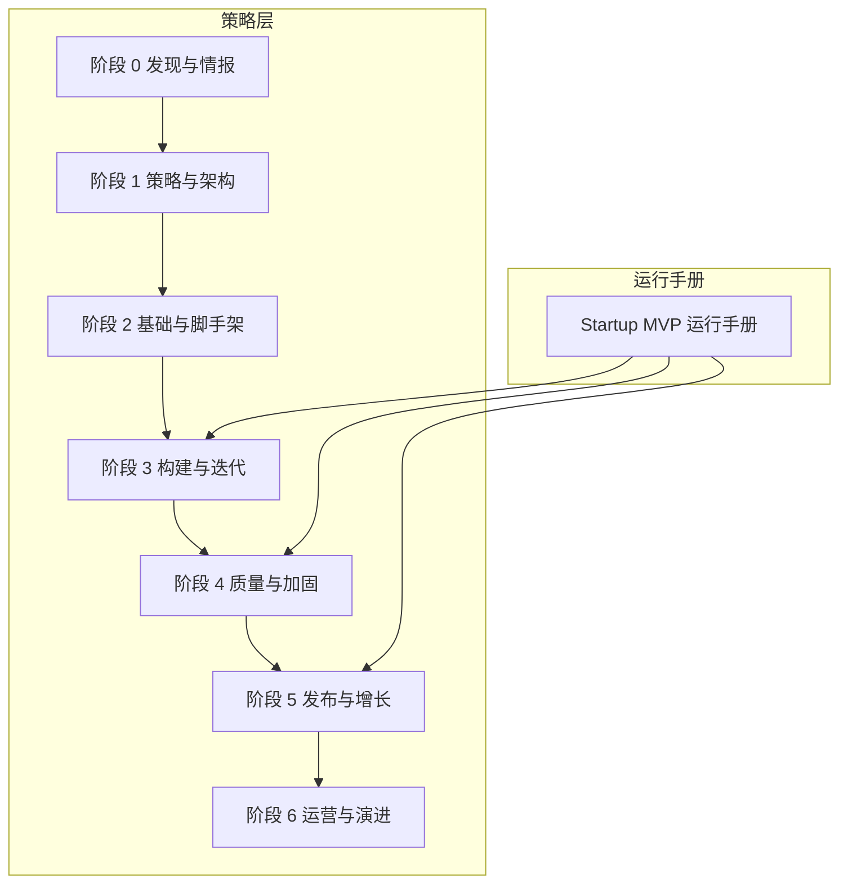
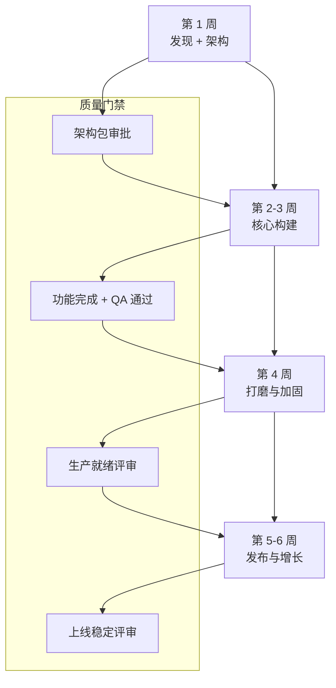
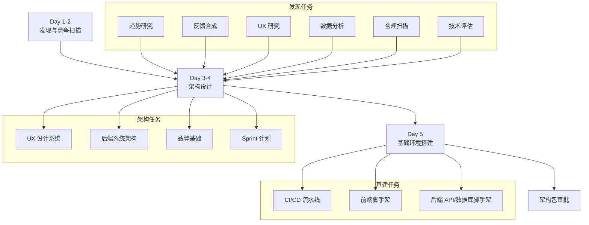
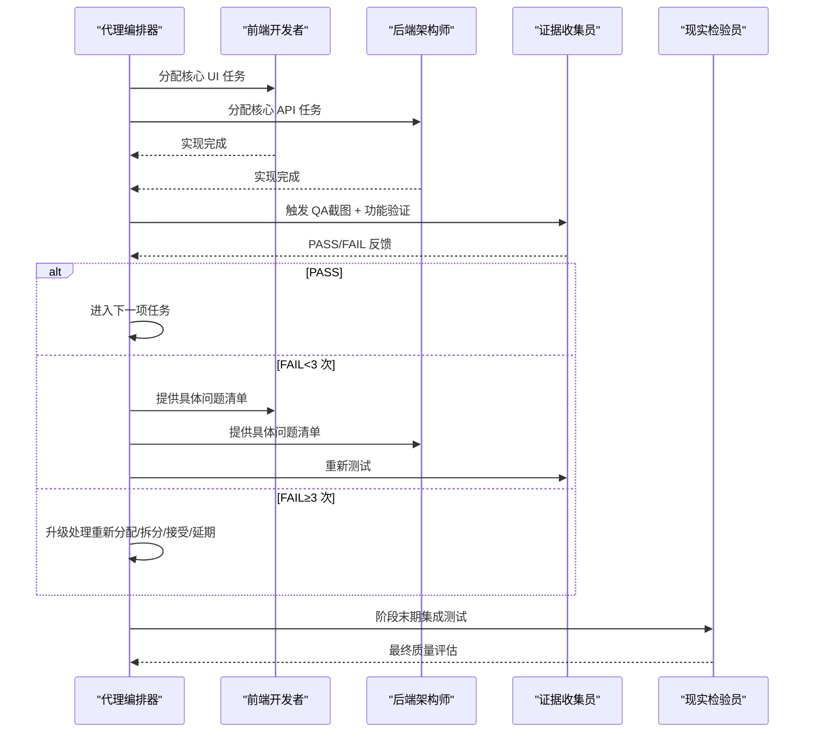
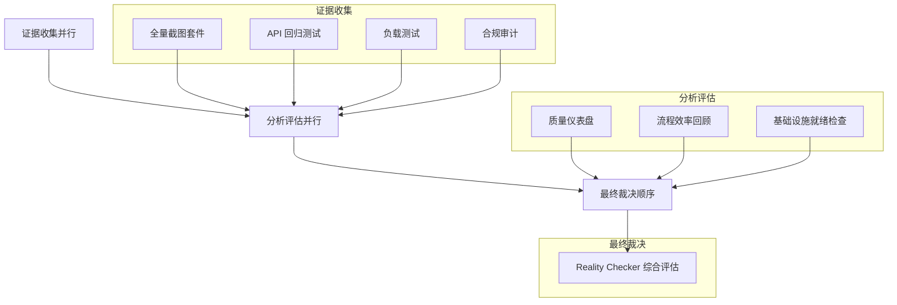
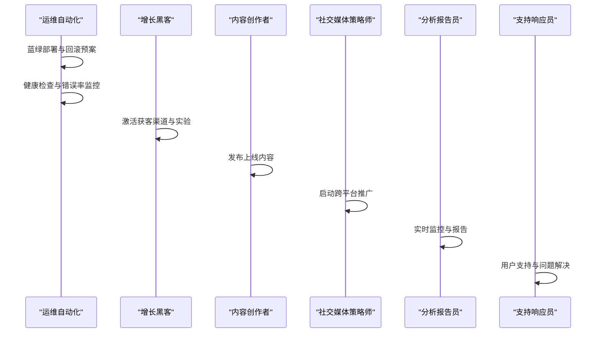
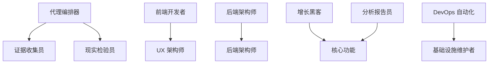

# Startup MVP 构建运行手册

<cite>
**本文档引用的文件**
- [startup-mvp 运行手册](file://strategy/runbooks/scenario-startup-mvp.md)
- [启动指南](file://strategy/QUICKSTART.md)
- [执行摘要](file://strategy/EXECUTIVE-BRIEF.md)
- [MVP 多代理工作流示例](file://examples/workflow-startup-mvp.md)
- [代理编排器](file://specialized/agents-orchestrator.md)
- [证据收集员](file://testing/testing-evidence-collector.md)
- [现实检验员](file://testing/testing-reality-checker.md)
- [阶段 0：发现与情报](file://strategy/playbooks/phase-0-discovery.md)
- [阶段 1：策略与架构](file://strategy/playbooks/phase-1-strategy.md)
- [阶段 2：基础与脚手架](file://strategy/playbooks/phase-2-foundation.md)
- [阶段 3：构建与迭代](file://strategy/playbooks/phase-3-build.md)
- [阶段 4：质量与加固](file://strategy/playbooks/phase-4-hardening.md)
- [阶段 5：发布与增长](file://strategy/playbooks/phase-5-launch.md)
- [阶段 6：运营与演进](file://strategy/playbooks/phase-6-operate.md)
</cite>

## 目录
1. [简介](#简介)
2. [项目结构](#项目结构)
3. [核心组件](#核心组件)
4. [架构总览](#架构总览)
5. [详细组件分析](#详细组件分析)
6. [依赖关系分析](#依赖关系分析)
7. [性能考量](#性能考量)
8. [故障排除指南](#故障排除指南)
9. [结论](#结论)
10. [附录](#附录)

## 简介
本运行手册面向初创团队，提供 4-6 周 Startup MVP 的标准构建流程，目标是在最短时间内验证产品市场契合度（PMF）。该方法以“多代理协作 + 质量门禁”为核心，通过明确的每周工作分解结构、关键决策点、成功指标与常见陷阱，确保在速度与质量之间取得平衡。

## 项目结构
该仓库提供了完整的 NEXUS 多代理协同体系，围绕 7 阶段（Discovery → Strategy → Foundation → Build → Harden → Launch → Operate）提供可复用的“剧本”和“运行手册”。其中 Startup MVP 场景运行手册定义了 4-6 周的压缩周期，并明确了核心团队、增长团队与支援团队的激活时机与职责边界。

图表来源
- [startup-mvp 运行手册:43-124](file://strategy/runbooks/scenario-startup-mvp.md#L43-L124)
- [阶段 0：发现与情报:1-179](file://strategy/playbooks/phase-0-discovery.md#L1-L179)
- [阶段 1：策略与架构:1-239](file://strategy/playbooks/phase-1-strategy.md#L1-L239)
- [阶段 2：基础与脚手架:1-279](file://strategy/playbooks/phase-2-foundation.md#L1-L279)
- [阶段 3：构建与迭代:1-287](file://strategy/playbooks/phase-3-build.md#L1-L287)
- [阶段 4：质量与加固:1-333](file://strategy/playbooks/phase-4-hardening.md#L1-L333)
- [阶段 5：发布与增长:1-278](file://strategy/playbooks/phase-5-launch.md#L1-L278)
- [阶段 6：运营与演进:1-319](file://strategy/playbooks/phase-6-operate.md#L1-L319)

章节来源
- [启动指南:1-195](file://strategy/QUICKSTART.md#L1-L195)
- [执行摘要:1-96](file://strategy/EXECUTIVE-BRIEF.md#L1-L96)

## 核心组件
- 多代理编排器：负责跨阶段的任务分配、Dev↔QA 循环推进、失败处理与状态报告。
- 质量门禁：证据驱动的质量评估，Reality Checker 默认“需要改进”，Evidence Collector 要求可视化证据。
- 并行工作流：核心产品开发、增长准备、质量与运营、品牌体验四条轨道并行推进。
- 关键角色与团队：
  - 核心团队（始终在线）：编排器、项目经理、优先级官、UX 架构师、前端/后端架构师、DevOps、证据收集员、现实检验员。
  - 增长团队（第 3 周起激活）：增长黑客、内容创作者、社交媒体策略师。
  - 支援团队（按需激活）：品牌守护者、分析报告员、快速原型师、AI 工程师、性能基准员、基础设施维护者。

章节来源
- [startup-mvp 运行手册:11-124](file://strategy/runbooks/scenario-startup-mvp.md#L11-L124)
- [代理编排器:1-367](file://specialized/agents-orchestrator.md#L1-L367)
- [证据收集员:1-37](file://testing/testing-evidence-collector.md#L1-L37)
- [现实检验员:1-37](file://testing/testing-reality-checker.md#L1-L37)

## 架构总览
Startup MVP 的总体流程由“发现 + 架构”“核心构建”“打磨与加固”“发布与增长”四个阶段组成，每个阶段结束设置质量门禁，确保可交付成果具备上线能力。

图表来源
- [startup-mvp 运行手册:43-124](file://strategy/runbooks/scenario-startup-mvp.md#L43-L124)
- [阶段 1：策略与架构:184-202](file://strategy/playbooks/phase-1-strategy.md#L184-L202)
- [阶段 3：构建与迭代:234-252](file://strategy/playbooks/phase-3-build.md#L234-L252)
- [阶段 4：质量与加固:257-271](file://strategy/playbooks/phase-4-hardening.md#L257-L271)
- [阶段 5：发布与增长:230-248](file://strategy/playbooks/phase-5-launch.md#L230-L248)

## 详细组件分析

### 第 1 周：发现与架构（Phase 0 + Phase 1 压缩）
- 目标：在 2-4 天内完成市场、用户、技术与合规的初步验证，产出架构包；第 5 天完成基础环境搭建。
- 关键活动：
  - 发现阶段：趋势研究、用户反馈合成、UX 研究、数据景观评估、法律合规扫描、技术栈评估。
  - 架构阶段：UX 架构（设计系统 + 组件架构）、后端架构（系统架构 + 数据库模式）、品牌基础、Sprint 优先级与计划。
  - 基础设施：CI/CD 流水线 + 环境、前端脚手架、后端 API/数据库脚手架。
- 质量门禁：架构包批准（由项目经理与架构官共同确认）。
- 成功指标：时间 ≤ 4 天完成发现；第 4 天前输出架构包；第 5 天完成基础环境。

图表来源
- [startup-mvp 运行手册:45-64](file://strategy/runbooks/scenario-startup-mvp.md#L45-L64)
- [阶段 0：发现与情报:17-179](file://strategy/playbooks/phase-0-discovery.md#L17-L179)
- [阶段 1：策略与架构:17-239](file://strategy/playbooks/phase-1-strategy.md#L17-L239)
- [阶段 2：基础与脚手架:17-279](file://strategy/playbooks/phase-2-foundation.md#L17-L279)

章节来源
- [startup-mvp 运行手册:45-64](file://strategy/runbooks/scenario-startup-mvp.md#L45-L64)
- [阶段 0：发现与情报:11-179](file://strategy/playbooks/phase-0-discovery.md#L11-L179)
- [阶段 1：策略与架构:11-239](file://strategy/playbooks/phase-1-strategy.md#L11-L239)

### 第 2-3 周：核心构建（Phase 2 + Phase 3）
- 目标：完成 MVP 的核心功能实现与验证，建立持续的 Dev↔QA 循环。
- 关键活动：
  - 第 2 周：继续 Dev↔QA 循环，前端核心 UI、后端核心 API、AI 功能（如适用）。
  - 第 3 周：继续 Dev↔QA 循环；增长团队开始病毒机制、内容与分析仪表盘准备。
- 质量门禁：所有任务通过 QA，API 全面验证，性能基线达标，无关键缺陷。
- 成功指标：核心功能 100% 完成；无 P0/P1 缺陷；性能满足阈值。

图表来源
- [startup-mvp 运行手册:66-83](file://strategy/runbooks/scenario-startup-mvp.md#L66-L83)
- [阶段 3：构建与迭代:19-252](file://strategy/playbooks/phase-3-build.md#L19-L252)
- [代理编排器:110-168](file://specialized/agents-orchestrator.md#L110-L168)

章节来源
- [startup-mvp 运行手册:66-83](file://strategy/runbooks/scenario-startup-mvp.md#L66-L83)
- [阶段 3：构建与迭代:19-252](file://strategy/playbooks/phase-3-build.md#L19-L252)
- [代理编排器:110-168](file://specialized/agents-orchestrator.md#L110-L168)

### 第 4 周：打磨与加固（Phase 4）
- 目标：最终质量关卡，Reality Checker 默认“需要改进”，要求全面证据证明生产就绪。
- 关键活动：
  - 并行收集证据：全量截图套件、API 回归测试、负载测试、合规审计。
  - 分析与评估：质量仪表盘、流程效率回顾、基础设施就绪检查。
  - 最终裁决：Reality Checker 基于证据给出“就绪/需要改进/未就绪”三类结论。
- 质量门禁：端到端用户旅程、跨设备一致性、性能认证、安全与合规、规格符合性、基础设施就绪。
- 成功指标：P95 < 200ms、LCP < 2.5s、99.9%+ 上线时间、零关键漏洞、零 P0/P1。

图表来源
- [startup-mvp 运行手册:85-105](file://strategy/runbooks/scenario-startup-mvp.md#L85-L105)
- [阶段 4：质量与加固:30-333](file://strategy/playbooks/phase-4-hardening.md#L30-L333)

章节来源
- [startup-mvp 运行手册:85-105](file://strategy/runbooks/scenario-startup-mvp.md#L85-L105)
- [阶段 4：质量与加固:17-333](file://strategy/playbooks/phase-4-hardening.md#L17-L333)

### 第 5-6 周：发布与增长（Phase 5）
- 目标：上线并启动增长，实时监控与优化。
- 关键活动：
  - 上线前：内容与营销准备、技术部署准备、最终检查清单。
  - 上线日：蓝绿部署、健康检查、流量切换、实时监控与响应。
  - 上线后：每日监控与反馈、每周优化与 A/B 测试、首周总结与资源再分配。
- 质量门禁：零停机部署、48 小时内无 P0/P1、用户获取渠道活跃、反馈闭环有效。
- 成功指标：首日用户注册、首周留存、渠道转化、NPS、MTTR。

图表来源
- [startup-mvp 运行手册:107-124](file://strategy/runbooks/scenario-startup-mvp.md#L107-L124)
- [阶段 5：发布与增长:18-278](file://strategy/playbooks/phase-5-launch.md#L18-L278)

章节来源
- [startup-mvp 运行手册:107-124](file://strategy/runbooks/scenario-startup-mvp.md#L107-L124)
- [阶段 5：发布与增长:18-278](file://strategy/playbooks/phase-5-launch.md#L18-L278)

### 概念总览
以下概念图展示了从“想法”到“可验证的 MVP”的端到端路径，强调证据驱动与门禁控制。

图表来源
- [执行摘要:1-96](file://strategy/EXECUTIVE-BRIEF.md#L1-L96)
- [启动指南:1-195](file://strategy/QUICKSTART.md#L1-L195)

## 依赖关系分析
- 代理间依赖：
  - 编排器依赖证据收集员与现实检验员进行质量门禁。
  - 开发者依赖 UX/后端架构师提供的设计系统与 API 规范。
  - 增长团队依赖核心功能完成与分析仪表盘就绪。
- 外部依赖：
  - CI/CD 与云基础设施（DevOps 自动化与基础设施维护者）。
  - 监控与日志（分析报告员与基础设施维护者）。
- 循环依赖与风险：
  - 若 QA 不严格或证据不足，Reality Checker 将默认“需要改进”，导致回退至构建阶段重跑 Dev↔QA 循环。

图表来源
- [代理编排器:1-367](file://specialized/agents-orchestrator.md#L1-L367)
- [证据收集员:1-37](file://testing/testing-evidence-collector.md#L1-L37)
- [现实检验员:1-37](file://testing/testing-reality-checker.md#L1-L37)
- [阶段 3：构建与迭代:45-133](file://strategy/playbooks/phase-3-build.md#L45-L133)
- [阶段 5：发布与增长:50-104](file://strategy/playbooks/phase-5-launch.md#L50-L104)

章节来源
- [代理编排器:1-367](file://specialized/agents-orchestrator.md#L1-L367)
- [证据收集员:1-37](file://testing/testing-evidence-collector.md#L1-L37)
- [现实检验员:1-37](file://testing/testing-reality-checker.md#L1-L37)
- [阶段 3：构建与迭代:45-133](file://strategy/playbooks/phase-3-build.md#L45-L133)
- [阶段 5：发布与增长:50-104](file://strategy/playbooks/phase-5-launch.md#L50-L104)

## 性能考量
- 质量前置：通过 Dev↔QA 循环与证据门禁，减少集成阶段缺陷，缩短 Phase 4 时间。
- 并行加速：四条轨道并行推进，显著压缩周期。
- 基准先行：在 Phase 2 建立性能基线，避免上线后大规模重构。
- 监控就绪：在 Phase 1 即开始基础设施准备，确保上线即监控。

## 故障排除指南
- 常见陷阱与缓解：
  - 范畴蔓延：由优先级官使用 RICE 评分与 MoSCoW 约束范围。
  - 过度工程：快速原型师推动“先验证、后扩展”的思维。
  - 跳过 QA：证据收集员对每项任务强制截图与功能验证。
  - 无监控上线：基础设施维护者在第 1 周即建立监控与告警。
  - 无反馈机制：从 Sprint 1 起内置分析与反馈收集。
- 升级路径：
  - 需要改进：返回构建阶段，逐项修复并通过证据收集员复测。
  - 未就绪：回到架构阶段，修正系统设计或降级范围。
  - 关键缺陷：按严重级别（P0-P3）启动应急响应流程。

章节来源
- [startup-mvp 运行手册:146-155](file://strategy/runbooks/scenario-startup-mvp.md#L146-L155)
- [阶段 4：质量与加固:216-333](file://strategy/playbooks/phase-4-hardening.md#L216-L333)
- [阶段 6：运营与演进:111-152](file://strategy/playbooks/phase-6-operate.md#L111-L152)

## 结论
Startup MVP 运行手册以证据驱动的质量门禁与并行工作流为核心，将 4-6 周的 MVP 构建标准化、可重复化。通过明确的角色分工、关键决策点与成功指标，团队可在保证质量的前提下快速验证 PMF，并为后续增长与运营打下坚实基础。

## 附录
- 快速启动模式：NEXUS-Sprint 适合 2-6 周的 MVP 或特性构建，Skip Phase 0，直接进入 Phase 1。
- 场景化运行手册：包含 Startup MVP、企业特性、营销活动与应急响应等预设配置。
- 多代理工作流示例：以“远程团队回顾工具”为例，展示从想法到上线的完整步骤与证据传递。

章节来源
- [启动指南:46-121](file://strategy/QUICKSTART.md#L46-L121)
- [MVP 多代理工作流示例:1-156](file://examples/workflow-startup-mvp.md#L1-L156)