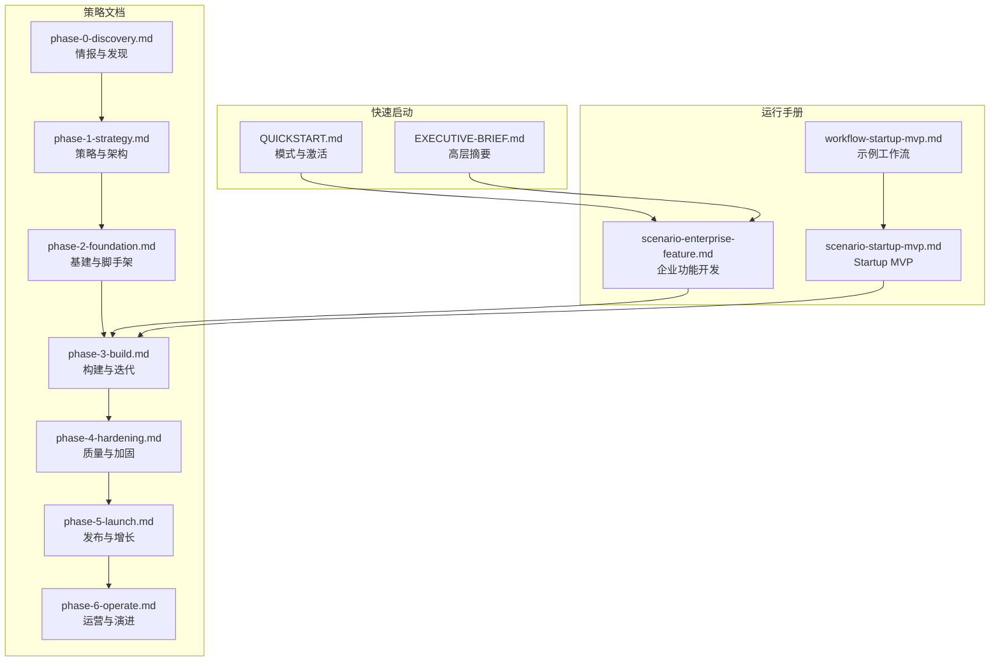
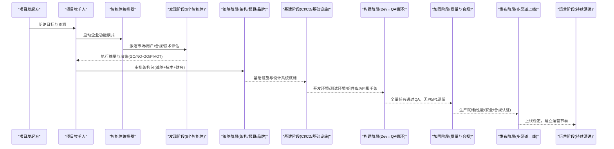
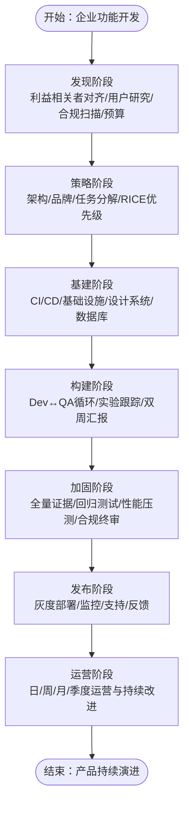
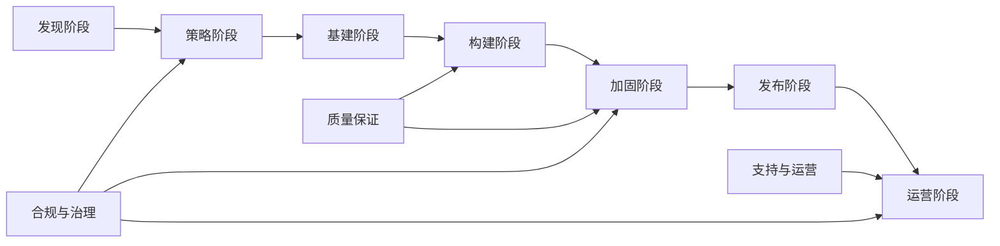

# 企业功能开发运行手册

<cite>
**本文档引用的文件**
- [scenario-enterprise-feature.md](file://strategy/runbooks/scenario-enterprise-feature.md)
- [scenario-startup-mvp.md](file://strategy/runbooks/scenario-startup-mvp.md)
- [phase-0-discovery.md](file://strategy/playbooks/phase-0-discovery.md)
- [phase-1-strategy.md](file://strategy/playbooks/phase-1-strategy.md)
- [phase-2-foundation.md](file://strategy/playbooks/phase-2-foundation.md)
- [phase-3-build.md](file://strategy/playbooks/phase-3-build.md)
- [phase-4-hardening.md](file://strategy/playbooks/phase-4-hardening.md)
- [phase-5-launch.md](file://strategy/playbooks/phase-5-launch.md)
- [phase-6-operate.md](file://strategy/playbooks/phase-6-operate.md)
- [QUICKSTART.md](file://strategy/QUICKSTART.md)
- [EXECUTIVE-BRIEF.md](file://strategy/EXECUTIVE-BRIEF.md)
- [workflow-startup-mvp.md](file://examples/workflow-startup-mvp.md)
- [compliance-auditor.md](file://specialized/compliance-auditor.md)
</cite>

## 目录
1. [简介](#简介)
2. [项目结构](#项目结构)
3. [核心组件](#核心组件)
4. [架构总览](#架构总览)
5. [详细组件分析](#详细组件分析)
6. [依赖关系分析](#依赖关系分析)
7. [性能考量](#性能考量)
8. [故障排除指南](#故障排除指南)
9. [结论](#结论)
10. [附录](#附录)

## 简介
本运行手册面向企业级功能开发场景，系统化阐述在复杂组织环境中如何通过标准化流程、质量门禁与风险控制，交付符合合规、安全与性能要求的企业功能。相比 Startup MVP 的快速验证模式，企业级项目强调严格的治理、跨部门协同、可审计证据链与长期运营能力。本手册基于 NEXUS 多阶段流水线，提供从发现、策略、基建、构建、加固、发布到运营的全生命周期方法论与实操指引。

## 项目结构
该仓库以“策略文档 + 运行手册 + 示例工作流”的方式组织企业级多智能体协作体系：
- 策略层：Master Strategy、各阶段 Playbook（Discovery → Strategy → Foundation → Build → Hardening → Launch → Operate）
- 运行层：Scenario Runbooks（如企业功能、MVP、营销活动、应急响应）
- 示例层：Startup MVP 工作流示例，用于对比企业级复杂度与节奏差异
- 快速启动：Quick-Start 指南与 Executive Brief 提供模式选择与关键概念

**图表来源**
- [phase-0-discovery.md:1-179](file://strategy/playbooks/phase-0-discovery.md#L1-L179)
- [phase-1-strategy.md:1-239](file://strategy/playbooks/phase-1-strategy.md#L1-L239)
- [phase-2-foundation.md:1-279](file://strategy/playbooks/phase-2-foundation.md#L1-L279)
- [phase-3-build.md:1-287](file://strategy/playbooks/phase-3-build.md#L1-L287)
- [phase-4-hardening.md:1-333](file://strategy/playbooks/phase-4-hardening.md#L1-L333)
- [phase-5-launch.md:1-278](file://strategy/playbooks/phase-5-launch.md#L1-L278)
- [phase-6-operate.md:1-319](file://strategy/playbooks/phase-6-operate.md#L1-L319)
- [scenario-enterprise-feature.md:1-158](file://strategy/runbooks/scenario-enterprise-feature.md#L1-L158)
- [scenario-startup-mvp.md:1-155](file://strategy/runbooks/scenario-startup-mvp.md#L1-L155)
- [workflow-startup-mvp.md:1-156](file://examples/workflow-startup-mvp.md#L1-L156)
- [QUICKSTART.md:1-195](file://strategy/QUICKSTART.md#L1-L195)
- [EXECUTIVE-BRIEF.md:1-96](file://strategy/EXECUTIVE-BRIEF.md#L1-L96)

**章节来源**
- [QUICKSTART.md:1-195](file://strategy/QUICKSTART.md#L1-L195)
- [EXECUTIVE-BRIEF.md:1-96](file://strategy/EXECUTIVE-BRIEF.md#L1-L96)

## 核心组件
- 企业功能开发模式（NEXUS-Sprint）：时长 6-12 周，涉及 20-30 个智能体，包含合规、治理、质量保证与运营支持团队
- 质量门禁与最终质量官（Reality Checker）：默认“需要改进”，必须提供充分证据才可通过
- 并行工作流：核心产品、增长准备、质量与运营、品牌体验四条轨道同时推进
- 风险管理矩阵：明确风险概率与影响，指定缓解措施与责任人
- 合规审计与持续监控：法律合规检查贯穿全程，形成可审计证据链

**章节来源**
- [scenario-enterprise-feature.md:1-158](file://strategy/runbooks/scenario-enterprise-feature.md#L1-L158)
- [phase-3-build.md:1-287](file://strategy/playbooks/phase-3-build.md#L1-L287)
- [phase-4-hardening.md:1-333](file://strategy/playbooks/phase-4-hardening.md#L1-L333)

## 架构总览
企业功能开发采用七阶段流水线，每阶段设置质量门禁与证据要求，确保可追溯、可审计、可复用。企业场景下，合规与治理团队常驻参与，形成“边建边审”的闭环。

**图表来源**
- [phase-0-discovery.md:1-179](file://strategy/playbooks/phase-0-discovery.md#L1-L179)
- [phase-1-strategy.md:1-239](file://strategy/playbooks/phase-1-strategy.md#L1-L239)
- [phase-2-foundation.md:1-279](file://strategy/playbooks/phase-2-foundation.md#L1-L279)
- [phase-3-build.md:1-287](file://strategy/playbooks/phase-3-build.md#L1-L287)
- [phase-4-hardening.md:1-333](file://strategy/playbooks/phase-4-hardening.md#L1-L333)
- [phase-5-launch.md:1-278](file://strategy/playbooks/phase-5-launch.md#L1-L278)
- [phase-6-operate.md:1-319](file://strategy/playbooks/phase-6-operate.md#L1-L319)

## 详细组件分析

### 企业功能开发执行计划
- 发现阶段（第1-2周）：对齐利益相关者、用户研究、合规扫描、规范转任务、预算框架
- 基础设施阶段（第3周）：CI/CD、云资源、监控、Git 工作流、应用骨架
- 构建阶段（第4-9周）：按冲刺推进，Dev↔QA 循环，A/B 测试与实验跟踪
- 加固阶段（第10-11周）：全量截图、API 回归、性能压测、合规终审、生产就绪
- 发布阶段（第12周）：灰度发布、监控、支持与反馈收集
- 运营阶段（持续）：日/周/月/季度运营节奏，持续改进与应急响应

**图表来源**
- [scenario-enterprise-feature.md:47-125](file://strategy/runbooks/scenario-enterprise-feature.md#L47-L125)
- [phase-3-build.md:77-133](file://strategy/playbooks/phase-3-build.md#L77-L133)
- [phase-4-hardening.md:30-70](file://strategy/playbooks/phase-4-hardening.md#L30-L70)
- [phase-5-launch.md:18-71](file://strategy/playbooks/phase-5-launch.md#L18-L71)
- [phase-6-operate.md:18-72](file://strategy/playbooks/phase-6-operate.md#L18-L72)

**章节来源**
- [scenario-enterprise-feature.md:47-125](file://strategy/runbooks/scenario-enterprise-feature.md#L47-L125)

### 企业与 Startup MVP 的差异
- 规模与复杂度：企业项目涉及合规、治理、财务与品牌一致性，需跨部门协调；MVP 更关注快速验证与最小可行功能
- 时间线：企业功能 6-12 周，MVP 4-6 周；企业项目增加发现与加固阶段的深度
- 团队规模：企业项目 20-30 个智能体，MVP 通常 18-22 个
- 质量与合规：企业项目对代码覆盖率、响应时间、可访问性、安全漏洞、品牌一致性和规格符合度有明确阈值；MVP 强调“先上线再优化”
- 风险管理：企业项目提供风险矩阵与责任人，MVP 更依赖“现实检查”作为质量门禁

**章节来源**
- [scenario-enterprise-feature.md:1-158](file://strategy/runbooks/scenario-enterprise-feature.md#L1-L158)
- [scenario-startup-mvp.md:1-155](file://strategy/runbooks/scenario-startup-mvp.md#L1-L155)
- [workflow-startup-mvp.md:1-156](file://examples/workflow-startup-mvp.md#L1-L156)

### 代理团队配置与角色分工
- 核心团队：编排器、项目牧羊人、高级项目经理、冲刺优先级、UX 架构师/研究者、UI 设计师、前后端开发者、高级开发者、DevOps 自动化、证据收集、API 测试、现实检查、性能基准
- 合规与治理：法律合规检查、品牌守护、财务跟踪、高管摘要生成
- 质量保证：测试结果分析、流程优化、实验跟踪
- 支持与运营：支持响应、分析报告、基础设施维护、法律合规检查（持续）

**章节来源**
- [scenario-enterprise-feature.md:11-46](file://strategy/runbooks/scenario-enterprise-feature.md#L11-L46)

### 审批流程与质量门禁
- 发现阶段门禁：GO/NO-GO/PIVOT 决策，需满足市场机会、用户痛点、合规与技术可行性
- 策略阶段门禁：架构覆盖 100% 规格、品牌系统完整、预算批准、真实可行的冲刺计划、安全架构定义、合规集成
- 基础设施阶段门禁：CI/CD 可用、数据库部署完成、API 健康检查、前端骨架可用、监控仪表板、设计系统令牌、主题切换、Git 工作流文档
- 构建阶段门禁：所有任务通过 QA、API 端点验证、性能基线达标、品牌一致性、无 P0/P1 缺陷、验收标准满足、代码评审完成
- 加固阶段门禁：端到端用户旅程、跨设备一致性、性能认证、安全验证、合规认证、规格符合、基础设施就绪
- 发布阶段门禁：零停机部署、系统稳定（48 小时内无 P0/P1）、获客渠道激活、反馈回路运行、利益相关者知情、支持运作、增长指标追踪
- 运营阶段门禁：持续改进循环（测量→分析→计划→构建→验证→部署→测量）

**章节来源**
- [phase-0-discovery.md:134-144](file://strategy/playbooks/phase-0-discovery.md#L134-L144)
- [phase-1-strategy.md:184-195](file://strategy/playbooks/phase-1-strategy.md#L184-L195)
- [phase-2-foundation.md:224-236](file://strategy/playbooks/phase-2-foundation.md#L224-L236)
- [phase-3-build.md:234-245](file://strategy/playbooks/phase-3-build.md#L234-L245)
- [phase-4-hardening.md:257-268](file://strategy/playbooks/phase-4-hardening.md#L257-L268)
- [phase-5-launch.md:230-241](file://strategy/playbooks/phase-5-launch.md#L230-L241)
- [phase-6-operate.md:73-95](file://strategy/playbooks/phase-6-operate.md#L73-L95)

### 风险管理机制
- 风险识别与分级：集成复杂度高/高、范围蔓延中/高、合规问题中/严重、性能回归中/高、利益相关者不一致低/高
- 缓解措施：早期集成测试、每个冲刺配备 API 测试；冲刺优先级强制 MoSCoW；法律合规检查从第一天介入；性能基准每冲刺测试
- 责任人：后端架构师、冲刺优先级、法律合规检查、性能基准、项目牧羊人

**章节来源**
- [scenario-enterprise-feature.md:149-158](file://strategy/runbooks/scenario-enterprise-feature.md#L149-L158)

### 复杂性管理与多部门协调
- 多轨道并行：核心产品、增长准备、质量与运营、品牌体验四轨并行，压缩 40-60% 时间
- 结构化交接：标准化交接模板，确保上下文连续性，避免“冷启动”
- 质量循环：Dev↔QA 循环（最多 3 次重试），在集成前捕获 95% 缺陷，减少加固时间 50%
- 统一编排：智能体编排器负责全局状态、阻塞识别与解决、进度跟踪与报告

**章节来源**
- [phase-3-build.md:19-44](file://strategy/playbooks/phase-3-build.md#L19-L44)
- [EXECUTIVE-BRIEF.md:11-28](file://strategy/EXECUTIVE-BRIEF.md#L11-L28)

### 长期维护与运营考虑
- 运营节奏：每日（监控、支持、分析）、每周（分析报告、反馈合成、冲刺规划、增长优化）、每月（高管摘要、财务回顾、合规检查、市场情报）、季度（战略回顾、流程优化、技术债评估）
- 应急响应：P0-P3 分级，明确响应时限与决策权，建立检测→分诊→响应→解决→复盘闭环
- 持续改进：测量→分析→计划→构建→验证→部署→测量的闭环，新功能遵循压缩版 NEXUS 循环

**章节来源**
- [phase-6-operate.md:18-72](file://strategy/playbooks/phase-6-operate.md#L18-L72)
- [phase-6-operate.md:111-152](file://strategy/playbooks/phase-6-operate.md#L111-L152)
- [phase-6-operate.md:97-109](file://strategy/playbooks/phase-6-operate.md#L97-L109)

## 依赖关系分析
企业功能开发的关键依赖包括：
- 发现阶段依赖：市场情报、用户需求、合规扫描、技术评估
- 策略阶段依赖：发现阶段输出、预算与资源、品牌系统、架构设计
- 基础设施阶段依赖：系统架构、部署要求、监控与安全
- 构建阶段依赖：设计系统、API 规范、数据库、CI/CD 管道
- 加固阶段依赖：全量证据、API 回归、性能压测、合规终审
- 发布阶段依赖：部署计划、监控告警、内容与渠道、支持与反馈
- 运营阶段依赖：数据指标、用户反馈、合规与财务、流程优化

**图表来源**
- [phase-0-discovery.md:1-179](file://strategy/playbooks/phase-0-discovery.md#L1-L179)
- [phase-1-strategy.md:1-239](file://strategy/playbooks/phase-1-strategy.md#L1-L239)
- [phase-2-foundation.md:1-279](file://strategy/playbooks/phase-2-foundation.md#L1-L279)
- [phase-3-build.md:1-287](file://strategy/playbooks/phase-3-build.md#L1-L287)
- [phase-4-hardening.md:1-333](file://strategy/playbooks/phase-4-hardening.md#L1-L333)
- [phase-5-launch.md:1-278](file://strategy/playbooks/phase-5-launch.md#L1-L278)
- [phase-6-operate.md:1-319](file://strategy/playbooks/phase-6-operate.md#L1-L319)

**章节来源**
- [scenario-enterprise-feature.md:32-46](file://strategy/runbooks/scenario-enterprise-feature.md#L32-L46)

## 性能考量
- 性能基线：API 响应时间 P95 < 200ms、核心 Web 指标（LCP/FID/CLS）达标、负载测试至 10 倍预期流量
- 资源利用：CPU/内存/网络使用率、连接池利用率、索引有效性
- 稳定性：99.9% 以上正常运行时间、MTTR < 30 分钟
- 压测频率：每冲刺进行性能回归，加固阶段进行极限压力测试

**章节来源**
- [scenario-enterprise-feature.md:137-148](file://strategy/runbooks/scenario-enterprise-feature.md#L137-L148)
- [phase-4-hardening.md:86-111](file://strategy/playbooks/phase-4-hardening.md#L86-L111)
- [phase-6-operate.md:298-315](file://strategy/playbooks/phase-6-operate.md#L298-L315)

## 故障排除指南
- 常见问题与缓解：
  - 集成复杂度高：在每个冲刺配备 API 测试，早期集成测试
  - 范围蔓延：冲刺优先级强制 MoSCoW，项目牧羊人管理变更
  - 合规问题：法律合规检查从第一天介入，形成可审计证据
  - 性能回归：性能基准每冲刺测试，加固阶段极限压测
  - 利益相关者不一致：双周高管简报与项目牧羊人协调
- 应急响应：P0-P3 分级处置，明确响应时限与决策权，建立检测→分诊→响应→解决→复盘闭环

**章节来源**
- [scenario-enterprise-feature.md:149-158](file://strategy/runbooks/scenario-enterprise-feature.md#L149-L158)
- [phase-6-operate.md:111-152](file://strategy/playbooks/phase-6-operate.md#L111-L152)

## 结论
企业功能开发的核心在于“标准化流程 + 证据驱动 + 质量门禁 + 风险控制”。通过 NEXUS 七阶段流水线与企业场景下的合规、治理与运营团队协同，可在 6-12 周内交付高质量、可审计、可持续演进的企业功能。建议将 NEXUS-Sprint 作为企业新功能开发的默认模式，并在全组织推广 Dev↔QA 循环与应急响应协议，以实现更快交付与更低风险。

## 附录
- 快速启动：选择 NEXUS-Sprint 模式，复制激活提示，按阶段 Playbook 执行，严格遵守质量门禁与证据要求
- 场景参考：企业功能开发、Startup MVP、营销活动、应急响应等预置运行手册可直接套用或定制

**章节来源**
- [QUICKSTART.md:1-195](file://strategy/QUICKSTART.md#L1-L195)
- [EXECUTIVE-BRIEF.md:40-64](file://strategy/EXECUTIVE-BRIEF.md#L40-L64)