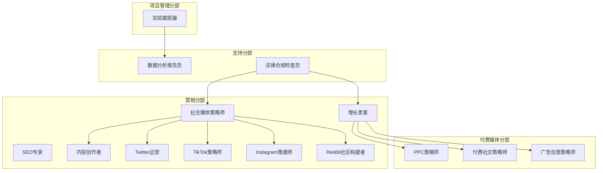
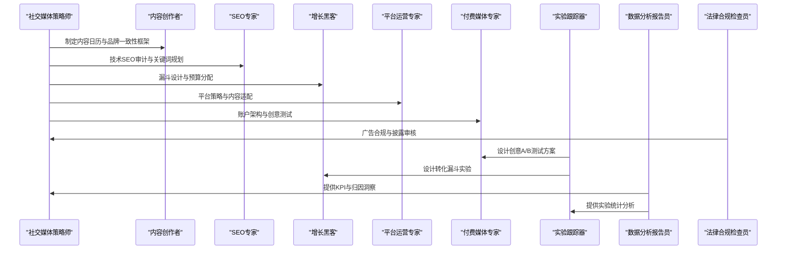
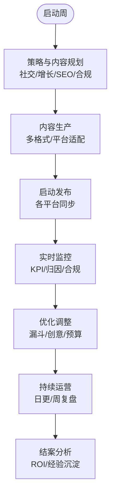
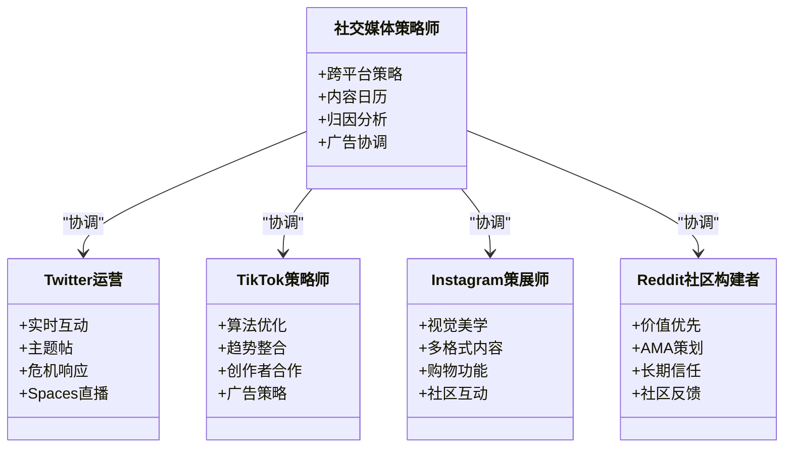
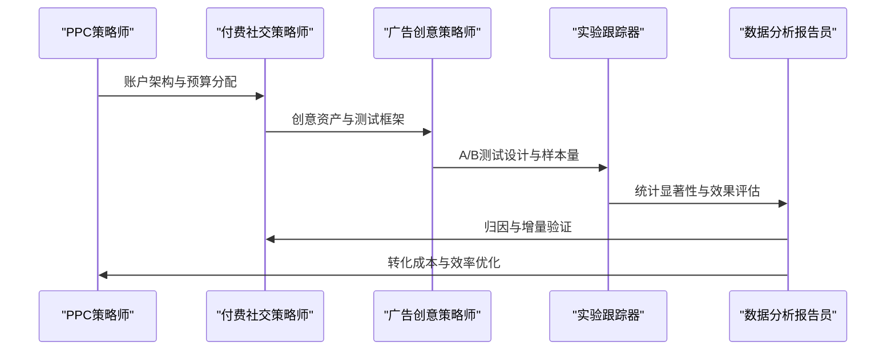
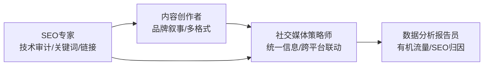
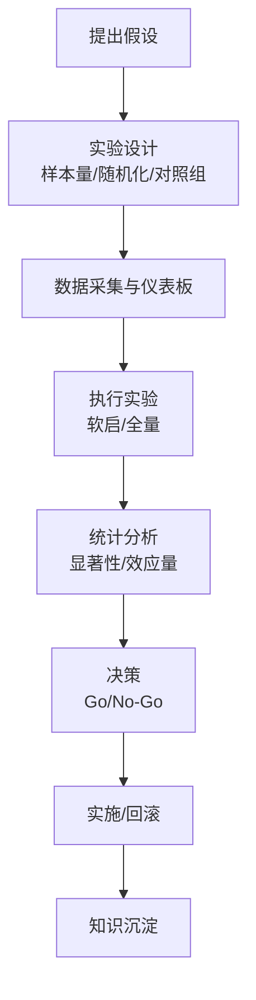
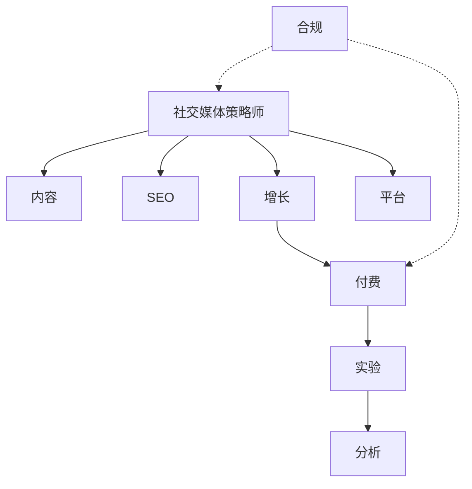

# 多渠道营销活动运行手册

<cite>
**本文档引用的文件**
- [README.md](file://README.md)
- [scenario-marketing-campaign.md](file://strategy/runbooks/scenario-marketing-campaign.md)
- [marketing-social-media-strategist.md](file://marketing/marketing-social-media-strategist.md)
- [marketing-seo-specialist.md](file://marketing/marketing-seo-specialist.md)
- [marketing-content-creator.md](file://marketing/marketing-content-creator.md)
- [marketing-growth-hacker.md](file://marketing/marketing-growth-hacker.md)
- [marketing-twitter-engager.md](file://marketing/marketing-twitter-engager.md)
- [marketing-tiktok-strategist.md](file://marketing/marketing-tiktok-strategist.md)
- [marketing-instagram-curator.md](file://marketing/marketing-instagram-curator.md)
- [marketing-reddit-community-builder.md](file://marketing/marketing-reddit-community-builder.md)
- [paid-media-creative-strategist.md](file://paid-media/paid-media-creative-strategist.md)
- [paid-media-paid-social-strategist.md](file://paid-media/paid-media-paid-social-strategist.md)
- [paid-media-ppc-strategist.md](file://paid-media/paid-media-ppc-strategist.md)
- [project-management-experiment-tracker.md](file://project-management/project-management-experiment-tracker.md)
- [support-analytics-reporter.md](file://support/support-analytics-reporter.md)
- [support-legal-compliance-checker.md](file://support/support-legal-compliance-checker.md)
</cite>

## 目录
1. [引言](#引言)
2. [项目结构](#项目结构)
3. [核心组件](#核心组件)
4. [架构总览](#架构总览)
5. [详细组件分析](#详细组件分析)
6. [依赖关系分析](#依赖关系分析)
7. [性能考量](#性能考量)
8. [故障排查指南](#故障排查指南)
9. [结论](#结论)
10. [附录](#附录)

## 引言
本运行手册面向多渠道营销活动的策划与执行，覆盖社交媒体、搜索引擎、付费广告与内容营销的协同运作。文档基于仓库中的“营销”“付费媒体”“项目管理”“支持”等分部能力，构建从团队配置、流程编排、自动化与A/B测试到效果追踪与ROI优化的完整方法论，帮助团队在跨平台环境中实现可衡量的增长目标。

## 项目结构
该仓库以“职能分部 + 场景化运行手册”的方式组织，营销相关能力主要分布在以下模块：
- 营销分部：提供社交平台策略、内容创作、SEO、增长黑客等专家级Agent
- 付费媒体分部：提供搜索、展示、社交付费的策略与创意专家Agent
- 项目管理分部：提供实验设计与A/B测试的系统化方法
- 支持分部：提供数据分析与合规审查的专业Agent

图示来源
- [marketing-social-media-strategist.md](file://marketing/marketing-social-media-strategist.md)
- [marketing-seo-specialist.md](file://marketing/marketing-seo-specialist.md)
- [marketing-content-creator.md](file://marketing/marketing-content-creator.md)
- [marketing-growth-hacker.md](file://marketing/marketing-growth-hacker.md)
- [marketing-twitter-engager.md](file://marketing/marketing-twitter-engager.md)
- [marketing-tiktok-strategist.md](file://marketing/marketing-tiktok-strategist.md)
- [marketing-instagram-curator.md](file://marketing/marketing-instagram-curator.md)
- [marketing-reddit-community-builder.md](file://marketing/marketing-reddit-community-builder.md)
- [paid-media-ppc-strategist.md](file://paid-media/paid-media-ppc-strategist.md)
- [paid-media-paid-social-strategist.md](file://paid-media/paid-media-paid-social-strategist.md)
- [paid-media-creative-strategist.md](file://paid-media/paid-media-creative-strategist.md)
- [project-management-experiment-tracker.md](file://project-management/project-management-experiment-tracker.md)
- [support-analytics-reporter.md](file://support/support-analytics-reporter.md)
- [support-legal-compliance-checker.md](file://support/support-legal-compliance-checker.md)

章节来源
- [README.md](file://README.md)
- [scenario-marketing-campaign.md](file://strategy/runbooks/scenario-marketing-campaign.md)

## 核心组件
- 社交媒体策略师：负责跨平台统一策略、内容日历与广告投放的整体协调
- SEO专家：负责技术SEO审计、关键词研究、内容优化与链接建设
- 内容创作者：负责多格式内容生产、品牌叙事与跨平台适配
- 增长黑客：负责转化漏斗优化、病毒式传播设计与跨渠道归因
- 平台运营专家（Twitter/TikTok/Instagram/Reddit）：负责各平台本地化内容与社区互动
- 付费媒体专家（PPC/付费社交/广告创意）：负责账户架构、创意测试与测量验证
- 实验跟踪器：负责A/B测试设计、统计显著性与实验组合管理
- 数据分析报告员：负责仪表盘、归因模型与业务影响评估
- 法律合规检查员：负责广告合规、披露要求与跨境数据治理

章节来源
- [marketing-social-media-strategist.md](file://marketing/marketing-social-media-strategist.md)
- [marketing-seo-specialist.md](file://marketing/marketing-seo-specialist.md)
- [marketing-content-creator.md](file://marketing/marketing-content-creator.md)
- [marketing-growth-hacker.md](file://marketing/marketing-growth-hacker.md)
- [marketing-twitter-engager.md](file://marketing/marketing-twitter-engager.md)
- [marketing-tiktok-strategist.md](file://marketing/marketing-tiktok-strategist.md)
- [marketing-instagram-curator.md](file://marketing/marketing-instagram-curator.md)
- [marketing-reddit-community-builder.md](file://marketing/marketing-reddit-community-builder.md)
- [paid-media-ppc-strategist.md](file://paid-media/paid-media-ppc-strategist.md)
- [paid-media-paid-social-strategist.md](file://paid-media/paid-media-paid-social-strategist.md)
- [paid-media-creative-strategist.md](file://paid-media/paid-media-creative-strategist.md)
- [project-management-experiment-tracker.md](file://project-management/project-management-experiment-tracker.md)
- [support-analytics-reporter.md](file://support/support-analytics-reporter.md)
- [support-legal-compliance-checker.md](file://support/support-legal-compliance-checker.md)

## 架构总览
多渠道营销活动采用“平台专家 + 策略中枢 + 数据驱动 + 合规保障”的四轮驱动架构：
- 策略中枢：社交媒体策略师统筹全局，协调内容、SEO与增长黑客
- 平台专家：Twitter/TikTok/Instagram/Reddit运营专家负责本地化内容与社区互动
- 付费媒体：PPC/付费社交/广告创意专家负责账户架构、创意测试与测量
- 数据与合规：实验跟踪器与数据分析报告员提供科学决策依据；法律合规检查员确保广告与数据处理合法

图示来源
- [marketing-social-media-strategist.md](file://marketing/marketing-social-media-strategist.md)
- [marketing-content-creator.md](file://marketing/marketing-content-creator.md)
- [marketing-seo-specialist.md](file://marketing/marketing-seo-specialist.md)
- [marketing-growth-hacker.md](file://marketing/marketing-growth-hacker.md)
- [marketing-twitter-engager.md](file://marketing/marketing-twitter-engager.md)
- [marketing-tiktok-strategist.md](file://marketing/marketing-tiktok-strategist.md)
- [marketing-instagram-curator.md](file://marketing/marketing-instagram-curator.md)
- [marketing-reddit-community-builder.md](file://marketing/marketing-reddit-community-builder.md)
- [paid-media-ppc-strategist.md](file://paid-media/paid-media-ppc-strategist.md)
- [paid-media-paid-social-strategist.md](file://paid-media/paid-media-paid-social-strategist.md)
- [paid-media-creative-strategist.md](file://paid-media/paid-media-creative-strategist.md)
- [project-management-experiment-tracker.md](file://project-management/project-management-experiment-tracker.md)
- [support-analytics-reporter.md](file://support/support-analytics-reporter.md)
- [support-legal-compliance-checker.md](file://support/support-legal-compliance-checker.md)

## 详细组件分析

### 组件A：跨平台营销活动执行流程
- 第1周：策略与内容
  - 社交媒体策略师制定跨平台策略、目标与预算分配
  - 增长黑客设计转化漏斗与预算分配
  - SEO专家进行技术审计与关键词规划
  - 内容创作者产出多格式内容
  - 平台运营专家准备各平台内容与节奏
  - 法律合规检查员完成广告合规审查
- 第2周：启动与优化
  - 预热与内容排期核对
  - 启动各平台发布与实时互动
  - 数据分析报告员建立实时监控
  - 增长黑客与实验跟踪器进行早期优化
- 第3-4周：持续优化
  - 日常内容与互动
  - 周度复盘与A/B测试迭代
  - 结案分析与ROI评估

图示来源
- [scenario-marketing-campaign.md](file://strategy/runbooks/scenario-marketing-campaign.md)
- [marketing-social-media-strategist.md](file://marketing/marketing-social-media-strategist.md)
- [marketing-growth-hacker.md](file://marketing/marketing-growth-hacker.md)
- [marketing-seo-specialist.md](file://marketing/marketing-seo-specialist.md)
- [marketing-content-creator.md](file://marketing/marketing-content-creator.md)
- [support-legal-compliance-checker.md](file://support/support-legal-compliance-checker.md)
- [support-analytics-reporter.md](file://support/support-analytics-reporter.md)
- [project-management-experiment-tracker.md](file://project-management/project-management-experiment-tracker.md)

章节来源
- [scenario-marketing-campaign.md](file://strategy/runbooks/scenario-marketing-campaign.md)

### 组件B：平台专家角色与协作
- Twitter运营：实时互动、主题帖、危机响应与Spaces直播
- TikTok策略师：算法优化、趋势整合、创作者合作与广告策略
- Instagram策展师：视觉美学、多格式内容与购物功能优化
- Reddit社区构建者：价值优先、AMA策划与长期信任建设
- 社交媒体策略师：跨平台统一策略、内容日历与归因分析

图示来源
- [marketing-social-media-strategist.md](file://marketing/marketing-social-media-strategist.md)
- [marketing-twitter-engager.md](file://marketing/marketing-twitter-engager.md)
- [marketing-tiktok-strategist.md](file://marketing/marketing-tiktok-strategist.md)
- [marketing-instagram-curator.md](file://marketing/marketing-instagram-curator.md)
- [marketing-reddit-community-builder.md](file://marketing/marketing-reddit-community-builder.md)

章节来源
- [marketing-social-media-strategist.md](file://marketing/marketing-social-media-strategist.md)
- [marketing-twitter-engager.md](file://marketing/marketing-twitter-engager.md)
- [marketing-tiktok-strategist.md](file://marketing/marketing-tiktok-strategist.md)
- [marketing-instagram-curator.md](file://marketing/marketing-instagram-curator.md)
- [marketing-reddit-community-builder.md](file://marketing/marketing-reddit-community-builder.md)

### 组件C：付费媒体与创意测试
- PPC策略师：账户架构、预算分配、竞价策略与跨平台规划
- 付费社交策略师：全漏斗广告程序、受众工程与测量验证
- 广告创意策略师：RSA/资产组设计、创意测试与落地页对齐

图示来源
- [paid-media-ppc-strategist.md](file://paid-media/paid-media-ppc-strategist.md)
- [paid-media-paid-social-strategist.md](file://paid-media/paid-media-paid-social-strategist.md)
- [paid-media-creative-strategist.md](file://paid-media/paid-media-creative-strategist.md)
- [project-management-experiment-tracker.md](file://project-management/project-management-experiment-tracker.md)
- [support-analytics-reporter.md](file://support/support-analytics-reporter.md)

章节来源
- [paid-media-ppc-strategist.md](file://paid-media/paid-media-ppc-strategist.md)
- [paid-media-paid-social-strategist.md](file://paid-media/paid-media-paid-social-strategist.md)
- [paid-media-creative-strategist.md](file://paid-media/paid-media-creative-strategist.md)
- [project-management-experiment-tracker.md](file://project-management/project-management-experiment-tracker.md)
- [support-analytics-reporter.md](file://support/support-analytics-reporter.md)

### 组件D：SEO与内容营销协同
- SEO专家：技术SEO审计、关键词研究、内容优化与链接建设
- 内容创作者：品牌叙事、多格式内容与跨平台适配
- 社交媒体策略师：统一信息、跨平台内容联动与归因

图示来源
- [marketing-seo-specialist.md](file://marketing/marketing-seo-specialist.md)
- [marketing-content-creator.md](file://marketing/marketing-content-creator.md)
- [marketing-social-media-strategist.md](file://marketing/marketing-social-media-strategist.md)
- [support-analytics-reporter.md](file://support/support-analytics-reporter.md)

章节来源
- [marketing-seo-specialist.md](file://marketing/marketing-seo-specialist.md)
- [marketing-content-creator.md](file://marketing/marketing-content-creator.md)
- [marketing-social-media-strategist.md](file://marketing/marketing-social-media-strategist.md)
- [support-analytics-reporter.md](file://support/support-analytics-reporter.md)

### 组件E：实验设计与A/B测试策略
- 实验跟踪器：设计科学实验、样本量计算、统计显著性与风险控制
- 数据分析报告员：实验结果分析、置信区间与业务影响评估
- 增长黑客：漏斗实验、转化率优化与跨渠道验证

图示来源
- [project-management-experiment-tracker.md](file://project-management/project-management-experiment-tracker.md)
- [support-analytics-reporter.md](file://support/support-analytics-reporter.md)
- [marketing-growth-hacker.md](file://marketing/marketing-growth-hacker.md)

章节来源
- [project-management-experiment-tracker.md](file://project-management/project-management-experiment-tracker.md)
- [support-analytics-reporter.md](file://support/support-analytics-reporter.md)
- [marketing-growth-hacker.md](file://marketing/marketing-growth-hacker.md)

## 依赖关系分析
- 协作耦合
  - 社交媒体策略师是中枢，依赖内容、SEO、增长与平台专家输出
  - 付费媒体专家依赖实验跟踪器的测试设计与数据分析报告员的归因验证
  - 法律合规检查员在启动前对广告合规进行把关
- 信息流
  - 内容与SEO为平台发布提供素材与基础
  - 增长与付费媒体负责流量与转化
  - 实验与分析提供数据驱动的优化闭环
- 潜在风险
  - 缺失合规审查可能导致广告违规
  - 缺少实验设计可能造成资源浪费与错误决策
  - 平台策略不一致会导致品牌噪音与用户困惑

图示来源
- [marketing-social-media-strategist.md](file://marketing/marketing-social-media-strategist.md)
- [marketing-content-creator.md](file://marketing/marketing-content-creator.md)
- [marketing-seo-specialist.md](file://marketing/marketing-seo-specialist.md)
- [marketing-growth-hacker.md](file://marketing/marketing-growth-hacker.md)
- [marketing-twitter-engager.md](file://marketing/marketing-twitter-engager.md)
- [marketing-tiktok-strategist.md](file://marketing/marketing-tiktok-strategist.md)
- [marketing-instagram-curator.md](file://marketing/marketing-instagram-curator.md)
- [marketing-reddit-community-builder.md](file://marketing/marketing-reddit-community-builder.md)
- [paid-media-ppc-strategist.md](file://paid-media/paid-media-ppc-strategist.md)
- [paid-media-paid-social-strategist.md](file://paid-media/paid-media-paid-social-strategist.md)
- [paid-media-creative-strategist.md](file://paid-media/paid-media-creative-strategist.md)
- [project-management-experiment-tracker.md](file://project-management/project-management-experiment-tracker.md)
- [support-analytics-reporter.md](file://support/support-analytics-reporter.md)
- [support-legal-compliance-checker.md](file://support/support-legal-compliance-checker.md)

章节来源
- [scenario-marketing-campaign.md](file://strategy/runbooks/scenario-marketing-campaign.md)

## 性能考量
- 流程效率
  - 明确每周里程碑与每日检查点，减少返工与资源错配
  - 使用实验跟踪器的模板化设计降低重复工作
- 数据质量
  - 数据分析报告员的统计显著性与置信区间要求，避免误判
  - 付费媒体专家的跨渠道归因与增量验证，防止重复计费
- 成本控制
  - 增长黑客的漏斗优化与A/B测试，提升转化效率
  - SEO专家的技术健康评分与链接建设，降低获客成本
- 合规与风险
  - 法律合规检查员的前置审核，规避监管风险与声誉损失

## 故障排查指南
- 启动前
  - 合规检查：确认广告文案、落地页与披露条款符合平台政策
  - 技术审计：SEO专家完成爬取、索引与性能问题修复
- 启动中
  - 实时监控：数据分析报告员建立KPI仪表盘与异常预警
  - 创意疲劳：广告创意策略师识别下降趋势并刷新资产
  - 社区风险：平台运营专家快速响应负面评论与危机事件
- 启动后
  - 实验复盘：实验跟踪器输出显著性与业务影响报告
  - 归因验证：付费媒体专家对比跨渠道归因，修正预算分配
  - 经验沉淀：形成可复用的模板与最佳实践清单

章节来源
- [support-legal-compliance-checker.md](file://support/support-legal-compliance-checker.md)
- [marketing-seo-specialist.md](file://marketing/marketing-seo-specialist.md)
- [support-analytics-reporter.md](file://support/support-analytics-reporter.md)
- [paid-media-creative-strategist.md](file://paid-media/paid-media-creative-strategist.md)
- [project-management-experiment-tracker.md](file://project-management/project-management-experiment-tracker.md)
- [paid-media-paid-social-strategist.md](file://paid-media/paid-media-paid-social-strategist.md)

## 结论
通过“策略中枢 + 平台专家 + 付费媒体 + 数据与合规”的协同体系，多渠道营销活动可在统一的品牌声音下实现跨平台增长。实验驱动与数据验证贯穿始终，确保每一分投入都产生可衡量的回报。建议在每次活动前完成合规与技术审计，在执行中保持实时监控与快速迭代，在结束后沉淀经验并优化流程。

## 附录
- 关键指标参考
  - 总触达、跨平台互动率、点击率、转化率、获客成本、品牌情绪、内容发布数量、A/B测试数量
- 平台KPI参考
  - Twitter/X：曝光与互动率、粉丝增长；TikTok：播放与完播率、粉丝增长；Instagram：触达与收藏、主页访问；Reddit：点赞与评论质量、引流；邮件：打开率与点击率；博客：自然流量与停留时长；付费广告：ROAS与CPA
- 预算分配建议
  - 建议在启动期将预算向高ROI平台倾斜，结合A/B测试逐步调整；SEO与内容营销作为长期资产，应保证稳定投入