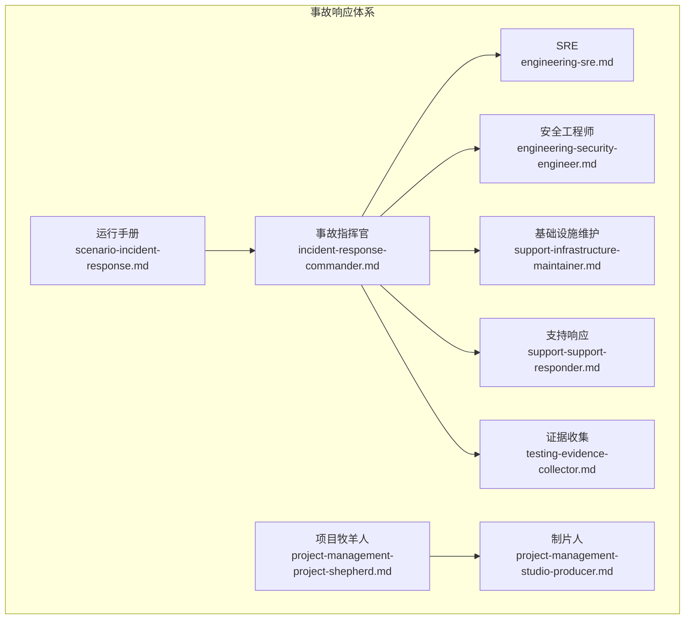
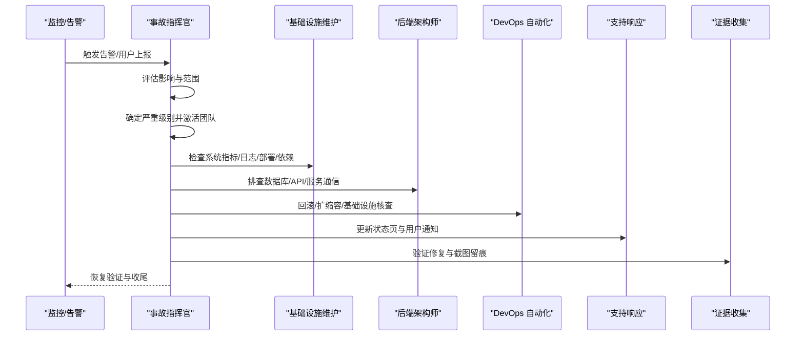
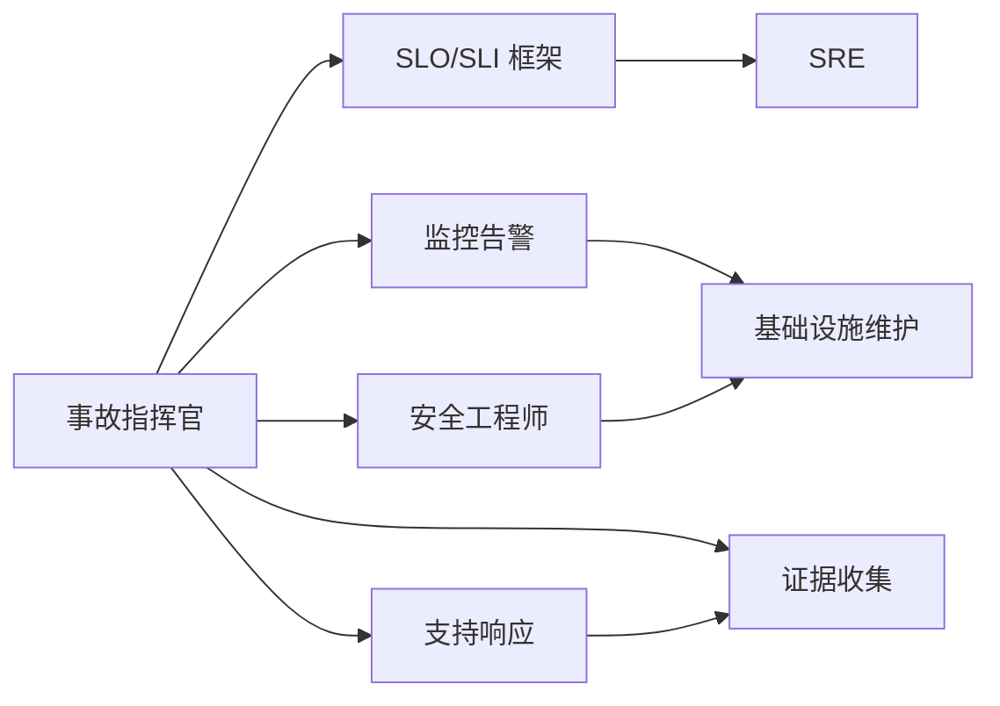
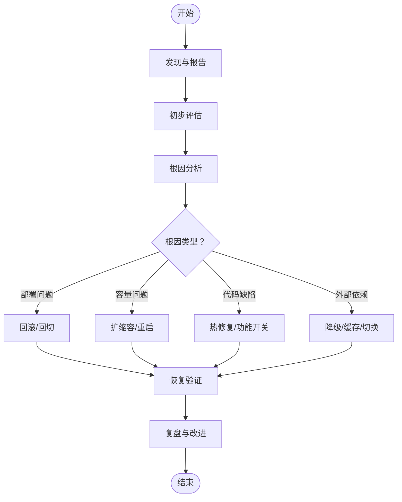

# 生产事故处理运行手册

<cite>
**本文档引用的文件**
- [scenario-incident-response.md](file://strategy/runbooks/scenario-incident-response.md)
- [engineering-incident-response-commander.md](file://engineering/engineering-incident-response-commander.md)
- [engineering-sre.md](file://engineering/engineering-sre.md)
- [engineering-security-engineer.md](file://engineering/engineering-security-engineer.md)
- [support-infrastructure-maintainer.md](file://support/support-infrastructure-maintainer.md)
- [support-support-responder.md](file://support/support-support-responder.md)
- [testing-evidence-collector.md](file://testing/testing-evidence-collector.md)
- [project-management-studio-producer.md](file://project-management/project-management-studio-producer.md)
- [project-management-project-shepherd.md](file://project-management/project-management-project-shepherd.md)
</cite>

## 目录
1. [引言](#引言)
2. [项目结构](#项目结构)
3. [核心组件](#核心组件)
4. [架构总览](#架构总览)
5. [详细组件分析](#详细组件分析)
6. [依赖关系分析](#依赖关系分析)
7. [性能考量](#性能考量)
8. [故障排查指南](#故障排查指南)
9. [结论](#结论)
10. [附录](#附录)

## 引言
本运行手册面向生产环境突发事故的应急响应，提供从事故发现到事后复盘的完整流程与标准规范。内容涵盖事故分级与响应级别确定、团队组织结构与职责分工、标准处置流程（发现与报告、初步评估、根因分析、修复实施、恢复验证、事后总结）、预防策略、监控告警与灾难恢复配置指引。目标是帮助跨职能团队在高压环境下快速、有序、可追溯地解决问题，并持续改进系统可靠性。

## 项目结构
该仓库以“智能体”（Agent）为单位组织能力模块，围绕“事故响应”形成多角色协同体系：
- 运行手册与流程：strategy/runbooks/scenario-incident-response.md
- 事故指挥官：engineering/engineering-incident-response-commander.md
- SRE 能力：engineering/engineering-sre.md
- 安全工程师：engineering/engineering-security-engineer.md
- 基础设施维护：support/support-infrastructure-maintainer.md
- 支持响应：support/support-support-responder.md
- 质量证据收集：testing/testing-evidence-collector.md
- 制片人与项目牧羊人：project-management 下的高层与执行层角色

图表来源
- [scenario-incident-response.md:1-218](file://strategy/runbooks/scenario-incident-response.md#L1-L218)
- [engineering-incident-response-commander.md:1-445](file://engineering/engineering-incident-response-commander.md#L1-L445)
- [engineering-sre.md:1-91](file://engineering/engineering-sre.md#L1-L91)
- [engineering-security-engineer.md:1-305](file://engineering/engineering-security-engineer.md#L1-L305)
- [support-infrastructure-maintainer.md:1-618](file://support/support-infrastructure-maintainer.md#L1-L618)
- [support-support-responder.md:1-585](file://support/support-support-responder.md#L1-L585)
- [testing-evidence-collector.md:1-211](file://testing/testing-evidence-collector.md#L1-L211)
- [project-management-project-shepherd.md:1-194](file://project-management/project-management-project-shepherd.md#L1-L194)
- [project-management-studio-producer.md:1-203](file://project-management/project-management-studio-producer.md#L1-L203)

章节来源
- [scenario-incident-response.md:1-218](file://strategy/runbooks/scenario-incident-response.md#L1-L218)
- [engineering-incident-response-commander.md:1-445](file://engineering/engineering-incident-response-commander.md#L1-L445)

## 核心组件
- 事故分级与响应矩阵：明确 P0/P1/P2/P3 的定义、响应时限与团队构成，确保资源与沟通节奏匹配影响面。
- 事故指挥官：负责严重性判定、角色分配、沟通节奏、工具集成与持续改进推动。
- SRE：定义 SLO/SLI/SLA，驱动可观测性与自动化，保障错误预算与发布节奏。
- 安全工程师：威胁建模、漏洞评估、安全测试与事件响应，覆盖应用与云安全。
- 基础设施维护：监控告警、备份与灾备、容量规划与成本优化。
- 支持响应：客户沟通、状态页更新、危机传播管理。
- 证据收集：以截图与实证为核心的 QA 验证，确保修复可验证、可追溯。
- 项目管理：高层制片人与项目牧羊人分别承担战略与执行层面的资源协调与交付保障。

章节来源
- [scenario-incident-response.md:11-50](file://strategy/runbooks/scenario-incident-response.md#L11-L50)
- [engineering-incident-response-commander.md:19-62](file://engineering/engineering-incident-response-commander.md#L19-L62)
- [engineering-sre.md:19-36](file://engineering/engineering-sre.md#L19-L36)
- [engineering-security-engineer.md:27-79](file://engineering/engineering-security-engineer.md#L27-L79)
- [support-infrastructure-maintainer.md:19-53](file://support/support-infrastructure-maintainer.md#L19-L53)
- [support-support-responder.md:19-53](file://support/support-support-responder.md#L19-L53)
- [testing-evidence-collector.md:19-38](file://testing/testing-evidence-collector.md#L19-L38)

## 架构总览
事故处理采用“统一指挥、并行调查、分层决策”的架构模式：
- 指挥中枢：事故指挥官统一决策、分配角色、控制沟通节奏。
- 并行调查：基础设施维护、后端架构师、前端开发者、安全工程师等按职责并行取证。
- 分层决策：根据根因自动选择回滚、扩缩容、热修复或外部依赖处置。
- 验证闭环：证据收集与基础设施验证双轨确认，确保无次生问题。
- 复盘改进：48 小时内完成复盘，沉淀到运行手册与监控策略。

图表来源
- [scenario-incident-response.md:53-147](file://strategy/runbooks/scenario-incident-response.md#L53-L147)
- [engineering-incident-response-commander.md:352-378](file://engineering/engineering-incident-response-commander.md#L352-L378)

## 详细组件分析

### 事故分级与响应矩阵
- P0：完全停机、数据丢失、安全泄露；立即全员响应。
- P1：关键功能中断、显著性能退化；1 小时内响应。
- P2：次要功能异常、可绕过；4 小时内响应。
- P3：界面小问题、无用户影响；下个迭代处理。
- 对应团队：P0 包含基础设施维护、DevOps、后端/前端架构师、支持响应、高管沟通；P1 为基础设施维护、DevOps、相关开发者、支持响应；P2 为相关开发者+证据收集；P3 交由冲刺优先级管理。

章节来源
- [scenario-incident-response.md:11-50](file://strategy/runbooks/scenario-incident-response.md#L11-L50)

### 事故指挥官（Incident Commander）
- 核心使命：建立并执行严重性框架、协调实时响应、推动复盘与持续改进。
- 关键规则：必须进行严重性分级、明确角色、固定时间点通报、记录行动轨迹、对假设路径设定时限。
- 技术交付：标准化严重性矩阵、运行手册模板、复盘模板、SLO/SLI 框架、沟通模板、值班轮换配置。
- 工作流：检测与宣告、结构化响应与协调、解决与稳定、复盘与持续改进。

章节来源
- [engineering-incident-response-commander.md:19-62](file://engineering/engineering-incident-response-commander.md#L19-L62)
- [engineering-incident-response-commander.md:352-378](file://engineering/engineering-incident-response-commander.md#L352-L378)
- [engineering-incident-response-commander.md:218-278](file://engineering/engineering-incident-response-commander.md#L218-L278)
- [engineering-incident-response-commander.md:280-309](file://engineering/engineering-incident-response-commander.md#L280-L309)

### SRE（站点可靠性工程师）
- 核心任务：SLO/错误预算、可观测性、减少手工运维、混沌工程、容量规划。
- 关键原则：错误预算驱动决策、先测量再优化、自动化代替英雄主义、渐进式发布。
- 技术交付：SLO 定义、观测三支柱（指标/日志/追踪）、金光信号（延迟/流量/错误/饱和）。
- 与事故响应集成：基于 SLO 影响度分级、自动化运行手册、复盘聚焦系统性改进。

章节来源
- [engineering-sre.md:19-36](file://engineering/engineering-sre.md#L19-L36)
- [engineering-sre.md:37-63](file://engineering/engineering-sre.md#L37-L63)
- [engineering-sre.md:65-84](file://engineering/engineering-sre.md#L65-L84)

### 安全工程师
- 核心任务：威胁建模、漏洞评估、安全测试、安全架构设计、事件响应。
- 关键原则：输入皆敌、默认拒绝、零信任、防御纵深、最小权限。
- 技术交付：威胁模型文档、安全代码审查模式、CI/CD 安全流水线、攻击面清单。
- 事故响应：安全事件分流、隔离与遏制、根因分析、影响评估与加固建议。

章节来源
- [engineering-security-engineer.md:27-79](file://engineering/engineering-security-engineer.md#L27-L79)
- [engineering-security-engineer.md:80-119](file://engineering/engineering-security-engineer.md#L80-L119)
- [engineering-security-engineer.md:221-263](file://engineering/engineering-security-engineer.md#L221-L263)
- [engineering-security-engineer.md:296-301](file://engineering/engineering-security-engineer.md#L296-L301)

### 基础设施维护
- 核心任务：系统可靠性与性能优化、监控告警、备份与灾备、成本与效率。
- 关键规则：变更前全面监控、测试备份与恢复、文档化变更与回滚步骤。
- 技术交付：Prometheus 监控配置与告警规则、基础设施即代码（IaC）、自动化备份与恢复脚本。
- 与事故响应集成：CPU/内存/磁盘/服务可用性告警、扩缩容/重启/故障转移、灾备演练。

章节来源
- [support-infrastructure-maintainer.md:19-53](file://support/support-infrastructure-maintainer.md#L19-L53)
- [support-infrastructure-maintainer.md:56-134](file://support/support-infrastructure-maintainer.md#L56-L134)
- [support-infrastructure-maintainer.md:281-447](file://support/support-infrastructure-maintainer.md#L281-L447)

### 支持响应
- 核心任务：多渠道客户服务、主动客户成功、危机传播管理。
- 关键规则：以客户为中心、一致性服务、质量与一致性标准、升级流程。
- 技术交付：全渠道支持框架、支持分析仪表板、知识库管理系统、交互报告模板。
- 与事故响应集成：状态页更新、用户通知、声誉保护、客户满意度追踪。

章节来源
- [support-support-responder.md:19-53](file://support/support-support-responder.md#L19-L53)
- [support-support-responder.md:54-135](file://support/support-support-responder.md#L54-L135)
- [support-support-responder.md:416-441](file://support/support-support-responder.md#L416-L441)
- [support-support-responder.md:443-530](file://support/support-support-responder.md#L443-L530)

### 证据收集（QA）
- 核心理念：截图不撒谎、默认找问题、以实证为准、拒绝“完美幻想”。
- 测试方法：现实检查命令、视觉证据分析、交互元素测试（手风琴/表单/导航/移动端/暗色模式）。
- 报告模板：基于证据的报告、问题清单、真实质量评估、后续步骤。
- 与事故响应集成：修复验证、截图留痕、回归确认。

章节来源
- [testing-evidence-collector.md:19-38](file://testing/testing-evidence-collector.md#L19-L38)
- [testing-evidence-collector.md:70-118](file://testing/testing-evidence-collector.md#L70-L118)
- [testing-evidence-collector.md:119-174](file://testing/testing-evidence-collector.md#L119-L174)

### 项目管理：制片人与项目牧羊人
- 制片人：高层创意与技术项目编排、资源分配、多项目组合管理、业务增长与市场领导力。
- 项目牧羊人：跨职能项目协调、时间线管理、利益相关者对齐、风险管控与质量交付。
- 与事故响应集成：高层资源协调、跨团队沟通、业务影响评估与汇报。

章节来源
- [project-management-studio-producer.md:19-55](file://project-management/project-management-studio-producer.md#L19-L55)
- [project-management-project-shepherd.md:19-55](file://project-management/project-management-project-shepherd.md#L19-L55)

## 依赖关系分析
- 指挥官依赖 SRE 的 SLO/SLI 框架进行严重性判定与沟通节奏控制。
- 基础设施维护提供监控告警与基础设施状态，支撑并行调查。
- 安全工程师在涉及数据泄露或认证失败时介入，提供安全视角的根因与处置。
- 支持响应与证据收集贯穿整个处置链路，确保对外沟通一致与修复可验证。
- 项目管理角色在高层与执行层面提供资源与交付保障。

图表来源
- [engineering-incident-response-commander.md:352-378](file://engineering/engineering-incident-response-commander.md#L352-L378)
- [engineering-sre.md:37-63](file://engineering/engineering-sre.md#L37-L63)
- [support-infrastructure-maintainer.md:56-134](file://support/support-infrastructure-maintainer.md#L56-L134)
- [engineering-security-engineer.md:296-301](file://engineering/engineering-security-engineer.md#L296-L301)
- [support-support-responder.md:54-135](file://support/support-support-responder.md#L54-L135)
- [testing-evidence-collector.md:70-118](file://testing/testing-evidence-collector.md#L70-L118)

## 性能考量
- 响应时效：通过明确的严重性矩阵与沟通节奏，将 P0 的首次响应控制在分钟级，P1 在小时内解决。
- 可观测性：以指标、日志、追踪为核心，结合 SLO/SLI 实时判断系统健康度，避免“看起来好”而误判。
- 自动化：回滚、扩缩容、重启、备份与恢复脚本减少人工干预时间，降低二次失误概率。
- 成本与效率：容量规划与成本优化在保证 SLA 的前提下，持续降低基础设施成本。

## 故障排查指南
- 发现与报告：监控告警或用户上报触发，事故指挥官进行初步影响评估与严重性判定。
- 初步评估：并行检查系统指标、日志、最近部署与外部依赖，锁定可能范围。
- 根因分析：依据调查结果，使用“5 问”等方法定位系统性原因，避免归咎个人。
- 修复实施：根据根因选择回滚、扩缩容、热修复或外部依赖处置，优先止血。
- 恢复验证：证据收集与基础设施共同验证修复效果，确认无次生问题并持续观察。
- 事后总结：48 小时内完成复盘，输出改进措施并纳入运行手册与监控策略。

图表来源
- [scenario-incident-response.md:53-147](file://strategy/runbooks/scenario-incident-response.md#L53-L147)
- [engineering-incident-response-commander.md:352-378](file://engineering/engineering-incident-response-commander.md#L352-L378)

章节来源
- [scenario-incident-response.md:51-184](file://strategy/runbooks/scenario-incident-response.md#L51-L184)
- [engineering-incident-response-commander.md:352-378](file://engineering/engineering-incident-response-commander.md#L352-L378)

## 结论
通过明确的分级与团队分工、结构化的处置流程、可观测性与自动化支撑，以及持续改进的复盘机制，本运行手册为生产事故提供了可落地、可验证、可持续的治理方案。建议定期演练与更新运行手册、完善监控与告警、强化安全与灾备，以提升整体韧性与交付质量。

## 附录

### 监控告警与灾备配置要点
- 监控：Prometheus 抓取与告警规则，包含 CPU/内存/磁盘/服务可用性等关键指标。
- 告警：区分严重等级，结合 SLO/SLI 设定阈值与抑制策略。
- 灾备：自动化备份与恢复脚本，定期演练恢复流程，确保可审计与可追溯。

章节来源
- [support-infrastructure-maintainer.md:56-134](file://support/support-infrastructure-maintainer.md#L56-L134)
- [support-infrastructure-maintainer.md:281-447](file://support/support-infrastructure-maintainer.md#L281-L447)

### 事故预防策略
- SLO/SLI/SLA：以数据驱动的可靠性目标指导发布节奏与风险控制。
- 混沌工程：定期开展可控故障注入与跨团队演练，暴露系统薄弱环节。
- 安全左移：在 CI/CD 中集成安全扫描与测试，前置漏洞与配置风险。
- 文化建设：构建“可报告、可改进”的无责文化，鼓励及时上报与深度复盘。

章节来源
- [engineering-sre.md:29-36](file://engineering/engineering-sre.md#L29-L36)
- [engineering-incident-response-commander.md:28-41](file://engineering/engineering-incident-response-commander.md#L28-L41)
- [engineering-security-engineer.md:29-35](file://engineering/engineering-security-engineer.md#L29-L35)