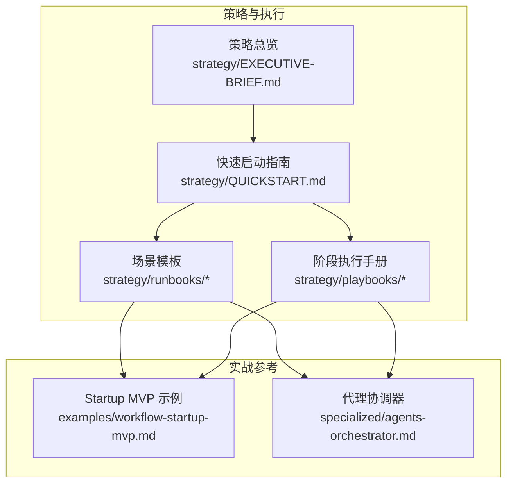
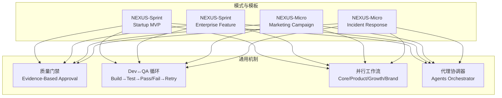
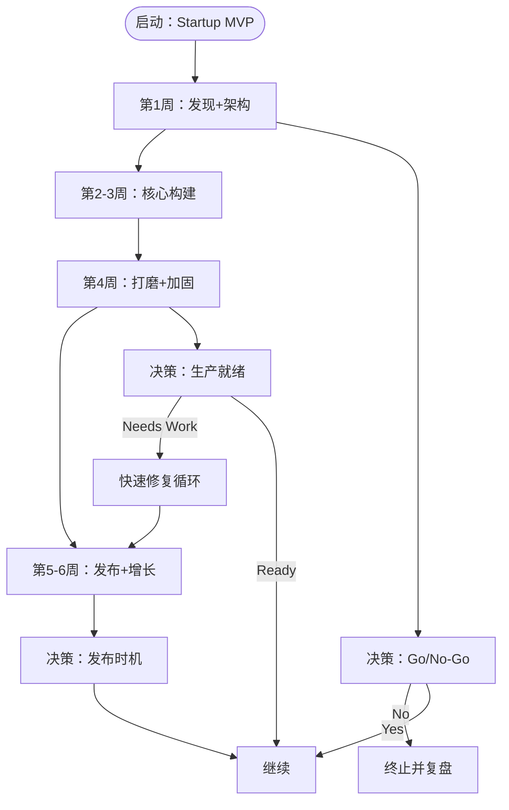
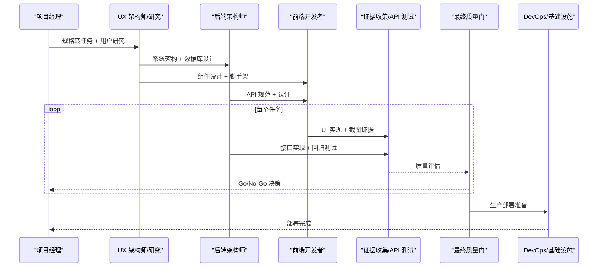
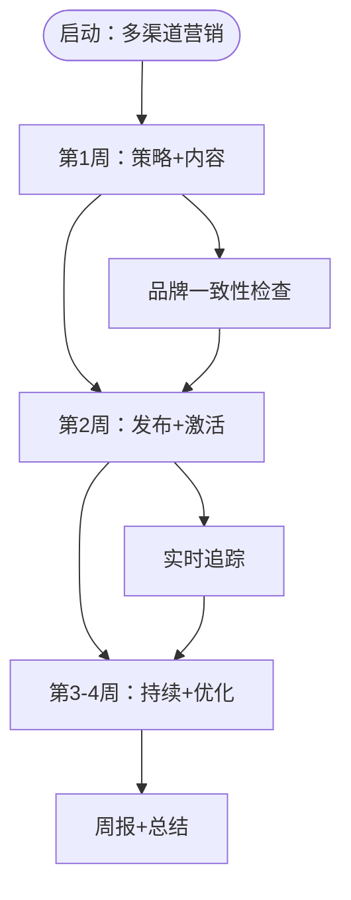
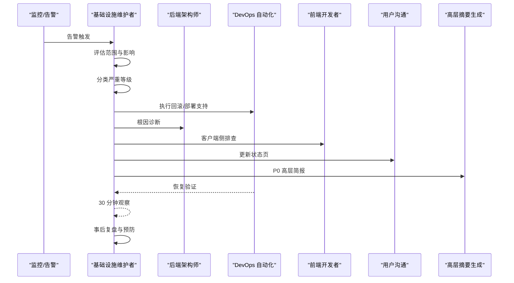
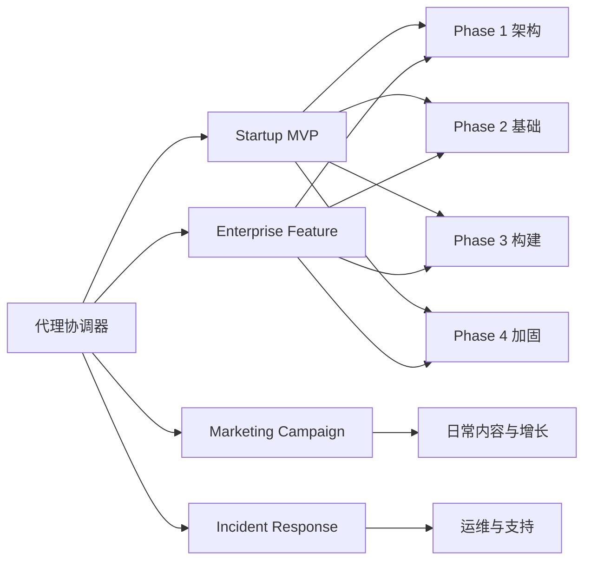

# 运行手册与场景模板

<cite>
**本文档引用的文件**
- [strategy/runbooks/scenario-startup-mvp.md](file://strategy/runbooks/scenario-startup-mvp.md)
- [strategy/runbooks/scenario-enterprise-feature.md](file://strategy/runbooks/scenario-enterprise-feature.md)
- [strategy/runbooks/scenario-marketing-campaign.md](file://strategy/runbooks/scenario-marketing-campaign.md)
- [strategy/runbooks/scenario-incident-response.md](file://strategy/runbooks/scenario-incident-response.md)
- [examples/workflow-startup-mvp.md](file://examples/workflow-startup-mvp.md)
- [strategy/QUICKSTART.md](file://strategy/QUICKSTART.md)
- [strategy/EXECUTIVE-BRIEF.md](file://strategy/EXECUTIVE-BRIEF.md)
- [strategy/playbooks/phase-0-discovery.md](file://strategy/playbooks/phase-0-discovery.md)
- [strategy/playbooks/phase-1-strategy.md](file://strategy/playbooks/phase-1-strategy.md)
- [strategy/playbooks/phase-2-foundation.md](file://strategy/playbooks/phase-2-foundation.md)
- [README.md](file://README.md)
- [specialized/agents-orchestrator.md](file://specialized/agents-orchestrator.md)
</cite>

## 目录
1. [简介](#简介)
2. [项目结构](#项目结构)
3. [核心组件](#核心组件)
4. [架构总览](#架构总览)
5. [详细组件分析](#详细组件分析)
6. [依赖关系分析](#依赖关系分析)
7. [性能考虑](#性能考虑)
8. [故障排除指南](#故障排除指南)
9. [结论](#结论)
10. [附录](#附录)

## 简介
本文件系统化梳理四种标准场景模板的设计思路与使用方法，帮助团队在不同业务阶段快速选择合适的工作模式：
- Startup MVP Runbook（4-6 周 MVP 构建）
- Enterprise Feature Runbook（企业功能开发）
- Marketing Campaign Runbook（多渠道营销活动）
- Incident Response Runbook（生产事故处理）

每种场景均明确适用条件、所需代理团队、工作流程、时间安排与预期成果，并提供实际应用案例与最佳实践，便于按项目需求灵活选用。

## 项目结构
围绕“场景模板 + 阶段性执行手册 + 快速启动指南”的组织方式，形成从发现到运营的完整闭环：
- 场景模板：位于 strategy/runbooks 下，覆盖四类典型场景
- 阶段执行手册：位于 strategy/playbooks 下，定义 NEXUS 的七阶段流程
- 快速启动：位于 strategy/ 下，提供三种模式（Full/Sprint/Micro）与关键概念
- 实战示例：位于 examples/ 下，展示如何将模板落地为可执行工作流

图表来源
- [strategy/EXECUTIVE-BRIEF.md:1-96](file://strategy/EXECUTIVE-BRIEF.md#L1-L96)
- [strategy/QUICKSTART.md:1-195](file://strategy/QUICKSTART.md#L1-L195)
- [strategy/runbooks/scenario-startup-mvp.md:1-155](file://strategy/runbooks/scenario-startup-mvp.md#L1-L155)
- [strategy/runbooks/scenario-enterprise-feature.md:1-158](file://strategy/runbooks/scenario-enterprise-feature.md#L1-L158)
- [strategy/runbooks/scenario-marketing-campaign.md:1-188](file://strategy/runbooks/scenario-marketing-campaign.md#L1-L188)
- [strategy/runbooks/scenario-incident-response.md:1-218](file://strategy/runbooks/scenario-incident-response.md#L1-L218)
- [examples/workflow-startup-mvp.md:1-156](file://examples/workflow-startup-mvp.md#L1-L156)
- [specialized/agents-orchestrator.md:1-367](file://specialized/agents-orchestrator.md#L1-L367)

章节来源
- [strategy/EXECUTIVE-BRIEF.md:1-96](file://strategy/EXECUTIVE-BRIEF.md#L1-L96)
- [strategy/QUICKSTART.md:1-195](file://strategy/QUICKSTART.md#L1-L195)

## 核心组件
- 四大场景模板：Startup MVP、Enterprise Feature、Marketing Campaign、Incident Response
- 七阶段执行手册：Discovery → Strategy → Foundation → Build → Harden → Launch → Operate
- 快速启动模式：NEXUS-Full（完整产品生命周期）、NEXUS-Sprint（MVP/特性构建）、NEXUS-Micro（专项任务）
- 代理协调器：Agents Orchestrator，负责端到端流水线编排与质量门禁

章节来源
- [strategy/QUICKSTART.md:11-121](file://strategy/QUICKSTART.md#L11-L121)
- [strategy/EXECUTIVE-BRIEF.md:40-57](file://strategy/EXECUTIVE-BRIEF.md#L40-L57)
- [specialized/agents-orchestrator.md:19-52](file://specialized/agents-orchestrator.md#L19-L52)

## 架构总览
四种场景模板均遵循统一的“质量门禁 + 并行执行 + 可验证证据”的设计原则，通过阶段性评审与自动化回路确保交付质量与效率。

图表来源
- [strategy/QUICKSTART.md:144-152](file://strategy/QUICKSTART.md#L144-L152)
- [strategy/EXECUTIVE-BRIEF.md:11-28](file://strategy/EXECUTIVE-BRIEF.md#L11-L28)
- [specialized/agents-orchestrator.md:27-32](file://specialized/agents-orchestrator.md#L27-L32)

## 详细组件分析

### Startup MVP Runbook（4-6 周 MVP 构建）
- 适用条件
  - 需要在 4-6 周内验证产品市场契合度（PMF），快速上线可验证版本
  - 团队规模适中（18-22 人），强调速度与质量平衡
- 所需代理团队
  - 核心团队（始终在线）：协调器、项目经理、优先级管理、UX 架构师、前端/后端架构师、DevOps、证据收集、最终质量门
  - 成长团队（第 3 周起激活）：增长黑客、内容创作者、社交媒体策略师
  - 支持团队（按需）：品牌守护者、数据分析、快速原型、AI 工程师、性能基准、基础设施维护
- 时间安排与执行
  - 第 1 周：压缩发现 + 架构（趋势研究、线框图、技术架构、品牌基础、待办评分与冲刺计划、环境搭建）
  - 第 2-3 周：核心构建（Dev↔QA 循环、病毒机制与推荐系统、发布内容与分析仪表盘）
  - 第 4 周：打磨与加固（截图套件、性能测试、品牌一致性审计、最终集成测试、生产准备）
  - 第 5-6 周：发布与增长（部署、渠道激活、实时监控、优化与迭代）
- 关键决策点
  - 概念 Go/No-Go（第 2 天结束）
  - 架构审批（第 4 天结束）
  - MVP 功能范围（冲刺规划）
  - 生产就绪（第 4 周第 5 天）
  - 发布时机（质量门批准后）
- 成功指标
  - 上线时间 ≤ 6 周；核心功能完成率 100%；48 小时内首用户上线；首周系统可用性 > 99%；首两周收集 ≥ 50 条用户反馈
- 常见陷阱与缓解
  - 范围蔓延：优先级管理坚持 MoSCoW 原则
  - 过度工程化：快速原型思维——先验证再扩展
  - 跳过 QA：每个任务都必须通过证据收集
  - 缺少监控：第 1 周即建立监控
  - 无反馈机制：从第 1 冲刺即内置反馈采集

图表来源
- [strategy/runbooks/scenario-startup-mvp.md:43-124](file://strategy/runbooks/scenario-startup-mvp.md#L43-L124)
- [strategy/runbooks/scenario-startup-mvp.md:126-135](file://strategy/runbooks/scenario-startup-mvp.md#L126-L135)

章节来源
- [strategy/runbooks/scenario-startup-mvp.md:1-155](file://strategy/runbooks/scenario-startup-mvp.md#L1-L155)

### Enterprise Feature Runbook（企业功能开发）
- 适用条件
  - 在现有企业产品上新增重大功能，合规、安全与质量门禁不可妥协
  - 多利益相关方需要对齐，功能需与既有系统无缝集成
- 所需代理团队
  - 核心团队：协调器、项目牧羊人、项目经理、优先级管理、UX 架构师/研究、UI 设计师、前后端工程师、高级开发者、DevOps、证据收集、API 测试、最终质量门、性能基准
  - 合规与治理：法律合规检查员、品牌守护者、财务跟踪、高层摘要生成
  - 质量保证：测试结果分析、流程优化、实验追踪
- 执行计划
  - 阶段 1：需求与架构（第 1-2 周：利益相关方对齐、用户研究、合规扫描、规格转任务、预算框架、品牌影响评估、架构评审）
  - 阶段 2：基础（第 3 周：特性分支流水线、特性开关、组件脚手架、API 脚手架、数据库迁移、预发环境）
  - 阶段 3：构建（第 4-9 周：Dev↔QA 循环、双周汇报、利益相关方演示）
  - 阶段 4：加固（第 10-11 周：截图套件、回归测试、负载测试、合规终审、基础设施就绪、最终判定）
  - 阶段 5：发布（第 12 周：金丝雀发布、实时监控、功能采用追踪、用户支持、早期反馈、发布报告）
- 利益相关方沟通节奏
  - 高层发起人：双周报（高层摘要生成）
  - 产品团队：每周（项目牧羊人）
  - 工程团队：每日（代理协调器）
  - 合规团队：月度（法律合规检查员）
  - 财务：月度（财务跟踪）
- 质量要求
  - 代码覆盖率 > 80%
  - API 响应时间 P95 < 200ms
  - 无障碍 WCAG 2.1 AA
  - 安全零严重漏洞
  - 品牌一致率 ≥ 95%
  - 规格符合率 100%
  - 负载能力 10 倍当前流量
- 风险管理
  - 集成复杂度高：早期集成测试 + 每冲刺 API 测试
  - 范围蔓延：MoSCoW 强制 + 项目牧羊人变更管理
  - 合规问题：从第一天即纳入合规检查
  - 性能回归：每冲刺性能基准测试
  - 利益相关方不一致：双周高层简报 + 项目牧羊人协调

图表来源
- [strategy/runbooks/scenario-enterprise-feature.md:47-125](file://strategy/runbooks/scenario-enterprise-feature.md#L47-L125)
- [strategy/runbooks/scenario-enterprise-feature.md:127-158](file://strategy/runbooks/scenario-enterprise-feature.md#L127-L158)

章节来源
- [strategy/runbooks/scenario-enterprise-feature.md:1-158](file://strategy/runbooks/scenario-enterprise-feature.md#L1-L158)

### Marketing Campaign Runbook（多渠道营销活动）
- 适用条件
  - 在多个平台开展协同营销活动，内容需平台适配、品牌一致且数据驱动
  - 目标是推动可衡量的获客与互动
- 所需代理团队
  - 核心：社交媒体策略师（跨平台策略）、内容创作者（多格式内容）、增长黑客（获客策略与漏斗优化）、品牌守护者（跨渠道品牌一致性）、数据分析（表现追踪与优化）
  - 平台专家：Twitter Engager、TikTok 策略师、Instagram Curator、Reddit 社区构建者、应用商店优化师
  - 支持：趋势研究员（市场时机与趋势对齐）、实验追踪（A/B 测试变体）、高层摘要生成、法律合规检查（广告合规、披露要求）
- 执行计划
  - 第 1 周：策略与内容创作（跨平台策略、市场时机分析、获客漏斗设计、品牌指南、合规审查、内容生产）
  - 第 2 周：发布与激活（内容排期、追踪验证、A/B 测试配置、落地页上线、团队沟通协议）
  - 第 3-4 周：持续与优化（每日平台运营、每周回顾、ROI 分析、总结报告）
- 关键指标
  - 总触达、平均跨平台互动率、点击率、转化率、获客成本、品牌情感、内容发布数量、A/B 测试完成数
- 平台特定 KPI
  - Twitter/X：曝光+互动率、粉丝增长
  - TikTok：观看+完播率、粉丝增长
  - Instagram：触达+收藏、主页访问
  - Reddit：点赞+评论质量、引流流量
  - 邮件：打开率+点击率、退订率
  - 博客：自然流量+停留时长、外链数
  - 付费广告：ROAS+CPA、质量分
- 品牌一致性检查点
  - 发布前内容审核、每周视觉一致性审计、每周声音与语调检查、发布前+每周合规审查

图表来源
- [strategy/runbooks/scenario-marketing-campaign.md:39-153](file://strategy/runbooks/scenario-marketing-campaign.md#L39-L153)
- [strategy/runbooks/scenario-marketing-campaign.md:155-188](file://strategy/runbooks/scenario-marketing-campaign.md#L155-L188)

章节来源
- [strategy/runbooks/scenario-marketing-campaign.md:1-188](file://strategy/runbooks/scenario-marketing-campaign.md#L1-L188)

### Incident Response Runbook（生产事故处理）
- 适用条件
  - 生产环境出现故障，影响用户，需要快速响应但同时确保正确处置
- 严重等级分类
  - P0：服务完全中断、数据丢失、安全事件（立即全员响应）
  - P1：主要功能中断、显著性能下降（<1 小时）
  - P2：次要功能中断、有替代方案（<4 小时）
  - P3：外观问题、小不便（下一冲刺）
- 不同等级响应团队
  - P0：基础设施维护者（指挥官）、DevOps 自动化、后端架构师、前端开发者、用户沟通、高层摘要生成
  - P1：基础设施维护者、DevOps 支持、相关开发者、用户沟通
  - P2：相关开发者、证据收集
  - P3：优先级管理（加入待办）
- 应急响应序列
  - 检测与分诊（0-5 分钟）：告警触发→范围评估→严重等级→激活相应团队→创建应急通道
  - 调查（5-30 分钟）：并行调查→系统指标→错误日志→最近部署→外部依赖
  - 缓解（15-60 分钟）：决策树→回滚/扩缩容/热修复/外部依赖降级→用户状态页更新→高层简报（P0）
  - 解决验证（修复后）：证据收集确认→基础设施监控→API 测试回归
  - 事后复盘（48 小时内）：时间线重建→根因分析（5 问法）→影响评估→预防措施→行动项
- 沟通模板
  - 状态页更新（用户沟通）
  - 高层简报（P0，含影响与预计恢复时间）
- 升级矩阵
  - P0 超时→工作室负责人升级
  - P1 超时→项目牧羊人资源重分配
  - 涉及数据泄露→法律合规检查员评估通知
  - 影响用户数据→法律合规检查员+高层摘要生成
  - 收入影响超阈值→财务跟踪+工作室负责人评估

图表来源
- [strategy/runbooks/scenario-incident-response.md:51-184](file://strategy/runbooks/scenario-incident-response.md#L51-L184)
- [strategy/runbooks/scenario-incident-response.md:186-218](file://strategy/runbooks/scenario-incident-response.md#L186-L218)

章节来源
- [strategy/runbooks/scenario-incident-response.md:1-218](file://strategy/runbooks/scenario-incident-response.md#L1-L218)

### 实际应用案例与最佳实践
- Startup MVP 示例：以“远程团队回顾工具”为例，展示从概念到 MVP 的步骤式工作流，强调并行工作、质量门与上下文传递的重要性
- 最佳实践
  - 明确阶段边界与质量门，避免“完成即交付”
  - 使用证据驱动的质量门（截图、测试结果、数据）
  - 在每个阶段结束进行评审与决策，而非“最后一刻才验收”
  - 保持代理间的标准化交接模板，减少上下文丢失
  - 对于紧急事故，严格遵守严重等级与升级路径

章节来源
- [examples/workflow-startup-mvp.md:1-156](file://examples/workflow-startup-mvp.md#L1-L156)
- [strategy/QUICKSTART.md:144-152](file://strategy/QUICKSTART.md#L144-L152)

## 依赖关系分析
- 场景模板与阶段手册的耦合
  - Startup MVP/Enterprise Feature 与 Phase 1-4 的架构、构建、加固紧密对应
  - Marketing Campaign 与日常运营中的内容与增长流程相衔接
  - Incident Response 与运维与支持团队的协作流程直接映射
- 代理协调器的作用
  - 作为流水线控制器，贯穿所有场景模板，确保 Dev↔QA 循环与质量门的严格执行
  - 通过标准化提示词与交接模板，降低跨团队协作的摩擦

图表来源
- [strategy/playbooks/phase-1-strategy.md:17-239](file://strategy/playbooks/phase-1-strategy.md#L17-L239)
- [strategy/playbooks/phase-2-foundation.md:17-279](file://strategy/playbooks/phase-2-foundation.md#L17-L279)
- [specialized/agents-orchestrator.md:19-52](file://specialized/agents-orchestrator.md#L19-L52)

章节来源
- [strategy/playbooks/phase-0-discovery.md:1-179](file://strategy/playbooks/phase-0-discovery.md#L1-L179)
- [strategy/playbooks/phase-1-strategy.md:1-239](file://strategy/playbooks/phase-1-strategy.md#L1-L239)
- [strategy/playbooks/phase-2-foundation.md:1-279](file://strategy/playbooks/phase-2-foundation.md#L1-L279)
- [specialized/agents-orchestrator.md:1-367](file://specialized/agents-orchestrator.md#L1-L367)

## 性能考虑
- 并行执行与结构化交接是压缩周期的关键，NEXUS 的并行四轨（核心产品、增长、质量、品牌）相较串行可节省 40-60%
- Dev↔QA 循环与最大重试限制（每任务最多 3 次）能提前捕获缺陷，减少后期硬化时间
- 质量门默认“需要改进”的立场，可有效避免“幻想式批准”，提升上线质量

章节来源
- [strategy/EXECUTIVE-BRIEF.md:11-28](file://strategy/EXECUTIVE-BRIEF.md#L11-L28)
- [strategy/QUICKSTART.md:144-152](file://strategy/QUICKSTART.md#L144-L152)

## 故障排除指南
- 常见问题
  - 质量门未通过：检查证据是否充分（截图、测试结果、数据）
  - 任务反复失败：查看 QA 反馈，调整实现后再试（最多 3 次）
  - 交接断层：使用标准化交接模板，确保上下文完整
  - 事故响应延迟：严格遵循严重等级与升级矩阵，P0 立即全员响应
- 建议
  - 在每个阶段结束进行评审与决策，避免“最后一刻才验收”
  - 对于紧急事故，优先保障用户沟通与高层简报（P0）
  - 定期复盘，沉淀预防措施与行动项

章节来源
- [strategy/runbooks/scenario-startup-mvp.md:146-155](file://strategy/runbooks/scenario-startup-mvp.md#L146-L155)
- [strategy/runbooks/scenario-enterprise-feature.md:149-158](file://strategy/runbooks/scenario-enterprise-feature.md#L149-L158)
- [strategy/runbooks/scenario-incident-response.md:186-218](file://strategy/runbooks/scenario-incident-response.md#L186-L218)

## 结论
四种场景模板以统一的质量门禁与证据驱动为核心，结合并行工作流与代理协调器，既满足快速交付的需求，又确保企业级质量与合规要求。建议：
- 新功能开发优先采用 NEXUS-Sprint（Startup MVP/Enterprise Feature）
- 多渠道营销采用 NEXUS-Micro（Marketing Campaign）
- 生产事故严格遵循 NEXUS-Micro（Incident Response）
- 通过阶段手册与快速启动指南，将模板转化为可执行的流水线

## 附录
- 快速启动模式与关键概念
  - 三种模式：NEXUS-Full（完整产品生命周期）、NEXUS-Sprint（MVP/特性构建）、NEXUS-Micro（专项任务）
  - 关键概念：质量门禁、Dev↔QA 循环、标准化交接、最终质量门、证据优于陈述
- 场景模板与阶段手册对照
  - Startup MVP → Phase 1-4（发现→策略→基础→构建→加固）
  - Enterprise Feature → Phase 1-4（需求→架构→基础→构建→加固）
  - Marketing Campaign → 日常内容与增长流程
  - Incident Response → 运维与支持流程

章节来源
- [strategy/QUICKSTART.md:11-121](file://strategy/QUICKSTART.md#L11-L121)
- [strategy/EXECUTIVE-BRIEF.md:29-40](file://strategy/EXECUTIVE-BRIEF.md#L29-L40)
- [README.md:352-416](file://README.md#L352-L416)