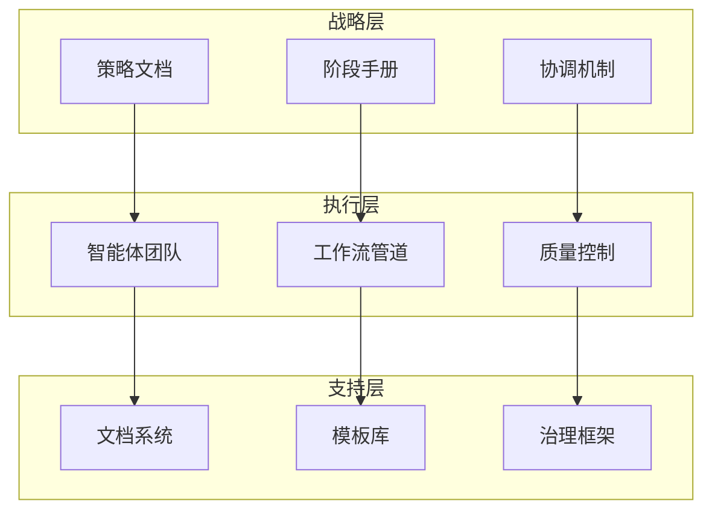
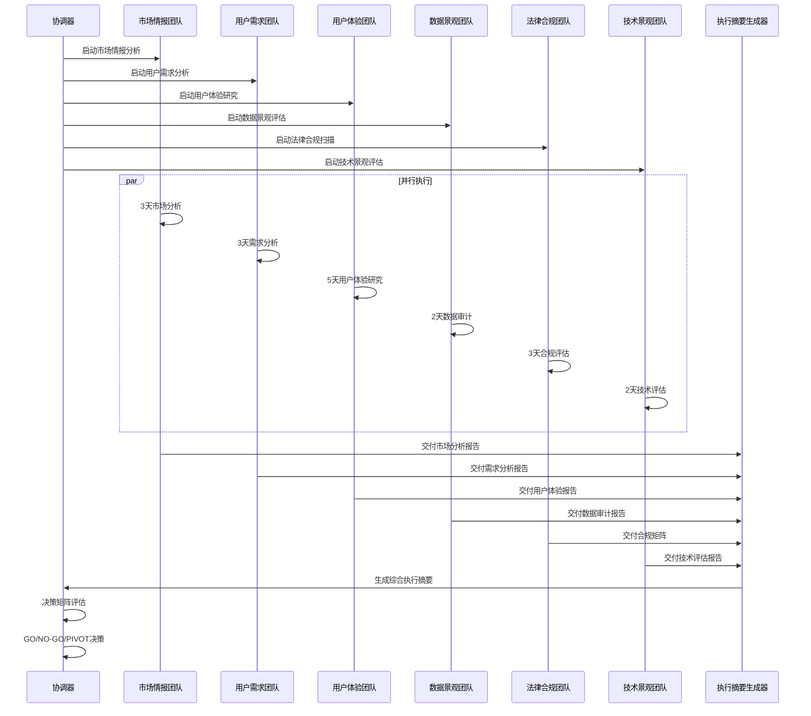
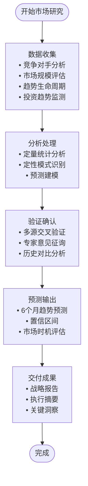
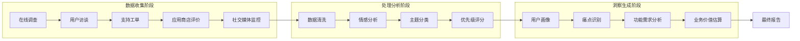
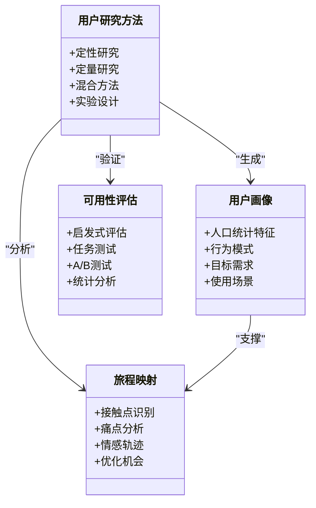
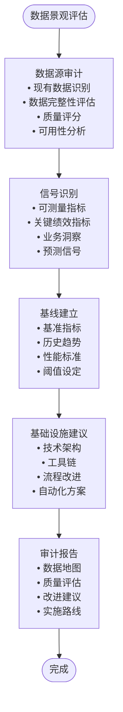
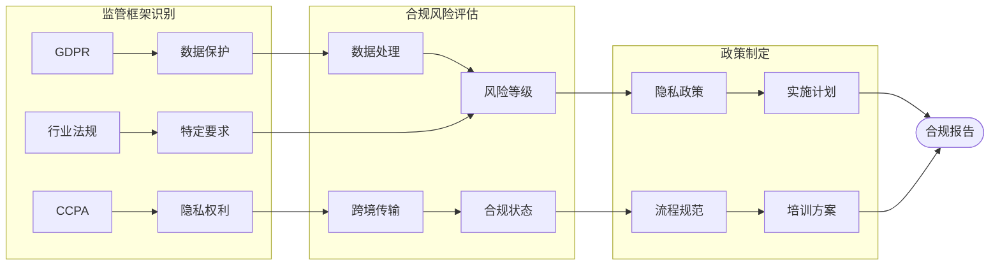
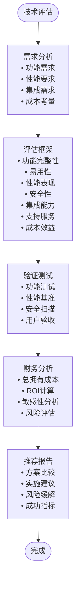
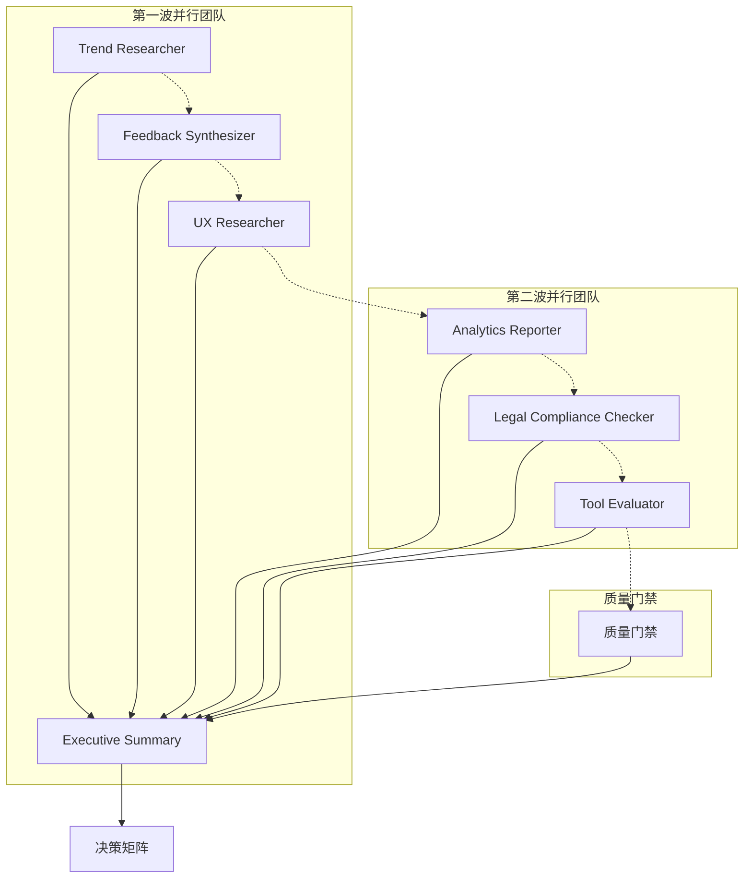

# Phase 0 发现阶段

<cite>
**本文档引用的文件**
- [phase-0-discovery.md](file://strategy/playbooks/phase-0-discovery.md)
- [EXECUTIVE-BRIEF.md](file://strategy/EXECUTIVE-BRIEF.md)
- [QUICKSTART.md](file://strategy/QUICKSTART.md)
- [product-trend-researcher.md](file://product/product-trend-researcher.md)
- [product-feedback-synthesizer.md](file://product/product-feedback-synthesizer.md)
- [design-ux-researcher.md](file://design/design-ux-researcher.md)
- [support-analytics-reporter.md](file://support/support-analytics-reporter.md)
- [support-legal-compliance-checker.md](file://support/support-legal-compliance-checker.md)
- [testing-tool-evaluator.md](file://testing/testing-tool-evaluator.md)
- [support-executive-summary-generator.md](file://support/support-executive-summary-generator.md)
- [agent-activation-prompts.md](file://strategy/coordination/agent-activation-prompts.md)
- [handoff-templates.md](file://strategy/coordination/handoff-templates.md)
</cite>

## 目录
1. [引言](#引言)
2. [项目结构](#项目结构)
3. [核心组件](#核心组件)
4. [架构概览](#架构概览)
5. [详细组件分析](#详细组件分析)
6. [依赖关系分析](#依赖关系分析)
7. [性能考虑](#性能考虑)
8. [故障排除指南](#故障排除指南)
9. [结论](#结论)

## 引言

Phase 0 发现阶段是 NEXUS 多智能体协作系统中的关键验证阶段。本阶段的核心目标是在投入大量资源之前，通过六个并行启动的专业智能体团队对项目机会进行全面验证。该阶段采用"先验证，后构建"的策略，确保产品开发建立在坚实的市场洞察、用户需求、技术可行性和合规基础之上。

## 项目结构

NEXUS 系统采用分层组织结构，包含九个专业领域和七个阶段的完整工作流程：

**图表来源**
- [EXECUTIVE-BRIEF.md:1-96](file://strategy/EXECUTIVE-BRIEF.md#L1-L96)
- [QUICKSTART.md:1-195](file://strategy/QUICKSTART.md#L1-L195)

**章节来源**
- [EXECUTIVE-BRIEF.md:1-96](file://strategy/EXECUTIVE-BRIEF.md#L1-L96)
- [QUICKSTART.md:1-195](file://strategy/QUICKSTART.md#L1-L195)

## 核心组件

Phase 0 发现阶段由六个专门的智能体团队组成，每个团队都有明确的专业职责和交付标准：

### 团队配置与职责分工

| 智能体团队 | 核心职责 | 交付周期 | 关键能力 |
|-----------|----------|----------|----------|
| 市场情报团队 | 趋势研究、竞争分析、市场规模评估 | 3天 | 定量分析、预测建模、信号检测 |
| 用户需求团队 | 反馈收集、情感分析、痛点识别 | 3天 | 多渠道整合、优先级评分、RICE模型 |
| 用户体验团队 | 行为分析、人物画像、旅程映射 | 5天 | 用户研究、可用性测试、洞察提炼 |
| 数据景观团队 | 数据审计、信号识别、基线建立 | 2天 | 统计分析、数据质量评估、基础设施建议 |
| 法律合规团队 | 监管扫描、合规风险评估、框架制定 | 3天 | 多司法管辖区合规、风险量化、政策制定 |
| 技术景观团队 | 技术栈评估、构建vs购买分析、集成可行性 | 2天 | 架构评估、成本效益分析、风险评估 |

**章节来源**
- [phase-0-discovery.md:17-112](file://strategy/playbooks/phase-0-discovery.md#L17-L112)

## 架构概览

Phase 0 发现阶段采用并行执行架构，通过标准化的工作流和质量门禁确保各团队间的协调一致：

**图表来源**
- [phase-0-discovery.md:17-132](file://strategy/playbooks/phase-0-discovery.md#L17-L132)

## 详细组件分析

### 市场情报团队（趋势研究员）

#### 核心能力与方法论

趋势研究员采用多维度分析框架，结合定量数据和定性洞察：

**图表来源**
- [product-trend-researcher.md:56-88](file://product/product-trend-researcher.md#L56-L88)

#### 关键交付物要求

- **竞争格局分析**：直接和间接竞争对手识别，SWOT分析
- **市场规模评估**：TAM、SAM、SOM三层次分析，方法论说明
- **趋势生命周期映射**：采用曲线阶段识别和持续时间预测
- **趋势预测**：3-6个月预测，包含置信区间
- **投资趋势分析**：融资环境和资金流向洞察

**章节来源**
- [phase-0-discovery.md:21-35](file://strategy/playbooks/phase-0-discovery.md#L21-L35)
- [product-trend-researcher.md:15-54](file://product/product-trend-researcher.md#L15-L54)

### 用户需求团队（反馈合成器）

#### 分析框架与处理流程

反馈合成器采用系统化的多渠道反馈处理流程：

**图表来源**
- [product-feedback-synthesizer.md:65-77](file://product/product-feedback-synthesizer.md#L65-L77)

#### 核心能力指标

- **处理速度**：< 24小时关键问题响应，实时仪表板更新
- **主题准确性**：90%+经利益相关者验证
- **行动洞察率**：85%合成反馈推动可测量决策
- **满意度相关性**：反馈洞察提升NPS 10+点
- **特征预测准确率**：80%反馈驱动特征成功率

**章节来源**
- [phase-0-discovery.md:37-50](file://strategy/playbooks/phase-0-discovery.md#L37-L50)
- [product-feedback-synthesizer.md:46-54](file://product/product-feedback-synthesizer.md#L46-L54)

### 用户体验团队（UX研究员）

#### 研究方法与洞察产出

UX研究员采用严谨的用户中心设计方法论：

**图表来源**
- [design-ux-researcher.md:164-190](file://design/design-ux-researcher.md#L164-L190)

#### 研究交付标准

- **用户画像开发**：3-5个主要用户画像，基于实证数据
- **旅程映射**：主要用户流程的完整旅程图
- **可用性评估**：竞争产品的启发式评估
- **行为洞察**：具有统计验证的行为模式识别
- **研究方法论**：可复制的研究框架和验证程序

**章节来源**
- [phase-0-discovery.md:52-65](file://strategy/playbooks/phase-0-discovery.md#L52-L65)
- [design-ux-researcher.md:54-190](file://design/design-ux-researcher.md#L54-L190)

### 数据景观团队（分析报告员）

#### 数据分析框架与质量保证

数据分析员专注于建立数据驱动的决策基础：

**图表来源**
- [support-analytics-reporter.md:222-247](file://support/support-analytics-reporter.md#L222-L247)

#### 关键评估维度

- **数据质量**：完整性、准确性、一致性评分
- **信号有效性**：可测量性、相关性、时效性
- **基础设施适配**：技术栈兼容性、扩展性、维护性
- **业务影响**：ROI潜力、实施复杂度、风险评估

**章节来源**
- [phase-0-discovery.md:69-82](file://strategy/playbooks/phase-0-discovery.md#L69-L82)
- [support-analytics-reporter.md:249-310](file://support/support-analytics-reporter.md#L249-L310)

### 法律合规团队（合规检查员）

#### 合规框架与风险管理

法律合规检查员提供全面的法律风险评估：

**图表来源**
- [support-legal-compliance-checker.md:404-430](file://support/support-legal-compliance-checker.md#L404-L430)

#### 合规评估标准

- **监管框架覆盖**：适用法规的全面识别和评估
- **数据处理合规**：处理活动的合法性、目的限制、最小化原则
- **用户权利保障**：访问权、更正权、删除权、限制处理权
- **跨境数据传输**：适当的保护措施和合规机制
- **违规风险评估**：潜在违规的严重性和概率评估

**章节来源**
- [phase-0-discovery.md:84-97](file://strategy/playbooks/phase-0-discovery.md#L84-L97)
- [support-legal-compliance-checker.md:431-490](file://support/support-legal-compliance-checker.md#L431-L490)

### 技术景观团队（工具评估员）

#### 技术评估与选择框架

工具评估员提供客观的技术解决方案评估：

**图表来源**
- [testing-tool-evaluator.md:279-304](file://testing/testing-tool-evaluator.md#L279-L304)

#### 评估维度与权重

- **功能性**：核心功能完整性（权重：25%）
- **易用性**：用户体验和学习曲线（权重：20%）
- **性能**：速度、可靠性、可扩展性（权重：15%）
- **安全性**：数据保护和合规性（权重：15%）
- **集成性**：API质量和系统兼容性（权重：10%）
- **支持性**：供应商支持质量和文档（权重：8%）
- **成本性**：总拥有成本和性价比（权重：7%）

**章节来源**
- [phase-0-discovery.md:99-112](file://strategy/playbooks/phase-0-discovery.md#L99-L112)
- [testing-tool-evaluator.md:305-345](file://testing/testing-tool-evaluator.md#L305-L345)

## 依赖关系分析

### 团队间协作关系

**图表来源**
- [phase-0-discovery.md:17-143](file://strategy/playbooks/phase-0-discovery.md#L17-L143)

### 时间线与里程碑

| 阶段 | 时间节点 | 关键活动 | 交付物 |
|------|----------|----------|--------|
| 第1天 | Day 1 | 团队启动 | 各团队开始独立分析 |
| 第2天 | Day 2 | 初步进展 | 数据景观团队完成初步评估 |
| 第3天 | Day 3 | 中期报告 | 市场情报、用户需求、法律合规团队完成中期报告 |
| 第4天 | Day 4 | 深入分析 | 用户体验团队进行深度研究 |
| 第5天 | Day 5 | 最终整合 | 执行摘要生成器开始整合报告 |
| 第6天 | Day 6 | 质量审查 | 质量门禁评估 |
| 第7天 | Day 7 | 决策发布 | GO/NO-GO/PIVOT决策 |

**章节来源**
- [phase-0-discovery.md:114-149](file://strategy/playbooks/phase-0-discovery.md#L114-L149)

## 性能考虑

### 并行执行优势

NEXUS 系统通过并行执行显著提升整体效率：

- **时间压缩**：40-60%的项目周期缩短
- **资源优化**：同时利用9个专业领域的智能体
- **质量保证**：多角度验证减少决策风险
- **知识共享**：跨团队协作促进最佳实践传播

### 关键性能指标

| 指标类型 | 目标值 | 测量方法 |
|----------|--------|----------|
| 项目周期 | 3-7天 | 从启动到决策发布 |
| 团队协同效率 | 95%+ | 任务按时完成率 |
| 决策质量 | 80%+ | 基于证据的决策比例 |
| 资源利用率 | 90%+ | 智能体有效工作时间 |
| 质量门禁通过率 | 95%+ | 首次通过率 |

## 故障排除指南

### 常见问题与解决方案

#### 问题1：数据质量不足
**症状**：分析结果不可靠，洞察缺乏统计意义
**解决方案**：
- 增加数据源数量和多样性
- 实施数据质量验证流程
- 使用多个数据源进行交叉验证

#### 问题2：团队间沟通不畅
**症状**：交付物格式不统一，内容重复或缺失
**解决方案**：
- 使用标准化的手稿模板
- 建立定期同步会议机制
- 实施质量门禁确保交付物符合标准

#### 问题3：决策延迟
**症状**：执行摘要生成器无法按时完成整合
**解决方案**：
- 明确各团队的截止时间
- 设定中间里程碑检查点
- 准备备用方案应对延迟

**章节来源**
- [handoff-templates.md:347-358](file://strategy/coordination/handoff-templates.md#L347-L358)

### 质量门禁检查清单

| 检查项 | 通过标准 | 验证方法 | 影响 |
|--------|----------|----------|------|
| 市场机会验证 | TAM超过最低阈值 | 市场研究报告 | 项目可行性 |
| 用户痛点验证 | ≥3个验证痛点 | 用户研究和反馈分析 | 产品定位 |
| 合规风险评估 | 无阻断性合规问题 | 合规矩阵评估 | 法律风险 |
| 数据可用性 | 关键指标和数据源明确 | 数据审计报告 | 技术实现 |
| 技术可行性 | 技术栈可行且经过评估 | 技术评估报告 | 开发难度 |
| 执行摘要质量 | ≤500字的SCQA格式 | 执行摘要模板 | 决策质量 |

**章节来源**
- [phase-0-discovery.md:134-143](file://strategy/playbooks/phase-0-discovery.md#L134-L143)

## 结论

Phase 0 发现阶段通过六个专业智能体团队的并行协作，为后续的产品开发奠定了坚实的基础。该阶段的核心价值在于：

1. **风险前置管理**：在投入大量资源前识别和化解关键风险
2. **数据驱动决策**：基于定量分析和定性洞察做出明智选择
3. **跨领域协同**：整合市场、用户、技术、法律等多维度视角
4. **标准化流程**：通过明确的交付标准和质量门禁确保结果质量

通过严格执行 Phase 0 的验证流程，组织可以显著提高项目成功率，减少后期变更成本，并为后续的 Phase 1-6 提供清晰的执行蓝图。这一阶段的成功实施是 NEXUS 多智能体协作系统能够实现高效、高质量项目交付的关键保障。