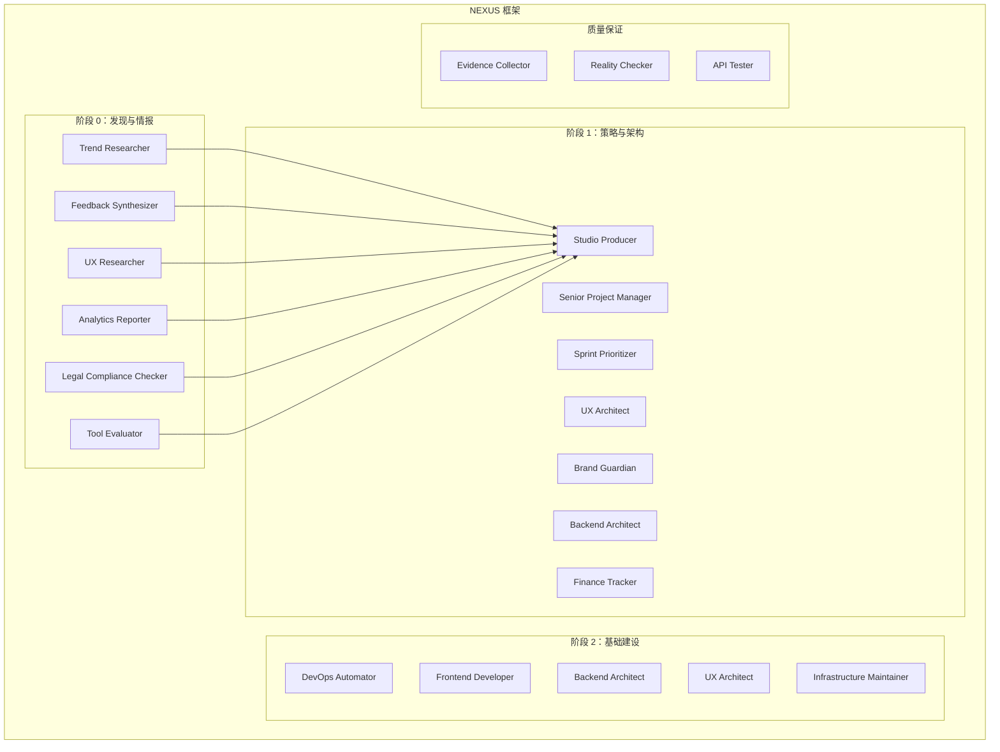
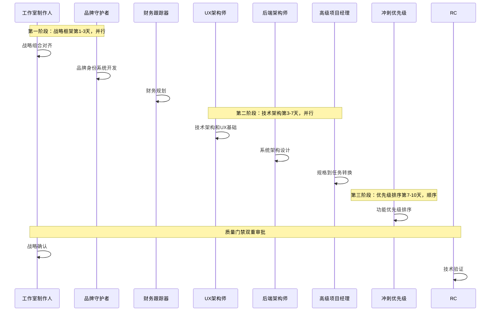
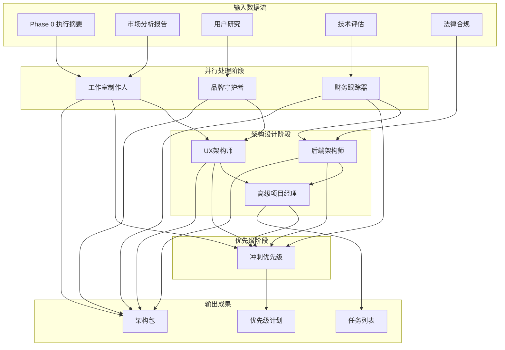
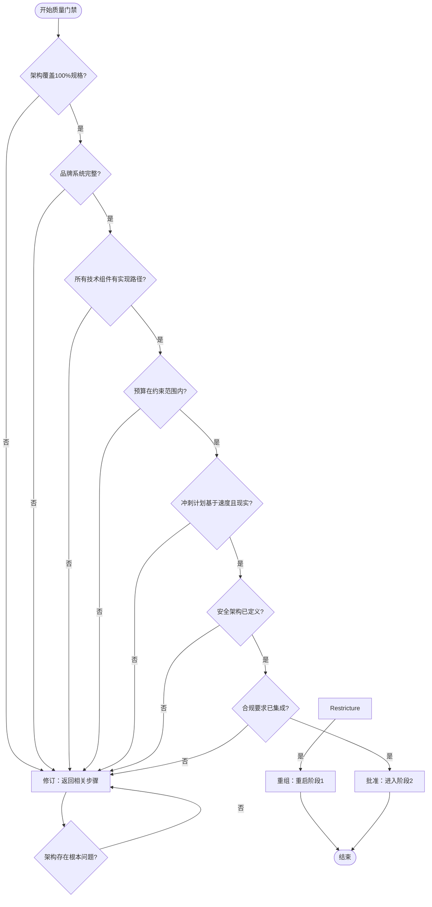

# Phase 1 策略阶段

<cite>
**本文档引用的文件**
- [phase-1-strategy.md](file://strategy/playbooks/phase-1-strategy.md)
- [phase-0-discovery.md](file://strategy/playbooks/phase-0-discovery.md)
- [project-management-studio-producer.md](file://project-management/project-management-studio-producer.md)
- [project-manager-senior.md](file://project-management/project-manager-senior.md)
- [product-sprint-prioritizer.md](file://product/product-sprint-prioritizer.md)
- [design-ux-architect.md](file://design/design-ux-architect.md)
- [design-brand-guardian.md](file://design/design-brand-guardian.md)
- [engineering-backend-architect.md](file://engineering/engineering-backend-architect.md)
- [support-finance-tracker.md](file://support/support-finance-tracker.md)
- [EXECUTIVE-BRIEF.md](file://strategy/EXECUTIVE-BRIEF.md)
- [QUICKSTART.md](file://strategy/QUICKSTART.md)
</cite>

## 目录
1. [引言](#引言)
2. [项目结构](#项目结构)
3. [核心组件](#核心组件)
4. [架构概览](#架构概览)
5. [详细组件分析](#详细组件分析)
6. [依赖关系分析](#依赖关系分析)
7. [性能考虑](#性能考虑)
8. [故障排除指南](#故障排除指南)
9. [结论](#结论)

## 引言

Phase 1 策略阶段是 NEXUS 多智能体协作框架中的关键里程碑，负责将市场洞察转化为可执行的技术架构和项目规划。本阶段的核心目标是在投入实际开发之前，建立完整的项目蓝图，确保所有技术决策都有据可依，每个功能都经过优先级排序，每一分钱都得到合理分配。

该阶段采用并行工作流设计，通过八个专业智能体的协同工作，实现从战略规划到技术架构的全面覆盖。阶段时长为5-10天，需要工作室制作人和现实检查员作为质量守门人进行双重审批。

## 项目结构

NEXUS 框架采用分阶段的流水线设计，每个阶段都有明确的目标、参与者和交付标准：

**图表来源**
- [phase-1-strategy.md:1-239](file://strategy/playbooks/phase-1-strategy.md#L1-L239)
- [phase-0-discovery.md:1-179](file://strategy/playbooks/phase-0-discovery.md#L1-L179)

## 核心组件

### 工作室制作人（Studio Producer）
工作室制作人是整个项目的首席战略官，负责将创意愿景与商业目标对齐，管理复杂的跨职能项目，并确保工作室运营的最优化。

**核心职责**：
- 战略组合管理与创意愿景制定
- 资源分配与团队绩效优化
- 市场扩张策略与业务增长驱动
- 风险管理和投资回报率追踪

**成功指标**：
- 组合投资回报率超过25%
- 95%的战略项目按时交付
- 客户满意度评分4.8/5以上
- 市场份额排名前三位

### 高级项目经理（Senior Project Manager）
高级项目经理专注于将规格说明书转化为可执行的开发任务，确保范围现实且无奢华功能。

**核心职责**：
- 规格分析与任务分解
- 接受标准制定与质量要求
- 技术栈需求提取与组件规范
- 开发流程优化与经验积累

**关键规则**：
- 不添加规格中未包含的功能
- 严格的任务验收标准
- 开发者友好的任务结构
- 现实的进度预期

### 冲刺优先级（Sprint Prioritizer）
冲刺优先级专家专注于敏捷冲刺规划、功能优先级排序和资源分配，通过数据驱动的方法最大化团队效率和业务价值。

**核心能力**：
- RICE优先级框架应用
- 敏捷方法论实施（Scrum、看板等）
- 容量规划与依赖管理
- 利益相关者沟通与对齐

**成功指标**：
- 冲刺完成率90%+
- 团队速度稳定性±15%
- 功能成功率80%+
- 技术债务保持在20%以下

### 用户体验架构师（UX Architect）
UX 架构师为开发者提供坚实的技术基础、CSS系统和清晰的实现指导，桥接项目规格与实现之间的差距。

**核心使命**：
- 创建开发者友好的基础架构
- 提供CSS设计系统和布局框架
- 建立组件架构和命名约定
- 设计响应式断点策略

**默认要求**：
- 所有新网站包含浅色/深色/系统主题切换
- 可扩展的CSS架构先于实现开始
- 清晰的实现规范和模式库

### 品牌守护者（Brand Guardian）
品牌守护者专注于品牌身份发展、一致性维护和战略性品牌定位，确保所有触点的一致性和保护品牌价值。

**核心职责**：
- 品牌策略和身份系统开发
- 品牌声音和消息架构建立
- 品牌合规监控和保护
- 品牌延伸和重新定位指导

**默认要求**：
- 包含品牌保护和监控策略
- 全面的品牌一致性保证
- 长期品牌演化的指导原则

### 后端架构师（Backend Architect）
后端架构师专注于可扩展系统设计、数据库架构、API开发和云基础设施，构建稳健、安全、高性能的服务器端应用程序。

**核心使命**：
- 数据/模式工程卓越
- 可扩展系统架构设计
- 系统可靠性保障
- 性能优化和安全保障

**默认要求**：
- 所有系统包含全面的安全措施和监控
- 水平扩展设计从一开始就考虑
- 亚200毫秒的API响应时间目标

### 财务跟踪器（Finance Tracker）
财务跟踪器专注于财务规划、预算管理和业务绩效分析，通过精确的财务数据维护业务财务健康。

**核心职责**：
- 综合预算框架开发
- 现金流管理优化
- 投资分析和风险评估
- 财务合规和控制

**关键特征**：
- 所有流程包含财务合规验证
- 详细的审计跟踪文档
- 风险管理和缓解策略
- 年度预测和情景规划

**章节来源**
- [phase-1-strategy.md:17-182](file://strategy/playbooks/phase-1-strategy.md#L17-L182)
- [project-management-studio-producer.md:19-56](file://project-management/project-management-studio-producer.md#L19-L56)
- [project-manager-senior.md:19-52](file://project-management/project-manager-senior.md#L19-L52)
- [product-sprint-prioritizer.md:12-55](file://product/product-sprint-prioritizer.md#L12-L55)
- [design-ux-architect.md:19-61](file://design/design-ux-architect.md#L19-L61)
- [design-brand-guardian.md:19-54](file://design/design-brand-guardian.md#L19-L54)
- [engineering-backend-architect.md:19-61](file://engineering/engineering-backend-architect.md#L19-L61)
- [support-finance-tracker.md:19-53](file://support/support-finance-tracker.md#L19-L53)

## 架构概览

Phase 1 策略阶段采用三阶段并行工作流设计，确保高效的质量保证和知识传递：

**图表来源**
- [phase-1-strategy.md:17-182](file://strategy/playbooks/phase-1-strategy.md#L17-L182)

## 详细组件分析

### 战略框架阶段（第1-3天）

#### 工作室制作人工作流
工作室制作人负责将市场洞察转化为可执行的战略计划，重点关注组织战略目标的对齐和资源配置。

**关键输出**：
- 战略组合计划（包含项目定位）
- 视觉、目标和ROI目标
- 资源分配策略
- 风险/奖励评估
- 成功标准和里程碑定义

#### 品牌守护者工作流
品牌守护者专注于创建完整的企业身份系统，确保品牌在所有触点上的一致性。

**核心交付**：
- 品牌基础（目的、愿景、使命、价值观、个性）
- 视觉身份系统（颜色、字体、间距作为CSS变量）
- 品牌声音和消息架构
- 商标使用指南

#### 财务跟踪器工作流
财务跟踪器负责创建全面的项目预算和资源成本预测。

**关键要素**：
- 项目预算的综合分类
- 资源成本预测（智能体、基础设施、工具）
- ROI模型和盈亏平衡分析
- 现金流时间表
- 财务风险评估和应急储备

**章节来源**
- [phase-1-strategy.md:19-68](file://strategy/playbooks/phase-1-strategy.md#L19-L68)

### 技术架构阶段（第3-7天）

#### UX架构师工作流
UX架构师为开发者提供坚实的CSS系统和清晰的实现路径，桥接视觉要求与技术实现。

**技术交付**：
- CSS设计系统（变量、令牌、比例）
- 布局框架（网格/弹性盒模式、响应式断点）
- 组件架构（命名约定、层次结构）
- 信息架构（页面流程、内容层次）
- 主题系统（浅色/深色/系统切换）
- 无障碍基础（WCAG 2.1 AA基线）

**文件产出**：
- css/design-system.css
- css/layout.css
- css/components.css
- docs/ux-architecture.md

#### 后端架构师工作流
后端架构师专注于可扩展系统设计和数据库架构，确保系统的安全性、可靠性和性能。

**架构要素**：
- 系统架构规范
  - 架构模式（微服务/单体/无服务器/混合）
  - 通信模式（REST/GraphQL/gRPC/事件驱动）
  - 数据模式（CQRS/事件溯源/传统CRUD）
- 数据库模式设计和索引策略
- API设计规范和版本控制
- 认证和授权架构
- 安全架构（纵深防御）
- 可扩展性计划（水平扩展策略）

#### 高级项目经理工作流
高级项目经理负责将所有Phase 0文档和架构规范转化为具体的开发任务列表。

**任务创建原则**：
- 严格引用规格中的确切要求
- 每个任务都有明确的验收标准
- 映射任务间的依赖关系
- 实际的努力估算（故事点或小时数）

**规则约束**：
- 不添加规格中未包含的功能
- 严格引用规格文本
- 对努力估算保持现实

**章节来源**
- [phase-1-strategy.md:70-157](file://strategy/playbooks/phase-1-strategy.md#L70-L157)

### 优先级排序阶段（第7-10天）

#### 冲刺优先级工作流
冲刺优先级专家负责基于数据驱动的优先级框架对功能进行排序，确保资源的有效利用。

**优先级框架**：
- **RICE框架**：影响、信心、努力的量化评估
- **MoSCoW分类**：必须/应该/可以/不会
- **价值vs努力矩阵**：快速胜利与重大投资的平衡
- **Kano模型**：基本期望、性能提升、惊喜功能的分类

**关键输出**：
- RICE评分的待办事项列表
- 基于速度的冲刺分配
- 依赖关系图和关键路径
- MoSCoW分类（必须/应该/可以/不会）
- 包含里程碑映射的发布计划

**章节来源**
- [phase-1-strategy.md:159-182](file://strategy/playbooks/phase-1-strategy.md#L159-L182)

## 依赖关系分析

Phase 1 策略阶段建立了复杂的依赖关系网络，确保信息在各个智能体间有效传递：

**图表来源**
- [phase-1-strategy.md:19-182](file://strategy/playbooks/phase-1-strategy.md#L19-L182)
- [phase-0-discovery.md:114-174](file://strategy/playbooks/phase-0-discovery.md#L114-L174)

### 关键依赖关系

1. **工作室制作人依赖**：
   - Phase 0 市场分析报告
   - 用户研究结果
   - 技术可行性评估

2. **UX架构师依赖**：
   - 品牌守护者的视觉身份系统
   - Phase 0 用户研究
   - 法律合规要求

3. **后端架构师依赖**：
   - Phase 0 技术栈评估
   - 法律合规要求
   - 财务约束

4. **高级项目经理依赖**：
   - 所有Phase 0文档
   - 架构规范（可用时）

5. **冲刺优先级依赖**：
   - 高级项目经理的任务列表
   - 后端架构师的系统架构
   - UX架构师的UX架构
   - 财务跟踪器的预算框架
   - 工作室制作人的战略计划

**章节来源**
- [phase-1-strategy.md:161-182](file://strategy/playbooks/phase-1-strategy.md#L161-L182)

## 性能考虑

### 时间效率优化

NEXUS 框架通过并行工作流设计显著提高项目效率：

- **并行执行**：四个同时进行的工作流压缩时间20-40%
- **标准化协议**：减少交接边界冲突，避免重复工作
- **证据驱动**：防止"幻想批准"，减少返工
- **Dev↔QA循环**：在集成前捕获95%缺陷，减少硬化工时

### 质量保证机制

1. **证据要求**：所有评估都需要证据支持
2. **最大重试限制**：每个任务最多3次重试
3. **现实检查员**：最终质量权威，默认"需要改进"
4. **质量门禁**：每个阶段都有明确的验收标准

### 资源优化策略

- **组合投资回报率**：目标25%+，平衡风险
- **95%按时交付率**：确保战略项目按时完成
- **客户满意度4.8/5**：衡量项目管理质量
- **团队表现基准**：超越行业标准

## 故障排除指南

### 常见问题及解决方案

#### 问题1：跨职能团队协调困难
**症状**：智能体间缺乏结构化协调协议
**解决方案**：使用标准化交接模板和上下文连续性
**预防措施**：建立明确的交接协议和证据要求

#### 问题2：质量评估缺乏客观标准
**症状**：基本实现被评为A+而无证明
**解决方案**：现实检查员的默认"需要改进"立场
**预防措施**：建立证据为基础的质量门禁

#### 问题3：并行执行导致混乱
**症状**：4个并行轨道同时运行造成混乱
**解决方案**：NEXUS的并行工作流设计
**预防措施**：明确的阶段划分和质量门禁

#### 问题4：架构设计缺乏证据支撑
**症状**：架构决策缺乏依据
**解决方案**：现实检查员作为最终质量防线
**预防措施**：结构化的升级协议和最大重试限制

### 质量门禁检查清单

| # | 准则 | 证据来源 | 状态 |
|---|------|----------|------|
| 1 | 架构涵盖100%规格要求 | 高级项目经理任务列表与架构交叉参考 | ☐ |
| 2 | 品牌系统完整（徽标、颜色、字体、声音） | 品牌守护者交付物 | ☐ |
| 3 | 所有技术组件都有实现路径 | 后端架构师+UX架构师规格 | ☐ |
| 4 | 预算获批且在约束范围内 | 财务跟踪器计划 | ☐ |
| 5 | 冲刺计划基于速度且现实 | 冲刺优先级待办事项 | ☐ |
| 6 | 安全架构已定义 | 后端架构师安全规格 | ☐ |
| 7 | 合规要求已融入架构 | 法律要求映射到技术决策 | ☐ |

### 决策流程

**图表来源**
- [phase-1-strategy.md:184-203](file://strategy/playbooks/phase-1-strategy.md#L184-L203)

## 结论

Phase 1 策略阶段通过精心设计的多智能体协作框架，实现了从市场洞察到技术架构的无缝转换。该阶段的关键成功因素包括：

1. **明确的角色分工**：每个智能体都有清晰的职责边界和交付标准
2. **并行工作流设计**：通过四个同时进行的工作流压缩20-40%的时间
3. **证据驱动的质量保证**：所有决策都需要客观证据支持
4. **严格的质量门禁**：双重审批确保交付质量
5. **标准化的交接协议**：减少跨职能团队协作中的摩擦

该框架不仅提高了项目执行效率，更重要的是建立了可持续的多智能体协作模式，为后续阶段的成功奠定了坚实基础。通过实施这些最佳实践，组织可以在竞争激烈的市场环境中实现更快的产品上市时间和更高的成功率。