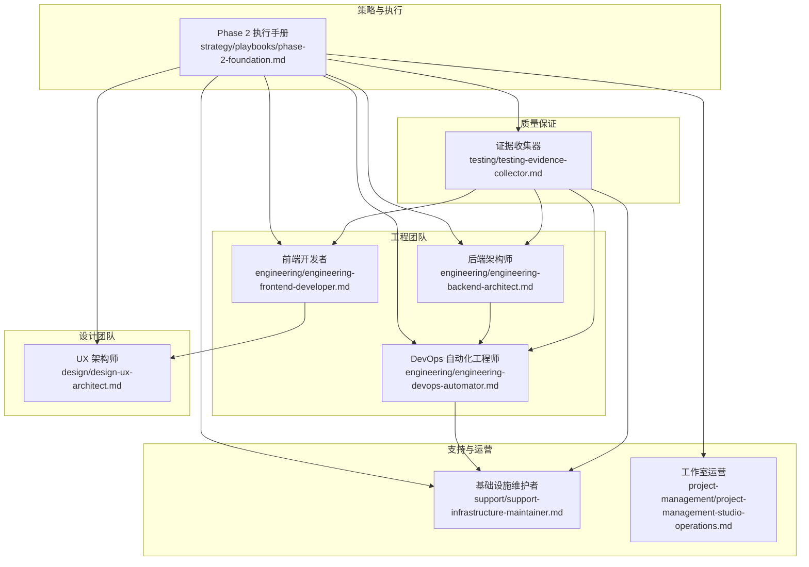
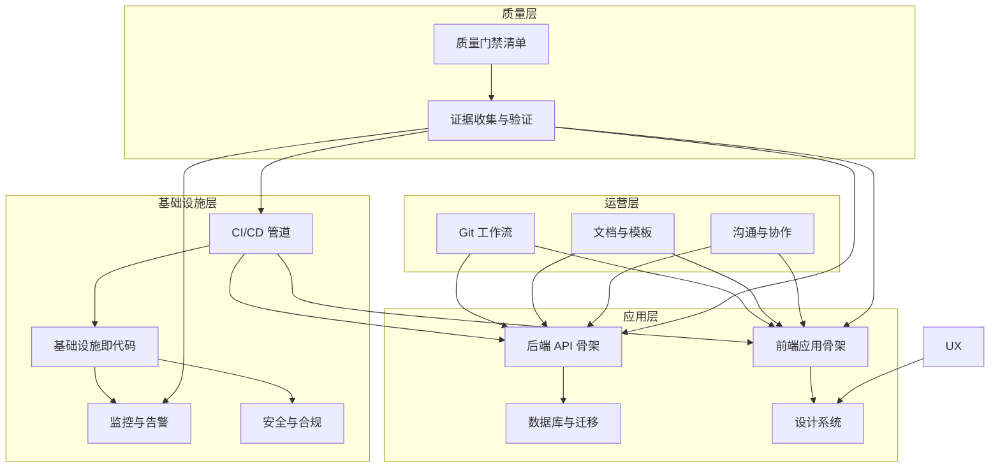
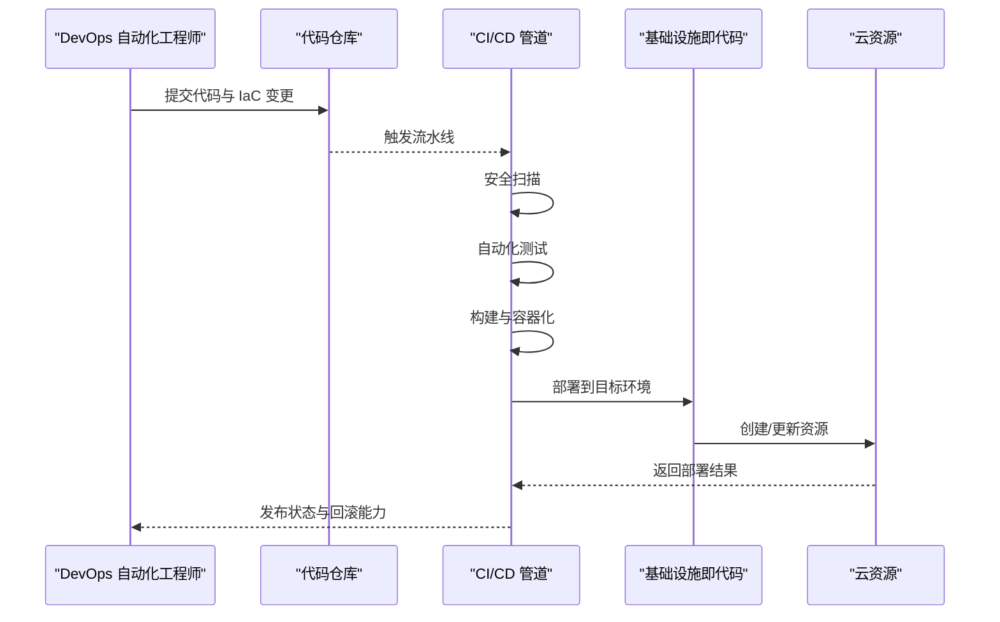
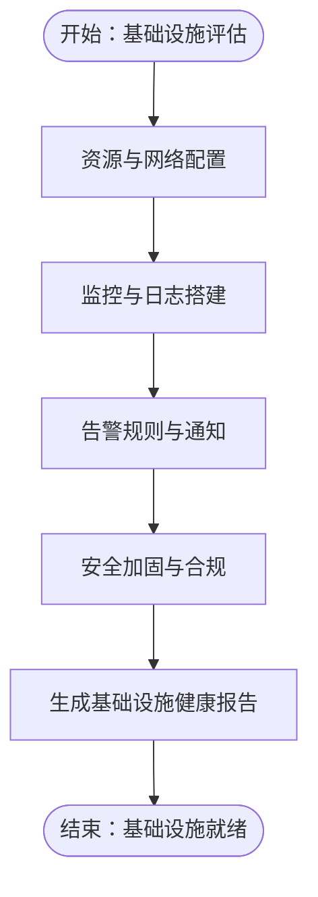
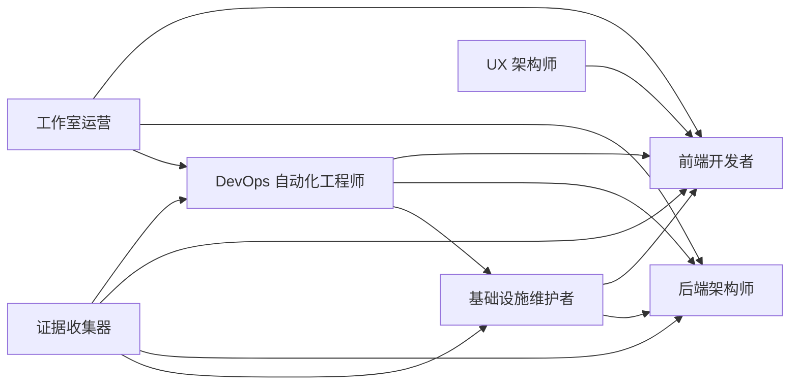

# Phase 2 基础建设阶段

<cite>
**本文档引用的文件**
- [phase-2-foundation.md](file://strategy/playbooks/phase-2-foundation.md)
- [README.md](file://README.md)
- [engineering-devops-automator.md](file://engineering/engineering-devops-automator.md)
- [engineering-frontend-developer.md](file://engineering/engineering-frontend-developer.md)
- [engineering-backend-architect.md](file://engineering/engineering-backend-architect.md)
- [design-ux-architect.md](file://design/design-ux-architect.md)
- [support-infrastructure-maintainer.md](file://support/support-infrastructure-maintainer.md)
- [project-management-studio-operations.md](file://project-management/project-management-studio-operations.md)
- [testing-evidence-collector.md](file://testing/testing-evidence-collector.md)
- [install.sh](file://scripts/install.sh)
- [lint-agents.sh](file://scripts/lint-agents.sh)
</cite>

## 目录
1. [引言](#引言)
2. [项目结构](#项目结构)
3. [核心组件](#核心组件)
4. [架构总览](#架构总览)
5. [详细组件分析](#详细组件分析)
6. [依赖关系分析](#依赖关系分析)
7. [性能考虑](#性能考虑)
8. [故障排除指南](#故障排除指南)
9. [结论](#结论)
10. [附录](#附录)

## 引言
Phase 2 基础建设阶段的目标是为后续所有开发工作打下坚实的技术与运营根基。本阶段要求在 3-5 天内完成以下关键交付：
- CI/CD 流水线与基础设施即代码（IaC）就绪
- 前端应用骨架与设计系统落地
- 后端 API 骨架与数据库初始化
- 监控告警与云资源准备
- Git 工作流与协作流程标准化
- 质量门禁与证据收集机制

通过双负责人（DevOps Automator + Evidence Collector）的质量把关，确保每个环节都有可验证的证据与可重复的流程。

## 项目结构
该仓库采用“按职能划分”的组织方式，将不同领域的专家代理（Agent）分类存放于独立目录中，便于工具集成与版本管理。Phase 2 所涉及的关键目录包括：
- strategy/playbooks：包含 Phase 2 的执行手册与验收清单
- engineering：工程类专家（DevOps、前端、后端、架构等）
- design：设计类专家（UX 架构、UI 设计等）
- support：支持类专家（基础设施维护者）
- project-management：项目管理专家（工作室运营）
- testing：测试类专家（证据收集器）
- scripts：安装与校验脚本

图表来源
- [phase-2-foundation.md:17-279](file://strategy/playbooks/phase-2-foundation.md#L17-L279)
- [engineering-devops-automator.md:1-376](file://engineering/engineering-devops-automator.md#L1-L376)
- [engineering-frontend-developer.md:1-225](file://engineering/engineering-frontend-developer.md#L1-L225)
- [engineering-backend-architect.md:1-235](file://engineering/engineering-backend-architect.md#L1-L235)
- [design-ux-architect.md:1-469](file://design/design-ux-architect.md#L1-L469)
- [support-infrastructure-maintainer.md:1-618](file://support/support-infrastructure-maintainer.md#L1-L618)
- [project-management-studio-operations.md:1-200](file://project-management/project-management-studio-operations.md#L1-L200)
- [testing-evidence-collector.md:1-211](file://testing/testing-evidence-collector.md#L1-L211)

章节来源
- [README.md:68-283](file://README.md#L68-L283)
- [phase-2-foundation.md:17-279](file://strategy/playbooks/phase-2-foundation.md#L17-L279)

## 核心组件
本阶段由六大并行工作流组成，分别由相应专家代理负责：

- 基础设施工作流（Day 1-3）
  - DevOps 自动化工程师：CI/CD 管道、IaC、容器编排、环境配置
  - 基础设施维护者：云资源、监控、日志、安全加固
  - 工作室运营：Git 工作流、沟通渠道、文档模板、协作工具

- 应用基础工作流（Day 1-4）
  - 前端开发者：项目脚手架、设计系统、应用壳层
  - 后端架构师：数据库、API 骨架、认证授权、服务通信
  - UX 架构师：设计令牌、布局系统、主题系统

- 质量门禁（Day 4-5）
  - 证据收集器：流水线执行、应用渲染、主题切换、健康检查、数据库可用性、监控仪表板、组件库演示

章节来源
- [phase-2-foundation.md:19-279](file://strategy/playbooks/phase-2-foundation.md#L19-L279)

## 架构总览
Phase 2 的整体架构围绕“基础设施—应用骨架—质量门禁”三层展开，形成可验证、可扩展、可复用的工程基座。

图表来源
- [phase-2-foundation.md:21-279](file://strategy/playbooks/phase-2-foundation.md#L21-L279)
- [engineering-devops-automator.md:56-321](file://engineering/engineering-devops-automator.md#L56-L321)
- [engineering-frontend-developer.md:64-176](file://engineering/engineering-frontend-developer.md#L64-L176)
- [engineering-backend-architect.md:62-232](file://engineering/engineering-backend-architect.md#L62-L232)
- [design-ux-architect.md:62-414](file://design/design-ux-architect.md#L62-L414)
- [support-infrastructure-maintainer.md:54-563](file://support/support-infrastructure-maintainer.md#L54-L563)
- [project-management-studio-operations.md:56-151](file://project-management/project-management-studio-operations.md#L56-L151)
- [testing-evidence-collector.md:119-174](file://testing/testing-evidence-collector.md#L119-L174)

## 详细组件分析

### DevOps 自动化工程师（CI/CD 管道与基础设施）
职责范围
- CI/CD 管道设计与实现（安全扫描、自动化测试、构建与容器化、部署、自动回滚）
- 基础设施即代码（环境 provision、容器编排、网络与安全配置）
- 环境配置（密钥管理、环境变量、多环境一致性）

关键交付物
- GitHub Actions 或 GitLab CI 配置文件
- Terraform/CDK 模板
- docker-compose 与 Dockerfile
- 运行时 IaC 模板

图表来源
- [phase-2-foundation.md:21-50](file://strategy/playbooks/phase-2-foundation.md#L21-L50)
- [engineering-devops-automator.md:56-321](file://engineering/engineering-devops-automator.md#L56-L321)

章节来源
- [phase-2-foundation.md:21-50](file://strategy/playbooks/phase-2-foundation.md#L21-L50)
- [engineering-devops-automator.md:19-41](file://engineering/engineering-devops-automator.md#L19-L41)

### 基础设施维护者（云基础设施与监控）
职责范围
- 云资源 provision（计算、存储、网络、自动伸缩、负载均衡）
- 监控栈（Prometheus/Grafana、指标与自定义仪表板）
- 日志与告警（集中式日志聚合、阈值告警、值班通知）
- 安全加固（防火墙、SSL/TLS、访问控制）

关键交付物
- 基础设施健康报告与仪表板访问
- 监控规则与告警策略
- 备份与灾难恢复方案

图表来源
- [phase-2-foundation.md:52-77](file://strategy/playbooks/phase-2-foundation.md#L52-L77)
- [support-infrastructure-maintainer.md:54-563](file://support/support-infrastructure-maintainer.md#L54-L563)

章节来源
- [phase-2-foundation.md:52-77](file://strategy/playbooks/phase-2-foundation.md#L52-L77)
- [support-infrastructure-maintainer.md:19-40](file://support/support-infrastructure-maintainer.md#L19-L40)

### 工作室运营（流程与协作）
职责范围
- Git 工作流（分支策略、PR 审查、合并策略）
- 沟通渠道（团队频道、通知路由、状态更新节奏）
- 文档模板（PR、Issue、决策记录）
- 协作工具（项目看板、冲刺跟踪）

关键交付物
- 运营手册与流程规范
- 团队协作工具配置

章节来源
- [phase-2-foundation.md:79-103](file://strategy/playbooks/phase-2-foundation.md#L79-L103)
- [project-management-studio-operations.md:19-55](file://project-management/project-management-studio-operations.md#L19-L55)

### 前端开发者（项目脚手架与组件库）
职责范围
- 框架与工具链（React/Vue/Angular、TypeScript、构建工具、测试框架）
- 设计系统实现（CSS 设计令牌、基础组件库、主题系统、响应式工具）
- 应用壳层（路由、布局组件、错误边界、加载态）

关键交付物
- src/ 目录结构与组件库
- 设计令牌与主题切换

章节来源
- [phase-2-foundation.md:107-137](file://strategy/playbooks/phase-2-foundation.md#L107-L137)
- [engineering-frontend-developer.md:19-49](file://engineering/engineering-frontend-developer.md#L19-L49)

### 后端架构师（数据库与 API 骨架）
职责范围
- 数据库设置（模式部署、索引、种子数据、连接池）
- API 脚手架（框架、路由、中间件、健康检查）
- 认证系统（提供方集成、JWT/会话、RBAC）
- 服务通信（版本控制、序列化、错误响应标准化）

关键交付物
- api/ 或 server/ 目录
- migrations/ 与 OpenAPI 规范

章节来源
- [phase-2-foundation.md:139-171](file://strategy/playbooks/phase-2-foundation.md#L139-L171)
- [engineering-backend-architect.md:19-47](file://engineering/engineering-backend-architect.md#L19-L47)

### UX 架构师（CSS 系统实现）
职责范围
- 设计令牌实现（颜色、字体、间距）
- 布局系统（响应式断点、网格、Flex 工具）
- 主题系统（明暗主题、系统偏好检测、平滑过渡）

关键交付物
- CSS 设计系统与主题切换组件

章节来源
- [phase-2-foundation.md:173-202](file://strategy/playbooks/phase-2-foundation.md#L173-L202)
- [design-ux-architect.md:19-41](file://design/design-ux-architect.md#L19-L41)

### 证据收集器（质量门禁与验证）
职责范围
- 验证清单：流水线执行、应用渲染（桌面/移动）、主题切换、健康检查、数据库可用性、监控仪表板、组件库演示
- 质量门禁：双负责人（DevOps + 证据收集）共同签发

关键交付物
- 截图证据包与质量判定

章节来源
- [phase-2-foundation.md:204-243](file://strategy/playbooks/phase-2-foundation.md#L204-L243)
- [testing-evidence-collector.md:19-69](file://testing/testing-evidence-collector.md#L19-L69)

## 依赖关系分析
Phase 2 各组件之间存在明确的依赖与协作关系：
- DevOps 自动化工程师为前端、后端与基础设施提供统一的 CI/CD 与 IaC 支撑
- 基础设施维护者为所有运行时组件提供监控、日志与安全保障
- 前端与 UX 架构师紧密协作，确保设计系统与实现一致
- 后端架构师为前端提供稳定的 API 骨架与认证授权
- 工作室运营为团队提供 Git 工作流与协作工具
- 证据收集器贯穿全流程，作为最终质量门禁

图表来源
- [phase-2-foundation.md:19-279](file://strategy/playbooks/phase-2-foundation.md#L19-L279)

章节来源
- [phase-2-foundation.md:19-279](file://strategy/playbooks/phase-2-foundation.md#L19-L279)

## 性能考虑
- CI/CD 性能：分阶段并行执行（安全扫描、测试、构建、部署），引入缓存与镜像优化
- 前端性能：Core Web Vitals 优化、代码分割、懒加载、图片格式与响应式尺寸
- 后端性能：数据库索引与查询优化、缓存策略、水平扩展与自动伸缩
- 监控性能：Prometheus 抓取间隔与告警阈值调优，避免噪声与漏报

## 故障排除指南
常见问题与处理建议
- CI/CD 流水线失败
  - 检查安全扫描与测试阶段输出，定位具体失败步骤
  - 确认容器镜像与依赖版本
- 前端应用无法渲染或主题切换异常
  - 核对设计令牌与主题切换组件实现
  - 在桌面与移动端进行截图验证
- API 健康检查失败或数据库不可访问
  - 检查中间件链与数据库连接配置
  - 确认迁移状态与索引创建
- 监控仪表板无数据
  - 核对抓取目标与告警规则
  - 检查网络连通与权限配置

章节来源
- [testing-evidence-collector.md:100-118](file://testing/testing-evidence-collector.md#L100-L118)
- [phase-2-foundation.md:204-243](file://strategy/playbooks/phase-2-foundation.md#L204-L243)

## 结论
Phase 2 基础建设阶段通过六大专家团队的协同工作，建立了可验证、可扩展、可复用的技术与运营基座。DevOps 自动化工程师与基础设施维护者确保了基础设施的可靠性与可观测性；前端与后端团队完成了应用骨架与 API 骨架；UX 架构师提供了设计系统与主题体系；工作室运营建立了 Git 工作流与协作流程；证据收集器以可视化证据为质量门禁提供了客观依据。这一阶段的成果将直接支撑后续 Phase 3 的功能开发与质量提升。

## 附录

### 开发环境配置与工具集成
- 多工具集成脚本：提供一键安装与转换脚本，适配 Claude Code、GitHub Copilot、Cursor、Aider、Windsurf、Gemini CLI、OpenCode、Kimi Code 等工具
- 代理校验脚本：对代理文件进行 YAML frontmatter 与推荐章节检查，确保质量与一致性

章节来源
- [README.md:508-797](file://README.md#L508-L797)
- [install.sh:1-640](file://scripts/install.sh#L1-L640)
- [lint-agents.sh:1-117](file://scripts/lint-agents.sh#L1-L117)