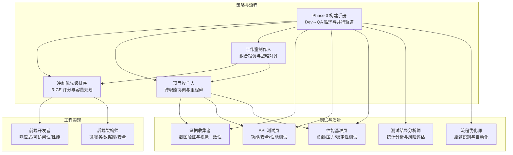
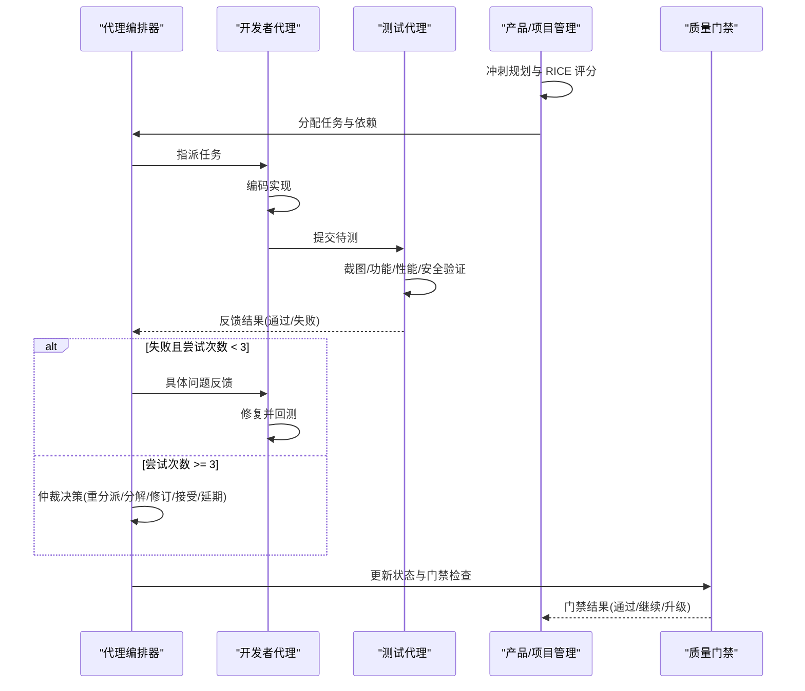
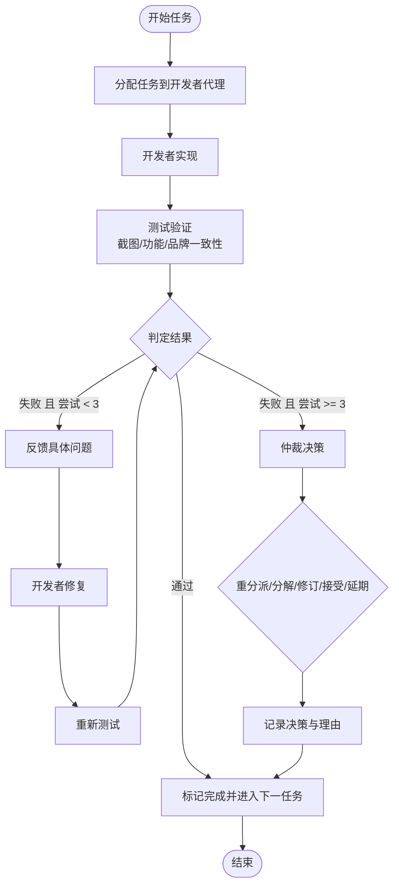
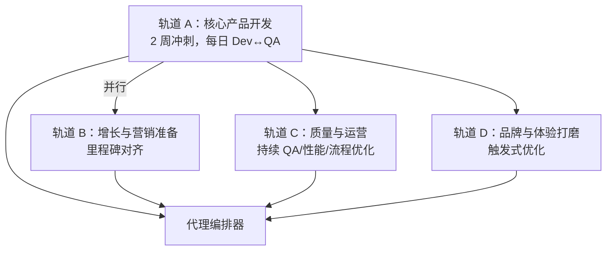
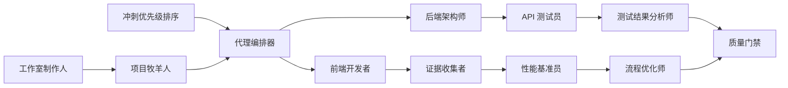

# Phase 3 构建阶段

<cite>
**本文档引用的文件**
- [phase-3-build.md](file://strategy/playbooks/phase-3-build.md)
- [README.md](file://README.md)
- [CONTRIBUTING.md](file://CONTRIBUTING.md)
- [install.sh](file://scripts/install.sh)
- [lint-agents.sh](file://scripts/lint-agents.sh)
- [testing-evidence-collector.md](file://testing/testing-evidence-collector.md)
- [testing-api-tester.md](file://testing/testing-api-tester.md)
- [testing-performance-benchmarker.md](file://testing/testing-performance-benchmarker.md)
- [testing-test-results-analyzer.md](file://testing/testing-test-results-analyzer.md)
- [testing-workflow-optimizer.md](file://testing/testing-workflow-optimizer.md)
- [product-sprint-prioritizer.md](file://product/product-sprint-prioritizer.md)
- [project-management-project-shepherd.md](file://project-management/project-management-project-shepherd.md)
- [project-management-studio-producer.md](file://project-management/project-management-studio-producer.md)
- [engineering-frontend-developer.md](file://engineering/engineering-frontend-developer.md)
- [engineering-backend-architect.md](file://engineering/engineering-backend-architect.md)
</cite>

## 目录
1. [引言](#引言)
2. [项目结构](#项目结构)
3. [核心组件](#核心组件)
4. [架构总览](#架构总览)
5. [详细组件分析](#详细组件分析)
6. [依赖关系分析](#依赖关系分析)
7. [性能考虑](#性能考虑)
8. [故障排除指南](#故障排除指南)
9. [结论](#结论)
10. [附录](#附录)

## 引言
本文件面向 Phase 3 构建阶段，系统化阐述“实现核心功能开发”的目标与工作流，围绕“开发-测试循环”（Dev↔QA）展开，明确各代理团队的协作模式、代码审查流程、版本控制策略与质量保证措施，并给出迭代周期管理、功能交付标准与风险控制机制。该阶段是 NEXUS 协调价值体现最集中的时期，通过持续的 Dev↔QA 循环推进所有特性落地。

## 项目结构
仓库采用按职能划分的模块化组织方式，包含工程、设计、营销、测试、支持、空间计算、专业等多领域代理，以及策略手册与脚本工具。构建阶段的关键入口与支撑包括：
- 策略手册：Phase 3 构建与迭代执行蓝图
- 测试代理：证据收集、API 测试、性能基准、测试结果分析、流程优化
- 产品与项目管理：冲刺优先级排序、项目牧羊人、工作室制作人
- 工程代理：前端开发者、后端架构师等
- 质量与工具：安装器、静态检查脚本、贡献指南

图表来源
- [phase-3-build.md:19-43](file://strategy/playbooks/phase-3-build.md#L19-L43)
- [product-sprint-prioritizer.md:56-63](file://product/product-sprint-prioritizer.md#L56-L63)
- [project-management-project-shepherd.md:19-41](file://project-management/project-management-project-shepherd.md#L19-L41)
- [project-management-studio-producer.md:19-41](file://project-management/project-management-studio-producer.md#L19-L41)
- [testing-evidence-collector.md:39-69](file://testing/testing-evidence-collector.md#L39-L69)
- [testing-api-tester.md:19-41](file://testing/testing-api-tester.md#L19-L41)
- [testing-performance-benchmarker.md:19-41](file://testing/testing-performance-benchmarker.md#L19-L41)
- [testing-test-results-analyzer.md:19-41](file://testing/testing-test-results-analyzer.md#L19-L41)
- [testing-workflow-optimizer.md:19-41](file://testing/testing-workflow-optimizer.md#L19-L41)
- [engineering-frontend-developer.md:19-49](file://engineering/engineering-frontend-developer.md#L19-L49)
- [engineering-backend-architect.md:19-47](file://engineering/engineering-backend-architect.md#L19-L47)

章节来源
- [README.md:68-283](file://README.md#L68-L283)
- [phase-3-build.md:1-287](file://strategy/playbooks/phase-3-build.md#L1-L287)

## 核心组件
- Dev↔QA 循环：每个任务在“分配→实现→测试→判定→状态更新”之间反复，失败不超过三次，超过则进入仲裁与决策。
- 并行构建轨道：核心产品开发、增长与营销准备、质量与运营、品牌与体验打磨四条轨道同时运行，确保多维度协同。
- 决策逻辑：针对失败任务的反馈与再试策略，以及多任务无依赖时的并发执行与依赖等待策略。
- 质量门禁清单：覆盖任务完成度、API 验证、性能基线、品牌一致性、缺陷等级、验收标准、代码评审等七项标准。
- 手交接到 Phase 4：提供给现实校验者、法律合规者、性能基准员、基础设施维护者的交付包。

章节来源
- [phase-3-build.md:19-43](file://strategy/playbooks/phase-3-build.md#L19-L43)
- [phase-3-build.md:77-133](file://strategy/playbooks/phase-3-build.md#L77-L133)
- [phase-3-build.md:191-232](file://strategy/playbooks/phase-3-build.md#L191-L232)
- [phase-3-build.md:234-253](file://strategy/playbooks/phase-3-build.md#L234-L253)
- [phase-3-build.md:254-287](file://strategy/playbooks/phase-3-build.md#L254-L287)

## 架构总览
下图展示 Phase 3 的核心交互：由“代理编排器”驱动的 Dev↔QA 循环贯穿工程与测试团队；产品与项目管理负责规划与协调；质量门禁与决策逻辑保障交付质量；并行轨道提升整体吞吐。

图表来源
- [phase-3-build.md:24-43](file://strategy/playbooks/phase-3-build.md#L24-L43)
- [phase-3-build.md:191-217](file://strategy/playbooks/phase-3-build.md#L191-L217)
- [phase-3-build.md:234-253](file://strategy/playbooks/phase-3-build.md#L234-L253)

## 详细组件分析

### 开发-测试循环（Dev↔QA）
- 任务来源：基于冲刺待办列表，按 RICE 评分排序，结合团队容量与依赖进行选择。
- 执行步骤：分配→开发者实现→测试验证（视觉截图、功能验证、品牌一致性）→判定→状态更新。
- 失败处理：单次失败→具体反馈→修复→复测；二次失败→汇总反馈→评估开发者适配性→修复→复测；三次失败→仲裁→重分派/分解/修订/接受/延期。
- 并行策略：无依赖多任务并发执行，有依赖任务等待前置通过后再分配。

图表来源
- [phase-3-build.md:24-43](file://strategy/playbooks/phase-3-build.md#L24-L43)
- [phase-3-build.md:196-217](file://strategy/playbooks/phase-3-build.md#L196-L217)

章节来源
- [phase-3-build.md:19-43](file://strategy/playbooks/phase-3-build.md#L19-L43)
- [phase-3-build.md:191-232](file://strategy/playbooks/phase-3-build.md#L191-L232)

### 并行构建轨道
- 轨道 A（核心产品开发）：由代理编排器管理，每日执行 Dev↔QA，每两周冲刺一次，包含 UI/后端/移动端/ML/CI/性能等多类任务。
- 轨道 B（增长与营销准备）：与轨道 A 节奏对齐，围绕病毒式循环、内容管线、跨平台活动与商店准备开展。
- 轨道 C（质量与运营）：持续进行截图 QA、API 验证、性能基准、流程优化与实验跟踪。
- 轨道 D（品牌与体验打磨）：根据 QA 触发 UI 组件优化、品牌一致性审计、视觉叙事资产与微交互注入。

图表来源
- [phase-3-build.md:77-133](file://strategy/playbooks/phase-3-build.md#L77-L133)

章节来源
- [phase-3-build.md:77-133](file://strategy/playbooks/phase-3-build.md#L77-L133)

### 冲刺执行模板
- 冲刺计划（第 1 天）：回顾带办与 RICE 评分，选择任务、分配、识别依赖与顺序、设定目标与成功标准。
- 日常执行（第 2 至 N-1 天）：检查当前任务状态、执行 Dev↔QA 循环、识别与解决阻塞、进度跟踪与报告。
- 冲刺评审（第 N 天）：演示已完成功能、审查 QA 证据、收集干系人反馈、更新待办。
- 冲刺回顾：识别做得好的、可改进的、下一步变更、过程效率指标。

章节来源
- [phase-3-build.md:134-189](file://strategy/playbooks/phase-3-build.md#L134-L189)

### 质量门禁与交付标准
- 门禁清单：涵盖任务完成度、API 验证、性能基线、品牌一致性、缺陷等级、验收标准、代码评审等七项。
- 门禁决策：代理编排器作为门卫，决定是否进入 Phase 4、继续 Phase 3 或升级至工作室制作人干预。

章节来源
- [phase-3-build.md:234-253](file://strategy/playbooks/phase-3-build.md#L234-L253)

### 手交接到 Phase 4
- 提供给现实校验者：完整应用、Dev↔QA 证据、API 回归报告、性能基准数据、品牌一致性审计、已知问题清单。
- 提供给法律合规者：数据处理实现、隐私政策实现、同意管理实现、安全措施实现。
- 提供给性能基准员：应用 URL、预期流量模式、架构性能预算。
- 提供给基础设施维护者：生产环境要求、扩展配置需求、监控告警阈值。

章节来源
- [phase-3-build.md:254-282](file://strategy/playbooks/phase-3-build.md#L254-L282)

### 测试代理能力矩阵
- 证据收集者：截图驱动的 QA，强调视觉证据与规范对比，自动捕获与人工审阅结合。
- API 测试员：功能、性能、安全全栈测试，SLA 与回归报告。
- 性能基准员：负载/压力/持久性测试，Core Web Vitals 与用户感知性能。
- 测试结果分析师：覆盖率、缺陷密度、趋势与预测模型，发布就绪评估。
- 流程优化师：瓶颈识别、自动化机会、跨职能集成与变更管理。

章节来源
- [testing-evidence-collector.md:39-69](file://testing/testing-evidence-collector.md#L39-L69)
- [testing-api-tester.md:19-41](file://testing/testing-api-tester.md#L19-L41)
- [testing-performance-benchmarker.md:19-41](file://testing/testing-performance-benchmarker.md#L19-L41)
- [testing-test-results-analyzer.md:19-41](file://testing/testing-test-results-analyzer.md#L19-L41)
- [testing-workflow-optimizer.md:19-41](file://testing/testing-workflow-optimizer.md#L19-L41)

### 工程实现要点
- 前端开发者：现代框架、响应式/可访问性/性能优化、组件库与设计系统、自动化测试与 CI/CD。
- 后端架构师：可扩展系统设计、数据库架构、API 设计、事件驱动、安全与监控、缓存与自动伸缩。

章节来源
- [engineering-frontend-developer.md:19-49](file://engineering/engineering-frontend-developer.md#L19-L49)
- [engineering-backend-architect.md:19-47](file://engineering/engineering-backend-architect.md#L19-L47)

### 产品与项目管理
- 冲刺优先级排序：RICE 评分、价值与努力矩阵、Kano 模型分类、容量规划与资源分配。
- 项目牧羊人：跨职能协调、沟通策略、风险管理、质量门与交付。
- 工作室制作人：组合投资与战略对齐、资源分配、财务与风险管控、创新与组织变革。

章节来源
- [product-sprint-prioritizer.md:56-63](file://product/product-sprint-prioritizer.md#L56-L63)
- [project-management-project-shepherd.md:19-41](file://project-management/project-management-project-shepherd.md#L19-L41)
- [project-management-studio-producer.md:19-41](file://project-management/project-management-studio-producer.md#L19-L41)

## 依赖关系分析
- 任务依赖：无依赖多任务并发，有依赖任务等待前置 QA 通过后再分配。
- 团队耦合：工程团队（前端/后端）与测试团队（证据收集/API/性能/分析/流程优化）紧密耦合，形成闭环。
- 管理层依赖：产品/项目管理对冲刺规划与门禁决策提供输入，工作室制作人对组合层面的战略与资源进行把关。

图表来源
- [phase-3-build.md:222-232](file://strategy/playbooks/phase-3-build.md#L222-L232)
- [product-sprint-prioritizer.md:78-99](file://product/product-sprint-prioritizer.md#L78-L99)
- [project-management-project-shepherd.md:86-111](file://project-management/project-management-project-shepherd.md#L86-L111)
- [project-management-studio-producer.md:94-119](file://project-management/project-management-studio-producer.md#L94-L119)

章节来源
- [phase-3-build.md:219-232](file://strategy/playbooks/phase-3-build.md#L219-L232)

## 性能考虑
- 性能基线：API 响应时间（95 分位 < 200ms）、页面加载（Core Web Vitals）、数据库查询与缓存策略。
- 负载测试：压力/峰值/持久性测试，验证 10 倍正常负载下的稳定性与恢复能力。
- 用户感知：关注首屏、首触、布局偏移等真实用户体验指标。
- 成本与收益：性能优化 ROI 分析，基础设施与 CDN 优化，自动伸缩与容量规划。

章节来源
- [testing-performance-benchmarker.md:21-41](file://testing/testing-performance-benchmarker.md#L21-L41)
- [testing-api-tester.md:51-57](file://testing/testing-api-tester.md#L51-L57)
- [engineering-frontend-developer.md:36-42](file://engineering/engineering-frontend-developer.md#L36-L42)
- [engineering-backend-architect.md:42-47](file://engineering/engineering-backend-architect.md#L42-L47)

## 故障排除指南
- 证据收集者常见问题：无法提供截图、截图与声明不符、功能可见性不足、基础样式被标为“高级”。
- API 测试员常见问题：认证/授权缺失、输入验证不充分、SQL 注入/跨站攻击、速率限制失效。
- 性能基准员常见问题：响应时间超 SLA、并发请求失败率高、数据库瓶颈、缓存未命中。
- 测试结果分析师常见问题：覆盖率不足、缺陷密度异常、趋势恶化、发布风险高。
- 流程优化师常见问题：瓶颈定位困难、自动化机会识别不足、跨职能协作不畅、变更阻力大。

章节来源
- [testing-evidence-collector.md:100-118](file://testing/testing-evidence-collector.md#L100-L118)
- [testing-api-tester.md:42-57](file://testing/testing-api-tester.md#L42-L57)
- [testing-performance-benchmarker.md:42-56](file://testing/testing-performance-benchmarker.md#L42-L56)
- [testing-test-results-analyzer.md:42-56](file://testing/testing-test-results-analyzer.md#L42-L56)
- [testing-workflow-optimizer.md:42-56](file://testing/testing-workflow-optimizer.md#L42-L56)

## 结论
Phase 3 构建阶段以“开发-测试循环”为核心，通过并行轨道与质量门禁确保高质量交付。工程团队聚焦实现，测试团队提供多维验证，产品与项目管理负责规划与协调，工作室制作人把控组合层面的战略与资源。该体系在可重复、可扩展、可度量的基础上，为 Phase 4 的硬化与启动奠定坚实基础。

## 附录

### 版本控制与工具链
- 安装器：一键将代理安装到多平台工具（Claude Code、GitHub Copilot、Cursor、Windsurf、Aider、OpenCode、Qwen、Kimi 等），支持交互与并行安装。
- 静态检查：对代理 Markdown 文件进行前端信息完整性与推荐内容检查，确保质量门槛。
- 贡献指南：定义代理模板结构、设计原则、提交流程与评审标准，规范社区协作。

章节来源
- [install.sh:1-640](file://scripts/install.sh#L1-L640)
- [lint-agents.sh:1-117](file://scripts/lint-agents.sh#L1-L117)
- [CONTRIBUTING.md:81-240](file://CONTRIBUTING.md#L81-L240)