# Phase 4 加固阶段

<cite>
**本文引用的文件**
- [phase-4-hardening.md](file://strategy/playbooks/phase-4-hardening.md)
- [testing-reality-checker.md](file://testing/testing-reality-checker.md)
- [testing-evidence-collector.md](file://testing/testing-evidence-collector.md)
- [testing-api-tester.md](file://testing/testing-api-tester.md)
- [testing-performance-benchmarker.md](file://testing/testing-performance-benchmarker.md)
- [testing-test-results-analyzer.md](file://testing/testing-test-results-analyzer.md)
- [testing-workflow-optimizer.md](file://testing/testing-workflow-optimizer.md)
- [support-legal-compliance-checker.md](file://support/support-legal-compliance-checker.md)
- [support-infrastructure-maintainer.md](file://support/support-infrastructure-maintainer.md)
- [lint-agents.sh](file://scripts/lint-agents.sh)
- [convert.sh](file://scripts/convert.sh)
- [install.sh](file://scripts/install.sh)
</cite>

## 目录
1. [引言](#引言)
2. [项目结构](#项目结构)
3. [核心组件](#核心组件)
4. [架构总览](#架构总览)
5. [详细组件分析](#详细组件分析)
6. [依赖关系分析](#依赖关系分析)
7. [性能考量](#性能考量)
8. [故障排查指南](#故障排查指南)
9. [结论](#结论)
10. [附录](#附录)

## 引言
Phase 4 加固阶段是产品从“可运行”走向“可生产”的关键转折点。其目标是通过系统化的质量保证与风险控制，确保系统在真实用户场景下具备稳定性、一致性与可维护性。本阶段以“现实检查员”为核心裁决者，要求所有主张必须有证据支持，并对功能、性能、安全与合规进行全方位验证。通过证据收集、交叉验证、端到端集成测试与基础设施验收，最终形成“现实主义”的质量认证报告，决定是否进入下一阶段。

## 项目结构
本仓库采用“职能域 + 代理类型”的组织方式：
- 战略与流程：strategy/playbooks 下定义了各阶段的执行手册与质量门禁
- 质量保证代理：testing 目录包含证据收集、API 测试、性能基准、结果分析、流程优化等代理
- 支持与保障代理：support 目录包含法律合规与基础设施维护代理
- 工具链脚本：scripts 提供代理文件转换、安装与校验工具

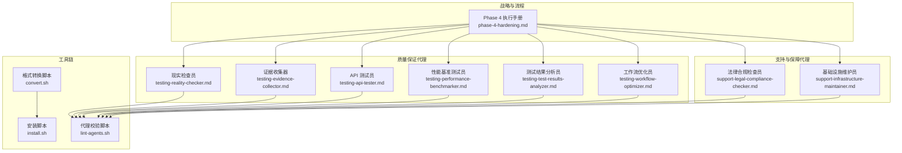

图表来源
- [phase-4-hardening.md:1-333](file://strategy/playbooks/phase-4-hardening.md#L1-L333)
- [testing-reality-checker.md:1-237](file://testing/testing-reality-checker.md#L1-L237)
- [testing-evidence-collector.md:1-211](file://testing/testing-evidence-collector.md#L1-L211)
- [testing-api-tester.md:1-306](file://testing/testing-api-tester.md#L1-L306)
- [testing-performance-benchmarker.md:1-268](file://testing/testing-performance-benchmarker.md#L1-L268)
- [testing-test-results-analyzer.md:1-305](file://testing/testing-test-results-analyzer.md#L1-L305)
- [testing-workflow-optimizer.md:1-450](file://testing/testing-workflow-optimizer.md#L1-L450)
- [support-legal-compliance-checker.md:1-588](file://support/support-legal-compliance-checker.md#L1-L588)
- [support-infrastructure-maintainer.md:1-618](file://support/support-infrastructure-maintainer.md#L1-L618)
- [lint-agents.sh:1-117](file://scripts/lint-agents.sh#L1-L117)
- [convert.sh:1-639](file://scripts/convert.sh#L1-L639)
- [install.sh:1-640](file://scripts/install.sh#L1-L640)

章节来源
- [phase-4-hardening.md:1-333](file://strategy/playbooks/phase-4-hardening.md#L1-L333)

## 核心组件
- 现实检查员（现实检查）：最终裁决者，负责证据收集、交叉验证与端到端集成测试，要求“无证据不批准”，默认“需要改进”
- 证据收集器（视觉证据）：生成跨设备、跨主题、跨交互的截图证据包，提供规范化的视觉验证
- API 测试员（接口测试）：全量回归测试、性能与安全验证，覆盖认证授权、输入校验、错误处理与并发场景
- 性能基准测试员（性能评估）：负载测试、压力测试、核心 Web 指标测量、数据库性能与弹性恢复评估
- 法律合规检查员（合规验证）：隐私政策、数据保护、安全合规、监管遵循与可访问性验证
- 基础设施维护员（基础设施验收）：服务健康度、监控告警、灾难恢复、安全加固与容量规划
- 测试结果分析员（质量度量聚合）：多源测试数据整合、趋势分析、风险评估与发布建议
- 工作流优化员（流程效率评审）：Dev↔QA 循环效率、瓶颈识别与自动化改进建议

章节来源
- [phase-4-hardening.md:30-333](file://strategy/playbooks/phase-4-hardening.md#L30-L333)
- [testing-reality-checker.md:1-237](file://testing/testing-reality-checker.md#L1-L237)
- [testing-evidence-collector.md:1-211](file://testing/testing-evidence-collector.md#L1-L211)
- [testing-api-tester.md:1-306](file://testing/testing-api-tester.md#L1-L306)
- [testing-performance-benchmarker.md:1-268](file://testing/testing-performance-benchmarker.md#L1-L268)
- [testing-test-results-analyzer.md:1-305](file://testing/testing-test-results-analyzer.md#L1-L305)
- [testing-workflow-optimizer.md:1-450](file://testing/testing-workflow-optimizer.md#L1-L450)
- [support-legal-compliance-checker.md:1-588](file://support/support-legal-compliance-checker.md#L1-L588)
- [support-infrastructure-maintainer.md:1-618](file://support/support-infrastructure-maintainer.md#L1-L618)

## 架构总览
Phase 4 的执行采用“并行证据采集 + 并行分析 + 顺序最终裁决”的流水线式架构。证据采集阶段由多个代理并行产出报告；分析阶段对多源数据进行聚合与风险评估；基础设施与合规代理独立验证运行环境与合规状态；最终由现实检查员进行端到端集成验证与质量裁决。

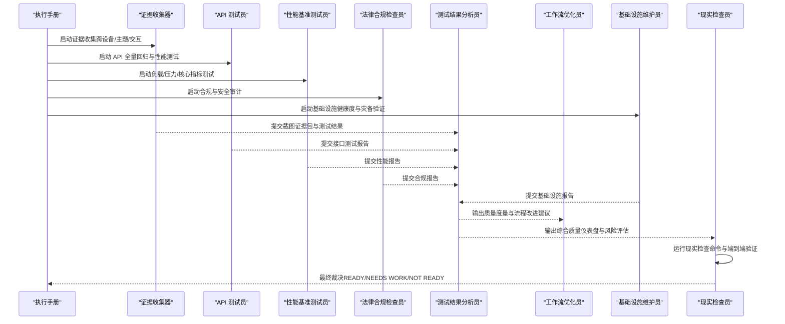

图表来源
- [phase-4-hardening.md:30-333](file://strategy/playbooks/phase-4-hardening.md#L30-L333)
- [testing-evidence-collector.md:41-79](file://testing/testing-evidence-collector.md#L41-L79)
- [testing-api-tester.md:197-222](file://testing/testing-api-tester.md#L197-L222)
- [testing-performance-benchmarker.md:153-178](file://testing/testing-performance-benchmarker.md#L153-L178)
- [support-legal-compliance-checker.md:404-430](file://support/support-legal-compliance-checker.md#L404-L430)
- [support-infrastructure-maintainer.md:449-475](file://support/support-infrastructure-maintainer.md#L449-L475)
- [testing-test-results-analyzer.md:190-215](file://testing/testing-test-results-analyzer.md#L190-L215)
- [testing-workflow-optimizer.md:335-360](file://testing/testing-workflow-optimizer.md#L335-L360)
- [testing-reality-checker.md:39-120](file://testing/testing-reality-checker.md#L39-L120)

## 详细组件分析

### 现实检查员（现实检查）
- 角色定位：最终裁决者，负责证据收集、交叉验证与端到端集成测试，要求“无证据不批准”，默认“需要改进”
- 关键流程：
  - 步骤 1：现实检查命令（验证构建产物、核对宣称功能、生成专业截图、审查测试结果）
  - 步骤 2：QA 交叉验证（对比自动化截图与测试报告、确认问题重现与修复证据）
  - 步骤 3：端到端系统验证（完整用户旅程、响应式行为、交互流程、性能数据）
  - 步骤 4：规范现实检查（逐条比对规格与实现，记录差距）
- 裁决标准：用户旅程完整、跨设备一致、性能达标、安全与合规通过、规格符合、基础设施就绪

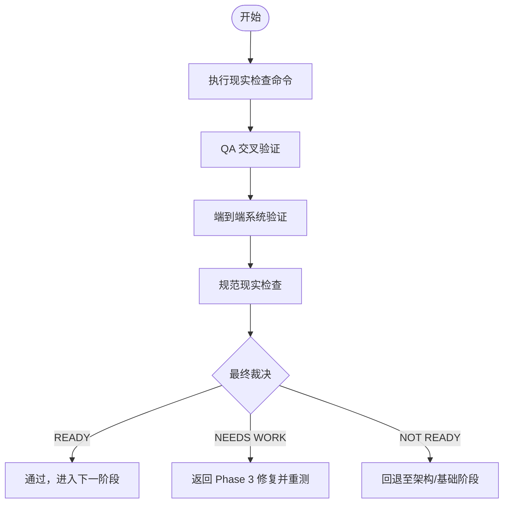

图表来源
- [testing-reality-checker.md:39-120](file://testing/testing-reality-checker.md#L39-L120)
- [phase-4-hardening.md:216-256](file://strategy/playbooks/phase-4-hardening.md#L216-L256)

章节来源
- [testing-reality-checker.md:1-237](file://testing/testing-reality-checker.md#L1-L237)
- [phase-4-hardening.md:216-256](file://strategy/playbooks/phase-4-hardening.md#L216-L256)

### 证据收集器（视觉证据）
- 任务：生成跨设备（桌面/平板/手机）、跨主题（亮/暗/系统偏好）、跨交互（导航/表单/模态/手风琴）的截图证据包
- 方法论：基于 Playwright 自动化截图，输出 test-results.json，用于性能与交互状态验证
- 输出：完整的截图证据包与可视化分析，支撑现实检查员的裁决

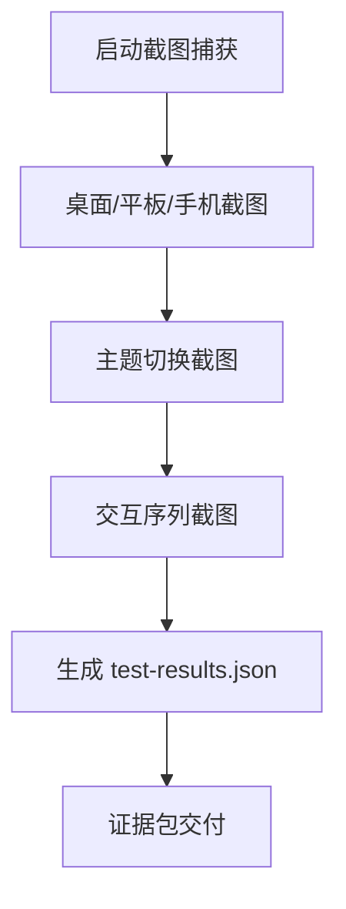

图表来源
- [testing-evidence-collector.md:41-79](file://testing/testing-evidence-collector.md#L41-L79)

章节来源
- [testing-evidence-collector.md:1-211](file://testing/testing-evidence-collector.md#L1-L211)

### API 测试员（接口测试）
- 任务：全量回归测试、性能与安全验证，覆盖认证授权、输入校验、错误处理、并发与边缘场景
- 方法论：功能、性能、安全三线并行，使用现代框架自动化执行，输出覆盖率、响应时间、吞吐量与资源利用率
- 输出：接口测试报告，包含性能 SLA 符合度、安全漏洞与优化建议

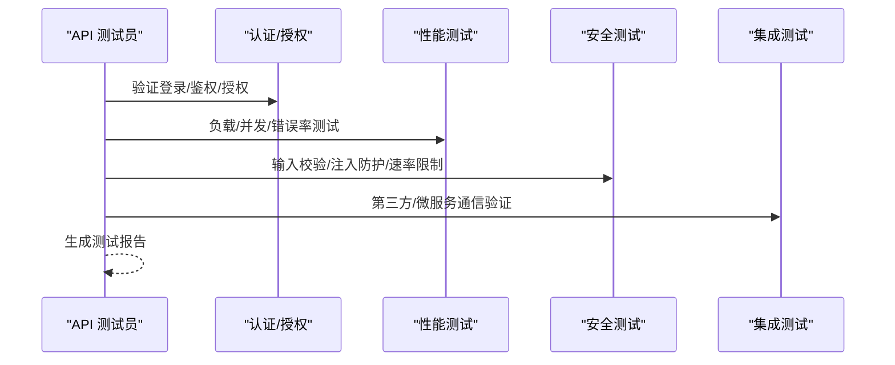

图表来源
- [testing-api-tester.md:197-222](file://testing/testing-api-tester.md#L197-L222)

章节来源
- [testing-api-tester.md:1-306](file://testing/testing-api-tester.md#L1-L306)

### 性能基准测试员（性能评估）
- 任务：负载测试、压力测试、核心 Web 指标测量（LCP/FID/CLS）、数据库性能与弹性恢复
- 方法论：k6 等工具进行分阶段负载，统计分析与阈值控制，输出性能报告与优化建议
- 输出：性能分析报告，包含 SLA 达成度、瓶颈分析与成本效益优化建议

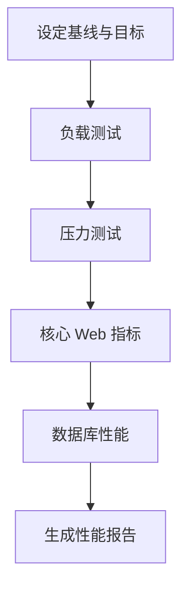

图表来源
- [testing-performance-benchmarker.md:153-178](file://testing/testing-performance-benchmarker.md#L153-L178)

章节来源
- [testing-performance-benchmarker.md:1-268](file://testing/testing-performance-benchmarker.md#L1-L268)

### 法律合规检查员（合规验证）
- 任务：隐私合规（政策准确性、同意管理、数据权利、Cookie 同意）、安全合规（加密、认证、输入净化、OWASP Top 10）、监管合规（GDPR/CCPA/行业特定要求）、可访问性（WCAG 2.1 AA、屏幕阅读器、键盘导航）
- 方法论：多司法管辖区合规框架、合同审查自动化、风险评估与整改建议
- 输出：合规认证报告，包含风险等级、整改清单与持续监控建议

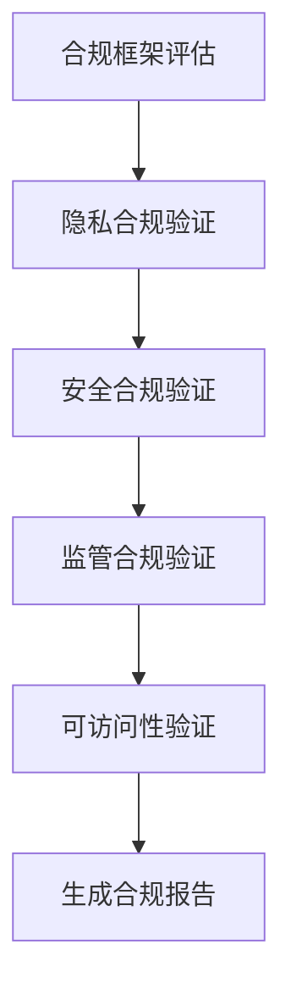

图表来源
- [support-legal-compliance-checker.md:404-430](file://support/support-legal-compliance-checker.md#L404-L430)

章节来源
- [support-legal-compliance-checker.md:1-588](file://support/support-legal-compliance-checker.md#L1-L588)

### 基础设施维护员（基础设施验收）
- 任务：服务健康度、自动伸缩、负载均衡、SSL/TLS、监控告警、日志聚合、灾备程序、防火墙与访问控制、漏洞扫描
- 方法论：监控配置、备份与恢复脚本、安全加固与合规验证
- 输出：基础设施就绪报告，包含可用性、成本优化与安全状态

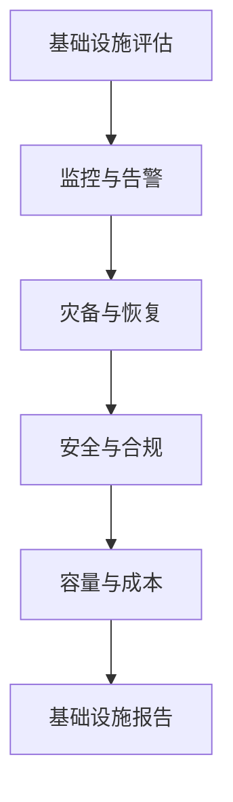

图表来源
- [support-infrastructure-maintainer.md:449-475](file://support/support-infrastructure-maintainer.md#L449-L475)

章节来源
- [support-infrastructure-maintainer.md:1-618](file://support/support-infrastructure-maintainer.md#L1-L618)

### 测试结果分析员（质量度量聚合）
- 任务：聚合多源测试数据、统计分析与模式识别、风险评估与发布建议、质量趋势预测
- 方法论：统计学方法、机器学习预测、ROI 分析与自动化洞察生成
- 输出：质量仪表盘、风险评估与改进建议

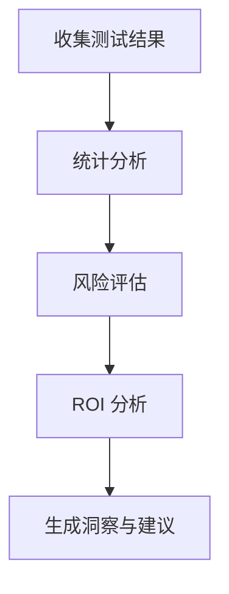

图表来源
- [testing-test-results-analyzer.md:190-215](file://testing/testing-test-results-analyzer.md#L190-L215)

章节来源
- [testing-test-results-analyzer.md:1-305](file://testing/testing-test-results-analyzer.md#L1-L305)

### 工作流优化员（流程效率评审）
- 任务：Dev↔QA 循环效率、瓶颈识别、时间到解决（TTR）分析、自动化机会与质量改进建议
- 方法论：流程映射、瓶颈量化、自动化潜力评估、实施路线图
- 输出：优化建议报告与分阶段实施计划

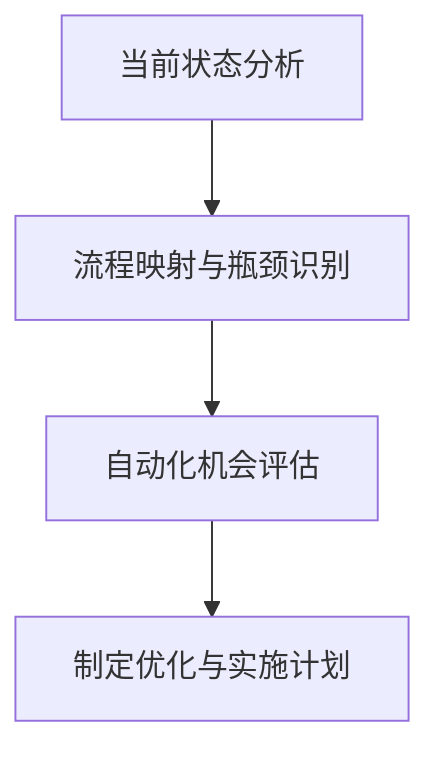

图表来源
- [testing-workflow-optimizer.md:335-360](file://testing/testing-workflow-optimizer.md#L335-L360)

章节来源
- [testing-workflow-optimizer.md:1-450](file://testing/testing-workflow-optimizer.md#L1-L450)

## 依赖关系分析
- 证据与裁决：证据收集器为现实检查员提供可视化证据，现实检查员据此进行端到端验证
- 测试与分析：API 测试员、性能基准测试员与合规检查员的报告汇聚到测试结果分析员，形成统一的质量视图
- 流程与工具：工作流优化员基于历史数据与分析结果提出流程改进建议；工具链脚本（lint/convert/install）保障代理质量与部署一致性

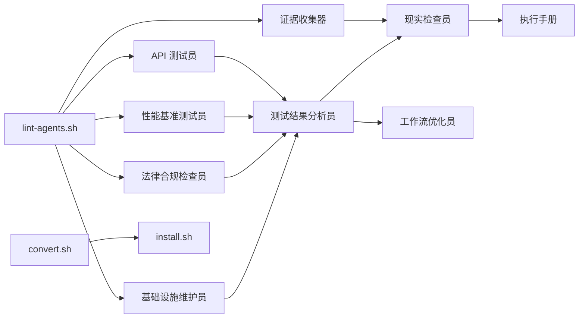

图表来源
- [phase-4-hardening.md:30-333](file://strategy/playbooks/phase-4-hardening.md#L30-L333)
- [testing-evidence-collector.md:1-211](file://testing/testing-evidence-collector.md#L1-L211)
- [testing-api-tester.md:1-306](file://testing/testing-api-tester.md#L1-L306)
- [testing-performance-benchmarker.md:1-268](file://testing/testing-performance-benchmarker.md#L1-L268)
- [testing-test-results-analyzer.md:1-305](file://testing/testing-test-results-analyzer.md#L1-L305)
- [testing-workflow-optimizer.md:1-450](file://testing/testing-workflow-optimizer.md#L1-L450)
- [support-legal-compliance-checker.md:1-588](file://support/support-legal-compliance-checker.md#L1-L588)
- [support-infrastructure-maintainer.md:1-618](file://support/support-infrastructure-maintainer.md#L1-L618)
- [lint-agents.sh:1-117](file://scripts/lint-agents.sh#L1-L117)
- [convert.sh:1-639](file://scripts/convert.sh#L1-L639)
- [install.sh:1-640](file://scripts/install.sh#L1-L640)

章节来源
- [phase-4-hardening.md:30-333](file://strategy/playbooks/phase-4-hardening.md#L30-L333)

## 性能考量
- 性能门禁：P95 响应时间、LCP/CLS/FID 指标、吞吐量与资源利用率需满足 SLA
- 负载策略：10 倍预期流量的负载测试、压力测试与弹性恢复验证
- 数据库优化：查询执行时间、连接池利用率与索引有效性评估
- 可扩展性：水平/垂直扩展能力与成本效益分析

章节来源
- [phase-4-hardening.md:86-111](file://strategy/playbooks/phase-4-hardening.md#L86-L111)
- [testing-performance-benchmarker.md:153-178](file://testing/testing-performance-benchmarker.md#L153-L178)

## 故障排查指南
- 证据缺失或不一致：检查证据收集器的截图与 test-results.json 是否匹配，确认现实检查命令执行情况
- API 测试失败：优先检查认证/授权、输入校验与错误处理；关注并发与边缘场景
- 性能不达标：分析瓶颈（应用层/数据库/基础设施），结合负载与压力测试结果优化
- 合规问题：对照隐私政策、数据处理与安全控制清单，完成整改并重新审计
- 基础设施异常：验证监控告警、灾备程序与安全加固，确保服务健康度与可用性

章节来源
- [testing-reality-checker.md:122-141](file://testing/testing-reality-checker.md#L122-L141)
- [testing-api-tester.md:42-57](file://testing/testing-api-tester.md#L42-L57)
- [testing-performance-benchmarker.md:42-56](file://testing/testing-performance-benchmarker.md#L42-L56)
- [support-legal-compliance-checker.md:40-53](file://support/support-legal-compliance-checker.md#L40-L53)
- [support-infrastructure-maintainer.md:40-53](file://support/support-infrastructure-maintainer.md#L40-L53)

## 结论
Phase 4 加固阶段通过“证据驱动、多维验证、顺序裁决”的质量体系，确保系统在真实环境下具备稳定性与可生产性。现实检查员作为唯一裁决者，以“无证据不批准”的原则，推动团队从“功能实现”向“质量交付”转变。配合 API 测试、性能评估、合规审计与基础设施验收，以及测试结果分析与流程优化，形成闭环的质量改进路径。建议在每次迭代中严格执行证据收集与交叉验证，提前暴露问题并快速修复，以降低发布风险。

## 附录
- 质量门禁标准（来自执行手册）
  - 用户旅程完整：关键路径端到端工作
  - 跨设备一致性：桌面/平板/手机均正常
  - 性能达标：P95 < 200ms、LCP < 2.5s、可用性 > 99.9%
  - 安全验证：零关键漏洞
  - 合规认证：满足监管与可访问性要求
  - 规格符合：逐条比对实现与规范
  - 基础设施就绪：环境健康、监控完备、灾备有效

章节来源
- [phase-4-hardening.md:257-268](file://strategy/playbooks/phase-4-hardening.md#L257-L268)