# Phase 5 发布阶段

<cite>
**本文档引用的文件**
- [phase-5-launch.md](file://strategy/playbooks/phase-5-launch.md)
- [marketing-growth-hacker.md](file://marketing/marketing-growth-hacker.md)
- [marketing-content-creator.md](file://marketing/marketing-content-creator.md)
- [engineering-devops-automator.md](file://engineering/engineering-devops-automator.md)
- [support-infrastructure-maintainer.md](file://support/support-infrastructure-maintainer.md)
- [support-analytics-reporter.md](file://support/support-analytics-reporter.md)
- [support-support-responder.md](file://support/support-support-responder.md)
- [project-management-project-shepherd.md](file://project-management/project-management-project-shepherd.md)
- [testing-workflow-optimizer.md](file://testing/testing-workflow-optimizer.md)
- [support-executive-summary-generator.md](file://support/support-executive-summary-generator.md)
- [scenario-marketing-campaign.md](file://strategy/runbooks/scenario-marketing-campaign.md)
</cite>

## 目录
1. [引言](#引言)
2. [项目结构](#项目结构)
3. [核心组件](#核心组件)
4. [架构概览](#架构概览)
5. [详细组件分析](#详细组件分析)
6. [依赖关系分析](#依赖关系分析)
7. [性能考虑](#性能考虑)
8. [故障排除指南](#故障排除指南)
9. [结论](#结论)
10. [附录](#附录)

## 引言

Phase 5 发布阶段是产品从开发走向市场的关键转折点。本阶段的核心目标是协调全渠道的市场进入执行，实现最大化的发布影响。在这一阶段，所有营销代理将同时运作，而工程团队确保系统稳定性，通过精心策划的发布计划、全面的市场推广策略和多渠道用户获取来推动产品成功上市。

发布阶段持续2-4周，涉及12个核心代理团队，由工作室制作人和分析报告员作为质量守门人。这一阶段的成功与否直接决定了产品的市场表现和后续发展轨迹。

## 项目结构

Agency Agents 项目采用模块化设计，将不同职能的专业代理分布在相应的功能目录中：

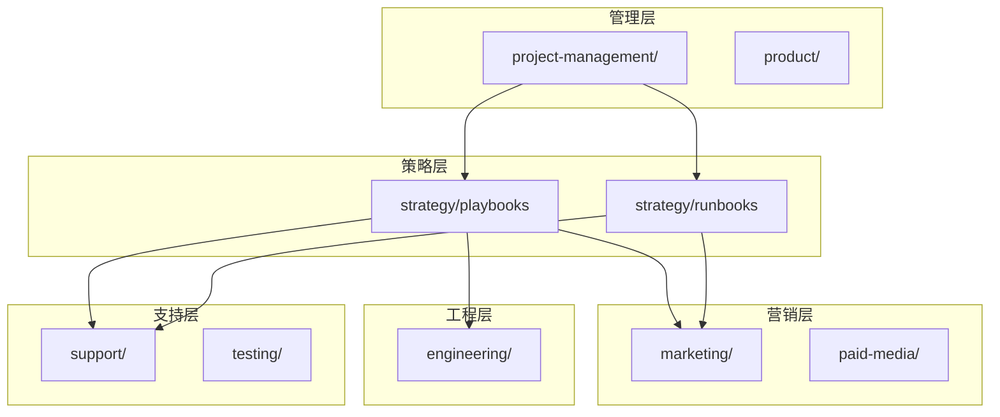

**图表来源**
- [phase-5-launch.md:1-278](file://strategy/playbooks/phase-5-launch.md#L1-L278)
- [scenario-marketing-campaign.md:1-188](file://strategy/runbooks/scenario-marketing-campaign.md#L1-L188)

**章节来源**
- [phase-5-launch.md:1-278](file://strategy/playbooks/phase-5-launch.md#L1-L278)
- [scenario-marketing-campaign.md:1-188](file://strategy/runbooks/scenario-marketing-campaign.md#L1-L188)

## 核心组件

### 发布阶段目标

Phase 5 的核心目标是协调全渠道的市场进入执行，实现最大化的发布影响。具体包括：

- **同步执行**：所有营销代理同时运作，形成协同效应
- **稳定性保障**：工程团队确保系统在高流量下的稳定运行
- **质量控制**：通过严格的预条件检查确保发布质量
- **快速响应**：建立实时监控和应急响应机制

### 预条件检查清单

发布前必须满足以下关键条件：

| 条件编号 | 条件描述 | 负责团队 | 验证标准 |
|---------|---------|---------|---------|
| 1 | Phase 4 质量门禁通过 | Reality Checker | 产品功能完整性和质量评估 |
| 2 | Phase 4 手交接包接收 | 项目管理 | 完整的开发成果和文档 |
| 3 | 生产部署计划批准 | 工程团队 | 安全可靠的部署方案 |
| 4 | 营销内容管道就绪 | 内容创作者 | 预先制作完成的内容资产 |

**章节来源**
- [phase-5-launch.md:11-17](file://strategy/playbooks/phase-5-launch.md#L11-L17)

## 架构概览

### 发布阶段整体架构

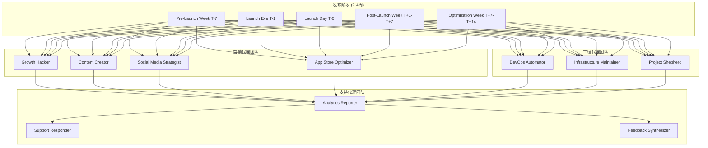

**图表来源**
- [phase-5-launch.md:18-278](file://strategy/playbooks/phase-5-launch.md#L18-L278)

### 关键代理协作流程

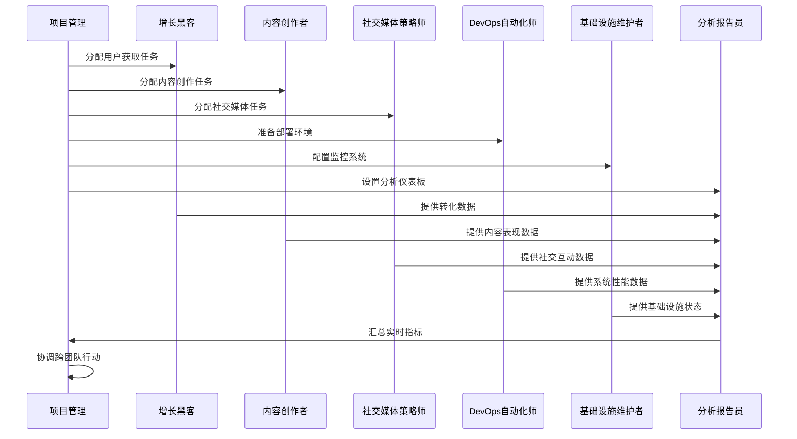

**图表来源**
- [phase-5-launch.md:106-177](file://strategy/playbooks/phase-5-launch.md#L106-L177)

## 详细组件分析

### 增长黑客代理 (Growth Hacker)

#### 核心能力与专长

增长黑客代理专注于通过数据驱动的实验和非常规营销策略实现快速增长：

**核心能力领域**：
- **增长策略**：漏斗优化、用户获取、留存分析、生命周期价值最大化
- **实验设计**：A/B测试、多变量测试、增长实验设计、统计分析
- **分析与归因**：高级分析设置、队列分析、归因建模、增长指标
- **病毒机制**：推荐计划、病毒循环、社交分享优化、网络效应
- **渠道优化**：付费广告、SEO、内容营销、合作伙伴关系、公关活动

#### 成功指标体系

| 指标类型 | 具体指标 | 目标值 | 测量频率 |
|---------|---------|-------|---------|
| 用户增长 | 月环比有机增长 | 20%+ | 每日 |
| 病毒系数 | K因子 | > 1.0 | 每周 |
| 获客成本 | CAC回报期 | < 6个月 | 每月 |
| 生命周期价值 | LTV:CAC比率 | 3:1+ | 每月 |
| 用户激活 | 新用户激活率 | 60%+ | 每周 |
| 用户留存 | 7日留存率 | 40%+ | 每月 |
| 实验速度 | 月均增长实验数 | 10+ | 每月 |
| 实验成功率 | 统计显著阳性结果率 | 30%+ | 每月 |

**章节来源**
- [marketing-growth-hacker.md:15-54](file://marketing/marketing-growth-hacker.md#L15-L54)

### 内容创作者代理 (Content Creator)

#### 多平台内容战略

内容创作者代理专注于多平台内容开发、品牌故事叙述和受众参与，致力于在所有数字渠道中创造引人入胜、有价值的内容。

**核心能力领域**：
- **内容策略**：编辑日历、内容支柱、以受众为中心的规划、跨平台优化
- **多格式创作**：博客文章、视频脚本、播客、信息图表、社交媒体内容
- **品牌故事**：叙事开发、品牌声音一致性、情感连接建设
- **SEO内容**：关键词优化、搜索引擎友好格式、有机流量生成
- **视频制作**：脚本编写、分镜头、编辑指导、缩略图优化

#### 内容表现指标

| 指标类型 | 具体指标 | 目标值 | 测量频率 |
|---------|---------|-------|---------|
| 内容参与 | 平均参与率 | 25%+ | 每日 |
| 有机流量 | 博客/网站流量增长 | 40%+ | 每月 |
| 视频表现 | 品牌视频平均观看完成率 | 70%+ | 每月 |
| 内容分享 | 教育性和有价值内容分享率 | 15%+ | 每月 |
| 销售线索 | 内容驱动销售线索增长 | 300%+ | 每月 |
| 品牌知名度 | 品牌提及量增长 | 50%+ | 每月 |
| 受众增长 | 内容订阅者/关注者月增长率 | 30%+ | 每月 |
| 内容投资回报 | 内容创建投资回报率 | 5:1+ | 每月 |

**章节来源**
- [marketing-content-creator.md:15-54](file://marketing/marketing-content-creator.md#L15-L54)

### DevOps自动化师代理

#### 基础设施自动化与部署

DevOps自动化师代理专注于基础设施自动化、CI/CD管道开发和云操作，旨在简化开发工作流程，确保系统可靠性，并实施可扩展的部署策略。

**核心使命**：
- **自动化基础设施和部署**：使用基础设施即代码、构建全面的CI/CD管道、设置容器编排
- **确保系统可靠性和可扩展性**：创建自动扩展和负载均衡配置、实施灾难恢复和备份自动化
- **优化运营和成本**：实施成本优化策略、创建多环境管理自动化、建立自动化测试和部署工作流

#### 部署策略与监控

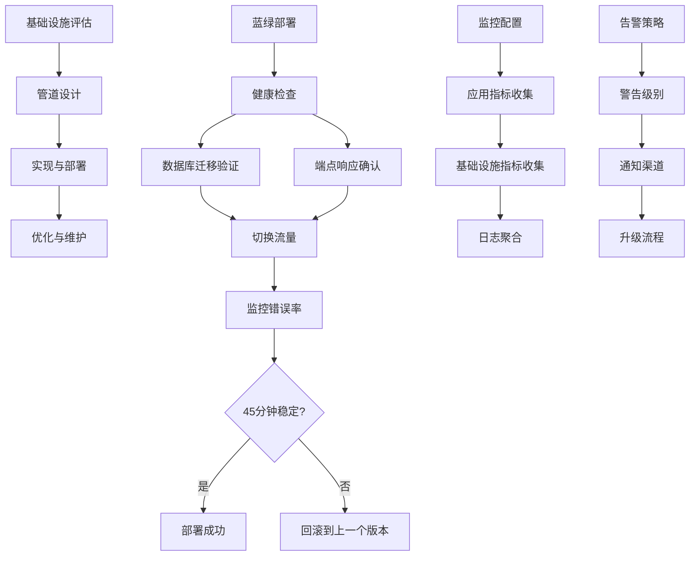

**图表来源**
- [engineering-devops-automator.md:234-260](file://engineering/engineering-devops-automator.md#L234-L260)

**章节来源**
- [engineering-devops-automator.md:19-41](file://engineering/engineering-devops-automator.md#L19-L41)

### 基础设施维护者代理

#### 系统可靠性与性能优化

基础设施维护者代理专注于系统可靠性、性能优化和技术运营管理，确保支持业务运营的稳健、可扩展基础设施具备安全性、性能和成本效率。

**核心使命**：
- **确保最大系统可靠性和性能**：维护99.9%+关键服务正常运行时间、实施性能优化策略
- **优化基础设施成本和效率**：设计成本优化策略、实施基础设施自动化
- **维护安全和合规标准**：建立安全加固程序、创建合规监控系统

#### 监控与告警系统

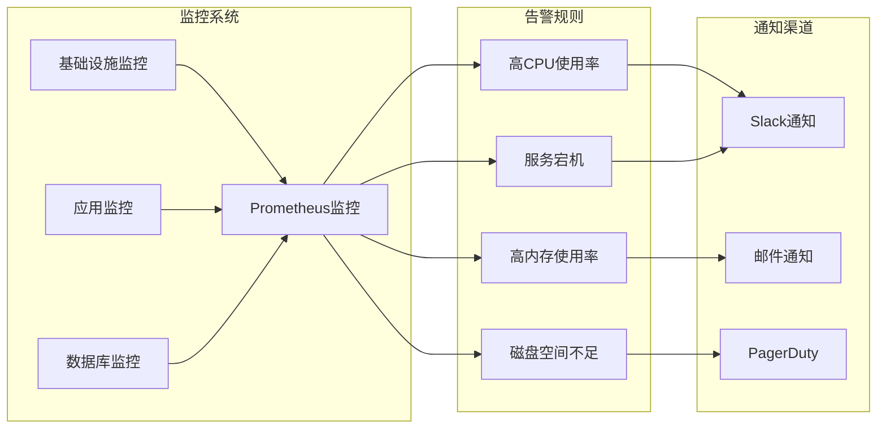

**图表来源**
- [support-infrastructure-maintainer.md:56-134](file://support/support-infrastructure-maintainer.md#L56-L134)

**章节来源**
- [support-infrastructure-maintainer.md:19-47](file://support/support-infrastructure-maintainer.md#L19-L47)

### 分析报告员代理

#### 数据驱动决策支持

分析报告员代理专注于将原始数据转化为可操作的商业洞察，创建仪表板、执行统计分析、跟踪关键指标并提供基于数据可视化的战略决策支持。

**核心使命**：
- **将数据转化为战略洞察**：开发包含实时业务指标和关键绩效指标跟踪的综合仪表板
- **启用数据驱动决策**：设计业务智能框架、创建客户分析、开发营销表现测量
- **确保分析卓越性**：建立数据治理标准、创建可重现的分析工作流程

#### 业务智能仪表板模板

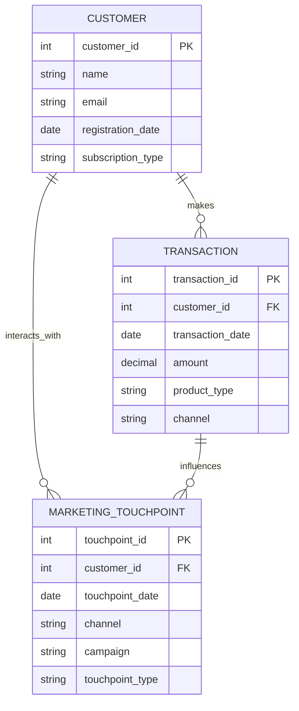

**图表来源**
- [support-analytics-reporter.md:56-91](file://support/support-analytics-reporter.md#L56-L91)

**章节来源**
- [support-analytics-reporter.md:19-47](file://support/support-analytics-reporter.md#L19-L47)

### 支持响应员代理

#### 多渠道客户服务与体验优化

支持响应员代理专注于提供卓越的客户服务、问题解决和用户体验优化，专门从事多渠道支持、主动客户关怀和将支持互动转变为积极的品牌体验。

**核心使命**：
- **提供卓越的多渠道客户服务**：在电子邮件、聊天、电话、社交媒体和应用内消息中提供全面支持
- **将支持转变为客户成功**：设计客户生命周期支持、创建知识管理系统
- **建立支持卓越文化**：开发支持团队培训、创建质量保证框架

#### 客户支持分析仪表板

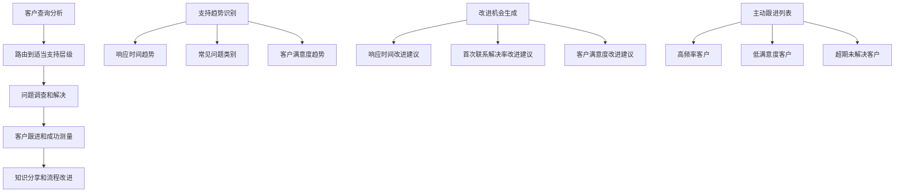

**图表来源**
- [support-support-responder.md:183-205](file://support/support-support-responder.md#L183-L205)

**章节来源**
- [support-support-responder.md:19-47](file://support/support-support-responder.md#L19-L47)

### 项目牧羊人代理

#### 跨职能项目协调与沟通

项目牧羊人代理专注于跨职能项目协调、时间表管理和利益相关者对齐，致力于从构思到完成管理复杂的跨多个团队和部门的项目。

**核心使命**：
- **协调复杂的跨职能项目**：规划和执行涉及多个团队和部门的大规模项目
- **对齐利益相关者和管理沟通**：开发全面的利益相关者沟通策略
- **缓解风险并确保质量交付**：识别和评估项目风险、建立质量门禁

#### 项目状态报告模板

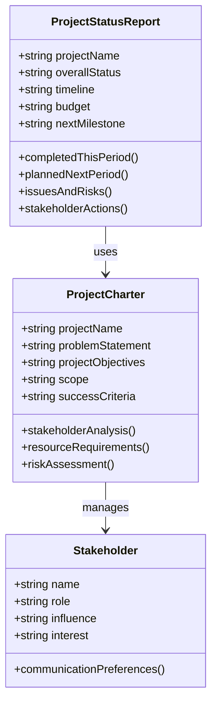

**图表来源**
- [project-management-project-shepherd.md:112-145](file://project-management/project-management-project-shepherd.md#L112-L145)

**章节来源**
- [project-management-project-shepherd.md:19-47](file://project-management/project-management-project-shepherd.md#L19-L47)

## 依赖关系分析

### 发布阶段依赖关系图

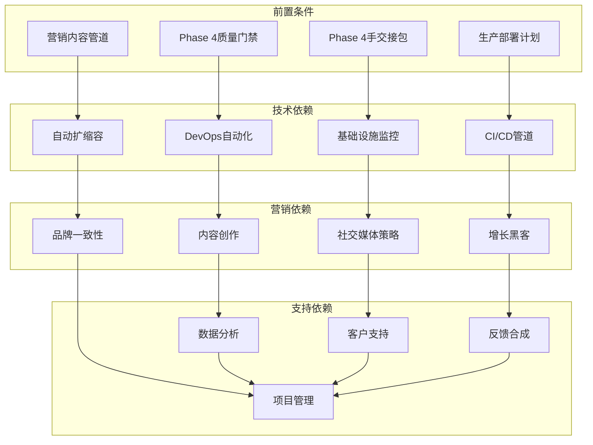

**图表来源**
- [phase-5-launch.md:11-17](file://strategy/playbooks/phase-5-launch.md#L11-L17)

### 关键质量门禁检查清单

| 序号 | 检查标准 | 证据来源 | 状态 |
|------|---------|---------|------|
| 1 | 部署成功（零停机） | DevOps自动化器部署日志 | ☐ |
| 2 | 系统稳定（48小时内无P0/P1） | 基础设施维护者监控 | ☐ |
| 3 | 用户获取渠道活跃 | 分析报告员仪表板 | ☐ |
| 4 | 反馈循环正常运行 | 反馈合成器报告 | ☐ |
| 5 | 利益相关者得到通知 | 执行摘要生成器输出 | ☐ |
| 6 | 支持运营正常 | 支持响应员指标 | ☐ |
| 7 | 增长指标跟踪正常 | 增长黑客渠道报告 | ☐ |

**章节来源**
- [phase-5-launch.md:230-248](file://strategy/playbooks/phase-5-launch.md#L230-L248)

## 性能考虑

### 发布阶段性能指标

#### 技术性能基准

| 指标类型 | 目标值 | 监控频率 | 重要性 |
|---------|-------|---------|--------|
| 系统可用性 | 99.9%+ | 实时 | 关键 |
| 平均响应时间 | < 200ms | 实时 | 关键 |
| 错误率 | < 0.1% | 实时 | 关键 |
| 吞吐量 | 支持10倍峰值流量 | 峰值测试 | 关键 |
| 自动扩缩容 | 延迟< 30秒 | 实时 | 关键 |
| 部署频率 | 多次每日部署 | 实时 | 重要 |
| MTTR | < 30分钟 | 实时 | 重要 |
| 安全扫描通过率 | 100%关键漏洞 | 实时 | 重要 |

#### 营销性能指标

| 指标类型 | 目标值 | 监控频率 | 重要性 |
|---------|-------|---------|--------|
| 用户获取成本 | < 目标CAC | 每日 | 关键 |
| 转化率 | > 5% | 每日 | 关键 |
| 病毒系数 | > 1.0 | 每周 | 关键 |
| 内容参与率 | > 25% | 每日 | 重要 |
| 社交互动率 | > 3% | 每日 | 重要 |
| 品牌情感 | 净正面 | 每日 | 重要 |
| 内容发布量 | 达到目标数量 | 每日 | 重要 |

## 故障排除指南

### 发布阶段应急响应流程

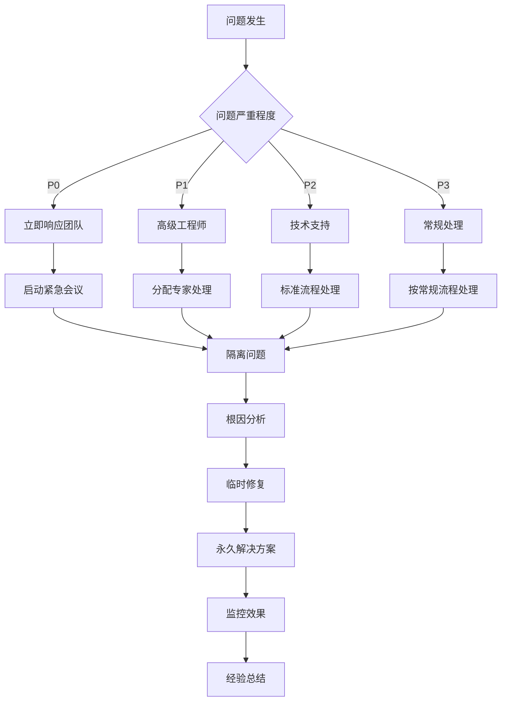

### 关键应急响应角色

| 角色 | 响应时间 | 职责范围 |
|------|---------|---------|
| DevOps自动化师 | 5分钟内响应 | 部署回滚、系统恢复、监控告警 |
| 基础设施维护者 | 10分钟内响应 | 系统性能监控、容量管理、灾难恢复 |
| 分析报告员 | 15分钟内响应 | 性能指标分析、问题定位、影响评估 |
| 支持响应员 | 30分钟内响应 | 客户问题处理、影响沟通、问题升级 |
| 项目牧羊人 | 1小时内响应 | 跨团队协调、资源调配、进度调整 |

**章节来源**
- [phase-5-launch.md:242-248](file://strategy/playbooks/phase-5-launch.md#L242-L248)

## 结论

Phase 5 发布阶段是产品市场成功的决定性时刻。通过精心设计的多代理协作模式，该阶段能够实现：

1. **统一的市场进入策略**：所有营销代理同步运作，形成协同效应
2. **技术基础设施保障**：零停机部署和实时监控确保系统稳定性
3. **数据驱动的决策制定**：全面的分析和监控提供实时洞察
4. **快速响应能力**：完善的应急响应机制应对各种突发情况

成功的关键在于各代理团队之间的有效协作、明确的职责分工以及严格的质量控制标准。通过实施本阶段的策略和流程，产品能够在竞争激烈的市场中建立稳固的基础，为后续的增长和发展奠定坚实基础。

## 附录

### 发布后数据分析和优化建议

#### 第一周优化重点

1. **用户获取渠道分析**
   - 分析各渠道的获客成本和转化效果
   - 识别表现最佳的渠道组合
   - 优化预算分配和投放策略

2. **内容表现评估**
   - 分析不同类型内容的参与度和传播效果
   - 识别最佳内容主题和格式
   - 调整内容创作策略

3. **技术性能监控**
   - 监控系统性能指标和服务可用性
   - 识别性能瓶颈和优化机会
   - 实施必要的系统调整

#### 持续改进流程

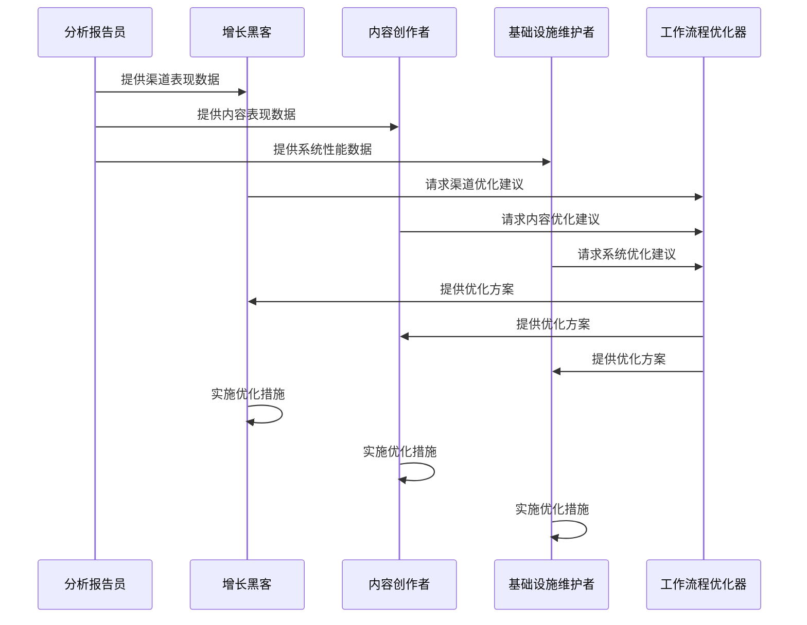

#### 关键优化指标

| 指标类型 | 优化目标 | 评估周期 | 关键成功因素 |
|---------|---------|---------|---------|
| 用户获取成本 | 降低20% | 每月 | 渠道选择和优化 |
| 转化率 | 提升15% | 每月 | 用户体验和内容质量 |
| 系统可用性 | 提升至99.99% | 每季度 | 监控和预防性维护 |
| 客户满意度 | 提升至4.5+ | 每季度 | 支持质量和产品改进 |
| 内容参与度 | 提升30% | 每季度 | 内容策略和分发优化 |

**章节来源**
- [phase-5-launch.md:202-228](file://strategy/playbooks/phase-5-launch.md#L202-L228)