# Phase 6 运营阶段

<cite>
**本文档引用的文件**
- [phase-6-operate.md](file://strategy/playbooks/phase-6-operate.md)
- [support-analytics-reporter.md](file://support/support-analytics-reporter.md)
- [support-infrastructure-maintainer.md](file://support/support-infrastructure-maintainer.md)
- [support-support-responder.md](file://support/support-support-responder.md)
- [support-finance-tracker.md](file://support/support-finance-tracker.md)
- [support-legal-compliance-checker.md](file://support/support-legal-compliance-checker.md)
- [support-executive-summary-generator.md](file://support/support-executive-summary-generator.md)
- [product-feedback-synthesizer.md](file://product/product-feedback-synthesizer.md)
- [product-sprint-prioritizer.md](file://product/product-sprint-prioritizer.md)
- [marketing-growth-hacker.md](file://marketing/marketing-growth-hacker.md)
- [README.md](file://README.md)
</cite>

## 目录
1. [简介](#简介)
2. [项目结构](#项目结构)
3. [核心组件](#核心组件)
4. [架构总览](#架构总览)
5. [详细组件分析](#详细组件分析)
6. [依赖关系分析](#依赖关系分析)
7. [性能考量](#性能考量)
8. [故障排除指南](#故障排除指南)
9. [结论](#结论)
10. [附录](#附录)

## 简介
Phase 6 运营阶段是产品上线后的持续运营与持续改进阶段，目标是在产品稳定运行的基础上，通过数据驱动的洞察、自动化运维、客户支持与合规保障，实现可持续增长与长期成功。本阶段没有明确结束日期，将持续进行直到产品退出市场为止。运营的核心在于建立“测量—分析—计划—构建—验证—部署—再测量”的闭环，确保产品在真实市场中不断演进。

## 项目结构
该仓库提供了完整的“智能体”（Agent）体系，每个智能体代表一个专业角色，具备明确的身份、职责、工作流与交付物。在运营阶段，以下支持类智能体构成运营支柱：
- 数据分析与业务洞察：Analytics Reporter
- 基础设施与系统运维：Infrastructure Maintainer
- 客户支持与体验优化：Support Responder
- 财务与成本控制：Finance Tracker
- 合规与法律风控：Legal Compliance Checker
- 战略沟通与高层汇报：Executive Summary Generator
- 用户反馈与产品优先级：Feedback Synthesizer、Sprint Prioritizer
- 增长与渠道优化：Growth Hacker

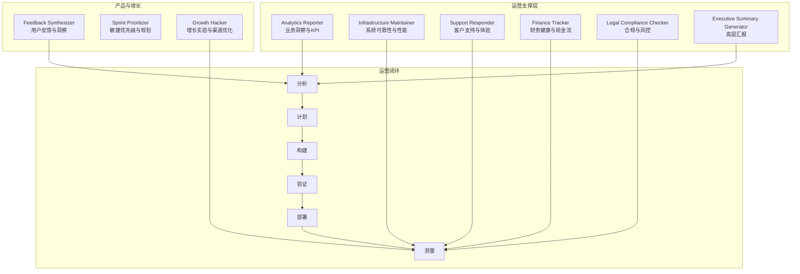

图表来源
- [phase-6-operate.md:73-95](file://strategy/playbooks/phase-6-operate.md#L73-L95)
- [support-analytics-reporter.md:222-247](file://support/support-analytics-reporter.md#L222-L247)
- [support-infrastructure-maintainer.md:449-475](file://support/support-infrastructure-maintainer.md#L449-L475)
- [support-support-responder.md:416-441](file://support/support-support-responder.md#L416-L441)
- [support-finance-tracker.md:277-302](file://support/support-finance-tracker.md#L277-L302)
- [support-legal-compliance-checker.md:404-430](file://support/support-legal-compliance-checker.md#L404-L430)
- [support-executive-summary-generator.md:84-111](file://support/support-executive-summary-generator.md#L84-L111)
- [product-feedback-synthesizer.md:79-119](file://product/product-feedback-synthesizer.md#L79-L119)
- [product-sprint-prioritizer.md:78-127](file://product/product-sprint-prioritizer.md#L78-L127)
- [marketing-growth-hacker.md:35-54](file://marketing/marketing-growth-hacker.md#L35-L54)

章节来源
- [README.md:223-235](file://README.md#L223-L235)
- [phase-6-operate.md:18-72](file://strategy/playbooks/phase-6-operate.md#L18-L72)

## 核心组件
- 数据分析师（Analytics Reporter）
  - 职责：构建仪表盘、统计分析、趋势识别、预测模型、客户生命周期价值与留存分析、营销归因与ROI评估。
  - 关键产出：执行摘要模板、SQL分析脚本、Python/R分析框架、JavaScript可视化脚本。
  - 成功度量：分析准确率、业务推荐实施率、看板采用率、KPI提升幅度、干系人满意度。

- 基础设施维护者（Infrastructure Maintainer）
  - 职责：系统可靠性与性能、成本优化、安全与合规、监控告警、备份与灾难恢复、自动化的基础设施即代码。
  - 关键产出：Prometheus监控配置、Terraform基础设施定义、备份与恢复脚本、容量规划报告。
  - 成功度量：系统可用性、平均修复时间、成本优化收益、安全合规达标率、自动化减少人工操作比例。

- 支持响应者（Support Responder）
  - 职责：多渠道客户支持、首响应时间与解决率、知识库与自助服务、客户成功与预防性跟进。
  - 关键产出：全渠道支持框架、支持分析仪表盘、知识库管理、客户互动模板。
  - 成功度量：CSAT、首次接触解决率、响应时间SLA达成率、知识库贡献减少重复工单量、客户留存改善。

- 财务追踪员（Finance Tracker）
  - 职责：预算与预测、现金流管理、投资回报分析、成本结构优化、税务与合规。
  - 关键产出：预算框架SQL、现金流预测Python、投资分析框架、财务报告模板。
  - 成功度量：预算准确率、现金流预测准确率、成本优化效率、投资ROI、财务报告合规性。

- 合规检查员（Legal Compliance Checker）
  - 职责：监管合规、隐私保护、合同审查、风险评估、培训与文化推广。
  - 关键产出：GDPR合规框架、隐私政策生成器、合同审查自动化、合规评估报告模板。
  - 成功度量：合规达标率、法律风险暴露、审计结果、员工合规培训完成率、合规文化评分。

- 执行摘要生成器（Executive Summary Generator）
  - 职责：将复杂信息转化为高层可读的简洁摘要，使用SCQA/金字塔原则/Bain方法论。
  - 关键产出：结构化摘要模板、量化影响、行动项与决策点。
  - 成功度量：阅读决策时间、关键发现量化率、行动项完整性、高管采纳率。

- 反馈合成器（Feedback Synthesizer）与冲刺优先级（Sprint Prioritizer）
  - 职责：用户反馈提炼、主题分类、情感分析、优先级评分（RICE/MoSCoW/Kano）、敏捷规划与容量管理。
  - 关键产出：反馈处理流水线、优先级评分框架、冲刺规划模板、风险缓解策略。
  - 成功度量：主题准确性、行动转化率、冲刺完成率、交付可预测性、技术债控制。

- 增长黑客（Growth Hacker）
  - 职责：增长实验设计、漏斗优化、病毒系数、CAC/LTV优化、跨平台渠道优化。
  - 关键产出：增长实验框架、漏斗分析、A/B测试设计、渠道效果评估。
  - 成功度量：月活增长率、病毒系数、CAC回本周期、LTV:CAC比率、实验胜率。

章节来源
- [support-analytics-reporter.md:9-53](file://support/support-analytics-reporter.md#L9-L53)
- [support-infrastructure-maintainer.md:9-53](file://support/support-infrastructure-maintainer.md#L9-L53)
- [support-support-responder.md:9-53](file://support/support-support-responder.md#L9-L53)
- [support-finance-tracker.md:9-53](file://support/support-finance-tracker.md#L9-L53)
- [support-legal-compliance-checker.md:9-53](file://support/support-legal-compliance-checker.md#L9-L53)
- [support-executive-summary-generator.md:9-54](file://support/support-executive-summary-generator.md#L9-L54)
- [product-feedback-synthesizer.md:12-54](file://product/product-feedback-synthesizer.md#L12-L54)
- [product-sprint-prioritizer.md:12-54](file://product/product-sprint-prioritizer.md#L12-L54)
- [marketing-growth-hacker.md:12-54](file://marketing/marketing-growth-hacker.md#L12-L54)

## 架构总览
运营阶段采用“持续改进循环”，以数据驱动为核心，结合多智能体协作，形成从测量到部署的闭环。每日、每周、双周、月度、季度的运营节奏确保不同粒度的反馈与优化得以及时落地。

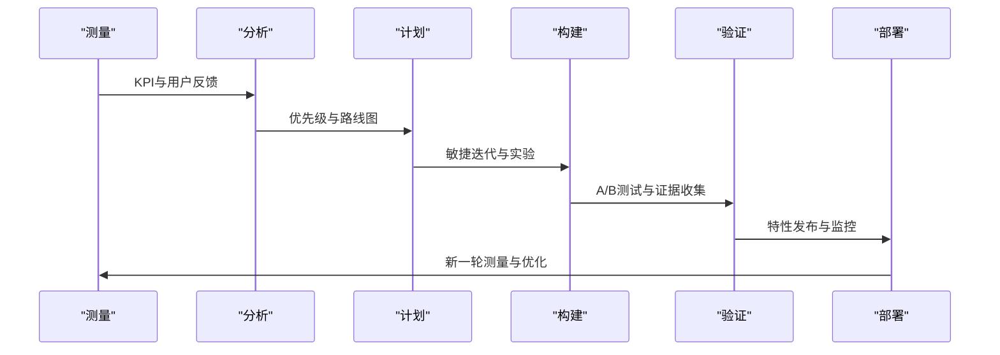

图表来源
- [phase-6-operate.md:73-95](file://strategy/playbooks/phase-6-operate.md#L73-L95)

章节来源
- [phase-6-operate.md:97-109](file://strategy/playbooks/phase-6-operate.md#L97-L109)

## 详细组件分析

### 数据分析员（Analytics Reporter）
- 角色定位：业务洞察专家，负责将原始数据转化为可执行的战略决策依据。
- 工作流要点：
  - 数据发现与验证：质量评估、假设设定、显著性阈值。
  - 分析框架开发：可复现的数据管道、统计检验、异常检测。
  - 洞察生成与可视化：交互式仪表盘、执行摘要、A/B测试分析、预测模型。
  - 业务影响度量：推荐实施跟踪、反馈闭环、KPI监控与阈值告警。
- 日常产出：每日KPI快照、每周分析报告、月度市场简报、季度战略回顾。
- 关键能力：SQL优化、Python/R统计建模、可视化工具、预测分析与情景规划。

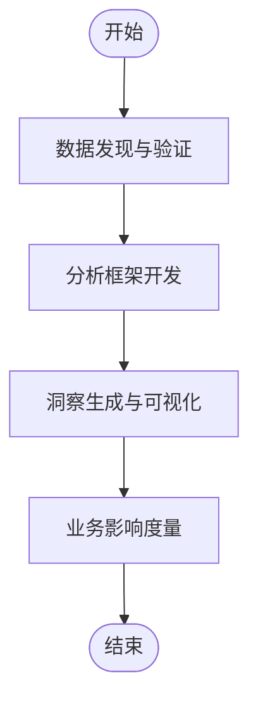

图表来源
- [support-analytics-reporter.md:222-247](file://support/support-analytics-reporter.md#L222-L247)

章节来源
- [support-analytics-reporter.md:249-310](file://support/support-analytics-reporter.md#L249-L310)
- [support-analytics-reporter.md:334-362](file://support/support-analytics-reporter.md#L334-L362)

### 基础设施维护者（Infrastructure Maintainer）
- 角色定位：系统可靠性与性能专家，确保99.9%+可用性与成本效率。
- 工作流要点：
  - 基础设施评估与规划：健康检查、优化机会、回滚方案。
  - 实施与监控：IaC部署、全面监控与告警、自动化测试与健康检查、备份与恢复。
  - 性能优化与成本管理：资源利用率分析、弹性伸缩策略、容量规划与成本仪表盘。
  - 安全与合规验证：漏洞扫描、补丁管理、访问控制、事件响应。
- 日常产出：健康与性能报告、成本分析与优化建议、容量规划与技术路线图。
- 关键能力：Prometheus/Grafana监控、Terraform/IaC、容器编排、安全加固与合规自动化。

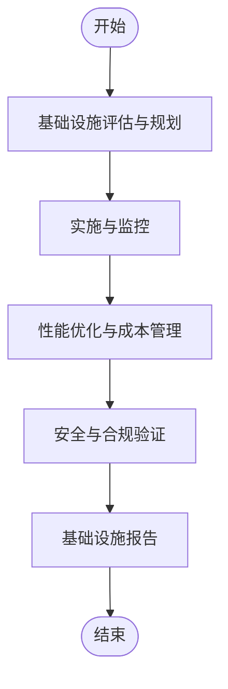

图表来源
- [support-infrastructure-maintainer.md:449-475](file://support/support-infrastructure-maintainer.md#L449-L475)

章节来源
- [support-infrastructure-maintainer.md:476-563](file://support/support-infrastructure-maintainer.md#L476-L563)
- [support-infrastructure-maintainer.md:587-615](file://support/support-infrastructure-maintainer.md#L587-L615)

### 支持响应者（Support Responder）
- 角色定位：客户体验与成功专家，提供多渠道支持与预防性关怀。
- 工作流要点：
  - 客户咨询分析与路由：上下文分析、历史整合、复杂度分级、优先级路由。
  - 问题调查与解决：系统化诊断、跨团队协作、知识库更新、解决方案验证。
  - 客户跟进与成功度量：主动回访、满意度测量、记录更新、交叉销售机会。
  - 知识共享与流程改进：知识库贡献、产品反馈、趋势分析、培训分享。
- 日常产出：支持工单摘要、客户互动报告、支持分析仪表盘、知识库优化建议。
- 关键能力：多渠道支持、情境感知、知识库管理、客户成功与预防性干预。

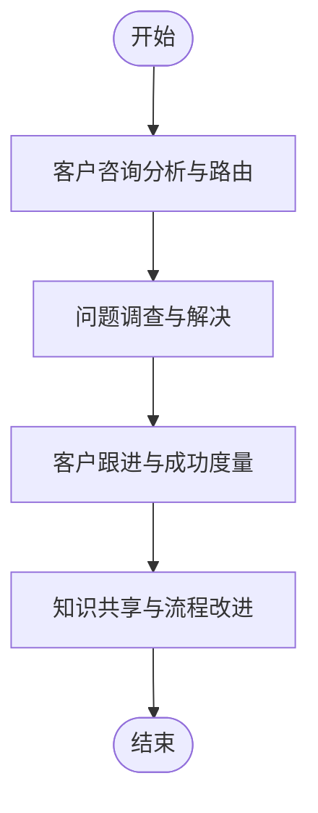

图表来源
- [support-support-responder.md:416-441](file://support/support-support-responder.md#L416-L441)

章节来源
- [support-support-responder.md:443-530](file://support/support-support-responder.md#L443-L530)
- [support-support-responder.md:554-582](file://support/support-support-responder.md#L554-L582)

### 财务追踪员（Finance Tracker）
- 角色定位：财务健康与增长专家，负责预算、现金流、投资回报与风险控制。
- 工作流要点：
  - 财务数据验证与分析：准确性与完整性、账户对账、基线指标。
  - 预算制定与规划：年度预算、月度/季度分解、部门分配、差异分析与预警。
  - 绩效监控与报告：执行摘要仪表盘、月度财务报告、成本分析与优化建议。
  - 战略财务规划：财务建模、投资分析、融资策略、税务与合规。
- 日常产出：财务报告模板、预算对比分析、现金流预测、投资分析报告。
- 关键能力：财务建模、现金流优化、成本控制、投资回报分析、合规与审计准备。

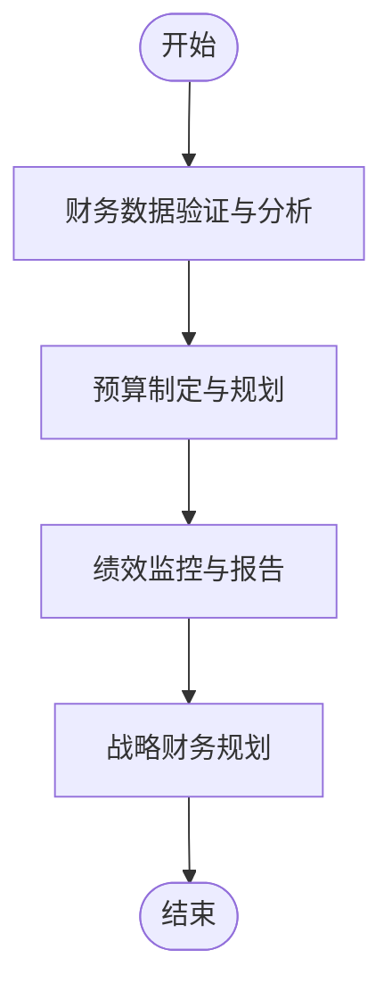

图表来源
- [support-finance-tracker.md:277-302](file://support/support-finance-tracker.md#L277-L302)

章节来源
- [support-finance-tracker.md:304-387](file://support/support-finance-tracker.md#L304-L387)
- [support-finance-tracker.md:411-439](file://support/support-finance-tracker.md#L411-L439)

### 合规检查员（Legal Compliance Checker）
- 角色定位：法律与合规专家，确保业务在多司法管辖区内的合规与风险管理。
- 工作流要点：
  - 法规景观评估：监管变化监测、影响评估、政策更新。
  - 风险评估与差距分析：合规审计、流程审查、第三方供应商评估。
  - 政策制定与实施：合规政策、隐私政策、合同审查、监控系统。
  - 培训与文化建设：角色化培训、意识提升、文化度量。
- 日常产出：合规评估报告模板、隐私政策生成器、合同审查报告、合规仪表盘。
- 关键能力：多司法管辖区合规、风险评估与缓解、合同谈判与条款保护、合规技术集成。

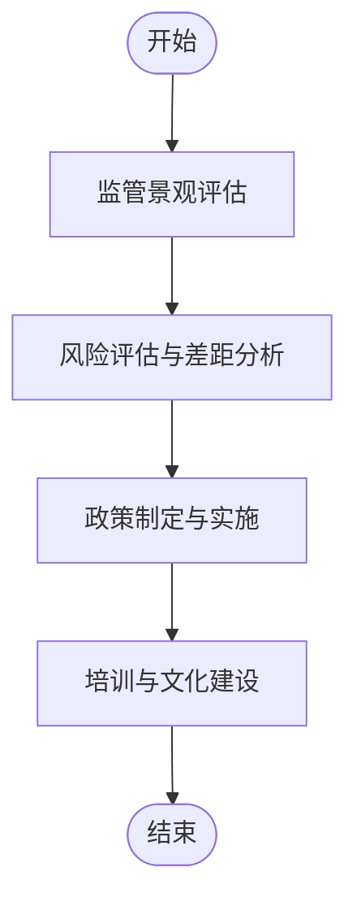

图表来源
- [support-legal-compliance-checker.md:404-430](file://support/support-legal-compliance-checker.md#L404-L430)

章节来源
- [support-legal-compliance-checker.md:431-533](file://support/support-legal-compliance-checker.md#L431-L533)
- [support-legal-compliance-checker.md:557-585](file://support/support-legal-compliance-checker.md#L557-L585)

### 执行摘要生成器（Executive Summary Generator）
- 角色定位：高层沟通专家，用SCQA/金字塔/Bain框架将复杂信息转化为可执行摘要。
- 工作流要点：
  - 输入整理与分析：内容审阅、关键洞察识别、数据质量评估。
  - 结构化组织：金字塔原理排序、量化数据、战略含义。
  - 摘要生成：简洁明了、量化影响、明确行动项与决策点。
  - 质量保证：字数控制、数据完整性、行动项可执行性。
- 日常产出：结构化摘要模板、量化影响说明、优先行动项与时限。
- 关键能力：咨询框架应用、量化表达、高层沟通技巧、风险与机会评估。

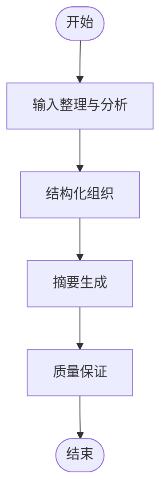

图表来源
- [support-executive-summary-generator.md:84-111](file://support/support-executive-summary-generator.md#L84-L111)

章节来源
- [support-executive-summary-generator.md:112-155](file://support/support-executive-summary-generator.md#L112-L155)
- [support-executive-summary-generator.md:179-210](file://support/support-executive-summary-generator.md#L179-L210)

### 反馈合成器与冲刺优先级（Feedback Synthesizer + Sprint Prioritizer）
- 角色定位：用户声音与产品优先级专家，将用户反馈转化为可执行的产品计划。
- 工作流要点：
  - 反馈收集：主动/被动/社区/竞争渠道；清洗与标准化；情感分析与主题标注。
  - 分析与合成：主题聚类、相关性分析、用户旅程映射、优先级评分（RICE/MoSCoW/Kano）。
  - 计划与执行：冲刺目标定义、故事拆分、容量评估、依赖管理、风险缓解。
- 日常产出：反馈仪表盘、产品团队报告、客户成功手册、冲刺规划模板。
- 关键能力：多源数据融合、优先级框架应用、敏捷规划与容量管理、风险识别与缓解。

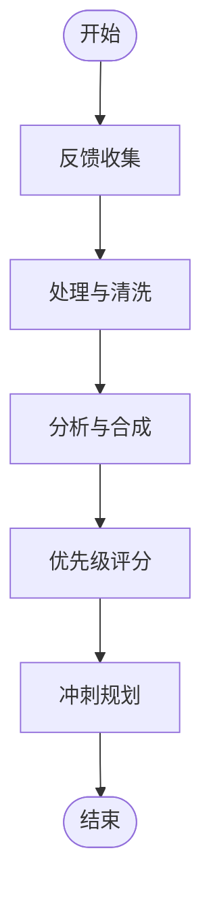

图表来源
- [product-feedback-synthesizer.md:65-78](file://product/product-feedback-synthesizer.md#L65-L78)
- [product-sprint-prioritizer.md:78-127](file://product/product-sprint-prioritizer.md#L78-L127)

章节来源
- [product-feedback-synthesizer.md:79-119](file://product/product-feedback-synthesizer.md#L79-L119)
- [product-sprint-prioritizer.md:128-154](file://product/product-sprint-prioritizer.md#L128-L154)

### 增长黑客（Growth Hacker）
- 角色定位：增长实验专家，专注于可扩展的增长渠道与转化优化。
- 工作流要点：
  - 增长策略：漏斗优化、用户获取、留存分析、LTV最大化。
  - 实验设计：A/B测试、多变量测试、统计显著性验证、胜率管理。
  - 渠道优化：付费广告、SEO、内容营销、合作伙伴关系、病毒系数优化。
- 日常产出：增长实验报告、渠道效果分析、转化漏斗优化建议、病毒系数提升方案。
- 关键能力：增长模型、实验设计、渠道归因、产品驱动增长、跨平台整合。

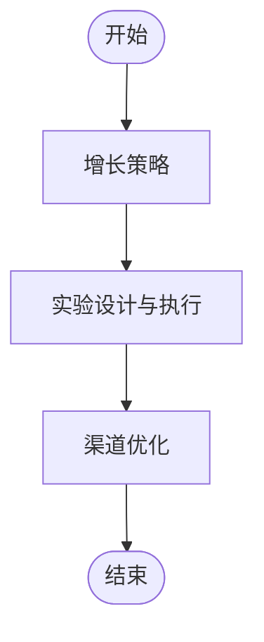

图表来源
- [marketing-growth-hacker.md:35-54](file://marketing/marketing-growth-hacker.md#L35-L54)

章节来源
- [marketing-growth-hacker.md:12-54](file://marketing/marketing-growth-hacker.md#L12-L54)

## 依赖关系分析
- 多智能体协作
  - Analytics Reporter 与 Feedback Synthesizer 共同驱动“测量—分析”环节，前者关注宏观KPI，后者聚焦用户反馈。
  - Sprint Prioritizer 将分析结果转化为可执行的冲刺计划，连接产品与工程团队。
  - Growth Hacker 在“构建—验证—部署”环节推动增长实验，验证市场与产品契合度。
  - Infrastructure Maintainer 保障“部署—再测量”的稳定性与性能，避免基础设施成为瓶颈。
  - Support Responder 提供用户侧反馈与体验数据，补充“测量”维度。
  - Finance Tracker 与 Legal Compliance Checker 作为“治理与风控”模块，贯穿所有环节，确保财务健康与合规。
  - Executive Summary Generator 将多源信息整合为高层可读摘要，驱动决策。

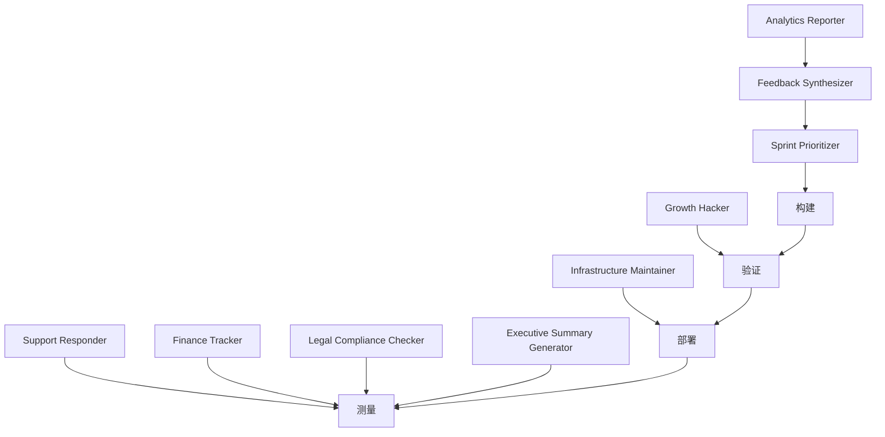

图表来源
- [phase-6-operate.md:73-95](file://strategy/playbooks/phase-6-operate.md#L73-L95)
- [support-analytics-reporter.md:222-247](file://support/support-analytics-reporter.md#L222-L247)
- [support-support-responder.md:416-441](file://support/support-support-responder.md#L416-L441)
- [support-finance-tracker.md:277-302](file://support/support-finance-tracker.md#L277-L302)
- [support-legal-compliance-checker.md:404-430](file://support/support-legal-compliance-checker.md#L404-L430)
- [support-executive-summary-generator.md:84-111](file://support/support-executive-summary-generator.md#L84-L111)
- [product-feedback-synthesizer.md:79-119](file://product/product-feedback-synthesizer.md#L79-L119)
- [product-sprint-prioritizer.md:78-127](file://product/product-sprint-prioritizer.md#L78-L127)
- [marketing-growth-hacker.md:35-54](file://marketing/marketing-growth-hacker.md#L35-L54)

章节来源
- [phase-6-operate.md:111-152](file://strategy/playbooks/phase-6-operate.md#L111-L152)

## 性能考量
- 测量与监控
  - 建立实时仪表盘与阈值告警，确保关键指标异常时能快速响应。
  - 使用A/B测试与归因模型验证变更效果，避免主观判断导致的偏差。
- 构建与验证
  - 采用小步快跑的敏捷迭代，缩短反馈周期，降低失败成本。
  - 引入自动化测试与质量门禁，确保每次构建的质量与稳定性。
- 部署与运维
  - 采用蓝绿/金丝雀发布策略，最小化部署风险与回滚成本。
  - 通过IaC与自动化运维减少人为错误，提高一致性与可重复性。
- 成本与效率
  - 通过容量规划与弹性伸缩控制成本，避免过度配置或资源不足。
  - 建立成本中心与ROI评估机制，确保每项投入都能带来可衡量的价值。

## 故障排除指南
- 问题响应流程
  - 检测：监控告警、用户反馈、性能下降等信号触发。
  - 分类：根据严重等级（P0-P3）进行分类，明确响应团队与决策权限。
  - 响应：按严重等级分配相应资源，P0需立即成立应急小组。
  - 解决：修复实施、证据收集验证、基础设施确认稳定。
  - 复盘：流程优化、根因分析、预防措施与流程改进。
- 常见问题与处理建议
  - 性能退化：启用容量规划与性能回归测试，识别瓶颈并优化。
  - 客户投诉激增：加强支持响应与知识库建设，主动回访高风险客户。
  - 合规风险：定期进行合规审计与培训，完善合同审查与数据保护流程。
  - 财务偏差：强化预算与现金流预测，建立差异分析与预警机制。

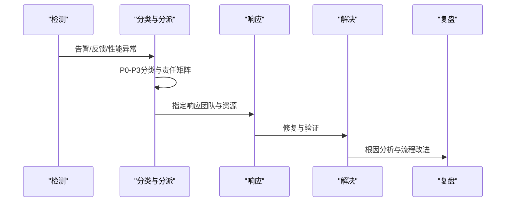

图表来源
- [phase-6-operate.md:122-152](file://strategy/playbooks/phase-6-operate.md#L122-L152)

章节来源
- [phase-6-operate.md:111-152](file://strategy/playbooks/phase-6-operate.md#L111-L152)

## 结论
Phase 6 运营阶段通过多智能体协同与持续改进循环，将数据洞察、系统稳定性、客户体验、财务健康与合规风控有机整合，形成可持续增长的运营体系。关键在于：
- 明确的运营节奏与职责边界；
- 数据驱动的测量与分析；
- 快速迭代的构建与验证；
- 自动化与标准化的部署与运维；
- 全面的风险管控与合规保障；
- 高层可读的沟通与决策支持。

## 附录

### 运营KPI指标
- 可靠性：系统可用性 > 99.9%，平均修复时间 < 30分钟
- 增长：月环比用户增长 > 20%，激活率 > 60%
- 留存：第7天留存 > 40%，第30天留存 > 20%
- 财务：LTV:CAC > 3:1，组合投资回报率 > 25%
- 质量：NPS > 50，支持解决时间 < 4小时
- 合规：监管合规达标率 > 98%
- 效率：日均部署次数 > 多次，流程改进率 > 20%/季度

章节来源
- [phase-6-operate.md:298-315](file://strategy/playbooks/phase-6-operate.md#L298-L315)