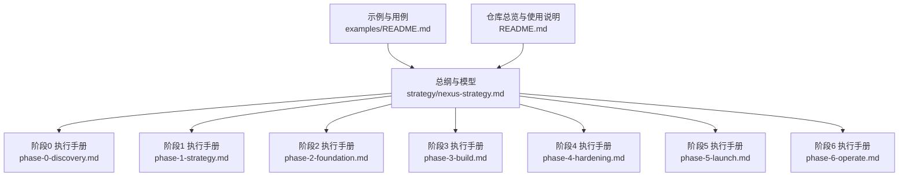
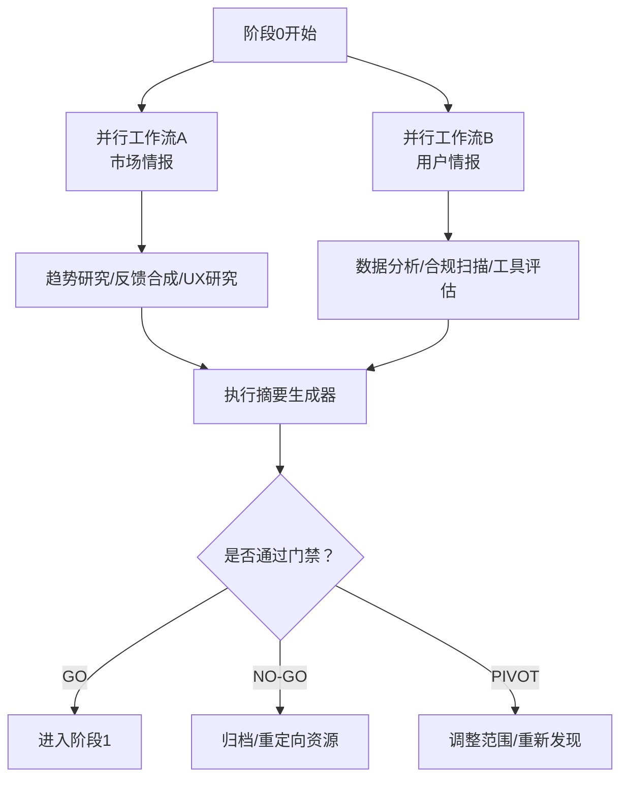
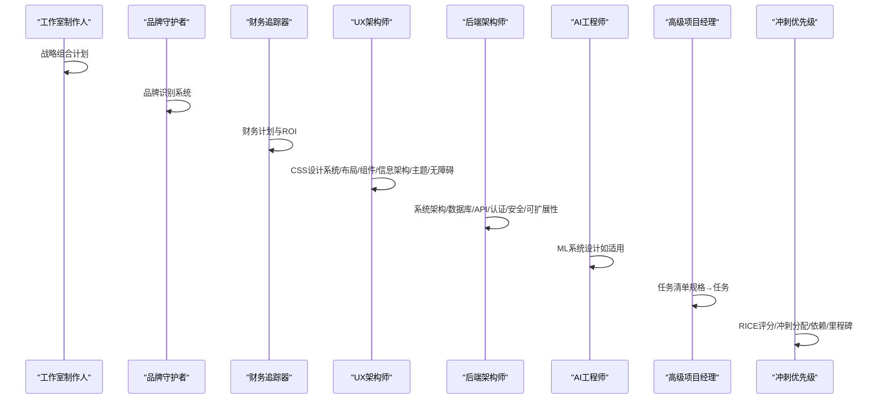
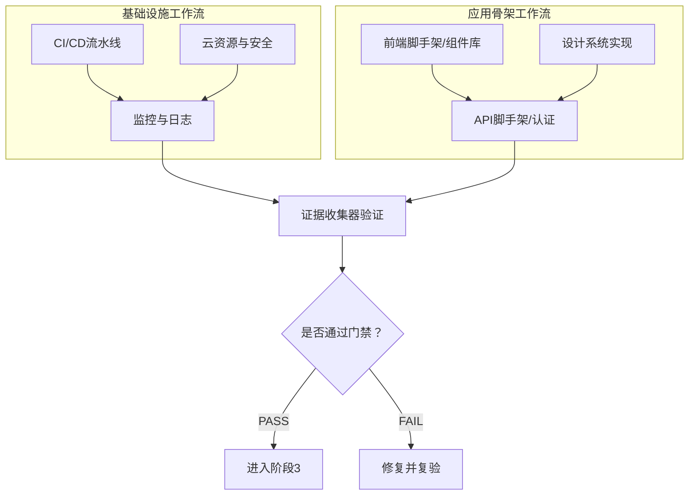
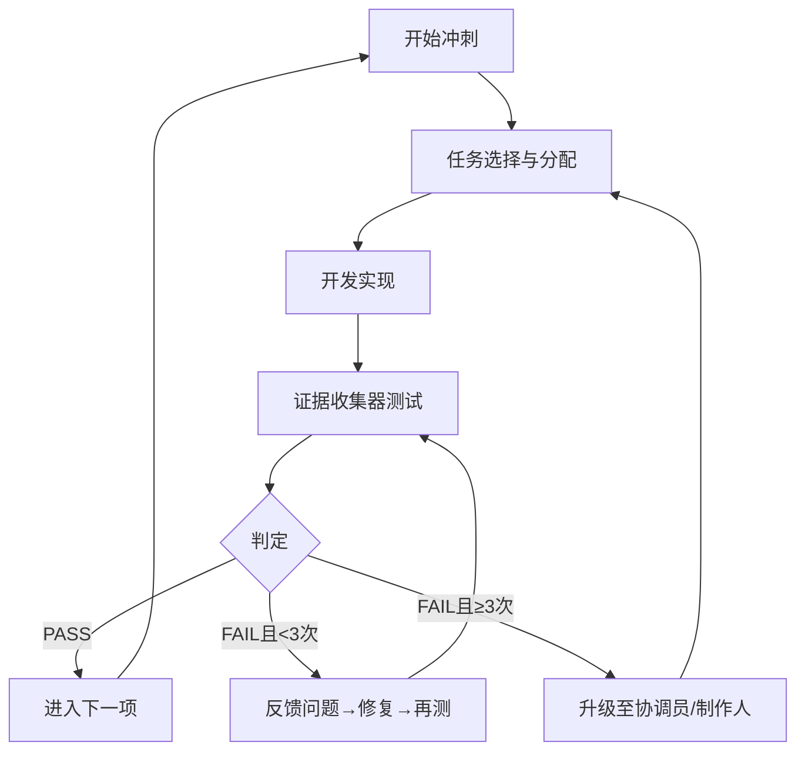
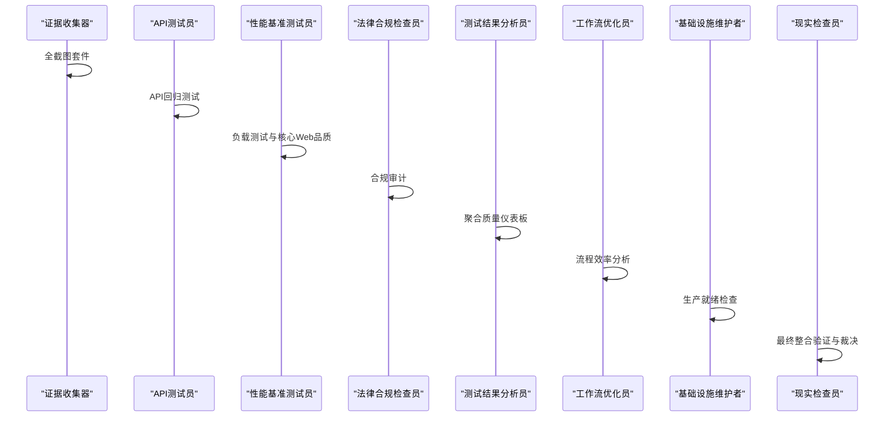
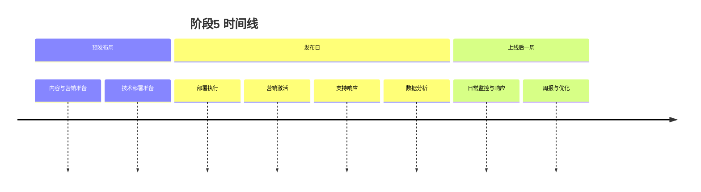
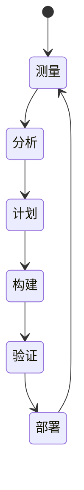
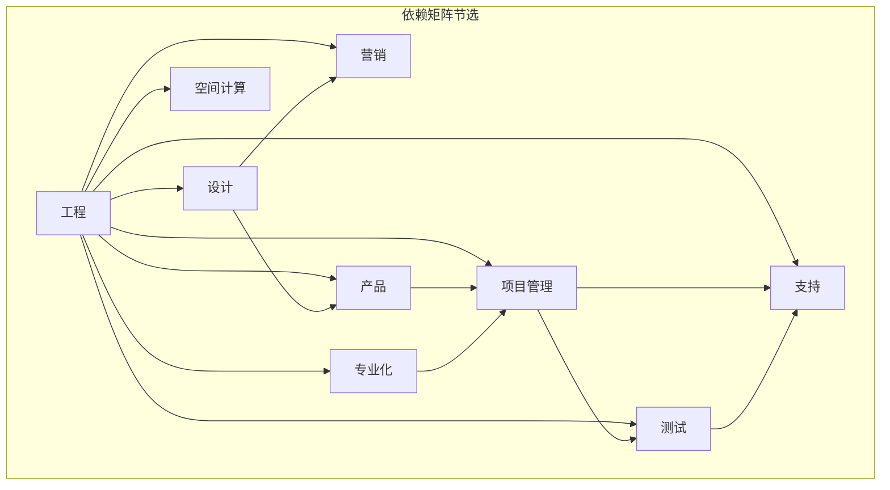
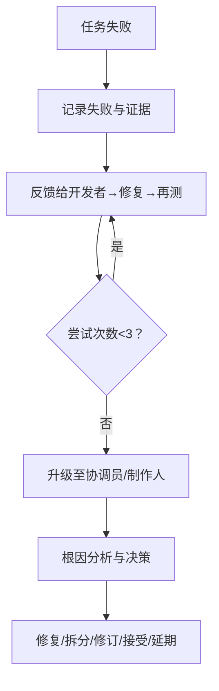

# 阶段化工作流体系

<cite>
**本文引用的文件**
- [nexus-strategy.md](file://strategy/nexus-strategy.md)
- [phase-0-discovery.md](file://strategy/playbooks/phase-0-discovery.md)
- [phase-1-strategy.md](file://strategy/playbooks/phase-1-strategy.md)
- [phase-2-foundation.md](file://strategy/playbooks/phase-2-foundation.md)
- [phase-3-build.md](file://strategy/playbooks/phase-3-build.md)
- [phase-4-hardening.md](file://strategy/playbooks/phase-4-hardening.md)
- [phase-5-launch.md](file://strategy/playbooks/phase-5-launch.md)
- [phase-6-operate.md](file://strategy/playbooks/phase-6-operate.md)
- [README.md](file://README.md)
- [examples/README.md](file://examples/README.md)
</cite>

## 目录
1. [引言](#引言)
2. [项目结构](#项目结构)
3. [核心组件](#核心组件)
4. [架构总览](#架构总览)
5. [详细组件分析](#详细组件分析)
6. [依赖关系分析](#依赖关系分析)
7. [性能考量](#性能考量)
8. [故障排查指南](#故障排查指南)
9. [结论](#结论)
10. [附录](#附录)

## 引言
本文件系统性阐述 NEXUS 的七阶段工作流体系，覆盖从“发现与情报”到“运营与演进”的完整生命周期。该体系以证据驱动的质量门禁为核心，通过跨职能并行工作流与标准化交接协议，确保每个阶段在进入下一阶段前均具备可验证的交付物与门槛条件。本文面向不同技术背景读者，既提供高层概览，也包含代码级映射与可视化图示，帮助团队高效落地。

## 项目结构
NEXUS 的策略与执行手册集中在 strategy 目录中，按阶段拆分的执行手册（Playbook）与总纲文档共同构成完整的操作框架：
- 总纲与模型：strategy/nexus-strategy.md
- 各阶段执行手册：strategy/playbooks/phase-*.md
- 示例与用例：examples/README.md
- 仓库总览与使用说明：README.md

图表来源
- [nexus-strategy.md](file://strategy/nexus-strategy.md)
- [phase-0-discovery.md](file://strategy/playbooks/phase-0-discovery.md)
- [phase-1-strategy.md](file://strategy/playbooks/phase-1-strategy.md)
- [phase-2-foundation.md](file://strategy/playbooks/phase-2-foundation.md)
- [phase-3-build.md](file://strategy/playbooks/phase-3-build.md)
- [phase-4-hardening.md](file://strategy/playbooks/phase-4-hardening.md)
- [phase-5-launch.md](file://strategy/playbooks/phase-5-launch.md)
- [phase-6-operate.md](file://strategy/playbooks/phase-6-operate.md)
- [README.md](file://README.md)
- [examples/README.md](file://examples/README.md)

章节来源
- [nexus-strategy.md](file://strategy/nexus-strategy.md)
- [README.md](file://README.md)
- [examples/README.md](file://examples/README.md)

## 核心组件
- 七阶段流水线：Discovery → Strategy → Foundation → Build → Hardening → Launch → Operate
- 质量门禁：每个阶段结束必须通过门禁，产出标准化交接包
- 并行工作流：各阶段内多条工作流并行推进，压缩整体周期
- 证据驱动：所有质量评估以可验证证据为准，避免主观判断
- 协调中枢：Agents Orchestrator 统筹任务分配、Dev↔QA 循环与升级路径

章节来源
- [nexus-strategy.md](file://strategy/nexus-strategy.md)

## 架构总览
NEXUS 将七个阶段以流水线形式组织，阶段间以质量门禁与交接包为边界，形成“证据→决策→推进”的闭环。

图表来源
- [nexus-strategy.md](file://strategy/nexus-strategy.md)
- [phase-0-discovery.md](file://strategy/playbooks/phase-0-discovery.md)
- [phase-1-strategy.md](file://strategy/playbooks/phase-1-strategy.md)
- [phase-2-foundation.md](file://strategy/playbooks/phase-2-foundation.md)
- [phase-3-build.md](file://strategy/playbooks/phase-3-build.md)
- [phase-4-hardening.md](file://strategy/playbooks/phase-4-hardening.md)
- [phase-5-launch.md](file://strategy/playbooks/phase-5-launch.md)
- [phase-6-operate.md](file://strategy/playbooks/phase-6-operate.md)

## 详细组件分析

### 阶段0：发现与情报（Discovery）
- 目标：在投入资源前验证机会，明确问题、市场与监管环境
- 关键活动：
  - 市场情报（趋势研究、竞争分析、市场规模）
  - 用户需求（反馈合成、用户体验研究）
  - 数据现状（数据审计、信号识别、基线指标）
  - 合规扫描（法规框架、数据处理约束、司法管辖区）
  - 技术评估（技术栈、构建vs购买、集成可行性）
- 交付物：六类报告与最终执行摘要（≤500字，SCQA格式）
- 质量门禁：至少满足五项标准（市场机会、用户痛点、合规路径、数据基础、技术可行），由执行摘要生成器给出 GO/NO-GO/PIVOT 决策
- 实施方法：并行启动两批工作流，第5-7天收敛输出，形成决策依据

图表来源
- [phase-0-discovery.md](file://strategy/playbooks/phase-0-discovery.md)

章节来源
- [phase-0-discovery.md](file://strategy/playbooks/phase-0-discovery.md)
- [nexus-strategy.md](file://strategy/nexus-strategy.md)

### 阶段1：策略与架构（Strategy & Architecture）
- 目标：定义要做什么、如何构建、成功标准是什么；在写一行代码前完成架构与预算
- 关键活动：
  - 战略定位（组合规划、目标与ROI、资源分配）
  - 品牌体系（品牌基础、视觉识别、声音与消息架构）
  - 技术架构（CSS设计系统、布局框架、组件架构、信息架构、主题系统、无障碍）
  - 系统架构（微服务/单体/Serverless混合、通信模式、数据模式、数据库设计、API设计、认证授权、安全架构、可扩展性）
  - 任务分解（从规格到任务清单，明确验收标准、依赖与估算）
  - 特性优先级（RICE评分、冲刺分配、依赖图、MoSCoW分类、里程碑计划）
- 交付物：战略组合计划、品牌体系、财务计划、架构包、任务清单、优先级计划
- 质量门禁：双签发（工作室制作人+现实检查员），涵盖架构覆盖度、品牌完整性、技术可行性、预算批准、计划合理性、安全与合规集成
- 实施方法：三步走（战略框架→技术架构→优先级），并行推进，顺序收尾

图表来源
- [phase-1-strategy.md](file://strategy/playbooks/phase-1-strategy.md)

章节来源
- [phase-1-strategy.md](file://strategy/playbooks/phase-1-strategy.md)
- [nexus-strategy.md](file://strategy/nexus-strategy.md)

### 阶段2：基础建设（Foundation & Scaffolding）
- 目标：搭建技术与运营基础，使后续工作可直接在此之上开展
- 关键活动：
  - 基础设施（CI/CD流水线、基础设施即代码、环境配置）
  - 监控与运维（云资源、监控堆栈、日志与告警、安全加固）
  - 工作流程（Git工作流、沟通渠道、模板与协作工具）
  - 应用骨架（前端项目脚手架、组件库、应用壳、路由与布局）
  - API骨架（数据库部署、API脚手架、认证系统、服务通信）
  - 设计系统实现（设计令牌、布局系统、主题系统）
- 交付物：可运行的应用骨架、CI/CD流水线、监控仪表盘、组件库、API健康检查、数据库就绪
- 质量门禁：双签发（DevOps自动化工作者+证据收集器），涵盖流水线、数据库、API、前端渲染、监控、设计系统、流程文档
- 实施方法：两条并行工作流（基础设施与应用骨架），第4-5天进行验证与确认

图表来源
- [phase-2-foundation.md](file://strategy/playbooks/phase-2-foundation.md)

章节来源
- [phase-2-foundation.md](file://strategy/playbooks/phase-2-foundation.md)
- [nexus-strategy.md](file://strategy/nexus-strategy.md)

### 阶段3：构建与迭代（Build & Iterate）
- 目标：通过持续的 Dev↔QA 循环实现特性，每项任务在进入下一项前均需验证
- 关键活动：
  - Dev↔QA 循环：任务分配→开发→证据收集器测试→判定→修复→再测试（最多3次）
  - 代理分配矩阵：按任务类型匹配主责开发代理、QA代理与专项支持
  - 并行构建轨道：核心产品开发、增长与营销准备、质量与运营、品牌与体验打磨
  - 冲刺管理：计划→每日执行→评审→回顾→持续改进
- 交付物：功能完备的应用、QA证据、API回归报告、性能基线、品牌一致性审计、已知问题清单
- 质量门禁：门卫为代理协调员，涵盖全部任务通过QA、API端点验证、性能达标、品牌一致、无关键缺陷、验收标准满足、代码评审完成
- 实施方法：多轨道并行，任务依赖与并行调度结合，持续跟踪与报告

图表来源
- [phase-3-build.md](file://strategy/playbooks/phase-3-build.md)

章节来源
- [phase-3-build.md](file://strategy/playbooks/phase-3-build.md)
- [nexus-strategy.md](file://strategy/nexus-strategy.md)

### 阶段4：加固与质量门（Quality & Hardening）
- 目标：最终质量门槛。现实检查员默认“需要改进”，需以压倒性证据证明生产就绪
- 关键活动：
  - 并行证据收集（全截图套件、API回归、负载测试、合规审计）
  - 分析（质量仪表板、问题分级、风险评估、流程效率审查、生产就绪检查）
  - 最终裁决（现实检查员整合证据，进行端到端用户旅程验证与规范符合性核对）
- 交付物：现实检查报告、性能认证、合规认证、基础设施就绪报告、已知限制（如有）
- 质量门禁：单一权威（现实检查员），涵盖端到端用户旅程、跨设备一致性、性能认证、安全验证、合规认证、规范符合、基础设施就绪
- 实施方法：三步走（证据收集→分析→最终裁决），裁决结果为 READY/NEEDS WORK/NOT READY

图表来源
- [phase-4-hardening.md](file://strategy/playbooks/phase-4-hardening.md)

章节来源
- [phase-4-hardening.md](file://strategy/playbooks/phase-4-hardening.md)
- [nexus-strategy.md](file://strategy/nexus-strategy.md)

### 阶段5：发布与增长（Launch & Growth）
- 目标：同时协调全渠道上线执行，最大化发布影响力
- 关键活动：
  - 预发布周：内容与营销准备、技术部署准备（蓝绿部署、回滚预案、特征开关、容量规划）
  - 发布日：部署执行、实时监控、营销激活、支持响应、数据分析
  - 上线后一周：每日指标、反馈汇总、热修复、A/B测试、周报与优化
- 交付物：部署成功、系统稳定、用户获取通道活跃、反馈闭环、支持运作、增长指标跟踪
- 质量门禁：双签发（工作室制作人+数据分析员），涵盖零停机部署、48小时无P0/P1、用户获取通道活跃、反馈闭环、干系人知情、支持运作
- 实施方法：严格的时间表与检查清单，跨职能团队协同，实时监控与快速响应

图表来源
- [phase-5-launch.md](file://strategy/playbooks/phase-5-launch.md)

章节来源
- [phase-5-launch.md](file://strategy/playbooks/phase-5-launch.md)
- [nexus-strategy.md](file://strategy/nexus-strategy.md)

### 阶段6：运营与演进（Operate & Evolve）
- 目标：产品上线后的持续运营与持续改进，没有终点的演进周期
- 关键活动：
  - 运营节奏：连续（99.9%可用性、<30分钟MTTR）、每日（指标更新、问题处置、健康检查）、每周（分析与规划）、双周（深度洞察）、每月（执行摘要、财务、合规、市场情报、品牌健康）、季度（战略回顾、流程优化、性能回归、技术债评估）
  - 连续改进循环：测量→分析→计划→构建→验证→部署→测量
  - 事件响应：分级（P0-P3）、响应序列、复盘与改进
  - 成长运营：月度增长回顾、内容运营、财务与合规运营
- 交付物：持续的运营报告、增长实验结果、过程改进、合规状态、市场情报、财务表现
- 质量门禁：无固定门禁，以持续指标达标与流程改进为衡量
- 实施方法：建立自动化与半自动化流程，定期回顾与迭代

图表来源
- [phase-6-operate.md](file://strategy/playbooks/phase-6-operate.md)

章节来源
- [phase-6-operate.md](file://strategy/playbooks/phase-6-operate.md)
- [nexus-strategy.md](file://strategy/nexus-strategy.md)

## 依赖关系分析
- 代理间依赖：跨部门依赖矩阵显示工程、设计、营销、产品、项目管理、测试、支持、空间计算、专业化等九个部门之间的产出消费关系
- 关键交接对：从高级项目经理到所有开发者（任务清单）、从UX架构师到前端开发者（设计系统）、从后端架构师到前端开发者（API规范）、从前端开发者到证据收集器（实现成果）、从证据收集器到代理协调员（QA判定）、从代理协调员到任意开发者（反馈与重试）、从品牌守护者到所有设计与营销（品牌指南）、从数据分析员到冲刺优先级（性能数据）、从反馈合成器到冲刺优先级（用户洞察）、从趋势研究员到工作室制作人（市场情报）、从现实检查员到代理协调员（集成裁决）、从执行摘要生成器到工作室制作人（执行简报）

图表来源
- [nexus-strategy.md](file://strategy/nexus-strategy.md)

章节来源
- [nexus-strategy.md](file://strategy/nexus-strategy.md)

## 性能考量
- 质量门禁阈值：阶段间门禁以明确阈值与证据要求为依据，避免主观判断导致返工
- Dev↔QA 循环：最大3次重试机制，超过则升级，减少无效重复劳动
- 并行工作流：阶段内多条工作流并行推进，缩短整体周期
- 指标导向：关键指标（API响应时间、页面加载时间、系统可用性、安全漏洞、规范符合率、部署频率、平均修复时间、合规遵循率、NPS、支持响应时长、LTV:CAC、组合投资回报率）用于衡量与指导改进

章节来源
- [phase-3-build.md](file://strategy/playbooks/phase-3-build.md)
- [phase-4-hardening.md](file://strategy/playbooks/phase-4-hardening.md)
- [phase-5-launch.md](file://strategy/playbooks/phase-5-launch.md)
- [phase-6-operate.md](file://strategy/playbooks/phase-6-operate.md)
- [nexus-strategy.md](file://strategy/nexus-strategy.md)

## 故障排查指南
- 门禁失败处理：门卫出具具体失败报告，代理协调员将失败项纳入Dev↔QA循环，最多3次重试后升级至工作室制作人决定（修复、降级或接受风险）
- QA反馈协议：针对每次失败，提供具体问题描述、证据来源、修复指令与需修改文件清单
- 升级路径：当任务超过3次重试仍失败，提交升级报告，包含失败历史、根因分析与建议解决方案（重分配、拆分、修订架构、接受限制、延期）

图表来源
- [phase-3-build.md](file://strategy/playbooks/phase-3-build.md)
- [phase-4-hardening.md](file://strategy/playbooks/phase-4-hardening.md)
- [nexus-strategy.md](file://strategy/nexus-strategy.md)

章节来源
- [phase-3-build.md](file://strategy/playbooks/phase-3-build.md)
- [phase-4-hardening.md](file://strategy/playbooks/phase-4-hardening.md)
- [nexus-strategy.md](file://strategy/nexus-strategy.md)

## 结论
NEXUS 的七阶段工作流体系通过“证据驱动的质量门禁+并行工作流+标准化交接协议”，将复杂的跨职能项目管理转化为可预测、可度量、可改进的流水线。它不仅适用于大型企业级产品，也可按需缩放至 Sprint 或 Micro 级别，确保从发现到运营的每个环节都有明确目标、可验证交付物与清晰的前进方向。

## 附录
- 快速启动：根据项目规模选择 NEXUS-Full（完整）、NEXUS-Sprint（特性/MVP）、NEXUS-Micro（单任务）三种部署模式
- 代理角色速查：按工程、设计、营销、产品、项目管理、测试、支持、空间计算、专业化九个部门列出代理职责与触发条件
- 状态报告模板：包含项目元数据、阶段进度、当前阶段详情、质量指标、风险登记册与下一步行动

章节来源
- [nexus-strategy.md](file://strategy/nexus-strategy.md)
- [README.md](file://README.md)
- [examples/README.md](file://examples/README.md)