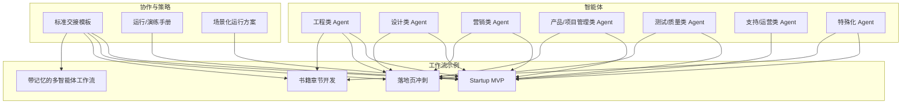
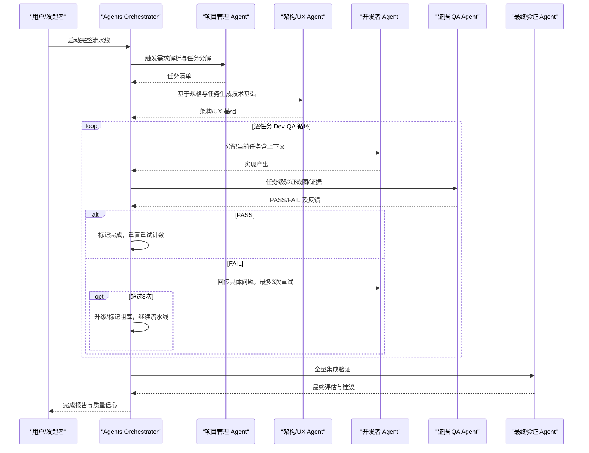
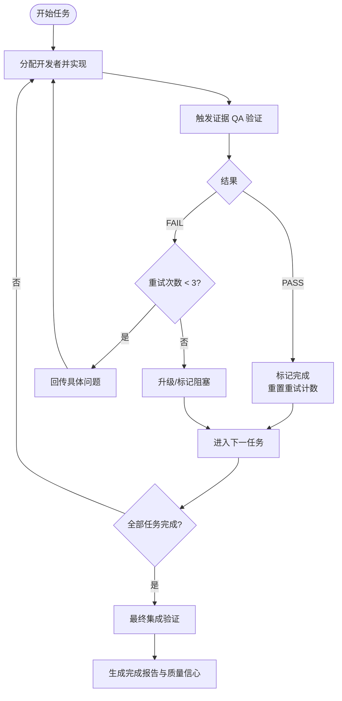
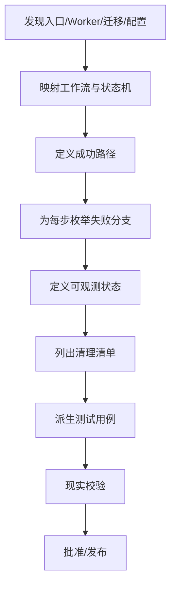
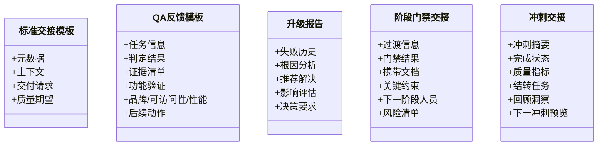
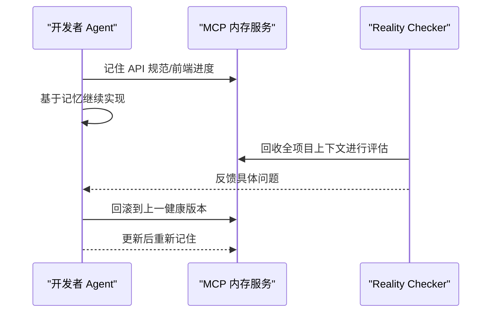
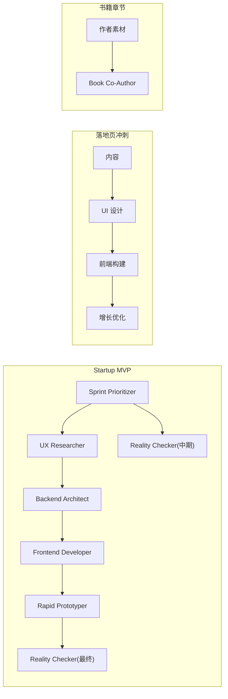
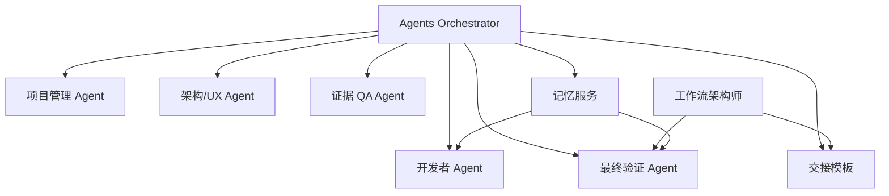

# 管道管理

<cite>
**本文引用的文件**
- [README.md](file://README.md)
- [agents-orchestrator.md](file://specialized/agents-orchestrator.md)
- [specialized-workflow-architect.md](file://specialized/specialized-workflow-architect.md)
- [workflow-with-memory.md](file://examples/workflow-with-memory.md)
- [workflow-startup-mvp.md](file://examples/workflow-startup-mvp.md)
- [handoff-templates.md](file://strategy/coordination/handoff-templates.md)
- [workflow-book-chapter.md](file://examples/workflow-book-chapter.md)
- [workflow-landing-page.md](file://examples/workflow-landing-page.md)
</cite>

## 目录
1. [简介](#简介)
2. [项目结构](#项目结构)
3. [核心组件](#核心组件)
4. [架构总览](#架构总览)
5. [详细组件分析](#详细组件分析)
6. [依赖关系分析](#依赖关系分析)
7. [性能考量](#性能考量)
8. [故障排查指南](#故障排查指南)
9. [结论](#结论)
10. [附录](#附录)

## 简介
本文件围绕“工作流编排的管道管理”主题，系统化梳理该仓库中的多智能体协同、任务状态与进度追踪、上下文保存与交接、错误恢复与文档记录、智能重试与学习机制、完成预测与质量信心评估，以及管道优化与监控最佳实践。目标是帮助读者在不深入源码的前提下，掌握如何以标准化流程与工具实现高质量、可重复、可观测的多阶段交付流水线。

## 项目结构
该仓库以“智能体（Agent）+ 工作流（Workflow）+ 协作模板（Handoff）+ 策略（Strategy）”为核心组织方式：
- 智能体：按职能划分的 144+ 个专用 Agent，覆盖工程、设计、营销、产品、测试、支持等 12 个部门
- 工作流：示例工作流展示了从需求到交付的典型路径，如 Startup MVP、落地页冲刺、书籍章节开发
- 协作模板：标准化的交接文档模板，确保上下文完整传递、证据可追溯、决策可审计
- 策略：包含协调与运行手册、演练手册、场景化运行方案等

**图表来源**
- [README.md: 68-283:68-283](file://README.md#L68-L283)
- [workflow-startup-mvp.md: 1-156:1-156](file://examples/workflow-startup-mvp.md#L1-L156)
- [workflow-landing-page.md: 1-120:1-120](file://examples/workflow-landing-page.md#L1-L120)
- [workflow-book-chapter.md: 1-56:1-56](file://examples/workflow-book-chapter.md#L1-L56)
- [workflow-with-memory.md: 1-239:1-239](file://examples/workflow-with-memory.md#L1-L239)
- [handoff-templates.md: 1-358:1-358](file://strategy/coordination/handoff-templates.md#L1-L358)

**章节来源**
- [README.md: 68-283:68-283](file://README.md#L68-L283)

## 核心组件
- 管理者（Agents Orchestrator）
  - 全流程编排者，负责阶段推进、质量门禁、错误恢复、状态追踪与报告
  - 关键职责：任务级 QA 循环、最大重试次数控制、失败升级、进度可视化
- 工作流架构师（Workflow Architect）
  - 在实现前穷举所有分支与失败路径，定义显式契约与可观测状态
  - 关键职责：工作流树规范、清理清单、测试用例派生、现实校验
- 协作模板（Handoff Templates）
  - 标准化交接文档，确保上下文、证据、验收标准、后续动作清晰可追溯
- 记忆集成（Memory Integration）
  - 借助 MCP 内存服务，实现跨会话的状态持久化、自动召回与回滚修复
- 示例工作流（Examples）
  - 展示从需求到交付的端到端路径，包含并行与串行组合、里程碑质量门禁

**章节来源**
- [agents-orchestrator.md: 11-367:11-367](file://specialized/agents-orchestrator.md#L11-L367)
- [specialized-workflow-architect.md: 9-598:9-598](file://specialized/specialized-workflow-architect.md#L9-L598)
- [handoff-templates.md: 1-358:1-358](file://strategy/coordination/handoff-templates.md#L1-L358)
- [workflow-with-memory.md: 1-239:1-239](file://examples/workflow-with-memory.md#L1-L239)
- [workflow-startup-mvp.md: 1-156:1-156](file://examples/workflow-startup-mvp.md#L1-L156)

## 架构总览
下图展示了“管道管理”的整体交互：由 Orchestrator 驱动，串联 PM/ArchitectUX/开发者/QA/最终验证；通过标准化交接模板与记忆服务保障上下文与证据可追溯；借助工作流架构师的规范约束每个步骤的输入、输出、超时、可观测状态与回退清理。

**图表来源**
- [agents-orchestrator.md: 53-168:53-168](file://specialized/agents-orchestrator.md#L53-L168)
- [handoff-templates.md: 49-144:49-144](file://strategy/coordination/handoff-templates.md#L49-L144)
- [workflow-with-memory.md: 39-239:39-239](file://examples/workflow-with-memory.md#L39-L239)

## 详细组件分析

### 组件A：Agents Orchestrator（管道管理者）
- 状态管理与进度追踪
  - 维护当前阶段、任务总数、已完成数量、当前任务与 QA 状态
  - 记录 Dev-QA 循环尝试次数与上次反馈
- 上下文保存与交接
  - 严格要求“完整上下文”传递，避免复制粘贴遗漏
  - 使用标准化交接模板，明确交付物、验收标准、证据类型
- 错误恢复与升级
  - 任务级最大重试 3 次；超过阈值标记阻塞并继续流水线
  - 代理启动失败最多重试 2 次；持续失败则记录并走手动回退
- 文档记录与报告
  - 提供“状态报告”与“完成总结”模板，包含质量指标与下一步建议
- 智能重试与学习
  - 基于 QA 反馈调整指令，识别复杂度与瓶颈，必要时提前升级
- 完成预测与质量信心
  - 依据首轮通过率、平均重试次数、证据生成量等指标，给出质量信心等级

**图表来源**
- [agents-orchestrator.md: 110-168:110-168](file://specialized/agents-orchestrator.md#L110-L168)

**章节来源**
- [agents-orchestrator.md: 11-367:11-367](file://specialized/agents-orchestrator.md#L11-L367)
- [handoff-templates.md: 49-144:49-144](file://strategy/coordination/handoff-templates.md#L49-L144)

### 组件B：Workflow Architect（工作流架构师）
- 工作流树规范
  - 明确每个步骤的执行者、动作、输入/输出、超时、可观测状态
  - 对每一步定义成功/失败分支与恢复路径
- 手工交接契约
  - 显式定义系统边界的数据载荷、成功/失败响应、超时与失败后的恢复动作
- 清理清单与回退
  - 列出工作流创建的所有资源，确保失败时按逆序销毁，避免孤儿资源
- 测试用例派生
  - 每个分支对应一个测试用例，保证自动化覆盖
- 现实校验
  - 与实际代码对照，发现偏差并更新规范

**图表来源**
- [specialized-workflow-architect.md: 438-507:438-507](file://specialized/specialized-workflow-architect.md#L438-L507)

**章节来源**
- [specialized-workflow-architect.md: 9-598:9-598](file://specialized/specialized-workflow-architect.md#L9-L598)

### 组件C：协作模板（Handoff Templates）
- 标准交接模板
  - 元数据、上下文、交付请求、质量期望
- QA 反馈模板（通过/不通过）
  - 证据清单（截图）、功能验证、品牌一致性、可访问性、性能
  - 不通过时提供具体问题、预期/实际对比、修复指令与文件定位
- 升级报告
  - 失败历史、根因分析、推荐解决路径、影响评估与决策点
- 阶段门禁交接
  - 门禁条件、携带文档、关键约束、下一阶段激活人员与风险清单
- 冲刺交接
  - 冲刺摘要、完成状态、质量指标、结转任务与回顾洞察

**图表来源**
- [handoff-templates.md: 7-295:7-295](file://strategy/coordination/handoff-templates.md#L7-L295)

**章节来源**
- [handoff-templates.md: 1-358:1-358](file://strategy/coordination/handoff-templates.md#L1-L358)

### 组件D：记忆集成（Memory Integration）
- 自动上下文召回
  - 代理通过标签检索项目上下文，无需手工拼接
- 证据与版本管理
  - 每份产出按项目与接收方标签存储，便于回溯与回滚
- 失败回滚
  - 当 QA 不通过时，代理可回滚到上一健康状态并针对性修复

**图表来源**
- [workflow-with-memory.md: 39-239:39-239](file://examples/workflow-with-memory.md#L39-L239)

**章节来源**
- [workflow-with-memory.md: 1-239:1-239](file://examples/workflow-with-memory.md#L1-L239)

### 组件E：示例工作流（Startup MVP / 落地页冲刺 / 书籍章节）
- Startup MVP
  - 并行探索（Sprint Prioritizer + UX Researcher），串行构建（Backend Architect → Frontend Developer → Rapid Prototyper），里程碑质量门禁（Reality Checker）
- 落地页冲刺
  - 并行创作与设计，合并点构建，增长优化反馈循环
- 书籍章节
  - 单智能体版本化草稿与编辑决策暴露，强调“明确修订请求而非模糊交接”

**图表来源**
- [workflow-startup-mvp.md: 21-156:21-156](file://examples/workflow-startup-mvp.md#L21-L156)
- [workflow-landing-page.md: 18-120:18-120](file://examples/workflow-landing-page.md#L18-L120)
- [workflow-book-chapter.md: 15-56:15-56](file://examples/workflow-book-chapter.md#L15-L56)

**章节来源**
- [workflow-startup-mvp.md: 1-156:1-156](file://examples/workflow-startup-mvp.md#L1-L156)
- [workflow-landing-page.md: 1-120:1-120](file://examples/workflow-landing-page.md#L1-L120)
- [workflow-book-chapter.md: 1-56:1-56](file://examples/workflow-book-chapter.md#L1-L56)

## 依赖关系分析
- 管理者对各职能 Agent 的依赖：PM/ArchitectUX/开发者/QA/最终验证
- 协作模板对所有阶段的通用依赖：交接、证据、验收、升级
- 工作流架构师对现实校验与测试用例的依赖：确保规范与实现一致
- 记忆服务对上下文与证据的依赖：提升可追溯性与回滚能力

**图表来源**
- [agents-orchestrator.md: 295-360:295-360](file://specialized/agents-orchestrator.md#L295-L360)
- [handoff-templates.md: 1-358:1-358](file://strategy/coordination/handoff-templates.md#L1-L358)
- [workflow-with-memory.md: 39-239:39-239](file://examples/workflow-with-memory.md#L39-L239)

**章节来源**
- [agents-orchestrator.md: 295-360:295-360](file://specialized/agents-orchestrator.md#L295-L360)
- [handoff-templates.md: 1-358:1-358](file://strategy/coordination/handoff-templates.md#L1-L358)
- [workflow-with-memory.md: 39-239:39-239](file://examples/workflow-with-memory.md#L39-L239)

## 性能考量
- 并行与串行的平衡
  - 在不破坏依赖顺序的前提下最大化并行度（如 Sprint Prioritizer 与 UX Researcher 并行）
- 质量门禁前置
  - 将 QA 置于关键路径，尽早暴露问题，降低后期返工成本
- 证据驱动的快速决策
  - 截图与自动化验证减少主观判断与反复沟通
- 记忆服务的引入
  - 减少手工上下文传递与版本管理开销，提升跨会话连续性

[本节为通用指导，无需特定文件来源]

## 故障排查指南
- 任务级失败
  - 使用 QA 不通过模板收集证据与问题清单，限定修复范围，避免引入新变更
  - 重试不超过 3 次；超过阈值进入升级流程
- 代理启动失败
  - 最多重试 2 次；持续失败记录并走手动回退
- 上下文丢失
  - 强制使用标准化交接模板；若启用记忆服务，确保标签与召回规则正确
- 最终验证不通过
  - 回到上游 QA 步骤，定位根因；必要时回滚到上一健康版本

**章节来源**
- [agents-orchestrator.md: 149-168:149-168](file://specialized/agents-orchestrator.md#L149-L168)
- [handoff-templates.md: 92-203:92-203](file://strategy/coordination/handoff-templates.md#L92-L203)
- [workflow-with-memory.md: 201-215:201-215](file://examples/workflow-with-memory.md#L201-L215)

## 结论
通过“工作流架构师”的穷举式规范、标准化交接模板的上下文与证据保障、记忆服务的可追溯性与回滚能力，以及 Agents Orchestrator 的任务级 QA 循环与智能重试/升级策略，可以构建高可靠、可预测、可优化的多智能体管道。结合质量指标与完成预测，能够持续改进交付效率与质量信心。

[本节为总结，无需特定文件来源]

## 附录
- 最佳实践清单
  - 在实现前先做工作流树规范，覆盖所有分支与失败路径
  - 使用标准化交接模板，强制证据与验收标准
  - 引入记忆服务，实现跨会话状态持久化与自动召回
  - 将 QA 前置，建立任务级重试与升级机制
  - 基于早期表现计算质量信心，动态调整资源与优先级
- 监控与报告
  - 持续记录首过通过率、平均重试次数、证据生成量、关键问题分布
  - 定期回顾升级报告，沉淀瓶颈与改进项

[本节为通用指导，无需特定文件来源]