# 质量保证循环

<cite>
**本文引用的文件**
- [testing-evidence-collector.md](file://testing/testing-evidence-collector.md)
- [testing-reality-checker.md](file://testing/testing-reality-checker.md)
- [testing-api-tester.md](file://testing/testing-api-tester.md)
- [testing-performance-benchmarker.md](file://testing/testing-performance-benchmarker.md)
- [testing-test-results-analyzer.md](file://testing/testing-test-results-analyzer.md)
- [testing-workflow-optimizer.md](file://testing/testing-workflow-optimizer.md)
- [testing-accessibility-auditor.md](file://testing/testing-accessibility-auditor.md)
- [testing-tool-evaluator.md](file://testing/testing-tool-evaluator.md)
- [nexus-strategy.md](file://strategy/nexus-strategy.md)
- [phase-4-hardening.md](file://strategy/playbooks/phase-4-hardening.md)
- [QUICKSTART.md](file://strategy/QUICKSTART.md)
- [README.md](file://README.md)
- [lint-agents.sh](file://scripts/lint-agents.sh)
</cite>

## 目录
1. [简介](#简介)
2. [项目结构](#项目结构)
3. [核心组件](#核心组件)
4. [架构总览](#架构总览)
5. [详细组件分析](#详细组件分析)
6. [依赖关系分析](#依赖关系分析)
7. [性能考量](#性能考量)
8. [故障排除指南](#故障排除指南)
9. [结论](#结论)
10. [附录](#附录)

## 简介
本文件系统化阐述工作流编排中的质量保证循环（QA Loop），围绕证据收集器、现实检查器、API 测试器、性能基准测试器等质量代理，解释其功能职责、协作机制与质量门禁设计；并给出任务级质量门禁的证据要求、验证标准与反馈机制，持续 QA 循环的自动重试逻辑、失败处理与质量趋势分析方法，以及关键质量度量指标与最佳实践。

## 项目结构
质量保证循环由“测试执行—结果聚合—过程优化—最终判定”四个阶段构成，并通过“证据优先”的原则贯穿全流程。测试阶段包含多类质量代理并行执行，随后由分析与优化代理进行数据整合与流程改进，最终由现实检查器进行集成级质量判定与发布决策。

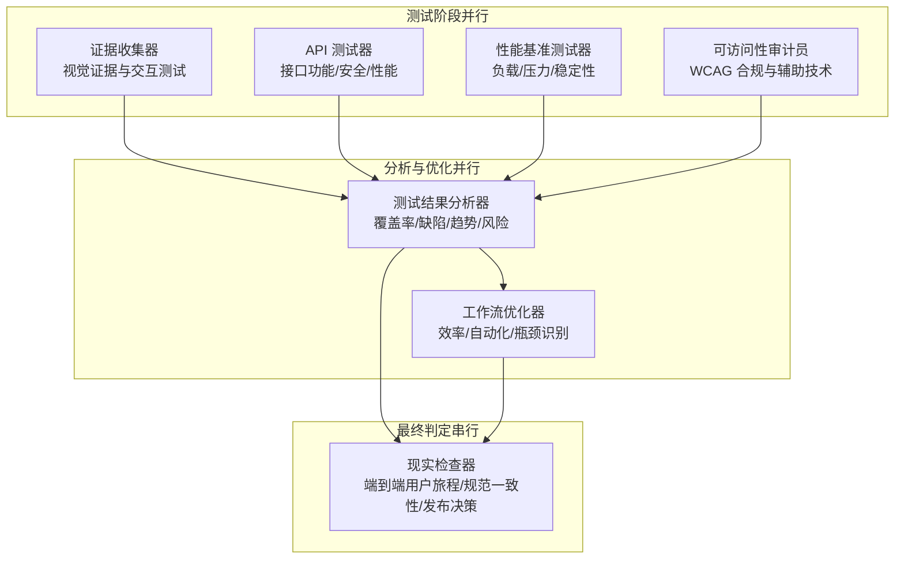

图示来源
- [nexus-strategy.md:395-429](file://strategy/nexus-strategy.md#L395-L429)
- [phase-4-hardening.md:141-185](file://strategy/playbooks/phase-4-hardening.md#L141-L185)

章节来源
- [nexus-strategy.md:291-314](file://strategy/nexus-strategy.md#L291-L314)
- [phase-4-hardening.md:141-185](file://strategy/playbooks/phase-4-hardening.md#L141-L185)
- [README.md:208-222](file://README.md#L208-L222)

## 核心组件
- 证据收集器：负责截图驱动的视觉验证、交互元素测试与规范比对，形成最小问题数的客观报告。
- 现实检查器：作为最终质量权威，对所有测试证据进行交叉验证，进行端到端用户旅程验证与规范一致性审查，决定是否批准进入生产。
- API 测试器：覆盖功能、性能与安全的全栈 API 验证，确保第三方与内部服务的可靠性与 SLA 达成。
- 性能基准测试器：执行负载、压力、耐久与扩展性测试，建立性能基线并输出优化建议。
- 测试结果分析器：对测试覆盖率、缺陷密度、趋势与风险进行统计分析，提供释放决策依据与业务影响评估。
- 工作流优化器：从流程效率角度审视 Dev↔QA 循环，识别瓶颈与自动化机会，提出可落地的改进方案。
- 可访问性审计员：基于 WCAG 标准，结合辅助技术实测，发现自动化工具难以覆盖的可访问性问题。
- 工具评估器：对测试与质量相关工具进行综合评估，提供成本、集成与 ROI 分析，支撑工具选型与治理。

章节来源
- [testing-evidence-collector.md:1-211](file://testing/testing-evidence-collector.md#L1-L211)
- [testing-reality-checker.md:1-237](file://testing/testing-reality-checker.md#L1-L237)
- [testing-api-tester.md:1-306](file://testing/testing-api-tester.md#L1-L306)
- [testing-performance-benchmarker.md:1-268](file://testing/testing-performance-benchmarker.md#L1-L268)
- [testing-test-results-analyzer.md:1-305](file://testing/testing-test-results-analyzer.md#L1-L305)
- [testing-workflow-optimizer.md:1-450](file://testing/testing-workflow-optimizer.md#L1-L450)
- [testing-accessibility-auditor.md:1-317](file://testing/testing-accessibility-auditor.md#L1-L317)
- [testing-tool-evaluator.md:1-394](file://testing/testing-tool-evaluator.md#L1-L394)

## 架构总览
Dev↔QA 循环是 NEXUS 的核心质量引擎，每个任务先实现再测试，通过证据驱动的 PASS/FAIL 决策推进，失败最多重试三次，阻塞时进入升级流程。硬化工序分为三步：证据收集（并行）、分析（并行）、最终判定（串行），最终由现实检查器进行质量门禁。

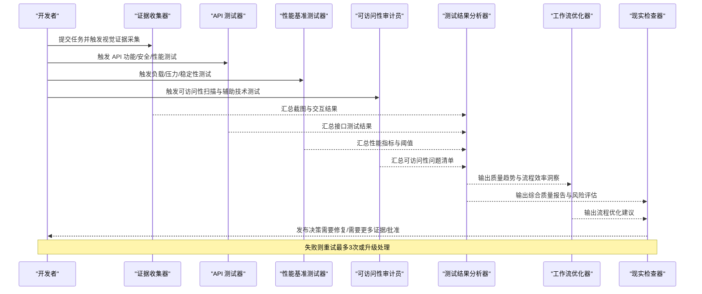

图示来源
- [nexus-strategy.md:291-314](file://strategy/nexus-strategy.md#L291-L314)
- [nexus-strategy.md:395-429](file://strategy/nexus-strategy.md#L395-L429)
- [phase-4-hardening.md:141-185](file://strategy/playbooks/phase-4-hardening.md#L141-L185)

章节来源
- [nexus-strategy.md:291-314](file://strategy/nexus-strategy.md#L291-L314)
- [nexus-strategy.md:395-429](file://strategy/nexus-strategy.md#L395-L429)
- [phase-4-hardening.md:141-185](file://strategy/playbooks/phase-4-hardening.md#L141-L185)
- [QUICKSTART.md:144-154](file://strategy/QUICKSTART.md#L144-L154)

## 详细组件分析

### 证据收集器（视觉与交互验证）
- 职责：使用截图与自动化工具进行端到端验证，对比规格与实现，记录交互元素（手风琴、表单、导航、移动端、主题切换）的运行状态。
- 关键流程：先执行现实检查命令（列出构建产物、特征关键词、截图采集与结果汇总），再进行可视化分析与交互测试，最后输出最小问题数的报告模板。
- 自动化证据：截图序列、test-results.json 数据、设备兼容性与暗色模式覆盖。
- 失败触发：零问题报告、完美分数、无证据支持的“奢华”声明、未完成的端到端交互。

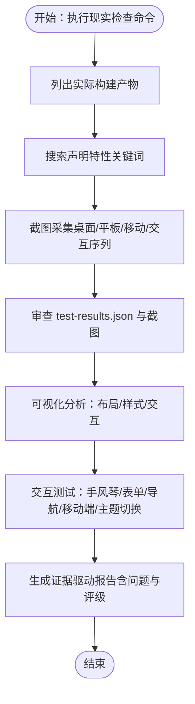

图示来源
- [testing-evidence-collector.md:41-118](file://testing/testing-evidence-collector.md#L41-L118)
- [testing-evidence-collector.md:119-174](file://testing/testing-evidence-collector.md#L119-L174)

章节来源
- [testing-evidence-collector.md:1-211](file://testing/testing-evidence-collector.md#L1-L211)

### 现实检查器（最终质量权威）
- 职责：作为唯一质量门，对证据收集器与自动化测试结果进行交叉验证，验证端到端用户旅程与规范一致性，决定是否批准进入生产。
- 关键流程：验证构建产物与特征声明、截图采集与证据复核、跨设备一致性与性能验证、规范比对与合规性检查。
- 判定标准：默认“需要改进”，仅在具备压倒性证据时才判定“准备就绪”。

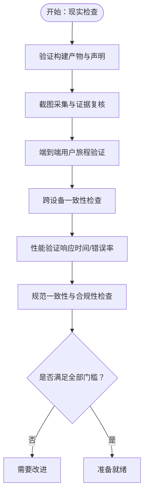

图示来源
- [testing-reality-checker.md:41-141](file://testing/testing-reality-checker.md#L41-L141)
- [testing-reality-checker.md:142-202](file://testing/testing-reality-checker.md#L142-L202)

章节来源
- [testing-reality-checker.md:1-237](file://testing/testing-reality-checker.md#L1-L237)

### API 测试器（接口质量保障）
- 职责：全面的 API 功能、性能与安全测试，覆盖认证授权、输入校验、SQL 注入防护、速率限制与 SLA 达成。
- 关键流程：API 发现与分析、测试策略制定、测试实施与自动化、监控与持续改进。
- 报告模板：测试覆盖度、性能测试结果、安全评估、问题与建议。

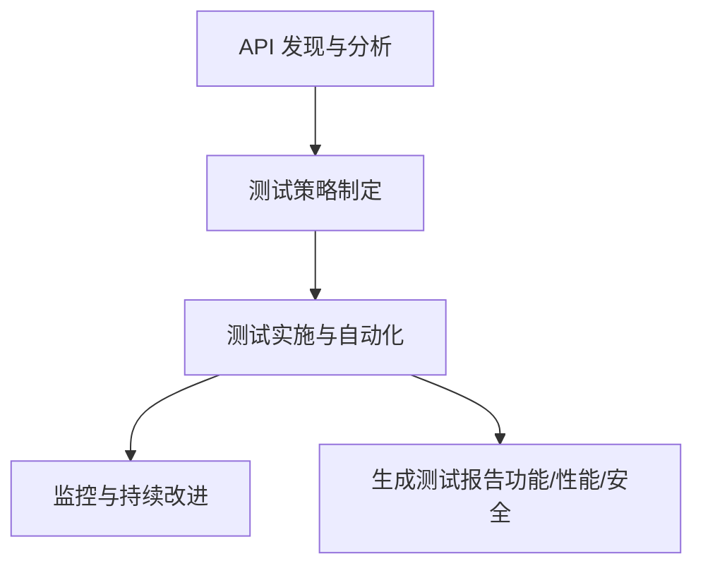

图示来源
- [testing-api-tester.md:199-222](file://testing/testing-api-tester.md#L199-L222)
- [testing-api-tester.md:223-257](file://testing/testing-api-tester.md#L223-L257)

章节来源
- [testing-api-tester.md:1-306](file://testing/testing-api-tester.md#L1-L306)

### 性能基准测试器（性能工程）
- 职责：负载、压力、耐久与扩展性测试，建立性能基线，输出瓶颈分析与优化建议。
- 关键流程：性能基线与需求设定、测试策略设计、性能分析与优化、监控与持续改进。
- 报告模板：负载测试、压力测试、可扩展性测试、端到端性能、瓶颈分析与 ROI。

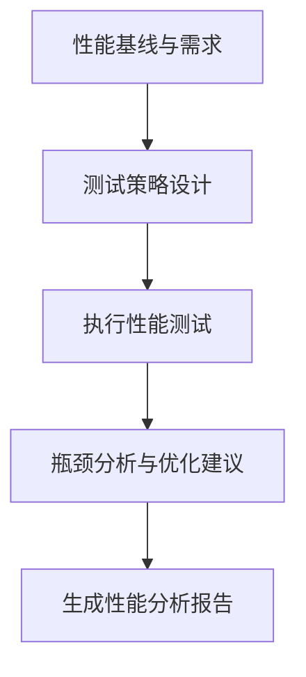

图示来源
- [testing-performance-benchmarker.md:153-178](file://testing/testing-performance-benchmarker.md#L153-L178)
- [testing-performance-benchmarker.md:179-219](file://testing/testing-performance-benchmarker.md#L179-L219)

章节来源
- [testing-performance-benchmarker.md:1-268](file://testing/testing-performance-benchmarker.md#L1-L268)

### 测试结果分析器（质量度量与风险）
- 职责：对测试覆盖率、缺陷密度、趋势与风险进行统计分析，提供释放决策依据与业务影响评估。
- 关键流程：数据收集与验证、统计分析与模式识别、风险评估与预测建模、报告与持续改进。
- 成功指标：高质量预测准确率、建议采纳率、缺陷逃逸预防提升、及时交付与干系人满意度。

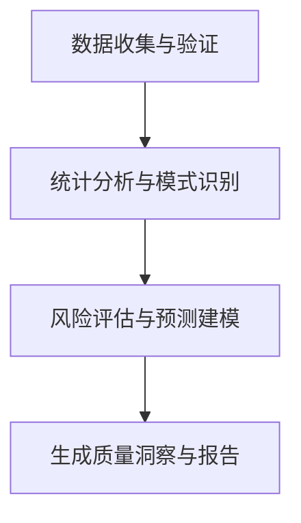

图示来源
- [testing-test-results-analyzer.md:190-215](file://testing/testing-test-results-analyzer.md#L190-L215)
- [testing-test-results-analyzer.md:216-256](file://testing/testing-test-results-analyzer.md#L216-L256)

章节来源
- [testing-test-results-analyzer.md:1-305](file://testing/testing-test-results-analyzer.md#L1-L305)

### 工作流优化器（流程效率与自动化）
- 职责：分析 Dev↔QA 循环效率，识别瓶颈与自动化机会，提出可落地的流程优化与自动化方案。
- 关键流程：现状分析与文档化、优化设计与未来状态规划、实施计划与变更管理、自动化实施与监控。
- 成功指标：流程效率提升、常规任务自动化比例、流程相关错误与返工减少、成功采纳率与员工满意度提升。

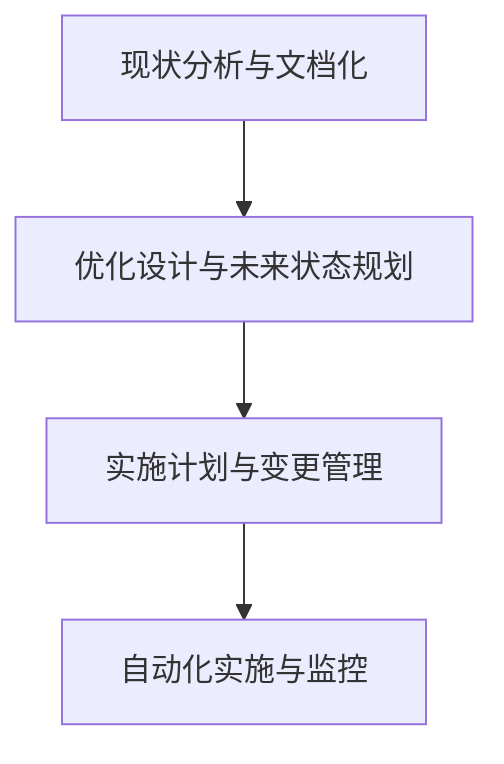

图示来源
- [testing-workflow-optimizer.md:335-360](file://testing/testing-workflow-optimizer.md#L335-L360)
- [testing-workflow-optimizer.md:361-401](file://testing/testing-workflow-optimizer.md#L361-L401)

章节来源
- [testing-workflow-optimizer.md:1-450](file://testing/testing-workflow-optimizer.md#L1-L450)

### 可访问性审计员（WCAG 合规与辅助技术）
- 职责：基于 WCAG 2.2 AA 标准，结合屏幕阅读器、键盘导航等辅助技术实测，发现自动化工具难以覆盖的可访问性问题。
- 关键流程：自动化扫描与人工实测、端到端可访问性验证、问题分类与修复建议、后续跟踪与再审计。
- 成功指标：真正符合 WCAG 的产品、关键用户旅程可独立完成、键盘可达性与焦点管理完善、无障碍问题在上线前解决。

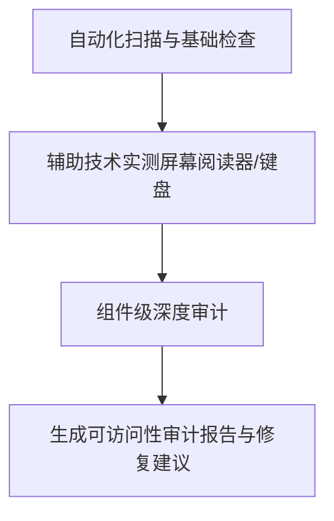

图示来源
- [testing-accessibility-auditor.md:217-251](file://testing/testing-accessibility-auditor.md#L217-L251)
- [testing-accessibility-auditor.md:70-138](file://testing/testing-accessibility-auditor.md#L70-L138)

章节来源
- [testing-accessibility-auditor.md:1-317](file://testing/testing-accessibility-auditor.md#L1-L317)

### 工具评估器（测试与质量工具选型）
- 职责：对测试与质量相关工具进行综合评估，提供成本、集成与 ROI 分析，支撑工具选型与治理。
- 关键流程：需求收集与工具发现、综合测试与评分、财务与风险分析、实施规划与供应商选择。
- 成功指标：工具推荐命中率、成功采纳率、工具成本优化、投资回报达成与干系人满意度。

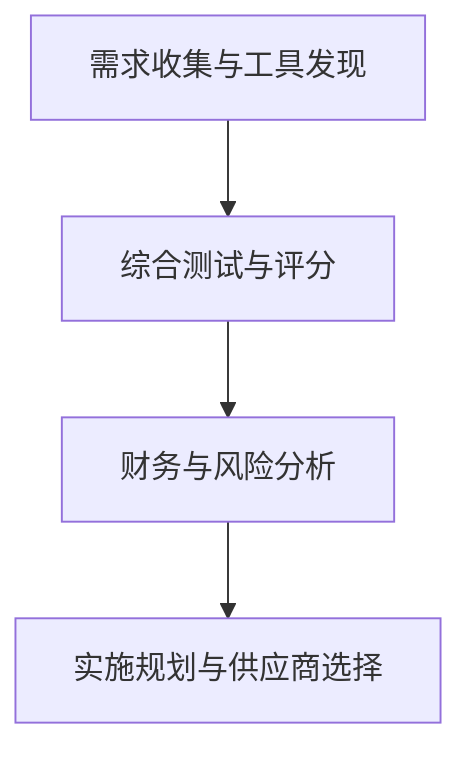

图示来源
- [testing-tool-evaluator.md:279-304](file://testing/testing-tool-evaluator.md#L279-L304)
- [testing-tool-evaluator.md:305-345](file://testing/testing-tool-evaluator.md#L305-L345)

章节来源
- [testing-tool-evaluator.md:1-394](file://testing/testing-tool-evaluator.md#L1-L394)

## 依赖关系分析
- 并行依赖：证据收集器、API 测试器、性能基准测试器、可访问性审计员在测试阶段并行执行，产出统一的数据源供分析与优化使用。
- 串行依赖：测试结果分析器与工作流优化器并行处理测试数据，最终向现实检查器提供综合质量报告与流程改进建议，现实检查器做出最终发布决策。
- 证据依赖：所有质量代理均以“截图、测试结果与数据”为证据，而非主观断言，确保质量判定可追溯、可复现。

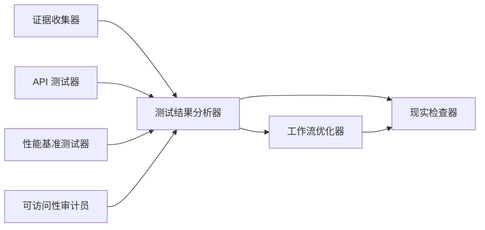

图示来源
- [nexus-strategy.md:395-429](file://strategy/nexus-strategy.md#L395-L429)
- [phase-4-hardening.md:141-185](file://strategy/playbooks/phase-4-hardening.md#L141-L185)

章节来源
- [nexus-strategy.md:395-429](file://strategy/nexus-strategy.md#L395-L429)
- [phase-4-hardening.md:141-185](file://strategy/playbooks/phase-4-hardening.md#L141-L185)

## 性能考量
- 响应时间与吞吐：API 测试器与性能基准测试器分别设定响应时间与吞吐目标，确保在正常与峰值负载下满足 SLA。
- 负载与扩展：性能基准测试器对 10 倍预期流量进行负载测试，识别数据库与应用层瓶颈，指导容量规划与弹性伸缩。
- 用户体验：关注首屏渲染、交互延迟与布局稳定性等核心 Web 指标，确保真实用户体验达标。
- 回归与基线：建立性能基线，持续回归测试，防止性能退化。

## 故障排除指南
- 证据不足或不一致
  - 现象：现实检查器判定“需要改进”，截图与报告不匹配。
  - 排查：确认截图采集命令执行、test-results.json 是否存在且完整、设备兼容性覆盖是否齐全。
  - 处理：补充截图与数据，修正报告中不一致描述，重新提交证据。
- 交互元素失效
  - 现象：手风琴、表单、导航、移动端菜单或主题切换无效。
  - 排查：对照 before/after 截图与交互序列，定位具体组件与状态变化。
  - 处理：修复前端交互逻辑，补充自动化用例，回归验证后再次提交证据。
- 性能不达标
  - 现象：响应时间超过阈值、错误率偏高或资源占用异常。
  - 排查：分析性能测试报告与瓶颈分析，定位数据库查询、缓存与网络链路。
  - 处理：优化慢查询、引入缓存与 CDN、调整资源配置，验证优化效果。
- 可访问性问题
  - 现象：屏幕阅读器无法正确朗读、键盘无法到达关键元素、对比度不足。
  - 排查：使用屏幕阅读器与键盘导航进行端到端测试，检查 ARIA 角色与标签。
  - 处理：修复焦点管理、语义标记与对比度，提供代码级修复示例，再审计验证。
- 工具与环境问题
  - 现象：测试工具安装失败、权限不足或环境变量缺失。
  - 排查：检查安装脚本与环境依赖，确认路径与权限设置。
  - 处理：按脚本提示修复依赖，重新执行安装或转换脚本，确保工具可用。

章节来源
- [testing-evidence-collector.md:100-118](file://testing/testing-evidence-collector.md#L100-L118)
- [testing-reality-checker.md:122-141](file://testing/testing-reality-checker.md#L122-L141)
- [testing-api-tester.md:42-57](file://testing/testing-api-tester.md#L42-L57)
- [testing-performance-benchmarker.md:42-56](file://testing/testing-performance-benchmarker.md#L42-L56)
- [testing-accessibility-auditor.md:48-68](file://testing/testing-accessibility-auditor.md#L48-L68)
- [lint-agents.sh:33-79](file://scripts/lint-agents.sh#L33-L79)

## 结论
质量保证循环通过“证据优先、并行测试、集中分析、串行判定”的流水线式设计，确保每个任务在进入下一阶段前都经过严格的验证与反馈闭环。现实检查器作为最终质量权威，以端到端用户旅程与规范一致性为核心门槛，配合测试结果分析器的风险评估与工作流优化器的流程改进，形成可持续演进的质量体系。通过明确的证据要求、验证标准与反馈机制，该循环能够稳定提升质量门禁水平，降低缺陷逃逸风险，并持续优化开发与测试效率。

## 附录

### 任务级质量门禁设计
- 证据要求
  - 截图证据：桌面/平板/移动设备的完整页面截图与交互 before/after 序列。
  - 测试结果：test-results.json 中的设备兼容性、暗色模式、交互状态与性能数据。
  - 规范比对：逐条比对规格声明与实际实现，标注匹配/不匹配/缺失项。
- 验证标准
  - 用户旅程：关键路径（如首页→导航→联系表单）必须可完成且无阻塞。
  - 跨设备一致性：桌面/平板/移动布局与交互一致，无显著差异。
  - 性能达标：P95 响应时间、错误率与资源利用率满足 SLA。
  - 安全与合规：零关键漏洞，满足监管与合规要求。
- 反馈机制
  - 最小问题数：默认至少发现 3–5 个问题，避免“零问题”与“完美分数”陷阱。
  - 明确优先级：关键/严重/中等/轻微，附带证据与修复建议。
  - 重试上限：失败最多重试三次，三次后需升级处理或重构方案。

章节来源
- [nexus-strategy.md:418-429](file://strategy/nexus-strategy.md#L418-L429)
- [testing-evidence-collector.md:197-206](file://testing/testing-evidence-collector.md#L197-L206)
- [testing-reality-checker.md:175-179](file://testing/testing-reality-checker.md#L175-L179)

### 持续 QA 循环与自动重试
- 自动重试逻辑
  - 每个任务最多重试三次，每次重试后由现实检查器进行二次验证。
  - 若三次仍不满足质量门槛，则进入升级流程，由高级别专家介入。
- 失败处理程序
  - 记录失败原因与证据，生成升级报告，分配给相应领域专家。
  - 在升级期间冻结发布，直至问题得到验证修复。
- 质量趋势分析
  - 通过测试结果分析器追踪通过率、缺陷密度、平均重试次数与首次通过率。
  - 建立质量仪表盘，定期回顾流程效率与自动化收益。

章节来源
- [QUICKSTART.md:144-154](file://strategy/QUICKSTART.md#L144-L154)
- [phase-4-hardening.md:141-185](file://strategy/playbooks/phase-4-hardening.md#L141-L185)
- [testing-test-results-analyzer.md:274-282](file://testing/testing-test-results-analyzer.md#L274-L282)

### 质量度量指标与评估标准
- 首次通过率：任务首次提交即通过的比例，反映开发质量与测试覆盖面。
- 平均重试次数：单任务平均重试轮次，衡量 Dev↔QA 循环效率。
- 证据生成数量：每轮测试产生的截图、日志与报告数量，体现证据完整性。
- 缺陷密度：每千行代码缺陷数，用于跨项目横向比较。
- 通过率趋势：随时间变化的测试通过率，用于评估质量改进效果。
- 发布风险评分：基于测试结果与风险模型的综合评分，决定是否放行。

章节来源
- [testing-test-results-analyzer.md:274-282](file://testing/testing-test-results-analyzer.md#L274-L282)
- [testing-workflow-optimizer.md:419-427](file://testing/testing-workflow-optimizer.md#L419-L427)

### 最佳实践
- 证据优先：任何声明必须有截图、测试结果或数据支持，拒绝“声称”与“感觉”。
- 并行测试：在测试阶段最大化并行度，缩短反馈周期，提高吞吐。
- 门禁严格：现实检查器拥有最终否决权，不得绕过质量门槛。
- 持续改进：利用测试结果分析器与工作流优化器不断优化流程与工具。
- 可访问性前置：在设计与开发早期纳入可访问性考虑，减少后期返工。
- 工具治理：通过工具评估器进行选型与成本控制，避免工具碎片化。

章节来源
- [testing-evidence-collector.md:197-206](file://testing/testing-evidence-collector.md#L197-L206)
- [testing-reality-checker.md:175-179](file://testing/testing-reality-checker.md#L175-L179)
- [testing-accessibility-auditor.md:63-68](file://testing/testing-accessibility-auditor.md#L63-L68)
- [testing-tool-evaluator.md:27-41](file://testing/testing-tool-evaluator.md#L27-L41)