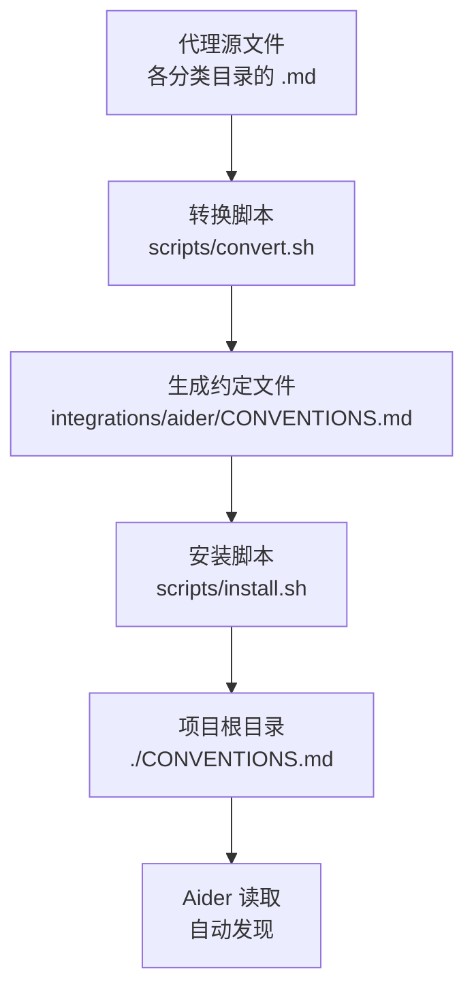
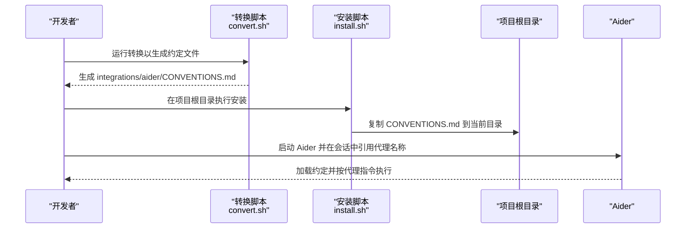
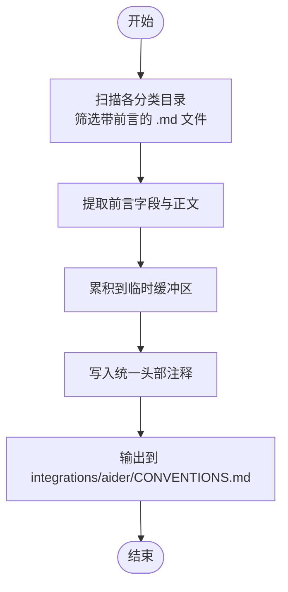
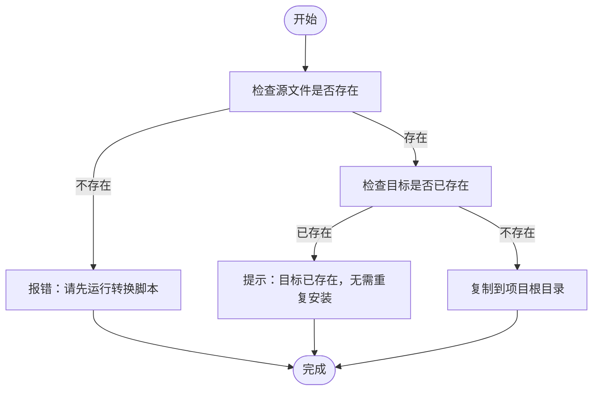
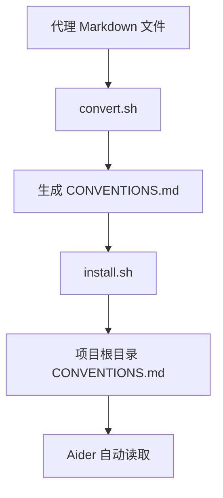

# Aider 集成

<cite>
**本文引用的文件**
- [integrations/aider/README.md](file://integrations/aider/README.md)
- [integrations/README.md](file://integrations/README.md)
- [scripts/convert.sh](file://scripts/convert.sh)
- [scripts/install.sh](file://scripts/install.sh)
- [README.md](file://README.md)
- [engineering-frontend-developer.md](file://engineering/engineering-frontend-developer.md)
- [academic-historian.md](file://academic/academic-historian.md)
- [marketing-content-creator.md](file://marketing/marketing-content-creator.md)
</cite>

## 目录
1. [简介](#简介)
2. [项目结构](#项目结构)
3. [核心组件](#核心组件)
4. [架构总览](#架构总览)
5. [详细组件分析](#详细组件分析)
6. [依赖关系分析](#依赖关系分析)
7. [性能考量](#性能考量)
8. [故障排除指南](#故障排除指南)
9. [结论](#结论)
10. [附录](#附录)

## 简介
本指南面向希望在 Aider 中使用 The Agency 代理集合的用户。Aider 通过项目根目录下的单一约定文件 CONVENTIONS.md 自动读取全部代理信息。本文将说明：
- 约定文件系统与合并策略（所有代理合并为单一 CONVENTIONS.md）
- 安装流程：在项目根目录运行安装脚本、约定文件生成与配置
- 使用示例：在 Aider 会话中按名称激活与调用代理
- CONVENTIONS.md 结构与配置项说明
- 故障排除：约定文件加载失败、项目范围配置问题、Aider 集成问题
- Aider 工具特点与适用场景

## 项目结构
Aider 集成的关键位置与职责如下：
- 转换脚本：scripts/convert.sh 将各分类目录中的代理 Markdown 文档转换为工具特定格式，并将所有代理合并为 integrations/aider/CONVENTIONS.md
- 安装脚本：scripts/install.sh 将生成的 CONVENTIONS.md 复制到当前工作目录（项目根目录），使其被 Aider 自动发现
- 工具说明：integrations/aider/README.md 提供 Aider 集成的快速使用指引
- 总览说明：integrations/README.md 与仓库根 README.md 提供工具支持清单与安装步骤

图表来源
- [scripts/convert.sh:482-517](file://scripts/convert.sh#L482-L517)
- [scripts/convert.sh:619-628](file://scripts/convert.sh#L619-L628)
- [scripts/install.sh:428-439](file://scripts/install.sh#L428-L439)
- [integrations/aider/README.md:1-39](file://integrations/aider/README.md#L1-L39)

章节来源
- [integrations/README.md:1-209](file://integrations/README.md#L1-L209)
- [README.md:510-709](file://README.md#L510-L709)

## 核心组件
- 约定文件生成器（convert.sh）
  - 扫描各分类目录，提取每个代理的 YAML 前言字段与正文内容
  - 将所有代理累积写入临时缓冲区，最终输出单一 CONVENTIONS.md
  - 生成头部注释，说明用途与激活方式
- 安装器（install.sh）
  - 检查生成物是否存在
  - 将 CONVENTIONS.md 复制到当前工作目录（项目根目录）
  - 输出提示，强调该文件为项目级作用域
- Aider 使用说明（integrations/aider/README.md）
  - 明确 CONVENTIONS.md 的自动读取行为
  - 提供手动指定约定文件与重新生成的命令

章节来源
- [scripts/convert.sh:416-458](file://scripts/convert.sh#L416-L458)
- [scripts/convert.sh:619-628](file://scripts/convert.sh#L619-L628)
- [scripts/install.sh:428-439](file://scripts/install.sh#L428-L439)
- [integrations/aider/README.md:1-39](file://integrations/aider/README.md#L1-L39)

## 架构总览
下图展示从代理源文件到 Aider 会话激活的整体流程。

图表来源
- [scripts/convert.sh:482-517](file://scripts/convert.sh#L482-L517)
- [scripts/convert.sh:619-628](file://scripts/convert.sh#L619-L628)
- [scripts/install.sh:428-439](file://scripts/install.sh#L428-L439)
- [integrations/aider/README.md:1-39](file://integrations/aider/README.md#L1-L39)

## 详细组件分析

### 组件一：约定文件生成（convert.sh）
- 输入：各分类目录下的代理 Markdown 文件（包含 YAML 前言与正文）
- 处理逻辑：
  - 读取前言字段（如 name、description 等）与正文内容
  - 将每个代理的标题、描述与正文累积到临时缓冲区
  - 写入统一头部注释后输出至 integrations/aider/CONVENTIONS.md
- 输出：单一约定文件，便于 Aider 一次性读取

图表来源
- [scripts/convert.sh:482-517](file://scripts/convert.sh#L482-L517)
- [scripts/convert.sh:440-458](file://scripts/convert.sh#L440-L458)
- [scripts/convert.sh:416-428](file://scripts/convert.sh#L416-L428)
- [scripts/convert.sh:619-628](file://scripts/convert.sh#L619-L628)

章节来源
- [scripts/convert.sh:85-99](file://scripts/convert.sh#L85-L99)
- [scripts/convert.sh:440-458](file://scripts/convert.sh#L440-L458)
- [scripts/convert.sh:416-428](file://scripts/convert.sh#L416-L428)
- [scripts/convert.sh:619-628](file://scripts/convert.sh#L619-L628)

### 组件二：安装与部署（install.sh）
- 功能：将生成的 CONVENTIONS.md 复制到当前工作目录（项目根目录）
- 行为：
  - 若目标已存在，给出提示并跳过覆盖
  - 若源文件缺失，提示先运行转换脚本
  - 强调项目级作用域，需在项目根目录执行

图表来源
- [scripts/install.sh:428-439](file://scripts/install.sh#L428-L439)

章节来源
- [scripts/install.sh:428-439](file://scripts/install.sh#L428-L439)
- [integrations/README.md:36-38](file://integrations/README.md#L36-L38)

### 组件三：Aider 使用与激活（integrations/aider/README.md）
- 自动读取：当项目根目录存在 CONVENTIONS.md 时，Aider 会自动读取
- 激活方式：在 Aider 会话中直接按名称引用代理
- 手动指定：也可显式传入约定文件路径

章节来源
- [integrations/aider/README.md:1-39](file://integrations/aider/README.md#L1-L39)

### 组件四：代理文件结构与配置项（示例）
以下示例展示了代理 Markdown 文件的典型结构与可选配置项，这些字段会被转换脚本读取并写入约定文件：
- 必填字段：name、description
- 可选字段：color、emoji、vibe、tools 等
- 正文：包含身份、使命、规则、交付物、工作流等段落

章节来源
- [engineering-frontend-developer.md:1-225](file://engineering/engineering-frontend-developer.md#L1-L225)
- [academic-historian.md:1-124](file://academic/academic-historian.md#L1-L124)
- [marketing-content-creator.md:1-54](file://marketing/marketing-content-creator.md#L1-L54)

## 依赖关系分析
- convert.sh 依赖各分类目录中的代理 Markdown 文件（含 YAML 前言）
- install.sh 依赖 convert.sh 生成的约定文件
- Aider 依赖项目根目录的约定文件进行自动发现与激活

图表来源
- [scripts/convert.sh:482-517](file://scripts/convert.sh#L482-L517)
- [scripts/convert.sh:619-628](file://scripts/convert.sh#L619-L628)
- [scripts/install.sh:428-439](file://scripts/install.sh#L428-L439)
- [integrations/aider/README.md:1-39](file://integrations/aider/README.md#L1-L39)

章节来源
- [README.md:510-709](file://README.md#L510-L709)
- [integrations/README.md:1-209](file://integrations/README.md#L1-L209)

## 性能考量
- 并行转换：convert.sh 支持并行模式，可显著缩短大规模代理转换时间
- 并行安装：install.sh 支持并行模式，适合同时安装多个工具
- 项目级约定文件：单一文件减少 Aider 的读取与解析开销，提升响应速度

章节来源
- [README.md:575-588](file://README.md#L575-L588)
- [integrations/README.md:19-38](file://integrations/README.md#L19-L38)

## 故障排除指南
- 约定文件未生成或缺失
  - 现象：安装时报错提示缺少约定文件
  - 解决：先运行转换脚本生成约定文件，再执行安装
  - 参考：安装器对源文件缺失的错误提示
- 约定文件已存在但未生效
  - 现象：目标已存在，安装器提示无需重复安装
  - 解决：删除旧文件后重新安装，或直接在 Aider 中显式指定约定文件
- 项目范围配置问题
  - 现象：约定文件未放置于项目根目录导致 Aider 无法发现
  - 解决：确保在项目根目录执行安装脚本，并确认文件位于当前工作目录
- Aider 集成问题
  - 现象：Aider 未按预期激活代理
  - 解决：确认会话中按名称正确引用代理；必要时手动指定约定文件路径

章节来源
- [scripts/install.sh:428-439](file://scripts/install.sh#L428-L439)
- [integrations/aider/README.md:1-39](file://integrations/aider/README.md#L1-L39)

## 结论
通过将 147 个代理合并为单一约定文件，Aider 集成实现了“即插即用”的体验：只需在项目根目录安装约定文件，即可在会话中按名称激活任意代理。配合并行转换与安装，可在大型项目中快速落地多工具链的智能体协作方案。

## 附录

### 安装与使用步骤
- 生成约定文件
  - 运行转换脚本以生成工具特定格式的约定文件
- 安装约定文件
  - 在项目根目录执行安装脚本，将约定文件复制到当前目录
- 在 Aider 中使用
  - 在会话中直接按名称引用代理
  - 或显式指定约定文件路径

章节来源
- [README.md:528-541](file://README.md#L528-L541)
- [README.md:700-717](file://README.md#L700-L717)
- [integrations/aider/README.md:6-38](file://integrations/aider/README.md#L6-L38)