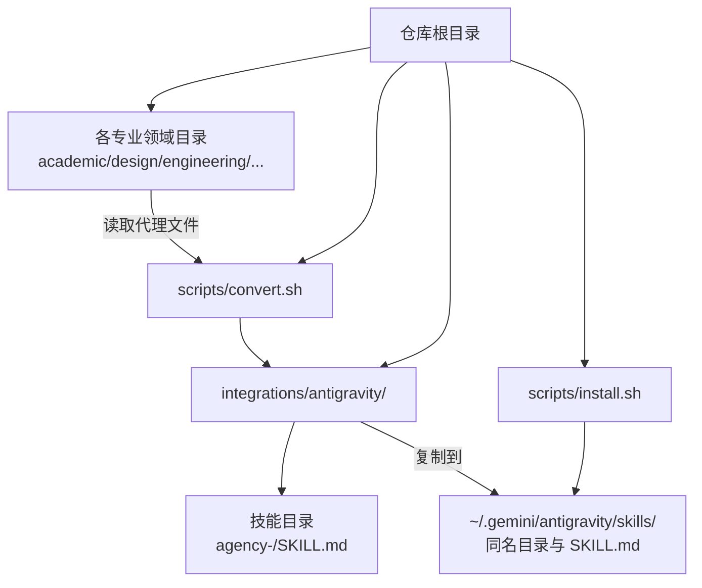
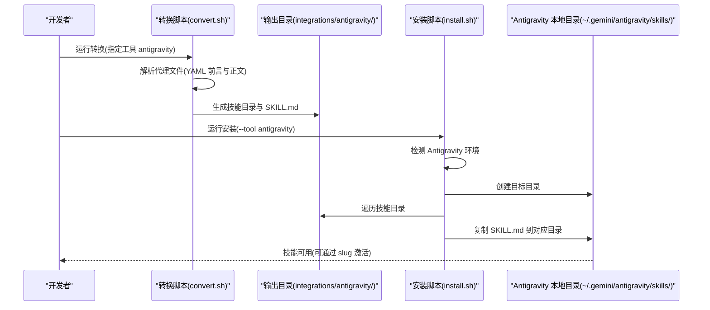
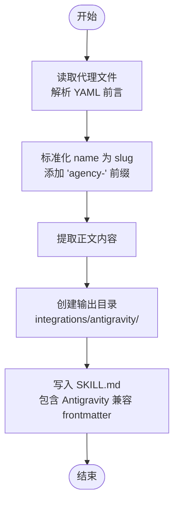
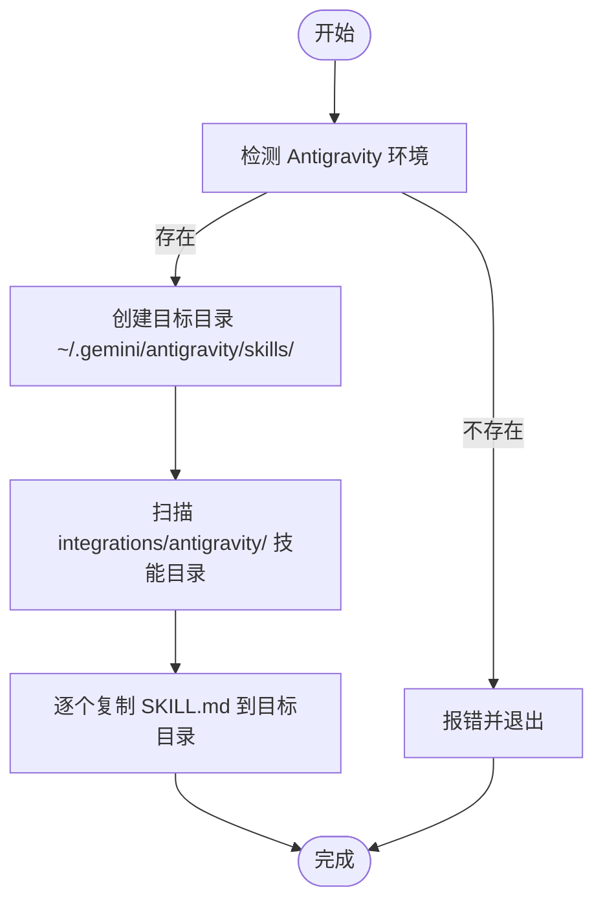

# Antigravity 集成

<cite>
**本文引用的文件**
- [integrations/antigravity/README.md](file://integrations/antigravity/README.md)
- [scripts/install.sh](file://scripts/install.sh)
- [scripts/convert.sh](file://scripts/convert.sh)
- [integrations/README.md](file://integrations/README.md)
- [README.md](file://README.md)
- [academic/academic-anthropologist.md](file://academic/academic-anthropologist.md)
- [design/design-ui-designer.md](file://design/design-ui-designer.md)
- [engineering/engineering-frontend-developer.md](file://engineering/engineering-frontend-developer.md)
</cite>

## 目录
1. [简介](#简介)
2. [项目结构](#项目结构)
3. [核心组件](#核心组件)
4. [架构总览](#架构总览)
5. [详细组件分析](#详细组件分析)
6. [依赖关系分析](#依赖关系分析)
7. [性能考量](#性能考量)
8. [故障排除指南](#故障排除指南)
9. [结论](#结论)
10. [附录](#附录)

## 简介
本指南面向希望在 Antigravity 平台上使用 The Agency 代理能力的用户与维护者。Antigravity 集成将仓库中的 61 个代理转换为独立的“技能”（Skill），每个技能对应一个独立的目录与 SKILL.md 文件，并通过统一的前缀避免与现有技能产生命名冲突。安装流程分为两步：先由转换脚本生成适配 Antigravity 的技能文件，再由安装脚本将这些技能复制到 Antigravity 的本地技能目录中。

Antigravity 平台特点与适用场景
- 平台特性
  - 基于社区技能生态，支持通过“技能”（Skill）扩展功能。
  - 使用“技能名称”（slug）进行激活与调用，便于检索与复用。
  - 采用 Markdown + 前言元数据（frontmatter）描述技能信息，结构清晰、可读性强。
- 适用场景
  - 快速集成多领域专家代理（如前端开发、UI 设计、工程架构等）。
  - 在对话式工作流中按需激活特定技能，提升任务完成质量与效率。
  - 通过统一的命名规范与前缀策略，避免技能命名冲突，保障生态稳定性。

章节来源
- [integrations/antigravity/README.md:1-50](file://integrations/antigravity/README.md#L1-L50)
- [integrations/README.md:78-87](file://integrations/README.md#L78-L87)

## 项目结构
Antigravity 集成相关的关键位置与职责如下：
- 转换与安装脚本
  - 转换脚本：将标准代理文件转换为 Antigravity 技能格式，输出至 integrations/antigravity/ 下的独立技能目录。
  - 安装脚本：检测 Antigravity 环境，将转换后的技能复制到 ~/.gemini/antigravity/skills/。
- 代理源文件
  - 位于各专业领域的目录下（如 academic、design、engineering 等），每个文件包含 YAML 前言与正文内容。
- Antigravity 技能目录
  - 每个技能对应一个目录，目录名即为技能 slug；目录内包含 SKILL.md 文件，包含 Antigravity 兼容的 frontmatter 与正文。

图表来源
- [scripts/convert.sh:109-133](file://scripts/convert.sh#L109-L133)
- [scripts/install.sh:338-352](file://scripts/install.sh#L338-L352)

章节来源
- [scripts/convert.sh:59-67](file://scripts/convert.sh#L59-L67)
- [scripts/install.sh:137](file://scripts/install.sh#L137)
- [integrations/antigravity/README.md:12-13](file://integrations/antigravity/README.md#L12-L13)

## 核心组件
- 转换器（convert.sh）
  - 功能：从标准代理文件提取 name、description 等字段，生成 Antigravity 兼容的 SKILL.md，目录名为标准化后的 slug（带 agency- 前缀）。
  - 输出：integrations/antigravity/<slug>/SKILL.md。
- 安装器（install.sh）
  - 功能：检测 Antigravity 环境，创建目标目录，遍历 integrations/antigravity/ 下的技能目录，将 SKILL.md 复制到 ~/.gemini/antigravity/skills/ 对应目录。
- 代理文件（.md）
  - 结构：YAML 前言（name、description 等）+ 正文内容；转换时仅保留正文作为技能内容。
- Antigravity 技能文件（SKILL.md）
  - 结构：Antigravity 兼容的 frontmatter（name、description、risk、source、date_added）+ 正文内容。

章节来源
- [scripts/convert.sh:85-105](file://scripts/convert.sh#L85-L105)
- [scripts/convert.sh:109-133](file://scripts/convert.sh#L109-L133)
- [scripts/install.sh:338-352](file://scripts/install.sh#L338-L352)
- [integrations/antigravity/README.md:39-49](file://integrations/antigravity/README.md#L39-L49)

## 架构总览
下图展示了从代理文件到 Antigravity 技能的完整流程：转换脚本负责生成技能文件，安装脚本负责部署到 Antigravity 的本地技能目录。

图表来源
- [scripts/convert.sh:521-636](file://scripts/convert.sh#L521-L636)
- [scripts/install.sh:515-637](file://scripts/install.sh#L515-L637)

章节来源
- [scripts/convert.sh:521-636](file://scripts/convert.sh#L521-L636)
- [scripts/install.sh:515-637](file://scripts/install.sh#L515-L637)

## 详细组件分析

### 转换器（convert.sh）分析
- 输入与处理
  - 读取各专业领域目录下的代理文件，解析 YAML 前言字段（如 name、description）。
  - 将 name 标准化为 slug（小写、连字符分隔、去除非法字符），并在前面添加 agency- 前缀。
  - 提取正文内容，用于技能描述。
- 输出与格式
  - 为每个技能创建独立目录 integrations/antigravity/<slug>，并在其中生成 SKILL.md。
  - SKILL.md 包含 Antigravity 兼容的 frontmatter（name、description、risk、source、date_added）与正文内容。
- 并行与批量
  - 支持并行转换多个工具，提高大规模代理转换效率。

图表来源
- [scripts/convert.sh:85-105](file://scripts/convert.sh#L85-L105)
- [scripts/convert.sh:109-133](file://scripts/convert.sh#L109-L133)

章节来源
- [scripts/convert.sh:85-105](file://scripts/convert.sh#L85-L105)
- [scripts/convert.sh:109-133](file://scripts/convert.sh#L109-L133)

### 安装器（install.sh）分析
- 环境检测
  - 检查 ~/.gemini/antigravity/skills 是否存在，确保 Antigravity 已安装或可被识别。
- 目标路径
  - 目标目录为 ~/.gemini/antigravity/skills/。
- 复制逻辑
  - 遍历 integrations/antigravity/ 下的每个技能目录，将 SKILL.md 复制到目标目录中对应的技能目录下。
- 错误处理
  - 若 integrations/antigravity 缺失，提示先运行转换脚本。

图表来源
- [scripts/install.sh:137](file://scripts/install.sh#L137)
- [scripts/install.sh:338-352](file://scripts/install.sh#L338-L352)

章节来源
- [scripts/install.sh:137](file://scripts/install.sh#L137)
- [scripts/install.sh:338-352](file://scripts/install.sh#L338-L352)

### 技能文件组织与命名约定
- 组织结构
  - 每个技能对应一个目录，目录名即为技能 slug。
  - 目录内包含 SKILL.md 文件，文件内容为 Antigravity 兼容的 frontmatter + 正文。
- 命名约定
  - slug 由代理的 name 字段标准化而来，再添加 agency- 前缀，确保唯一性与可读性。
  - 示例：前端开发代理 name 为“Frontend Developer”，slug 为“agency-frontend-developer”。

章节来源
- [scripts/convert.sh:109-133](file://scripts/convert.sh#L109-L133)
- [integrations/antigravity/README.md:23-27](file://integrations/antigravity/README.md#L23-L27)

### 使用示例：在 Antigravity 中激活与使用代理技能
- 安装步骤
  - 生成技能文件：./scripts/convert.sh --tool antigravity
  - 安装技能：./scripts/install.sh --tool antigravity
- 激活与使用
  - 在 Antigravity 中，使用技能 slug 激活相应技能。
  - 示例：Use the agency-frontend-developer skill to review this component.
- 可用技能示例
  - agency-frontend-developer
  - agency-backend-architect
  - agency-reality-checker
  - agency-growth-hacker

章节来源
- [integrations/antigravity/README.md:8-10](file://integrations/antigravity/README.md#L8-L10)
- [integrations/antigravity/README.md:17-21](file://integrations/antigravity/README.md#L17-L21)
- [integrations/antigravity/README.md:23-27](file://integrations/antigravity/README.md#L23-L27)

## 依赖关系分析
- 脚本间依赖
  - install.sh 依赖 convert.sh 生成的 integrations/antigravity/ 目录。
  - convert.sh 依赖各专业领域目录下的代理文件。
- 外部依赖
  - Antigravity 环境（检测 ~/.gemini/antigravity/skills 是否存在）。
- 内部耦合
  - 转换器与安装器均遵循统一的目录与文件命名约定，降低耦合度，便于维护与扩展。

图表来源
- [scripts/convert.sh:64-67](file://scripts/convert.sh#L64-L67)
- [scripts/install.sh:338-352](file://scripts/install.sh#L338-L352)

章节来源
- [scripts/convert.sh:64-67](file://scripts/convert.sh#L64-L67)
- [scripts/install.sh:338-352](file://scripts/install.sh#L338-L352)

## 性能考量
- 转换阶段
  - 支持并行转换多个工具，提高大规模代理转换效率；建议在多核环境下使用并行模式。
- 安装阶段
  - 安装过程为文件复制，开销较小；若技能数量较多，可考虑并行安装其他工具以减少整体等待时间。
- 文件大小
  - 每个技能为独立文件，便于增量更新与缓存管理；建议保持代理文件结构简洁，避免冗余内容。

## 故障排除指南
- 技能加载失败
  - 症状：Antigravity 无法识别新安装的技能。
  - 排查要点：
    - 确认已先执行转换：./scripts/convert.sh --tool antigravity。
    - 确认安装成功：install.sh 输出中包含“Antigravity: X skills -> ~/.gemini/antigravity/skills/”。
    - 检查技能目录结构是否正确（每个技能对应一个目录，目录内包含 SKILL.md）。
- 权限问题
  - 症状：安装过程中出现权限错误。
  - 排查要点：
    - 确保当前用户对 ~/.gemini/antigravity/skills/ 具有写权限。
    - 如需在受限环境中运行，可先在临时目录生成后再手动复制。
- 命名冲突
  - 症状：技能无法激活或与其他技能混淆。
  - 排查要点：
    - Antigravity 集成通过在 slug 前添加 agency- 前缀避免冲突，确保每个技能名称唯一。
    - 若自定义修改了代理文件，请重新运行转换与安装流程，确保生成的 slug 一致。

章节来源
- [scripts/install.sh:338-352](file://scripts/install.sh#L338-L352)
- [integrations/antigravity/README.md:3-4](file://integrations/antigravity/README.md#L3-L4)

## 结论
Antigravity 集成通过标准化的转换与安装流程，将 The Agency 的多领域代理高效转化为 Antigravity 技能，具备良好的可维护性与扩展性。遵循统一的命名约定与文件结构，可有效避免命名冲突，并在 Antigravity 平台上稳定运行。建议在新增或修改代理后，及时运行转换与安装流程，确保技能文件与目录结构保持一致。

## 附录
- 快速开始
  - 生成技能文件：./scripts/convert.sh --tool antigravity
  - 安装技能：./scripts/install.sh --tool antigravity
- 参考示例文件
  - 学术类代理示例：academic/academic-anthropologist.md
  - 设计类代理示例：design/design-ui-designer.md
  - 工程类代理示例：engineering/engineering-frontend-developer.md

章节来源
- [README.md:528-578](file://README.md#L528-L578)
- [integrations/README.md:78-87](file://integrations/README.md#L78-L87)
- [academic/academic-anthropologist.md:1-126](file://academic/academic-anthropologist.md#L1-L126)
- [design/design-ui-designer.md:1-383](file://design/design-ui-designer.md#L1-L383)
- [engineering/engineering-frontend-developer.md:1-225](file://engineering/engineering-frontend-developer.md#L1-L225)