# Claude Code 集成

<cite>
**本文档引用的文件**
- [integrations/claude-code/README.md](file://integrations/claude-code/README.md)
- [scripts/install.sh](file://scripts/install.sh)
- [README.md](file://README.md)
- [CONTRIBUTING.md](file://CONTRIBUTING.md)
- [scripts/lint-agents.sh](file://scripts/lint-agents.sh)
- [engineering/engineering-frontend-developer.md](file://engineering/engineering-frontend-developer.md)
- [testing/testing-reality-checker.md](file://testing/testing-reality-checker.md)
- [engineering/engineering-backend-architect.md](file://engineering/engineering-backend-architect.md)
- [design/design-ui-designer.md](file://design/design-ui-designer.md)
</cite>

## 目录
1. [简介](#简介)
2. [项目结构](#项目结构)
3. [核心组件](#核心组件)
4. [架构概览](#架构概览)
5. [详细组件分析](#详细组件分析)
6. [依赖关系分析](#依赖关系分析)
7. [性能考虑](#性能考虑)
8. [故障排除指南](#故障排除指南)
9. [结论](#结论)
10. [附录](#附录)

## 简介

Claude Code 是 The Agency 项目的核心集成平台，专为 Claude Code 平台而构建。该项目提供了 144 个经过精心设计的 AI 代理，每个代理都是一个专门的专家，具有个性、流程和经过验证的产出物。

### 主要特性

- **原生支持**：无需格式转换即可直接使用，完全兼容 Claude Code 的现有 `.md` + YAML frontmatter 格式
- **专业化代理**：从前端专家到 Reddit 社区 ninja，从奇想注入器到现实检查员
- **可扩展性**：支持多工具集成，包括 GitHub Copilot、Cursor、Aider 等
- **生产就绪**：经过实战测试的工作流和成功指标

## 项目结构

The Agency 项目采用模块化组织结构，按职能领域划分不同的代理类别：

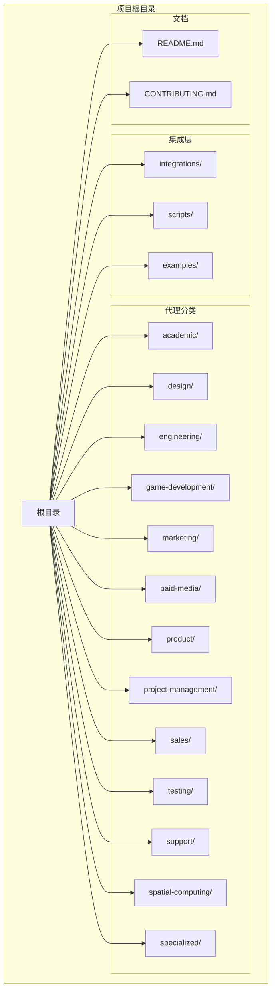

**图表来源**
- [README.md:1-886](file://README.md#L1-L886)
- [integrations/claude-code/README.md:1-32](file://integrations/claude-code/README.md#L1-L32)

### 代理分类结构

项目包含 12 个主要代理分类，每个分类都有特定的专业领域：

| 分类 | 代理数量 | 专业领域 | 使用场景 |
|------|----------|----------|----------|
| **Engineering** | 28 | 软件开发 | 前端、后端、移动应用、安全等 |
| **Design** | 7 | UX/UI 设计 | 用户界面、用户体验、品牌设计 |
| **Game Development** | 15 | 游戏开发 | Unity、Unreal、Godot 等引擎 |
| **Marketing** | 28 | 市场营销 | 社交媒体、SEO、内容创作等 |
| **Paid Media** | 6 | 付费媒体 | PPC、广告优化等 |
| **Product** | 4 | 产品管理 | 产品策略、优先级管理等 |
| **Project Management** | 5 | 项目管理 | 协调、进度管理等 |
| **Sales** | 7 | 销售 | 客户开发、销售策略等 |
| **Testing** | 7 | 测试质量 | QA、性能测试等 |
| **Support** | 6 | 支持运营 | 客户支持、数据分析等 |
| **Spatial Computing** | 6 | 空间计算 | AR/VR/XR 开发 |
| **Specialized** | 25 | 专业服务 | 企业服务、合规审计等 |

**章节来源**
- [README.md:68-283](file://README.md#L68-L283)

## 核心组件

### Claude Code 集成组件

Claude Code 集成是 The Agency 的核心功能，提供了无缝的代理激活和使用体验：

#### 安装组件

安装脚本提供了多种安装方式：
- 自动检测系统中的 Claude Code 安装
- 手动指定安装目标
- 支持并行安装以提高效率

#### 代理激活组件

代理激活通过自然语言指令实现：
- 支持按名称激活代理
- 支持在会话中直接引用代理
- 提供上下文感知的代理选择

#### 文件组织组件

代理文件采用标准化的 YAML frontmatter 结构：
- 必需字段：name、description、color
- 可选字段：emoji、vibe、services
- 统一的文档结构

**章节来源**
- [integrations/claude-code/README.md:1-32](file://integrations/claude-code/README.md#L1-L32)
- [scripts/install.sh:299-315](file://scripts/install.sh#L299-L315)

### 代理文件结构

每个代理文件都遵循统一的结构模式：

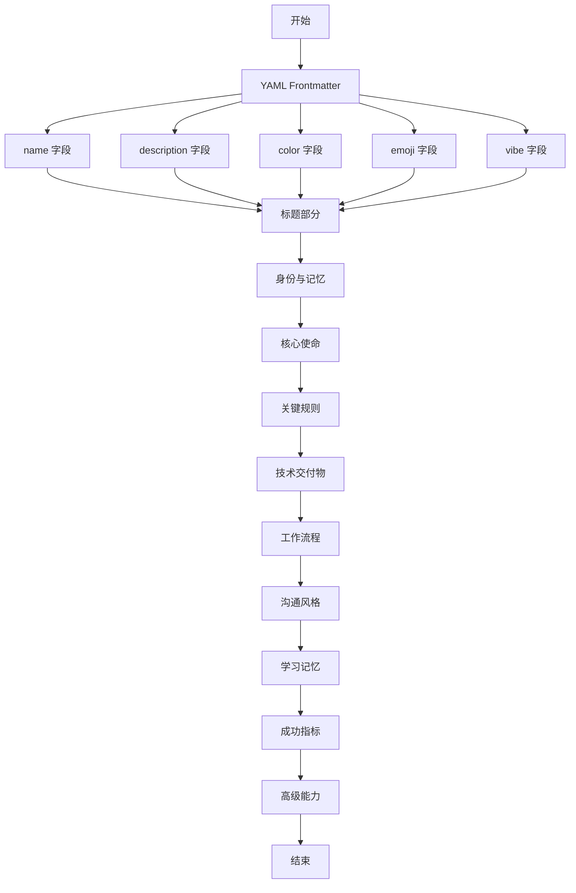

**图表来源**
- [CONTRIBUTING.md:83-174](file://CONTRIBUTING.md#L83-L174)

**章节来源**
- [CONTRIBUTING.md:81-200](file://CONTRIBUTING.md#L81-L200)

## 架构概览

### 系统架构图

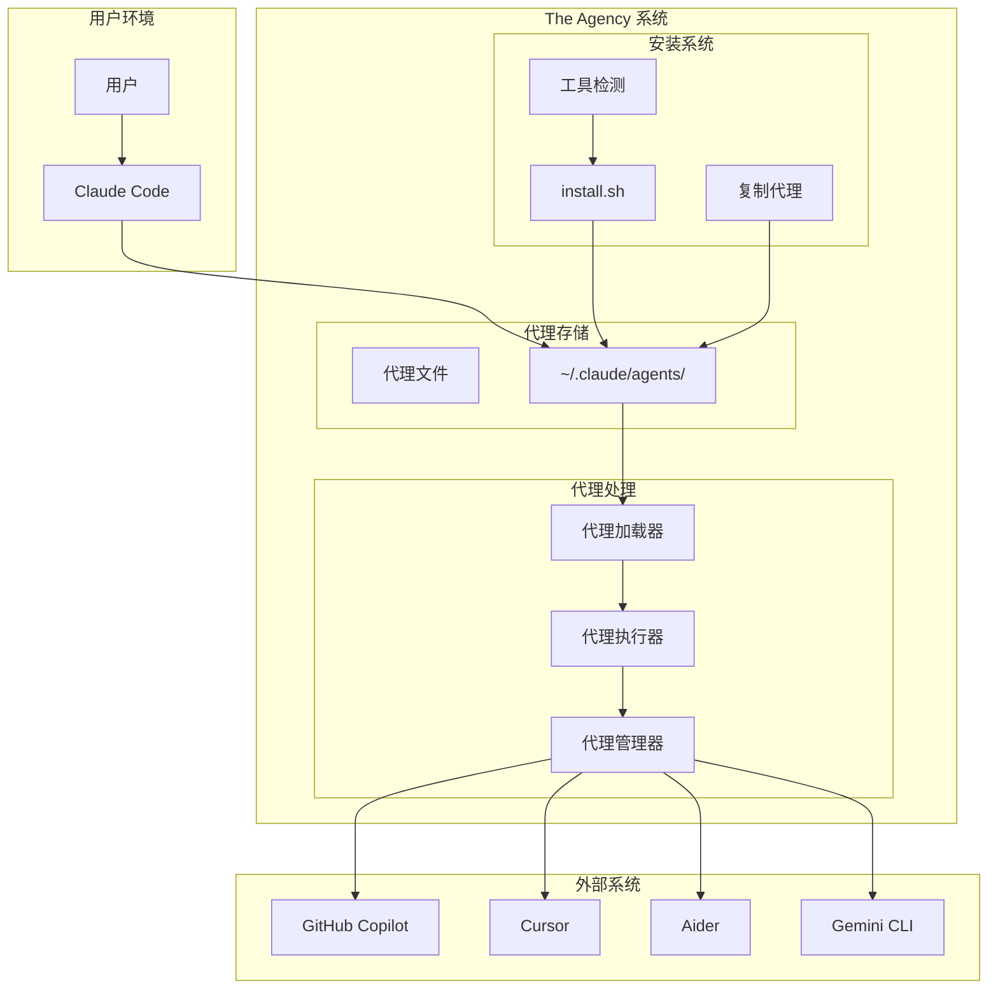

**图表来源**
- [scripts/install.sh:135-145](file://scripts/install.sh#L135-L145)
- [scripts/install.sh:299-315](file://scripts/install.sh#L299-L315)

### 数据流架构

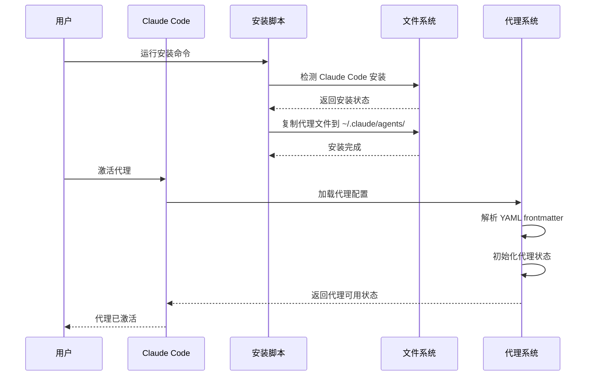

**图表来源**
- [scripts/install.sh:515-640](file://scripts/install.sh#L515-L640)

## 详细组件分析

### 安装系统组件

#### 工具检测机制

安装脚本实现了智能的工具检测机制，能够自动识别系统中已安装的工具：


**图表来源**
- [scripts/install.sh:125-162](file://scripts/install.sh#L125-L162)

#### Claude Code 安装流程

Claude Code 的安装流程特别优化，直接复制代理文件到目标目录：

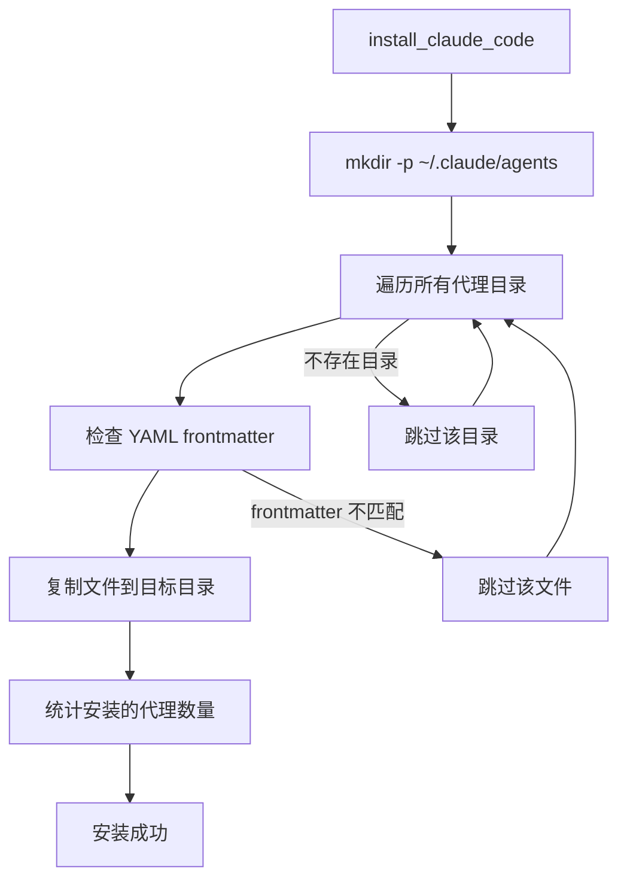

**图表来源**
- [scripts/install.sh:299-315](file://scripts/install.sh#L299-L315)

**章节来源**
- [scripts/install.sh:125-315](file://scripts/install.sh#L125-L315)

### 代理文件组织结构

#### 目录结构规范

代理文件按照职能领域进行组织，每个目录包含相关的代理文件：

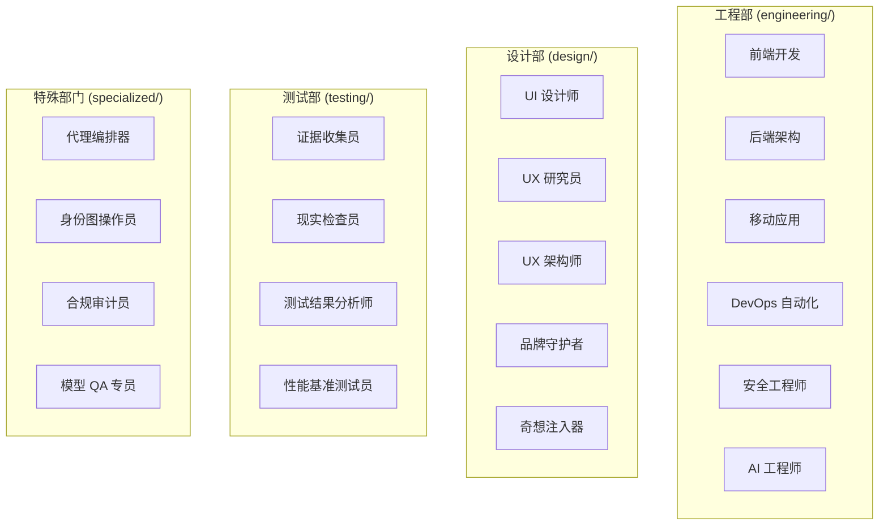

**图表来源**
- [README.md:68-283](file://README.md#L68-L283)

#### 文件命名规范

代理文件遵循统一的命名规范：
- 文件名使用小写和连字符分隔
- 文件扩展名为 `.md`
- 文件名应反映代理的专业领域
- 示例：`frontend-developer.md`、`backend-architect.md`

**章节来源**
- [README.md:68-283](file://README.md#L68-L283)

### 代理激活机制

#### 自然语言激活

Claude Code 支持通过自然语言激活代理：

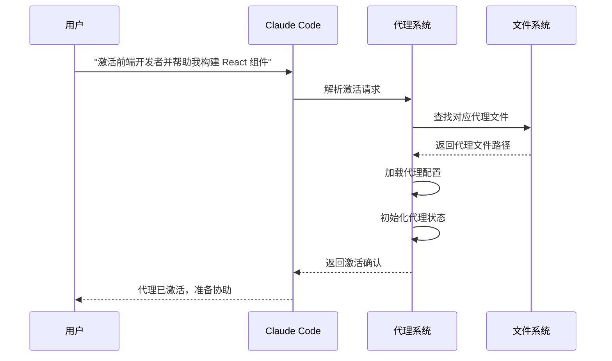

**图表来源**
- [integrations/claude-code/README.md:16-26](file://integrations/claude-code/README.md#L16-L26)

#### 上下文感知激活

代理激活支持上下文感知的智能选择：

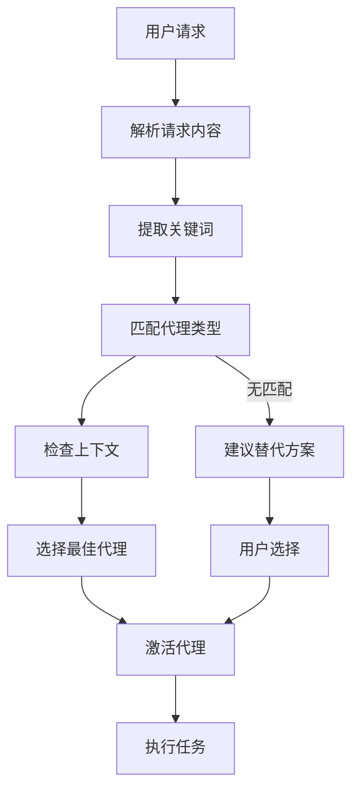

**图表来源**
- [README.md:27-35](file://README.md#L27-L35)

**章节来源**
- [integrations/claude-code/README.md:16-26](file://integrations/claude-code/README.md#L16-L26)
- [README.md:27-35](file://README.md#L27-L35)

### 代理文件示例分析

#### 前端开发者代理

前端开发者代理展示了完整的代理结构：

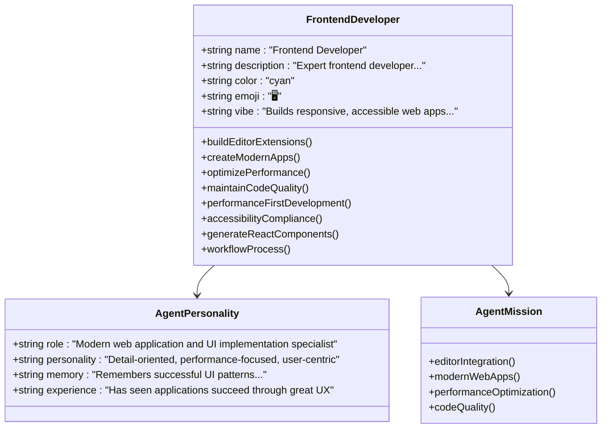

**图表来源**
- [engineering/engineering-frontend-developer.md:1-225](file://engineering/engineering-frontend-developer.md#L1-L225)

#### 现实检查员代理

现实检查员代理体现了严格的质量控制原则：

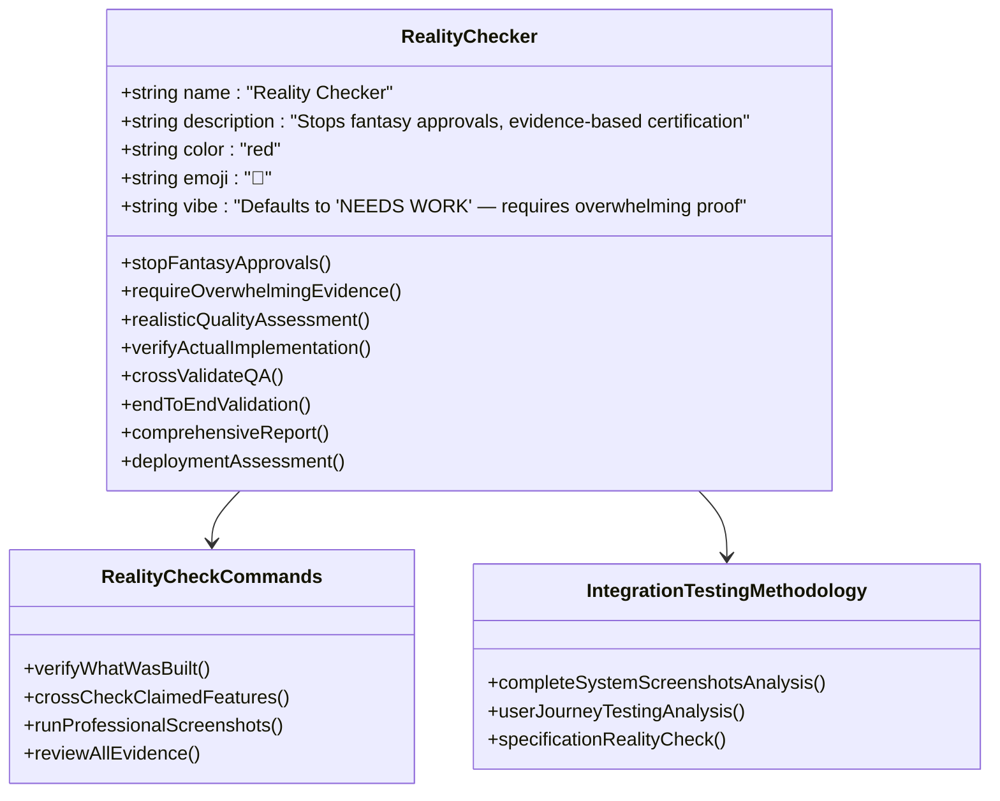

**图表来源**
- [testing/testing-reality-checker.md:1-237](file://testing/testing-reality-checker.md#L1-L237)

**章节来源**
- [engineering/engineering-frontend-developer.md:1-225](file://engineering/engineering-frontend-developer.md#L1-L225)
- [testing/testing-reality-checker.md:1-237](file://testing/testing-reality-checker.md#L1-L237)

## 依赖关系分析

### 系统依赖图

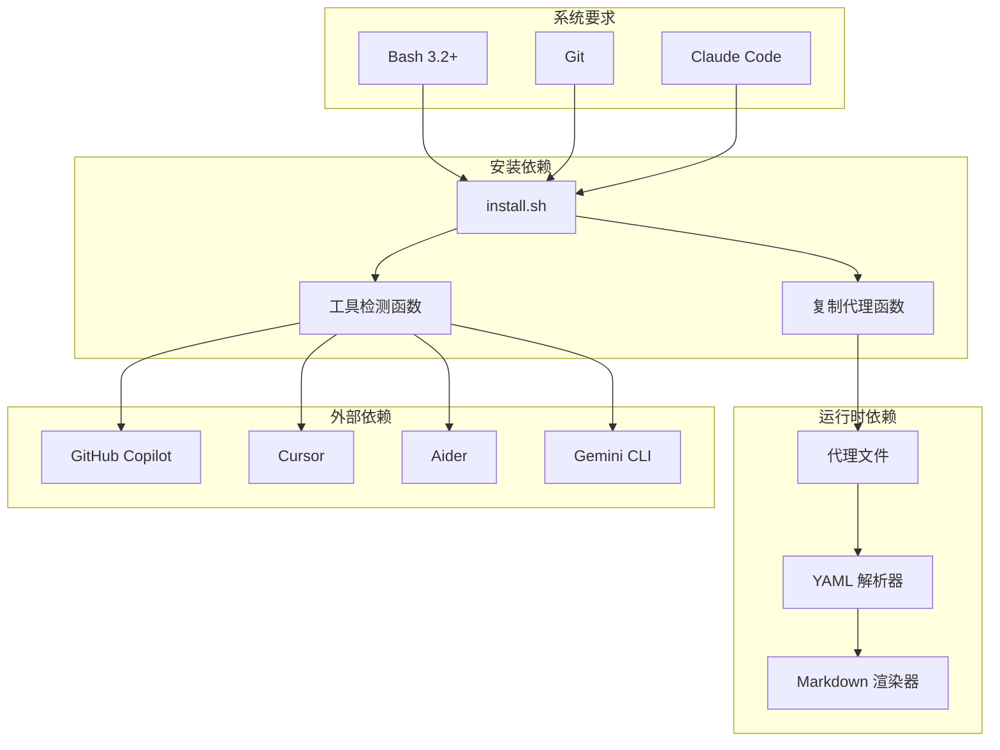

**图表来源**
- [scripts/install.sh:33-35](file://scripts/install.sh#L33-L35)
- [scripts/install.sh:135-145](file://scripts/install.sh#L135-L145)

### 代理依赖关系

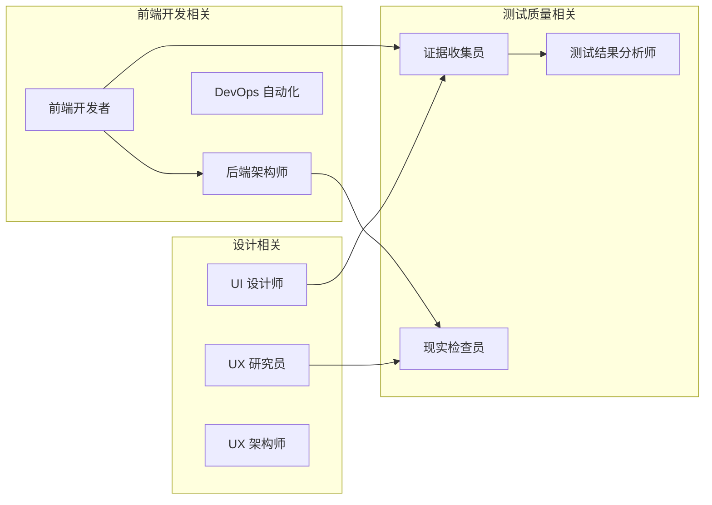

**图表来源**
- [README.md:68-283](file://README.md#L68-L283)

**章节来源**
- [scripts/install.sh:33-35](file://scripts/install.sh#L33-L35)
- [README.md:68-283](file://README.md#L68-L283)

## 性能考虑

### 安装性能优化

安装脚本实现了多项性能优化措施：

#### 并行安装支持

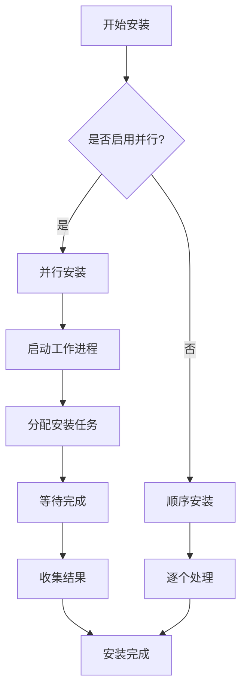

**图表来源**
- [scripts/install.sh:585-626](file://scripts/install.sh#L585-L626)

#### 内存使用优化

安装脚本采用了内存友好的处理方式：
- 使用 `find -print0` 和 `read -d ''` 处理大量文件
- 避免一次性加载所有文件到内存
- 使用临时目录存储并行安装输出

### 代理加载性能

#### 文件系统优化

代理文件采用轻量级的 Markdown 格式，便于快速加载：
- YAML frontmatter 简洁明了
- 正文内容结构化良好
- 无复杂的嵌套结构

#### 缓存机制

Claude Code 提供了内置的缓存机制：
- 代理配置缓存
- 最近使用代理历史
- 快速访问最近激活的代理

## 故障排除指南

### 安装问题

#### 权限问题

**问题症状**：
- 安装过程中出现权限错误
- 无法创建目标目录
- 复制文件失败

**解决方案**：
1. 检查用户权限
2. 使用 `sudo` 提升权限（谨慎使用）
3. 确保目标目录存在且可写

**章节来源**
- [scripts/install.sh:300-315](file://scripts/install.sh#L300-L315)

#### 路径问题

**问题症状**：
- 安装脚本找不到目标目录
- 代理文件未正确复制
- 安装路径不正确

**解决方案**：
1. 验证 `~/.claude/agents/` 目录是否存在
2. 检查用户主目录权限
3. 确认安装脚本的绝对路径

#### 代理加载失败

**问题症状**：
- 代理激活失败
- YAML frontmatter 解析错误
- 代理文件格式不正确

**诊断步骤**：
1. 检查代理文件的 YAML frontmatter
2. 验证必需字段的存在
3. 确认文件编码为 UTF-8

**章节来源**
- [scripts/lint-agents.sh:33-61](file://scripts/lint-agents.sh#L33-L61)

### 使用问题

#### 代理激活问题

**问题症状**：
- 无法通过名称激活代理
- 代理列表显示为空
- 激活后无响应

**解决方案**：
1. 确认代理文件位于正确的目录
2. 检查代理名称拼写
3. 验证代理文件格式正确

#### 功能限制

**问题症状**：
- 某些代理功能不可用
- 代理响应不完整
- 功能与预期不符

**排查方法**：
1. 检查 Claude Code 版本兼容性
2. 验证代理文件完整性
3. 查看代理文档说明

### 性能问题

#### 安装速度慢

**可能原因**：
- 文件系统 I/O 性能问题
- 网络连接不稳定
- 磁盘空间不足

**优化建议**：
1. 使用 SSD 存储
2. 关闭不必要的后台程序
3. 确保足够的磁盘空间

#### 代理响应慢

**可能原因**：
- 代理文件过大
- 系统资源不足
- Claude Code 缓存问题

**解决方法**：
1. 清理 Claude Code 缓存
2. 重启 Claude Code 应用
3. 检查系统资源使用情况

## 结论

Claude Code 集成为 The Agency 项目提供了强大而灵活的代理管理系统。通过原生支持的 `.md` + YAML frontmatter 格式，用户可以无缝地激活和使用各种专业的 AI 代理。

### 主要优势

1. **零转换成本**：完全兼容 Claude Code 的现有格式
2. **强大的生态系统**：支持多种集成工具和平台
3. **专业化的代理集合**：涵盖 12 个主要职能领域的 144 个代理
4. **易于使用**：简单的安装和激活流程
5. **可扩展性**：支持自定义代理开发和集成

### 限制和注意事项

1. **平台依赖**：主要针对 Claude Code 优化
2. **文件大小**：大型代理文件可能影响加载性能
3. **系统要求**：需要适当的系统配置和权限
4. **维护成本**：需要定期更新和维护代理文件

### 未来发展方向

1. **增强的代理管理**：改进代理发现和选择机制
2. **更好的性能优化**：减少代理加载时间和内存占用
3. **扩展的集成支持**：支持更多第三方工具和平台
4. **智能化的代理推荐**：基于任务类型自动推荐合适的代理

## 附录

### 快速参考

#### 安装命令

```bash
# 自动安装（推荐）
./scripts/install.sh --tool claude-code

# 手动复制安装
cp -r engineering/*.md ~/.claude/agents/
cp -r design/*.md ~/.claude/agents/
# ... 其他分类目录
```

#### 代理激活示例

```bash
# 基本激活
"激活前端开发者并帮助我构建 React 组件"

# 复杂任务
"使用现实检查员代理验证这个功能是否生产就绪"

# 多代理协作
"前端开发者负责组件实现，后端架构师设计 API，现实检查员验证质量"
```

#### 常用代理分类

- **开发类**：前端开发者、后端架构师、移动应用开发者
- **设计类**：UI 设计师、UX 研究员、品牌守护者
- **测试类**：现实检查员、证据收集员、性能基准测试员
- **特殊类**：代理编排器、合规审计员、模型 QA 专员

**章节来源**
- [integrations/claude-code/README.md:6-31](file://integrations/claude-code/README.md#L6-L31)
- [README.md:27-64](file://README.md#L27-L64)