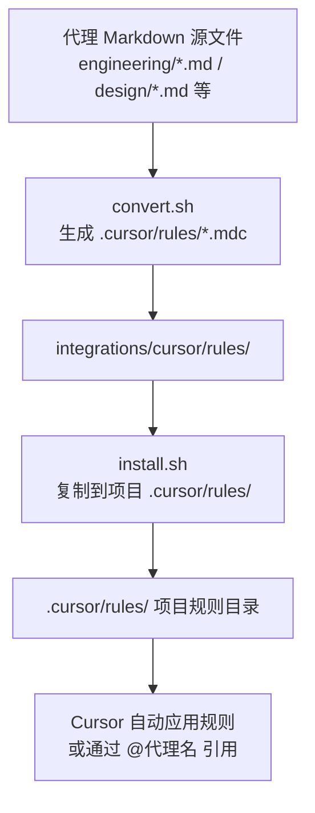
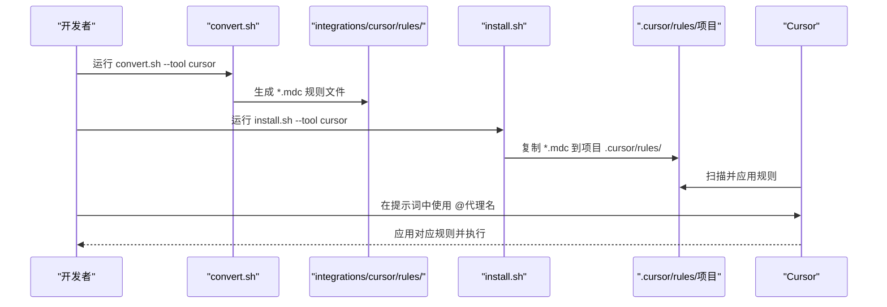
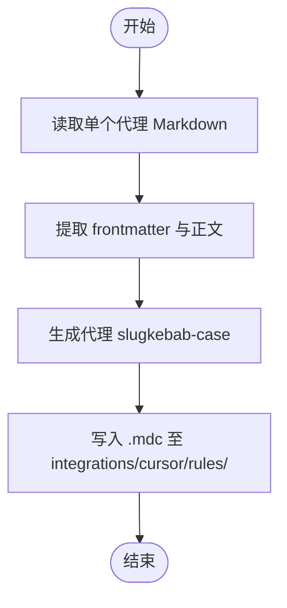
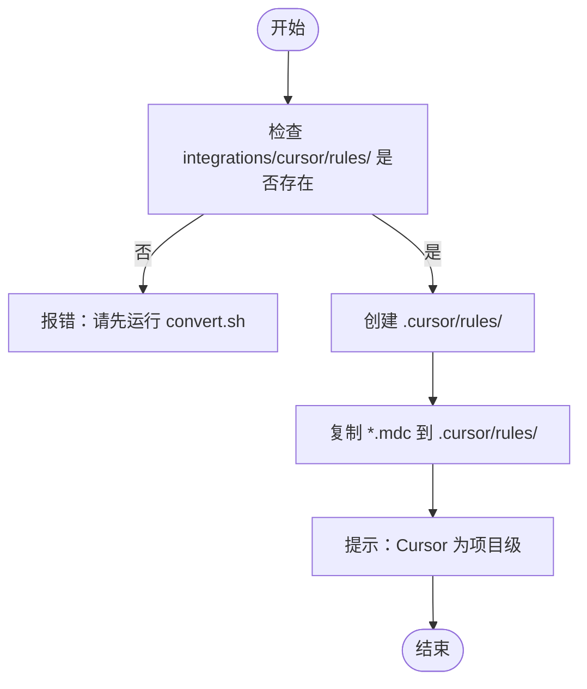

# Cursor 集成

<cite>
**本文引用的文件**
- [integrations/cursor/README.md](file://integrations/cursor/README.md)
- [scripts/install.sh](file://scripts/install.sh)
- [scripts/convert.sh](file://scripts/convert.sh)
- [README.md](file://README.md)
- [engineering-frontend-developer.md](file://engineering/engineering-frontend-developer.md)
- [design-ui-designer.md](file://design/design-ui-designer.md)
</cite>

## 目录
1. [简介](#简介)
2. [项目结构](#项目结构)
3. [核心组件](#核心组件)
4. [架构总览](#架构总览)
5. [详细组件分析](#详细组件分析)
6. [依赖关系分析](#依赖关系分析)
7. [性能考量](#性能考量)
8. [故障排除指南](#故障排除指南)
9. [结论](#结论)
10. [附录](#附录)

## 简介
本指南面向希望在 Cursor 中使用 The Agency 代理的用户，系统讲解 Cursor 规则文件系统与 .mdc 规则文件的生成、安装、激活与使用方法，并提供故障排除与最佳实践建议。Cursor 集成为“项目级”（project-scoped），安装后会将每个代理转换为一个 .mdc 规则文件，放置于项目根目录下的 .cursor/rules/ 目录中。

## 项目结构
- Cursor 集成通过 convert.sh 将各代理 Markdown 文件转换为 .mdc 规则文件，输出到 integrations/cursor/rules/。
- 安装器 install.sh 将这些 .mdc 文件复制到当前项目的 .cursor/rules/ 目录，实现项目级启用。
- Cursor 在项目中自动检测并应用 .cursor/rules/ 下的规则；也可在对话中通过 @代理名 的方式显式引用。

图表来源
- [scripts/convert.sh:228-249](file://scripts/convert.sh#L228-L249)
- [scripts/install.sh:414-426](file://scripts/install.sh#L414-L426)
- [integrations/cursor/README.md:1-39](file://integrations/cursor/README.md#L1-L39)

章节来源
- [integrations/cursor/README.md:1-39](file://integrations/cursor/README.md#L1-L39)
- [scripts/convert.sh:228-249](file://scripts/convert.sh#L228-L249)
- [scripts/install.sh:414-426](file://scripts/install.sh#L414-L426)

## 核心组件
- 转换器（convert.sh）：读取各代理 Markdown 文件，提取 frontmatter 与正文，生成 .mdc 规则文件，写入 integrations/cursor/rules/。
- 安装器（install.sh）：检测目标项目，将 .mdc 文件复制到 .cursor/rules/，完成项目级安装。
- Cursor 规则文件（.mdc）：包含描述、匹配模式与始终生效开关等元信息，用于 Cursor 自动或手动触发代理行为。

章节来源
- [scripts/convert.sh:228-249](file://scripts/convert.sh#L228-L249)
- [scripts/install.sh:414-426](file://scripts/install.sh#L414-L426)
- [integrations/cursor/README.md:1-39](file://integrations/cursor/README.md#L1-L39)

## 架构总览
下图展示从代理源文件到 Cursor 生效的关键步骤与文件流转：

图表来源
- [scripts/convert.sh:228-249](file://scripts/convert.sh#L228-L249)
- [scripts/install.sh:414-426](file://scripts/install.sh#L414-L426)
- [integrations/cursor/README.md:1-39](file://integrations/cursor/README.md#L1-L39)

## 详细组件分析

### 转换器：convert.sh 的 Cursor 转换逻辑
- 输入：各代理 Markdown 文件（含 YAML frontmatter 与正文）。
- 输出：integrations/cursor/rules/ 下的 .mdc 文件，文件名为代理名称的 kebab-case 形式。
- 元信息：.mdc 的 frontmatter 包含 description、globs、alwaysApply 字段，正文为原始代理内容。

图表来源
- [scripts/convert.sh:228-249](file://scripts/convert.sh#L228-L249)

章节来源
- [scripts/convert.sh:228-249](file://scripts/convert.sh#L228-L249)

### 安装器：install.sh 的 Cursor 安装逻辑
- 检查 integrations/cursor 是否存在；不存在则提示先运行 convert.sh。
- 创建项目 .cursor/rules/ 目录。
- 将所有 *.mdc 文件复制到该目录，完成项目级安装。
- 提示：Cursor 为项目级工具，需在项目根目录运行安装命令。

图表来源
- [scripts/install.sh:414-426](file://scripts/install.sh#L414-L426)

章节来源
- [scripts/install.sh:414-426](file://scripts/install.sh#L414-L426)

### .mdc 规则文件的结构与配置项
- 文件命名：基于代理名称生成的 slug，扩展名为 .mdc。
- 前言块（frontmatter）字段：
  - description：规则描述，用于 Cursor 展示与识别。
  - globs：文件路径匹配模式，决定规则适用的文件类型或目录。
  - alwaysApply：布尔值，控制是否始终应用该规则。
- 正文：保留原代理内容，作为规则的上下文与执行依据。

章节来源
- [scripts/convert.sh:228-249](file://scripts/convert.sh#L228-L249)
- [integrations/cursor/README.md:24-32](file://integrations/cursor/README.md#L24-L32)

### 在 Cursor 中激活与使用代理规则
- 自动应用：Cursor 在项目中扫描 .cursor/rules/，根据 globs 与 alwaysApply 自动应用规则。
- 显式引用：在 Cursor 对话中通过 @代理名 的方式显式调用特定规则。
- 示例参考：
  - 使用 @frontend-developer 规则审查 React 组件。
  - 编辑 .mdc 的 frontmatter，设置 globs 与 alwaysApply 实现更精细的控制。

章节来源
- [integrations/cursor/README.md:16-32](file://integrations/cursor/README.md#L16-L32)

### 代理示例与规则映射
- Frontend Developer 代理：展示前端开发领域的身份、使命、规则、交付物与工作流。
- UI Designer 代理：展示设计系统、组件库与响应式设计的完整框架与模板。

章节来源
- [engineering-frontend-developer.md:1-225](file://engineering/engineering-frontend-developer.md#L1-L225)
- [design-ui-designer.md:1-383](file://design/design-ui-designer.md#L1-L383)

## 依赖关系分析
- convert.sh 依赖各代理 Markdown 文件的 frontmatter 结构与正文格式。
- install.sh 依赖 convert.sh 的输出目录 integrations/cursor/rules/。
- Cursor 依赖项目根目录 .cursor/rules/ 下的 .mdc 文件进行规则应用。

图表来源
- [scripts/convert.sh:228-249](file://scripts/convert.sh#L228-L249)
- [scripts/install.sh:414-426](file://scripts/install.sh#L414-L426)
- [integrations/cursor/README.md:1-39](file://integrations/cursor/README.md#L1-L39)

章节来源
- [scripts/convert.sh:228-249](file://scripts/convert.sh#L228-L249)
- [scripts/install.sh:414-426](file://scripts/install.sh#L414-L426)
- [integrations/cursor/README.md:1-39](file://integrations/cursor/README.md#L1-L39)

## 性能考量
- 并行转换与安装：convert.sh 与 install.sh 均支持并行模式，可显著缩短大规模代理转换与安装时间。
- 规则匹配开销：globs 过宽可能导致不必要的匹配与处理，建议按需细化匹配模式。
- 项目规模：代理数量越多，.mdc 文件越多，Cursor 扫描与应用规则的时间成本越高，建议按需启用必要规则。

## 故障排除指南
- 规则文件未生成
  - 现象：integrations/cursor/rules/ 为空或缺失。
  - 排查：确认已运行 convert.sh --tool cursor，且各代理文件具备标准 frontmatter。
  - 参考：convert.sh 的 Cursor 转换逻辑与输出目录。
- 安装时报“缺少 integrations/cursor”
  - 现象：install.sh 报错提示需要先运行 convert.sh。
  - 排查：先执行 convert.sh，再执行 install.sh。
  - 参考：install.sh 的校验逻辑。
- Cursor 未检测到规则
  - 现象：项目中新建 .cursor/rules/ 后规则未生效。
  - 排查：确保在项目根目录运行 install.sh；检查 .mdc 文件的 frontmatter 是否正确；确认 Cursor 已刷新或重启。
  - 参考：install.sh 的复制逻辑与 Cursor 使用说明。
- 规则不按预期生效
  - 现象：alwaysApply 未生效或 globs 不匹配。
  - 排查：编辑 .mdc 的 frontmatter，调整 globs 与 alwaysApply；验证文件路径与通配符。
  - 参考：.mdc 前言块字段定义。
- 项目范围配置问题
  - 现象：规则在其他项目无效。
  - 说明：Cursor 为项目级工具，规则仅在当前项目 .cursor/rules/ 生效；跨项目需重复安装。
  - 参考：Cursor 集成说明。

章节来源
- [scripts/convert.sh:228-249](file://scripts/convert.sh#L228-L249)
- [scripts/install.sh:414-426](file://scripts/install.sh#L414-L426)
- [integrations/cursor/README.md:1-39](file://integrations/cursor/README.md#L1-L39)

## 结论
通过 convert.sh 与 install.sh 的配合，The Agency 的代理可被高效转换并安装为 Cursor 的 .mdc 规则文件，实现项目级的规则应用与显式引用。遵循本文的安装流程、规则结构与故障排除建议，可稳定地在 Cursor 中使用代理能力，提升开发与设计效率。

## 附录

### 快速操作清单
- 生成 .mdc 规则文件
  - 运行：./scripts/convert.sh --tool cursor
- 安装到项目
  - 在项目根目录运行：./scripts/install.sh --tool cursor
- 在 Cursor 中使用
  - 在提示词中使用 @代理名 引用规则
  - 或编辑 .mdc 的 frontmatter 设置 globs 与 alwaysApply

章节来源
- [integrations/cursor/README.md:6-38](file://integrations/cursor/README.md#L6-L38)
- [README.md:528-588](file://README.md#L528-L588)