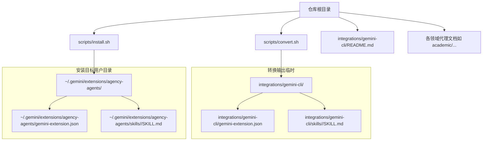
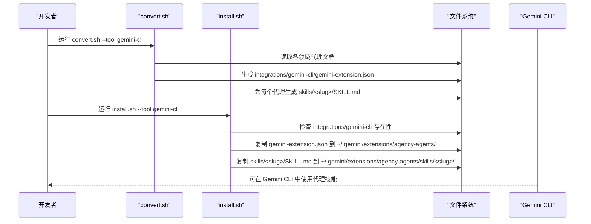
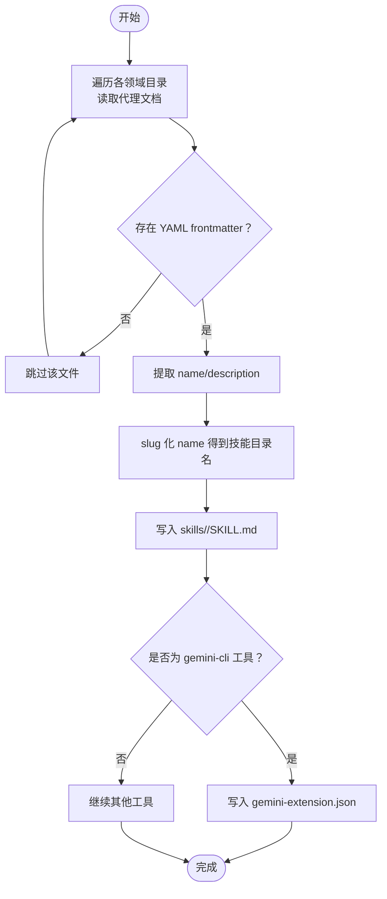
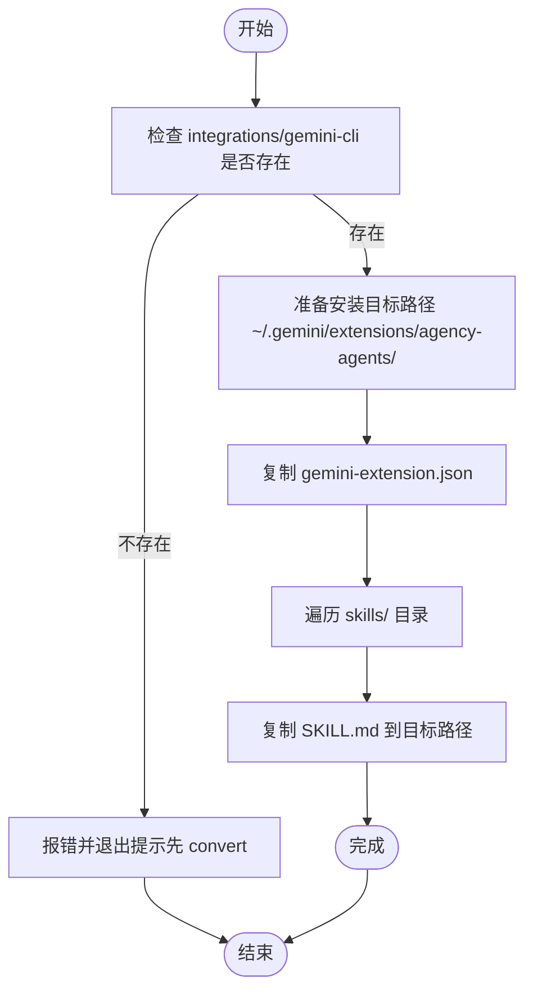

# Gemini CLI 集成

<cite>
**本文引用的文件**
- [README.md](file://README.md)
- [integrations/gemini-cli/README.md](file://integrations/gemini-cli/README.md)
- [scripts/convert.sh](file://scripts/convert.sh)
- [scripts/install.sh](file://scripts/install.sh)
- [academic/academic-anthropologist.md](file://academic/academic-anthropologist.md)
- [examples/README.md](file://examples/README.md)
</cite>

## 目录
1. [简介](#简介)
2. [项目结构](#项目结构)
3. [核心组件](#核心组件)
4. [架构总览](#架构总览)
5. [详细组件分析](#详细组件分析)
6. [依赖关系分析](#依赖关系分析)
7. [性能考量](#性能考量)
8. [故障排除指南](#故障排除指南)
9. [结论](#结论)
10. [附录](#附录)

## 简介
本指南面向希望在 Gemini CLI 中使用 The Agency 代理集合的用户，重点讲解 Gemini CLI 扩展系统的集成方式与使用方法。内容涵盖：
- Gemini CLI 扩展系统的工作原理（扩展包生成与安装）
- 安装流程与关键步骤（转换步骤的重要性、扩展包生成、安装路径配置）
- 使用示例（如何在 Gemini CLI 中激活与使用代理技能）
- 扩展包结构与配置文件说明
- 常见问题排查（生成失败、安装问题、权限问题等）
- 平台特点与使用注意事项

## 项目结构
The Agency 提供统一的代理定义与多工具集成脚本。Gemini CLI 集成为其中一环，通过 convert.sh 将标准代理文档转换为 Gemini CLI 扩展所需的格式，并由 install.sh 安装到用户本地目录。

图表来源
- [scripts/convert.sh](file://scripts/convert.sh)
- [scripts/install.sh](file://scripts/install.sh)
- [integrations/gemini-cli/README.md](file://integrations/gemini-cli/README.md)

章节来源
- [README.md](file://README.md)
- [integrations/gemini-cli/README.md](file://integrations/gemini-cli/README.md)

## 核心组件
- 转换脚本：将各领域代理文档转换为 Gemini CLI 扩展所需格式，并生成扩展清单文件。
- 安装脚本：检测本地环境，将转换后的扩展复制到用户目录，完成安装。
- 代理文档：采用统一的 YAML frontmatter + Markdown 正文结构，便于转换器提取元数据与正文内容。
- 扩展清单：gemini-extension.json，声明扩展名称与版本。
- 技能文件：每个代理对应一个 SKILL.md，包含最小化 frontmatter（仅 name 与 description）与正文。

章节来源
- [scripts/convert.sh](file://scripts/convert.sh)
- [scripts/install.sh](file://scripts/install.sh)
- [academic/academic-anthropologist.md](file://academic/academic-anthropologist.md)
- [integrations/gemini-cli/README.md](file://integrations/gemini-cli/README.md)

## 架构总览
下图展示从代理文档到 Gemini CLI 扩展安装的端到端流程。

图表来源
- [scripts/convert.sh](file://scripts/convert.sh)
- [scripts/install.sh](file://scripts/install.sh)

## 详细组件分析

### 转换器（convert.sh）与 Gemini CLI 扩展生成
- 输入：各领域目录下的代理文档（Markdown），要求具有 YAML frontmatter（name、description 等字段）。
- 输出：integrations/gemini-cli/ 下的扩展清单与技能文件。
- 关键逻辑：
  - 读取 frontmatter 的 name 与 description，生成技能目录与 SKILL.md。
  - 生成 gemini-extension.json（扩展清单），包含扩展名与版本。
  - 采用 slug 化处理，确保技能目录名符合 Gemini CLI 规范。
  - 支持并行转换（--parallel），提升大规模代理转换效率。

图表来源
- [scripts/convert.sh](file://scripts/convert.sh)

章节来源
- [scripts/convert.sh](file://scripts/convert.sh)

### 安装器（install.sh）与安装路径配置
- 检测：install.sh 在执行前会检查 integrations/gemini-cli 是否存在，不存在则提示先运行 convert.sh。
- 目标路径：~/.gemini/extensions/agency-agents/（扩展根目录）。
- 安装内容：
  - 复制 gemini-extension.json 到扩展根目录。
  - 逐个技能目录复制 SKILL.md 到扩展根目录下的 skills/<slug>/。
- 并行安装：支持 --parallel 与 --jobs N，加速多工具或多个技能的安装过程。
- 交互式选择：在终端环境下可交互勾选要安装的工具；非交互模式下自动检测已安装工具。

图表来源
- [scripts/install.sh](file://scripts/install.sh)

章节来源
- [scripts/install.sh](file://scripts/install.sh)

### 扩展包结构与配置文件
- 扩展根目录：~/.gemini/extensions/agency-agents/
- 扩展清单：gemini-extension.json（包含扩展名与版本）
- 技能目录：skills/<slug>/，每个代理对应一个 SKILL.md
- 结构示意（来自 README）：
  - ~/.gemini/extensions/agency-agents/
    - gemini-extension.json
    - skills/
      - <slug>/SKILL.md
      - ...（其余代理）

章节来源
- [integrations/gemini-cli/README.md](file://integrations/gemini-cli/README.md)

### 使用示例：在 Gemini CLI 中激活与使用代理技能
- 激活方式：在 Gemini CLI 中直接引用代理名称即可激活相应技能。
- 示例参考：README 中给出“Use the frontend-developer skill to help me build this UI.”的用法。
- 注意：技能名称基于代理文档的 name 字段经 slug 化生成，确保与安装后目录一致。

章节来源
- [integrations/gemini-cli/README.md](file://integrations/gemini-cli/README.md)
- [README.md](file://README.md)

## 依赖关系分析
- convert.sh 依赖于各领域代理文档的 frontmatter 结构与正文内容，用于生成 SKILL.md 与 gemini-extension.json。
- install.sh 依赖 convert.sh 的输出（integrations/gemini-cli/），并在用户目录中进行复制安装。
- 两者均支持并行模式，以提升大规模代理的处理效率。

图表来源
- [scripts/convert.sh](file://scripts/convert.sh)
- [scripts/install.sh](file://scripts/install.sh)

章节来源
- [scripts/convert.sh](file://scripts/convert.sh)
- [scripts/install.sh](file://scripts/install.sh)

## 性能考量
- 并行转换与安装：convert.sh 与 install.sh 均支持 --parallel 与 --jobs N，建议在多核机器上启用以缩短等待时间。
- 输出顺序：并行模式下不同工具或技能的输出顺序可能不固定，属于预期行为。
- I/O 优化：install.sh 在复制前会检查目标路径是否存在，避免重复复制；convert.sh 仅写入必要文件，减少冗余。

章节来源
- [scripts/convert.sh](file://scripts/convert.sh)
- [scripts/install.sh](file://scripts/install.sh)

## 故障排除指南
- 生成失败（convert.sh）
  - 现象：找不到 integrations/gemini-cli 或生成的 SKILL.md 缺失。
  - 排查：确认已先运行 convert.sh --tool gemini-cli；检查代理文档是否包含有效的 YAML frontmatter。
  - 参考：convert.sh 会在生成 gemini-cli 工具时写入 gemini-extension.json。
- 安装失败（install.sh）
  - 现象：提示 integrations/gemini-cli 不存在或缺少 gemini-extension.json/skills。
  - 排查：先运行 convert.sh --tool gemini-cli，再运行 install.sh --tool gemini-cli。
  - 权限问题：若安装到用户目录失败，请检查当前用户的写权限；必要时以管理员身份运行（不推荐）。
- 技能未显示
  - 现象：在 Gemini CLI 中无法找到代理技能。
  - 排查：确认技能目录名与代理文档的 name 经 slug 化后的值一致；确认 SKILL.md 已正确复制到 ~/.gemini/extensions/agency-agents/skills/<slug>/。
- 并行模式异常
  - 现象：并行安装/转换时输出顺序混乱或部分任务失败。
  - 排查：尝试降低 --jobs 数量；关闭并行模式重试；检查磁盘空间与并发限制。

章节来源
- [scripts/convert.sh](file://scripts/convert.sh)
- [scripts/install.sh](file://scripts/install.sh)
- [integrations/gemini-cli/README.md](file://integrations/gemini-cli/README.md)

## 结论
通过 convert.sh 与 install.sh，The Agency 的代理文档被标准化转换为 Gemini CLI 扩展，并安装到用户本地目录。遵循“先转换、后安装”的流程，即可在 Gemini CLI 中直接引用代理名称激活相应技能。遇到问题时，优先检查转换与安装步骤是否完整执行，并确保技能目录命名与 frontmatter 一致。

## 附录
- 快速开始（命令行）
  - 先生成 Gemini CLI 扩展文件：./scripts/convert.sh --tool gemini-cli
  - 再安装扩展：./scripts/install.sh --tool gemini-cli
- 扩展包结构参考
  - ~/.gemini/extensions/agency-agents/
    - gemini-extension.json
    - skills/
      - <slug>/SKILL.md
- 使用示例参考
  - 在 Gemini CLI 中输入类似“Use the frontend-developer skill to help me build this UI.”的指令即可激活技能。

章节来源
- [integrations/gemini-cli/README.md](file://integrations/gemini-cli/README.md)
- [README.md](file://README.md)