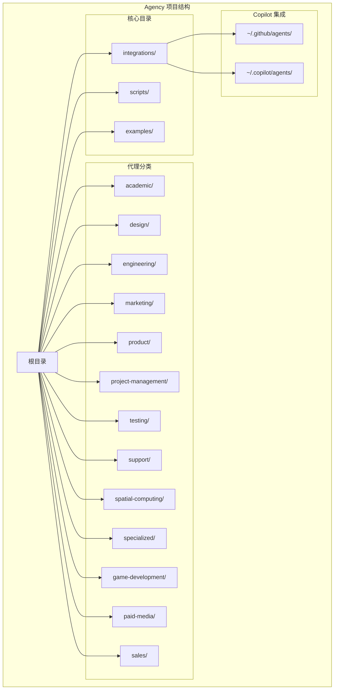
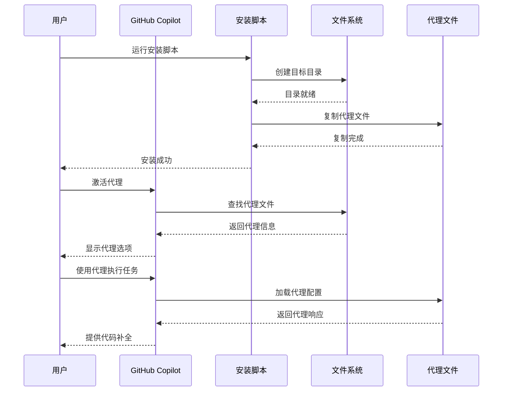
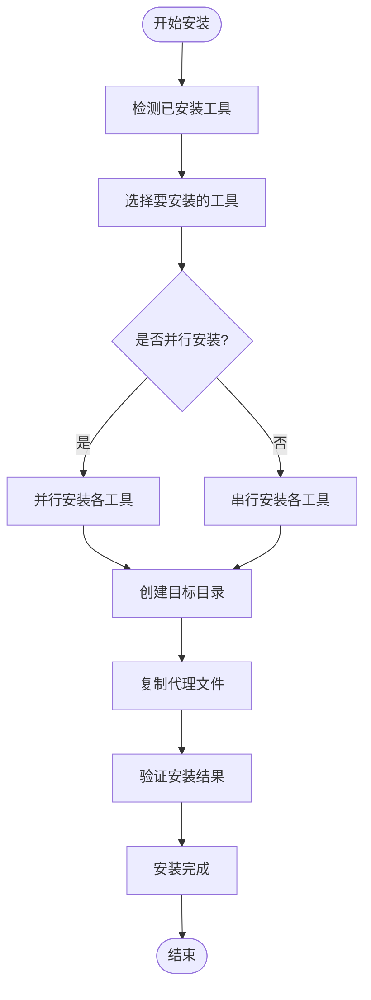
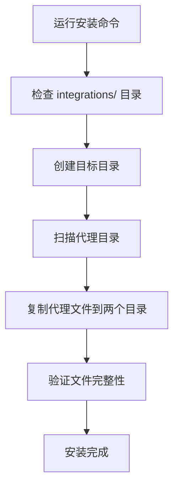
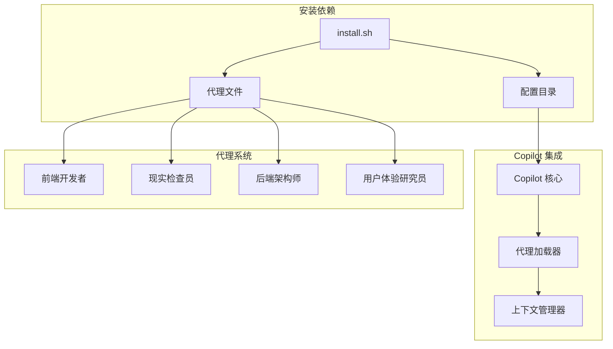

# GitHub Copilot 集成

<cite>
**本文档引用的文件**
- [integrations/github-copilot/README.md](file://integrations/github-copilot/README.md)
- [scripts/install.sh](file://scripts/install.sh)
- [README.md](file://README.md)
- [integrations/README.md](file://integrations/README.md)
- [engineering/engineering-frontend-developer.md](file://engineering/engineering-frontend-developer.md)
- [testing/testing-reality-checker.md](file://testing/testing-reality-checker.md)
- [examples/README.md](file://examples/README.md)
</cite>

## 目录
1. [简介](#简介)
2. [项目结构](#项目结构)
3. [核心组件](#核心组件)
4. [架构概览](#架构概览)
5. [详细组件分析](#详细组件分析)
6. [依赖关系分析](#依赖关系分析)
7. [性能考虑](#性能考虑)
8. [故障排除指南](#故障排除指南)
9. [结论](#结论)
10. [附录](#附录)

## 简介
GitHub Copilot 是微软开发的 AI 代码助手，能够通过自然语言提示生成代码、补全函数和提供智能建议。它集成了多种 AI 模型，支持多种编程语言，并提供了强大的代码补全功能。Copilot 的优势在于其深度学习能力、对上下文的理解以及与开发环境的无缝集成。

Copilot 的工作原理基于大规模语言模型，通过分析用户提供的自然语言描述和现有代码上下文，生成相应的代码片段或完整的函数实现。它能够理解复杂的编程概念，如算法设计、数据结构、框架特定的模式等，并根据最佳实践生成高质量的代码。

Copilot 的生态系统包括：
- 原生支持：无需转换即可直接使用现有的 `.md` + YAML frontmatter 格式
- 多平台支持：支持 Linux、macOS 和 Windows（Git Bash/WSL）
- 丰富的代理集合：包含 144 个专业化的 AI 代理
- 无缝集成：与各种开发工具和 IDE 无缝集成

## 项目结构
Agency 项目为 GitHub Copilot 提供了完整的集成支持，采用模块化的设计理念，将不同领域的专业代理组织在相应的目录中。



**图表来源**
- [README.md: 68-283:68-283](file://README.md#L68-L283)
- [integrations/README.md: 1-209:1-209](file://integrations/README.md#L1-L209)

**章节来源**
- [README.md: 68-283:68-283](file://README.md#L68-L283)
- [integrations/README.md: 1-209:1-209](file://integrations/README.md#L1-L209)

## 核心组件
Agency 项目的核心是其精心设计的 AI 代理系统，这些代理具有明确的专业领域、个性特征和工作流程。每个代理都包含以下关键元素：

### 代理模板结构
所有代理文件都遵循统一的 YAML frontmatter 格式，包含元数据信息：
- **name**: 代理名称
- **description**: 功能描述
- **color**: 显示颜色
- **emoji**: 表情符号
- **vibe**: 个性描述

### 代理身份与记忆
代理包含详细的个人资料和记忆机制：
- **角色定位**: 明确的专业领域和职责范围
- **个性特征**: 独特的沟通风格和技术偏好
- **经验积累**: 记忆成功的模式和最佳实践
- **技术专长**: 领域内的专业知识和技能

### 核心使命与规则
每个代理都有明确的任务目标和执行规则：
- **核心任务**: 专业领域的具体职责
- **关键规则**: 必须遵守的技术标准和质量要求
- **交付成果**: 可量化的输出和成功指标

**章节来源**
- [engineering/engineering-frontend-developer.md: 1-200:1-200](file://engineering/engineering-frontend-developer.md#L1-L200)
- [testing/testing-reality-checker.md: 1-200:1-200](file://testing/testing-reality-checker.md#L1-L200)

## 架构概览
Agency 项目为 GitHub Copilot 提供了无缝的集成体验，采用"原生支持 + 自动安装"的设计模式。



**图表来源**
- [scripts/install.sh: 317-336:317-336](file://scripts/install.sh#L317-L336)
- [integrations/github-copilot/README.md: 1-33:1-33](file://integrations/github-copilot/README.md#L1-L33)

### 安装架构
安装过程采用并行处理和自动检测机制：



**图表来源**
- [scripts/install.sh: 515-637:515-637](file://scripts/install.sh#L515-L637)

**章节来源**
- [scripts/install.sh: 1-640:1-640](file://scripts/install.sh#L1-L640)
- [README.md: 508-590:508-590](file://README.md#L508-L590)

## 详细组件分析

### Copilot 安装组件
安装脚本提供了完整的 Copilot 集成解决方案，支持多种安装方式和平台。

#### 安装脚本功能
安装脚本的主要功能包括：
- **工具检测**: 自动检测系统中已安装的工具
- **并行处理**: 支持多工具并行安装以提高效率
- **交互界面**: 提供直观的工具选择界面
- **错误处理**: 完善的错误检测和处理机制

#### 目标目录结构
Copilot 需要两个目标目录来存储代理文件：
- `~/.github/agents/`: GitHub Copilot 主目录
- `~/.copilot/agents/`: Copilot 兼容目录

#### 安装流程


**图表来源**
- [scripts/install.sh: 317-336:317-336](file://scripts/install.sh#L317-L336)

**章节来源**
- [scripts/install.sh: 13-32:13-32](file://scripts/install.sh#L13-L32)
- [scripts/install.sh: 317-336:317-336](file://scripts/install.sh#L317-L336)

### 代理激活组件
Copilot 支持通过自然语言激活代理，无需复杂的配置过程。

#### 激活语法
代理可以通过多种方式激活：
- `Activate Frontend Developer and help me build a React component.`
- `Use the Reality Checker agent to verify this feature is production-ready.`

#### 代理发现机制
Copilot 会自动扫描目标目录中的代理文件，并提供智能建议：
- 支持模糊匹配和自动补全
- 显示代理的简要描述和功能
- 支持按类别筛选代理

**章节来源**
- [integrations/github-copilot/README.md: 17-27:17-27](file://integrations/github-copilot/README.md#L17-L27)

### 代理文件格式
每个代理文件都遵循统一的结构，确保 Copilot 能够正确解析和执行。

#### YAML Frontmatter 结构
```yaml
---
name: Frontend Developer
description: Expert frontend developer specializing in modern web technologies
color: cyan
emoji: 🖥️
vibe: Builds responsive, accessible web apps with pixel-perfect precision.
---
```

#### 内容组织
代理文件包含以下主要部分：
- **身份与记忆**: 详细的个人资料和经验
- **核心使命**: 明确的任务目标和职责
- **技术交付**: 具体的代码示例和实现方案
- **工作流程**: 标准化的操作步骤和最佳实践
- **成功指标**: 可量化的评估标准

**章节来源**
- [engineering/engineering-frontend-developer.md: 1-200:1-200](file://engineering/engineering-frontend-developer.md#L1-L200)

## 依赖关系分析

### 文件依赖关系
Agency 项目的 Copilot 集成涉及多个层次的依赖关系：



**图表来源**
- [scripts/install.sh: 317-336:317-336](file://scripts/install.sh#L317-L336)
- [README.md: 508-590:508-590](file://README.md#L508-L590)

### 平台兼容性
项目支持多种操作系统和平台：
- **Linux**: 完全支持，包括各种发行版
- **macOS**: 支持，需要 bash 3.2+
- **Windows**: 支持 Git Bash 和 WSL 环境
- **并行处理**: 支持多核处理器的并行安装

**章节来源**
- [scripts/install.sh: 33-34:33-34](file://scripts/install.sh#L33-L34)
- [scripts/install.sh: 115-120:115-120](file://scripts/install.sh#L115-L120)

## 性能考虑
Agency 项目在设计时充分考虑了性能优化，特别是在大型代理集合的管理和快速响应方面。

### 安装性能优化
- **并行安装**: 默认支持多工具并行安装，显著减少安装时间
- **进度指示**: 提供详细的进度反馈和状态更新
- **内存管理**: 优化的内存使用策略，避免大文件处理时的内存压力
- **错误恢复**: 完善的错误处理和恢复机制

### 运行时性能
- **代理加载**: 优化的代理文件加载机制，支持快速启动
- **缓存策略**: 合理的缓存机制，避免重复计算
- **资源管理**: 有效的资源使用策略，确保长时间运行的稳定性

## 故障排除指南

### 常见安装问题
1. **权限问题**
   - 确保用户对目标目录有写入权限
   - 检查目录是否存在，必要时手动创建
   - 验证用户账户的权限设置

2. **路径问题**
   - 确认 `~/.github/agents/` 和 `~/.copilot/agents/` 目录存在
   - 检查路径中的特殊字符和空格
   - 验证目录权限设置

3. **网络问题**
   - 确保网络连接稳定
   - 检查防火墙设置
   - 验证代理服务器配置

### Copilot 激活问题
1. **代理未显示**
   - 检查代理文件格式是否正确
   - 验证 YAML frontmatter 是否完整
   - 确认文件编码为 UTF-8

2. **激活失败**
   - 重启 Copilot 或重新登录
   - 检查代理文件是否被正确复制
   - 验证文件权限设置

3. **功能异常**
   - 清除 Copilot 缓存
   - 更新到最新版本
   - 检查系统兼容性

### 性能问题
1. **安装缓慢**
   - 使用 `--parallel` 参数启用并行安装
   - 减少同时运行的进程数量
   - 检查磁盘空间和 I/O 性能

2. **响应慢**
   - 检查系统资源使用情况
   - 关闭不必要的应用程序
   - 增加系统内存

**章节来源**
- [scripts/install.sh: 125-130:125-130](file://scripts/install.sh#L125-L130)
- [integrations/github-copilot/README.md: 1-33:1-33](file://integrations/github-copilot/README.md#L1-L33)

## 结论
GitHub Copilot 集成为 Agency 项目提供了强大而灵活的 AI 辅助开发能力。通过原生支持的 `.md` + YAML frontmatter 格式，用户可以无缝地将 144 个专业化的 AI 代理集成到 Copilot 工作流中。

### 主要优势
- **零转换成本**: 直接使用现有代理文件，无需额外转换
- **全面覆盖**: 涵盖从工程到营销的各个专业领域
- **易于使用**: 简单的安装和激活流程
- **高性能**: 支持并行处理和优化的资源管理

### 使用限制
- **平台依赖**: 需要支持的开发环境和工具链
- **文件格式**: 必须保持标准的 YAML frontmatter 格式
- **权限要求**: 需要适当的文件系统权限
- **网络依赖**: 需要稳定的网络连接进行更新

### 最佳实践
- 定期更新代理文件以获得最新的功能和修复
- 根据项目需求选择合适的代理组合
- 建立标准化的工作流程和最佳实践
- 定期备份重要的代理配置和自定义设置

## 附录

### 快速开始指南
1. **安装依赖**
   ```bash
   ./scripts/install.sh --tool copilot
   ```

2. **验证安装**
   - 检查 `~/.github/agents/` 和 `~/.copilot/agents/` 目录
   - 确认代理文件数量正确
   - 验证文件格式和权限

3. **激活代理**
   ```
   Activate Frontend Developer and help me build a React component.
   ```

### 高级配置
- **并行安装**: 使用 `--parallel` 参数加速安装过程
- **自定义目录**: 可以修改默认的目标目录位置
- **批量操作**: 支持一次性安装多个代理类别

### 支持与维护
- **定期更新**: 建议定期更新代理文件以获得最新功能
- **社区支持**: 通过 GitHub Issues 获取帮助
- **贡献指南**: 欢迎贡献新的代理和改进现有功能

**章节来源**
- [README.md: 508-590:508-590](file://README.md#L508-L590)
- [examples/README.md: 1-49:1-49](file://examples/README.md#L1-L49)