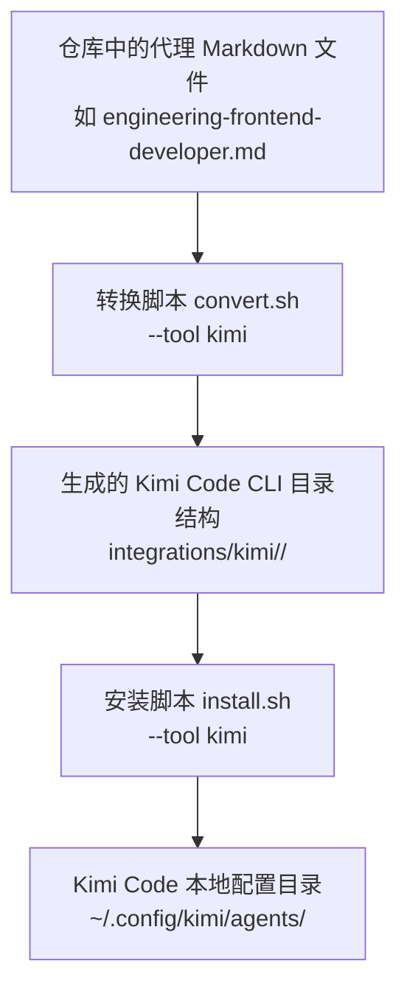
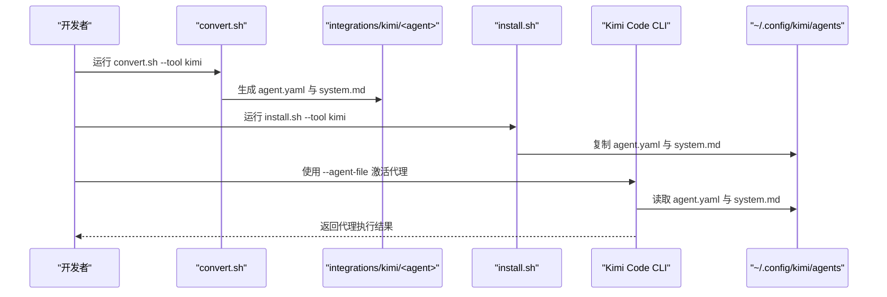
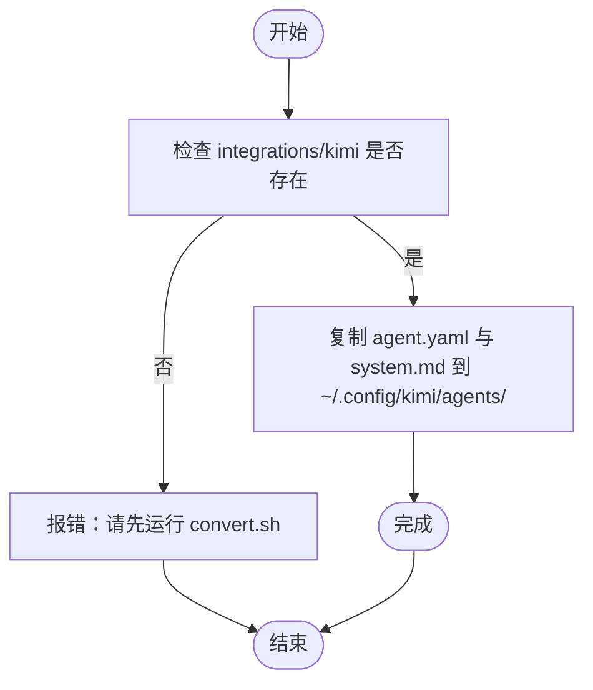

# Kimi Code 集成

<cite>
**本文引用的文件**
- [integrations/kimi/README.md](file://integrations/kimi/README.md)
- [scripts/convert.sh](file://scripts/convert.sh)
- [scripts/install.sh](file://scripts/install.sh)
- [README.md](file://README.md)
- [engineering/engineering-frontend-developer.md](file://engineering/engineering-frontend-developer.md)
- [design/design-ui-designer.md](file://design/design-ui-designer.md)
</cite>

## 目录
1. [简介](#简介)
2. [项目结构](#项目结构)
3. [核心组件](#核心组件)
4. [架构总览](#架构总览)
5. [详细组件分析](#详细组件分析)
6. [依赖关系分析](#依赖关系分析)
7. [性能考量](#性能考量)
8. [故障排除指南](#故障排除指南)
9. [结论](#结论)
10. [附录](#附录)

## 简介
本指南面向希望在 Kimi Code CLI 中使用 The Agency 代理的用户，系统讲解 Kimi Code 集成的工作原理与使用方法。Kimi Code 集成通过将仓库中的 Markdown 代理文件转换为 Kimi Code CLI 所需的 YAML 代理规范与独立的系统提示文件，实现一键安装与激活。本文涵盖：
- YAML 代理规格系统与 agent.yaml 结构
- 系统提示文件 system.md 的作用与格式
- 安装流程：转换步骤的重要性、代理文件生成、安装路径配置
- 使用示例：--agent-file 激活、在项目中使用
- 故障排除：代理文件生成失败、权限问题、Kimi Code 集成问题
- 平台特点与使用注意事项

## 项目结构
Kimi Code 集成的核心由三部分组成：
- 转换脚本：将各领域代理从 Markdown 转换为 Kimi Code CLI 所需的 agent.yaml 与 system.md
- 安装脚本：将转换后的代理复制到 Kimi Code 的本地配置目录 ~/.config/kimi/agents/
- 代理示例：前端开发、UI 设计等代理的 Markdown 规范，作为转换输入

图表来源
- [scripts/convert.sh:377-408](file://scripts/convert.sh#L377-L408)
- [scripts/install.sh:474-494](file://scripts/install.sh#L474-L494)

章节来源
- [integrations/kimi/README.md:1-24](file://integrations/kimi/README.md#L1-L24)
- [scripts/convert.sh:377-408](file://scripts/convert.sh#L377-L408)
- [scripts/install.sh:474-494](file://scripts/install.sh#L474-L494)

## 核心组件
- 转换器（convert_kimi）
  - 输入：单个代理 Markdown 文件（包含 YAML 前言与正文）
  - 输出：agent.yaml 与 system.md，分别写入 integrations/kimi/<slug>/agent.yaml 与 integrations/kimi/<slug>/system.md
  - 关键点：agent.yaml 使用 extend: default 继承 Kimi 默认工具集；system_prompt_path 指向同目录下的 system.md
- 安装器（install_kimi）
  - 输入：integrations/kimi 下的各代理目录
  - 输出：复制到 ~/.config/kimi/agents/<slug>/agent.yaml 与 system.md
  - 关键点：安装前必须先执行 convert.sh，否则 install.sh 会报“integrations/kimi 缺失”的错误

章节来源
- [scripts/convert.sh:377-408](file://scripts/convert.sh#L377-L408)
- [scripts/install.sh:474-494](file://scripts/install.sh#L474-L494)
- [integrations/kimi/README.md:50-82](file://integrations/kimi/README.md#L50-L82)

## 架构总览
下图展示了从代理 Markdown 到 Kimi Code CLI 可用代理的完整流程。

图表来源
- [scripts/convert.sh:377-408](file://scripts/convert.sh#L377-L408)
- [scripts/install.sh:474-494](file://scripts/install.sh#L474-L494)
- [integrations/kimi/README.md:25-48](file://integrations/kimi/README.md#L25-L48)

## 详细组件分析

### YAML 代理规格系统（agent.yaml）
- 版本与结构
  - version: 1
  - agent.name: 采用 kebab-case 的代理名称（由 Markdown 前言 name 字段转换而来）
  - agent.extend: default（继承 Kimi 内置默认工具集）
  - agent.system_prompt_path: 指向同目录下的 system.md
- 工具与子代理
  - agent.tools：可选字段，用于声明额外工具或子代理（当前转换器未注入具体工具列表，保持 extend: default）

章节来源
- [integrations/kimi/README.md:60-72](file://integrations/kimi/README.md#L60-L72)
- [scripts/convert.sh:392-398](file://scripts/convert.sh#L392-L398)

### 系统提示文件（system.md）
- 作用
  - 包含代理的人格、使命、规则、技术交付物、工作流、成功指标等完整内容
  - 与 agent.yaml 分离，便于独立维护与更新
- 格式
  - 以 Markdown 标题与段落组织，内容来自源代理 Markdown 的正文部分
  - agent.yaml 通过 system_prompt_path 引用该文件

章节来源
- [integrations/kimi/README.md:50-58](file://integrations/kimi/README.md#L50-L58)
- [scripts/convert.sh:401-407](file://scripts/convert.sh#L401-L407)

### 安装流程与路径配置
- 安装目标
  - ~/.config/kimi/agents/<agent-slug>/agent.yaml
  - ~/.config/kimi/agents/<agent-slug>/system.md
- 安装前置条件
  - 必须先运行 convert.sh --tool kimi 生成 integrations/kimi 目录
  - 若 integrations/kimi 缺失，install.sh 将报错并要求先执行转换

章节来源
- [scripts/install.sh:474-494](file://scripts/install.sh#L474-L494)
- [integrations/kimi/README.md:13-23](file://integrations/kimi/README.md#L13-L23)

### 使用示例
- 激活代理
  - 使用 --agent-file 指定 agent.yaml 的绝对路径
- 在项目中使用
  - 指定 --work-dir 指向项目根目录，并传入任务描述
- 列出已安装代理
  - 查看 ~/.config/kimi/agents/ 下的目录结构

章节来源
- [integrations/kimi/README.md:25-48](file://integrations/kimi/README.md#L25-L48)

### 代理文件结构与配置选项
- 目录结构
  - ~/.config/kimi/agents/<agent-slug>/
    - agent.yaml
    - system.md
- agent.yaml 关键字段
  - name：代理名称（kebab-case）
  - extend：default（继承 Kimi 默认工具集）
  - system_prompt_path：指向 system.md 的相对路径
- system.md
  - 包含代理的人格、使命、规则、交付物、工作流与成功指标等内容

章节来源
- [integrations/kimi/README.md:50-72](file://integrations/kimi/README.md#L50-L72)

### 代理示例：前端开发与 UI 设计
- 前端开发代理
  - 包含编辑器集成工程、现代 Web 应用构建、性能优化、可访问性等模块化内容
  - 提供可复用的组件示例与交付模板
- UI 设计代理
  - 设计系统基础、组件库架构、响应式设计框架、开发者交接规范
  - 提供可直接参考的设计令牌与组件样式示例

章节来源
- [engineering/engineering-frontend-developer.md:1-225](file://engineering/engineering-frontend-developer.md#L1-L225)
- [design/design-ui-designer.md:1-383](file://design/design-ui-designer.md#L1-L383)

## 依赖关系分析
- 转换阶段依赖
  - convert.sh 依赖于各领域目录中的代理 Markdown 文件（包含 YAML 前言与正文）
  - 转换器 convert_kimi 仅使用前言中的 name 与 description，正文内容写入 system.md
- 安装阶段依赖
  - install.sh 依赖 integrations/kimi 下的目录结构
  - 安装前必须确保 convert.sh 已完成，否则 install.sh 报错

图表来源
- [scripts/install.sh:125-130](file://scripts/install.sh#L125-L130)
- [scripts/install.sh:474-494](file://scripts/install.sh#L474-L494)

章节来源
- [scripts/install.sh:125-130](file://scripts/install.sh#L125-L130)
- [scripts/install.sh:474-494](file://scripts/install.sh#L474-L494)

## 性能考量
- 转换与安装的并行化
  - convert.sh 支持 --parallel 与 --jobs N 并行处理多工具
  - install.sh 支持 --parallel 与 --jobs N 并行安装
- I/O 与磁盘占用
  - 转换与安装均在本地进行，建议在空闲时段批量执行
- 代理加载时间
  - agent.yaml 与 system.md 位于本地，加载速度取决于文件大小与磁盘性能

章节来源
- [README.md:583-588](file://README.md#L583-L588)
- [README.md:575-581](file://README.md#L575-L581)

## 故障排除指南
- 代理文件未找到
  - 现象：install.sh 报错 integrations/kimi 缺失
  - 解决：先运行 convert.sh --tool kimi 生成 integrations/kimi 目录
- Kimi CLI 未检测到
  - 现象：命令行无法识别 kimi
  - 解决：确认 Kimi Code CLI 已安装且在 PATH 中，使用 which kimi 或 kimi --version 验证
- YAML 格式无效
  - 现象：生成的 agent.yaml 语法错误
  - 解决：使用 python3 -c "import yaml; yaml.safe_load(open('integrations/kimi/<agent>/agent.yaml'))" 进行验证
- 权限问题
  - 现象：无法写入 ~/.config/kimi/agents/
  - 解决：检查 ~/.config/kimi/agents/ 的权限，必要时使用 sudo 或调整用户权限
- 代理未生效
  - 现象：--agent-file 指定的路径正确但无响应
  - 解决：确认 agent.yaml 的 extend: default 与 system_prompt_path 正确；重新运行 convert.sh 与 install.sh

章节来源
- [integrations/kimi/README.md:83-109](file://integrations/kimi/README.md#L83-L109)
- [scripts/install.sh:125-130](file://scripts/install.sh#L125-L130)

## 结论
通过 The Agency 的转换与安装脚本，Kimi Code CLI 集成实现了从代理 Markdown 到 YAML + system.md 的标准化输出，并一键安装至本地配置目录。遵循“先转换、后安装”的流程，即可在任意项目中使用 --agent-file 激活代理，并结合 --work-dir 在项目上下文中高效协作。遇到问题时，优先检查转换是否完成、CLI 是否可用以及 YAML 语法是否正确。

## 附录
- 快速开始
  - 转换：./scripts/convert.sh --tool kimi
  - 安装：./scripts/install.sh --tool kimi
  - 激活：kimi --agent-file ~/.config/kimi/agents/<agent>/agent.yaml
  - 项目使用：kimi --agent-file ~/.config/kimi/agents/<agent>/agent.yaml --work-dir /your/project "任务描述"

章节来源
- [integrations/kimi/README.md:13-48](file://integrations/kimi/README.md#L13-L48)
- [README.md:778-795](file://README.md#L778-L795)