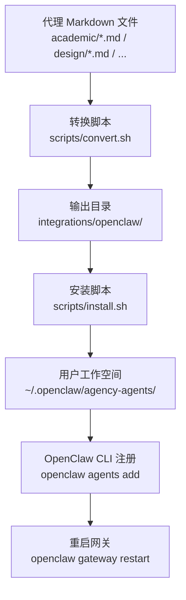
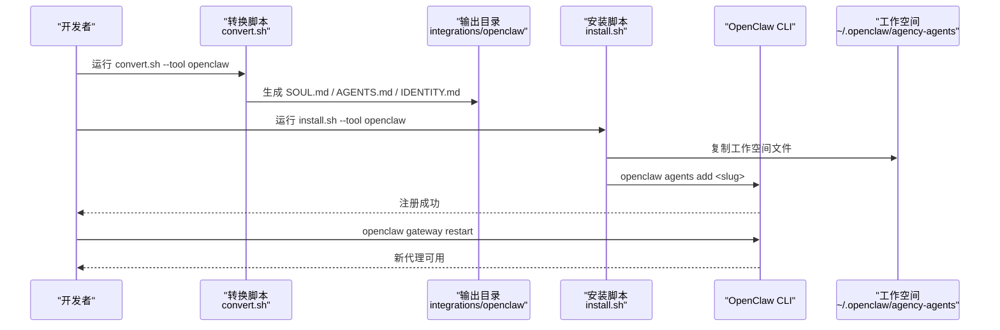
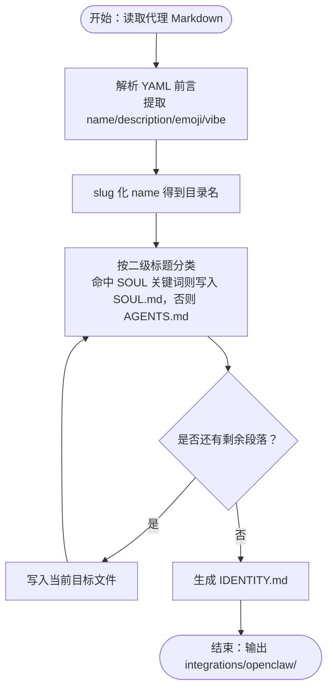
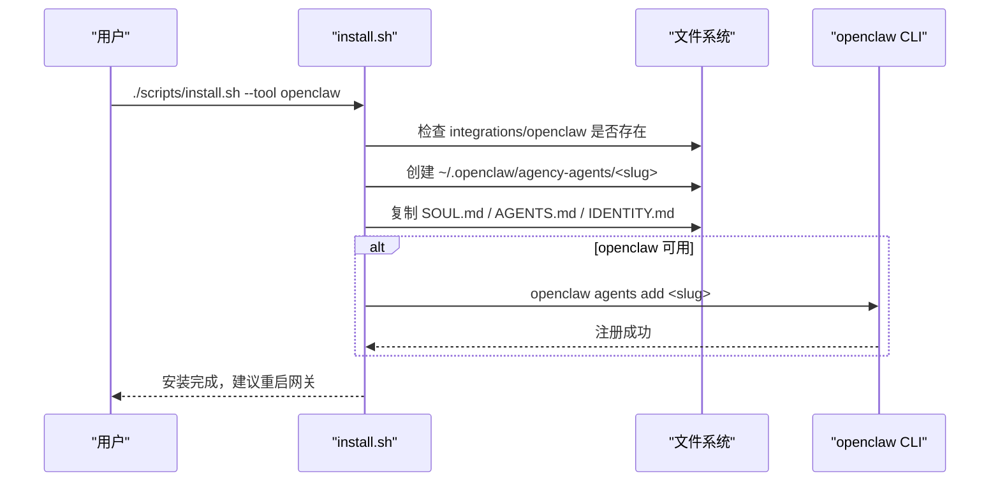
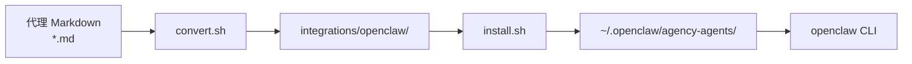

# OpenClaw 集成

<cite>
**本文引用的文件**
- [integrations/openclaw/README.md](file://integrations/openclaw/README.md)
- [scripts/convert.sh](file://scripts/convert.sh)
- [scripts/install.sh](file://scripts/install.sh)
- [academic/academic-anthropologist.md](file://academic/academic-anthropologist.md)
- [design/design-brand-guardian.md](file://design/design-brand-guardian.md)
- [engineering/engineering-ai-engineer.md](file://engineering/engineering-ai-engineer.md)
- [marketing/marketing-content-creator.md](file://marketing/marketing-content-creator.md)
</cite>

## 目录
1. [简介](#简介)
2. [项目结构](#项目结构)
3. [核心组件](#核心组件)
4. [架构总览](#架构总览)
5. [详细组件分析](#详细组件分析)
6. [依赖关系分析](#依赖关系分析)
7. [性能考量](#性能考量)
8. [故障排除指南](#故障排除指南)
9. [结论](#结论)
10. [附录](#附录)

## 简介
本指南面向希望在 OpenClaw 中使用“Agency Agents”体系的用户，系统讲解如何将仓库中的代理定义文件转换为 OpenClaw 工作空间，并完成安装与激活流程。OpenClaw 工作空间由一个代理的多个文件组成：SOUL.md（角色与边界）、AGENTS.md（任务与流程）、IDENTITY.md（身份标签）。本文将分步说明转换、安装、工作空间结构、使用方法以及常见问题排查。

## 项目结构
OpenClaw 集成位于仓库的 scripts 目录中，核心流程如下：
- 转换：将各领域代理的 Markdown 定义文件拆分为 OpenClaw 所需的 SOUL.md、AGENTS.md、IDENTITY.md，并输出到 integrations/openclaw/<slug> 下。
- 安装：将转换后的工作空间复制到用户主目录下的 ~/.openclaw/agency-agents/<slug>，并在可用时通过 openclaw CLI 注册，最后提示重启网关以生效。

图表来源
- [scripts/convert.sh:251-340](file://scripts/convert.sh#L251-L340)
- [scripts/install.sh:389-412](file://scripts/install.sh#L389-L412)
- [integrations/openclaw/README.md:1-35](file://integrations/openclaw/README.md#L1-L35)

章节来源
- [integrations/openclaw/README.md:1-35](file://integrations/openclaw/README.md#L1-L35)
- [scripts/convert.sh:1-639](file://scripts/convert.sh#L1-L639)
- [scripts/install.sh:1-640](file://scripts/install.sh#L1-L640)

## 核心组件
- 转换器（convert.sh）
  - 功能：读取各领域目录中的代理 Markdown，解析 YAML 前言字段，按标题关键字将正文内容拆分为 SOUL.md 与 AGENTS.md；生成 IDENTITY.md。
  - 关键行为：按工具名选择性转换；对 OpenClaw 使用 slug 化命名；严格区分“身份/记忆/沟通/风格/规则”等关键词归类至 SOUL。
- 安装器（install.sh）
  - 功能：检测本地环境，复制 OpenClaw 工作空间到 ~/.openclaw/agency-agents/<slug>，调用 openclaw CLI 注册，提示重启网关。
  - 关键行为：自动检测 openclaw 可执行文件或配置目录；支持交互式/非交互式批量安装；并行安装加速。

章节来源
- [scripts/convert.sh:251-340](file://scripts/convert.sh#L251-L340)
- [scripts/install.sh:389-412](file://scripts/install.sh#L389-L412)

## 架构总览
下图展示从代理定义到 OpenClaw 工作空间的端到端流程：

图表来源
- [scripts/convert.sh:251-340](file://scripts/convert.sh#L251-L340)
- [scripts/install.sh:389-412](file://scripts/install.sh#L389-L412)
- [integrations/openclaw/README.md:10-28](file://integrations/openclaw/README.md#L10-L28)

## 详细组件分析

### 转换器：OpenClaw 工作空间生成
- 输入：各领域目录下的代理 Markdown 文件（需包含 YAML 前言）。
- 输出：integrations/openclaw/<slug> 目录，包含三个文件：
  - SOUL.md：角色身份、记忆、沟通方式、风格、关键规则等“内在设定”。
  - AGENTS.md：使命、交付物、工作流等“外在任务”。
  - IDENTITY.md：用于 OpenClaw 的身份标签，优先使用 emoji + 名称 + vibe，否则回退到名称 + 描述。
- 分类逻辑：根据二级标题（##）关键字匹配进行归类，关键词命中 SOUL，其余进入 AGENTS。

图表来源
- [scripts/convert.sh:251-340](file://scripts/convert.sh#L251-L340)

章节来源
- [scripts/convert.sh:251-340](file://scripts/convert.sh#L251-L340)

### 安装器：工作空间部署与注册
- 检查：确保 integrations/openclaw 存在且已生成。
- 复制：将每个 <slug> 目录复制到 ~/.openclaw/agency-agents/<slug>。
- 注册：若 openclaw 可用，则调用 openclaw agents add 自动注册。
- 提示：安装完成后如网关已在运行，需重启以加载新代理。

图表来源
- [scripts/install.sh:389-412](file://scripts/install.sh#L389-L412)
- [integrations/openclaw/README.md:14-28](file://integrations/openclaw/README.md#L14-L28)

章节来源
- [scripts/install.sh:389-412](file://scripts/install.sh#L389-L412)
- [integrations/openclaw/README.md:14-28](file://integrations/openclaw/README.md#L14-L28)

### 工作空间结构与文件职责
- 目录结构
  - ~/.openclaw/agency-agents/<slug>/
    - SOUL.md：角色内在设定与边界，决定“你是谁、如何说话、不可逾越的底线”。
    - AGENTS.md：任务与流程，决定“你要做什么、如何做、交付什么”。
    - IDENTITY.md：OpenClaw 的身份标签，影响 UI 展示与检索体验。
- 生成来源
  - SOUL.md/AGENTS.md：由 convert.sh 基于代理 Markdown 正文的二级标题关键字自动拆分。
  - IDENTITY.md：由 convert.sh 基于代理 Markdown 前言的 emoji、vibe 字段生成，缺失时回退到 name 与 description。

章节来源
- [scripts/convert.sh:251-340](file://scripts/convert.sh#L251-L340)
- [academic/academic-anthropologist.md:1-7](file://academic/academic-anthropologist.md#L1-L7)
- [design/design-brand-guardian.md:1-7](file://design/design-brand-guardian.md#L1-L7)
- [engineering/engineering-ai-engineer.md:1-7](file://engineering/engineering-ai-engineer.md#L1-L7)
- [marketing/marketing-content-creator.md:1-8](file://marketing/marketing-content-creator.md#L1-L8)

### 使用示例：在 OpenClaw 中激活与使用
- 安装后，可通过 agentId（即 slug）在 OpenClaw 会话中直接激活代理。
- 若网关已在运行，安装后请重启以加载新代理。

章节来源
- [integrations/openclaw/README.md:20-28](file://integrations/openclaw/README.md#L20-L28)

## 依赖关系分析
- 转换阶段
  - 输入：各领域目录下的 Markdown 文件（需含 YAML 前言）。
  - 输出：integrations/openclaw/<slug> 目录树。
- 安装阶段
  - 依赖：~/.openclaw 目录存在；openclaw CLI 可用时可自动注册。
  - 影响：重启 OpenClaw 网关以使新代理生效。

图表来源
- [scripts/convert.sh:251-340](file://scripts/convert.sh#L251-L340)
- [scripts/install.sh:389-412](file://scripts/install.sh#L389-L412)

章节来源
- [scripts/convert.sh:251-340](file://scripts/convert.sh#L251-L340)
- [scripts/install.sh:389-412](file://scripts/install.sh#L389-L412)

## 性能考量
- 并行处理
  - convert.sh 支持并行转换多工具，OpenClaw 在其中可与其他工具并行执行，提升整体效率。
  - install.sh 支持并行安装多工具，减少等待时间。
- I/O 优化
  - 转换与安装均采用目录级复制，避免逐字节扫描，适合大规模代理集合。

章节来源
- [scripts/convert.sh:566-590](file://scripts/convert.sh#L566-L590)
- [scripts/install.sh:600-626](file://scripts/install.sh#L600-L626)

## 故障排除指南
- 未生成 integrations/openclaw
  - 现象：install.sh 报错 integrations/openclaw 缺失。
  - 处理：先运行转换脚本生成 OpenClaw 工作空间后再安装。
  - 参考
    - [scripts/install.sh:125-130](file://scripts/install.sh#L125-L130)
    - [scripts/convert.sh:521-544](file://scripts/convert.sh#L521-L544)
- OpenClaw 未安装或命令不可用
  - 现象：安装后未自动注册，或提示 openclaw 不是内部或外部命令。
  - 处理：确认 openclaw 已安装并加入 PATH；手动执行 openclaw agents add <slug> 注册；随后重启网关。
  - 参考
    - [scripts/install.sh:403-411](file://scripts/install.sh#L403-L411)
    - [integrations/openclaw/README.md:24-28](file://integrations/openclaw/README.md#L24-L28)
- 工作空间创建权限问题
  - 现象：无法写入 ~/.openclaw/agency-agents/<slug>。
  - 处理：检查用户主目录权限，确保脚本有写入权限。
- 文件完整性检查
  - 现象：SOUL.md/AGENTS.md/IDENTITY.md 缺失或为空。
  - 处理：确认源 Markdown 含 YAML 前言与正文；检查 convert.sh 的分类逻辑是否正确识别二级标题。
  - 参考
    - [scripts/convert.sh:274-340](file://scripts/convert.sh#L274-L340)

章节来源
- [scripts/install.sh:125-130](file://scripts/install.sh#L125-L130)
- [scripts/install.sh:403-411](file://scripts/install.sh#L403-L411)
- [scripts/convert.sh:274-340](file://scripts/convert.sh#L274-L340)
- [integrations/openclaw/README.md:24-28](file://integrations/openclaw/README.md#L24-L28)

## 结论
通过 convert.sh 将代理 Markdown 自动拆分为 OpenClaw 工作空间文件，再由 install.sh 完成复制与注册，即可在 OpenClaw 中以 agentId 快速激活使用。遵循本文的转换与安装步骤，并注意常见问题的排查要点，可高效完成 OpenClaw 集成。

## 附录
- 快速操作清单
  - 生成 OpenClaw 工作空间：./scripts/convert.sh --tool openclaw
  - 安装 OpenClaw 工作空间：./scripts/install.sh --tool openclaw
  - 激活与使用：在 OpenClaw 会话中以 agentId 调用代理
  - 重启网关：openclaw gateway restart（如网关已在运行）

章节来源
- [integrations/openclaw/README.md:10-28](file://integrations/openclaw/README.md#L10-L28)
- [scripts/convert.sh:521-544](file://scripts/convert.sh#L521-L544)
- [scripts/install.sh:515-544](file://scripts/install.sh#L515-L544)