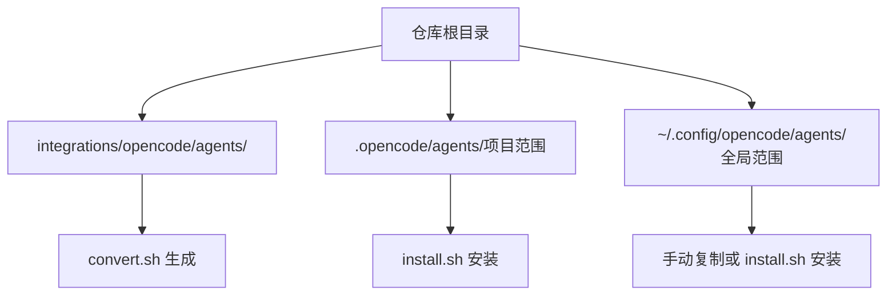
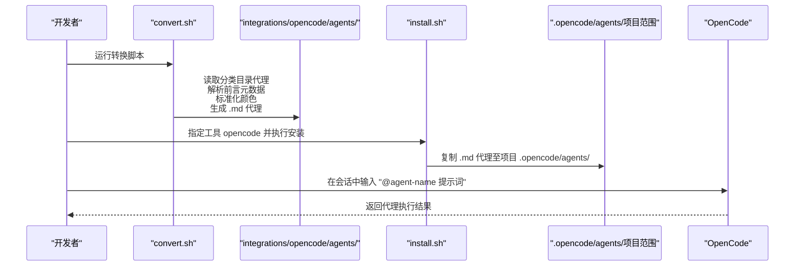
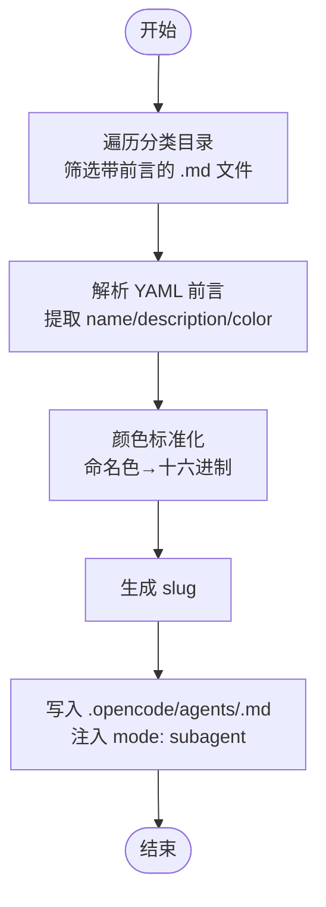
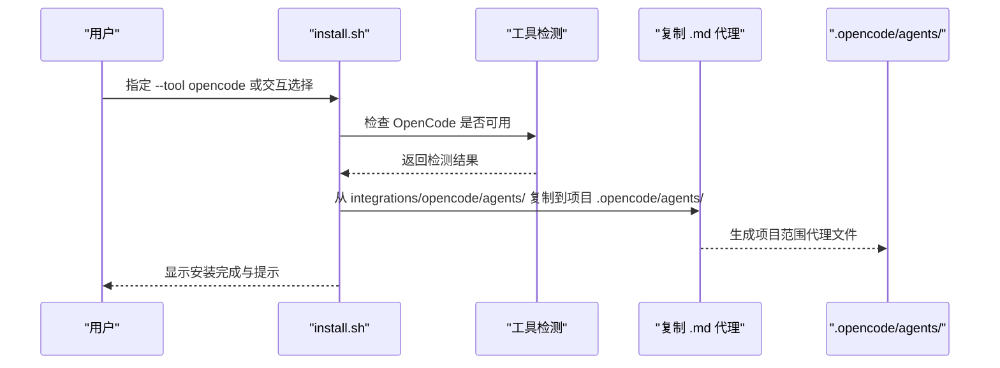

# OpenCode 集成

<cite>
**本文档引用的文件**
- [integrations/opencode/README.md](file://integrations/opencode/README.md)
- [scripts/install.sh](file://scripts/install.sh)
- [scripts/convert.sh](file://scripts/convert.sh)
- [README.md](file://README.md)
- [integrations/README.md](file://integrations/README.md)
- [engineering/engineering-frontend-developer.md](file://engineering/engineering-frontend-developer.md)
- [testing/testing-accessibility-auditor.md](file://testing/testing-accessibility-auditor.md)
- [engineering/engineering-backend-architect.md](file://engineering/engineering-backend-architect.md)
- [testing/testing-reality-checker.md](file://testing/testing-reality-checker.md)
- [product/product-manager.md](file://product/product-manager.md)
</cite>

## 目录
1. [简介](#简介)
2. [项目结构](#项目结构)
3. [核心组件](#核心组件)
4. [架构总览](#架构总览)
5. [详细组件分析](#详细组件分析)
6. [依赖关系分析](#依赖关系分析)
7. [性能考虑](#性能考虑)
8. [故障排除指南](#故障排除指南)
9. [结论](#结论)
10. [附录](#附录)

## 简介
本指南面向希望在 OpenCode 中使用 The Agency 代理集的用户，重点讲解 OpenCode 集成的安装与使用方法、项目范围的文件组织方式、代理格式与特性、以及常见问题排查。OpenCode 代理采用项目范围（project-scoped）部署，通过转换脚本将标准 Markdown 代理转换为 OpenCode 所需的 .md 格式并写入 .opencode/agents/ 目录，便于在 OpenCode 中按需调用。

## 项目结构
OpenCode 集成涉及以下关键位置与文件：
- 转换输出：integrations/opencode/agents/ 下的 .md 代理文件
- 安装目标：项目根目录下的 .opencode/agents/（项目范围）
- 全局可用：可复制到 ~/.config/opencode/agents/（全局范围）
- 代理来源：各分类目录下的 .md 代理文件（如 engineering/、testing/、product/ 等）

图表来源
- [scripts/convert.sh](file://scripts/convert.sh)
- [scripts/install.sh](file://scripts/install.sh)
- [integrations/opencode/README.md](file://integrations/opencode/README.md)

章节来源
- [integrations/opencode/README.md](file://integrations/opencode/README.md)
- [integrations/README.md](file://integrations/README.md)

## 核心组件
- 转换器（convert.sh）
  - 将各分类目录中的 Markdown 代理转换为 OpenCode 专用格式，并写入 integrations/opencode/agents/。
  - 自动解析颜色名称并标准化为十六进制色值；为每个代理添加 mode: subagent，使其在 OpenCode 中按需调用。
- 安装器（install.sh）
  - 将转换后的 .md 代理从 integrations/opencode/agents/ 复制到当前项目的 .opencode/agents/，实现项目范围内的可用性。
  - 支持交互式选择、非交互式批量安装、并行加速等模式。
- 代理文件（.md）
  - 使用 YAML 前言元数据定义 name、description、color 等字段；转换后自动注入 mode: subagent 与标准化 color。
  - 在 OpenCode 中通过 @agent-name 形式按需激活。

章节来源
- [scripts/convert.sh](file://scripts/convert.sh)
- [scripts/install.sh](file://scripts/install.sh)
- [integrations/opencode/README.md](file://integrations/opencode/README.md)

## 架构总览
下图展示了从源代理到 OpenCode 可用代理的完整流程：

图表来源
- [scripts/convert.sh](file://scripts/convert.sh)
- [scripts/install.sh](file://scripts/install.sh)
- [integrations/opencode/README.md](file://integrations/opencode/README.md)

## 详细组件分析

### 转换器（convert.sh）工作流
- 输入：各分类目录（academic、design、engineering、game-development、marketing、paid-media、sales、product、project-management、testing、support、spatial-computing、specialized）中的 .md 代理文件。
- 处理：
  - 解析 YAML 前言元数据（name、description、color 等）。
  - 将命名颜色映射为标准化的十六进制色值。
  - 生成 slug（小写下划线形式），用于文件名。
  - 写入 .opencode/agents/ 下的 .md 文件，并添加 mode: subagent。
- 输出：integrations/opencode/agents/ 目录下的 .md 代理文件。

图表来源
- [scripts/convert.sh](file://scripts/convert.sh)

章节来源
- [scripts/convert.sh](file://scripts/convert.sh)

### 安装器（install.sh）工作流
- 检测工具：识别系统中是否已安装 OpenCode（命令或配置目录存在）。
- 选择工具：支持交互式勾选、自动检测、或直接指定工具。
- 安装目标：将 integrations/opencode/agents/ 中的 .md 代理复制到当前项目根目录的 .opencode/agents/。
- 并行安装：支持多工具并行处理，提升大规模安装效率。

图表来源
- [scripts/install.sh](file://scripts/install.sh)

章节来源
- [scripts/install.sh](file://scripts/install.sh)

### 代理文件格式与特性
- 前言元数据
  - name：代理名称（用于生成 slug 与显示名称）。
  - description：代理职责与能力描述。
  - color：命名颜色或十六进制色值（转换时统一标准化）。
  - emoji/vibe（可选）：增强识别度与风格描述。
- 转换后特性
  - mode: subagent：使代理在 OpenCode 中按需调用，不占用主列表。
  - color：十六进制标准化色值，确保 OpenCode UI 正确渲染。
- 使用方式
  - 在 OpenCode 会话中以 @agent-name 的形式调用代理。
  - 也可通过 OpenCode UI 的代理选择器进行选择。

章节来源
- [integrations/opencode/README.md](file://integrations/opencode/README.md)
- [scripts/convert.sh](file://scripts/convert.sh)

### 示例代理文件（用途参考）
- 前端开发工程师（工程类）
  - 适用于构建现代 Web 应用、组件库、性能优化与可访问性保障。
  - 参考文件：[engineering/engineering-frontend-developer.md](file://engineering/engineering-frontend-developer.md)
- 可访问性审计员（测试类）
  - 专注于 WCAG 标准、辅助技术测试与包容性设计验证。
  - 参考文件：[testing/testing-accessibility-auditor.md](file://testing/testing-accessibility-auditor.md)
- 后端架构师（工程类）
  - 专注于可扩展系统设计、数据库架构、API 开发与云基础设施。
  - 参考文件：[engineering/engineering-backend-architect.md](file://engineering/engineering-backend-architect.md)
- Reality Checker（测试类）
  - 证据驱动的质量评估与集成测试，要求“需要改进”默认状态。
  - 参考文件：[testing/testing-reality-checker.md](file://testing/testing-reality-checker.md)
- 产品经理（产品类）
  - 产品全生命周期管理、需求文档与路线图制定。
  - 参考文件：[product/product-manager.md](file://product/product-manager.md)

章节来源
- [engineering/engineering-frontend-developer.md](file://engineering/engineering-frontend-developer.md)
- [testing/testing-accessibility-auditor.md](file://testing/testing-accessibility-auditor.md)
- [engineering/engineering-backend-architect.md](file://engineering/engineering-backend-architect.md)
- [testing/testing-reality-checker.md](file://testing/testing-reality-checker.md)
- [product/product-manager.md](file://product/product-manager.md)

## 依赖关系分析
- convert.sh 依赖各分类目录中的 .md 代理文件作为输入，输出到 integrations/opencode/agents/。
- install.sh 依赖 convert.sh 生成的 integrations/opencode/agents/ 作为输入，复制到项目 .opencode/agents/。
- OpenCode 依赖项目范围的 .opencode/agents/ 中的 .md 代理文件进行按需调用。

图表来源
- [scripts/convert.sh](file://scripts/convert.sh)
- [scripts/install.sh](file://scripts/install.sh)
- [integrations/opencode/README.md](file://integrations/opencode/README.md)

章节来源
- [scripts/convert.sh](file://scripts/convert.sh)
- [scripts/install.sh](file://scripts/install.sh)
- [integrations/opencode/README.md](file://integrations/opencode/README.md)

## 性能考虑
- 并行化安装：install.sh 支持 --parallel 与 --jobs N 参数，可在多核环境下并行安装多个工具，缩短整体耗时。
- 并行化转换：convert.sh 支持 --parallel 与 --jobs N 参数，对独立工具转换过程进行并行处理，提高大规模代理转换效率。
- 输出缓冲：并行模式下，每项工具的输出被缓冲，避免交叉输出导致的混乱。

章节来源
- [scripts/install.sh](file://scripts/install.sh)
- [scripts/convert.sh](file://scripts/convert.sh)
- [README.md](file://README.md)

## 故障排除指南
- 安装前未生成转换文件
  - 现象：install.sh 报错提示 integrations/opencode 缺失或过期。
  - 处理：先运行转换脚本生成 integrations/opencode/agents/，再执行安装。
  - 参考：[scripts/convert.sh](file://scripts/convert.sh)、[scripts/install.sh](file://scripts/install.sh)
- 未在项目根目录运行安装
  - 现象：安装目标不在项目范围内，导致 OpenCode 无法识别代理。
  - 处理：确保在目标项目根目录执行安装命令，安装器会将代理复制到 .opencode/agents/。
  - 参考：[scripts/install.sh](file://scripts/install.sh)、[integrations/opencode/README.md](file://integrations/opencode/README.md)
- OpenCode 未检测到代理
  - 现象：OpenCode 无法通过 @agent-name 调用代理。
  - 处理：确认 .opencode/agents/ 下存在对应 .md 文件；检查文件是否包含有效的 YAML 前言与 mode: subagent；必要时重新运行转换与安装。
  - 参考：[integrations/opencode/README.md](file://integrations/opencode/README.md)
- 颜色显示异常
  - 现象：OpenCode 中代理颜色显示不符合预期。
  - 处理：convert.sh 会将命名颜色标准化为十六进制；若仍异常，请检查源代理的 color 字段格式。
  - 参考：[scripts/convert.sh](file://scripts/convert.sh)
- 全局与项目范围冲突
  - 现象：同时存在项目范围与全局范围代理，行为不一致。
  - 处理：明确使用场景，项目范围优先于全局范围；如需全局可用，可复制到 ~/.config/opencode/agents/。
  - 参考：[integrations/opencode/README.md](file://integrations/opencode/README.md)
- 权限问题
  - 现象：安装或复制失败，提示权限不足。
  - 处理：确保对项目目录与 ~/.config/opencode/agents/ 具有读写权限；必要时使用管理员权限或调整目录权限。
  - 参考：[scripts/install.sh](file://scripts/install.sh)

章节来源
- [scripts/convert.sh](file://scripts/convert.sh)
- [scripts/install.sh](file://scripts/install.sh)
- [integrations/opencode/README.md](file://integrations/opencode/README.md)

## 结论
OpenCode 集成通过 convert.sh 与 install.sh 实现了从标准代理到 OpenCode 项目范围可用代理的自动化转换与安装。项目范围的 .opencode/agents/ 目录使得代理仅在当前项目内生效，便于团队协作与环境隔离；同时支持全局范围复制以满足跨项目复用需求。遵循本文档的安装与使用流程，并结合故障排除指南，可高效地在 OpenCode 中按需调用各类代理，提升开发与测试效率。

## 附录
- 快速开始
  - 生成转换文件：./scripts/convert.sh
  - 安装 OpenCode 代理：./scripts/install.sh --tool opencode
  - 在 OpenCode 中使用：@agent-name 提示词
- 相关文件参考
  - [README.md](file://README.md)
  - [integrations/README.md](file://integrations/README.md)