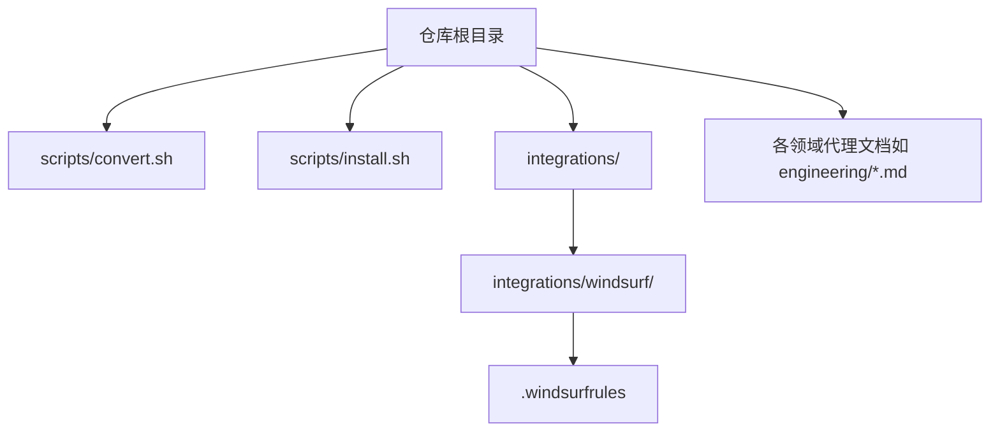
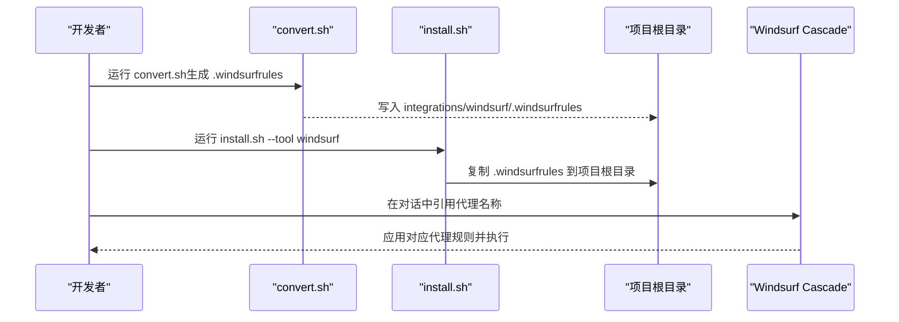
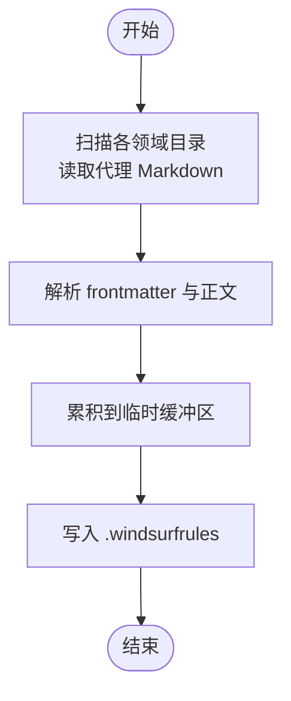
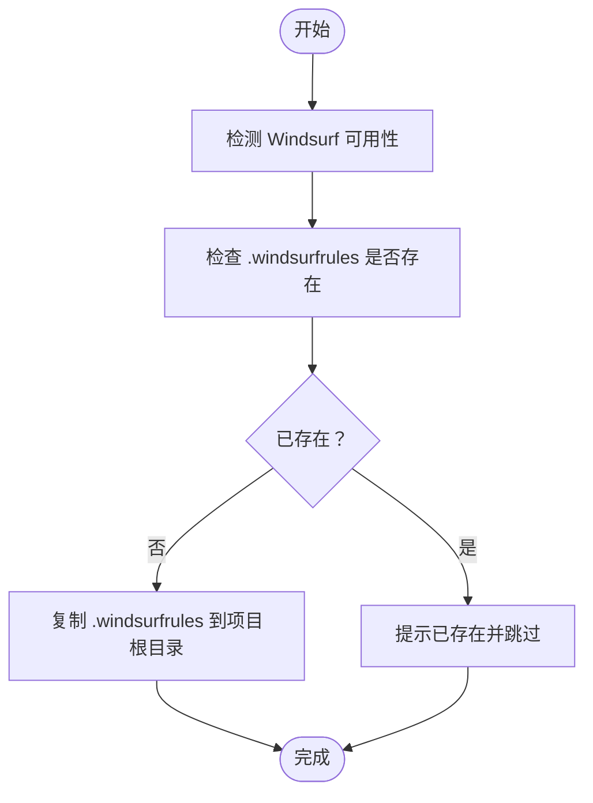
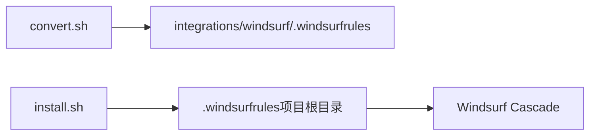

# Windsurf 集成

<cite>
**本文引用的文件**
- [README.md](file://README.md)
- [integrations/README.md](file://integrations/README.md)
- [integrations/windsurf/README.md](file://integrations/windsurf/README.md)
- [scripts/convert.sh](file://scripts/convert.sh)
- [scripts/install.sh](file://scripts/install.sh)
- [engineering/engineering-frontend-developer.md](file://engineering/engineering-frontend-developer.md)
- [testing/testing-reality-checker.md](file://testing/testing-reality-checker.md)
- [engineering/engineering-backend-architect.md](file://engineering/engineering-backend-architect.md)
</cite>

## 目录
1. [简介](#简介)
2. [项目结构](#项目结构)
3. [核心组件](#核心组件)
4. [架构总览](#架构总览)
5. [详细组件分析](#详细组件分析)
6. [依赖关系分析](#依赖关系分析)
7. [性能考量](#性能考量)
8. [故障排除指南](#故障排除指南)
9. [结论](#结论)
10. [附录](#附录)

## 简介
本指南面向希望在 Windsurf（Codeium 的本地代理规则引擎）中使用 The Agency 代理的用户。Windsurf 集成通过将仓库中的全部 144 个代理整合为单一的 .windsurfrules 文件，实现“项目级”规则部署与激活。本指南涵盖：
- Windsurf 规则文件系统与 .windsurfrules 的生成与安装流程
- 在项目根目录运行安装脚本与规则文件的生成与配置
- 使用示例：在 Windsurf 中激活与使用代理规则
- .windsurfrules 的语法与配置要点
- 常见问题与故障排除
- Windsurf 工具的特点与适用场景

## 项目结构
Windsurf 集成位于仓库的 integrations 子目录下，并由 convert.sh 与 install.sh 两个脚本协同完成转换与安装。关键路径如下：
- 转换脚本：scripts/convert.sh
- 安装脚本：scripts/install.sh
- Windsurf 规则文件输出：integrations/windsurf/.windsurfrules
- Windsurf 使用说明：integrations/windsurf/README.md
- 多工具集成总览：integrations/README.md
- 顶层使用说明与多工具安装指引：README.md

图表来源
- [scripts/convert.sh:480-517](file://scripts/convert.sh#L480-L517)
- [scripts/install.sh:441-452](file://scripts/install.sh#L441-L452)
- [integrations/windsurf/README.md:1-27](file://integrations/windsurf/README.md#L1-L27)

章节来源
- [integrations/README.md:166-175](file://integrations/README.md#L166-L175)
- [README.md:528-589](file://README.md#L528-L589)

## 核心组件
- 转换器（convert.sh）
  - 将各领域代理文档（Markdown，带 YAML frontmatter）转换为工具特定格式
  - 对 Windsurf，将所有代理累积为单个 .windsurfrules 文件
  - 输出到 integrations/windsurf/.windsurfrules
- 安装器（install.sh）
  - 检测系统中是否已安装 Windsurf 或相关工具
  - 将转换后的 .windsurfrules 复制到当前项目根目录
  - 提供交互式选择与并行安装能力
- 规则文件（.windsurfrules）
  - 单一文件，包含所有代理的规则与说明
  - 项目级作用域，随项目分发与版本控制

章节来源
- [scripts/convert.sh:410-478](file://scripts/convert.sh#L410-L478)
- [scripts/convert.sh:618-628](file://scripts/convert.sh#L618-L628)
- [scripts/install.sh:441-452](file://scripts/install.sh#L441-L452)

## 架构总览
Windsurf 集成采用“转换—安装—使用”的三段式流程：
- 转换阶段：convert.sh 扫描各领域目录，读取代理 Markdown 文档，提取 frontmatter 与正文，按 Windsurf 格式写入 .windsurfrules
- 安装阶段：install.sh 检查 integrations/windsurf/.windsurfrules 是否存在，若存在则复制到当前项目根目录
- 使用阶段：在 Windsurf 的 Cascade 中直接引用代理名称即可激活对应规则

图表来源
- [scripts/convert.sh:480-517](file://scripts/convert.sh#L480-L517)
- [scripts/convert.sh:618-628](file://scripts/convert.sh#L618-L628)
- [scripts/install.sh:441-452](file://scripts/install.sh#L441-L452)
- [integrations/windsurf/README.md:14-26](file://integrations/windsurf/README.md#L14-L26)

## 详细组件分析

### 转换器：convert.sh（Windsurf）
- 输入：各领域目录下的代理 Markdown 文件（需包含 YAML frontmatter）
- 处理逻辑：
  - 逐个读取代理文件，解析 frontmatter（name、description 等）
  - 将每个代理的正文累积到临时缓冲区
  - 写入统一的 .windsurfrules 文件，格式为“分隔线 + 标题 + 描述 + 正文”
- 输出：integrations/windsurf/.windsurfrules

图表来源
- [scripts/convert.sh:480-517](file://scripts/convert.sh#L480-L517)
- [scripts/convert.sh:460-478](file://scripts/convert.sh#L460-L478)
- [scripts/convert.sh:618-628](file://scripts/convert.sh#L618-L628)

章节来源
- [scripts/convert.sh:410-478](file://scripts/convert.sh#L410-L478)
- [scripts/convert.sh:480-517](file://scripts/convert.sh#L480-L517)
- [scripts/convert.sh:618-628](file://scripts/convert.sh#L618-L628)

### 安装器：install.sh（Windsurf）
- 功能：
  - 检测系统是否安装 Windsurf（通过命令或用户目录）
  - 检查 integrations/windsurf/.windsurfrules 是否存在
  - 将 .windsurfrules 复制到当前项目根目录
  - 提供交互式选择与并行安装
- 注意事项：
  - Windsurf 为“项目级”安装，需在目标项目根目录运行安装脚本
  - 若目标路径已有 .windsurfrules，会提示已存在并跳过覆盖

图表来源
- [scripts/install.sh:143](file://scripts/install.sh#L143)
- [scripts/install.sh:441-452](file://scripts/install.sh#L441-L452)

章节来源
- [scripts/install.sh:143](file://scripts/install.sh#L143)
- [scripts/install.sh:441-452](file://scripts/install.sh#L441-L452)

### 规则文件：.windsurfrules 的结构与语法
- 文件位置：integrations/windsurf/.windsurfrules
- 生成方式：convert.sh 将所有代理的“标题 + 描述 + 正文”拼接为统一规则集
- 项目级作用域：安装后位于项目根目录，随项目共享与版本控制
- 使用方式：在 Windsurf 的 Cascade 中直接引用代理名称，即可激活对应规则

章节来源
- [scripts/convert.sh:460-478](file://scripts/convert.sh#L460-L478)
- [scripts/convert.sh:618-628](file://scripts/convert.sh#L618-L628)
- [integrations/windsurf/README.md:3-4](file://integrations/windsurf/README.md#L3-L4)

### 使用示例：在 Windsurf 中激活与使用代理规则
- 安装步骤：
  - 在项目根目录运行安装脚本，将 .windsurfrules 复制到项目
  - 在 Windsurf 的 Cascade 中直接引用代理名称
- 示例参考：
  - Frontend Developer：在提示中要求前端开发代理帮助构建组件
  - Reality Checker：在提示中要求进行生产就绪性验证

章节来源
- [integrations/windsurf/README.md:14-26](file://integrations/windsurf/README.md#L14-L26)
- [README.md:720-735](file://README.md#L720-L735)

### 代理文档示例（用于理解规则来源）
- Frontend Developer：展示前端开发代理的身份、使命、规则、交付物与工作流
- Backend Architect：展示后端架构代理的系统设计、数据库架构、API 设计等
- Reality Checker：展示测试与验收代理的证据驱动方法、自动化截图验证与质量评估模板

章节来源
- [engineering/engineering-frontend-developer.md:1-225](file://engineering/engineering-frontend-developer.md#L1-L225)
- [engineering/engineering-backend-architect.md:1-235](file://engineering/engineering-backend-architect.md#L1-L235)
- [testing/testing-reality-checker.md:1-237](file://testing/testing-reality-checker.md#L1-L237)

## 依赖关系分析
- convert.sh 依赖：
  - 各领域目录下的代理 Markdown 文件（需包含 frontmatter）
  - 输出目录 integrations/windsurf/
- install.sh 依赖：
  - convert.sh 生成的 integrations/windsurf/.windsurfrules
  - 当前工作目录（项目根目录）
- Windsurf 使用依赖：
  - 项目根目录下的 .windsurfrules
  - 在 Cascade 中正确引用代理名称

图表来源
- [scripts/convert.sh:618-628](file://scripts/convert.sh#L618-L628)
- [scripts/install.sh:441-452](file://scripts/install.sh#L441-L452)

章节来源
- [scripts/convert.sh:618-628](file://scripts/convert.sh#L618-L628)
- [scripts/install.sh:441-452](file://scripts/install.sh#L441-L452)

## 性能考量
- 并行化：
  - convert.sh 与 install.sh 均支持并行模式，可显著缩短大型仓库的处理时间
  - 默认并行作业数根据系统核数自动确定，可通过 --jobs 调整
- 文件大小：
  - .windsurfrules 包含全部代理规则，体积较大；建议仅在需要时更新并重新安装
- 项目级部署：
  - .windsurfrules 放置在项目根目录，便于团队协作与版本控制

章节来源
- [README.md:580-588](file://README.md#L580-L588)
- [scripts/convert.sh:566-590](file://scripts/convert.sh#L566-L590)
- [scripts/install.sh:585-626](file://scripts/install.sh#L585-L626)

## 故障排除指南
- 规则文件未生成
  - 现象：install.sh 报错提示缺少 integrations/windsurf/.windsurfrules
  - 解决：先运行 convert.sh 生成集成文件后再安装
  - 参考：install.sh 中对缺失文件的错误提示
- 目标路径已存在 .windsurfrules
  - 现象：安装时提示文件已存在
  - 解决：删除旧文件或手动确认覆盖
  - 参考：install.sh 中对已存在文件的警告
- 未在项目根目录运行安装
  - 现象：.windsurfrules 未复制到预期位置
  - 解决：切换到目标项目根目录再运行安装脚本
  - 参考：install.sh 中关于项目级安装的提示
- 代理名称未生效
  - 现象：在 Windsurf 中引用代理名称但未触发规则
  - 解决：确认 .windsurfrules 已安装且名称与代理 frontmatter 中的 name 一致
  - 参考：Windsurf 使用说明与代理 frontmatter

章节来源
- [scripts/install.sh:441-452](file://scripts/install.sh#L441-L452)
- [integrations/windsurf/README.md:14-26](file://integrations/windsurf/README.md#L14-L26)

## 结论
Windsurf 集成通过 convert.sh 与 install.sh 实现了从多代理到单一 .windsurfrules 的高效转换与安装，使 The Agency 的 144 个代理能够在项目级环境中无缝启用。遵循“转换—安装—使用”的流程，即可在 Windsurf 的 Cascade 中直接引用代理名称，获得定制化的规则与工作流支持。

## 附录

### 安装与使用步骤（摘要）
- 生成集成文件
  - 运行：./scripts/convert.sh
- 安装到项目
  - 在项目根目录运行：./scripts/install.sh --tool windsurf
- 在 Windsurf 中使用
  - 在 Cascade 中引用代理名称，例如“使用 Frontend Developer 代理来构建组件”

章节来源
- [README.md:528-589](file://README.md#L528-L589)
- [integrations/windsurf/README.md:6-26](file://integrations/windsurf/README.md#L6-L26)