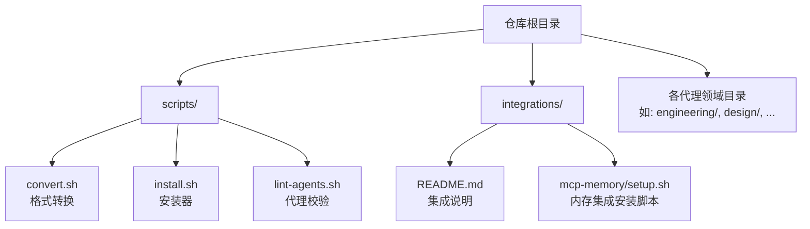
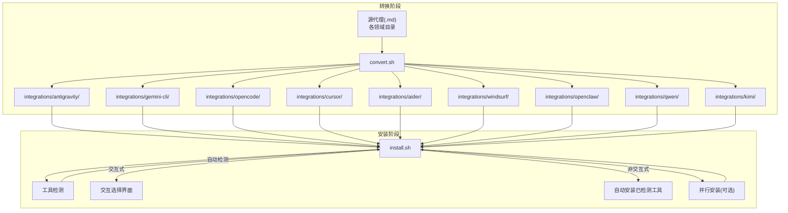
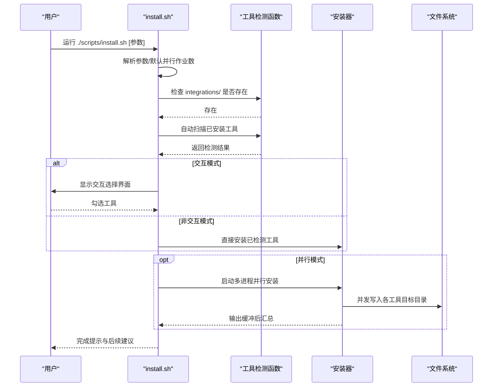
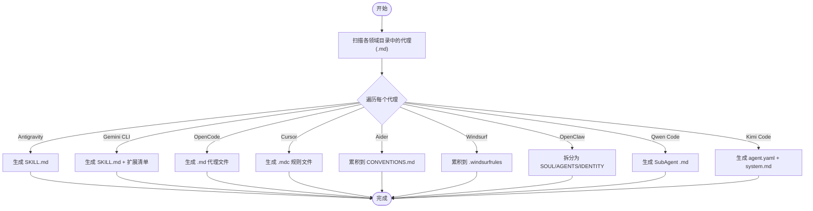

# 安装与配置

<cite>
**本文引用的文件**
- [install.sh](file://scripts/install.sh)
- [convert.sh](file://scripts/convert.sh)
- [lint-agents.sh](file://scripts/lint-agents.sh)
- [README.md](file://README.md)
- [integrations/README.md](file://integrations/README.md)
- [setup.sh](file://integrations/mcp-memory/setup.sh)
- [工程前端开发者.md](file://engineering/engineering-frontend-developer.md)
- [设计UI设计师.md](file://design/design-ui-designer.md)
</cite>

## 目录
1. [简介](#简介)
2. [项目结构](#项目结构)
3. [核心组件](#核心组件)
4. [架构总览](#架构总览)
5. [详细组件分析](#详细组件分析)
6. [依赖关系分析](#依赖关系分析)
7. [性能考量](#性能考量)
8. [故障排除指南](#故障排除指南)
9. [结论](#结论)
10. [附录](#附录)

## 简介
本指南面向希望在多款智能体开发工具中使用 The Agency 代理的用户，提供从安装到配置、从并行加速到错误处理的完整流程说明。内容涵盖：
- 安装脚本的工作原理：自动检测工具、交互式选择、并行安装、输出缓冲与错误处理
- 手动配置步骤：目标路径、权限、环境变量
- 故障排除：常见安装问题、权限问题、路径问题
- 格式转换系统：何时运行转换脚本、如何处理生成文件
- 不同操作系统下的注意事项与最佳实践

## 项目结构
仓库采用“按功能域分类”的组织方式，核心安装与转换逻辑集中在 scripts 目录，工具集成说明位于 integrations 目录，各代理以 Markdown 文件形式分布在多个领域目录中。

图表来源
- [README.md](file://README.md)
- [integrations/README.md](file://integrations/README.md)
- [scripts/install.sh](file://scripts/install.sh)
- [scripts/convert.sh](file://scripts/convert.sh)
- [scripts/lint-agents.sh](file://scripts/lint-agents.sh)
- [integrations/mcp-memory/setup.sh](file://integrations/mcp-memory/setup.sh)

章节来源
- [README.md](file://README.md)
- [integrations/README.md](file://integrations/README.md)

## 核心组件
- 格式转换系统（convert.sh）：将标准 Markdown 代理转换为各工具所需的特定格式，并生成扩展清单或规则文件。
- 安装器（install.sh）：扫描本地已安装工具，支持交互式选择与非交互式批量安装；支持并行模式以提升吞吐。
- 代理校验（lint-agents.sh）：对代理 Markdown 的前置元数据与内容进行基础校验，确保质量。
- 集成说明（integrations/README.md）：列出所有受支持工具及其安装要点。
- MCP 内存集成（mcp-memory/setup.sh）：引导安装 MCP 兼容的记忆服务器并提示配置位置。

章节来源
- [scripts/convert.sh](file://scripts/convert.sh)
- [scripts/install.sh](file://scripts/install.sh)
- [scripts/lint-agents.sh](file://scripts/lint-agents.sh)
- [integrations/README.md](file://integrations/README.md)
- [integrations/mcp-memory/setup.sh](file://integrations/mcp-memory/setup.sh)

## 架构总览
下图展示了“转换 → 安装”两条主线以及它们之间的依赖关系。

图表来源
- [scripts/convert.sh](file://scripts/convert.sh)
- [scripts/install.sh](file://scripts/install.sh)

## 详细组件分析

### 安装脚本 install.sh 工作原理
- 自动检测工具
  - 通过检查用户主目录或命令是否存在来判断工具是否已安装，覆盖 Claude Code、Copilot、Antigravity、Gemini CLI、OpenCode、Cursor、Aider、Windsurf、OpenClaw、Qwen Code、Kimi Code 等。
- 交互式选择
  - 在终端中显示工具列表，勾选要安装的工具；支持全选、清空、仅已检测项等快捷操作。
- 并行安装
  - 使用 xargs -P 启动多个子进程，每个子进程只执行 install_tool 并跳过头部/尾部输出，避免重复打印；输出被临时缓冲并在完成后统一打印。
- 错误处理
  - 若 integrations/ 缺失或过期，会提示先运行转换脚本；对未知工具名、无可用工具等情况给出明确提示并优雅退出。
- 输出与进度
  - 提供带颜色的 OK/警告/错误提示；在非并行模式下显示进度条；在并行模式下显示每项工具的独立输出。

图表来源
- [scripts/install.sh](file://scripts/install.sh)

章节来源
- [scripts/install.sh](file://scripts/install.sh)

### 格式转换系统 convert.sh
- 目标
  - 将标准 Markdown 代理转换为各工具所需的格式，并生成扩展清单或规则文件。
- 关键能力
  - 前置元数据解析：读取 name、description、color、emoji、vibe 等字段，用于生成目标格式。
  - 单文件聚合：Aider 与 Windsurf 将所有代理内容合并为单一文件。
  - 分类拆分：OpenClaw 将主体内容拆分为 SOUL.md（身份/记忆）、AGENTS.md（任务/流程）、IDENTITY.md（身份标识）。
  - 并行转换：当工具集包含独立输出目录的工具时，使用并行模式提升吞吐。
- 何时运行
  - 新增或修改代理后，必须重新运行转换脚本以生成 integrations 下的对应文件，再执行安装脚本。

图表来源
- [scripts/convert.sh](file://scripts/convert.sh)

章节来源
- [scripts/convert.sh](file://scripts/convert.sh)

### 代理校验 lint-agents.sh
- 功能
  - 校验代理 Markdown 的前置元数据（name、description、color）是否齐全；
  - 推荐部分（Identity、Core Mission、Critical Rules）缺失时仅发出警告；
  - 对正文长度进行检查，过短时发出警告。
- 使用场景
  - 在提交 PR 或批量新增代理前运行，确保质量门槛。

章节来源
- [scripts/lint-agents.sh](file://scripts/lint-agents.sh)

### MCP 内存集成安装脚本 setup.sh
- 功能
  - 引导安装 MCP 兼容的记忆服务器（pip/npm 安装），并提示如何在 MCP 客户端配置中添加该服务器。
  - 检测常见 MCP 客户端配置文件位置，若未找到则输出示例配置模板。
- 注意事项
  - 安装后需在 MCP 客户端配置中注册 memory 服务，并在代理提示中添加 Memory Integration 段落。

章节来源
- [integrations/mcp-memory/setup.sh](file://integrations/mcp-memory/setup.sh)

## 依赖关系分析
- install.sh 依赖 convert.sh 生成的 integrations/ 目录产物；若缺失则直接报错并指引先运行转换。
- convert.sh 依赖各代理的 Markdown 文件与前置元数据；并行转换时对独立输出目录的工具采用并行策略。
- lint-agents.sh 作为上游质量门禁，建议在转换前运行以尽早发现元数据缺失问题。

图表来源
- [scripts/lint-agents.sh](file://scripts/lint-agents.sh)
- [scripts/convert.sh](file://scripts/convert.sh)
- [scripts/install.sh](file://scripts/install.sh)

章节来源
- [scripts/lint-agents.sh](file://scripts/lint-agents.sh)
- [scripts/convert.sh](file://scripts/convert.sh)
- [scripts/install.sh](file://scripts/install.sh)

## 性能考量
- 并行模式
  - 转换与安装均支持 --parallel 与 --jobs N 参数，作业数默认取 nproc（Linux）或 sysctl -n hw.ncpu（macOS），否则为 4。
  - 并行时输出会被缓冲，避免交叉打印；工具间顺序不可控，但单工具内输出顺序保持一致。
- I/O 优化
  - 安装器使用 find -print0 与 while IFS= read -r -d '' 循环处理文件，减少子进程开销。
  - 转换器对独立输出目录的工具采用并行 xargs，聚合型工具（Aider/Windsurf）串行写入。
- 交互体验
  - 安装器在交互模式下重绘界面，减少屏幕抖动；非交互模式下提供进度条与当前工具提示。

章节来源
- [scripts/install.sh](file://scripts/install.sh)
- [scripts/convert.sh](file://scripts/convert.sh)

## 故障排除指南

### 常见安装问题
- integrations/ 不存在或过期
  - 现象：安装时报错提示缺少 integrations/ 或某工具目录。
  - 处理：先运行转换脚本生成 integrations 下的产物，再执行安装。
  - 参考：安装脚本会在预检阶段直接报错并给出提示。
- 未检测到任何工具
  - 现象：交互模式下未勾选任何工具，或非交互模式下无工具安装。
  - 处理：确认工具是否已安装且命令可执行；或使用 --tool 指定具体工具。
- 未知工具名
  - 现象：--tool 指定了不在支持列表中的名称。
  - 处理：使用 --help 查看支持的工具列表，或移除无效参数。

章节来源
- [scripts/install.sh](file://scripts/install.sh)

### 权限问题
- 目标目录权限不足
  - 现象：安装到用户目录时报错，例如无法写入 ~/.gemini、~/.qwen 等。
  - 处理：检查目标目录属主与权限，必要时使用 sudo 或调整目录所有权；尽量避免以 root 用户运行安装脚本。
- 可执行权限
  - 现象：命令找不到（如 gemini、qwen、openclaw 等）。
  - 处理：确认命令已安装并加入 PATH；在交互模式下工具检测会基于命令查找。

章节来源
- [scripts/install.sh](file://scripts/install.sh)

### 路径问题
- 项目级工具未在项目根目录运行
  - 现象：OpenCode、Cursor、Aider、Windsurf、Qwen Code 等项目级工具安装到错误位置。
  - 处理：切换到目标项目根目录后再运行安装脚本；这些工具的安装路径与工作目录强相关。
- 转换产物未生成
  - 现象：安装时报错缺少 integrations 下的某工具目录。
  - 处理：确认转换脚本已成功运行；对于需要生成清单的工具（如 Gemini CLI、OpenClaw），请先运行相应工具的 --tool 子转换。

章节来源
- [scripts/install.sh](file://scripts/install.sh)
- [scripts/convert.sh](file://scripts/convert.sh)
- [integrations/README.md](file://integrations/README.md)

### 并行模式异常
- 现象：并行输出交错或顺序不符合预期。
- 处理：这是预期行为；若需严格顺序，请关闭并行模式。必要时降低 --jobs 数值以缓解资源竞争。

章节来源
- [scripts/install.sh](file://scripts/install.sh)
- [scripts/convert.sh](file://scripts/convert.sh)

### 代理格式问题
- 现象：转换失败或生成文件不完整。
  - 处理：使用 lint-agents.sh 校验代理 Markdown 的前置元数据与内容长度；修复缺失字段或过短内容后再运行转换。

章节来源
- [scripts/lint-agents.sh](file://scripts/lint-agents.sh)
- [scripts/convert.sh](file://scripts/convert.sh)

## 结论
通过“转换 → 安装”的流水线，The Agency 能够在多款智能体开发工具中复用同一套高质量代理。安装脚本提供了自动检测、交互选择与并行加速的能力，配合转换脚本与代理校验，可显著提升部署效率与质量。遇到问题时，优先检查 integrations 产物、目标路径与权限，并根据工具类型选择正确的运行目录。

## 附录

### 何时需要运行转换脚本
- 新增或修改代理后，必须重新运行转换脚本以生成 integrations 下的对应文件。
- 从干净克隆首次安装某些工具（如 Gemini CLI、OpenClaw、Kimi Code）时，需先运行对应工具的转换。

章节来源
- [scripts/convert.sh](file://scripts/convert.sh)
- [README.md](file://README.md)

### 如何处理生成的文件
- integrations/ 下的文件由转换脚本生成，安装脚本会读取这些文件并复制到各工具的配置目录。
- 项目级工具（OpenCode、Cursor、Aider、Windsurf、Qwen Code）的产物位于项目根目录，安装时需在正确目录运行。

章节来源
- [scripts/install.sh](file://scripts/install.sh)
- [scripts/convert.sh](file://scripts/convert.sh)
- [integrations/README.md](file://integrations/README.md)

### 不同操作系统下的注意事项
- Linux/macOS
  - 默认并行作业数来自 nproc/sysctl；若命令不可用，回退为 4。
  - 终端颜色输出在支持的环境中启用；可通过 NO_COLOR 或 TERM=dumb 禁用颜色。
- Windows（Git Bash/WSL）
  - 支持安装脚本与转换脚本；注意路径分隔符与大小写敏感性。
  - 若工具命令不在 PATH 中，需手动添加或使用绝对路径。

章节来源
- [scripts/install.sh](file://scripts/install.sh)
- [scripts/convert.sh](file://scripts/convert.sh)

### 最佳实践
- 在转换前运行 lint-agents.sh，确保代理质量。
- 使用 --parallel 与 --jobs N 加速转换与安装，但注意资源占用。
- 对于项目级工具，始终在项目根目录运行安装脚本。
- 定期运行 convert.sh 以同步新增或修改的代理。

章节来源
- [scripts/lint-agents.sh](file://scripts/lint-agents.sh)
- [scripts/convert.sh](file://scripts/convert.sh)
- [scripts/install.sh](file://scripts/install.sh)