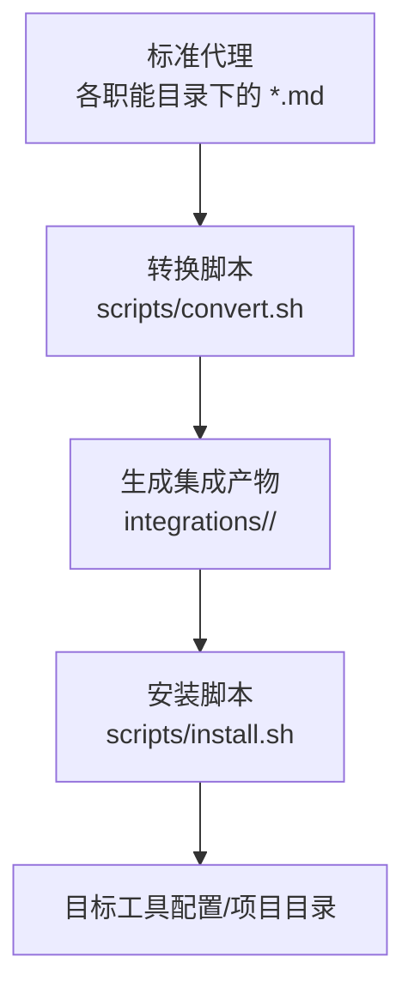
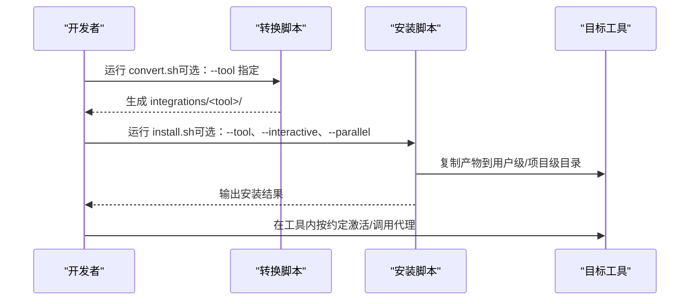
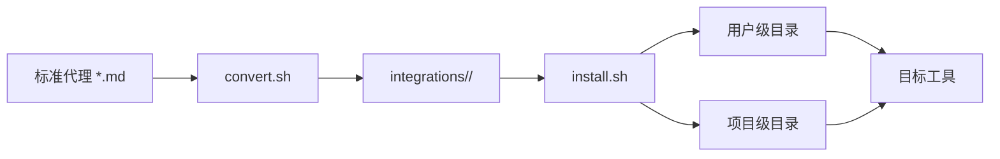

# 工具集成

<cite>
**本文引用的文件**
- [根目录自述文件](file://README.md)
- [集成总览](file://integrations/README.md)
- [安装脚本](file://scripts/install.sh)
- [转换脚本](file://scripts/convert.sh)
- [代理校验脚本](file://scripts/lint-agents.sh)
- [Claude Code 集成说明](file://integrations/claude-code/README.md)
- [GitHub Copilot 集成说明](file://integrations/github-copilot/README.md)
- [Antigravity（Gemini）集成说明](file://integrations/antigravity/README.md)
- [Gemini CLI 集成说明](file://integrations/gemini-cli/README.md)
- [OpenCode 集成说明](file://integrations/opencode/README.md)
- [Cursor 集成说明](file://integrations/cursor/README.md)
- [Aider 集成说明](file://integrations/aider/README.md)
- [Windsurf 集成说明](file://integrations/windsurf/README.md)
- [OpenClaw 集成说明](file://integrations/openclaw/README.md)
- [Kimi Code 集成说明](file://integrations/kimi/README.md)
</cite>

## 目录
1. [简介](#简介)
2. [项目结构](#项目结构)
3. [核心组件](#核心组件)
4. [架构总览](#架构总览)
5. [详细组件分析](#详细组件分析)
6. [依赖关系分析](#依赖关系分析)
7. [性能考量](#性能考量)
8. [故障排除指南](#故障排除指南)
9. [结论](#结论)
10. [附录](#附录)

## 简介
本文件面向“agency-agents 工具集成系统”，系统性说明如何将标准代理格式转换为 10+ 种 AI 编程工具所需的特定格式，并提供安装与使用流程、配置要求、限制条件、最佳实践与故障排除建议。支持的工具包括：Claude Code、GitHub Copilot、Antigravity（Gemini）、Gemini CLI、OpenCode、Cursor、Aider、Windsurf、OpenClaw、Qwen Code、Kimi Code。

## 项目结构
- 标准代理位于各职能分类目录下（如 engineering、design 等），采用统一的 Markdown + YAML 前言格式。
- 转换与安装脚本位于 scripts/ 目录，负责将标准代理批量转换为目标工具格式，并将其复制到对应工具的配置或项目路径。
- 各工具的集成说明位于 integrations/<tool>/README.md，包含安装、激活、格式与注意事项。

图表来源
- [根目录自述文件:508-590](file://README.md#L508-L590)
- [转换脚本:1-639](file://scripts/convert.sh#L1-L639)
- [安装脚本:1-640](file://scripts/install.sh#L1-L640)

章节来源
- [根目录自述文件:508-590](file://README.md#L508-L590)
- [集成总览:1-209](file://integrations/README.md#L1-L209)

## 核心组件
- 标准代理格式：Markdown 文件，前言包含 name、description、color 等字段；正文包含身份、使命、规则、交付物、工作流等。
- 转换器：按工具规范解析标准代理，生成各自所需的文件结构与内容（如 SKILL.md、.mdc、.yaml + system.md、CONVENTIONS.md 等）。
- 安装器：检测本地工具环境，将转换产物复制到目标位置（用户级或项目级），并提供交互式选择与并行安装能力。
- 校验器：对代理文件进行基础校验（前言完整性、推荐段落存在性、内容长度），保障质量。

章节来源
- [代理校验脚本:1-117](file://scripts/lint-agents.sh#L1-L117)
- [转换脚本:83-106](file://scripts/convert.sh#L83-L106)
- [安装脚本:125-162](file://scripts/install.sh#L125-L162)

## 架构总览
系统通过“转换—安装—使用”三步法实现跨工具复用：
- 转换阶段：将标准代理转换为工具特定格式，写入 integrations/<tool>/。
- 安装阶段：检测工具是否存在，复制产物至目标路径（用户级或项目级），并尝试注册（如 OpenClaw）。
- 使用阶段：在各工具界面或命令行中按其约定激活/调用代理。

图表来源
- [转换脚本:521-636](file://scripts/convert.sh#L521-L636)
- [安装脚本:515-637](file://scripts/install.sh#L515-L637)

## 详细组件分析

### Claude Code
- 集成方式：原生支持，无需转换。直接将标准代理复制到 ~/.claude/agents/。
- 安装与使用：
  - 安装：./scripts/install.sh --tool claude-code
  - 激活：在 Claude Code 会话中直接引用代理名称
- 配置要求：无额外前置条件，直接复制即可使用。
- 限制：代理数量较多时，建议按需安装或分批复制。

章节来源
- [Claude Code 集成说明:1-32](file://integrations/claude-code/README.md#L1-L32)
- [根目录自述文件:594-609](file://README.md#L594-L609)

### GitHub Copilot
- 集成方式：原生支持，无需转换。复制到 ~/.github/agents/ 与 ~/.copilot/agents/。
- 安装与使用：
  - 安装：./scripts/install.sh --tool copilot
  - 激活：在 Copilot 会话中引用代理名称
- 配置要求：无额外前置条件，直接复制即可使用。

章节来源
- [GitHub Copilot 集成说明:1-33](file://integrations/github-copilot/README.md#L1-L33)
- [根目录自述文件:611-626](file://README.md#L611-L626)

### Antigravity（Gemini）
- 集成方式：每个代理生成一个 SKILL.md，放置于 ~/.gemini/antigravity/skills/<slug>/。
- 安装与使用：
  - 安装：./scripts/install.sh --tool antigravity
  - 激活：@agency-<slug> 或在 Antigravity 中选择技能
- 格式要点：SKILL.md 包含 name、description、risk、source、date_added 等字段。
- 限制：技能名带 agency- 前缀避免冲突。

章节来源
- [Antigravity 集成说明:1-50](file://integrations/antigravity/README.md#L1-L50)
- [根目录自述文件:628-643](file://README.md#L628-L643)

### Gemini CLI
- 集成方式：作为扩展安装，包含 gemini-extension.json 与 skills/<slug>/SKILL.md。
- 安装与使用：
  - 安装：先 convert.sh --tool gemini-cli，再 install.sh --tool gemini-cli
  - 激活：使用 <slug> 技能名称
- 限制：首次安装需先生成扩展文件。

章节来源
- [Gemini CLI 集成说明:1-41](file://integrations/gemini-cli/README.md#L1-L41)
- [根目录自述文件:645-657](file://README.md#L645-L657)

### OpenCode
- 集成方式：项目级 .md 子代理，放置于 .opencode/agents/<slug>.md。
- 安装与使用：
  - 安装：在项目根目录执行 install.sh --tool opencode
  - 激活：@<slug> 引用或通过 UI 选择
- 格式要点：mode: subagent；color 自动映射为十六进制。
- 限制：默认项目级，若需全局可用需复制到 ~/.config/opencode/agents/。

章节来源
- [OpenCode 集成说明:1-63](file://integrations/opencode/README.md#L1-L63)
- [根目录自述文件:659-681](file://README.md#L659-L681)

### Cursor
- 集成方式：项目级 .mdc 规则文件，放置于 .cursor/rules/<slug>.mdc。
- 安装与使用：
  - 安装：在项目根目录执行 install.sh --tool cursor
  - 激活：在 Cursor 提示中 @<slug> 引用；也可设置 alwaysApply 使规则常驻
- 限制：项目级，需在项目根目录运行安装器。

章节来源
- [Cursor 集成说明:1-39](file://integrations/cursor/README.md#L1-L39)
- [根目录自述文件:683-700](file://README.md#L683-L700)

### Aider
- 集成方式：项目级单文件 CONVENTIONS.md，合并所有代理。
- 安装与使用：
  - 安装：在项目根目录执行 install.sh --tool aider
  - 激活：在 Aider 会话中引用代理名称；也可 aiders --read CONVENTIONS.md
- 限制：项目级，需在项目根目录运行安装器。

章节来源
- [Aider 集成说明:1-39](file://integrations/aider/README.md#L1-L39)
- [根目录自述文件:701-717](file://README.md#L701-L717)

### Windsurf
- 集成方式：项目级 .windsurfrules，合并所有代理。
- 安装与使用：
  - 安装：在项目根目录执行 install.sh --tool windsurf
  - 激活：在 Windsurf 会话中引用代理名称
- 限制：项目级，需在项目根目录运行安装器。

章节来源
- [Windsurf 集成说明:1-27](file://integrations/windsurf/README.md#L1-L27)
- [根目录自述文件:719-735](file://README.md#L719-L735)

### OpenClaw
- 集成方式：每个代理生成一个工作空间，包含 SOUL.md、AGENTS.md、IDENTITY.md；安装后可注册为 agentId。
- 安装与使用：
  - 安装：先 convert.sh --tool openclaw，再 install.sh --tool openclaw
  - 激活：在 OpenClaw 会话中使用 agentId；必要时重启网关
- 限制：需安装 openclaw CLI 并重启网关以生效。

章节来源
- [OpenClaw 集成说明:1-35](file://integrations/openclaw/README.md#L1-L35)
- [根目录自述文件:737-750](file://README.md#L737-L750)

### Qwen Code
- 集成方式：项目级子代理，放置于 .qwen/agents/<slug>.md（项目级）或 ~/.qwen/agents/<slug>.md（用户级）。
- 安装与使用：
  - 安装：在项目根目录执行 convert.sh --tool qwen 与 install.sh --tool qwen
  - 激活：按名称引用或由 Qwen 自动委派；可通过 /agents 管理
- 限制：项目级安装时需在项目根目录运行。

章节来源
- [根目录自述文件:752-771](file://README.md#L752-L771)

### Kimi Code
- 集成方式：每个代理生成 agent.yaml 与 system.md，放置于 ~/.config/kimi/agents/<slug>/。
- 安装与使用：
  - 安装：先 convert.sh --tool kimi，再 install.sh --tool kimi
  - 激活：kimi --agent-file ~/.config/kimi/agents/<slug>/agent.yaml
- 限制：首次安装需先生成集成文件；确保 kimim 命令可用。

章节来源
- [Kimi Code 集成说明:1-109](file://integrations/kimi/README.md#L1-L109)
- [根目录自述文件:773-797](file://README.md#L773-L797)

## 依赖关系分析
- 转换脚本依赖标准代理的 YAML 前言与正文结构，按工具规范输出对应文件。
- 安装脚本依赖转换脚本生成的 integrations/<tool>/ 目录，并根据工具类型复制到用户级或项目级路径。
- 各工具的激活方式与其自身生态耦合（如 @ 前缀、--agent-file、/agents 管理等）。

图表来源
- [转换脚本:521-636](file://scripts/convert.sh#L521-L636)
- [安装脚本:515-637](file://scripts/install.sh#L515-L637)

章节来源
- [转换脚本:521-636](file://scripts/convert.sh#L521-L636)
- [安装脚本:515-637](file://scripts/install.sh#L515-L637)

## 性能考量
- 并行安装：install.sh 支持 --parallel 与 --jobs N，可在多核环境下并行处理多个工具，提升大规模部署效率。
- 并行转换：convert.sh 支持 --parallel，对独立工具转换进行并行化，减少等待时间。
- 输出缓冲：并行模式下安装器会缓冲各工具输出，避免混杂。

章节来源
- [安装脚本:518-532](file://scripts/install.sh#L518-L532)
- [安装脚本:606-626](file://scripts/install.sh#L606-L626)
- [转换脚本:527-536](file://scripts/convert.sh#L527-L536)
- [转换脚本:566-590](file://scripts/convert.sh#L566-L590)

## 故障排除指南
- 安装前未生成集成文件
  - Gemini CLI、OpenCode、Cursor、Aider、Windsurf、OpenClaw、Qwen Code、Kimi Code 需先运行 convert.sh 生成 integrations/<tool>/。
  - 参考：根目录自述文件“Multi-Tool Integrations”章节中的安装步骤。
- 目标工具未检测到
  - 安装器会扫描本地环境，若未检测到工具，可使用 --tool 指定工具或手动安装。
  - 参考：install.sh 的工具检测逻辑与提示信息。
- 项目级工具未在项目根目录安装
  - OpenCode、Cursor、Aider、Windsurf、Qwen Code 默认为项目级，需在项目根目录执行安装。
  - 参考：各工具集成说明中的“Install”小节。
- OpenClaw 注册未生效
  - 安装后可能需要重启网关：openclaw gateway restart。
  - 参考：OpenClaw 集成说明。
- Kimi CLI 无法找到 agent 文件
  - 确认已先 convert.sh 再 install.sh；检查 ~/.config/kimi/agents/<slug>/agent.yaml 是否存在。
  - 参考：Kimi Code 集成说明“Troubleshooting”。

章节来源
- [根目录自述文件:528-590](file://README.md#L528-L590)
- [安装脚本:135-162](file://scripts/install.sh#L135-L162)
- [OpenClaw 集成说明:24-28](file://integrations/openclaw/README.md#L24-L28)
- [Kimi Code 集成说明:83-109](file://integrations/kimi/README.md#L83-L109)

## 结论
该系统通过统一的代理格式与两步式（转换—安装）流程，实现了对 10+ AI 编程工具的高效复用。安装器提供交互式与非交互式两种模式，并支持并行加速；转换器针对各工具的文件结构与激活方式做了精确适配。建议在团队内统一使用 convert.sh 与 install.sh，结合 lint-agents.sh 保证代理质量，并按工具特性选择合适的安装路径（用户级或项目级）。

## 附录

### 安装与配置流程（通用步骤）
- 步骤 1：生成集成文件
  - 全量：./scripts/convert.sh
  - 指定工具：./scripts/convert.sh --tool <tool>
- 步骤 2：安装（交互式/非交互式/并行）
  - 交互式：./scripts/install.sh
  - 非交互式：./scripts/install.sh --no-interactive --tool all
  - 指定工具：./scripts/install.sh --tool <tool>
  - 并行安装：./scripts/install.sh --parallel 或 ./scripts/install.sh --no-interactive --parallel

章节来源
- [根目录自述文件:528-590](file://README.md#L528-L590)
- [转换脚本:521-636](file://scripts/convert.sh#L521-L636)
- [安装脚本:515-637](file://scripts/install.sh#L515-L637)

### 工具差异与选择标准
- 原生支持度：Claude Code、GitHub Copilot 无需转换，最简单直接。
- 扩展/插件：Antigravity（Gemini）、Gemini CLI、OpenClaw 属于扩展/插件型，需生成扩展文件或工作空间。
- 子代理/规则：OpenCode（子代理）、Cursor（规则）、Aider/Windsurf（规则集）、Qwen Code（子代理）适合项目级协作与按需触发。
- 命令行：Kimi Code 适合 CLI 场景，需指定 agent-file。
- 选择建议：
  - 团队统一使用：优先 Claude Code 或 GitHub Copilot（原生支持）。
  - 项目级协作：Cursor、OpenCode、Aider、Windsurf、Qwen Code。
  - 扩展生态：Antigravity、Gemini CLI、OpenClaw。
  - 命令行场景：Kimi Code。

章节来源
- [根目录自述文件:512-525](file://README.md#L512-L525)
- [集成总览:6-18](file://integrations/README.md#L6-L18)