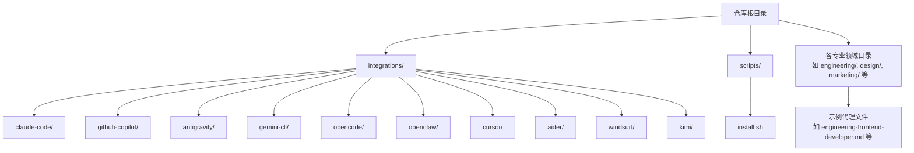
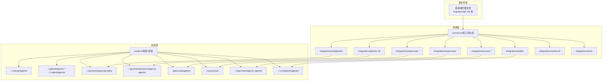
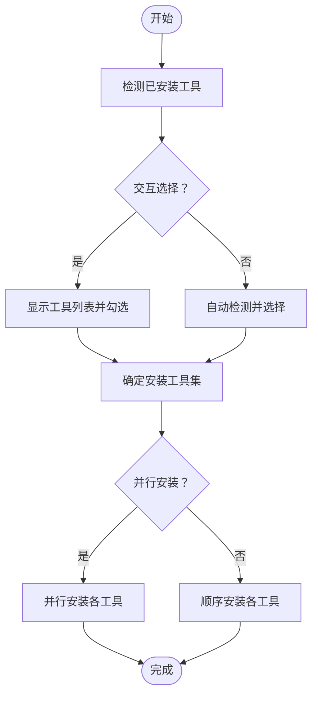

# 支持的工具概览

<cite>
**本文档引用的文件**
- [README.md](file://README.md)
- [integrations/README.md](file://integrations/README.md)
- [scripts/install.sh](file://scripts/install.sh)
- [integrations/claude-code/README.md](file://integrations/claude-code/README.md)
- [integrations/github-copilot/README.md](file://integrations/github-copilot/README.md)
- [integrations/antigravity/README.md](file://integrations/antigravity/README.md)
- [integrations/gemini-cli/README.md](file://integrations/gemini-cli/README.md)
- [integrations/opencode/README.md](file://integrations/opencode/README.md)
- [integrations/openclaw/README.md](file://integrations/openclaw/README.md)
- [integrations/cursor/README.md](file://integrations/cursor/README.md)
- [integrations/aider/README.md](file://integrations/aider/README.md)
- [integrations/windsurf/README.md](file://integrations/windsurf/README.md)
- [integrations/kimi/README.md](file://integrations/kimi/README.md)
- [engineering-frontend-developer.md](file://engineering/engineering-frontend-developer.md)
- [marketing-reddit-community-builder.md](file://marketing/marketing-reddit-community-builder.md)
- [design-whimsy-injector.md](file://design/design-whimsy-injector.md)
- [testing-reality-checker.md](file://testing/testing-reality-checker.md)
</cite>

## 目录
1. [简介](#简介)
2. [项目结构](#项目结构)
3. [核心组件](#核心组件)
4. [架构总览](#架构总览)
5. [详细组件分析](#详细组件分析)
6. [依赖关系分析](#依赖关系分析)
7. [性能考虑](#性能考虑)
8. [故障排除指南](#故障排除指南)
9. [结论](#结论)
10. [附录](#附录)

## 简介
本文件面向需要在多款 AI 编程工具中使用 The Agency 的用户，系统性梳理并对比 10+ 种支持的工具：Claude Code、GitHub Copilot、Antigravity、Gemini CLI、OpenCode、OpenClaw、Cursor、Aider、Windsurf、Kimi Code。内容涵盖各工具的特点、适用场景、集成方式与使用限制，并提供快速安装与基础配置指南，以及自动安装脚本的使用方法。

## 项目结构
- 工具集成入口位于 integrations 目录，包含各工具的转换与安装说明。
- 自动化安装脚本 scripts/install.sh 提供统一的检测、交互选择与并行安装能力。
- 各工具的独立集成说明位于 integrations/<tool>/README.md。
- 代理样例文件位于工程化、设计、营销等分类目录下，展示代理的个性、流程与交付物。

**图表来源**
- [README.md](file://README.md)
- [integrations/README.md](file://integrations/README.md)
- [scripts/install.sh](file://scripts/install.sh)

**章节来源**
- [README.md](file://README.md)
- [integrations/README.md](file://integrations/README.md)

## 核心组件
- 统一安装器：scripts/install.sh
  - 功能：检测本地已安装工具、交互式选择、非交互批量安装、并行加速、输出进度条与完成提示。
  - 支持工具：Claude Code、GitHub Copilot、Antigravity、Gemini CLI、OpenCode、OpenClaw、Cursor、Aider、Windsurf、Qwen Code、Kimi Code。
  - 并行模式：通过 --parallel 与 --jobs 控制并发度，适合多核环境提升安装效率。
- 工具集成说明：integrations/<tool>/README.md
  - 每个工具提供安装步骤、激活方式、文件格式与结构、再生（convert）说明及常见问题处理。
- 代理样例：各领域目录下的 .md 文件
  - 展示代理的个性、使命、规则、技术交付物、工作流、沟通风格、学习记忆与成功指标。

**章节来源**
- [scripts/install.sh](file://scripts/install.sh)
- [integrations/README.md](file://integrations/README.md)

## 架构总览
下图展示了 The Agency 在多工具生态中的集成架构：统一的代理源文件经 convert 过程生成各工具所需的格式，再由 install.sh 安装到目标工具的配置或项目目录中。

**图表来源**
- [README.md](file://README.md)
- [integrations/README.md](file://integrations/README.md)
- [scripts/install.sh](file://scripts/install.sh)

## 详细组件分析

### Claude Code
- 特点：原生支持 .md 代理文件，无需转换；直接复制到 ~/.claude/agents/ 即可使用。
- 适用场景：Claude Code 原生工作流，快速启用代理进行代码与设计任务。
- 集成方式：install.sh --tool claude-code 或手动复制。
- 使用限制：需 Claude Code 客户端可用；代理激活通过会话内名称引用。
- 快速安装：参考 [integrations/claude-code/README.md](file://integrations/claude-code/README.md)

**章节来源**
- [integrations/claude-code/README.md](file://integrations/claude-code/README.md)
- [scripts/install.sh](file://scripts/install.sh)

### GitHub Copilot
- 特点：原生支持 .md 代理文件，无需转换；同时写入 ~/.github 与 ~/.copilot 两个目录。
- 适用场景：在 GitHub Copilot 生态中直接调用代理。
- 集成方式：install.sh --tool copilot 或手动复制。
- 使用限制：需 Copilot 客户端可用；代理激活通过会话内名称引用。
- 快速安装：参考 [integrations/github-copilot/README.md](file://integrations/github-copilot/README.md)

**章节来源**
- [integrations/github-copilot/README.md](file://integrations/github-copilot/README.md)
- [scripts/install.sh](file://scripts/install.sh)

### Antigravity（Gemini）
- 特点：每个代理生成独立 SKILL.md 技能文件，安装至 ~/.gemini/antigravity/skills/agency-<slug>/。
- 适用场景：Antigravity 技能体系，通过 @agency-<slug> 方式调用。
- 集成方式：install.sh --tool antigravity。
- 使用限制：技能命名带 agency- 前缀避免冲突；修改后需重新 convert。
- 快速安装：参考 [integrations/antigravity/README.md](file://integrations/antigravity/README.md)

**章节来源**
- [integrations/antigravity/README.md](file://integrations/antigravity/README.md)
- [scripts/install.sh](file://scripts/install.sh)

### Gemini CLI
- 特点：打包为扩展（extension），包含 gemini-extension.json 与 skills 子目录；安装至 ~/.gemini/extensions/agency-agents/。
- 适用场景：Gemini CLI 扩展生态，按名称引用技能。
- 集成方式：先 convert 再 install，convert 需在 fresh clone 后执行。
- 使用限制：首次安装前必须运行 convert；扩展结构包含清单与技能目录。
- 快速安装：参考 [integrations/gemini-cli/README.md](file://integrations/gemini-cli/README.md)

**章节来源**
- [integrations/gemini-cli/README.md](file://integrations/gemini-cli/README.md)
- [scripts/install.sh](file://scripts/install.sh)

### OpenCode
- 特点：项目级代理，生成 .md 文件放入 .opencode/agents/；支持子代理模式，通过 @agent-name 调用。
- 适用场景：项目内按需调用代理，避免主列表拥挤。
- 集成方式：在项目根目录执行 install.sh --tool opencode。
- 使用限制：项目级作用域；可复制到全局目录 ~/.config/opencode/agents/ 以跨项目使用。
- 快速安装：参考 [integrations/opencode/README.md](file://integrations/opencode/README.md)

**章节来源**
- [integrations/opencode/README.md](file://integrations/opencode/README.md)
- [scripts/install.sh](file://scripts/install.sh)

### OpenClaw
- 特点：每个代理生成工作空间 SOUL.md + AGENTS.md + IDENTITY.md；安装至 ~/.openclaw/agency-agents/ 并注册。
- 适用场景：OpenClaw 工作区管理，按 agentId 直接使用。
- 集成方式：先 convert，再 install；必要时重启 gateway。
- 使用限制：需安装 openclaw CLI；安装后可能需要重启网关。
- 快速安装：参考 [integrations/openclaw/README.md](file://integrations/openclaw/README.md)

**章节来源**
- [integrations/openclaw/README.md](file://integrations/openclaw/README.md)
- [scripts/install.sh](file://scripts/install.sh)

### Cursor
- 特点：将所有代理转换为 .mdc 规则文件，项目级作用域；支持 alwaysApply 等规则。
- 适用场景：Cursor 项目内规则自动应用或显式引用。
- 集成方式：在项目根目录执行 install.sh --tool cursor。
- 使用限制：项目级；规则文件位于 .cursor/rules/。
- 快速安装：参考 [integrations/cursor/README.md](file://integrations/cursor/README.md)

**章节来源**
- [integrations/cursor/README.md](file://integrations/cursor/README.md)
- [scripts/install.sh](file://scripts/install.sh)

### Aider
- 特点：将所有代理合并为单一 CONVENTIONS.md 文件，置于项目根目录；Aider 自动读取。
- 适用场景：在 Aider 会话中引用代理进行协作开发。
- 集成方式：在项目根目录执行 install.sh --tool aider。
- 使用限制：项目级；若存在同名文件会给出警告。
- 快速安装：参考 [integrations/aider/README.md](file://integrations/aider/README.md)

**章节来源**
- [integrations/aider/README.md](file://integrations/aider/README.md)
- [scripts/install.sh](file://scripts/install.sh)

### Windsurf
- 特点：将所有代理合并为单一 .windsurfrules 文件，项目级作用域。
- 适用场景：在 Windsurf Cascade 中按名称引用代理。
- 集成方式：在项目根目录执行 install.sh --tool windsurf。
- 使用限制：项目级；若存在同名文件会给出警告。
- 快速安装：参考 [integrations/windsurf/README.md](file://integrations/windsurf/README.md)

**章节来源**
- [integrations/windsurf/README.md](file://integrations/windsurf/README.md)
- [scripts/install.sh](file://scripts/install.sh)

### Kimi Code
- 特点：将代理转换为 YAML 规范（agent.yaml）与系统提示（system.md）；安装至 ~/.config/kimi/agents/<agent>/。
- 适用场景：通过 --agent-file 指定代理文件；支持 --work-dir 指定项目工作目录。
- 集成方式：convert 后 install；首次安装需 convert。
- 使用限制：需安装 Kimi CLI；agent.yaml 为规范格式，注意校验。
- 快速安装：参考 [integrations/kimi/README.md](file://integrations/kimi/README.md)

**章节来源**
- [integrations/kimi/README.md](file://integrations/kimi/README.md)
- [scripts/install.sh](file://scripts/install.sh)

### Qwen Code（补充说明）
- 特点：将代理转换为 SubAgent 规范，放置于项目级 .qwen/agents/；可通过 /agents 管理刷新。
- 适用场景：在 Qwen Code 中按名称引用或自动委派。
- 集成方式：convert + install；首次安装需 convert。
- 使用限制：项目级；首次安装需 convert。
- 快速安装：参考 [README.md](file://README.md)

**章节来源**
- [README.md](file://README.md)
- [scripts/install.sh](file://scripts/install.sh)

## 依赖关系分析
- 工具检测与安装
  - install.sh 通过 is_detected_* 函数检测各工具是否已安装，决定是否加入安装队列。
  - 支持交互式选择与非交互批量安装；支持并行安装以提升效率。
- 文件生成与安装路径
  - 各工具的安装路径与文件结构在 install.sh 中明确映射，convert 产物与安装路径一一对应。
- 代理文件格式
  - 多数工具采用 .md 或 .mdc 等文本格式；部分工具（如 Gemini CLI、Kimi Code）生成结构化 JSON/YAML 文件。

**图表来源**
- [scripts/install.sh](file://scripts/install.sh)

**章节来源**
- [scripts/install.sh](file://scripts/install.sh)

## 性能考虑
- 并行安装：使用 --parallel 与 --jobs 可显著缩短安装时间，尤其在多工具环境下。
- 输出缓冲：并行模式下安装输出按工具缓冲，避免交错混乱。
- 系统扫描：安装器会扫描系统中已安装工具，仅对检测到的工具执行安装，减少无效操作。

**章节来源**
- [scripts/install.sh](file://scripts/install.sh)

## 故障排除指南
- integrations 目录缺失或过期
  - 现象：install.sh 报错提示 integrations/ 不存在或需要先运行 convert.sh。
  - 处理：先运行 convert.sh 生成转换产物，再执行 install.sh。
- 工具未检测到
  - 现象：安装器未自动勾选某工具。
  - 处理：确认工具已正确安装且可执行；或使用 --tool 显式指定。
- 项目级工具未生效
  - 现象：Cursor、Aider、Windsurf、OpenCode、Qwen Code 等项目级工具未在当前项目生效。
  - 处理：确保在项目根目录执行 install.sh；检查目标目录是否存在。
- Gemini CLI 与 Kimi Code 首次安装失败
  - 现象：找不到扩展文件或 agent.yaml 校验失败。
  - 处理：先 convert 再 install；校验 YAML 格式；确认 CLI 在 PATH 中。

**章节来源**
- [scripts/install.sh](file://scripts/install.sh)
- [integrations/gemini-cli/README.md](file://integrations/gemini-cli/README.md)
- [integrations/kimi/README.md](file://integrations/kimi/README.md)

## 结论
The Agency 提供了统一的代理设计与多工具集成方案。通过 convert 与 install 两步流程，用户可在 Claude Code、GitHub Copilot、Antigravity、Gemini CLI、OpenCode、OpenClaw、Cursor、Aider、Windsurf、Kimi Code 等工具间无缝切换。建议根据团队工作流与工具生态选择合适的工具组合，并利用并行安装提升部署效率。

## 附录

### 快速安装与基本配置指南
- 全量安装（交互式）
  - 步骤：./scripts/convert.sh → ./scripts/install.sh
  - 说明：安装器会自动检测已安装工具并提供交互式选择。
- 指定工具安装
  - 示例：./scripts/install.sh --tool cursor；./scripts/install.sh --tool copilot
- 非交互全量安装
  - 示例：./scripts/install.sh --no-interactive --tool all
- 并行安装（推荐）
  - 示例：./scripts/install.sh --interactive --parallel；./scripts/install.sh --no-interactive --parallel --jobs 4

**章节来源**
- [README.md](file://README.md)
- [scripts/install.sh](file://scripts/install.sh)

### 工具差异与选择标准
- 原生支持工具（无需转换）
  - Claude Code、GitHub Copilot：适合直接在客户端内激活代理。
- 扩展/技能体系
  - Antigravity：Antigravity 技能体系，按 @agency-<slug> 调用。
  - Gemini CLI：扩展形式，convert 后安装。
- 项目级工具
  - Cursor、Aider、Windsurf、OpenCode、Qwen Code：均在项目根目录生成规则/代理文件，便于按需调用。
- 命令行工具
  - Kimi Code：CLI 工具，convert 生成 YAML + system.md，通过 --agent-file 指定。

**章节来源**
- [README.md](file://README.md)
- [integrations/README.md](file://integrations/README.md)

### 代理示例参考
- 工程类：前端开发者（工程化、性能优化、可访问性）
- 营销类：Reddit 社区构建者（文化理解、价值驱动、长期关系）
- 设计类：奇想注入器（品牌个性、微交互、包容性）
- 测试类：现实检查员（证据导向、自动化截图、端到端验证）

这些示例展示了代理的个性、使命、规则、交付物与成功指标，有助于理解不同工具生态下的代理适配与使用方式。

**章节来源**
- [engineering-frontend-developer.md](file://engineering/engineering-frontend-developer.md)
- [marketing-reddit-community-builder.md](file://marketing/marketing-reddit-community-builder.md)
- [design-whimsy-injector.md](file://design/design-whimsy-injector.md)
- [testing-reality-checker.md](file://testing/testing-reality-checker.md)