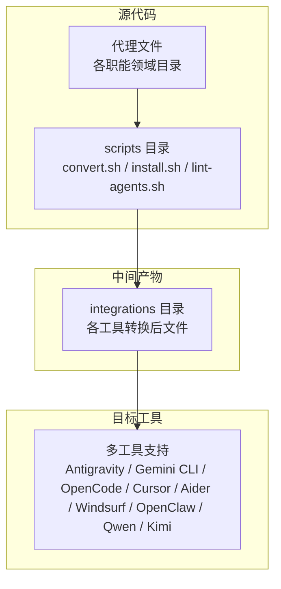
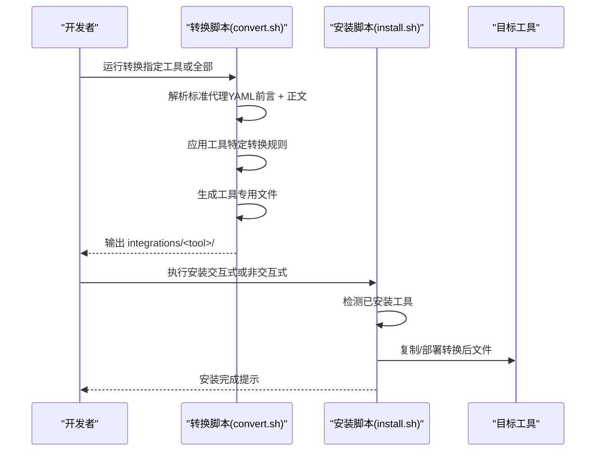
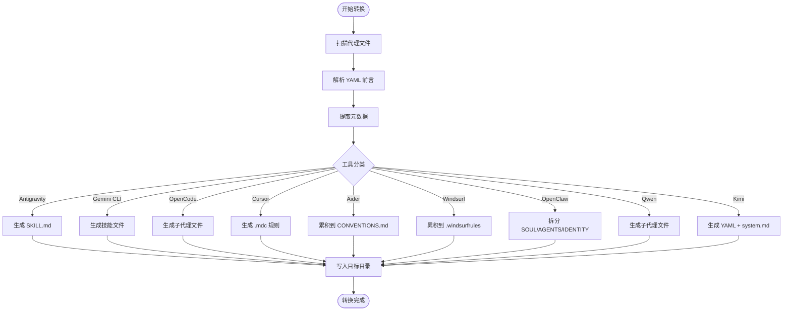
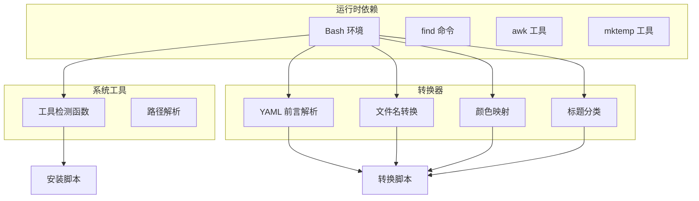

# 格式转换系统

<cite>
**本文档引用的文件**
- [convert.sh](file://scripts/convert.sh)
- [install.sh](file://scripts/install.sh)
- [lint-agents.sh](file://scripts/lint-agents.sh)
- [README.md](file://README.md)
- [integrations/README.md](file://integrations/README.md)
- [integrations/antigravity/README.md](file://integrations/antigravity/README.md)
- [integrations/gemini-cli/README.md](file://integrations/gemini-cli/README.md)
- [integrations/opencode/README.md](file://integrations/opencode/README.md)
- [integrations/cursor/README.md](file://integrations/cursor/README.md)
- [integrations/aider/README.md](file://integrations/aider/README.md)
- [integrations/windsurf/README.md](file://integrations/windsurf/README.md)
- [engineering-frontend-developer.md](file://engineering/engineering-frontend-developer.md)
- [design-ui-designer.md](file://design/design-ui-designer.md)
- [marketing-growth-hacker.md](file://marketing/marketing-growth-hacker.md)
</cite>

## 目录
1. [简介](#简介)
2. [项目结构](#项目结构)
3. [核心组件](#核心组件)
4. [架构总览](#架构总览)
5. [详细组件分析](#详细组件分析)
6. [依赖关系分析](#依赖关系分析)
7. [性能考虑](#性能考虑)
8. [故障排除指南](#故障排除指南)
9. [结论](#结论)
10. [附录](#附录)

## 简介
本项目提供一套完整的格式转换系统，用于将标准代理格式（Markdown + YAML 前言）转换为多个工具所需的特定格式。系统通过统一的转换脚本将仓库中各专业领域的代理文件批量转换为目标工具的集成格式，并通过安装脚本将生成的文件部署到对应工具的配置目录或项目根目录。

该系统的核心价值在于：
- 统一的代理模板与元数据规范，确保跨工具一致性
- 自动化的转换与安装流程，降低使用门槛
- 可扩展的适配器设计，便于新增工具支持
- 完善的校验与调试机制，保障转换质量

## 项目结构
仓库采用按职能划分的目录结构，核心转换逻辑集中在 scripts 目录，工具集成说明位于 integrations 目录，代理文件分布在各个职能领域下。

**图表来源**
- [convert.sh](file://scripts/convert.sh)
- [install.sh](file://scripts/install.sh)
- [integrations/README.md](file://integrations/README.md)

**章节来源**
- [README.md](file://README.md)
- [integrations/README.md](file://integrations/README.md)

## 核心组件
系统由三个核心脚本组成：转换脚本负责将标准代理转换为各工具格式；安装脚本负责将转换后的文件部署到目标环境；校验脚本负责检查代理文件的完整性与规范性。

### 转换脚本（convert.sh）
- 支持的工具：Antigravity、Gemini CLI、OpenCode、Cursor、Aider、Windsurf、OpenClaw、Qwen、Kimi、全部工具
- 并行处理：对独立工具执行并行转换以提升效率
- 输出管理：生成 integrations/<tool>/ 下的工具专用文件
- 单文件聚合：Aider 和 Windsurf 将所有代理内容合并为单一文件

### 安装脚本（install.sh）
- 工具检测：自动扫描本地已安装工具并提供交互式选择
- 部署策略：根据工具类型将文件复制到用户主目录或项目根目录
- 并行安装：支持并行安装多个工具以提升效率
- 项目作用域：部分工具（如 OpenCode、Cursor、Aider、Windsurf、Qwen、Kimi）采用项目级安装

### 校验脚本（lint-agents.sh）
- 必填前言字段：name、description、color
- 推荐内容结构：Identity、Core Mission、Critical Rules
- 内容质量检查：最小字数阈值，避免空洞内容

**章节来源**
- [convert.sh](file://scripts/convert.sh)
- [install.sh](file://scripts/install.sh)
- [lint-agents.sh](file://scripts/lint-agents.sh)

## 架构总览
系统采用“转换-安装-验证”的三层架构，确保从标准代理到各工具可用格式的完整链路。

**图表来源**
- [convert.sh](file://scripts/convert.sh)
- [install.sh](file://scripts/install.sh)

**章节来源**
- [README.md](file://README.md)
- [integrations/README.md](file://integrations/README.md)

## 详细组件分析

### 标准代理格式规范
所有代理文件遵循统一的 YAML 前言规范，包含必需字段和可选增强字段：

- 必需字段
  - name：代理名称（用于文件名和工具显示）
  - description：简短描述（用于工具列表展示）
  - color：颜色标识（用于界面着色）

- 可选增强字段
  - emoji：表情符号（用于界面装饰）
  - vibe：个性描述（用于身份塑造）
  - tools：工具列表（用于支持外部工具调用的代理）

示例文件展示了标准格式的完整结构，包括身份记忆、核心使命、关键规则、技术交付物、工作流程、沟通风格、成功指标等章节。

**章节来源**
- [engineering-frontend-developer.md](file://engineering/engineering-frontend-developer.md)
- [design-ui-designer.md](file://design/design-ui-designer.md)
- [marketing-growth-hacker.md](file://marketing/marketing-growth-hacker.md)

### Antigravity 适配器
Antigravity 是 Google Gemini 的技能系统，采用社区技能格式。

- 文件结构：每个代理转换为独立的 SKILL.md 文件
- 目录布局：integrations/antigravity/<slug>/SKILL.md
- 命名约定：文件夹名为 agency-<agent-name>，避免冲突
- 前言字段：name（使用 agency- 前缀）、description、risk、source、date_added

转换规则要点：
- 自动生成 agency- 前缀的技能名称
- 固定风险级别和来源信息
- 添加标准化日期戳

**章节来源**
- [convert.sh](file://scripts/convert.sh)
- [integrations/antigravity/README.md](file://integrations/antigravity/README.md)

### Gemini CLI 适配器
Gemini CLI 采用扩展包 + 技能文件的组合方式。

- 文件结构：扩展清单 + 技能目录
- 目录布局：integrations/gemini-cli/gemini-extension.json + skills/<slug>/SKILL.md
- 前言字段：仅包含 name 和 description
- 扩展清单：自动生成版本信息

转换规则要点：
- 生成标准扩展清单文件
- 技能文件保持简洁的 YAML 前言
- 自动创建技能目录结构

**章节来源**
- [convert.sh](file://scripts/convert.sh)
- [integrations/gemini-cli/README.md](file://integrations/gemini-cli/README.md)

### OpenCode 适配器
OpenCode 采用项目级子代理模式，支持按需调用。

- 文件结构：.opencode/agents/<slug>.md
- 前言字段：name、description、mode（固定为 subagent）、color（十六进制）
- 颜色映射：将命名颜色转换为标准十六进制值
- 调用方式：通过 @agent-name 在对话中按需激活

转换规则要点：
- 自动解析并标准化颜色值
- 设置 mode 为 subagent，避免干扰主代理列表
- 生成项目级文件，适合团队协作

**章节来源**
- [convert.sh](file://scripts/convert.sh)
- [integrations/opencode/README.md](file://integrations/opencode/README.md)

### Cursor 适配器
Cursor 使用 .mdc 规则文件格式，支持项目级规则应用。

- 文件结构：.cursor/rules/<slug>.mdc
- 前言字段：description、globs（默认为空字符串）、alwaysApply（布尔值）
- 规则特性：支持全局匹配模式和始终应用选项
- 调用方式：在编辑器中通过 @agent-name 引用

转换规则要点：
- 自动生成基础规则框架
- 支持配置为始终生效的规则
- 适用于项目级代码审查和指导

**章节来源**
- [convert.sh](file://scripts/convert.sh)
- [integrations/cursor/README.md](file://integrations/cursor/README.md)

### Aider 适配器
Aider 采用单一 CONVENTIONS.md 文件集中管理模式。

- 文件结构：integrations/aider/CONVENTIONS.md
- 内容组织：将所有代理按标准格式合并为单一文件
- 使用方式：Aider 自动读取项目根目录的 CONVENTIONS.md
- 调用方式：在会话中直接引用代理名称

转换规则要点：
- 采用累积模式，逐个代理追加内容
- 保持标准标题和分隔符格式
- 适合团队共享的通用代理知识库

**章节来源**
- [convert.sh](file://scripts/convert.sh)
- [integrations/aider/README.md](file://integrations/aider/README.md)

### Windsurf 适配器
Windsurf 采用项目级 .windsurfrules 文件格式。

- 文件结构：integrations/windsurf/.windsurfrules
- 内容组织：与 Aider 类似的累积模式
- 使用方式：项目根目录的规则文件自动生效
- 调用方式：在 Cascade 中通过代理名称引用

转换规则要点：
- 统一的分隔符和标题格式
- 支持项目级规则的集中管理
- 便于团队协作和知识共享

**章节来源**
- [convert.sh](file://scripts/convert.sh)
- [integrations/windsurf/README.md](file://integrations/windsurf/README.md)

### OpenClaw 适配器
OpenClaw 采用工作空间模式，将代理拆分为多个专用文件。

- 文件结构：integrations/openclaw/<slug>/<SOUL.md | AGENTS.md | IDENTITY.md>
- 文件分工：
  - SOUL.md：代理的人格、记忆、沟通风格等
  - AGENTS.md：任务、交付物、工作流程等
  - IDENTITY.md：身份标识（emoji + name 或 name + vibe）
- 目录布局：每个代理对应独立工作空间

转换规则要点：
- 基于标题关键字自动分类内容
- SOUL 关键词：identity、memory、communication、style、critical rules、rules you must follow
- AGENTS 关键词：其余所有内容
- 自动生成身份标识文件

**章节来源**
- [convert.sh](file://scripts/convert.sh)

### Qwen Code 适配器
Qwen Code 采用子代理（SubAgent）模式，支持项目级部署。

- 文件结构：integrations/qwen/agents/<slug>.md
- 前言字段：name、description（必填），tools（可选）
- 部署位置：项目根目录的 .qwen/agents/
- 调用方式：支持按名称引用或自动委派

转换规则要点：
- tools 字段仅在源文件存在时保留
- 生成标准的子代理文件格式
- 支持项目级和用户级两种部署方式

**章节来源**
- [convert.sh](file://scripts/convert.sh)

### Kimi Code 适配器
Kimi Code 采用 YAML 配置 + 系统提示分离的模式。

- 文件结构：integrations/kimi/<slug>/agent.yaml + system.md
- 配置特点：使用 extend: default 继承 Kimi 默认工具集
- 系统提示：独立的 system.md 文件，便于维护
- 部署位置：用户配置目录的 ~/.config/kimi/agents/

转换规则要点：
- 自动生成 YAML 配置文件
- 分离系统提示文本，便于更新
- 支持工作目录参数化

**章节来源**
- [convert.sh](file://scripts/convert.sh)

### 转换算法与数据流
转换过程采用“解析-映射-生成”的三阶段算法：

**图表来源**
- [convert.sh](file://scripts/convert.sh)

**章节来源**
- [convert.sh](file://scripts/convert.sh)

## 依赖关系分析
系统依赖关系清晰，主要涉及以下方面：

**图表来源**
- [convert.sh](file://scripts/convert.sh)
- [install.sh](file://scripts/install.sh)

**章节来源**
- [convert.sh](file://scripts/convert.sh)
- [install.sh](file://scripts/install.sh)

## 性能考虑
系统在设计时充分考虑了性能优化：

- 并行处理
  - 转换阶段：对独立工具使用 xargs -P 并行执行
  - 安装阶段：支持工具间的并行安装
  - 默认并发数：基于系统核心数动态确定

- 缓冲输出
  - 并行模式下使用临时目录缓冲各工具输出
  - 确保每个工具的输出顺序正确性

- 内存管理
  - 使用临时文件存储累积内容（Aider、Windsurf）
  - 避免大文件一次性加载到内存

- I/O 优化
  - 批量文件操作减少系统调用次数
  - 合理的目录创建策略避免重复操作

## 故障排除指南
常见问题及解决方案：

### 转换失败
- 检查代理文件是否包含有效的 YAML 前言
- 确认必需字段（name、description、color）是否存在
- 验证文件编码是否为 UTF-8

### 安装失败
- 确认目标工具已正确安装并可被检测到
- 检查用户权限是否足够写入目标目录
- 对于项目级工具，确认当前目录是否为项目根目录

### 并行模式问题
- 减少并发作业数：使用 --jobs 参数限制
- 检查系统资源使用情况
- 关闭不必要的后台进程

### 颜色映射错误
- 确认颜色名称符合预定义列表
- 检查十六进制颜色格式是否正确
- 使用标准颜色名称而非自定义值

**章节来源**
- [lint-agents.sh](file://scripts/lint-agents.sh)
- [install.sh](file://scripts/install.sh)

## 结论
格式转换系统通过标准化的代理模板和灵活的适配器设计，实现了从单一代理到多工具生态的无缝转换。系统具备以下优势：

- 统一规范：所有代理遵循一致的 YAML 前言和内容结构
- 自动化程度高：从转换到安装全程自动化，支持并行处理
- 可扩展性强：适配器模式便于新增工具支持
- 质量保障：内置校验机制确保转换质量
- 用户友好：提供详细的使用说明和故障排除指南

该系统为构建跨平台、可移植的智能体生态系统提供了坚实的技术基础。

## 附录

### 扩展新工具支持指南
新增工具支持的基本步骤：

1. **分析目标格式**
   - 确定文件结构和命名约定
   - 识别必需的元数据字段
   - 了解部署位置和访问方式

2. **实现转换器**
   - 在 convert.sh 中添加新的 convert_<tool>() 函数
   - 实现文件生成逻辑和目录创建
   - 处理特殊需求（如颜色映射、标题分类）

3. **实现安装器**
   - 在 install.sh 中添加工具检测函数
   - 实现文件部署逻辑
   - 处理项目级和用户级安装差异

4. **编写文档**
   - 更新 integrations/README.md
   - 创建工具特定的 README.md
   - 提供使用示例和故障排除指南

5. **测试验证**
   - 运行 lint-agents.sh 验证代理格式
   - 手动测试转换和安装流程
   - 验证工具集成效果

### 调试和验证方法
- 使用 --tool 参数进行定向测试
- 启用详细日志输出（脚本内部已包含进度提示）
- 利用校验脚本检查代理文件完整性
- 手动验证生成文件的内容和格式
- 在目标工具中实际测试功能