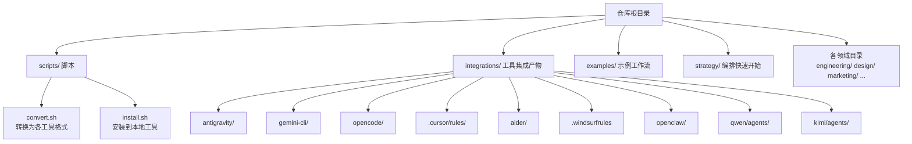
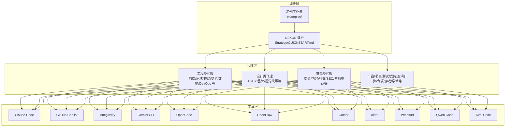
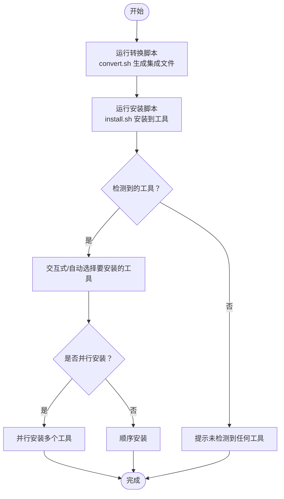
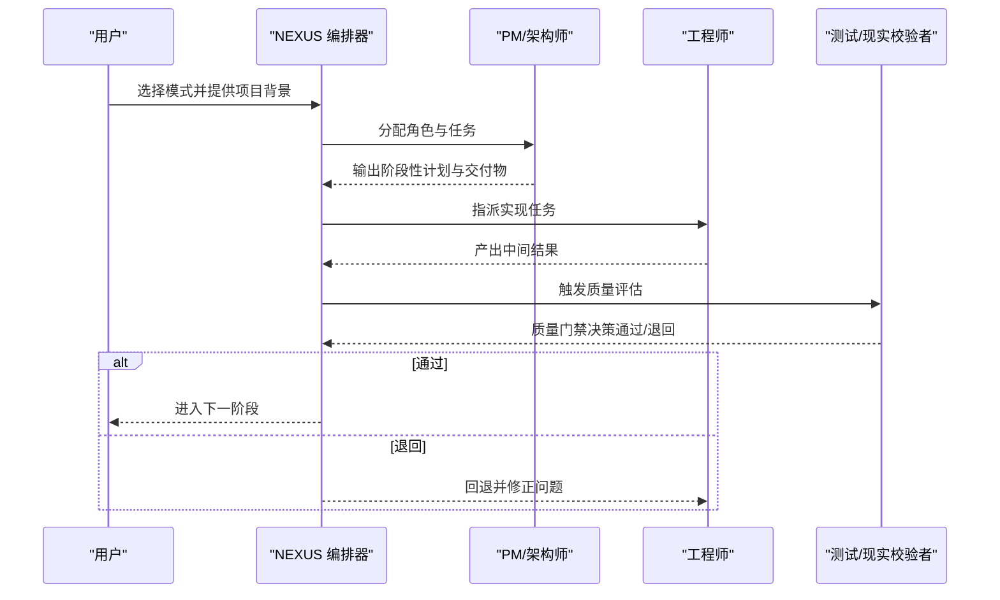
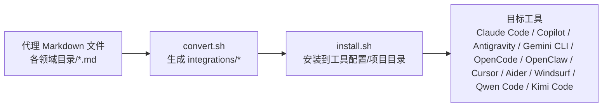

# 快速开始

<cite>
**本文引用的文件列表**
- [README.md](file://README.md)
- [strategy/QUICKSTART.md](file://strategy/QUICKSTART.md)
- [scripts/install.sh](file://scripts/install.sh)
- [scripts/convert.sh](file://scripts/convert.sh)
- [integrations/README.md](file://integrations/README.md)
- [examples/README.md](file://examples/README.md)
- [examples/workflow-startup-mvp.md](file://examples/workflow-startup-mvp.md)
- [examples/workflow-with-memory.md](file://examples/workflow-with-memory.md)
- [engineering/engineering-frontend-developer.md](file://engineering/engineering-frontend-developer.md)
- [design/design-ui-designer.md](file://design/design-ui-designer.md)
- [marketing/marketing-content-creator.md](file://marketing/marketing-content-creator.md)
</cite>

## 目录
1. [简介](#简介)
2. [项目结构](#项目结构)
3. [核心组件](#核心组件)
4. [架构总览](#架构总览)
5. [详细组件分析](#详细组件分析)
6. [依赖关系分析](#依赖关系分析)
7. [性能与可扩展性](#性能与可扩展性)
8. [故障排查指南](#故障排查指南)
9. [结论](#结论)
10. [附录](#附录)

## 简介
本指南面向希望快速上手 agency-agents 的用户，帮助你用最短时间掌握项目的核心价值、三种主要使用方式（直接使用 Claude Code、作为参考文档、与其他 AI 工具集成）、安装与配置步骤、首次使用示例，并理解代理系统的架构优势（专业化、个性化、可交付成果导向）。同时提供真实场景与成功案例，让你快速看到“把一整个专业团队装进一个仓库”的效果。

## 项目结构
- 顶层 README 提供总体介绍、三大使用方式、多工具集成说明与大量代理清单。
- scripts/ 提供转换与安装脚本，一键生成各工具所需的集成文件并安装到本地。
- integrations/ 为各工具准备的转换产物目录（如 antigravity、gemini-cli、opencode、cursor、aider、windsurf、openclaw、qwen、kimi）。
- 各领域目录（如 engineering、design、marketing、product、project-management、testing、support、spatial-computing、specialized、game-development、academic、paid-media、sales）下存放具体代理定义文件（Markdown），每个文件包含身份、个性、使命、规则、技术交付物、流程与成功指标等。
- examples/ 包含多代理协作的真实工作流示例，展示从发现到落地的完整过程。
- strategy/ 提供 NEXUS 多代理编排的快速启动指南，帮助你按阶段组织跨职能团队。

图表来源
- [README.md:508-590](file://README.md#L508-L590)
- [scripts/convert.sh:1-639](file://scripts/convert.sh#L1-L639)
- [scripts/install.sh:1-640](file://scripts/install.sh#L1-L640)

章节来源
- [README.md:25-64](file://README.md#L25-L64)
- [integrations/README.md:1-209](file://integrations/README.md#L1-L209)

## 核心组件
- 代理定义（Agent Definition）
  - 每个代理是一个 Markdown 文件，包含 YAML 前言块（名称、描述、颜色、表情、气场等）与正文（身份、记忆、使命、关键规则、技术交付物、工作流程、成功指标、沟通风格、学习与记忆、工具列表等）。
  - 示例：前端开发专家、UI 设计师、内容创作者等。
- 工具集成（Tool Integrations）
  - 通过 convert.sh 将代理转换为各工具所需格式；再由 install.sh 安装到对应工具的配置或项目目录中。
  - 支持工具：Claude Code、GitHub Copilot、Antigravity、Gemini CLI、OpenCode、OpenClaw、Cursor、Aider、Windsurf、Qwen Code、Kimi Code。
- 编排与工作流（Orchestration & Workflows）
  - strategy/QUICKSTART.md 提供 NEXUS 多代理编排的三种模式（Full、Sprint、Micro），明确阶段、角色与质量门禁。
  - examples/ 下的工作流示例展示了跨职能团队如何在真实项目中协作。

章节来源
- [README.md:450-475](file://README.md#L450-L475)
- [strategy/QUICKSTART.md:1-195](file://strategy/QUICKSTART.md#L1-L195)
- [examples/README.md:1-49](file://examples/README.md#L1-L49)

## 架构总览
agency-agents 的架构优势体现在“专业化、个性化、可交付成果导向”：
- 专业化：每个代理聚焦特定领域与任务，拥有深度技能与流程。
- 个性化：代理具备独特的人格、语气与风格，便于在不同场景中自然协作。
- 可交付成果导向：明确的交付物模板、成功指标与证据要求，确保输出可验证、可复用。

图表来源
- [README.md:68-283](file://README.md#L68-L283)
- [strategy/QUICKSTART.md:11-195](file://strategy/QUICKSTART.md#L11-L195)
- [integrations/README.md:6-18](file://integrations/README.md#L6-L18)

## 详细组件分析

### 使用方式一：直接使用 Claude Code（推荐）
- 适用场景：无需转换，直接复制代理到 Claude Code 配置目录即可使用。
- 步骤：
  - 将代理复制到 Claude Code 的 agents 目录（或使用安装脚本自动完成）。
  - 在 Claude Code 中激活代理，例如“前端开发者模式”，让其帮助你构建 React 组件。
- 优点：零转换成本，即开即用。

章节来源
- [README.md:27-35](file://README.md#L27-L35)
- [integrations/README.md:50-61](file://integrations/README.md#L50-L61)

### 使用方式二：作为参考文档使用
- 适用场景：浏览代理定义，复制/适配你需要的部分，用于自定义工作流或二次开发。
- 内容要点：每个代理文件包含身份与个性、核心使命、关键规则、技术交付物、工作流程、成功指标与沟通风格等。
- 建议：先看 examples/ 中的完整工作流，再回过头阅读单个代理的定义，理解“如何把一个想法变成可交付成果”。

章节来源
- [README.md:37-45](file://README.md#L37-L45)
- [examples/README.md:5-49](file://examples/README.md#L5-L49)

### 使用方式三：与其他 AI 工具集成使用
- 适用场景：在 Cursor、Aider、Windsurf、Gemini CLI、OpenCode、Kimi Code 等工具中使用相同的代理能力。
- 步骤：
  - 先运行转换脚本生成各工具所需的集成文件。
  - 再运行安装脚本，将代理安装到对应工具的配置或项目目录中。
- 支持工具与安装方式详见下方“多工具集成”小节。

章节来源
- [README.md:47-64](file://README.md#L47-L64)
- [integrations/README.md:19-38](file://integrations/README.md#L19-L38)

### 多工具集成与安装
- 工具清单与安装位置
  - Claude Code：~/.claude/agents/
  - GitHub Copilot：~/.github/agents/ 与 ~/.copilot/agents/
  - Antigravity：~/.gemini/antigravity/skills/
  - Gemini CLI：~/.gemini/extensions/agency-agents/
  - OpenCode：项目根目录 .opencode/agents/
  - OpenClaw：~/.openclaw/agency-agents/
  - Cursor：项目根目录 .cursor/rules/
  - Aider：项目根目录 CONVENTIONS.md
  - Windsurf：项目根目录 .windsurfrules
  - Qwen Code：项目根目录 .qwen/agents/ 或用户级 ~/.qwen/agents/
  - Kimi Code：~/.config/kimi/agents/
- 安装脚本特性
  - 自动检测已安装工具，交互式选择或非交互式批量安装。
  - 支持并行安装，加速多工具部署。
  - 生成集成文件后再安装，避免“找不到转换产物”的错误。

图表来源
- [scripts/convert.sh:1-639](file://scripts/convert.sh#L1-L639)
- [scripts/install.sh:1-640](file://scripts/install.sh#L1-L640)
- [integrations/README.md:19-38](file://integrations/README.md#L19-L38)

章节来源
- [README.md:508-590](file://README.md#L508-L590)
- [scripts/convert.sh:9-26](file://scripts/convert.sh#L9-L26)
- [scripts/install.sh:9-32](file://scripts/install.sh#L9-L32)

### NEXUS 编排快速开始（三种模式）
- NEXUS-Full：从零到一构建完整项目，覆盖 Discovery、Strategy、Foundation、Build、Harden、Launch、Operate 七个阶段。
- NEXUS-Sprint：聚焦功能或 MVP，跳过 Discovery，直接进入 Strategy 与 Build 循环。
- NEXUS-Micro：针对具体任务（修复缺陷、跑营销活动、合规审计、性能诊断、市场研究、UX 改进）的最小闭环。
- 关键原则：质量门禁、Dev↔QA 循环、标准化交接、最终由“现实校验者”把关。

图表来源
- [strategy/QUICKSTART.md:21-121](file://strategy/QUICKSTART.md#L21-L121)

章节来源
- [strategy/QUICKSTART.md:11-195](file://strategy/QUICKSTART.md#L11-L195)

### 实际使用场景与成功案例
- 场景一：从想法到 MVP 的全链路
  - 团队组成：冲刺优先级、UX 研究、后端架构、前端开发、快速原型、增长黑客、现实校验者。
  - 结果：4 周内完成可上线的 MVP，包含用户注册、核心功能与落地页。
- 场景二：多渠道营销活动
  - 团队组成：内容创作者、社交媒体策略师、社区运营、数据分析员、增长黑客。
  - 结果：跨平台协调一致的营销活动，平台特定优化与持续追踪。
- 场景三：企业特性开发
  - 团队组成：项目经理、高级开发者、UI 设计师、实验跟踪、证据收集、现实校验者。
  - 结果：企业级交付，质量门禁与文档齐备。
- 场景四：付费媒体账户接管
  - 团队组成：付费媒体审计师、追踪与测量专家、PPC 策略师、搜索查询分析师、广告创意策略师、数据分析员。
  - 结果：30 天内完成账户结构优化、追踪验证、创意刷新与报表体系建立。
- 场景五：全机构建产品蓝图
  - 团队组成：产品趋势研究员、后端架构师、品牌守护者、增长黑客、支持响应者、UX 研究者、项目牧羊人、XR 接口架构师。
  - 结果：一次会话产出覆盖市场验证、技术架构、品牌策略、上市与支持、UX 研究、项目执行与空间界面的完整蓝图。

章节来源
- [README.md:352-416](file://README.md#L352-L416)
- [examples/README.md:13-49](file://examples/README.md#L13-L49)

## 依赖关系分析
- 代码级依赖
  - convert.sh 依赖各领域目录下的代理 Markdown 文件，解析前言块并生成各工具所需的文件。
  - install.sh 依赖 convert.sh 生成的 integrations/ 目录，按工具类型写入对应路径。
- 运行时依赖
  - 各工具的可用性决定安装是否成功（如 ~/.claude、~/.github、~/.copilot、~/.gemini 等目录存在与否）。
  - 并行安装需要系统支持 xargs 与临时输出缓冲，避免多进程输出交错。

图表来源
- [scripts/convert.sh:480-517](file://scripts/convert.sh#L480-L517)
- [scripts/install.sh:296-510](file://scripts/install.sh#L296-L510)

章节来源
- [scripts/convert.sh:480-639](file://scripts/convert.sh#L480-L639)
- [scripts/install.sh:512-640](file://scripts/install.sh#L512-L640)

## 性能与可扩展性
- 转换与安装的并行化
  - convert.sh 与 install.sh 均支持并行模式，通过 --parallel 与 --jobs 控制并发度，显著缩短多工具部署时间。
- 代理规模与维护
  - 项目包含 144 个专业化代理，建议按需引入，先从高频使用的代理开始，逐步扩展。
- 工具兼容性
  - 不同工具对代理格式有差异，统一通过 convert.sh 生成，install.sh 自动适配，降低维护成本。

章节来源
- [README.md:498-505](file://README.md#L498-L505)
- [scripts/convert.sh:27-28](file://scripts/convert.sh#L27-L28)
- [scripts/install.sh:29-31](file://scripts/install.sh#L29-L31)

## 故障排查指南
- “找不到 integrations/”
  - 现象：install.sh 报错提示 integrations/ 不存在。
  - 解决：先运行 convert.sh 生成集成文件，再执行 install.sh。
- “未检测到任何工具”
  - 现象：install.sh 扫描不到已安装工具。
  - 解决：确认目标工具的配置目录是否存在；或使用 --tool 指定工具强制安装。
- “并行安装输出混乱”
  - 现象：并行安装时输出交错。
  - 解决：使用 --jobs 指定最大并发数，或关闭并行模式。
- “代理无法在 Cursor/Aider/Windsurf 中生效”
  - 现象：项目内找不到代理规则或约定。
  - 解决：确保在项目根目录运行安装脚本，并检查 .cursor/rules/、CONVENTIONS.md、.windsurfrules 是否存在。

章节来源
- [scripts/install.sh:124-130](file://scripts/install.sh#L124-L130)
- [scripts/install.sh:534-544](file://scripts/install.sh#L534-L544)
- [scripts/install.sh:577-583](file://scripts/install.sh#L577-L583)
- [integrations/README.md:36-38](file://integrations/README.md#L36-L38)

## 结论
agency-agents 将“专业化、个性化、可交付成果导向”的代理理念与多工具生态无缝衔接，既能作为参考文档灵活借鉴，也能通过脚本一键部署到主流 AI 编程工具中。配合 NEXUS 编排与真实工作流示例，你可以快速从“单打独斗”走向“跨职能协作”，把一整个专业团队装进你的工作流里。

## 附录

### 首次使用示例（三步走）
- 直接使用 Claude Code
  - 复制代理到 ~/.claude/agents/，在 Claude Code 中激活并开始对话。
- 作为参考文档
  - 浏览 examples/ 中的完整工作流，理解“如何把一个想法变成可交付成果”。
- 与其他工具集成
  - 运行 ./scripts/convert.sh 生成集成文件，再 ./scripts/install.sh 安装到目标工具。

章节来源
- [README.md:27-64](file://README.md#L27-L64)
- [examples/README.md:13-49](file://examples/README.md#L13-L49)

### 代理示例片段路径（不展示具体内容）
- 前端开发专家：[engineering/engineering-frontend-developer.md:1-200](file://engineering/engineering-frontend-developer.md#L1-L200)
- UI 设计师：[design/design-ui-designer.md:1-200](file://design/design-ui-designer.md#L1-L200)
- 内容创作者：[marketing/marketing-content-creator.md:1-54](file://marketing/marketing-content-creator.md#L1-L54)