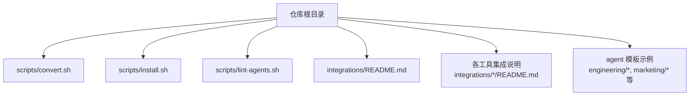
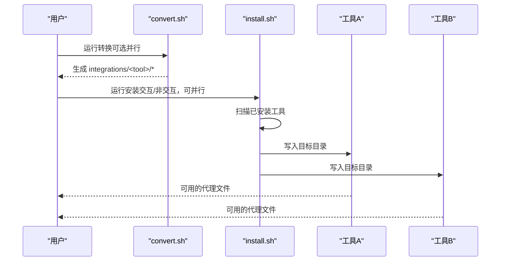
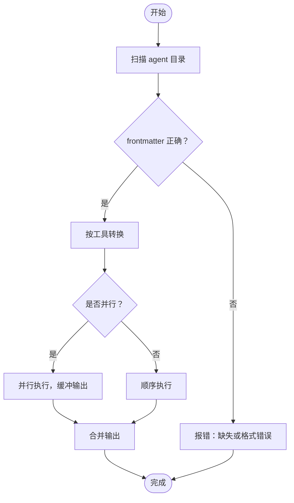
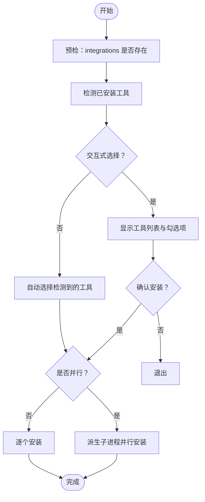

# 故障排除与常见问题

<cite>
**本文引用的文件**
- [README.md](file://README.md)
- [integrations/README.md](file://integrations/README.md)
- [scripts/convert.sh](file://scripts/convert.sh)
- [scripts/install.sh](file://scripts/install.sh)
- [scripts/lint-agents.sh](file://scripts/lint-agents.sh)
- [CONTRIBUTING.md](file://CONTRIBUTING.md)
- [integrations/antigravity/README.md](file://integrations/antigravity/README.md)
- [integrations/cursor/README.md](file://integrations/cursor/README.md)
- [integrations/aider/README.md](file://integrations/aider/README.md)
- [engineering-frontend-developer.md](file://engineering/engineering-frontend-developer.md)
- [marketing-reddit-community-builder.md](file://marketing/marketing-reddit-community-builder.md)
</cite>

## 目录
1. [简介](#简介)
2. [项目结构](#项目结构)
3. [核心组件](#核心组件)
4. [架构总览](#架构总览)
5. [详细组件分析](#详细组件分析)
6. [依赖关系分析](#依赖关系分析)
7. [性能考虑](#性能考虑)
8. [故障排除指南](#故障排除指南)
9. [结论](#结论)
10. [附录](#附录)

## 简介
本指南面向使用 agency-agents 的用户与维护者，聚焦安装与工具集成过程中的常见问题与排错方法，覆盖工具检测失败、权限问题、路径配置错误、代理文件格式错误、转换失败、安装不完整、性能优化、调试技巧与知识库，并提供社区支持渠道与版本兼容性信息。

## 项目结构
- 核心脚本
  - 转换脚本：将标准 agent 模板转换为各工具所需的格式（如 Cursor 的 .mdc、Aider 的 CONVENTIONS.md、Kimi 的 agent.yaml 等）
  - 安装脚本：扫描本地已安装工具，生成交互式选择界面，按需并行安装到对应目录
  - 代理校验脚本：对 agent 模板进行基础校验（frontmatter、推荐章节、内容长度）
- 工具集成说明：各工具的安装与使用方式、文件格式、注意事项
- 示例 agent：前端开发、Reddit 社区运营等，用于理解模板结构与最佳实践

图示来源
- [README.md](file://README.md)
- [integrations/README.md](file://integrations/README.md)
- [scripts/convert.sh](file://scripts/convert.sh)
- [scripts/install.sh](file://scripts/install.sh)
- [scripts/lint-agents.sh](file://scripts/lint-agents.sh)

章节来源
- [README.md](file://README.md)
- [integrations/README.md](file://integrations/README.md)

## 核心组件
- 转换器 convert.sh
  - 功能：解析 agent 模板，输出各工具所需格式；支持并行转换；生成扩展清单（如 Gemini CLI）
  - 关键点：严格要求 agent 文件具备 YAML frontmatter 开头与必要字段；按工具拆分输出目录
- 安装器 install.sh
  - 功能：自动检测已安装工具；交互式/非交互式选择；并行安装；输出进度条与彩色日志
  - 关键点：若 integrations 缺失或陈旧，会提示先运行转换器；针对不同工具写入目标路径不同
- 代理校验 lint-agents.sh
  - 功能：校验 agent 模板的 frontmatter 与内容质量，确保必填字段存在、推荐章节齐全、内容足够充实
- 工具集成说明
  - 各工具的安装步骤、文件格式、激活方式、注意事项与回滚/重生成流程

章节来源
- [scripts/convert.sh](file://scripts/convert.sh)
- [scripts/install.sh](file://scripts/install.sh)
- [scripts/lint-agents.sh](file://scripts/lint-agents.sh)
- [integrations/README.md](file://integrations/README.md)

## 架构总览
下图展示从 agent 模板到工具集成的整体流程：转换器将模板转换为工具特定格式，安装器将转换产物复制到目标目录，工具在运行时读取相应文件。

图示来源
- [scripts/convert.sh](file://scripts/convert.sh)
- [scripts/install.sh](file://scripts/install.sh)

## 详细组件分析

### 组件A：转换器 convert.sh
- 输入：agent 模板（必须以 YAML frontmatter 开头）
- 输出：各工具的集成文件（如 Cursor 的 .mdc、Aider 的 CONVENTIONS.md、Kimi 的 agent.yaml/system.md 等）
- 并行策略：当工具为“全部”时，独立工具并行执行，输出缓冲聚合
- 错误处理：未知工具参数直接报错；缺少输出目录时提示先运行转换器

图示来源
- [scripts/convert.sh](file://scripts/convert.sh)

章节来源
- [scripts/convert.sh](file://scripts/convert.sh)

### 组件B：安装器 install.sh
- 自动检测：通过命令是否存在或配置目录判断工具是否已安装
- 交互式选择：显示工具列表与检测状态，支持全选/全不选/仅检测项
- 并行安装：通过环境变量与子进程并行执行，避免重复输出
- 目标路径：根据工具类型写入用户范围或项目范围目录

图示来源
- [scripts/install.sh](file://scripts/install.sh)

章节来源
- [scripts/install.sh](file://scripts/install.sh)

### 组件C：代理校验 lint-agents.sh
- 必填字段：name、description、color
- 推荐章节：Identity、Core Mission、Critical Rules
- 内容长度：正文字数过少给出警告
- 使用场景：提交 PR 前的本地自检，避免 CI 失败

章节来源
- [scripts/lint-agents.sh](file://scripts/lint-agents.sh)

### 工具集成要点（节选）
- Antigravity
  - 将每个 agent 转换为 SKILL.md，前缀为 agency-，安装到 ~/.gemini/antigravity/skills/
  - 重新生成：convert.sh --tool antigravity
- Cursor
  - 转换为 .mdc 规则文件，项目范围安装
  - 重新生成：convert.sh --tool cursor
- Aider
  - 生成单文件 CONVENTIONS.md 放于项目根目录
  - 重新生成：convert.sh --tool aider
- Kimi Code
  - 转换为 agent.yaml + system.md，安装到 ~/.config/kimi/agents/
  - 首次安装需先 convert.sh --tool kimi

章节来源
- [integrations/antigravity/README.md](file://integrations/antigravity/README.md)
- [integrations/cursor/README.md](file://integrations/cursor/README.md)
- [integrations/aider/README.md](file://integrations/aider/README.md)
- [integrations/README.md](file://integrations/README.md)

## 依赖关系分析
- 转换器依赖 agent 模板的正确 frontmatter 结构与内容完整性
- 安装器依赖转换器生成的 integrations 目录；若缺失则报错并指引先运行转换器
- 各工具集成依赖安装器写入的目标路径与文件格式

图示来源
- [scripts/convert.sh](file://scripts/convert.sh)
- [scripts/install.sh](file://scripts/install.sh)
- [integrations/README.md](file://integrations/README.md)

章节来源
- [scripts/convert.sh](file://scripts/convert.sh)
- [scripts/install.sh](file://scripts/install.sh)
- [integrations/README.md](file://integrations/README.md)

## 性能考虑
- 并行化
  - 转换：convert.sh 支持 --parallel 与 --jobs N，提升多核机器上的转换吞吐
  - 安装：install.sh 支持 --parallel 与 --jobs N，按工具并行安装，缩短总耗时
- I/O 优化
  - 优先使用本地磁盘，避免网络驱动器导致的延迟
  - 减少不必要的重复转换：仅在新增/修改 agent 后再运行 convert.sh
- 日志与进度
  - 安装器提供进度条与彩色输出，便于观察整体耗时与阶段进展

章节来源
- [README.md](file://README.md)
- [scripts/convert.sh](file://scripts/convert.sh)
- [scripts/install.sh](file://scripts/install.sh)

## 故障排除指南

### 一、安装前准备与工具检测失败
- 现象
  - install.sh 提示 integrations/ 不存在或陈旧
  - 工具未被检测到（即使已安装）
- 排查步骤
  - 确认已运行转换器：convert.sh 或 convert.sh --tool <具体工具>
  - 检查工具是否满足检测条件（命令存在或配置目录存在）
  - 若为项目范围工具（Cursor/Aider/Windsurf/OpenCode），需在项目根目录执行安装
- 解决方案
  - 先 convert.sh，再 install.sh
  - 对于 Gemini CLI、Kimi Code 等首次安装需先生成集成文件

章节来源
- [scripts/install.sh](file://scripts/install.sh)
- [scripts/convert.sh](file://scripts/convert.sh)
- [integrations/README.md](file://integrations/README.md)

### 二、权限问题与路径配置错误
- 现象
  - 安装时报权限不足或无法写入目标目录
- 排查步骤
  - 检查目标目录是否存在且可写（用户范围 vs 项目范围）
  - 确认当前工作目录是否正确（项目范围工具需在项目根目录）
- 解决方案
  - 使用 sudo（不推荐）或调整目标目录权限
  - 在项目根目录执行安装（如 Cursor/Aider/Windsurf/OpenCode）

章节来源
- [scripts/install.sh](file://scripts/install.sh)
- [integrations/cursor/README.md](file://integrations/cursor/README.md)
- [integrations/aider/README.md](file://integrations/aider/README.md)

### 三、代理文件格式错误与转换失败
- 现象
  - convert.sh 报告 frontmatter 缺失或字段不全
  - 某些工具转换后文件为空或格式异常
- 排查步骤
  - 使用 lint-agents.sh 校验 agent 模板：检查 frontmatter 开头、必填字段、推荐章节、内容长度
  - 确认 agent 模板遵循统一结构（name/description/color/emoji/vibe 等）
- 解决方案
  - 补充缺失的 frontmatter 字段
  - 按模板补充 Identity/Core Mission/Critical Rules 等推荐章节
  - 重新运行 convert.sh

章节来源
- [scripts/lint-agents.sh](file://scripts/lint-agents.sh)
- [scripts/convert.sh](file://scripts/convert.sh)
- [CONTRIBUTING.md](file://CONTRIBUTING.md)

### 四、工具集成安装不完整
- 现象
  - 某些工具未完全安装（部分文件缺失）
- 排查步骤
  - 查看 install.sh 输出，确认对应工具的安装路径是否存在
  - 对于 Gemini CLI/Kimi Code 等，确认是否已生成扩展清单或 agent 文件
- 解决方案
  - 针对性运行 convert.sh --tool <工具名> 生成缺失文件
  - 重新执行 install.sh --tool <工具名>

章节来源
- [scripts/install.sh](file://scripts/install.sh)
- [integrations/README.md](file://integrations/README.md)

### 五、调试技巧与验证方法
- 验证代理文件格式
  - 使用 lint-agents.sh 对 agent 模板进行快速校验
- 验证工具集成
  - Cursor：检查 .cursor/rules 下是否生成 .mdc 文件
  - Aider：检查项目根是否有 CONVENTIONS.md
  - Kimi Code：检查 ~/.config/kimi/agents/<agent>/agent.yaml 与 system.md 是否存在
- 监控安装进度
  - install.sh 提供进度条与阶段提示，便于观察耗时与阶段

章节来源
- [scripts/lint-agents.sh](file://scripts/lint-agents.sh)
- [scripts/install.sh](file://scripts/install.sh)
- [integrations/cursor/README.md](file://integrations/cursor/README.md)
- [integrations/aider/README.md](file://integrations/aider/README.md)

### 六、常见问题知识库
- 使用问题
  - 如何在 Cursor 中启用某个 agent 的规则？
    - 在项目根执行 install.sh --tool cursor，然后在 Cursor 中通过 @agent-name 引用
  - 如何在 Aider 中使用 agent？
    - 在项目根执行 install.sh --tool aider，随后在会话中按名称引用
- 配置问题
  - 为什么某些 agent 没有出现在工具中？
    - 检查 agent 是否包含正确的 frontmatter 与必要字段；重新运行 convert.sh 与 install.sh
- 兼容性问题
  - 不同平台（Linux/macOS/WSL）的差异
    - install.sh 支持 bash 3.2+；如遇终端颜色/字符集问题，可设置 NO_COLOR 环境变量

章节来源
- [README.md](file://README.md)
- [scripts/install.sh](file://scripts/install.sh)
- [scripts/convert.sh](file://scripts/convert.sh)
- [scripts/lint-agents.sh](file://scripts/lint-agents.sh)

### 七、社区支持与报告问题
- 获取帮助
  - 讨论区：GitHub Discussions
  - 问题反馈：GitHub Issues
- 报告问题
  - 提供复现步骤、使用的工具与版本、安装方式（交互/非交互、并行与否）
- 参与讨论
  - 分享成功案例、提出改进建议、参与新工具集成讨论

章节来源
- [CONTRIBUTING.md](file://CONTRIBUTING.md)

### 八、版本兼容性与迁移指南
- 版本兼容性
  - 脚本基于 Bash，要求 bash 3.2+；在 Linux 上默认 nproc 控制并行度，在 macOS 上使用 sysctl -n hw.ncpu
- 迁移指南
  - 新增/修改 agent 后：先 convert.sh，再 install.sh
  - 切换工具：针对目标工具单独运行 convert.sh --tool <工具名>，再 install.sh --tool <工具名>
  - 项目范围工具：确保在项目根目录执行安装

章节来源
- [scripts/install.sh](file://scripts/install.sh)
- [scripts/convert.sh](file://scripts/convert.sh)
- [integrations/README.md](file://integrations/README.md)

## 结论
通过规范的模板结构、严格的转换与安装流程以及完善的并行化策略，agency-agents 能够在多工具环境下稳定地提供代理能力。遇到问题时，优先检查 frontmatter、运行 convert.sh 与 install.sh、利用 lint 工具与安装器输出定位问题，并在社区中寻求帮助与分享经验。

## 附录

### A. 示例 agent 模板参考
- 前端开发 agent：展示现代前端技术栈、性能优化与可访问性
- Reddit 社区运营 agent：强调价值驱动、文化理解与长期关系建设

章节来源
- [engineering-frontend-developer.md](file://engineering/engineering-frontend-developer.md)
- [marketing-reddit-community-builder.md](file://marketing/marketing-reddit-community-builder.md)