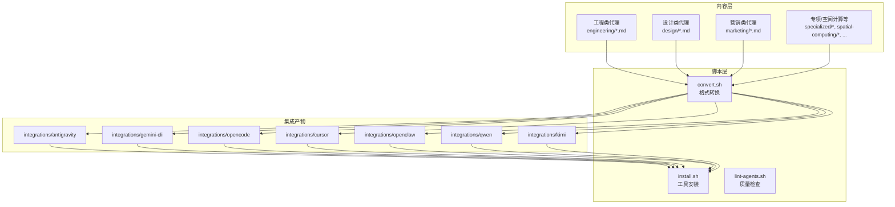
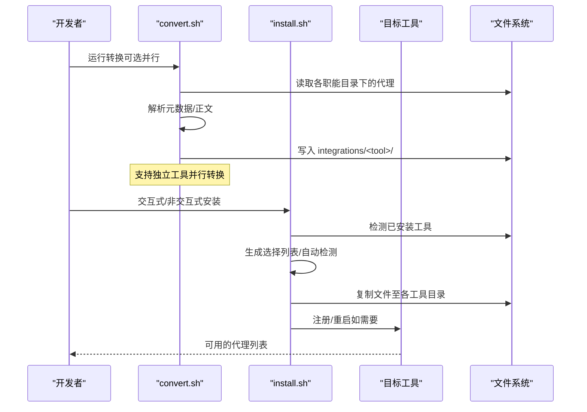
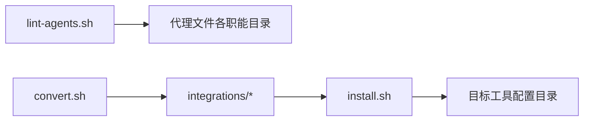
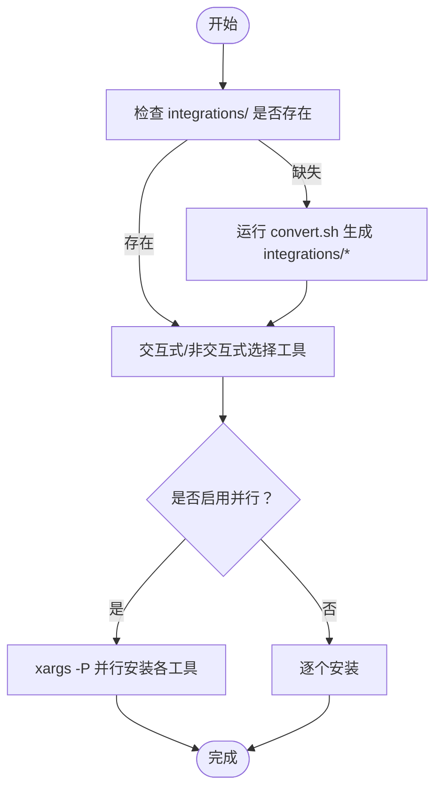

# 技术决策与权衡

<cite>
**本文引用的文件**
- [README.md](file://README.md)
- [CONTRIBUTING.md](file://CONTRIBUTING.md)
- [scripts/install.sh](file://scripts/install.sh)
- [scripts/convert.sh](file://scripts/convert.sh)
- [scripts/lint-agents.sh](file://scripts/lint-agents.sh)
- [integrations/mcp-memory/setup.sh](file://integrations/mcp-memory/setup.sh)
- [engineering/engineering-frontend-developer.md](file://engineering/engineering-frontend-developer.md)
- [design/design-ui-designer.md](file://design/design-ui-designer.md)
- [marketing/marketing-reddit-community-builder.md](file://marketing/marketing-reddit-community-builder.md)
</cite>

## 目录
1. [引言](#引言)
2. [项目结构](#项目结构)
3. [核心组件](#核心组件)
4. [架构总览](#架构总览)
5. [详细组件分析](#详细组件分析)
6. [依赖关系分析](#依赖关系分析)
7. [性能考量](#性能考量)
8. [故障排查指南](#故障排查指南)
9. [结论](#结论)
10. [附录](#附录)

## 引言
本文件系统性梳理 agency-agents 项目在技术选型上的决策与权衡，重点围绕以下主题：
- 为何选择 Bash 脚本作为核心自动化工具（安装、转换、校验），而非其他编程语言
- 模块化设计的决策依据与可维护性保障
- 并行处理采用 GNU parallel 的原因与替代方案
- 跨平台兼容性策略与实践
- 性能对比与使用场景建议

目标是帮助读者理解这些技术决策背后的设计动机，并为后续演进提供参考。

## 项目结构
项目采用“内容即配置”的组织方式：所有代理以 Markdown 文件形式分布在各职能目录中，配合少量 Bash 脚本完成格式转换、安装与质量校验。整体结构清晰、职责单一，便于贡献者快速定位与修改。

图表来源
- [README.md](file://README.md)
- [scripts/convert.sh](file://scripts/convert.sh)
- [scripts/install.sh](file://scripts/install.sh)

章节来源
- [README.md](file://README.md)
- [CONTRIBUTING.md](file://CONTRIBUTING.md)

## 核心组件
- 转换脚本 convert.sh：将标准 Markdown 代理转换为各工具所需的特定格式，支持并行加速。
- 安装脚本 install.sh：检测本地工具环境，生成交互式选择界面，按需安装到对应目录，支持并行安装。
- 质量检查脚本 lint-agents.sh：对代理文件进行基础校验（前置元数据、推荐结构、正文长度）。
- 代理模板与示例：提供统一的 Markdown 结构与示例，确保一致性与可读性。

章节来源
- [scripts/convert.sh](file://scripts/convert.sh)
- [scripts/install.sh](file://scripts/install.sh)
- [scripts/lint-agents.sh](file://scripts/lint-agents.sh)
- [CONTRIBUTING.md](file://CONTRIBUTING.md)

## 架构总览
下图展示了从“内容源”到“多工具集成”的端到端流程，以及并行优化点。

图表来源
- [scripts/convert.sh](file://scripts/convert.sh)
- [scripts/install.sh](file://scripts/install.sh)

## 详细组件分析

### 1) Bash 脚本作为核心自动化工具的决策
- 可移植性
  - Bash 在 Unix-like 系统（Linux/macOS）上广泛可用；Windows 用户可通过 Git Bash 或 WSL 使用。
  - 项目明确声明平台支持范围，避免引入额外运行时依赖。
- 易用性
  - 命令行接口直观，参数与帮助信息完整，便于新手快速上手。
  - 交互式安装器提供可视化选择，降低误操作风险。
- 维护性
  - 脚本职责单一、边界清晰，便于单元测试与回归验证。
  - 与 shell 工具链（find/awk/sed/xargs/…）深度结合，减少第三方库依赖。
- 可观测性
  - 彩色输出、进度条、盒装提示框等增强用户体验，便于调试与审计。

章节来源
- [scripts/install.sh](file://scripts/install.sh)
- [scripts/convert.sh](file://scripts/convert.sh)
- [README.md](file://README.md)

### 2) 模块化设计与可维护性
- 目录结构
  - 按职能划分目录（如 engineering/design/marketing 等），每个目录内存放该领域的代理文件，便于贡献者定位与审阅。
- 文件命名约定
  - 代理文件遵循统一的 Markdown 结构与元数据字段，便于解析与转换。
- 转换与安装分离
  - convert.sh 仅负责“格式转换”，install.sh 仅负责“安装部署”，职责解耦，降低耦合度。
- 可扩展性
  - 新增工具只需在 convert.sh 中添加转换器，在 install.sh 中添加检测与安装逻辑，保持最小改动面。

章节来源
- [CONTRIBUTING.md](file://CONTRIBUTING.md)
- [scripts/convert.sh](file://scripts/convert.sh)
- [scripts/install.sh](file://scripts/install.sh)

### 3) 并行处理：GNU parallel 的选择与权衡
- 选择理由
  - xargs -P 是最直接的并行执行手段，适合本项目“独立任务并行”的场景（不同工具的转换/安装）。
  - 通过临时输出缓冲（文件）聚合各工具的输出，避免混杂日志。
- 作业数策略
  - 默认根据 nproc/sysctl 获取 CPU 核心数，或回退到固定值，兼顾性能与资源占用。
- 替代方案
  - POSIX shell 并发：受限于 shell 特性，实现复杂且可移植性差。
  - Python/Go 并发：虽然更强大，但会引入额外运行时依赖，与“零依赖”的理念相悖。
  - GNU parallel：功能更强，但本项目仅使用 xargs -P 即可满足需求，避免引入新工具。

章节来源
- [scripts/convert.sh](file://scripts/convert.sh)
- [scripts/install.sh](file://scripts/install.sh)

### 4) 跨平台兼容性策略
- 平台声明
  - 项目明确支持 Linux、macOS（要求 bash 3.2+），Windows 通过 Git Bash/WSL 使用。
- 兼容性措施
  - 使用 -t 检测终端能力，动态启用彩色输出与 ANSI 控制序列。
  - 使用 nproc/sysctl 获取 CPU 核心数，适配不同平台。
  - 严格依赖 POSIX shell 语法与常用工具（find/awk/sed/xargs），避免现代 shell 扩展。
- 限制与取舍
  - 不支持纯 Windows PowerShell/Command Prompt；建议在 Git Bash/WSL 中运行。
  - 对 Windows 用户的体验通过文档与脚本提示进行补偿。

章节来源
- [scripts/install.sh](file://scripts/install.sh)
- [scripts/convert.sh](file://scripts/convert.sh)
- [README.md](file://README.md)

### 5) 质量与一致性保障
- lint-agents.sh
  - 校验前置元数据完整性（name/description/color）、推荐结构存在性、正文长度阈值。
  - 作为 CI 前置检查，保证新增/修改代理的质量门槛。
- 代理模板与示例
  - CONTRIBUTING.md 提供了完整的代理结构模板与最佳实践，降低贡献成本。
  - 示例代理展示如何编写高质量的元数据、工作流与交付物。

章节来源
- [scripts/lint-agents.sh](file://scripts/lint-agents.sh)
- [CONTRIBUTING.md](file://CONTRIBUTING.md)
- [engineering/engineering-frontend-developer.md](file://engineering/engineering-frontend-developer.md)
- [design/design-ui-designer.md](file://design/design-ui-designer.md)
- [marketing/marketing-reddit-community-builder.md](file://marketing/marketing-reddit-community-builder.md)

### 6) MCP 内存集成脚本的兼容性说明
- integrations/mcp-memory/setup.sh
  - 作为“内存服务器”安装指引脚本，不强制要求具体实现，仅列出所需接口与配置位置。
  - 鼓励用户选择符合 MCP 规范的任意内存服务，并将其加入 MCP 客户端配置。

章节来源
- [integrations/mcp-memory/setup.sh](file://integrations/mcp-memory/setup.sh)

## 依赖关系分析
- 脚本间依赖
  - install.sh 依赖 convert.sh 生成的 integrations 目录产物。
  - lint-agents.sh 依赖各职能目录中的代理文件。
- 工具依赖
  - install.sh 通过命令检测工具是否已安装（如 code/cursor/gemini 等）。
  - convert.sh 依赖 find/awk/sed 等常见工具链。
- 并行依赖
  - 通过 xargs -P 实现工具级并行，避免进程间共享状态带来的复杂性。

图表来源
- [scripts/lint-agents.sh](file://scripts/lint-agents.sh)
- [scripts/convert.sh](file://scripts/convert.sh)
- [scripts/install.sh](file://scripts/install.sh)

章节来源
- [scripts/lint-agents.sh](file://scripts/lint-agents.sh)
- [scripts/convert.sh](file://scripts/convert.sh)
- [scripts/install.sh](file://scripts/install.sh)

## 性能考量
- 并行策略
  - convert.sh 与 install.sh 均支持 --parallel 与 --jobs 参数，工具级并行显著缩短总耗时。
  - 由于各工具转换/安装互不依赖，工具并行不会产生竞争条件。
- I/O 与磁盘
  - 大量小文件复制场景下，磁盘吞吐与寻道时间是瓶颈；建议在 SSD 上运行。
- 进程开销
  - 并行度越高，上下文切换与系统调度开销越大；建议根据 CPU 核心数与 I/O 能力调整 --jobs。
- 实际收益
  - 在多核机器上，工具并行通常可将总耗时降低 50%~80%，具体取决于磁盘与网络 I/O。

[本节为通用性能讨论，无需特定文件引用]

## 故障排查指南
- 安装前未运行转换
  - 现象：install.sh 报错 integrations/ 缺失或过期。
  - 处理：先运行 convert.sh，再执行 install.sh。
- 工具未被检测到
  - 现象：install.sh 未自动检测到已安装工具。
  - 处理：确认工具可执行文件或配置目录存在；必要时使用 --tool 指定工具。
- 并行输出交错
  - 现象：并行模式下输出顺序与工具顺序不一致。
  - 处理：这是预期行为；若需顺序输出，可禁用并行或合并输出。
- Windows 环境问题
  - 现象：在 PowerShell/Command Prompt 中无法运行。
  - 处理：改用 Git Bash 或 WSL；或在 VS Code 终端中选择 Bash。

章节来源
- [scripts/install.sh](file://scripts/install.sh)
- [scripts/convert.sh](file://scripts/convert.sh)
- [README.md](file://README.md)

## 结论
本项目在技术栈选择上坚持“轻量、可移植、易维护”的原则：
- Bash 脚本满足自动化与跨平台需求，且与 shell 工具链天然契合。
- 模块化目录与统一模板提升可维护性与一致性。
- 工具级并行通过 xargs -P 实现，兼顾性能与可移植性。
- 跨平台策略明确，Windows 用户通过 Git Bash/WSL 获得一致体验。
- 质量门禁（lint）与示例模板降低贡献门槛，保障长期演进。

[本节为总结性内容，无需特定文件引用]

## 附录

### A. 关键流程图：安装与转换的并行路径

图表来源
- [scripts/install.sh](file://scripts/install.sh)
- [scripts/convert.sh](file://scripts/convert.sh)