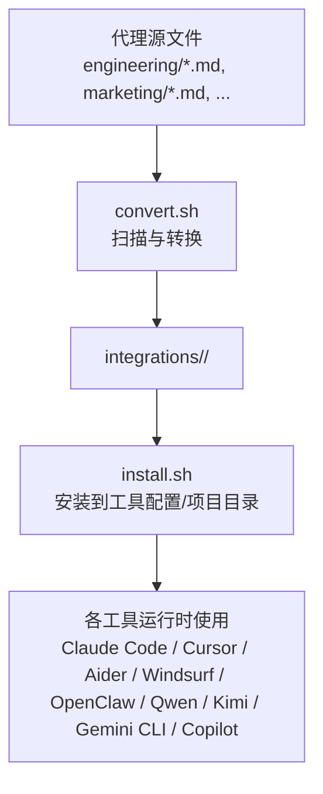
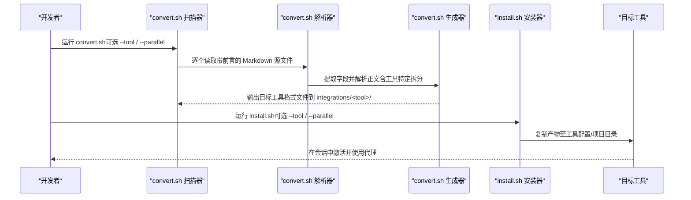
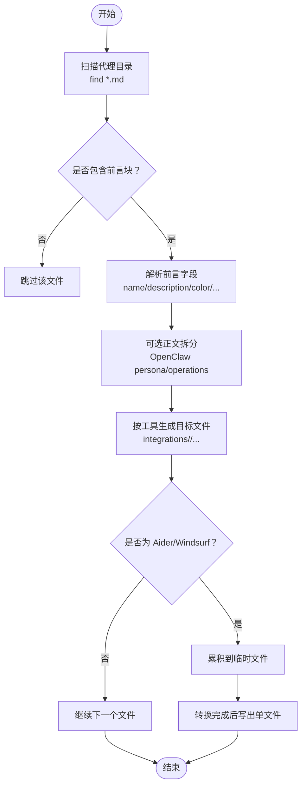
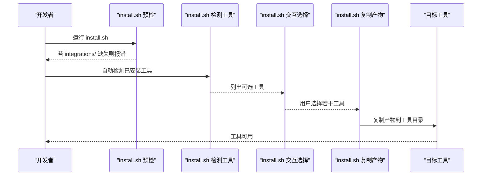
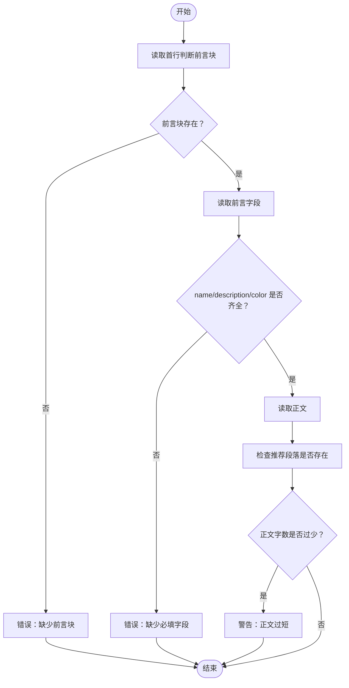
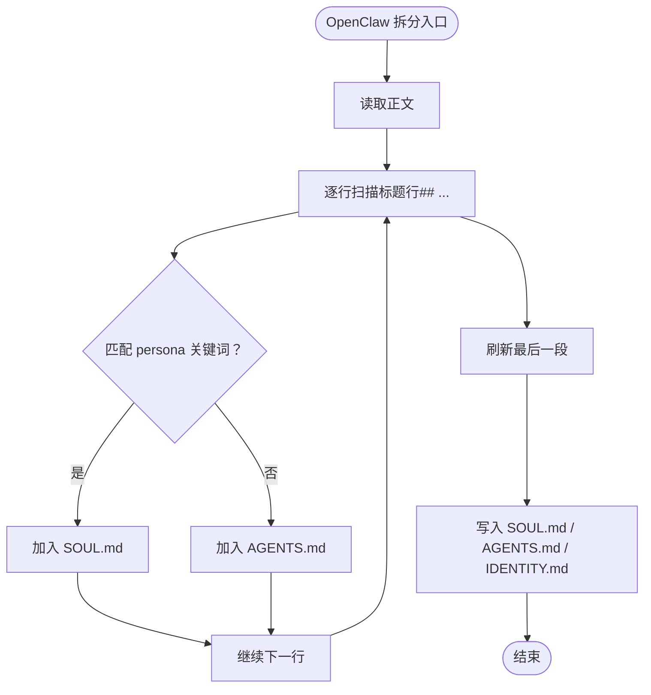
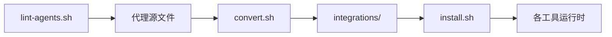

# 数据流与处理流程

<cite>
**本文引用的文件**
- [README.md](file://README.md)
- [CONTRIBUTING.md](file://CONTRIBUTING.md)
- [convert.sh](file://scripts/convert.sh)
- [install.sh](file://scripts/install.sh)
- [lint-agents.sh](file://scripts/lint-agents.sh)
- [integrations/README.md](file://integrations/README.md)
- [integrations/antigravity/README.md](file://integrations/antigravity/README.md)
- [integrations/cursor/README.md](file://integrations/cursor/README.md)
- [integrations/openclaw/README.md](file://integrations/openclaw/README.md)
- [integrations/kimi/README.md](file://integrations/kimi/README.md)
- [engineering-frontend-developer.md](file://engineering/engineering-frontend-developer.md)
- [marketing-reddit-community-builder.md](file://marketing/marketing-reddit-community-builder.md)
</cite>

## 目录
1. [简介](#简介)
2. [项目结构](#项目结构)
3. [核心组件](#核心组件)
4. [架构总览](#架构总览)
5. [详细组件分析](#详细组件分析)
6. [依赖关系分析](#依赖关系分析)
7. [性能考量](#性能考量)
8. [故障排查指南](#故障排查指南)
9. [结论](#结论)
10. [附录](#附录)

## 简介
本文件系统性梳理 agency-agents 项目从“代理源文件”到“各工具特定格式”的完整数据流与处理流程，覆盖文件扫描、格式解析、目标格式生成、并行处理机制、数据验证与质量检查、错误处理与回滚策略，并通过具体示例展示一个代理文件如何被转换为不同工具所需的格式。

## 项目结构
- 代理源文件位于多类主题目录（如 engineering、marketing、design 等），每个文件以 Markdown 格式编写，包含 YAML 前言块与正文内容。
- 转换与安装脚本位于 scripts/ 目录，负责将源文件批量转换为目标工具格式并安装到用户本地或项目目录。
- 集成说明位于 integrations/ 目录，描述各工具的安装方式与产物结构。

图表来源
- [convert.sh](file://scripts/convert.sh)
- [install.sh](file://scripts/install.sh)
- [integrations/README.md](file://integrations/README.md)

章节来源
- [README.md](file://README.md)
- [CONTRIBUTING.md](file://CONTRIBUTING.md)
- [integrations/README.md](file://integrations/README.md)

## 核心组件
- 文件扫描器：遍历指定目录树，识别带前言块的 Markdown 源文件，过滤非代理文档。
- 前言解析器：提取 YAML 前言字段（如 name、description、color、emoji、vibe、services 等）。
- 内容解析器：按工具要求拆分正文（如 OpenClaw 的 persona/operations 分桶）。
- 格式生成器：按目标工具规范输出对应文件（如 SKILL.md、.mdc、SOUL.md/AGENTS.md/IDENTITY.md、YAML + system.md 等）。
- 并行执行器：convert.sh 与 install.sh 支持并行模式，提升大规模转换与安装效率。
- 质量检查器：lint-agents.sh 对代理文件进行基础校验（前言完整性、推荐段落存在性、内容长度）。
- 安装器：install.sh 将转换产物复制到各工具的配置或项目目录。

章节来源
- [convert.sh](file://scripts/convert.sh)
- [install.sh](file://scripts/install.sh)
- [lint-agents.sh](file://scripts/lint-agents.sh)

## 架构总览
下图展示了从源文件到各工具产物的整体数据流与控制流：

图表来源
- [convert.sh](file://scripts/convert.sh)
- [install.sh](file://scripts/install.sh)

## 详细组件分析

### 组件一：convert.sh（转换器）
职责与流程
- 扫描：遍历预定义的代理目录，筛选带前言块的 .md 文件。
- 解析：使用正则与 awk 提取 YAML 前言字段；剥离前言后仅保留正文。
- 转换：针对每个目标工具，按其格式规范生成对应文件：
  - Antigravity：每个代理生成 SKILL.md，带固定字段与日期。
  - Gemini CLI：生成技能目录与扩展清单（gemini-extension.json）。
  - OpenCode：规范化颜色值，输出 .md 前言。
  - Cursor：生成 .mdc 规则文件，包含描述与 frontmatter。
  - OpenClaw：按 persona/operations 关键词拆分正文，生成 SOUL.md、AGENTS.md、IDENTITY.md。
  - Qwen：生成 .md 子代理文件，必要时包含 tools 字段。
  - Kimi：生成 agent.yaml 与 system.md。
  - Aider/Windsurf：累积到临时文件，最后写入单文件（CONVENTIONS.md 或 .windsurfrules）。
- 并行：当 --tool=all 且启用 --parallel 时，对独立工具进行并行转换，缓冲输出保证每类工具输出顺序正确。
- 单文件收尾：在完成累积后一次性写出 Aider 与 Windsurf 的最终文件。

图表来源
- [convert.sh](file://scripts/convert.sh)

章节来源
- [convert.sh](file://scripts/convert.sh)
- [integrations/antigravity/README.md](file://integrations/antigravity/README.md)
- [integrations/cursor/README.md](file://integrations/cursor/README.md)
- [integrations/openclaw/README.md](file://integrations/openclaw/README.md)
- [integrations/kimi/README.md](file://integrations/kimi/README.md)

### 组件二：install.sh（安装器）
职责与流程
- 预检：确认 integrations/ 是否存在，否则提示先运行 convert.sh。
- 工具检测：自动探测已安装工具（如 ~/.claude、~/.github、~/.copilot、~/.gemini、~/.cursor、~/.openclaw、~/.qwen、kimi 可执行文件等）。
- 交互选择：在终端环境下默认进入交互式选择，支持全选/全不选/仅检测到的工具。
- 安装：将转换产物复制到各工具的配置或项目目录（部分工具为项目级，需在项目根目录执行）。
- 并行：支持 --parallel 与 --jobs 控制并发度，避免重复输出并通过临时目录合并结果。

图表来源
- [install.sh](file://scripts/install.sh)

章节来源
- [install.sh](file://scripts/install.sh)

### 组件三：lint-agents.sh（质量检查器）
职责与流程
- 校验前言块：必须以 "---" 开头，且中间有有效 YAML 前言。
- 必填字段：name、description、color。
- 推荐段落：Identity、Core Mission、Critical Rules（警告而非错误）。
- 内容长度：正文字数过少给出警告。
- 结果：统计错误与警告数量，错误时返回失败码。

图表来源
- [lint-agents.sh](file://scripts/lint-agents.sh)

章节来源
- [lint-agents.sh](file://scripts/lint-agents.sh)

### 组件四：工具特定格式生成器（以 OpenClaw 为例）
OpenClaw 的特殊性在于需要将代理正文拆分为 persona（身份/记忆/沟通风格/规则）与 operations（使命/交付物/工作流/指标）两部分，分别写入 SOUL.md 与 AGENTS.md，并生成 IDENTITY.md。

图表来源
- [convert.sh](file://scripts/convert.sh)

章节来源
- [convert.sh](file://scripts/convert.sh)
- [integrations/openclaw/README.md](file://integrations/openclaw/README.md)

### 具体数据流转示例：前端开发代理到各工具
以下以工程部“前端开发”代理为例，展示从源文件到各工具产物的转换路径与差异。

- 源文件要点
  - 前言包含 name、description、color、emoji、vibe 等字段。
  - 正文包含身份、使命、规则、技术交付物、工作流、成功指标等章节。

- Antigravity（Gemini Antigravity 技能）
  - 产物：integrations/antigravity/agency-<slug>/SKILL.md
  - 特点：固定字段（name、description、risk、source、date_added），正文来自源文件正文。

- Cursor（.mdc 规则）
  - 产物：integrations/cursor/rules/<slug>.mdc
  - 特点：包含 description、globs、alwaysApply 等 frontmatter，正文来自源文件正文。

- OpenClaw（SOUL/AGENTS/IDENTITY 三文件）
  - 产物：integrations/openclaw/<slug>/SOUL.md、AGENTS.md、IDENTITY.md
  - 特点：按 persona/operations 关键词拆分正文；IDENTITY.md 来自 emoji/name/vibe 或回退到 description。

- Qwen Code（子代理 .md）
  - 产物：integrations/qwen/agents/<slug>.md
  - 特点：前言包含 name、description（可选 tools），正文来自源文件正文。

- Kimi Code（agent.yaml + system.md）
  - 产物：integrations/kimi/<slug>/agent.yaml、system.md
  - 特点：agent.yaml 使用 extend: default 继承默认工具集，system.md 合并 name/description/正文。

- OpenCode（.opencode/agents/*.md）
  - 产物：integrations/opencode/agents/<slug>.md
  - 特点：规范化颜色值，前言包含 name/description/mode/color。

- Aider（CONVENTIONS.md）
  - 产物：integrations/aider/CONVENTIONS.md
  - 特点：累积所有代理的“名称 + 描述 + 正文”，作为全局约定文件。

- Windsurf（.windsurfrules）
  - 产物：integrations/windsurf/.windsurfrules
  - 特点：累积所有代理，使用分隔线与标题组织。

- Gemini CLI（扩展 + 技能目录）
  - 产物：integrations/gemini-cli/gemini-extension.json 与 skills/<slug>/SKILL.md
  - 特点：扩展清单与技能文件分离管理。

章节来源
- [engineering-frontend-developer.md](file://engineering/engineering-frontend-developer.md)
- [convert.sh](file://scripts/convert.sh)
- [integrations/antigravity/README.md](file://integrations/antigravity/README.md)
- [integrations/cursor/README.md](file://integrations/cursor/README.md)
- [integrations/openclaw/README.md](file://integrations/openclaw/README.md)
- [integrations/kimi/README.md](file://integrations/kimi/README.md)

## 依赖关系分析
- convert.sh 依赖于源文件的统一结构（YAML 前言 + 正文），并根据工具规范生成对应文件。
- install.sh 依赖 convert.sh 生成的 integrations/ 目录，按工具类型复制到用户环境或项目目录。
- lint-agents.sh 作为前置质量门禁，确保源文件满足最低要求。
- 并行执行器（convert.sh 与 install.sh 的 --parallel）通过外部进程池实现任务级并行，避免脚本内复杂状态同步。

图表来源
- [lint-agents.sh](file://scripts/lint-agents.sh)
- [convert.sh](file://scripts/convert.sh)
- [install.sh](file://scripts/install.sh)

章节来源
- [lint-agents.sh](file://scripts/lint-agents.sh)
- [convert.sh](file://scripts/convert.sh)
- [install.sh](file://scripts/install.sh)

## 性能考量
- 并行处理
  - convert.sh：当 --tool=all 且启用 --parallel 时，对独立工具（如 antigravity、gemini-cli、opencode、cursor、openclaw、qwen）并行执行，其余（aider、windsurf）串行收尾写出单文件。
  - install.sh：对选定工具并行执行安装，使用临时目录合并输出，避免重复打印。
  - 并发度默认取 nproc 或 sysctl -n hw.ncpu，可通过 --jobs N 调整。
- I/O 优化
  - 使用 find -print0 与 while IFS= read -r -d '' 循环处理文件名，避免空格与特殊字符问题。
  - 对 OpenClaw 的 persona/operations 拆分采用逐行扫描与缓冲写入，减少多次 I/O。
- 转换单文件延迟写出
  - Aider 与 Windsurf 采用累积到临时文件再一次性写出的方式，降低磁盘碎片与写放大。

章节来源
- [convert.sh](file://scripts/convert.sh)
- [install.sh](file://scripts/install.sh)

## 故障排查指南
常见问题与定位建议
- integrations/ 不存在或过期
  - 现象：install.sh 报错提示未找到 integrations/。
  - 处理：先运行 convert.sh 生成集成文件。
- 前言缺失或格式错误
  - 现象：lint-agents.sh 报告缺少前言块或必填字段。
  - 处理：确保文件以 "---" 开头，包含 name、description、color；必要时补充推荐段落。
- OpenClaw 安装后不可用
  - 现象：新安装的代理无法通过 agentId 使用。
  - 处理：若本地 openclaw CLI 可用，安装后可能需要重启网关；参考安装说明。
- Cursor/OpenCode/Aider/Windsurf 项目级安装无效
  - 现象：规则/约定未生效。
  - 处理：确保在项目根目录执行 install.sh，并确认产物已复制到 .cursor/rules、.opencode/agents、项目根目录的 CONVENTIONS.md 或 .windsurfrules。
- Kimi Code agent.yaml 无效
  - 现象：YAML 校验失败或 agent-file 未找到。
  - 处理：先运行 convert.sh --tool kimi，再 install.sh --tool kimi；使用提供的校验命令检查 YAML。

章节来源
- [install.sh](file://scripts/install.sh)
- [lint-agents.sh](file://scripts/lint-agents.sh)
- [integrations/openclaw/README.md](file://integrations/openclaw/README.md)
- [integrations/kimi/README.md](file://integrations/kimi/README.md)

## 结论
本项目通过标准化的代理源文件结构与专用转换脚本，实现了从单一知识源到多工具生态的高效适配。convert.sh 与 install.sh 的并行化设计显著提升了大规模部署效率；lint-agents.sh 提供了基础的质量门禁。借助明确的工具特定格式与严格的安装流程，系统在复杂工具链环境下仍保持稳定与可维护性。

## 附录
- 示例代理文件
  - 工程部前端开发代理：展示完整的前言与正文结构，适合用于多工具转换测试。
  - 社区营销专家代理：展示不同领域的代理结构，便于对比工具适配差异。
- 工具安装速查
  - 全量安装：./scripts/install.sh
  - 指定工具安装：./scripts/install.sh --tool <tool>
  - 并行加速：./scripts/install.sh --parallel（或 --parallel --jobs N）

章节来源
- [engineering-frontend-developer.md](file://engineering/engineering-frontend-developer.md)
- [marketing-reddit-community-builder.md](file://marketing/marketing-reddit-community-builder.md)
- [README.md](file://README.md)