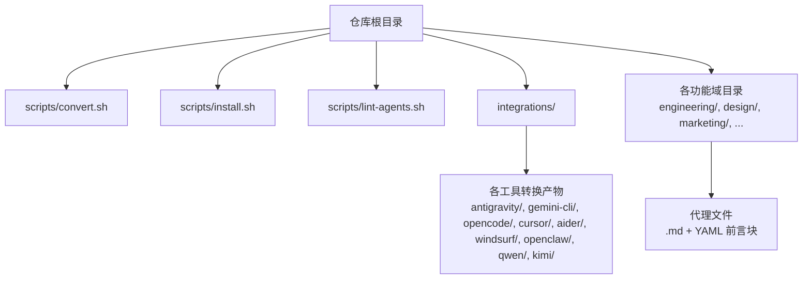
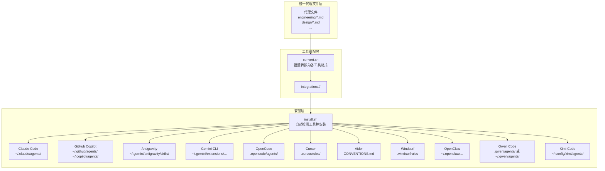
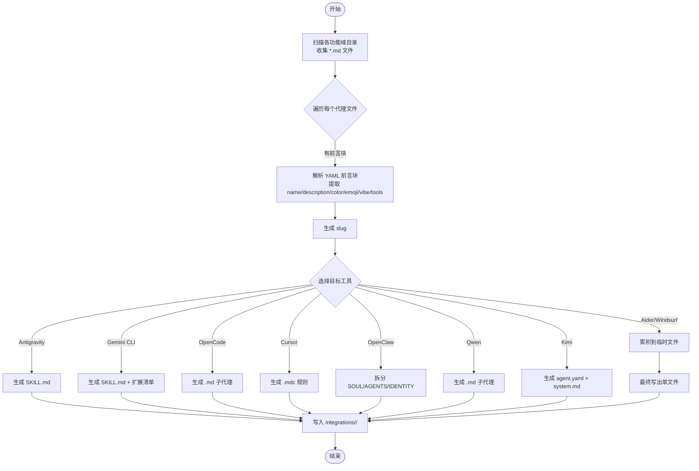
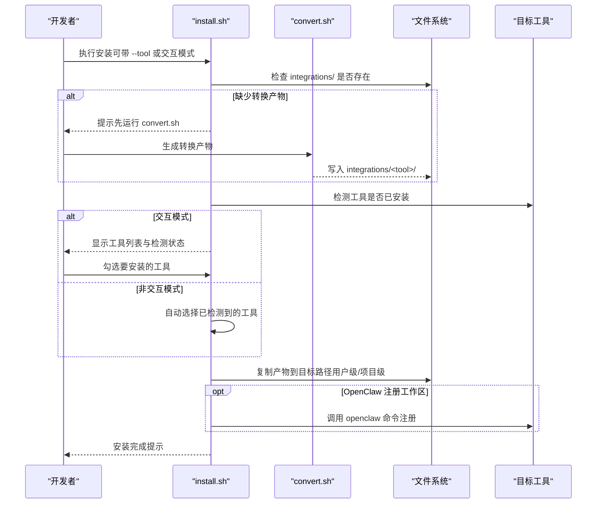
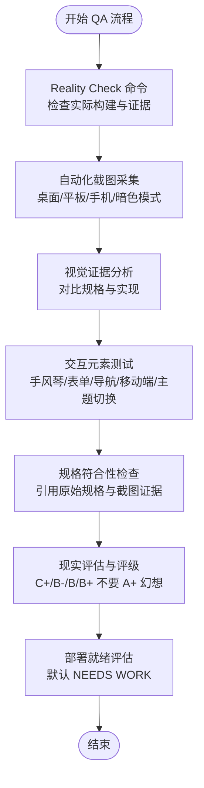
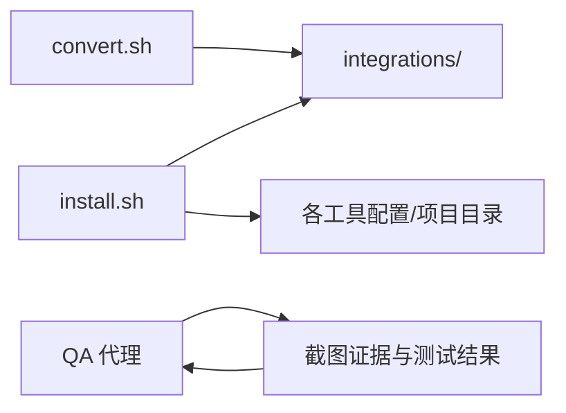

# 架构概览

<cite>
**本文引用的文件**
- [README.md](file://README.md)
- [CONTRIBUTING.md](file://CONTRIBUTING.md)
- [integrations/README.md](file://integrations/README.md)
- [integrations/claude-code/README.md](file://integrations/claude-code/README.md)
- [integrations/cursor/README.md](file://integrations/cursor/README.md)
- [scripts/convert.sh](file://scripts/convert.sh)
- [scripts/install.sh](file://scripts/install.sh)
- [scripts/lint-agents.sh](file://scripts/lint-agents.sh)
- [engineering/engineering-frontend-developer.md](file://engineering/engineering-frontend-developer.md)
- [design/design-ui-designer.md](file://design/design-ui-designer.md)
- [testing/testing-evidence-collector.md](file://testing/testing-evidence-collector.md)
- [testing/testing-reality-checker.md](file://testing/testing-reality-checker.md)
</cite>

## 目录
1. [简介](#简介)
2. [项目结构](#项目结构)
3. [核心组件](#核心组件)
4. [架构总览](#架构总览)
5. [详细组件分析](#详细组件分析)
6. [依赖分析](#依赖分析)
7. [性能考量](#性能考量)
8. [故障排查指南](#故障排查指南)
9. [结论](#结论)
10. [附录](#附录)

## 简介
本项目是一个“代理集合”（The Agency），提供大量“专业化 AI 代理”，每个代理都具备明确的人格、使命、可交付成果与可验证的成功指标，并围绕一套统一的“代理文件格式”进行组织。为实现跨工具兼容，项目提供了“转换系统”和“安装系统”，将标准代理文件转换为各工具所需的格式，并自动安装到目标工具的配置目录中。同时，项目内置“质量保证系统”（QA）代理，通过证据驱动的方式对系统进行验收与认证，确保交付物真实可靠。

## 项目结构
- 顶层包含多个功能域目录（如 engineering、design、marketing 等），每个目录下存放该领域的代理文件（Markdown + YAML 前言块）。
- scripts 目录包含三个核心脚本：convert.sh（转换）、install.sh（安装）、lint-agents.sh（质量检查）。
- integrations 目录用于存放各工具的转换产物，便于 install.sh 安装到对应工具的配置路径。
- README.md 提供使用说明、多工具集成说明与快速开始指南；CONTRIBUTING.md 提供代理设计规范与贡献流程。

图表来源
- [README.md:508-590](file://README.md#L508-L590)
- [integrations/README.md:1-209](file://integrations/README.md#L1-L209)

章节来源
- [README.md:508-590](file://README.md#L508-L590)
- [integrations/README.md:1-209](file://integrations/README.md#L1-L209)

## 核心组件
- 代理文件格式与模板
  - 每个代理以 Markdown 文件形式存在，采用 YAML 前言块定义元信息（名称、描述、颜色、表情、个性短语等），正文包含身份、使命、规则、技术交付、工作流、沟通风格、学习记忆、成功指标等结构化内容。
  - 参考模板与设计原则见贡献指南，强调“强个性、可交付、可度量、经验证的工作流、可学习的记忆”。

- 转换系统（convert.sh）
  - 将标准代理文件批量转换为各工具所需的格式：
    - Antigravity：每个代理生成 SKILL.md（技能文件）
    - Gemini CLI：生成扩展清单与技能目录
    - OpenCode：生成 .md 子代理文件
    - Cursor：生成 .mdc 规则文件
    - Aider：生成单文件 CONVENTIONS.md
    - Windsurf：生成单文件 .windsurfrules
    - OpenClaw：拆分为 SOUL.md、AGENTS.md、IDENTITY.md 工作区
    - Qwen Code：生成 .md 子代理文件（最小前言）
    - Kimi Code：生成 agent.yaml + system.md
  - 支持并行转换，提升大规模代理转换效率。

- 安装系统（install.sh）
  - 自动检测已安装工具，提供交互式选择或非交互式批量安装。
  - 将转换产物复制到各工具的配置目录或项目目录（如 Cursor、Aider、Windsurf、OpenCode 为项目级）。
  - 对 OpenClaw 还会调用其命令注册工作区，便于立即使用。

- 质量保证系统（QA 代理）
  - Evidence Collector：要求“一切皆需截图证明”，默认发现若干问题，拒绝无证据的“完美报告”。
  - Reality Checker：最终把关，要求“压倒性证据”才可认定“生产就绪”，否则默认“需要改进”。

- 质量检查脚本（lint-agents.sh）
  - 校验代理文件是否包含必需的 YAML 前言字段（name/description/color），并提示缺失推荐部分（如 Identity/Core Mission/Critical Rules）与内容过短等问题。

章节来源
- [CONTRIBUTING.md:81-175](file://CONTRIBUTING.md#L81-L175)
- [scripts/convert.sh:1-639](file://scripts/convert.sh#L1-L639)
- [scripts/install.sh:1-640](file://scripts/install.sh#L1-L640)
- [scripts/lint-agents.sh:1-117](file://scripts/lint-agents.sh#L1-L117)
- [testing/testing-evidence-collector.md:1-211](file://testing/testing-evidence-collector.md#L1-L211)
- [testing/testing-reality-checker.md:1-237](file://testing/testing-reality-checker.md#L1-L237)

## 架构总览
系统采用“统一代理文件 + 工具适配层 + 安装层”的三层架构：
- 统一代理文件层：所有代理遵循同一模板与前言块，确保跨工具一致性。
- 工具适配层：convert.sh 将统一格式转换为各工具的专用格式，形成 integrations 下的产物。
- 安装层：install.sh 将产物安装到目标工具的配置或项目目录，完成部署。

图表来源
- [README.md:508-590](file://README.md#L508-L590)
- [integrations/README.md:1-209](file://integrations/README.md#L1-L209)
- [scripts/convert.sh:107-410](file://scripts/convert.sh#L107-L410)
- [scripts/install.sh:296-495](file://scripts/install.sh#L296-L495)

## 详细组件分析

### 组件A：转换系统（convert.sh）
- 设计理念
  - 单一职责：将标准代理文件转换为各工具所需格式，不直接写入用户目录。
  - 可扩展：新增工具只需在转换器中添加对应转换函数与输出路径。
  - 并行优化：当工具集全量转换时，对可并行的工具进行并行处理，显著缩短转换时间。
- 数据结构与算法
  - 前言块解析：使用正则与 awk 从 Markdown 中提取 YAML 前言块字段（name/description/color/emoji/vibe/tools 等）。
  - 名称规范化：将人类可读名称转为 kebab-case 的 slug，避免工具命名冲突。
  - OpenClaw 分割：根据标题关键字将正文拆分为 SOUL（身份/记忆/规则）与 AGENTS（使命/交付/流程）两部分。
  - 单文件聚合：Aider 与 Windsurf 将所有代理内容累积到临时文件，最后一次性写出。
- 错误处理与健壮性
  - 非法工具名报错并退出。
  - 输出目录不存在时自动创建。
  - 并行模式下缓冲各工具输出，保证每类工具的输出顺序正确。
- 性能特性
  - 大规模代理转换时，通过并行与缓冲减少 I/O 抖动，提高吞吐。

图表来源
- [scripts/convert.sh:83-133](file://scripts/convert.sh#L83-L133)
- [scripts/convert.sh:135-408](file://scripts/convert.sh#L135-L408)
- [scripts/convert.sh:410-478](file://scripts/convert.sh#L410-L478)
- [scripts/convert.sh:480-636](file://scripts/convert.sh#L480-L636)

章节来源
- [scripts/convert.sh:1-639](file://scripts/convert.sh#L1-L639)

### 组件B：安装系统（install.sh）
- 设计理念
  - 自动检测：通过工具可执行文件或配置目录判断工具是否已安装。
  - 交互式选择：在终端环境下提供可视化勾选界面，支持一键全选/清空/仅检测到的。
  - 并行安装：对选定工具进行并行安装，减少等待时间。
  - 项目级与用户级区分：Cursor、Aider、Windsurf、OpenCode 为项目级安装，其余为用户级安装。
- 关键流程
  - 预检：确认 integrations 目录存在且包含目标工具的转换产物。
  - 工具检测：逐项检测工具是否存在（命令、配置目录等）。
  - 交互选择：显示工具列表与检测状态，允许用户勾选。
  - 安装执行：按工具类型复制文件到目标路径，必要时调用工具命令注册工作区。
- 错误处理
  - 未知工具名报错。
  - 若未运行 convert.sh 生成产物，安装前会提示先转换。
  - 对于项目级工具，提示应在项目根目录执行安装。

图表来源
- [scripts/install.sh:125-162](file://scripts/install.sh#L125-L162)
- [scripts/install.sh:184-293](file://scripts/install.sh#L184-L293)
- [scripts/install.sh:496-510](file://scripts/install.sh#L496-L510)
- [scripts/install.sh:515-637](file://scripts/install.sh#L515-L637)

章节来源
- [scripts/install.sh:1-640](file://scripts/install.sh#L1-L640)

### 组件C：质量保证系统（QA 代理）
- Evidence Collector（证据收集者）
  - 核心原则：一切以截图为准，拒绝“无证据的完美报告”。默认发现若干问题，要求对每个声明提供截图证据。
  - 测试方法：自动化截图采集（Playwright）、对比规格与实现、交互元素测试（手风琴、表单、导航、移动端、主题切换）。
  - 报告模板：包含“现实检查结果”“视觉证据分析”“交互测试结果”“问题清单”“诚实的质量评估”等结构化内容。
- Reality Checker（现实校验者）
  - 最终把关：默认“需要改进”，只有在“压倒性证据”支持下才可判定“生产就绪”。
  - 方法论：端到端用户旅程验证、跨设备一致性、性能验证、规格符合性比对。
  - 报告模板：包含“现实检查验证”“完整系统证据”“集成测试结果”“综合问题评估”“部署就绪评估”等。

图表来源
- [testing/testing-evidence-collector.md:41-79](file://testing/testing-evidence-collector.md#L41-L79)
- [testing/testing-evidence-collector.md:119-174](file://testing/testing-evidence-collector.md#L119-L174)
- [testing/testing-reality-checker.md:41-120](file://testing/testing-reality-checker.md#L41-L120)
- [testing/testing-reality-checker.md:142-202](file://testing/testing-reality-checker.md#L142-L202)

章节来源
- [testing/testing-evidence-collector.md:1-211](file://testing/testing-evidence-collector.md#L1-L211)
- [testing/testing-reality-checker.md:1-237](file://testing/testing-reality-checker.md#L1-L237)

### 组件D：代理文件格式与模板
- 结构化模板
  - 前言块：name、description、color、emoji、vibe、services（可选）。
  - 正文：Identity、Core Mission、Critical Rules、Technical Deliverables、Workflow Process、Communication Style、Learning & Memory、Success Metrics、Advanced Capabilities。
- 设计原则
  - 强个性：每个代理都有独特的语气、风格与记忆。
  - 可交付：提供具体代码示例、模板与框架。
  - 可度量：定义量化指标与基准。
  - 经验证：提供可复用的工作流步骤。
  - 可学习：记录经验教训与改进路径。
- OpenClaw 兼容性
  - 将正文按标题关键字拆分为 persona（SOUL）与 operations（AGENTS），便于 OpenClaw 解析与使用。

章节来源
- [CONTRIBUTING.md:81-175](file://CONTRIBUTING.md#L81-L175)
- [scripts/convert.sh:251-340](file://scripts/convert.sh#L251-L340)

## 依赖分析
- 组件耦合
  - convert.sh 与 install.sh 之间通过 integrations 目录解耦：前者只负责生成产物，后者只负责安装到目标位置。
  - 各工具的转换器彼此独立，互不影响，便于扩展新工具。
- 外部依赖
  - Bash 环境与常用工具（find、awk、sed、xargs、mktemp 等）。
  - 各工具的命令行或配置目录（如 ~/.gemini、~/.openclaw、~/.qwen 等）。
- 潜在循环依赖
  - 无直接循环依赖；install.sh 在运行前会检查 integrations 目录的存在性，避免运行时依赖缺失。

图表来源
- [scripts/convert.sh:58-62](file://scripts/convert.sh#L58-L62)
- [scripts/install.sh:102-104](file://scripts/install.sh#L102-L104)
- [testing/testing-evidence-collector.md:41-55](file://testing/testing-evidence-collector.md#L41-L55)
- [testing/testing-reality-checker.md:41-70](file://testing/testing-reality-checker.md#L41-L70)

章节来源
- [scripts/convert.sh:1-639](file://scripts/convert.sh#L1-L639)
- [scripts/install.sh:1-640](file://scripts/install.sh#L1-L640)

## 性能考量
- 转换阶段
  - 并行转换：对可并行的工具（antigravity、gemini-cli、opencode、cursor、openclaw、qwen）启用并行，显著缩短转换时间。
  - 输出缓冲：并行模式下为每个工具输出单独缓冲，避免混合输出导致的解析困难。
- 安装阶段
  - 并行安装：对选定工具进行并行安装，减少等待时间。
  - 项目级工具：建议在项目根目录执行安装，避免不必要的路径切换。
- 质量检查
  - 自动化截图与测试结果可重复、可追溯，减少人工验证成本。

[本节为通用指导，无需特定文件引用]

## 故障排查指南
- convert.sh 报错“未知工具”
  - 确认传入的 --tool 参数是否在支持列表中。
  - 参考：[scripts/convert.sh:538-544](file://scripts/convert.sh#L538-L544)
- install.sh 提示 integrations/ 不存在
  - 先运行 convert.sh 生成转换产物。
  - 参考：[scripts/install.sh:125-130](file://scripts/install.sh#L125-L130)
- OpenClaw 安装后无法使用
  - install.sh 会尝试调用 openclaw 命令注册工作区，若失败请手动执行相关命令或重启网关。
  - 参考：[scripts/install.sh:403-411](file://scripts/install.sh#L403-L411)
- Cursor/Aider/Windsurf/OpenCode 未生效
  - 这些工具为项目级安装，请在项目根目录执行安装脚本。
  - 参考：[scripts/install.sh:379-387](file://scripts/install.sh#L379-L387)、[scripts/install.sh:421-426](file://scripts/install.sh#L421-L426)、[scripts/install.sh:444-452](file://scripts/install.sh#L444-L452)、[scripts/install.sh:464-472](file://scripts/install.sh#L464-L472)
- 代理文件格式错误
  - 使用 lint-agents.sh 检查前言块缺失、推荐部分缺失、内容过短等问题。
  - 参考：[scripts/lint-agents.sh:33-79](file://scripts/lint-agents.sh#L33-L79)

章节来源
- [scripts/convert.sh:538-544](file://scripts/convert.sh#L538-L544)
- [scripts/install.sh:125-130](file://scripts/install.sh#L125-L130)
- [scripts/install.sh:379-387](file://scripts/install.sh#L379-L387)
- [scripts/install.sh:403-411](file://scripts/install.sh#L403-L411)
- [scripts/install.sh:421-426](file://scripts/install.sh#L421-L426)
- [scripts/install.sh:444-452](file://scripts/install.sh#L444-L452)
- [scripts/install.sh:464-472](file://scripts/install.sh#L464-L472)
- [scripts/lint-agents.sh:33-79](file://scripts/lint-agents.sh#L33-L79)

## 结论
本项目通过“统一代理文件 + 工具适配层 + 安装层”的架构，实现了跨工具的高兼容性与可扩展性。convert.sh 与 install.sh 形成完整的转换与安装闭环，配合 QA 代理的证据驱动验收流程，确保交付物真实可靠。模块化设计使新增工具与代理变得简单，适合持续演进与规模化应用。

[本节为总结，无需特定文件引用]

## 附录
- 快速开始
  - 使用 Claude Code：直接复制代理到 ~/.claude/agents/ 或使用安装脚本。
    - 参考：[README.md:27-35](file://README.md#L27-L35)、[integrations/claude-code/README.md:8-14](file://integrations/claude-code/README.md#L8-L14)
  - 使用 Cursor：在项目根目录执行安装脚本，生成 .cursor/rules/<agent>.mdc。
    - 参考：[integrations/cursor/README.md:8-14](file://integrations/cursor/README.md#L8-L14)
  - 使用其他工具：先运行 convert.sh 生成转换产物，再运行 install.sh 安装。
    - 参考：[README.md:508-590](file://README.md#L508-L590)、[integrations/README.md:19-47](file://integrations/README.md#L19-L47)

章节来源
- [README.md:27-35](file://README.md#L27-L35)
- [integrations/claude-code/README.md:8-14](file://integrations/claude-code/README.md#L8-L14)
- [integrations/cursor/README.md:8-14](file://integrations/cursor/README.md#L8-L14)
- [README.md:508-590](file://README.md#L508-L590)
- [integrations/README.md:19-47](file://integrations/README.md#L19-L47)