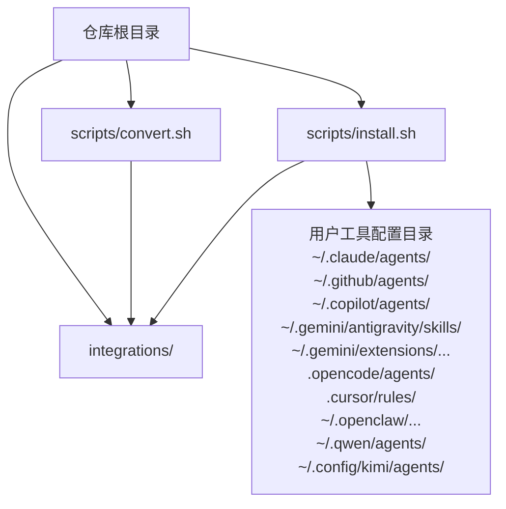
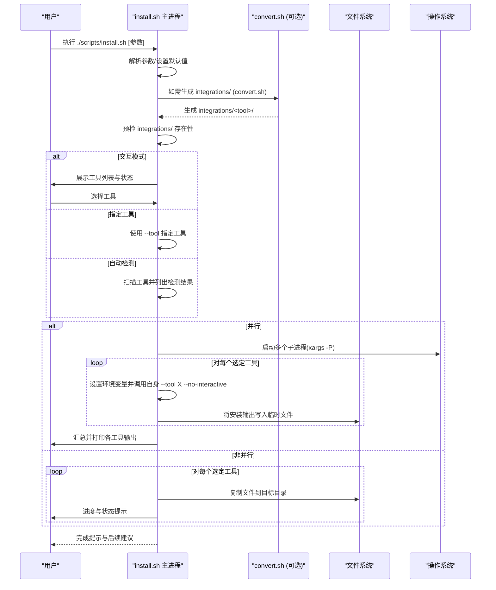
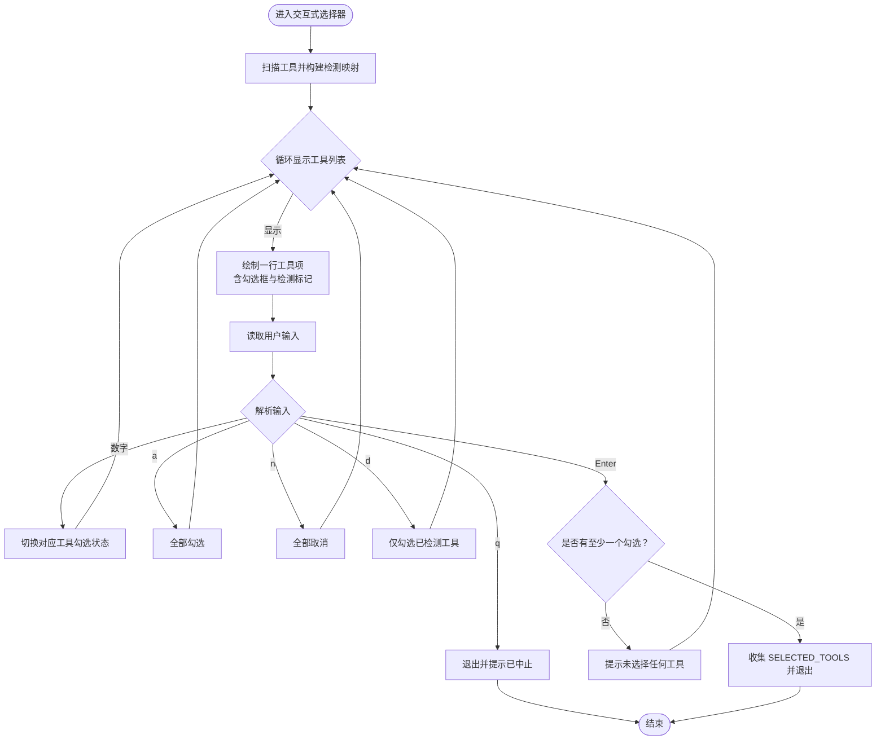
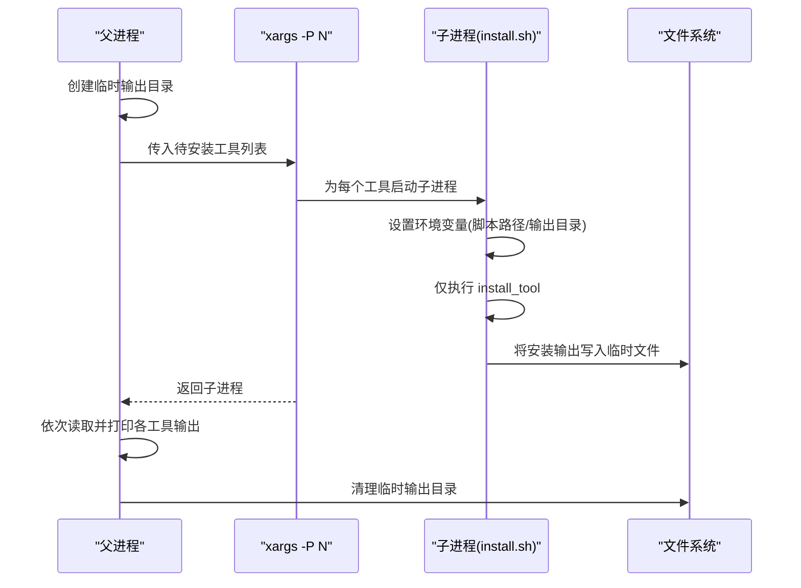

# 安装脚本 (install.sh)

<cite>
**本文引用的文件**
- [install.sh](file://scripts/install.sh)
- [convert.sh](file://scripts/convert.sh)
- [lint-agents.sh](file://scripts/lint-agents.sh)
- [README.md](file://README.md)
- [CONTRIBUTING.md](file://CONTRIBUTING.md)
- [academic-anthropologist.md](file://academic/academic-anthropologist.md)
</cite>

## 目录
1. [简介](#简介)
2. [项目结构](#项目结构)
3. [核心组件](#核心组件)
4. [架构总览](#架构总览)
5. [详细组件分析](#详细组件分析)
6. [依赖关系分析](#依赖关系分析)
7. [性能考量](#性能考量)
8. [故障排除指南](#故障排除指南)
9. [结论](#结论)
10. [附录](#附录)

## 简介
本文件面向 install.sh 安装脚本的技术文档，聚焦以下主题：
- 智能工具检测机制：对 10 种支持工具的检测逻辑与判定依据
- 并行安装系统：基于 xargs 的并行处理、作业数控制与输出缓冲策略
- 交互式选择器：工具状态显示、用户界面布局与键盘交互处理
- 命令行参数详解：--tool、--interactive、--no-interactive、--parallel、--jobs 等选项及组合效果
- 工具安装目标路径与文件复制逻辑、错误处理机制
- 实际使用示例与常见问题排查

## 项目结构
install.sh 位于 scripts/ 目录，负责将仓库中的代理文件转换为各工具所需的格式，并将其安装到对应目录。其与 convert.sh 协同工作，后者负责生成 integrations/<tool>/ 下的工具特定文件；install.sh 则将这些文件复制到用户本地的工具配置目录中。

图表来源
- [install.sh:100-104](file://scripts/install.sh#L100-L104)
- [convert.sh:58-62](file://scripts/convert.sh#L58-L62)

章节来源
- [install.sh:100-104](file://scripts/install.sh#L100-L104)
- [convert.sh:58-62](file://scripts/convert.sh#L58-L62)

## 核心组件
- 工具检测函数族：针对每个工具的可执行程序或配置目录存在性进行判断
- 交互式选择器：扫描系统后展示工具列表，支持勾选、全选、清空、仅已检测等操作
- 安装器子流程：按工具类型将 integrations/<tool>/ 中的文件复制到目标目录
- 并行安装引擎：通过 xargs -P 控制并发，结合临时输出缓冲避免交错输出
- 命令行解析与模式切换：--tool、--interactive、--no-interactive、--parallel、--jobs

章节来源
- [install.sh:135-162](file://scripts/install.sh#L135-L162)
- [install.sh:184-293](file://scripts/install.sh#L184-L293)
- [install.sh:299-494](file://scripts/install.sh#L299-L494)
- [install.sh:605-626](file://scripts/install.sh#L605-L626)
- [install.sh:515-582](file://scripts/install.sh#L515-L582)

## 架构总览
install.sh 的运行时流程如下：
- 解析参数，决定是否交互、是否并行、并行作业数
- 预检 integrations/ 是否存在
- 决策安装范围：交互选择、指定工具、或自动检测
- 若并行：启动子进程，每个子进程仅执行 install_tool，输出写入临时文件，父进程汇总输出
- 若非并行：顺序安装，带进度条与状态提示
- 结束时打印完成框与后续建议

图表来源
- [install.sh:515-637](file://scripts/install.sh#L515-L637)
- [convert.sh:521-636](file://scripts/convert.sh#L521-L636)

## 详细组件分析

### 智能工具检测机制
install.sh 为每种工具提供独立的检测函数，用于判断该工具是否已安装或可用：
- claude-code：检查用户主目录下是否存在 .claude
- copilot：检查 VS Code 可执行程序或 .github/.copilot 目录
- antigravity：检查 ~/.gemini/antigravity/skills
- gemini-cli：检查 gemini 命令或 ~/.gemini 目录
- cursor：检查 cursor 命令或 ~/.cursor 目录
- opencode：检查 opencode 命令或 ~/.config/opencode
- aider：检查 aider 命令
- openclaw：检查 openclaw 命令或 ~/.openclaw
- windsurf：检查 windsurf 命令或 ~/.codeium
- qwen：检查 qwen 命令或 ~/.qwen
- kimi：检查 kimi 命令

检测结果用于：
- 交互式选择器中显示“已检测”标记
- 非交互模式下的自动安装决策
- 错误提示与帮助信息

章节来源
- [install.sh:135-145](file://scripts/install.sh#L135-L145)
- [install.sh:147-162](file://scripts/install.sh#L147-L162)

### 交互式选择器
交互式选择器提供一个简洁的菜单界面，展示所有工具及其检测状态，并允许用户通过键盘进行选择：
- 工具列表：按固定宽度标签显示名称与描述
- 状态指示：检测到的工具以绿色“[*]”标记，未检测到的以灰色“[ ]”
- 选择方式：数字键勾选/取消勾选；快捷键 a 全选、n 清空、d 仅已检测；回车确认安装、q 退出
- UI 清屏：每次刷新前向上滚动若干行，确保界面整洁
- 输出数组：最终将被选中的工具名收集到 SELECTED_TOOLS 数组

图表来源
- [install.sh:184-293](file://scripts/install.sh#L184-L293)

章节来源
- [install.sh:184-293](file://scripts/install.sh#L184-L293)

### 并行安装系统
install.sh 支持并行安装，以提升多工具场景下的整体效率。其核心机制如下：
- 作业数控制：默认使用系统 CPU 核数（nproc 或 sysctl），可通过 --jobs 覆盖
- 并行执行：使用 xargs -P 启动多个子进程，每个子进程仅执行 install_tool
- 输出缓冲：为每个工具创建临时输出文件，父进程在完成后统一打印，避免交错输出
- 环境隔离：子进程通过环境变量传递脚本路径与输出目录，保证可复用性

图表来源
- [install.sh:605-626](file://scripts/install.sh#L605-L626)

章节来源
- [install.sh:114-120](file://scripts/install.sh#L114-L120)
- [install.sh:605-626](file://scripts/install.sh#L605-L626)

### 命令行参数详解
- --tool <name>：仅安装指定工具，会覆盖自动检测与交互选择
- --interactive：强制进入交互式选择器（即使非终端）
- --no-interactive：跳过交互式选择器，按自动检测或 --tool 决策安装
- --parallel：启用并行安装
- --jobs N：设置并行作业数，默认为 nproc/sysctl 或 4
- --help/-h：打印帮助信息

参数组合效果举例：
- --interactive + --parallel：先交互选择工具，再并行安装
- --no-interactive + --parallel：自动检测工具并并行安装
- --tool <name> + --jobs N：安装单个工具并限制并行作业数（通常无意义）

章节来源
- [install.sh:9-31](file://scripts/install.sh#L9-L31)
- [install.sh:515-582](file://scripts/install.sh#L515-L582)

### 工具安装目标路径与文件复制逻辑
install.sh 为每个工具定义了对应的安装函数，主要逻辑包括：
- 创建目标目录（若不存在）
- 遍历 integrations/<tool>/ 或仓库内相应目录
- 过滤符合格式要求的文件（如以 YAML frontmatter 开头）
- 复制到目标位置，并统计复制数量
- 输出成功信息与后续提示（部分工具为项目级，需在项目根目录运行）

具体目标路径与复制规则：
- claude-code：~/.claude/agents/，复制所有 .md 文件
- copilot：~/.github/agents/ 与 ~/.copilot/agents/，复制所有 .md 文件
- antigravity：~/.gemini/antigravity/skills/<slug>/，复制 SKILL.md
- gemini-cli：~/.gemini/extensions/agency-agents/，复制扩展清单与技能目录
- opencode：./.opencode/agents/（项目级），复制 .md 文件
- cursor：./.cursor/rules/（项目级），复制 .mdc 文件
- aider：./CONVENTIONS.md（项目级），若已存在则警告不覆盖
- windsurf：./.windsurfrules（项目级），若已存在则警告不覆盖
- openclaw：~/.openclaw/agency-agents/<slug>/，复制 SOUL.md、AGENTS.md、IDENTITY.md，并尝试注册到 openclaw
- qwen：./.qwen/agents/（项目级），复制 .md 文件
- kimi：~/.config/kimi/agents/<slug>/，复制 agent.yaml 与 system.md

章节来源
- [install.sh:299-494](file://scripts/install.sh#L299-L494)

### 错误处理机制
- 预检失败：当 integrations/ 不存在时，提示先运行 convert.sh
- 未知工具：--tool 指定无效工具名时，打印可用工具列表并退出
- 交互式选择：未选择任何工具时给出提示并等待用户继续
- 项目级工具：提示需要在项目根目录运行（如 opencode、cursor、aider、windsurf、qwen）
- openclaw：若本地有 openclaw 命令，尝试注册工作区并提示重启网关

章节来源
- [install.sh:125-130](file://scripts/install.sh#L125-L130)
- [install.sh:536-544](file://scripts/install.sh#L536-L544)
- [install.sh:375-387](file://scripts/install.sh#L375-L387)
- [install.sh:414-426](file://scripts/install.sh#L414-L426)
- [install.sh:428-440](file://scripts/install.sh#L428-L440)
- [install.sh:441-452](file://scripts/install.sh#L441-L452)
- [install.sh:454-472](file://scripts/install.sh#L454-L472)
- [install.sh:474-494](file://scripts/install.sh#L474-L494)

## 依赖关系分析
install.sh 与 convert.sh 的协作关系：
- install.sh 依赖 integrations/<tool>/ 下的工具特定文件
- convert.sh 从仓库标准目录提取代理文件，生成 integrations/<tool>/ 的目标格式
- 两者均支持并行模式，但 install.sh 的并行通过 xargs 调用自身实现，convert.sh 通过 xargs 调用自身实现

图表来源
- [install.sh:100-104](file://scripts/install.sh#L100-L104)
- [convert.sh:58-62](file://scripts/convert.sh#L58-L62)

章节来源
- [install.sh:100-104](file://scripts/install.sh#L100-L104)
- [convert.sh:58-62](file://scripts/convert.sh#L58-L62)

## 性能考量
- 并行安装：在多工具场景下显著缩短总耗时，注意输出缓冲避免日志交错
- 作业数选择：默认使用系统 CPU 核数，可根据磁盘 I/O 与网络情况调整 --jobs
- I/O 负载：大量小文件复制可能受磁盘吞吐限制，建议在 SSD 上运行
- 交互开销：交互式选择器在终端上更友好，但在 CI 环境建议使用 --no-interactive 以减少等待

## 故障排除指南
- integrations/ 不存在
  - 现象：安装前检查失败并提示先运行 convert.sh
  - 处理：先执行 convert.sh，再运行 install.sh
  - 参考：[install.sh:125-130](file://scripts/install.sh#L125-L130)，[convert.sh:521-536](file://scripts/convert.sh#L521-L536)
- 未检测到任何工具
  - 现象：自动检测阶段显示全部未找到
  - 处理：确认工具已安装且命令可用，或使用 --tool 指定工具
  - 参考：[install.sh:563-575](file://scripts/install.sh#L563-L575)
- 项目级工具安装失败
  - 现象：提示项目级工具需在项目根目录运行
  - 处理：切换到项目根目录后再安装
  - 参考：[install.sh:375-387](file://scripts/install.sh#L375-L387)，[install.sh:414-426](file://scripts/install.sh#L414-L426)，[install.sh:428-440](file://scripts/install.sh#L428-L440)，[install.sh:441-452](file://scripts/install.sh#L441-L452)，[install.sh:454-472](file://scripts/install.sh#L454-L472)
- openclaw 注册失败
  - 现象：安装后提示需要重启网关
  - 处理：按提示执行 openclaw gateway restart
  - 参考：[install.sh:409-411](file://scripts/install.sh#L409-L411)
- 并行输出交错
  - 现象：并行安装时各工具输出混杂
  - 处理：使用输出缓冲（默认行为）或降低 --jobs
  - 参考：[install.sh:605-626](file://scripts/install.sh#L605-L626)

章节来源
- [install.sh:125-130](file://scripts/install.sh#L125-L130)
- [install.sh:563-575](file://scripts/install.sh#L563-L575)
- [install.sh:375-387](file://scripts/install.sh#L375-L387)
- [install.sh:414-426](file://scripts/install.sh#L414-L426)
- [install.sh:428-440](file://scripts/install.sh#L428-L440)
- [install.sh:441-452](file://scripts/install.sh#L441-L452)
- [install.sh:454-472](file://scripts/install.sh#L454-L472)
- [install.sh:409-411](file://scripts/install.sh#L409-L411)
- [install.sh:605-626](file://scripts/install.sh#L605-L626)

## 结论
install.sh 提供了对 10 种主流 agentic 工具的统一安装入口，具备智能检测、交互选择与并行加速能力。通过与 convert.sh 的配合，用户可以快速将仓库中的代理文件转换为各工具所需格式，并一键安装到本地配置目录。在 CI 环境中，推荐使用 --no-interactive 与 --parallel 组合以获得最佳效率；在开发环境中，交互式选择器能帮助用户直观地管理工具安装。

## 附录

### 命令行参数速查表
- --tool <name>：仅安装指定工具
- --interactive：强制交互式选择器
- --no-interactive：跳过交互式选择器
- --parallel：启用并行安装
- --jobs N：设置并行作业数
- --help/-h：显示帮助

章节来源
- [install.sh:9-31](file://scripts/install.sh#L9-L31)
- [install.sh:515-582](file://scripts/install.sh#L515-L582)

### 实际使用示例
- 交互式安装（自动检测）
  - ./scripts/install.sh
- 指定工具安装
  - ./scripts/install.sh --tool cursor
  - ./scripts/install.sh --tool copilot
  - ./scripts/install.sh --tool aider
  - ./scripts/install.sh --tool windsurf
  - ./scripts/install.sh --tool kimi
- 非交互并行安装（CI 推荐）
  - ./scripts/install.sh --no-interactive --parallel
- 交互式并行安装
  - ./scripts/install.sh --interactive --parallel
- 指定作业数
  - ./scripts/install.sh --no-interactive --parallel --jobs 4

章节来源
- [README.md:528-589](file://README.md#L528-L589)