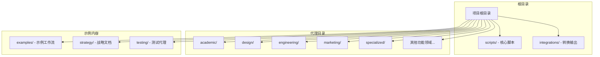
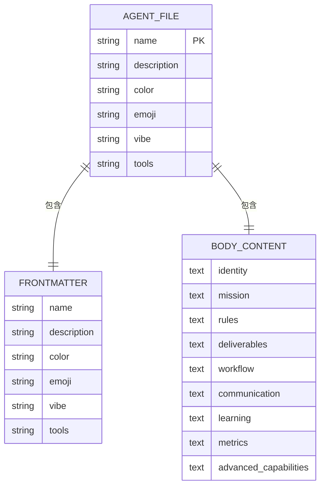
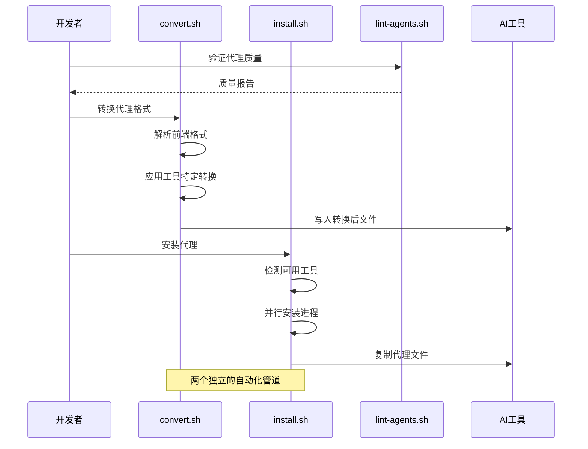
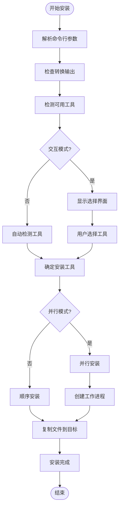
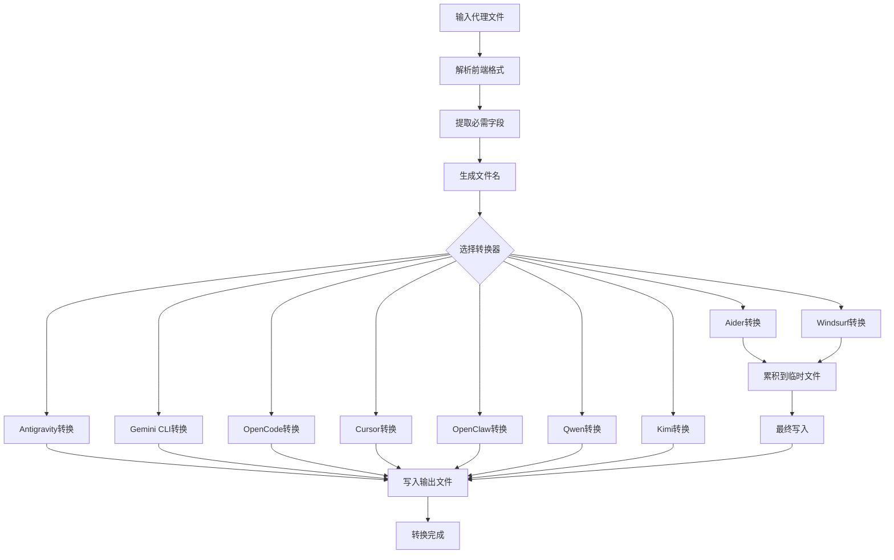
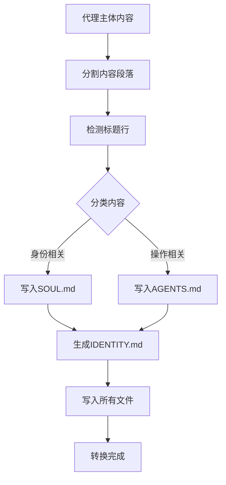
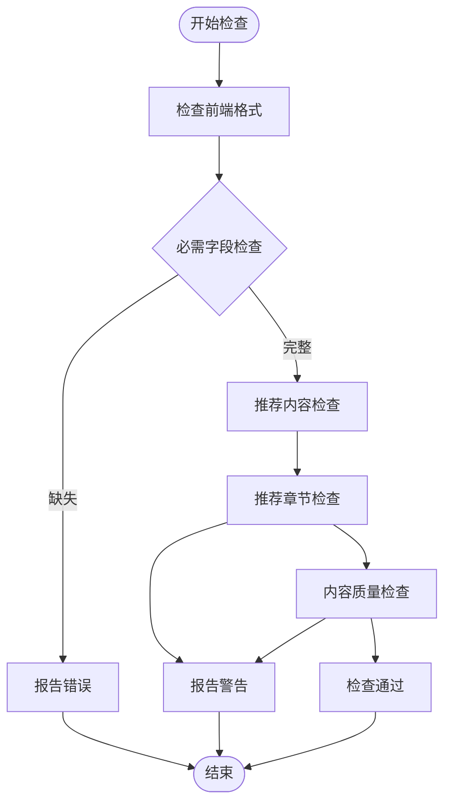
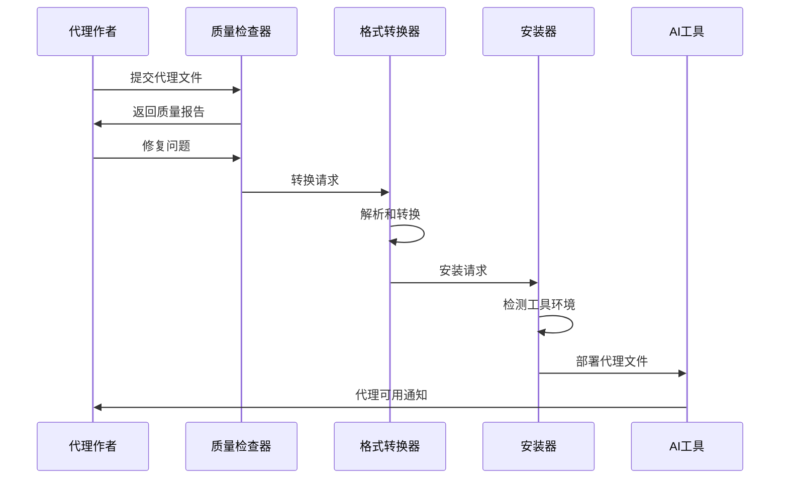

# 核心组件

<cite>
**本文档引用的文件**
- [install.sh](file://scripts/install.sh)
- [convert.sh](file://scripts/convert.sh)
- [lint-agents.sh](file://scripts/lint-agents.sh)
- [academic-anthropologist.md](file://academic/academic-anthropologist.md)
- [design-ui-designer.md](file://design/design-ui-designer.md)
- [README.md](file://README.md)
</cite>

## 目录
1. [简介](#简介)
2. [项目结构](#项目结构)
3. [核心组件](#核心组件)
4. [架构概览](#架构概览)
5. [详细组件分析](#详细组件分析)
6. [依赖关系分析](#依赖关系分析)
7. [性能考虑](#性能考虑)
8. [故障排除指南](#故障排除指南)
9. [结论](#结论)

## 简介

agency-agents 项目是一个包含多个 AI 代理的综合平台，提供了三个核心自动化脚本来管理代理的生命周期：`install.sh`（智能安装器）、`convert.sh`（格式转换器）和 `lint-agents.sh`（质量检查器）。这些组件协同工作，为不同的 AI 工具平台提供标准化的代理格式，实现了从源代码到目标工具的完整自动化部署流程。

该项目的核心价值在于：
- **统一的代理定义格式**：所有代理都遵循一致的 YAML 前言格式
- **多工具兼容性**：支持 Claude Code、GitHub Copilot、Antigravity、Gemini CLI 等主流 AI 工具
- **自动化部署流程**：从源代码转换到最终安装的完整流水线
- **质量保证体系**：内置的代理质量检查机制

## 项目结构

项目采用按功能领域组织的目录结构，每个领域包含相关的代理定义文件：



**图表来源**
- [README.md](file://README.md)
- [academic/academic-anthropologist.md](file://academic/academic-anthropologist.md)

**章节来源**
- [README.md](file://README.md)
- [academic/academic-anthropologist.md](file://academic/academic-anthropologist.md)

## 核心组件

### 代理文件格式规范

所有代理文件都遵循统一的 YAML 前言格式，确保跨工具兼容性：



**图表来源**
- [academic-anthropologist.md](file://academic/academic-anthropologist.md)
- [design-ui-designer.md](file://design/design-ui-designer.md)

### 标准化前端格式

代理文件的前端格式必须包含以下必需字段：
- `name`: 代理的唯一标识符
- `description`: 代理功能的简要描述
- `color`: 用于界面显示的颜色值

可选增强字段：
- `emoji`: 代理的表情符号标识
- `vibe`: 代理的风格描述
- `tools`: 特定工具集配置

**章节来源**
- [academic-anthropologist.md](file://academic/academic-anthropologist.md)
- [design-ui-designer.md](file://design/design-ui-designer.md)

## 架构概览

三个核心脚本形成了一个完整的代理生命周期管理管道：



**图表来源**
- [convert.sh](file://scripts/convert.sh)
- [install.sh](file://scripts/install.sh)
- [lint-agents.sh](file://scripts/lint-agents.sh)

## 详细组件分析

### install.sh - 智能工具检测和并行安装机制

#### 功能概述

`install.sh` 是一个智能的代理安装器，能够自动检测系统中已安装的 AI 工具，并将代理文件复制到相应工具的配置目录中。其核心特性包括：

- **智能工具检测**：自动识别系统中可用的 AI 工具
- **交互式选择界面**：提供直观的工具选择界面
- **并行安装支持**：支持多工具同时安装以提高效率
- **跨平台兼容**：支持 Linux、macOS 和 Windows Git Bash

#### 输入输出格式

**输入参数**：
- `--tool <name>`: 指定要安装的特定工具
- `--interactive`: 强制显示交互式选择界面
- `--no-interactive`: 跳过交互式界面，自动安装检测到的工具
- `--parallel`: 启用并行安装模式
- `--jobs N`: 设置并行作业数量
- `--help`: 显示帮助信息

**支持的工具列表**：
- `claude-code`: Claude Code AI 工具
- `copilot`: GitHub Copilot
- `antigravity`: Antigravity Gemini 技能
- `gemini-cli`: Gemini CLI 扩展
- `opencode`: OpenCode AI
- `cursor`: Cursor 编辑器规则
- `aider`: Aider 代码助手
- `windsurf`: Windsurf AI
- `openclaw`: OpenClaw 工作空间
- `qwen`: Qwen Code
- `kimi`: Kimi Code

#### 处理逻辑



**图表来源**
- [install.sh](file://scripts/install.sh)

#### 错误处理机制

- **工具检测失败**：当指定工具不存在时返回错误
- **文件权限问题**：处理目标目录写入权限
- **并行进程管理**：监控子进程状态并处理异常
- **回滚机制**：在部分安装失败时保持系统一致性

#### 使用示例

**基本安装**：
```bash
# 自动检测并安装所有可用工具
./scripts/install.sh

# 仅安装特定工具
./scripts/install.sh --tool claude-code

# 交互式安装
./scripts/install.sh --interactive
```

**高级安装**：
```bash
# 并行安装，使用8个并发进程
./scripts/install.sh --parallel --jobs 8

# 强制非交互模式
./scripts/install.sh --no-interactive --tool gemini-cli
```

**章节来源**
- [install.sh](file://scripts/install.sh)

### convert.sh - 代理格式转换系统

#### 功能概述

`convert.sh` 是一个强大的格式转换器，负责将标准的代理文件转换为目标 AI 工具所需的特定格式。它支持多种转换策略和并行处理能力。

#### 支持的转换类型

| 工具 | 输出格式 | 文件结构 | 特殊要求 |
|------|----------|----------|----------|
| `antigravity` | 技能文件 | `SKILL.md` | 前端包含风险级别和来源 |
| `gemini-cli` | 扩展包 | `gemini-extension.json` + `skills/` | 需要扩展清单文件 |
| `opencode` | 子代理文件 | `.opencode/agent/*.md` | 颜色值标准化 |
| `cursor` | 规则文件 | `.cursor/rules/*.mdc` | 特定的规则格式 |
| `aider` | 单一约定文件 | `CONVENTIONS.md` | 聚合所有代理信息 |
| `windsurf` | 规则文件 | `.windsurfrules` | 文本格式规则 |
| `openclaw` | 工作空间文件 | `SOUL.md` + `AGENTS.md` + `IDENTITY.md` | 分离人格和操作文件 |
| `qwen` | 子代理文件 | `~/.qwen/agents/*.md` | 支持工具列表 |
| `kimi` | YAML + 系统文件 | `agent.yaml` + `system.md` | Kimi CLI 格式 |

#### 转换算法



**图表来源**
- [convert.sh](file://scripts/convert.sh)

#### OpenClaw 特殊处理

OpenClaw 转换具有独特的文件分离机制：



**图表来源**
- [convert.sh](file://scripts/convert.sh)

#### 并行处理优化

转换器支持并行处理以提高大项目转换效率：

- **独立工具并行**：可以同时转换多个不相互依赖的工具
- **输出缓冲**：确保每个工具的输出保持完整性
- **资源限制**：根据系统 CPU 核心数自动调整并发度

#### 使用示例

**基础转换**：
```bash
# 转换所有工具
./scripts/convert.sh

# 转换特定工具
./scripts/convert.sh --tool gemini-cli

# 指定输出目录
./scripts/convert.sh --out ./custom-output
```

**高级转换**：
```bash
# 并行转换，使用4个并发进程
./scripts/convert.sh --parallel --jobs 4

# 转换后立即安装
./scripts/convert.sh && ./scripts/install.sh
```

**章节来源**
- [convert.sh](file://scripts/convert.sh)

### lint-agents.sh - 代理质量检查流程

#### 功能概述

`lint-agents.sh` 是一个质量保证工具，用于验证代理文件是否符合项目标准。它执行多层次的检查以确保代理的一致性和完整性。

#### 检查层次



**图表来源**
- [lint-agents.sh](file://scripts/lint-agents.sh)

#### 必需字段验证

系统强制要求以下字段存在于代理文件的前端格式中：

| 字段 | 类型 | 描述 | 错误级别 |
|------|------|------|----------|
| `name` | 字符串 | 代理的唯一名称 | 错误 |
| `description` | 字符串 | 代理功能描述 | 错误 |
| `color` | 颜色值 | 用于界面显示的颜色 | 错误 |

#### 推荐内容检查

系统建议但不强制要求的内容章节：

| 章节 | 描述 | 警告级别 |
|------|------|----------|
| `Identity` | 代理身份和记忆 | 警告 |
| `Core Mission` | 核心使命和目标 | 警告 |
| `Critical Rules` | 关键规则和约束 | 警告 |

#### 内容质量评估

系统会检查代理内容的质量指标：

- **字数统计**：检查正文内容是否过于简短（少于50个单词）
- **结构完整性**：验证代理文件的整体结构和组织

#### 使用示例

**基本检查**：
```bash
# 检查所有代理文件
./scripts/lint-agents.sh

# 检查特定文件
./scripts/lint-agents.sh academic/academic-anthropologist.md

# 检查多个文件
./scripts/lint-agents.sh design/*.md engineering/*.md
```

**集成检查**：
```bash
# 在 CI/CD 中使用
./scripts/lint-agents.sh || exit 1

# 仅检查最近修改的文件
git diff --name-only HEAD~1 | grep "\.md$" | xargs ./scripts/lint-agents.sh
```

**章节来源**
- [lint-agents.sh](file://scripts/lint-agents.sh)

## 依赖关系分析

三个核心组件之间存在明确的依赖关系和协作模式：

```mermaid
graph TB
subgraph "核心组件"
Lint[lint-agents.sh]
Convert[convert.sh]
Install[install.sh]
end
subgraph "数据流"
AgentFiles[代理文件(.md)]
ConvertedFiles[转换文件(integrations/)]
InstalledFiles[安装文件(工具配置)]
end
subgraph "外部依赖"
Tools[AI工具平台]
System[System环境]
end
AgentFiles --> Lint
Lint --> AgentFiles
AgentFiles --> Convert
Convert --> ConvertedFiles
ConvertedFiles --> Install
Install --> InstalledFiles
InstalledFiles --> Tools
System --> Convert
System --> Install
Tools --> Install
```

**图表来源**
- [install.sh](file://scripts/install.sh)
- [convert.sh](file://scripts/convert.sh)
- [lint-agents.sh](file://scripts/lint-agents.sh)

### 组件间协作

1. **质量前置检查**：`lint-agents.sh` 在转换前运行，确保代理质量
2. **格式转换**：`convert.sh` 将标准格式转换为工具特定格式
3. **部署安装**：`install.sh` 将转换后的文件部署到目标工具

### 数据流转过程



**图表来源**
- [lint-agents.sh](file://scripts/lint-agents.sh)
- [convert.sh](file://scripts/convert.sh)
- [install.sh](file://scripts/install.sh)

**章节来源**
- [install.sh](file://scripts/install.sh)
- [convert.sh](file://scripts/convert.sh)
- [lint-agents.sh](file://scripts/lint-agents.sh)

## 性能考虑

### 并行处理优化

三个脚本都实现了智能的并行处理机制：

- **CPU 核心自适应**：自动检测系统 CPU 核心数作为默认并发度
- **资源监控**：监控系统资源使用情况，避免过度占用
- **输出缓冲**：在并行模式下保持输出的有序性和完整性

### 内存使用优化

- **流式处理**：大量使用流式处理减少内存占用
- **临时文件管理**：合理使用临时文件并在完成后清理
- **增量转换**：只处理必要的文件，避免重复转换

### I/O 性能优化

- **批量操作**：使用 `find` 和 `xargs` 实现批量文件处理
- **并行文件复制**：在安装阶段使用并行复制提高速度
- **缓存机制**：避免重复的系统检测和文件扫描

## 故障排除指南

### 常见问题及解决方案

#### 工具检测失败

**问题**：`install.sh` 无法检测到已安装的工具
**解决方案**：
1. 手动指定工具：`./scripts/install.sh --tool <tool-name>`
2. 检查工具路径：确保工具在 PATH 中可用
3. 手动安装：直接运行对应工具的安装程序

#### 转换失败

**问题**：`convert.sh` 在转换过程中报错
**解决方案**：
1. 检查代理文件格式：确认前端格式正确
2. 验证必需字段：确保 `name`、`description`、`color` 存在
3. 清理输出目录：删除 `integrations/` 目录后重新转换

#### 权限问题

**问题**：安装过程中出现权限错误
**解决方案**：
1. 检查目标目录权限：确保对目标目录有写入权限
2. 使用 sudo：必要时使用管理员权限运行
3. 修改目标路径：将安装到用户目录而非系统目录

#### 并行处理问题

**问题**：并行安装导致输出混乱
**解决方案**：
1. 禁用并行模式：使用 `--no-parallel` 参数
2. 减少并发数：使用 `--jobs` 指定较小的并发数
3. 按工具安装：逐个工具进行安装

### 调试技巧

#### 启用详细日志

```bash
# 设置调试模式
export DEBUG=1
./scripts/convert.sh --tool gemini-cli
```

#### 检查中间结果

```bash
# 查看转换后的文件
ls -la integrations/gemini-cli/skills/

# 检查安装的文件
ls -la ~/.gemini/extensions/agency-agents/
```

#### 验证工具环境

```bash
# 检查工具是否可用
which gemini
which code
which aider
```

**章节来源**
- [install.sh](file://scripts/install.sh)
- [convert.sh](file://scripts/convert.sh)
- [lint-agents.sh](file://scripts/lint-agents.sh)

## 结论

agency-agents 项目的三个核心组件构成了一个完整而高效的代理管理生态系统。通过 `lint-agents.sh` 的质量保证、`convert.sh` 的格式转换和 `install.sh` 的智能安装，项目实现了从代理开发到工具部署的全自动化流程。

### 主要优势

1. **标准化流程**：统一的代理格式和转换标准
2. **多工具兼容**：支持主流 AI 工具平台
3. **自动化程度高**：减少手动操作和配置错误
4. **可扩展性强**：易于添加新的工具支持
5. **质量保证**：内置的检查和验证机制

### 最佳实践建议

1. **先检查后转换**：始终使用 `lint-agents.sh` 验证代理质量
2. **定期更新**：使用 `convert.sh` 定期更新转换文件
3. **并行优化**：在大型项目中启用并行处理以提高效率
4. **版本控制**：将转换后的文件纳入版本控制
5. **文档维护**：保持代理文档的及时更新

这个系统为 AI 代理的开发、管理和部署提供了一个强大而灵活的基础设施，有助于构建和维护高质量的 AI 代理生态系统。