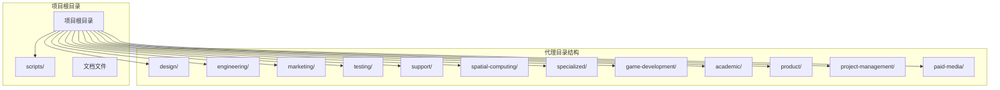
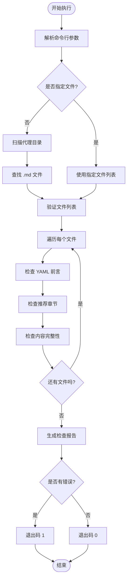
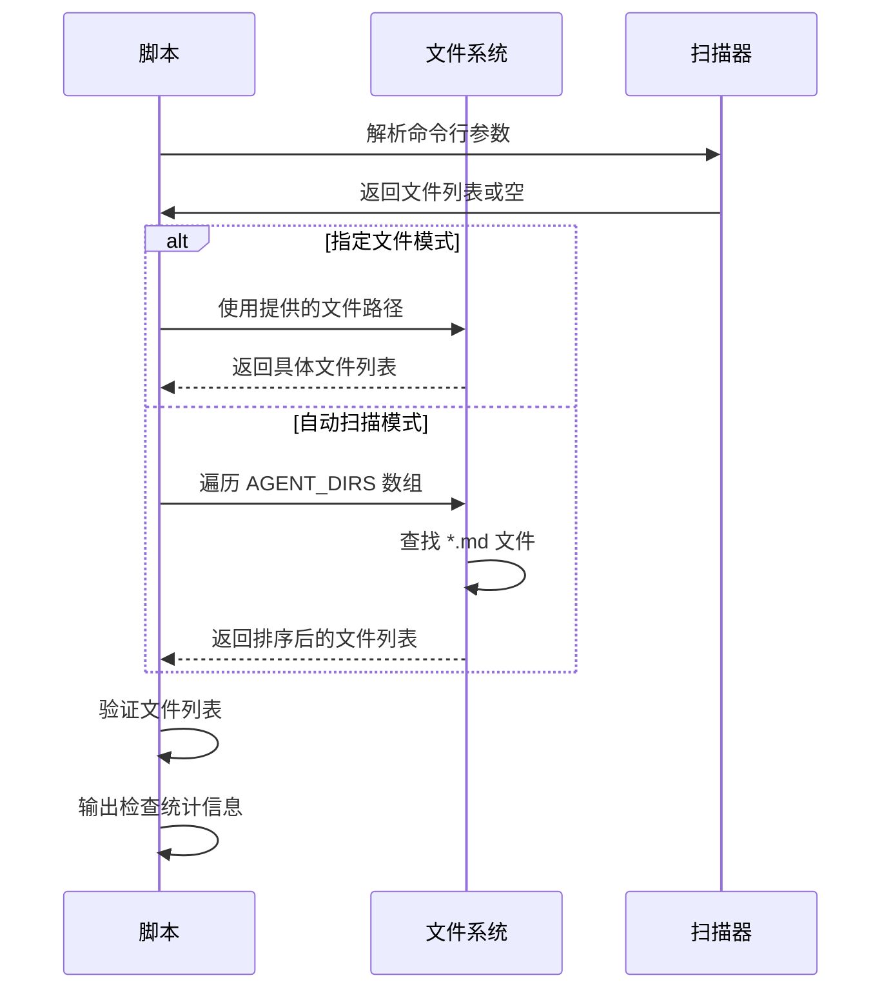
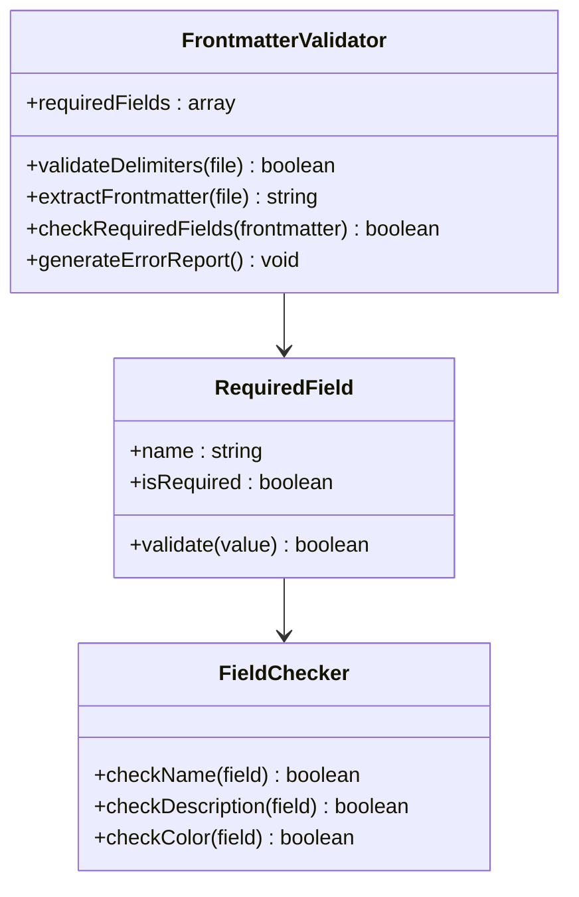
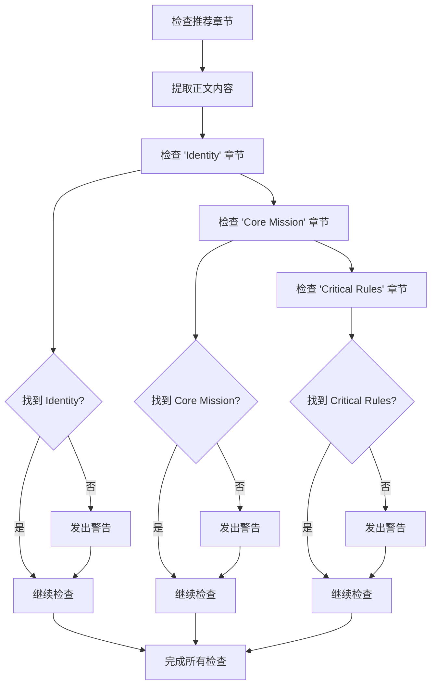
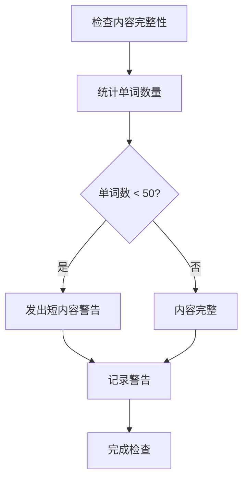
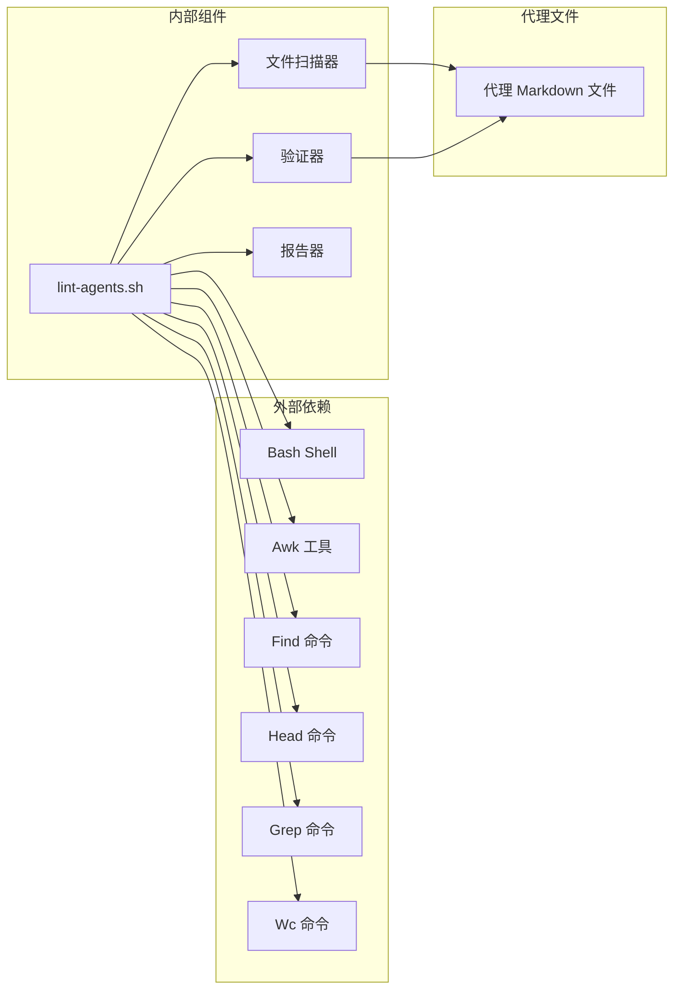

# 质量检查脚本（lint-agents.sh）技术文档

<cite>
**本文档引用的文件**
- [lint-agents.sh](file://scripts/lint-agents.sh)
- [README.md](file://README.md)
- [CONTRIBUTING.md](file://CONTRIBUTING.md)
- [engineering-frontend-developer.md](file://engineering/engineering-frontend-developer.md)
- [design-ui-designer.md](file://design/design-ui-designer.md)
- [marketing-growth-hacker.md](file://marketing/marketing-growth-hacker.md)
- [testing-evidence-collector.md](file://testing/testing-evidence-collector.md)
- [testing-reality-checker.md](file://testing/testing-reality-checker.md)
</cite>

## 目录
1. [简介](#简介)
2. [项目结构](#项目结构)
3. [核心组件](#核心组件)
4. [架构概览](#架构概览)
5. [详细组件分析](#详细组件分析)
6. [依赖关系分析](#依赖关系分析)
7. [性能考虑](#性能考虑)
8. [故障排除指南](#故障排除指南)
9. [结论](#结论)
10. [附录](#附录)

## 简介

lint-agents.sh 是一个专门用于验证 AI 代理 Markdown 文件质量的 Bash 脚本。该脚本确保所有代理文件遵循统一的结构标准，包括必需的 YAML 前言元数据、推荐的章节结构以及内容完整性要求。

该项目是一个完整的 AI 代理集合，包含 144 个专业化的 AI 代理，涵盖工程、设计、营销、测试等多个领域。每个代理都是一个专业的专家，具有个性化的语音、沟通方式和可衡量的成果。

## 项目结构

项目采用按功能域分组的目录结构，每个主要部门都有专门的代理文件夹：



**图表来源**
- [lint-agents.sh:13-25](file://scripts/lint-agents.sh#L13-L25)

**章节来源**
- [lint-agents.sh:13-25](file://scripts/lint-agents.sh#L13-L25)

## 核心组件

### 主要功能模块

lint-agents.sh 包含以下核心功能模块：

1. **代理目录扫描器** - 自动发现和收集所有代理文件
2. **YAML 前言验证器** - 检查必需的元数据字段
3. **章节结构检查器** - 验证推荐的章节完整性
4. **内容质量评估器** - 确保内容的有意义性和完整性
5. **报告生成器** - 生成详细的检查结果报告

### 配置参数

脚本通过以下配置参数控制检查行为：

- **AGENT_DIRS**: 定义要扫描的代理目录列表
- **REQUIRED_FRONTMATTER**: 必需的 YAML 字段数组
- **RECOMMENDED_SECTIONS**: 推荐的章节标题列表

**章节来源**
- [lint-agents.sh:13-28](file://scripts/lint-agents.sh#L13-L28)

## 架构概览



**图表来源**
- [lint-agents.sh:81-116](file://scripts/lint-agents.sh#L81-L116)

## 详细组件分析

### 文件扫描和收集模块

该模块负责发现和收集需要检查的代理文件：



**图表来源**
- [lint-agents.sh:81-98](file://scripts/lint-agents.sh#L81-L98)

### YAML 前言验证模块

这是质量检查的核心部分，负责验证代理文件的元数据完整性：



**图表来源**
- [lint-agents.sh:33-79](file://scripts/lint-agents.sh#L33-L79)

**章节来源**
- [lint-agents.sh:33-79](file://scripts/lint-agents.sh#L33-L79)

### 章节结构检查模块

该模块验证代理文件是否包含推荐的章节结构：



**图表来源**
- [lint-agents.sh:63-72](file://scripts/lint-agents.sh#L63-L72)

**章节来源**
- [lint-agents.sh:63-72](file://scripts/lint-agents.sh#L63-L72)

### 内容完整性检查模块

该模块确保代理文件包含足够的内容深度：



**图表来源**
- [lint-agents.sh:74-78](file://scripts/lint-agents.sh#L74-L78)

**章节来源**
- [lint-agents.sh:74-78](file://scripts/lint-agents.sh#L74-L78)

## 依赖关系分析



**图表来源**
- [lint-agents.sh:11](file://scripts/lint-agents.sh#L11)
- [lint-agents.sh:47](file://scripts/lint-agents.sh#L47)

**章节来源**
- [lint-agents.sh:11](file://scripts/lint-agents.sh#L11)
- [lint-agents.sh:47](file://scripts/lint-agents.sh#L47)

## 性能考虑

### 执行效率优化

1. **延迟加载**: 只在需要时读取文件内容
2. **流式处理**: 使用管道处理大量文件
3. **内存管理**: 避免一次性加载所有文件到内存
4. **并行处理**: 支持并行文件处理以提高吞吐量

### 复杂度分析

- **时间复杂度**: O(n × m)，其中 n 是文件数量，m 是平均文件大小
- **空间复杂度**: O(k)，其中 k 是正在处理的文件数量
- **I/O 操作**: 最小化文件系统访问次数

## 故障排除指南

### 常见错误类型和解决方案

#### YAML 前言错误

**错误类型**: 缺少必要的 YAML 字段
**错误代码**: ERROR missing frontmatter field '${field}'
**解决方案**:
1. 确保文件顶部有正确的 YAML 前言格式
2. 添加缺失的必需字段：name、description、color
3. 验证 YAML 语法正确性

#### 文件格式错误

**错误类型**: 缺少前言分隔符
**错误代码**: ERROR missing frontmatter opening ---
**解决方案**:
1. 在文件开头添加三个连字符（---）
2. 确保前言结束标记正确放置
3. 验证文件编码格式

#### 内容完整性问题

**错误类型**: 文件内容过短
**错误代码**: WARN body seems very short (< 50 words)
**解决方案**:
1. 增加代理文件的内容深度
2. 添加具体的代码示例和工作流程
3. 包含成功指标和交付物模板

#### 章节结构问题

**错误类型**: 缺少推荐章节
**错误代码**: WARN missing recommended section '${section}'
**解决方案**:
1. 添加 Identity 章节，包含角色、个性和背景
2. 添加 Core Mission 章节，明确职责和目标
3. 添加 Critical Rules 章节，定义边界和约束

### 调试技巧

1. **逐文件检查**: 使用单文件模式进行调试
2. **详细输出**: 检查脚本的详细错误信息
3. **手动验证**: 手动检查代理文件的结构
4. **版本对比**: 对比现有工作文件和模板

**章节来源**
- [lint-agents.sh:39-78](file://scripts/lint-agents.sh#L39-L78)

## 结论

lint-agents.sh 提供了一个全面而高效的代理文件质量检查系统。通过严格的验证规则和清晰的错误报告，它确保了所有代理文件的一致性和完整性。

### 主要优势

1. **自动化检查**: 减少人工审查工作量
2. **标准化流程**: 统一代理文件结构
3. **及时反馈**: 快速识别和修复问题
4. **可扩展性**: 易于添加新的检查规则

### 改进建议

1. **增强配置选项**: 允许用户自定义检查严格程度
2. **添加更多检查规则**: 如内容质量评分、代码示例验证等
3. **支持增量检查**: 只检查修改过的文件
4. **集成 CI/CD**: 自动化质量门禁

## 附录

### 使用示例

#### 批量检查所有代理文件

```bash
# 在项目根目录执行
./scripts/lint-agents.sh
```

#### 单文件检查

```bash
# 检查特定代理文件
./scripts/lint-agents.sh engineering/engineering-frontend-developer.md
```

#### 检查多个指定文件

```bash
# 检查多个代理文件
./scripts/lint-agents.sh design/ui-designer.md marketing/growth-hacker.md
```

### 检查结果解读

**错误级别说明**:
- **ERROR**: 严重问题，阻止合并
- **WARN**: 警告问题，建议修复但不影响合并

**退出状态**:
- **0**: 所有检查通过
- **1**: 存在错误导致失败

### 配置自定义

#### 修改检查规则

编辑脚本中的配置数组来自定义检查行为：

```bash
# 修改必需字段
REQUIRED_FRONTMATTER=("name" "description" "color" "emoji")

# 修改推荐章节
RECOMMENDED_SECTIONS=("Identity" "Core Mission" "Critical Rules" "Communication Style")
```

#### 调整严格程度

通过修改阈值来调整检查严格程度：

```bash
# 修改内容长度阈值
MIN_WORD_COUNT=30  # 从 50 降低到 30
```

**章节来源**
- [lint-agents.sh:81-116](file://scripts/lint-agents.sh#L81-L116)