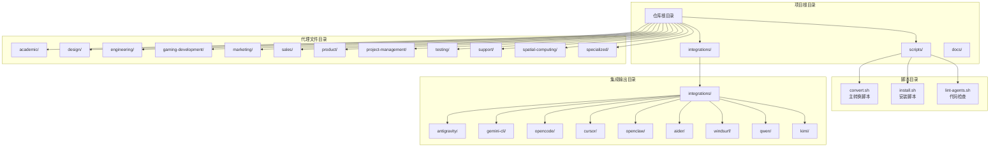
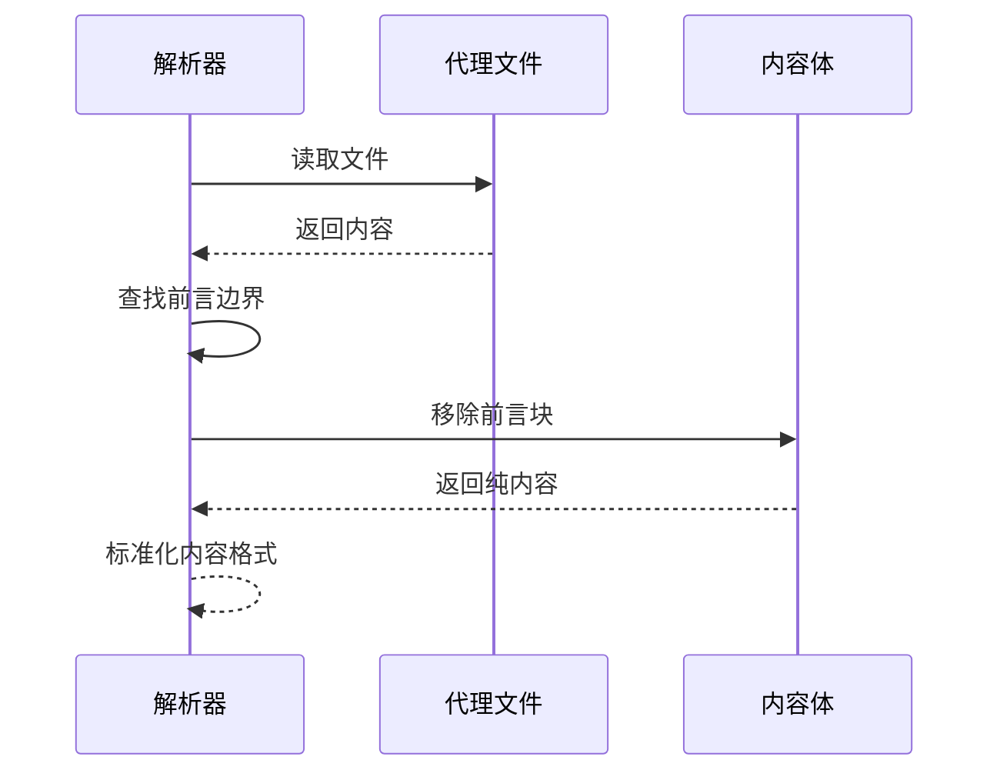
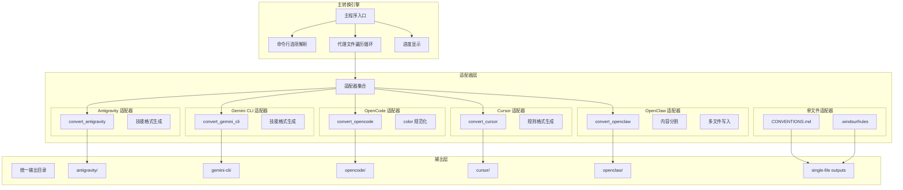
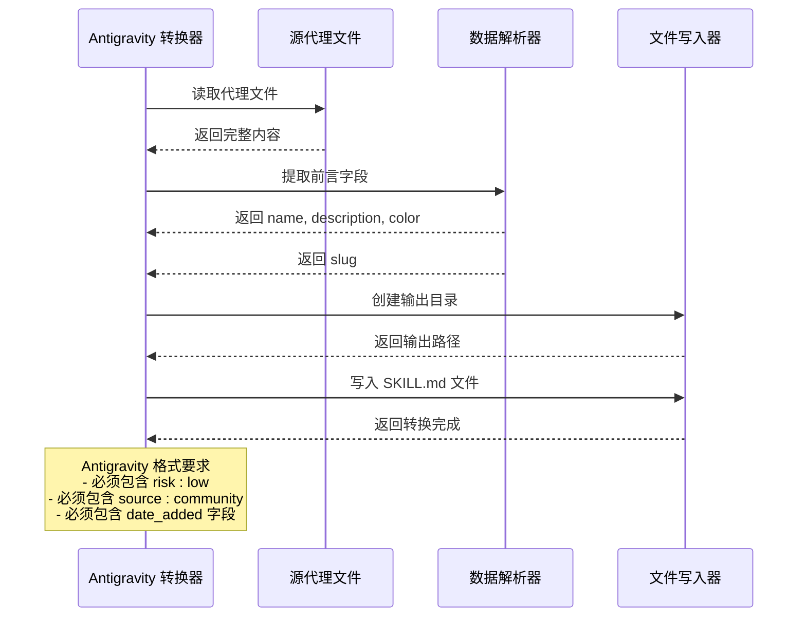
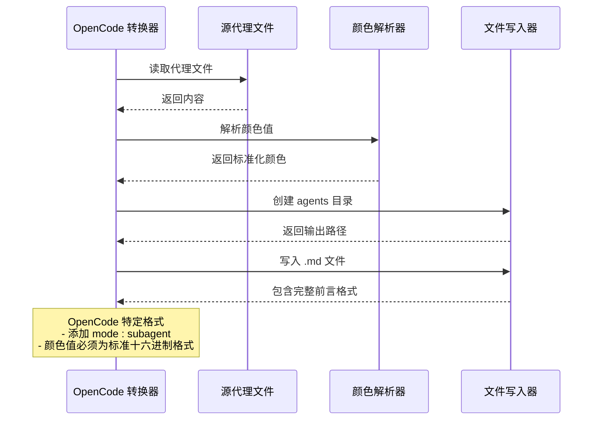
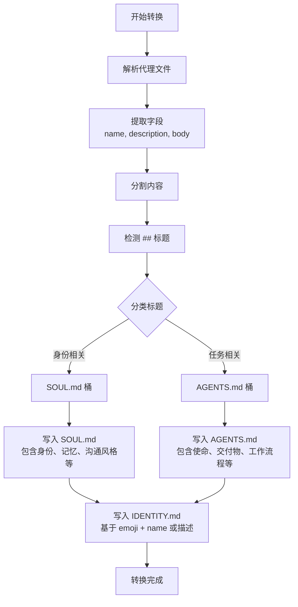
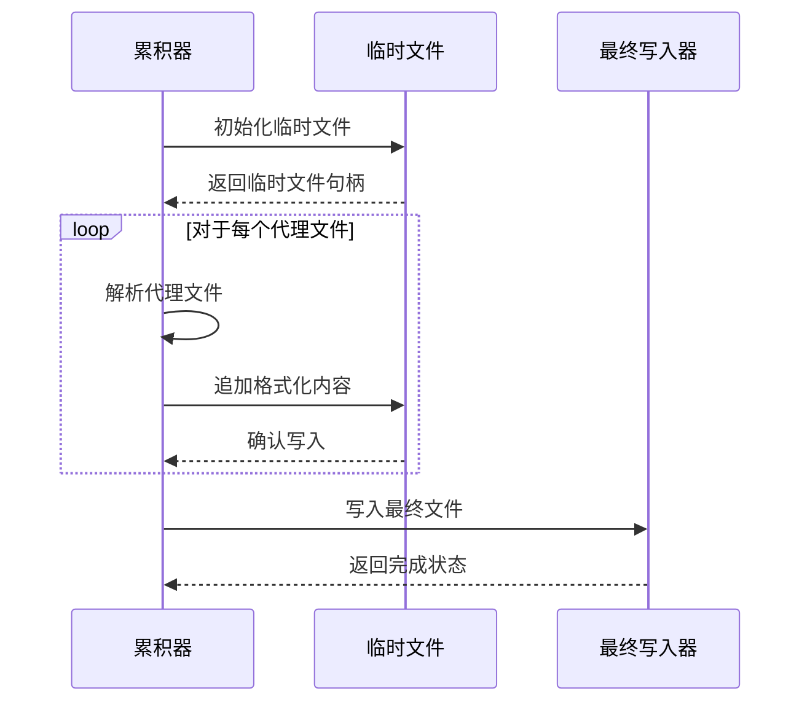
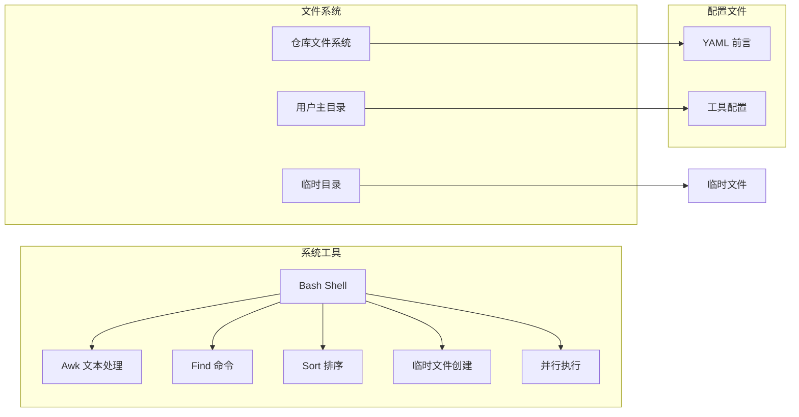
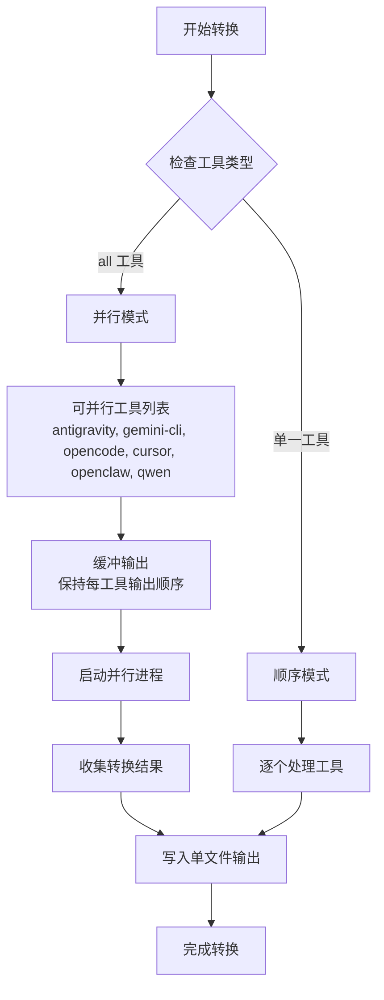

# 转换脚本 (convert.sh) 技术文档

<cite>
**本文档中引用的文件**
- [convert.sh](file://scripts/convert.sh)
- [install.sh](file://scripts/install.sh)
- [README.md](file://README.md)
- [integrations/README.md](file://integrations/README.md)
- [antigravity/README.md](file://integrations/antigravity/README.md)
- [gemini-cli/README.md](file://integrations/gemini-cli/README.md)
- [opencode/README.md](file://integrations/opencode/README.md)
- [cursor/README.md](file://integrations/cursor/README.md)
- [openclaw/README.md](file://integrations/openclaw/README.md)
- [kimi/README.md](file://integrations/kimi/README.md)
- [academic-anthropologist.md](file://academic/academic-anthropologist.md)
- [engineering-frontend-developer.md](file://engineering/engineering-frontend-developer.md)
- [marketing-content-creator.md](file://marketing/marketing-content-creator.md)
- [product-manager.md](file://product/product-manager.md)
</cite>

## 目录
1. [简介](#简介)
2. [项目结构](#项目结构)
3. [核心组件](#核心组件)
4. [架构概览](#架构概览)
5. [详细组件分析](#详细组件分析)
6. [依赖关系分析](#依赖关系分析)
7. [性能考虑](#性能考虑)
8. [故障排除指南](#故障排除指南)
9. [结论](#结论)
10. [附录](#附录)

## 简介

convert.sh 是一个专门设计用于将标准 Markdown 格式的代理文件转换为各个 AI 工具所需特定格式的自动化转换脚本。该脚本实现了统一的代理格式转换系统，能够将仓库中标准格式的代理文件转换为 Claude Code、GitHub Copilot、Antigravity、Gemini CLI、OpenCode、Cursor、OpenClaw、Aider、Windsurf、Qwen 和 Kimi Code 等不同工具的专用格式。

该转换系统的核心价值在于提供了一套标准化的数据处理流程，确保代理文件能够在多个不同的 AI 编程工具之间无缝迁移和使用，同时保持每个工具特有的功能特性和最佳实践。

## 项目结构

项目采用按功能域组织的目录结构，每个主要领域都有对应的代理文件目录：



**图表来源**
- [convert.sh:64-67](file://scripts/convert.sh#L64-L67)
- [integrations/README.md:1-209](file://integrations/README.md#L1-L209)

**章节来源**
- [convert.sh:1-639](file://scripts/convert.sh#L1-L639)
- [integrations/README.md:1-209](file://integrations/README.md#L1-L209)

## 核心组件

### 前言数据解析器

convert.sh 实现了专门的 YAML 前言数据解析功能，通过正则表达式和 AWK 工具来提取代理文件的元数据信息：

```mermaid
flowchart TD
START[开始解析] --> READ_FILE[读取文件内容]
READ_FILE --> FIND_FM[查找前言边界<br/>("---")]
FIND_FM --> EXTRACT_FIELDS[提取字段值<br/>name, description, color, tools等]
EXTRACT_FIELDS --> VALIDATE_DATA{验证数据完整性}
VALIDATE_DATA --> |完整| RETURN_DATA[返回解析结果]
VALIDATE_DATA --> |缺失| HANDLE_ERROR[处理缺失字段]
HANDLE_ERROR --> RETURN_DATA
RETURN_DATA --> END[结束]
```

**图表来源**
- [convert.sh:85-99](file://scripts/convert.sh#L85-L99)

### 内容提取器

内容提取器负责剥离 YAML 前言块并返回纯 Markdown 内容体：



**图表来源**
- [convert.sh:95-99](file://scripts/convert.sh#L95-L99)

### 格式标准化器

格式标准化器提供统一的字符串处理功能，包括：

- **slugify 函数**: 将人类可读的代理名称转换为小写 kebab-case 格式
- **颜色规范化**: 将命名颜色映射到标准的十六进制颜色值
- **日期格式化**: 使用 ISO 8601 格式记录转换日期

**章节来源**
- [convert.sh:101-105](file://scripts/convert.sh#L101-L105)
- [convert.sh:158-200](file://scripts/convert.sh#L158-L200)
- [convert.sh](file://scripts/convert.sh#L62)

## 架构概览

convert.sh 采用了模块化的适配器模式，为每个支持的工具提供专门的转换器：



**图表来源**
- [convert.sh:107-133](file://scripts/convert.sh#L107-L133)
- [convert.sh:135-156](file://scripts/convert.sh#L135-L156)
- [convert.sh:202-226](file://scripts/convert.sh#L202-L226)
- [convert.sh:228-249](file://scripts/convert.sh#L228-L249)
- [convert.sh:251-340](file://scripts/convert.sh#L251-L340)
- [convert.sh:410-478](file://scripts/convert.sh#L410-L478)

## 详细组件分析

### Antigravity 适配器

Antigravity 适配器专门处理 Antigravity 技能格式转换：



**图表来源**
- [convert.sh:109-133](file://scripts/convert.sh#L109-L133)
- [antigravity/README.md:37-49](file://integrations/antigravity/README.md#L37-L49)

**章节来源**
- [convert.sh:109-133](file://scripts/convert.sh#L109-L133)
- [antigravity/README.md:1-50](file://integrations/antigravity/README.md#L1-L50)

### Gemini CLI 适配器

Gemini CLI 适配器处理扩展包格式转换：

```mermaid
flowchart TD
START[开始转换] --> PARSE[解析代理文件]
PARSE --> EXTRACT[提取字段<br/>name, description, body]
EXTRACT --> CREATE_DIR[创建技能目录<br/>skills/<slug>/]
CREATE_DIR --> WRITE_SKILL[写入 SKILL.md<br/>最小化前言格式]
WRITE_SKILL --> WRITE_MANIFEST[写入扩展清单<br/>gemini-extension.json]
WRITE_MANIFEST --> COMPLETE[转换完成]
subgraph "输出结构"
SKILL[SKILL.md<br/>---<br/>name: slug<br/>description: description<br/>---]
MANIFEST[gemini-extension.json<br/>{"name": "agency-agents", "version": "1.0.0"}]
end
WRITE_SKILL --> SKILL
WRITE_MANIFEST --> MANIFEST
```

**图表来源**
- [convert.sh:135-156](file://scripts/convert.sh#L135-L156)
- [convert.sh:605-612](file://scripts/convert.sh#L605-L612)
- [gemini-cli/README.md:24-34](file://integrations/gemini-cli/README.md#L24-L34)

**章节来源**
- [convert.sh:135-156](file://scripts/convert.sh#L135-L156)
- [convert.sh:605-612](file://scripts/convert.sh#L605-L612)
- [gemini-cli/README.md:1-41](file://integrations/gemini-cli/README.md#L1-L41)

### OpenCode 适配器

OpenCode 适配器提供颜色规范化和子代理模式支持：



**图表来源**
- [convert.sh:202-226](file://scripts/convert.sh#L202-L226)
- [convert.sh:158-200](file://scripts/convert.sh#L158-L200)
- [opencode/README.md:32-46](file://integrations/opencode/README.md#L32-L46)

**章节来源**
- [convert.sh:202-226](file://scripts/convert.sh#L202-L226)
- [convert.sh:158-200](file://scripts/convert.sh#L158-L200)
- [opencode/README.md:1-63](file://integrations/opencode/README.md#L1-L63)

### Cursor 适配器

Cursor 适配器生成 .mdc 规则文件：

```mermaid
flowchart TD
START[开始转换] --> PARSE[解析代理文件]
PARSE --> EXTRACT[提取字段<br/>name, description, body]
EXTRACT --> CREATE_RULE[创建 .mdc 规则文件]
CREATE_RULE --> WRITE_RULE[写入规则内容<br/>包含描述和元数据]
WRITE_RULE --> COMPLETE[转换完成]
subgraph "Cursor 规则格式"
DESCRIPTION[description: 代理描述]
GLOBS[globs: "" (空字符串)]
ALWAYS_APPLY[alwaysApply: false]
BODY[代理主体内容]
end
WRITE_RULE --> DESCRIPTION
WRITE_RULE --> GLOBS
WRITE_RULE --> ALWAYS_APPLY
WRITE_RULE --> BODY
```

**图表来源**
- [convert.sh:228-249](file://scripts/convert.sh#L228-L249)
- [cursor/README.md:16-32](file://integrations/cursor/README.md#L16-L32)

**章节来源**
- [convert.sh:228-249](file://scripts/convert.sh#L228-L249)
- [cursor/README.md:1-39](file://integrations/cursor/README.md#L1-L39)

### OpenClaw 适配器

OpenClaw 适配器实现智能内容分割和多文件输出：



**图表来源**
- [convert.sh:251-340](file://scripts/convert.sh#L251-L340)
- [openclaw/README.md:1-35](file://integrations/openclaw/README.md#L1-L35)

**章节来源**
- [convert.sh:251-340](file://scripts/convert.sh#L251-L340)
- [openclaw/README.md:1-35](file://integrations/openclaw/README.md#L1-L35)

### 单文件适配器

Aider 和 Windsurf 适配器使用临时文件累积模式：



**图表来源**
- [convert.sh:410-478](file://scripts/convert.sh#L410-L478)

**章节来源**
- [convert.sh:410-478](file://scripts/convert.sh#L410-L478)

## 依赖关系分析

### 外部依赖

convert.sh 依赖以下外部工具和环境：



**图表来源**
- [convert.sh](file://scripts/convert.sh#L30)
- [convert.sh:59-62](file://scripts/convert.sh#L59-L62)

### 内部依赖关系

```mermaid
graph TB
subgraph "核心函数依赖"
GET_FIELD[get_field<br/>字段提取]
GET_BODY[get_body<br/>内容提取]
SLUGIFY[slugify<br/>名称标准化]
end
subgraph "适配器函数"
CONVERT_ANTIGRAVITY[convert_antigravity]
CONVERT_GEMINI_CLI[convert_gemini_cli]
CONVERT_OPENCODE[convert_opencode]
CONVERT_CURSOR[convert_cursor]
CONVERT_OPENCLAW[convert_openclaw]
CONVERT_QWEN[convert_qwen]
CONVERT_KIMI[convert_kimi]
end
subgraph "辅助函数"
RESOLVE_COLOR[resolve_opencode_color]
ACCUMULATE_AIDER[accumulate_aider]
ACCUMULATE_WINDSURF[accumulate_windsurf]
end
GET_FIELD --> CONVERT_ANTIGRAVITY
GET_FIELD --> CONVERT_GEMINI_CLI
GET_FIELD --> CONVERT_OPENCODE
GET_FIELD --> CONVERT_CURSOR
GET_FIELD --> CONVERT_OPENCLAW
GET_FIELD --> CONVERT_QWEN
GET_FIELD --> CONVERT_KIMI
GET_BODY --> CONVERT_ANTIGRAVITY
GET_BODY --> CONVERT_GEMINI_CLI
GET_BODY --> CONVERT_OPENCODE
GET_BODY --> CONVERT_CURSOR
GET_BODY --> CONVERT_OPENCLAW
GET_BODY --> CONVERT_QWEN
GET_BODY --> CONVERT_KIMI
SLUGIFY --> CONVERT_ANTIGRAVITY
SLUGIFY --> CONVERT_GEMINI_CLI
SLUGIFY --> CONVERT_OPENCODE
SLUGIFY --> CONVERT_CURSOR
SLUGIFY --> CONVERT_OPENCLAW
SLUGIFY --> CONVERT_QWEN
SLUGIFY --> CONVERT_KIMI
RESOLVE_COLOR --> CONVERT_OPENCODE
ACCUMULATE_AIDER --> AIDER_TEMP
ACCUMULATE_WINDSURF --> WINDSURF_TEMP
```



**图表来源**
- [convert.sh:85-105](file://scripts/convert.sh#L85-L105)
- [convert.sh:109-133](file://scripts/convert.sh#L109-L133)
- [convert.sh:135-156](file://scripts/convert.sh#L135-L156)
- [convert.sh:202-226](file://scripts/convert.sh#L202-L226)
- [convert.sh:228-249](file://scripts/convert.sh#L228-L249)
- [convert.sh:251-340](file://scripts/convert.sh#L251-L340)
- [convert.sh:342-375](file://scripts/convert.sh#L342-L375)
- [convert.sh:377-408](file://scripts/convert.sh#L377-L408)
- [convert.sh:410-478](file://scripts/convert.sh#L410-L478)

**章节来源**
- [convert.sh:85-105](file://scripts/convert.sh#L85-L105)
- [convert.sh:109-133](file://scripts/convert.sh#L109-L133)
- [convert.sh:135-156](file://scripts/convert.sh#L135-L156)
- [convert.sh:202-226](file://scripts/convert.sh#L202-L226)
- [convert.sh:228-249](file://scripts/convert.sh#L228-L249)
- [convert.sh:251-340](file://scripts/convert.sh#L251-L340)
- [convert.sh:342-375](file://scripts/convert.sh#L342-L375)
- [convert.sh:377-408](file://scripts/convert.sh#L377-L408)
- [convert.sh:410-478](file://scripts/convert.sh#L410-L478)

## 性能考虑

### 并行处理优化

convert.sh 实现了智能的并行处理机制：



**图表来源**
- [convert.sh:566-590](file://scripts/convert.sh#L566-L590)
- [convert.sh:591-616](file://scripts/convert.sh#L591-L616)

### 内存管理

脚本采用流式处理策略减少内存占用：

- **临时文件**: Aider 和 Windsurf 使用临时文件避免内存累积
- **增量写入**: OpenClaw 的内容分割采用流式处理
- **批量处理**: 支持 --jobs 参数控制并行进程数量

### I/O 优化

- **零拷贝**: 使用管道和重定向减少文件复制
- **原子操作**: 所有写入操作都是原子性的
- **错误恢复**: 完整的错误处理和清理机制

## 故障排除指南

### 常见转换错误及解决方案

#### 1. 前言格式错误

**问题**: 代理文件缺少有效的 YAML 前言格式

**症状**: 
- 转换过程中出现字段提取失败
- 输出文件缺少必要的元数据

**解决方案**:
- 确保前言使用正确的 YAML 格式
- 验证前言边界使用三个连字符 (`---`)
- 检查字段键值对的缩进和格式

#### 2. 文件编码问题

**问题**: 非 UTF-8 编码的代理文件导致转换失败

**症状**:
- 转换过程中出现字符编码错误
- 输出文件中出现乱码字符

**解决方案**:
- 确保所有代理文件使用 UTF-8 编码
- 使用文本编辑器转换文件编码
- 验证文件头信息

#### 3. 工具依赖缺失

**问题**: 目标工具未正确安装或配置

**症状**:
- 安装阶段检测失败
- 工具特定功能不可用

**解决方案**:
- 按照各工具的官方文档安装
- 验证工具版本兼容性
- 检查 PATH 环境变量配置

#### 4. 权限问题

**问题**: 脚本没有足够的权限访问目标目录

**症状**:
- 写入操作失败
- 输出文件创建失败

**解决方案**:
- 确保对输出目录具有写权限
- 检查用户权限设置
- 使用适当的运行时权限

**章节来源**
- [convert.sh:520-544](file://scripts/convert.sh#L520-L544)
- [install.sh:125-130](file://scripts/install.sh#L125-L130)

### 调试技巧

#### 启用详细日志

```bash
# 设置调试环境变量
export DEBUG=1
./scripts/convert.sh --tool all

# 查看中间文件
ls -la integrations/
```

#### 验证转换结果

```bash
# 检查生成的文件结构
find integrations/ -type f | head -20

# 验证 YAML 格式
python3 -c "import yaml; yaml.safe_load(open('integrations/gemini-cli/skills/frontend-developer/SKILL.md'))"

# 检查文件权限
ls -la integrations/*/ | head -10
```

#### 性能监控

```bash
# 监控转换过程
time ./scripts/convert.sh --tool all

# 检查磁盘空间
df -h integrations/

# 监控内存使用
watch -n 1 'ps aux | grep convert.sh'
```

## 结论

convert.sh 转换脚本成功实现了统一的代理格式转换系统，为多个 AI 编程工具提供了标准化的数据处理流程。该系统的主要优势包括：

1. **模块化设计**: 采用适配器模式，易于添加新的工具支持
2. **数据完整性**: 严格的前言解析和验证机制
3. **性能优化**: 智能的并行处理和内存管理
4. **错误处理**: 完善的错误检测和恢复机制
5. **可维护性**: 清晰的代码结构和详细的文档注释

通过这个转换系统，用户可以轻松地在不同的 AI 工具之间迁移代理文件，充分发挥每个工具的独特功能，同时保持代理内容的一致性和完整性。

## 附录

### 转换配置选项

| 选项 | 描述 | 默认值 | 示例 |
|------|------|--------|------|
| `--tool <name>` | 指定要转换的工具 | `all` | `--tool gemini-cli` |
| `--out <dir>` | 指定输出目录 | `integrations/` | `--out /tmp/custom-output` |
| `--parallel` | 启用并行转换 | 关闭 | `--parallel` |
| `--jobs N` | 设置并行进程数 | 自动检测 | `--jobs 4` |
| `--help` | 显示帮助信息 | - | `-h` |

### 支持的工具列表

| 工具名称 | 输出格式 | 主要特性 |
|----------|----------|----------|
| `antigravity` | `SKILL.md` | 技能格式，社区源 |
| `gemini-cli` | 扩展包 | 技能目录，清单文件 |
| `opencode` | `.md` 文件 | 子代理模式，颜色规范 |
| `cursor` | `.mdc` 文件 | 规则文件，项目范围 |
| `openclaw` | 多文件工作区 | SOUL/AGENTS/IDENTITY |
| `aider` | `CONVENTIONS.md` | 单文件汇总 |
| `windsurf` | `.windsurfrules` | 单文件规则 |
| `qwen` | SubAgent 文件 | 工具支持 |
| `kimi` | YAML 规范 | 系统提示分离 |

### 转换前后示例对比

#### Antigravity 格式转换

**转换前**（标准代理文件）：
```yaml
---
name: Frontend Developer
description: Expert frontend developer...
color: cyan
emoji: 🖥️
vibe: Builds responsive, accessible web apps...
---
# Agent Personality
...
```

**转换后**（Antigravity 格式）：
```yaml
---
name: agency-frontend-developer
description: Expert frontend developer...
risk: low
source: community
date_added: '2026-01-01'
---
# Agent Personality
...
```

#### OpenCode 格式转换

**转换前**（标准代理文件）：
```yaml
---
name: Frontend Developer
description: Expert frontend developer...
color: cyan
emoji: 🖥️
vibe: Builds responsive, accessible web apps...
---
# Agent Personality
...
```

**转换后**（OpenCode 格式）：
```yaml
---
name: Frontend Developer
description: Expert frontend developer...
mode: subagent
color: "#00FFFF"
---
# Agent Personality
...
```

#### OpenClaw 格式转换

**转换前**（标准代理文件）：
```yaml
---
name: Frontend Developer
description: Expert frontend developer...
---
# Agent Personality
## Your Identity & Memory
- Role: Modern web application specialist
## Core Mission
- Build responsive web applications...
```

**转换后**（OpenClaw 格式）：
```
SOUL.md:
# Your Identity & Memory
- Role: Modern web application specialist

AGENTS.md:
# Core Mission
- Build responsive web applications...

IDENTITY.md:
# 🖥️ Frontend Developer
Builds responsive, accessible web apps...
```