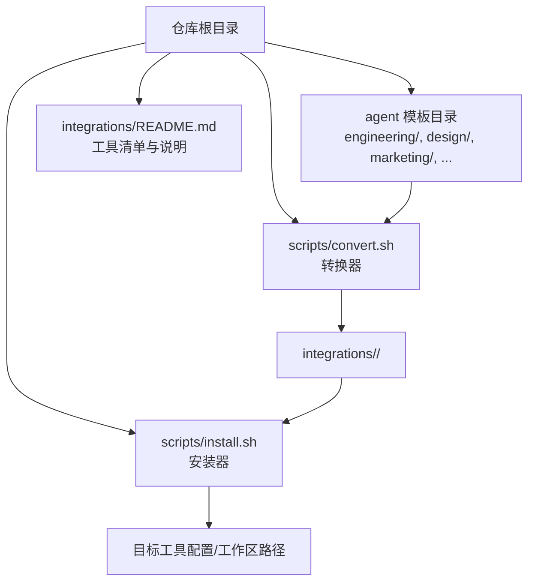
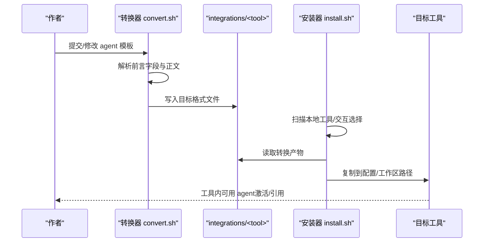
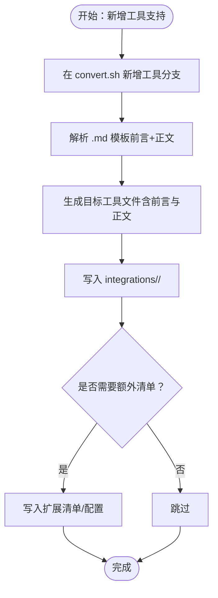
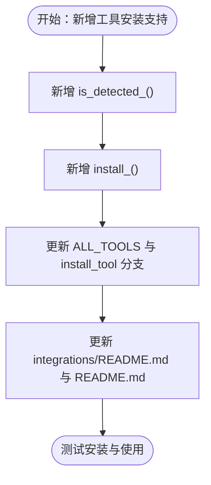
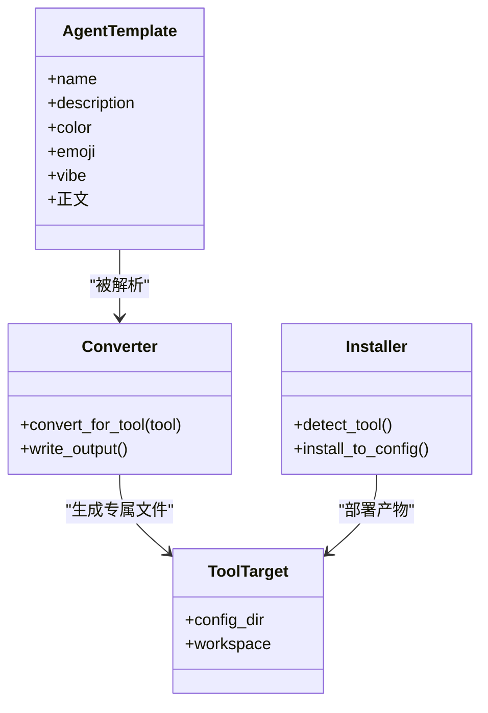

# 可扩展性设计

<cite>
**本文引用的文件**
- [README.md](file://README.md)
- [scripts/convert.sh](file://scripts/convert.sh)
- [scripts/install.sh](file://scripts/install.sh)
- [integrations/README.md](file://integrations/README.md)
- [integrations/claude-code/README.md](file://integrations/claude-code/README.md)
- [integrations/antigravity/README.md](file://integrations/antigravity/README.md)
- [integrations/gemini-cli/README.md](file://integrations/gemini-cli/README.md)
- [integrations/cursor/README.md](file://integrations/cursor/README.md)
- [engineering-frontend-developer.md](file://engineering/engineering-frontend-developer.md)
- [specialized-mcp-builder.md](file://specialized/specialized-mcp-builder.md)
- [specialized/agents-orchestrator.md](file://specialized/agents-orchestrator.md)
</cite>

## 目录
1. [简介](#简介)
2. [项目结构](#项目结构)
3. [核心组件](#核心组件)
4. [架构总览](#架构总览)
5. [详细组件分析](#详细组件分析)
6. [依赖关系分析](#依赖关系分析)
7. [性能考量](#性能考量)
8. [故障排查指南](#故障排查指南)
9. [结论](#结论)
10. [附录](#附录)

## 简介
本文件聚焦于 agency-agents 项目的“可扩展性设计”，系统阐述其如何以统一的 agent 模板与转换器/安装器机制，实现对多类 agentic 编程工具（Claude Code、GitHub Copilot、Antigravity、Gemini CLI、OpenCode、Cursor、Aider、Windsurf、OpenClaw、Qwen Code、Kimi Code）的无缝集成；并从“转换器扩展机制、安装器扩展机制、配置管理扩展”三个维度，给出标准化接口、扩展流程、测试方法与最佳实践。

## 项目结构
- agent 模板采用统一的 Markdown + YAML 前言块格式，位于各职能分类目录下（如 engineering、design、marketing 等），便于转换器解析与生成目标工具所需的格式。
- 转换器与安装器脚本位于 scripts/ 目录，分别负责“将 agent 模板转换为各工具所需格式”和“将转换产物安装到目标工具的配置或工作区路径”。
- integrations/ 目录存放各工具的转换输出与使用说明，作为转换器的输出目录与安装器的目标目录。

图表来源
- [README.md](file://README.md)
- [scripts/convert.sh](file://scripts/convert.sh)
- [scripts/install.sh](file://scripts/install.sh)
- [integrations/README.md](file://integrations/README.md)

章节来源
- [README.md](file://README.md)
- [integrations/README.md](file://integrations/README.md)

## 核心组件
- agent 模板：统一的 Markdown + YAML 前言块，包含 name、description、color、emoji、vibe 等元信息，以及身份、使命、规则、技术交付物、工作流等正文内容。
- 转换器（convert.sh）：按工具维度读取 agent 模板，提取前言字段与正文，生成目标工具所需的文件结构与格式（如 SKILL.md、.mdc、YAML agent 规范等），并写入 integrations/<tool>/。
- 安装器（install.sh）：扫描本地已安装工具，交互式或非交互式选择目标工具，将 integrations/<tool>/ 下的产物复制到对应工具的配置目录或项目工作区。

章节来源
- [scripts/convert.sh](file://scripts/convert.sh)
- [scripts/install.sh](file://scripts/install.sh)
- [engineering-frontend-developer.md](file://engineering/engineering-frontend-developer.md)

## 架构总览
下图展示了从 agent 模板到多工具集成的端到端流程：模板解析、格式转换、产物安装与工具激活。

图表来源
- [scripts/convert.sh](file://scripts/convert.sh)
- [scripts/install.sh](file://scripts/install.sh)
- [integrations/README.md](file://integrations/README.md)

## 详细组件分析

### 转换器扩展机制（新增工具格式支持）
- 设计要点
  - 统一输入：所有 agent 模板均以“三短横线开头的 YAML 前言块 + 正文”的标准格式存在，转换器通过解析前言字段与正文，保证跨工具一致性。
  - 工具特定输出：针对不同工具，转换器生成其专属文件名、目录结构与最小化前言（如 Antigravity 的 SKILL.md、Cursor 的 .mdc、Kimi 的 agent.yaml + system.md 等）。
  - 并行转换：当工具集全量转换时，convert.sh 支持并行执行独立工具转换任务，并通过临时缓冲确保每类工具的输出聚合在一起。
- 扩展步骤
  1) 在 convert.sh 中新增工具分支，定义：
     - 输入文件遍历与过滤（仅处理带前言块的 .md 文件）
     - 前言字段提取（如 name、description、color、tools 等）
     - 正文提取与清洗
     - 生成目标文件（含必要前言与正文）
     - 输出到 integrations/<newtool>/
  2) 若目标工具需要额外清单文件（如 gemini-cli 的扩展清单），在转换完成后写入相应文件。
  3) 如需单文件聚合（如 Aider 的 CONVENTIONS.md），在遍历结束后一次性写出。
  4) 更新 integrations/README.md 与 README.md 的工具清单与使用说明。
- 接口规范
  - 输入：标准 agent 模板（Markdown + YAML 前言）
  - 输出：目标工具所需文件（文件名、目录、前言字段、正文）
  - 并行：支持 --parallel 与 --jobs 控制并发度
- 测试方法
  - 单工具测试：./scripts/convert.sh --tool <newtool>
  - 全量测试：./scripts/convert.sh
  - 验证产物：检查 integrations/<newtool>/* 是否生成正确
  - 回归测试：对现有工具进行转换，确保不破坏既有格式

图表来源
- [scripts/convert.sh](file://scripts/convert.sh)
- [integrations/README.md](file://integrations/README.md)

章节来源
- [scripts/convert.sh](file://scripts/convert.sh)
- [integrations/README.md](file://integrations/README.md)

### 安装器扩展机制（新增工具安装支持）
- 设计要点
  - 工具检测：install.sh 通过 is_detected_* 函数判断目标工具是否已安装，支持自动检测与交互选择。
  - 目标路径：针对用户级与项目级工具，分别写入用户家目录或项目工作区。
  - 并行安装：支持 --parallel 与 --jobs，通过子进程并行安装多个工具，避免重复输出头尾框。
  - 错误处理：对缺失 integrations/<tool>/ 的情况给出明确提示，引导先运行 convert.sh。
- 扩展步骤
  1) 在 install.sh 中新增工具检测函数与安装函数：
     - 检测函数：is_detected_<tool>（判断工具是否存在）
     - 安装函数：install_<tool>（复制产物到目标路径）
  2) 在 ALL_TOOLS 列表中加入新工具名称
  3) 在 install_tool 分支中添加 case 分支调用新安装函数
  4) 更新 integrations/README.md 与 README.md 的安装说明与使用示例
- 接口规范
  - 输入：已由 convert.sh 生成的 integrations/<tool>/
  - 输出：目标工具的配置目录或项目工作区
  - 并行：支持 --parallel 与 --jobs
- 测试方法
  - 单工具安装：./scripts/install.sh --tool <newtool>
  - 自动检测：./scripts/install.sh
  - 并行安装：./scripts/install.sh --parallel
  - 验证：确认目标路径存在对应文件，工具内可正常使用

图表来源
- [scripts/install.sh](file://scripts/install.sh)
- [integrations/README.md](file://integrations/README.md)

章节来源
- [scripts/install.sh](file://scripts/install.sh)
- [integrations/README.md](file://integrations/README.md)

### 配置管理扩展（工具选择与版本管理）
- 工具选择
  - 交互式选择：install.sh 提供交互界面，支持全选、清空、仅检测到的工具，以及一键安装。
  - 非交互式：--no-interactive 自动安装检测到的工具；--tool <name> 强制安装指定工具。
  - 并行：--parallel 与 --jobs 控制并发安装数量。
- 版本与生成物
  - 转换时间戳：convert.sh 使用日期作为生成时间，便于追踪与审计。
  - 产物目录：integrations/<tool>/ 下的文件结构与命名遵循工具约定，避免冲突。
  - 清单文件：如 gemini-cli 的扩展清单，确保工具识别与加载。
- 最佳实践
  - 修改 agent 后先运行 convert.sh，再运行 install.sh
  - 对项目级工具（OpenCode、Cursor、Aider、Windsurf），在项目根目录执行安装器
  - 对用户级工具（Claude Code、Copilot、Antigravity、OpenClaw、Qwen Code、Kimi Code），在用户家目录生效

章节来源
- [scripts/install.sh](file://scripts/install.sh)
- [scripts/convert.sh](file://scripts/convert.sh)
- [integrations/README.md](file://integrations/README.md)

### 工具适配器设计模式（标准化接口）
- 统一入口：所有 agent 模板均以相同的 Markdown + YAML 前言块格式提供元信息与正文，便于转换器统一解析。
- 工具适配层：转换器作为“适配器”，将统一模板映射为目标工具的专属格式；安装器作为“部署适配器”，将转换产物部署到目标工具的配置或工作区。
- 可组合性：通过“转换器 + 安装器”的分层设计，新增工具只需实现两个适配器（转换与安装），即可无缝接入。

图表来源
- [scripts/convert.sh](file://scripts/convert.sh)
- [scripts/install.sh](file://scripts/install.sh)
- [engineering-frontend-developer.md](file://engineering/engineering-frontend-developer.md)

章节来源
- [scripts/convert.sh](file://scripts/convert.sh)
- [scripts/install.sh](file://scripts/install.sh)
- [engineering-frontend-developer.md](file://engineering/engineering-frontend-developer.md)

### 扩展示例：新增一个工具（以“示例工具 X”为例）
- 第一步：在 convert.sh 中新增分支
  - 定义 convert_xxx()：解析 name/description/tools 等字段，生成 integrations/xxx/<slug>/ 文件
  - 如需单文件聚合，使用临时文件并在最后一次性写出
- 第二步：在 install.sh 中新增分支
  - 定义 is_detected_xxx() 与 install_xxx()，复制产物到目标路径
  - 在 ALL_TOOLS 与 install_tool 分支中注册
- 第三步：更新文档
  - 在 integrations/README.md 与 README.md 中补充工具说明、安装与使用示例
- 第四步：测试
  - ./scripts/convert.sh --tool xxx
  - ./scripts/install.sh --tool xxx
  - 在目标工具中验证 agent 可用

章节来源
- [scripts/convert.sh](file://scripts/convert.sh)
- [scripts/install.sh](file://scripts/install.sh)
- [integrations/README.md](file://integrations/README.md)

### 配置文件与脚本机制（灵活的工具选择与版本管理）
- 配置文件
  - Antigravity：SKILL.md（含 name、description、risk、source、date_added）
  - Gemini CLI：gemini-extension.json + skills/<slug>/SKILL.md
  - OpenCode：.opencode/agents/<slug>.md（含 name、description、mode、color）
  - Cursor：.cursor/rules/<slug>.mdc（含 description、globs、alwaysApply）
  - Aider：integrations/aider/CONVENTIONS.md（汇总所有 agent）
  - Windsurf：integrations/windsurf/.windsurfrules（项目级规则）
  - OpenClaw：SOUL.md、AGENTS.md、IDENTITY.md 三件套
  - Qwen Code：~/.qwen/agents/<slug>.md 或项目级 .qwen/agents/
  - Kimi Code：~/.config/kimi/agents/<slug>/agent.yaml + system.md
- 脚本机制
  - convert.sh：按工具维度批量转换，支持并行与作业数控制
  - install.sh：自动检测工具、交互选择、并行安装、错误提示

章节来源
- [scripts/convert.sh](file://scripts/convert.sh)
- [scripts/install.sh](file://scripts/install.sh)
- [integrations/README.md](file://integrations/README.md)

## 依赖关系分析
- 转换器依赖 agent 模板的统一格式（前言块与正文）
- 安装器依赖转换器生成的 integrations/<tool>/ 目录结构
- 工具侧依赖安装器复制到的配置/工作区路径

图表来源
- [scripts/convert.sh](file://scripts/convert.sh)
- [scripts/install.sh](file://scripts/install.sh)
- [integrations/README.md](file://integrations/README.md)

章节来源
- [scripts/convert.sh](file://scripts/convert.sh)
- [scripts/install.sh](file://scripts/install.sh)
- [integrations/README.md](file://integrations/README.md)

## 性能考量
- 并行化
  - 转换器与安装器均支持 --parallel 与 --jobs，利用多核 CPU 加速批量转换与安装
  - 并行模式下输出按工具缓冲，避免混杂
- I/O 优化
  - 使用 find -print0 与 sort -z 处理大量文件，减少路径解析开销
  - 临时文件用于单文件聚合（如 Aider、Windsurf），降低多次写入成本
- 可观测性
  - 进度条与彩色日志提升操作反馈
  - 交互式选择界面便于快速决策与重试

章节来源
- [scripts/convert.sh](file://scripts/convert.sh)
- [scripts/install.sh](file://scripts/install.sh)

## 故障排查指南
- “integrations/ 不存在”
  - 现象：install.sh 报错要求先运行 convert.sh
  - 处理：先执行 ./scripts/convert.sh（或针对特定工具 ./scripts/convert.sh --tool <tool>）
- “未检测到目标工具”
  - 现象：install.sh 显示工具未找到
  - 处理：确认工具已安装或在 PATH 中；或使用 --tool <name> 强制安装
- “项目级工具未生效”
  - 现象：OpenCode、Cursor、Aider、Windsurf 未在项目中生效
  - 处理：在项目根目录执行安装器；确认产物写入到 .opencode/agents/、.cursor/rules/、CONVENTIONS.md、.windsurfrules
- “并行安装输出混乱”
  - 现象：并行安装时输出交错
  - 处理：使用缓冲目录输出，或关闭并行模式
- “转换后 agent 无法使用”
  - 现象：目标工具无法识别 agent
  - 处理：检查 integrations/<tool>/* 文件是否完整；确认前言字段与文件名符合工具要求

章节来源
- [scripts/install.sh](file://scripts/install.sh)
- [scripts/convert.sh](file://scripts/convert.sh)
- [integrations/README.md](file://integrations/README.md)

## 结论
agency-agents 通过“统一 agent 模板 + 转换器 + 安装器”的三层架构，实现了对多类 agentic 编程工具的高可扩展性与低耦合集成。新增工具只需在转换器与安装器中添加适配逻辑，并完善文档与测试，即可快速上线。配合并行化与清晰的配置管理机制，系统在易用性、可维护性与性能方面均具备良好表现。

## 附录

### 扩展清单（新增工具建议）
- 转换器
  - 新增 convert_<tool>()：解析前言字段，生成目标格式文件
  - 如需单文件聚合，使用临时文件并在末尾写出
  - 如需额外清单，转换完成后写入
- 安装器
  - 新增 is_detected_<tool>() 与 install_<tool>()
  - 在 ALL_TOOLS 与 install_tool 分支中注册
- 文档
  - 更新 integrations/README.md 与 README.md 的工具清单、安装与使用说明
- 测试
  - ./scripts/convert.sh --tool <tool>
  - ./scripts/install.sh --tool <tool>
  - 在目标工具中验证 agent 可用

章节来源
- [scripts/convert.sh](file://scripts/convert.sh)
- [scripts/install.sh](file://scripts/install.sh)
- [integrations/README.md](file://integrations/README.md)

### 工具适配参考（部分工具）
- Claude Code：原生支持，无需转换，直接复制到 ~/.claude/agents/
- GitHub Copilot：原生支持，复制到 ~/.github/agents/ 与 ~/.copilot/agents/
- Antigravity：每个 agent 生成 SKILL.md，安装到 ~/.gemini/antigravity/skills/
- Gemini CLI：扩展清单 + skills/<slug>/SKILL.md，安装到 ~/.gemini/extensions/agency-agents/
- OpenCode：.opencode/agents/<slug>.md（项目级）
- Cursor：.cursor/rules/<slug>.mdc（项目级）
- Aider：integrations/aider/CONVENTIONS.md（项目级）
- Windsurf：integrations/windsurf/.windsurfrules（项目级）
- OpenClaw：SOUL.md、AGENTS.md、IDENTITY.md 三件套，安装到 ~/.openclaw/agency-agents/
- Qwen Code：~/.qwen/agents/<slug>.md（项目级或用户级）
- Kimi Code：~/.config/kimi/agents/<slug>/agent.yaml + system.md

章节来源
- [README.md](file://README.md)
- [integrations/README.md](file://integrations/README.md)
- [integrations/claude-code/README.md](file://integrations/claude-code/README.md)
- [integrations/antigravity/README.md](file://integrations/antigravity/README.md)
- [integrations/gemini-cli/README.md](file://integrations/gemini-cli/README.md)
- [integrations/cursor/README.md](file://integrations/cursor/README.md)

### MCP 工具扩展参考
- MCP Builder 提供了面向 AI agent 的工具/资源/提示模板设计与实现范式，强调“描述清晰、参数类型化、结构化输出、容错与安全”的原则，可作为自定义工具适配器的参考模型。

章节来源
- [specialized-mcp-builder.md](file://specialized/specialized-mcp-builder.md)

### 多代理编排参考
- Agents Orchestrator 展示了如何以统一的“项目规格 → 任务列表 → 架构基础 → 开发-质量门禁循环 → 最终集成验证”的流水线，协调多个 agent 完成端到端交付，体现了可扩展工作流的组织方式。

章节来源
- [specialized/agents-orchestrator.md](file://specialized/agents-orchestrator.md)