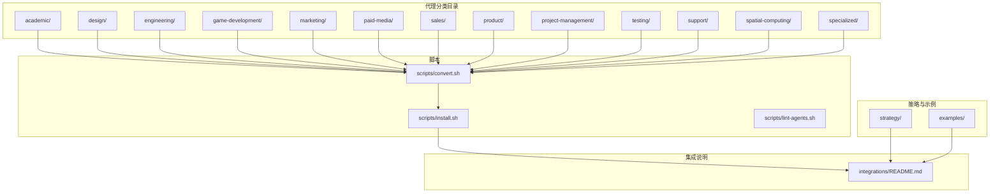
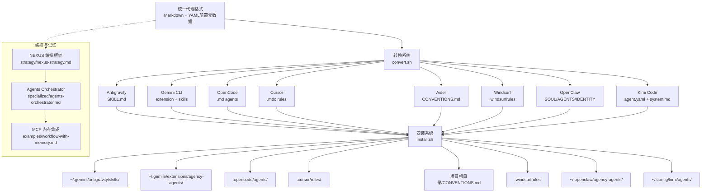
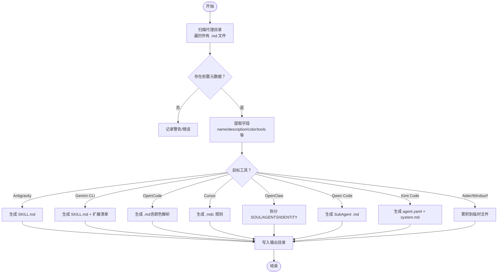
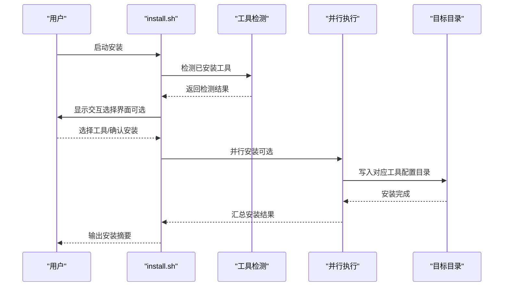
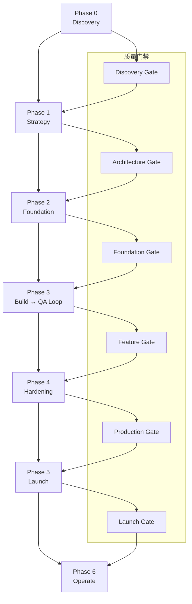
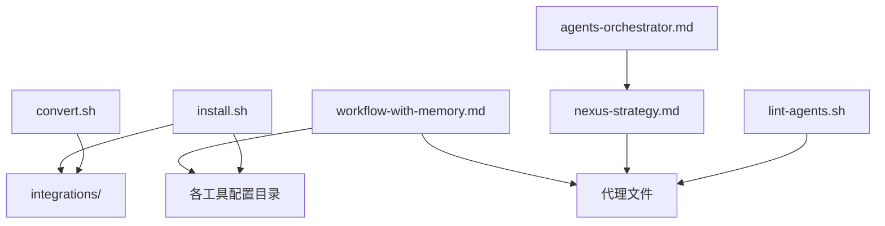

# 架构概览

<cite>
**本文档引用的文件**
- [README.md](file://README.md)
- [install.sh](file://scripts/install.sh)
- [convert.sh](file://scripts/convert.sh)
- [lint-agents.sh](file://scripts/lint-agents.sh)
- [integrations/README.md](file://integrations/README.md)
- [QUICKSTART.md](file://strategy/QUICKSTART.md)
- [nexus-strategy.md](file://strategy/nexus-strategy.md)
- [workflow-with-memory.md](file://examples/workflow-with-memory.md)
- [engineering-frontend-developer.md](file://engineering/engineering-frontend-developer.md)
- [design-ui-designer.md](file://design/design-ui-designer.md)
- [agents-orchestrator.md](file://specialized/agents-orchestrator.md)
</cite>

## 目录
1. [简介](#简介)
2. [项目结构](#项目结构)
3. [核心组件](#核心组件)
4. [架构总览](#架构总览)
5. [详细组件分析](#详细组件分析)
6. [依赖分析](#依赖分析)
7. [性能考虑](#性能考虑)
8. [故障排除指南](#故障排除指南)
9. [结论](#结论)
10. [附录](#附录)

## 简介
本项目是一个“AI专家团队”（The Agency）的开源集合，包含144个专业化AI代理，覆盖工程、设计、营销、产品、项目管理、测试、支持、空间计算与专门化等12个部门。每个代理都具备明确的人格、使命、可交付成果、工作流程和成功指标，并通过标准化的Markdown格式定义，确保在不同工具间的一致性和可移植性。

系统采用模块化设计，通过转换脚本将统一的代理格式转换为各工具所需的特定格式；通过安装脚本自动将转换后的文件部署到目标工具的配置目录中；并通过NEXUS编排框架实现多代理协同、质量门禁和持续反馈循环。

## 项目结构
仓库采用按功能域划分的目录结构：
- 分类目录：academic、design、engineering、game-development、marketing、paid-media、sales、product、project-management、sales、testing、support、spatial-computing、specialized
- 策略与运行手册：strategy（包含NEXUS完整操作手册、快速启动指南、场景化运行书）
- 示例：examples（包含带记忆的多代理工作流示例）
- 脚本：scripts（转换、安装、静态检查脚本）

图表来源
- [README.md: 508-800:508-800](file://README.md#L508-L800)
- [integrations/README.md: 1-209:1-209](file://integrations/README.md#L1-L209)
- [convert.sh: 1-639:1-639](file://scripts/convert.sh#L1-L639)
- [install.sh: 1-640:1-640](file://scripts/install.sh#L1-L640)

章节来源
- [README.md: 508-800:508-800](file://README.md#L508-L800)
- [integrations/README.md: 1-209:1-209](file://integrations/README.md#L1-L209)

## 核心组件
- 统一代理格式：所有代理以Markdown文件形式定义，包含YAML前置元数据（name、description、color等）和正文内容（身份、使命、规则、技术交付物、工作流程、成功指标等）。该格式是跨工具兼容性的基础。
- 转换系统：convert.sh将统一格式转换为各工具所需格式（如Antigravity的SKILL.md、Gemini CLI扩展、OpenCode的.md、Cursor的.mdc、Aider的CONVENTIONS.md、Windsurf的.windsurfrules、OpenClaw的SOUL/AGENTS/IDENTITY、Kimi的agent.yaml/system.md）。
- 安装系统：install.sh扫描本地已安装工具，将转换后的文件复制到对应配置目录，支持交互式选择、非交互式批量安装、并行安装。
- 静态检查：lint-agents.sh验证代理文件的前置元数据完整性与推荐部分存在性，确保质量门槛。
- 编排框架：NEXUS（strategy/nexus-strategy.md）定义了七阶段流水线、质量门禁、代理协调矩阵、交接协议与风险控制，Agents Orchestrator（specialized/agents-orchestrator.md）负责执行与监控。
- 记忆集成：examples/workflow-with-memory.md展示了如何通过MCP内存服务器实现跨代理持久状态管理，消除手工交接成本。

章节来源
- [convert.sh: 107-639:107-639](file://scripts/convert.sh#L107-L639)
- [install.sh: 122-640:122-640](file://scripts/install.sh#L122-L640)
- [lint-agents.sh: 1-117:1-117](file://scripts/lint-agents.sh#L1-L117)
- [nexus-strategy.md: 1-800:1-800](file://strategy/nexus-strategy.md#L1-L800)
- [agents-orchestrator.md: 1-367:1-367](file://specialized/agents-orchestrator.md#L1-L367)
- [workflow-with-memory.md: 1-239:1-239](file://examples/workflow-with-memory.md#L1-L239)

## 架构总览
系统采用“统一格式 + 工具适配 + 自动安装”的三层架构：
- 数据层：标准化代理文件（Markdown + YAML前置元数据），保证跨工具一致性。
- 适配层：转换脚本将统一格式映射到各工具的特定文件结构或规范。
- 运行层：安装脚本将适配产物部署到目标工具的配置路径；NEXUS编排框架驱动多代理协作；记忆集成提供上下文持久化。

图表来源
- [convert.sh: 107-639:107-639](file://scripts/convert.sh#L107-L639)
- [install.sh: 296-495:296-495](file://scripts/install.sh#L296-L495)
- [nexus-strategy.md: 73-116:73-116](file://strategy/nexus-strategy.md#L73-L116)
- [agents-orchestrator.md: 1-367:1-367](file://specialized/agents-orchestrator.md#L1-L367)
- [workflow-with-memory.md: 1-239:1-239](file://examples/workflow-with-memory.md#L1-L239)

## 详细组件分析

### 组件A：转换系统（convert.sh）
- 设计理念：将统一的代理格式转换为各工具所需的特定格式，确保跨工具兼容性。
- 关键能力：
  - 提取前置元数据（name、description、color等），生成目标格式的头部信息。
  - 将正文内容按工具要求进行格式化（如Cursor的.mdc、OpenCode的.md、Aider/Windsurf的单文件聚合）。
  - 对OpenClaw进行特殊处理：根据标题关键字将正文拆分为SOUL.md（身份/记忆/沟通风格/关键规则）与AGENTS.md（使命/交付物/工作流程）。
  - 对Kimi Code生成agent.yaml与system.md分离文件，便于CLI使用。
  - 支持并行转换（--parallel），提升大规模转换效率。
- 复杂度分析：时间复杂度近似O(N)，其中N为代理文件数量；空间复杂度主要由临时文件与输出目录占用决定。
- 错误处理：对缺失前置元数据、非法颜色值、缺少必要字段等情况给出明确错误提示；对单文件聚合器（Aider/Windsurf）在多次调用时仅写入一次最终文件。

图表来源
- [convert.sh: 83-639:83-639](file://scripts/convert.sh#L83-L639)

章节来源
- [convert.sh: 83-639:83-639](file://scripts/convert.sh#L83-L639)

### 组件B：安装系统（install.sh）
- 设计理念：自动化检测本地工具环境，将转换后的文件安装到对应工具的配置目录，支持交互式选择、非交互式批量安装与并行安装。
- 关键能力：
  - 工具检测：通过路径与命令存在性判断工具是否已安装。
  - 交互式选择：在终端显示工具列表与检测状态，支持全选/全不选/仅检测到的切换。
  - 并行安装：使用子进程并行处理多个工具，避免重复输出，缓冲每项工具的安装日志。
  - 安装目标：针对不同工具写入到用户级或项目级目录（如~/.gemini、~/.openclaw、.cursor/rules、.opencode/agents等）。
- 复杂度分析：时间复杂度近似O(T)，其中T为选定工具数量；并行模式下实际完成时间取决于最慢工具的安装耗时。
- 错误处理：当integrations目录缺失或工具未检测到时给出明确提示；对已存在的文件给出覆盖警告。

图表来源
- [install.sh: 133-640:133-640](file://scripts/install.sh#L133-L640)

章节来源
- [install.sh: 133-640:133-640](file://scripts/install.sh#L133-L640)

### 组件C：静态检查（lint-agents.sh）
- 设计理念：在提交前对代理文件进行质量检查，确保前置元数据完整、推荐部分齐全、内容足够丰富。
- 关键能力：
  - 检查前置元数据开头与存在性。
  - 校验必需字段（name、description、color）。
  - 建议性检查（Identity、Core Mission、Critical Rules）是否存在。
  - 检查正文字数阈值，避免过短内容。
- 复杂度分析：对每个文件进行线性扫描，总体复杂度O(F×L)，其中F为文件数，L为平均行数。

章节来源
- [lint-agents.sh: 1-117:1-117](file://scripts/lint-agents.sh#L1-L117)

### 组件D：编排框架（NEXUS）
- 设计理念：将独立的AI专家整合为协同网络，定义明确的阶段、质量门禁、交接协议与风险控制，确保从发现到运营的端到端交付。
- 核心要素：
  - 七阶段流水线：Discovery → Strategy → Scaffolding → Build ↔ QA Loop → Hardening → Launch → Operate。
  - 质量门禁：每个阶段必须通过证据驱动的质量评估才能进入下一阶段。
  - 代理协调矩阵：展示跨部门依赖关系与高频交接对。
  - 手续模板与失败反馈：标准化交接文档与QA反馈模板，确保可追溯与可修复。
  - 风险管理：按严重程度分级响应，明确决策权限与升级路径。
- 代表性代理：Agents Orchestrator（specialized/agents-orchestrator.md）作为管道控制器，管理任务级QA循环、重试策略与升级流程。

图表来源
- [nexus-strategy.md: 73-116:73-116](file://strategy/nexus-strategy.md#L73-L116)
- [nexus-strategy.md: 703-726:703-726](file://strategy/nexus-strategy.md#L703-L726)

章节来源
- [nexus-strategy.md: 1-800:1-800](file://strategy/nexus-strategy.md#L1-L800)
- [agents-orchestrator.md: 1-367:1-367](file://specialized/agents-orchestrator.md#L1-L367)

### 组件E：记忆集成（MCP Memory）
- 设计理念：通过MCP兼容的记忆服务器实现跨代理的状态持久化，消除手工交接与上下文丢失问题。
- 关键模式：
  - 项目标签：为所有记忆打上项目名标签，便于召回。
  - 接收者标签：将交付物标记给下一个代理，使其自动检索。
  - 回滚机制：当QA失败时，代理可回滚到最近的已知良好版本，减少手动撤销成本。
- 应用场景：examples/workflow-with-memory.md展示了从规划到发布的完整闭环，Reality Checker获得全局可见性，加速迭代。

章节来源
- [workflow-with-memory.md: 1-239:1-239](file://examples/workflow-with-memory.md#L1-L239)

## 依赖分析
- 组件耦合：
  - convert.sh与install.sh之间存在间接依赖：install.sh依赖convert.sh生成的integrations目录。
  - 编排框架与代理文件强耦合：NEXUS的交接协议与质量门禁依赖代理文件中的标准字段与工作流程描述。
  - 记忆集成与代理文件弱耦合：通过约定的标签与检索接口实现松耦合。
- 外部依赖：
  - 各工具的配置目录与命令行工具（如gemini、cursor、opencode、openclaw、aider、windsurf、kimi等）。
  - Bash环境（install.sh/convert.sh/lint-agents.sh均基于Bash）。

图表来源
- [convert.sh: 61-639:61-639](file://scripts/convert.sh#L61-L639)
- [install.sh: 100-640:100-640](file://scripts/install.sh#L100-L640)
- [nexus-strategy.md: 1-800:1-800](file://strategy/nexus-strategy.md#L1-L800)
- [agents-orchestrator.md: 1-367:1-367](file://specialized/agents-orchestrator.md#L1-L367)
- [workflow-with-memory.md: 1-239:1-239](file://examples/workflow-with-memory.md#L1-L239)

章节来源
- [convert.sh: 61-639:61-639](file://scripts/convert.sh#L61-L639)
- [install.sh: 100-640:100-640](file://scripts/install.sh#L100-L640)
- [nexus-strategy.md: 1-800:1-800](file://strategy/nexus-strategy.md#L1-L800)
- [agents-orchestrator.md: 1-367:1-367](file://specialized/agents-orchestrator.md#L1-L367)
- [workflow-with-memory.md: 1-239:1-239](file://examples/workflow-with-memory.md#L1-L239)

## 性能考虑
- 转换与安装的并行化：convert.sh与install.sh均支持--parallel参数，利用多核CPU提升大规模转换与安装效率；并行作业数可通过--jobs自定义。
- I/O优化：convert.sh在并行模式下使用临时目录缓冲输出，避免交叉输出混乱；install.sh在并行模式下通过环境变量隔离子进程输出。
- 脚本健壮性：install.sh对不存在的integrations目录进行预检，convert.sh对缺失字段与非法颜色进行容错处理，减少后续安装失败。
- 建议：在大型项目中优先使用并行模式；对颜色解析（OpenCode）建议提前规范化，减少转换阶段的额外处理。

## 故障排除指南
- 安装前未生成集成文件
  - 现象：install.sh提示integrations/不存在或为空。
  - 处理：先运行convert.sh生成integrations目录，再执行install.sh。
  - 参考：[install.sh: 125-130:125-130](file://scripts/install.sh#L125-L130)
- 工具未被检测到
  - 现象：install.sh未检测到目标工具，无法自动安装。
  - 处理：确认工具已安装且可执行命令可用；或使用--tool指定工具名称强制安装。
  - 参考：[install.sh: 135-162:135-162](file://scripts/install.sh#L135-L162)
- 颜色解析失败（OpenCode）
  - 现象：OpenCode代理颜色解析为默认灰色。
  - 处理：确保代理文件中的color字段为已知颜色名称或合法十六进制值。
  - 参考：[convert.sh: 159-200:159-200](file://scripts/convert.sh#L159-L200)
- 代理文件格式错误
  - 现象：lint-agents.sh报告缺失前置元数据或字段。
  - 处理：补齐name、description、color等必需字段；完善Identity、Core Mission、Critical Rules等推荐部分。
  - 参考：[lint-agents.sh: 33-79:33-79](file://scripts/lint-agents.sh#L33-L79)
- 并行安装输出交错
  - 现象：并行安装时输出混杂。
  - 处理：install.sh已在并行模式下使用缓冲输出；若仍需清晰日志，可关闭并行或重定向到文件。
  - 参考：[install.sh: 585-616:585-616](file://scripts/install.sh#L585-L616)

章节来源
- [install.sh: 125-130:125-130](file://scripts/install.sh#L125-L130)
- [install.sh: 135-162:135-162](file://scripts/install.sh#L135-L162)
- [convert.sh: 159-200:159-200](file://scripts/convert.sh#L159-L200)
- [lint-agents.sh: 33-79:33-79](file://scripts/lint-agents.sh#L33-L79)
- [install.sh: 585-616:585-616](file://scripts/install.sh#L585-L616)

## 结论
本项目通过“统一格式 + 工具适配 + 自动安装 + 编排框架 + 记忆集成”的架构设计，实现了专业化代理在多工具间的无缝迁移与协同。标准化的代理格式确保跨工具兼容性，转换系统与安装系统降低了使用门槛，NEXUS编排框架提供了可落地的交付方法论，记忆集成进一步提升了长期项目的可维护性与可追溯性。选择Bash作为核心实现语言，兼顾了跨平台兼容性与脚本生态的成熟度，适合在开发与运维环境中快速迭代与部署。

## 附录
- 快速开始参考：[README.md: 25-64:25-64](file://README.md#L25-L64)
- 多工具集成说明：[README.md: 508-800:508-800](file://README.md#L508-L800)
- 集成说明文档：[integrations/README.md: 1-209:1-209](file://integrations/README.md#L1-L209)
- NEXUS快速启动：[QUICKSTART.md: 1-195:1-195](file://strategy/QUICKSTART.md#L1-L195)
- 典型代理示例：
  - 工程代理（前端开发）：[engineering-frontend-developer.md: 1-225:1-225](file://engineering/engineering-frontend-developer.md#L1-L225)
  - 设计代理（UI设计）：[design-ui-designer.md: 1-383:1-383](file://design/design-ui-designer.md#L1-L383)
  - 代理编排（Agents Orchestrator）：[agents-orchestrator.md: 1-367:1-367](file://specialized/agents-orchestrator.md#L1-L367)