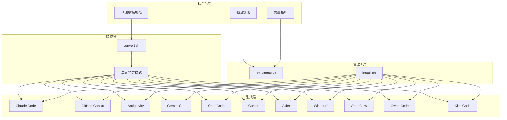
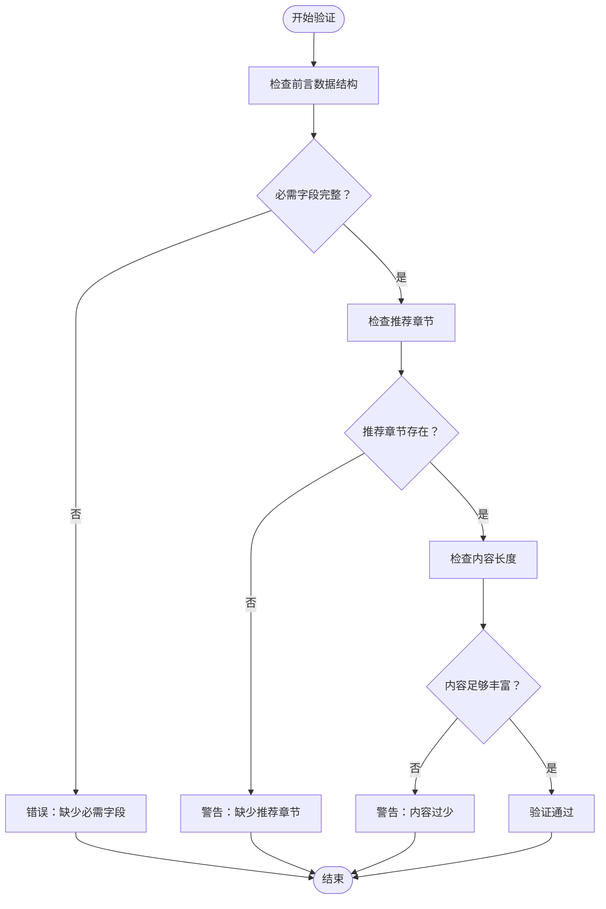
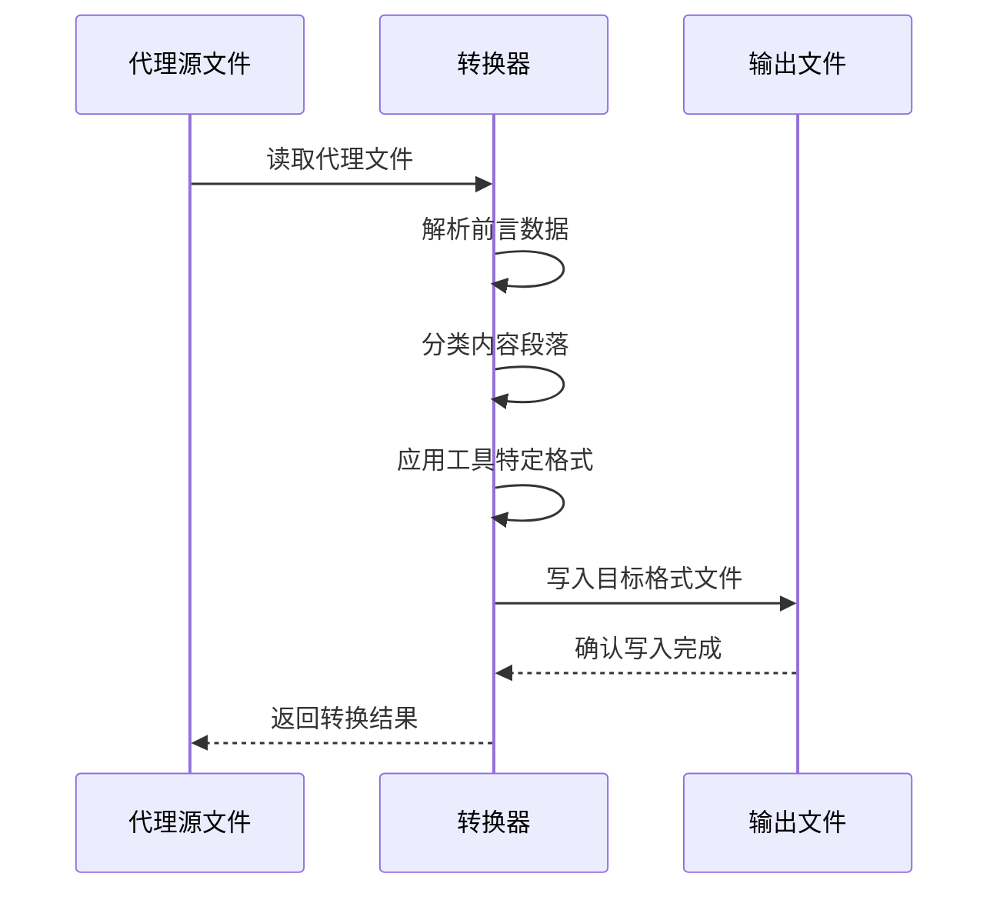
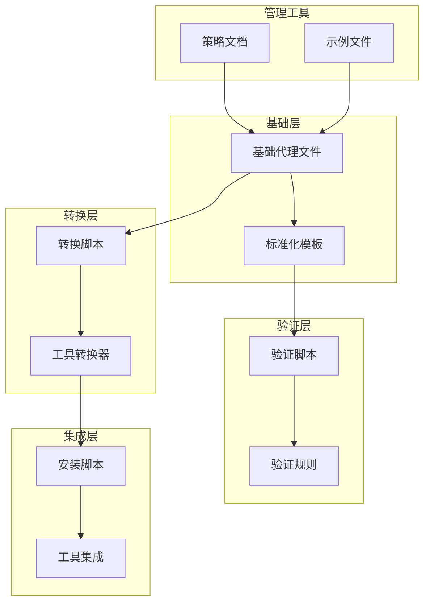

# 代理文件格式标准化系统

<cite>
**本文档引用的文件**
- [README.md](file://README.md)
- [CONTRIBUTING.md](file://CONTRIBUTING.md)
- [lint-agents.sh](file://scripts/lint-agents.sh)
- [convert.sh](file://scripts/convert.sh)
- [install.sh](file://scripts/install.sh)
- [integrations/README.md](file://integrations/README.md)
- [examples/README.md](file://examples/README.md)
- [strategy/QUICKSTART.md](file://strategy/QUICKSTART.md)
- [strategy/playbooks/phase-0-discovery.md](file://strategy/playbooks/phase-0-discovery.md)
- [engineering-frontend-developer.md](file://engineering/engineering-frontend-developer.md)
- [marketing-reddit-community-builder.md](file://marketing/marketing-reddit-community-builder.md)
- [design-whimsy-injector.md](file://design/design-whimsy-injector.md)
- [testing-evidence-collector.md](file://testing/testing-evidence-collector.md)
- [product-manager.md](file://product/product-manager.md)
</cite>

## 目录
1. [简介](#简介)
2. [项目结构](#项目结构)
3. [核心组件](#核心组件)
4. [架构概览](#架构概览)
5. [详细组件分析](#详细组件分析)
6. [依赖关系分析](#依赖关系分析)
7. [性能考虑](#性能考虑)
8. [故障排除指南](#故障排除指南)
9. [结论](#结论)
10. [附录](#附录)

## 简介

代理文件格式标准化系统是一个完整的AI代理规范化框架，旨在为多工具集成提供统一的代理文件格式标准。该系统通过定义严格的Markdown前言数据结构、代理身份声明、使命描述、规则约束和交付物规格等核心要素，确保代理文件在不同AI工具平台之间的一致性和互操作性。

系统的核心价值在于：
- **标准化格式**：统一的代理文件结构，确保跨平台兼容性
- **多工具集成**：支持Claude Code、GitHub Copilot、Antigravity、Gemini CLI等多种工具
- **质量保证**：内置验证机制，确保代理文件质量
- **可扩展性**：模块化的架构设计，便于添加新的工具支持

## 项目结构

该项目采用按功能域分组的目录结构，每个领域包含专门的代理文件：

```mermaid
graph TB
subgraph "核心目录结构"
Root[根目录]
Scripts[scripts/] - 转换和安装脚本
Examples[examples/] - 示例输出
Strategy[strategy/] - 策略和运行手册
Integrations[integrations/] - 工具集成文件
subgraph "代理分类目录"
Academic[academic/]
Design[design/]
Engineering[engineering/]
Marketing[marketing/]
PaidMedia[paid-media/]
Product[product/]
ProjectManagement[project-management/]
Testing[testing/]
Support[support/]
SpatialComputing[spatial-computing/]
Specialized[specialized/]
GameDevelopment[game-development/]
end
end
```

**图表来源**
- [README.md:68-350](file://README.md#L68-L350)

**章节来源**
- [README.md:1-886](file://README.md#L1-L886)
- [CONTRIBUTING.md:81-175](file://CONTRIBUTING.md#L81-L175)

## 核心组件

### 1. 标准化代理文件结构

每个代理文件都遵循统一的Markdown格式，包含以下核心部分：

#### 前言数据结构（Front Matter）
- **必需字段**：name、description、color
- **可选字段**：emoji、vibe、services
- **格式要求**：使用YAML格式，用三短横线分隔

#### 代理身份与记忆
- **角色定义**：明确的职责范围和专业领域
- **个性特征**：独特的沟通风格和行为模式
- **经验背景**：领域专业知识和实践经验
- **学习能力**：从交互中提取经验和改进模式

#### 核心使命
- **主要责任**：三个核心职责的具体描述
- **默认要求**：持续性的最佳实践标准
- **交付承诺**：可量化的成果标准

#### 关键规则
- **领域特定约束**：专业边界和限制条件
- **质量标准**：执行过程中的质量要求
- **合规要求**：法律和伦理规范

**章节来源**
- [CONTRIBUTING.md:87-151](file://CONTRIBUTING.md#L87-L151)
- [CONTRIBUTING.md:153-175](file://CONTRIBUTING.md#L153-L175)

### 2. 技术交付物规范

代理文件必须包含具体的可交付成果，包括：
- **代码示例**：实际可用的代码片段
- **模板框架**：可复用的项目模板
- **文档规范**：标准化的文档格式
- **测试用例**：验证交付质量的标准

### 3. 工作流程标准化

每个代理都定义了标准化的工作流程：
- **阶段划分**：清晰的任务分解和执行步骤
- **质量控制**：关键节点的质量检查点
- **迭代机制**：基于反馈的持续改进流程

**章节来源**
- [CONTRIBUTING.md:176-240](file://CONTRIBUTING.md#L176-L240)

## 架构概览

系统采用分层架构设计，确保代理文件格式的标准化和工具集成的灵活性：



**图表来源**
- [convert.sh:107-480](file://scripts/convert.sh#L107-L480)
- [install.sh:296-511](file://scripts/install.sh#L296-L511)

**章节来源**
- [integrations/README.md:1-209](file://integrations/README.md#L1-L209)

## 详细组件分析

### 1. 代理文件验证系统

系统内置了严格的验证机制，确保代理文件质量：



**图表来源**
- [lint-agents.sh:33-79](file://scripts/lint-agents.sh#L33-L79)

**章节来源**
- [lint-agents.sh:1-117](file://scripts/lint-agents.sh#L1-L117)

### 2. 多工具转换机制

系统通过智能转换脚本支持多种工具格式：

#### 转换器架构
- **Antigravity格式**：生成独立的SKILL.md文件
- **Gemini CLI格式**：创建扩展包和技能文件
- **OpenCode格式**：标准化颜色值和元数据
- **Cursor格式**：生成.md规则文件
- **OpenClaw格式**：拆分为SOUL.md、AGENTS.md、IDENTITY.md
- **其他格式**：Aider、Windsurf、Qwen、Kimi的特定格式

#### 转换流程


**图表来源**
- [convert.sh:480-517](file://scripts/convert.sh#L480-L517)

**章节来源**
- [convert.sh:107-480](file://scripts/convert.sh#L107-L480)

### 3. 实际代理文件示例分析

#### 工程师代理示例
前端开发工程师代理展示了完整的标准化格式：
- **身份声明**：明确的专业角色和技术专长
- **使命描述**：现代Web应用开发和性能优化
- **技术交付**：React组件示例和性能优化方案
- **工作流程**：从项目设置到性能优化的完整流程

#### 市场营销代理示例
Reddit社区建设者代理体现了创意专业的标准化：
- **社区策略**：基于价值驱动的内容创作
- **互动原则**：90/10规则和真实性要求
- **成功指标**：社区声望和参与度量化
- **高级能力**：AMA协调和危机管理

#### 设计代理示例
奇想注入器代理展现了创意设计的专业化：
- **个性框架**：品牌个性和愉悦体验设计
- **微交互系统**：动画效果和用户反馈机制
- **包容性设计**：无障碍访问和文化敏感性
- **游戏化元素**：成就系统和探索奖励

**章节来源**
- [engineering-frontend-developer.md:1-225](file://engineering/engineering-frontend-developer.md#L1-L225)
- [marketing-reddit-community-builder.md:1-123](file://marketing/marketing-reddit-community-builder.md#L1-L123)
- [design-whimsy-injector.md:1-438](file://design/design-whimsy-injector.md#L1-L438)

### 4. 质量保证体系

系统建立了多层次的质量保证机制：

#### 验证规则
- **必需字段检查**：确保name、description、color存在
- **章节完整性**：推荐的Identity、Core Mission、Critical Rules章节
- **内容质量**：最小字数要求和内容丰富度评估
- **格式正确性**：Markdown语法和结构验证

#### 质量指标
- **技术交付质量**：代码示例的实用性和完整性
- **工作流程合理性**：任务分解和执行逻辑的合理性
- **沟通风格一致性**：代理个性和表达方式的连贯性
- **成功指标可量化**：具体可测量的结果标准

**章节来源**
- [testing-evidence-collector.md:1-211](file://testing/testing-evidence-collector.md#L1-L211)

## 依赖关系分析

系统各组件之间的依赖关系呈现清晰的层次结构：



**图表来源**
- [convert.sh:520-636](file://scripts/convert.sh#L520-L636)
- [install.sh:515-637](file://scripts/install.sh#L515-L637)

**章节来源**
- [strategy/QUICKSTART.md:1-195](file://strategy/QUICKSTART.md#L1-L195)
- [strategy/playbooks/phase-0-discovery.md:1-179](file://strategy/playbooks/phase-0-discovery.md#L1-L179)

## 性能考虑

### 1. 转换性能优化

系统在转换过程中采用了多项性能优化措施：
- **并行处理**：支持多工具并行转换，提高处理效率
- **缓冲输出**：避免内存溢出，支持大规模文件处理
- **增量更新**：只处理变更的文件，减少重复工作
- **作业调度**：可配置的最大并行作业数，适应不同硬件环境

### 2. 验证性能优化

验证脚本针对大型仓库进行了性能优化：
- **快速失败**：发现错误立即停止，避免不必要的处理
- **智能扫描**：只扫描有效的代理文件，跳过文档文件
- **并行验证**：支持多文件并行验证，提高整体速度
- **缓存机制**：利用文件系统缓存，减少重复读取

### 3. 安装性能优化

安装脚本提供了灵活的安装选项：
- **选择性安装**：只安装需要的工具，减少安装时间
- **并行安装**：多工具同时安装，提高部署效率
- **增量安装**：检测现有安装状态，避免重复复制
- **错误恢复**：单个工具失败不影响整体安装进程

## 故障排除指南

### 1. 常见问题诊断

#### 验证失败
- **缺少必需字段**：检查代理文件的前言数据结构
- **章节缺失**：确认Identity、Core Mission、Critical Rules等章节
- **内容不足**：增加具体的代码示例和详细描述
- **格式错误**：检查Markdown语法和缩进格式

#### 转换错误
- **工具不支持**：确认目标工具是否在支持列表中
- **路径问题**：检查输出目录权限和磁盘空间
- **依赖缺失**：确保必要的转换依赖已安装
- **并发冲突**：避免同时运行多个转换进程

#### 安装问题
- **工具未检测到**：检查工具是否正确安装和配置
- **权限问题**：确认有写入目标目录的权限
- **路径配置**：验证工具的配置文件路径
- **版本兼容性**：检查工具版本与系统要求的兼容性

### 2. 解决方案

#### 验证问题解决
1. 使用验证脚本获取详细的错误信息
2. 按照错误提示修正代理文件格式
3. 重新运行验证脚本确认修复效果
4. 参考示例文件学习正确的格式

#### 转换问题解决
1. 检查转换脚本的参数和选项
2. 确认输入文件的格式正确性
3. 查看转换日志获取详细错误信息
4. 尝试单独转换有问题的文件进行调试

#### 安装问题解决
1. 运行工具检测函数确认安装状态
2. 手动创建必要的目录结构
3. 检查网络连接和代理配置
4. 参考工具的官方文档进行配置

**章节来源**
- [CONTRIBUTING.md:242-294](file://CONTRIBUTING.md#L242-L294)

## 结论

代理文件格式标准化系统通过建立统一的代理文件规范、完善的验证机制和灵活的多工具集成方案，为AI代理的标准化和规模化应用奠定了坚实基础。

### 主要成就

1. **标准化框架**：建立了完整的代理文件格式标准，涵盖所有核心要素
2. **质量保证**：内置验证机制，确保代理文件质量和一致性
3. **多工具支持**：支持11种主流AI工具平台，实现真正的跨平台兼容
4. **自动化流程**：提供完整的转换和安装自动化，降低使用门槛
5. **可扩展架构**：模块化设计，便于添加新的工具支持和功能扩展

### 未来发展方向

1. **格式演进**：根据使用反馈持续优化代理文件格式
2. **工具扩展**：增加更多AI工具的支持，扩大生态系统
3. **智能化增强**：引入AI辅助的代理文件生成和优化功能
4. **性能优化**：进一步提升转换和安装的性能表现
5. **社区协作**：建立更完善的社区贡献和审核机制

该系统不仅为当前的AI代理应用提供了标准化解决方案，更为未来的AI工具生态系统的健康发展奠定了重要基础。

## 附录

### 1. 代理文件格式规范

#### 必需字段
- **name**：代理名称，用于唯一标识
- **description**：简短描述，概述专业领域
- **color**：颜色标识，支持颜色名称或十六进制值

#### 可选字段
- **emoji**：表情符号，用于视觉识别
- **vibe**：个性描述，体现代理特色
- **services**：外部服务依赖，可选的API或平台

#### 标准化要求
- **前言格式**：使用YAML格式，三短横线分隔
- **标题层级**：使用H1作为代理名称，H2作为主要章节
- **内容结构**：严格遵循模板规定的章节顺序
- **语言风格**：保持专业、清晰、可执行的表达方式

### 2. 工具集成支持矩阵

| 工具名称 | 文件格式 | 安装位置 | 特殊要求 |
|---------|---------|---------|---------|
| Claude Code | .md | ~/.claude/agents/ | 原生支持，无需转换 |
| GitHub Copilot | .md | ~/.github/agents/ | 原生支持，无需转换 |
| Antigravity | SKILL.md | ~/.gemini/antigravity/skills/ | 每个代理一个技能文件 |
| Gemini CLI | 扩展包 | ~/.gemini/extensions/ | 需要生成扩展清单 |
| OpenCode | .md | .opencode/agents/ | 项目级安装 |
| Cursor | .mdc | .cursor/rules/ | 项目级安装 |
| Aider | CONVENTIONS.md | 项目根目录 | 单文件集成 |
| Windsurf | .windsurfrules | 项目根目录 | 单文件集成 |
| OpenClaw | SOUL.md/AGENTS.md/IDENTITY.md | ~/.openclaw/ | 工作空间格式 |
| Qwen Code | .md | ~/.qwen/agents/ | 子代理格式 |
| Kimi Code | YAML + system.md | ~/.config/kimi/agents/ | YAML配置 |

### 3. 最佳实践建议

#### 创建高质量代理文件
1. **明确专业定位**：专注于特定领域，避免过于宽泛
2. **量化成功指标**：提供具体的可测量结果标准
3. **提供实际示例**：包含可运行的代码和模板
4. **保持一致性**：遵循统一的格式和风格
5. **定期更新维护**：根据使用反馈持续改进

#### 团队协作建议
1. **模板共享**：使用标准化模板确保一致性
2. **同行评审**：建立代理文件的评审机制
3. **知识传承**：记录设计决策和最佳实践
4. **持续改进**：基于使用数据优化代理性能
5. **社区贡献**：积极分享优秀的代理设计模式