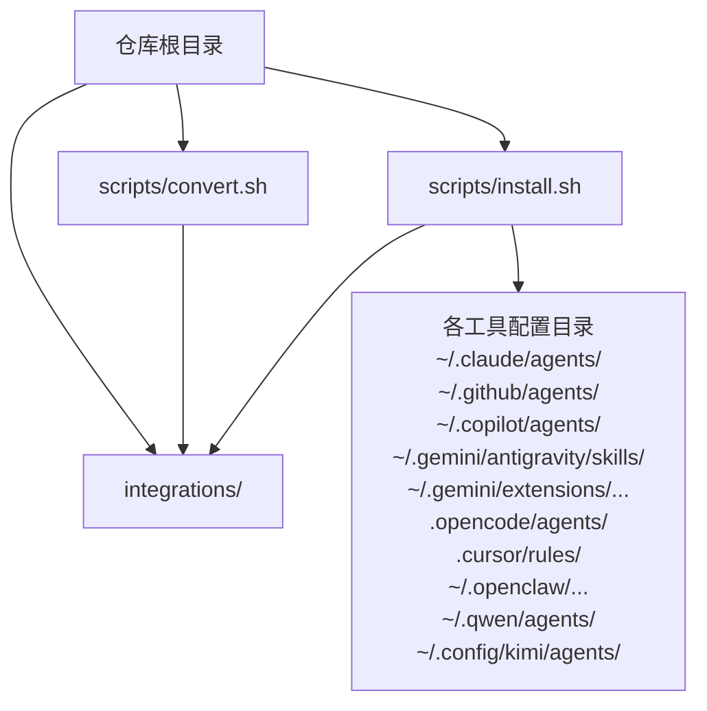
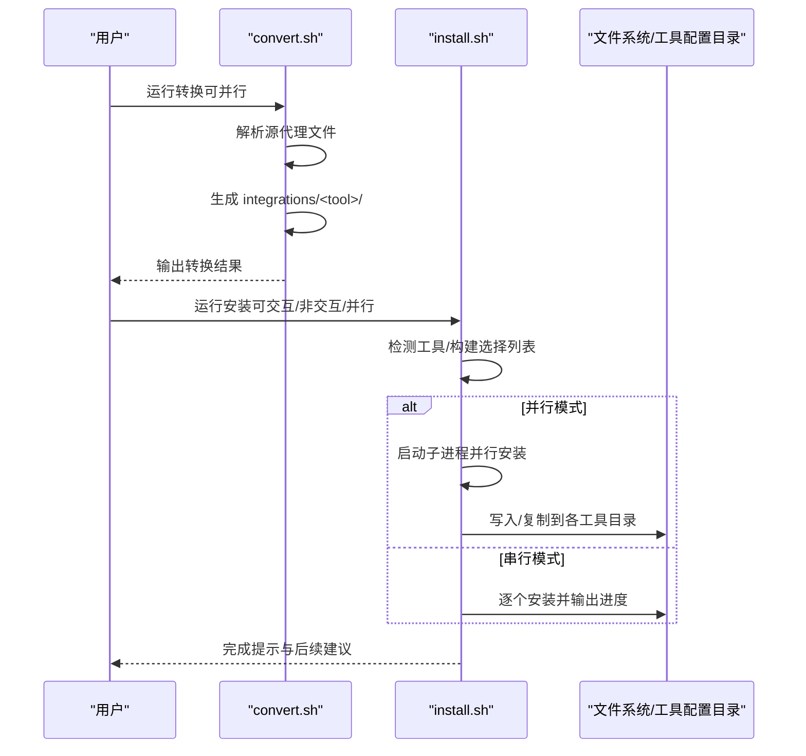
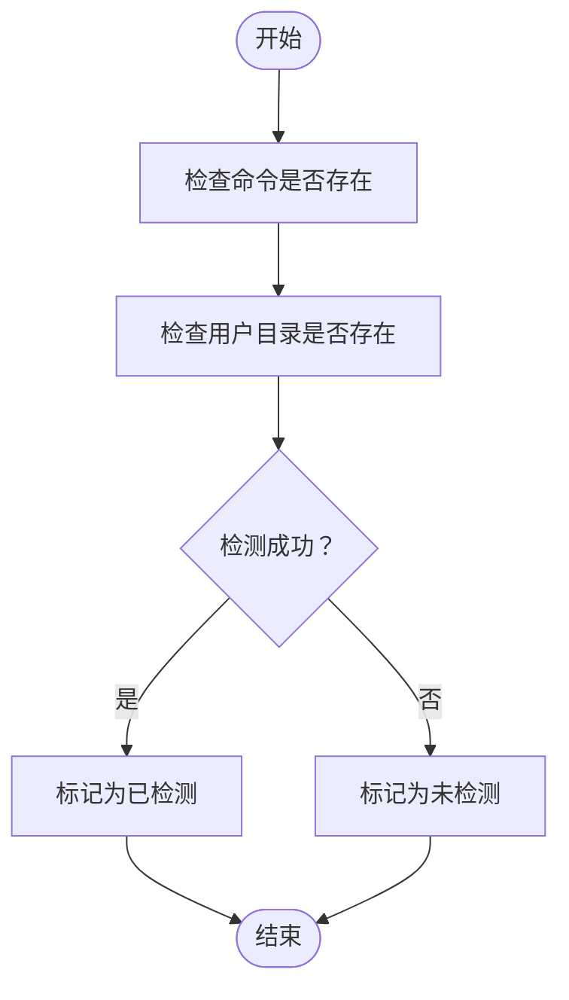
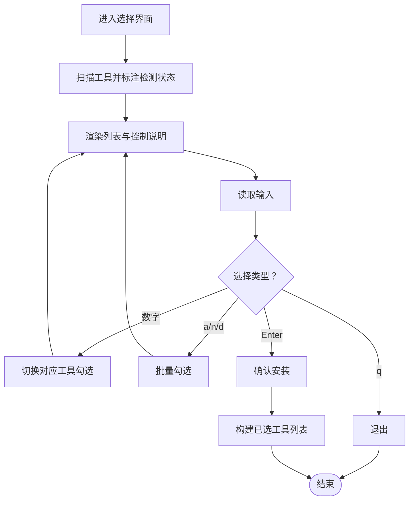
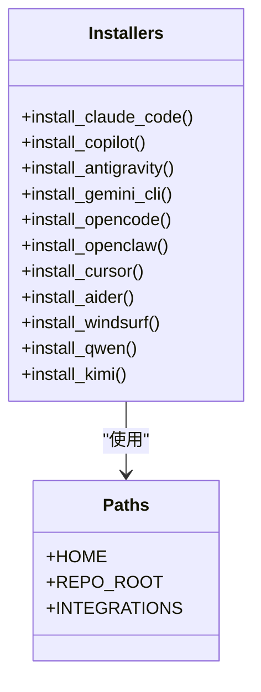
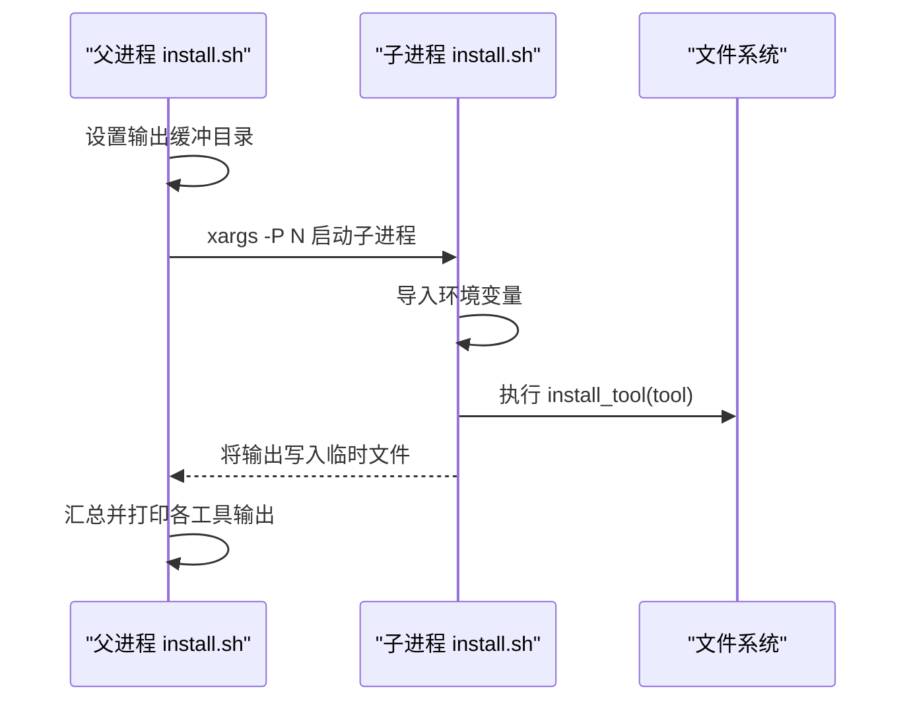
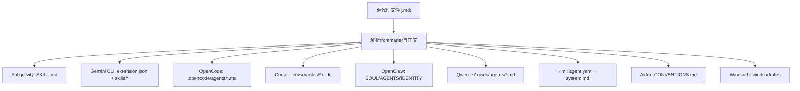
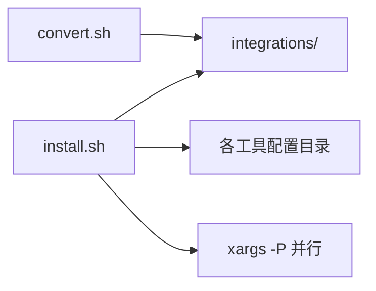

# 安装系统

<cite>
**本文引用的文件**
- [install.sh](file://scripts/install.sh)
- [convert.sh](file://scripts/convert.sh)
- [README.md](file://README.md)
- [integrations/README.md](file://integrations/README.md)
- [integrations/claude-code/README.md](file://integrations/claude-code/README.md)
- [integrations/github-copilot/README.md](file://integrations/github-copilot/README.md)
- [integrations/antigravity/README.md](file://integrations/antigravity/README.md)
- [integrations/mcp-memory/setup.sh](file://integrations/mcp-memory/setup.sh)
</cite>

## 目录
1. [简介](#简介)
2. [项目结构](#项目结构)
3. [核心组件](#核心组件)
4. [架构总览](#架构总览)
5. [详细组件分析](#详细组件分析)
6. [依赖关系分析](#依赖关系分析)
7. [性能考量](#性能考量)
8. [故障排除指南](#故障排除指南)
9. [结论](#结论)
10. [附录](#附录)

## 简介
本文件面向安装系统的技术文档，聚焦于自动检测与配置多个AI工具环境的完整流程，涵盖：
- 工具检测机制（如 detect_claude_code、detect_copilot 等）
- 交互式选择界面
- 并行安装优化
- 错误处理与回滚机制
- 安装脚本架构设计、工具特定安装器实现、目标路径管理与权限处理
- 安装过程日志分析、性能优化技巧与故障排除
- 并行处理对安装效率的提升及跨平台兼容性（Linux、macOS、Windows Git Bash/WSL）

## 项目结构
安装系统由两套脚本协同工作：
- 转换脚本：将源代理文件转换为各工具所需的格式，并生成集成产物目录 integrations/
- 安装脚本：扫描已安装工具或交互选择，按工具复制/写入到对应配置目录

图表来源
- [install.sh:100-102](file://scripts/install.sh#L100-L102)
- [convert.sh:59-62](file://scripts/convert.sh#L59-L62)

章节来源
- [install.sh:100-102](file://scripts/install.sh#L100-L102)
- [convert.sh:59-62](file://scripts/convert.sh#L59-L62)

## 核心组件
- 工具检测模块：基于命令存在性与用户目录存在性判断工具是否已安装
- 交互选择器：在终端中提供勾选界面，支持全选/全不选/仅检测到的切换
- 安装器集合：针对每个工具的安装逻辑（复制/写入/注册）
- 并行执行器：使用 xargs -P 在多核环境下并行安装
- 日志与进度：ANSI 彩色输出、进度条、盒子框样式输出

章节来源
- [install.sh:135-162](file://scripts/install.sh#L135-L162)
- [install.sh:184-293](file://scripts/install.sh#L184-L293)
- [install.sh:299-494](file://scripts/install.sh#L299-L494)
- [install.sh:606-626](file://scripts/install.sh#L606-L626)

## 架构总览
整体流程分为“转换”和“安装”两个阶段，二者均支持并行以提升吞吐。

图表来源
- [convert.sh:521-636](file://scripts/convert.sh#L521-L636)
- [install.sh:515-637](file://scripts/install.sh#L515-L637)

## 详细组件分析

### 工具检测机制
- 基于命令存在性与用户目录存在性进行检测，避免误判
- 支持的工具：claude-code、copilot、antigravity、gemini-cli、opencode、cursor、aider、openclaw、windsurf、qwen、kimi
- 检测函数统一入口 is_detected，便于扩展新工具

图表来源
- [install.sh:135-162](file://scripts/install.sh#L135-L162)

章节来源
- [install.sh:135-162](file://scripts/install.sh#L135-L162)

### 交互式选择界面
- 终端ASCII盒装UI，显示工具列表与检测状态
- 支持按键切换：数字键选择、a/n/d 全选/全不选/仅检测到的、回车安装、q 退出
- 自动清屏重绘，保证界面整洁

图表来源
- [install.sh:184-293](file://scripts/install.sh#L184-L293)

章节来源
- [install.sh:184-293](file://scripts/install.sh#L184-L293)

### 安装器集合与目标路径管理
- Claude Code/Copilot：直接复制 .md 文件至各自 agents 目录
- Antigravity：将技能文件写入 ~/.gemini/antigravity/skills/<slug>/SKILL.md
- Gemini CLI：写入扩展清单与技能目录至 ~/.gemini/extensions/agency-agents/
- OpenCode/Cursor/Aider/Windsurf/Qwen/Kimi：按工具要求写入单文件或多文件，部分为项目级目录
- OpenClaw：写入 SOUL.md/AGENTS.md/IDENTITY.md，并尝试调用 openclaw 注册工作区

图表来源
- [install.sh:299-494](file://scripts/install.sh#L299-L494)
- [install.sh:100-102](file://scripts/install.sh#L100-L102)

章节来源
- [install.sh:299-494](file://scripts/install.sh#L299-L494)

### 并行安装优化
- 使用 xargs -P 并发启动子进程，每工具独立运行 install.sh 子实例
- 通过环境变量传递脚本路径与输出目录，避免重复输出与竞态
- 默认并发数来自 nproc/sysctl，可由 --jobs 覆盖

图表来源
- [install.sh:606-626](file://scripts/install.sh#L606-L626)

章节来源
- [install.sh:606-626](file://scripts/install.sh#L606-L626)

### 错误处理与回滚机制
- 预检：若 integrations 缺失，提示先运行 convert.sh
- 工具校验：--tool 参数必须在支持列表内
- 交互/非交互：根据终端能力与参数自动决定
- 子进程：AGENCY_INSTALL_WORKER=1 的子进程仅执行安装逻辑，避免重复头部与尾部输出
- 无选择：当未检测到且未显式指定工具时给出提示并优雅退出
- 项目级工具：安装前提示需在项目根目录运行（如 OpenCode、Cursor、Aider、Windsurf、Qwen、Kimi）

章节来源
- [install.sh:125-130](file://scripts/install.sh#L125-L130)
- [install.sh:536-544](file://scripts/install.sh#L536-L544)
- [install.sh:577-583](file://scripts/install.sh#L577-L583)
- [install.sh:587-593](file://scripts/install.sh#L587-L593)

### 转换脚本与工具特定格式
- Antigravity：生成 SKILL.md，带固定 frontmatter 字段
- Gemini CLI：生成 gemini-extension.json 与 skills/<slug>/SKILL.md
- OpenCode：生成 .opencode/agents/<slug>.md
- Cursor：生成 .cursor/rules/<slug>.mdc
- OpenClaw：拆分 SOUL.md/AGENTS.md/IDENTITY.md
- Qwen：生成 ~/.qwen/agents/<slug>.md
- Kimi：生成 agent.yaml 与 system.md
- Aider/Windsurf：累积为单文件，最后一次性写出

图表来源
- [convert.sh:109-408](file://scripts/convert.sh#L109-L408)

章节来源
- [convert.sh:109-408](file://scripts/convert.sh#L109-L408)

### 目标路径管理与权限处理
- 用户级路径：~/.claude/agents、~/.github/agents、~/.copilot/agents、~/.gemini/antigravity/skills、~/.gemini/extensions/...、~/.openclaw/...、~/.qwen/agents、~/.config/kimi/agents
- 项目级路径：.opencode/agents、.cursor/rules、当前目录下的 CONVENTIONS.md、.windsurfrules
- 权限：默认使用 cp/mkdir 创建；如需特殊权限，请在宿主环境中确保用户对目标目录有写权限
- 注意：项目级工具需在项目根目录运行，否则会写入当前工作目录

章节来源
- [install.sh:300-336](file://scripts/install.sh#L300-L336)
- [install.sh:339-472](file://scripts/install.sh#L339-L472)
- [install.sh:474-494](file://scripts/install.sh#L474-L494)

### 安装过程日志分析
- 彩色输出：OK/警告/错误分别使用不同颜色
- 进度条：tqdm 风格，显示当前/总数
- 盒装输出：统一的标题与完成提示框
- 并行输出：子进程输出写入临时文件后汇总打印，避免交错

章节来源
- [install.sh:53-57](file://scripts/install.sh#L53-L57)
- [install.sh:60-71](file://scripts/install.sh#L60-L71)
- [install.sh:80-95](file://scripts/install.sh#L80-L95)
- [install.sh:611-616](file://scripts/install.sh#L611-L616)

### 跨平台兼容性
- 支持：Linux、macOS（需要 bash 3.2+）、Windows Git Bash/WSL
- 并发默认值：nproc（Linux）或 sysctl -n hw.ncpu（macOS），否则默认 4
- 终端检测：-t 0/-t 1 判断是否在交互终端运行

章节来源
- [install.sh:33-34](file://scripts/install.sh#L33-L34)
- [install.sh:115-120](file://scripts/install.sh#L115-L120)
- [convert.sh:76-81](file://scripts/convert.sh#L76-L81)

## 依赖关系分析
- install.sh 依赖 convert.sh 生成的 integrations/<tool> 目录
- 各工具安装器依赖对应工具的配置目录存在性（部分工具通过命令存在性检测）
- 并行执行依赖 xargs 与 shell 环境（Linux/macOS/WSL）

图表来源
- [install.sh:100-102](file://scripts/install.sh#L100-L102)
- [convert.sh:59-62](file://scripts/convert.sh#L59-L62)
- [install.sh:606-611](file://scripts/install.sh#L606-L611)

章节来源
- [install.sh:100-102](file://scripts/install.sh#L100-L102)
- [convert.sh:59-62](file://scripts/convert.sh#L59-L62)
- [install.sh:606-611](file://scripts/install.sh#L606-L611)

## 性能考量
- 并行策略
  - convert.sh：对独立工具（antigravity/gemini-cli/opencode/cursor/openclaw/qwen）并行转换，其余工具串行累积输出
  - install.sh：对选定工具并行安装，输出按工具缓冲后汇总
- 并发度
  - 默认 nproc 或 sysctl -n hw.ncpu，可由 --jobs 调整
- I/O 优化
  - 使用 find -print0 与 while IFS= read -r -d '' 处理包含空格的文件名
  - 使用 xargs -I {} 与临时目录减少输出交错
- CPU/IO 负载
  - 并行适合多核机器；在 CI 环境中建议固定 --jobs 以稳定吞吐

章节来源
- [convert.sh:566-590](file://scripts/convert.sh#L566-L590)
- [install.sh:606-626](file://scripts/install.sh#L606-L626)
- [install.sh:115-120](file://scripts/install.sh#L115-L120)
- [convert.sh:76-81](file://scripts/convert.sh#L76-L81)

## 故障排除指南
- integrations 缺失
  - 现象：安装时报错提示需要先运行 convert.sh
  - 处理：先执行 convert.sh，再运行 install.sh
  - 参考：预检函数与错误输出
- 未知工具
  - 现象：--tool 指定的工具不在支持列表
  - 处理：使用支持的工具名称或 --tool all
- 无工具可安装
  - 现象：未检测到任何工具且未显式指定
  - 处理：使用 --tool <name> 强制安装，或在支持的工具上安装后再试
- 项目级工具路径错误
  - 现象：OpenCode/Cursor/Aider/Windsurf/Qwen/Kimi 安装到错误目录
  - 处理：在项目根目录运行安装脚本
- 并行输出交错
  - 现象：并行安装时输出混杂
  - 处理：使用 --jobs 控制并发度；或关闭并行
- OpenClaw 注册失败
  - 现象：安装后无法立即使用 agentId
  - 处理：手动运行 openclaw agents add 或重启网关

章节来源
- [install.sh:125-130](file://scripts/install.sh#L125-L130)
- [install.sh:536-544](file://scripts/install.sh#L536-L544)
- [install.sh:577-583](file://scripts/install.sh#L577-L583)
- [install.sh:403-405](file://scripts/install.sh#L403-L405)

## 结论
该安装系统通过“转换—安装”的双阶段设计，结合工具检测、交互选择、并行执行与完善的日志输出，实现了对多AI工具环境的自动化配置。其架构清晰、扩展性强，既适用于本地开发也适用于 CI 环境。通过合理设置并发度与遵循项目级工具的路径约定，可在保证正确性的前提下显著提升安装效率。

## 附录
- 快速安装与并行优化参考
  - 转换：./scripts/convert.sh 或 ./scripts/convert.sh --parallel
  - 安装：./scripts/install.sh 或 ./scripts/install.sh --no-interactive --parallel
  - 并行作业数：--jobs N
- 工具特定说明
  - Claude Code/GitHub Copilot：无需转换，直接复制 .md
  - Antigravity：生成 SKILL.md 并安装到 ~/.gemini/antigravity/skills/
  - Gemini CLI：需先 convert 生成 extension 清单与技能目录
  - OpenCode/Cursor/Aider/Windsurf/Qwen/Kimi：项目级工具，需在项目根目录运行
- MCP 内存集成（可选）
  - 需要 MCP 兼容内存服务器，安装后按提示添加到 MCP 客户端配置

章节来源
- [README.md:528-590](file://README.md#L528-L590)
- [integrations/README.md:19-47](file://integrations/README.md#L19-L47)
- [integrations/claude-code/README.md:1-32](file://integrations/claude-code/README.md#L1-L32)
- [integrations/github-copilot/README.md:1-33](file://integrations/github-copilot/README.md#L1-L33)
- [integrations/antigravity/README.md:1-50](file://integrations/antigravity/README.md#L1-L50)
- [integrations/mcp-memory/setup.sh:1-75](file://integrations/mcp-memory/setup.sh#L1-L75)