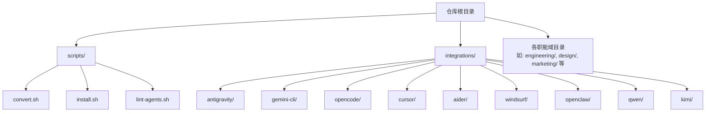
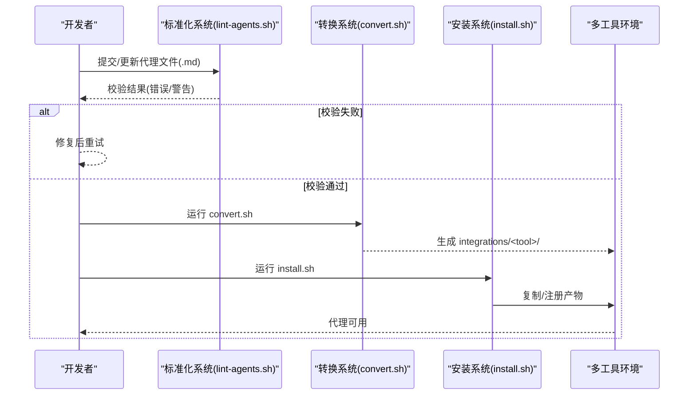
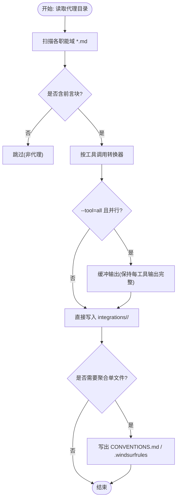
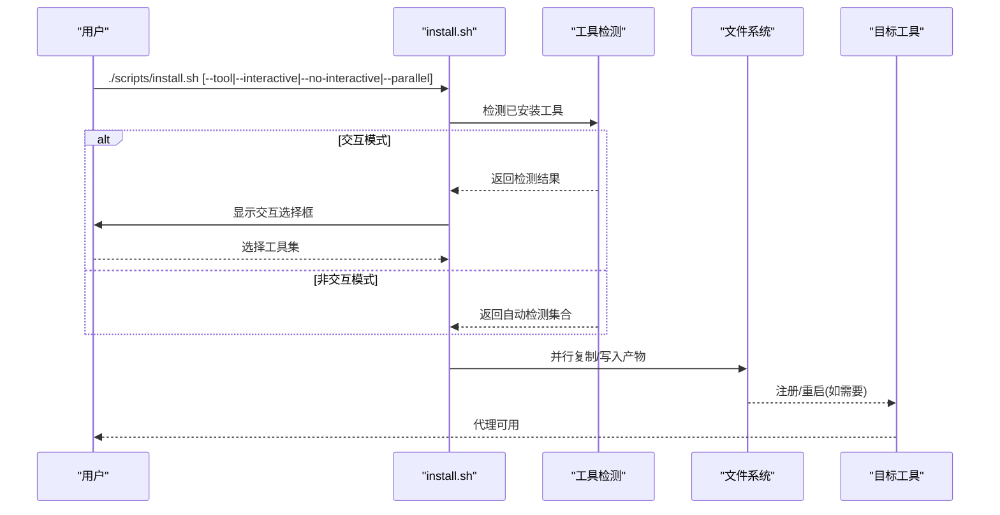

# 核心组件

<cite>
**本文引用的文件**
- [README.md](file://README.md)
- [convert.sh](file://scripts/convert.sh)
- [install.sh](file://scripts/install.sh)
- [lint-agents.sh](file://scripts/lint-agents.sh)
- [integrations/README.md](file://integrations/README.md)
- [integrations/antigravity/README.md](file://integrations/antigravity/README.md)
- [integrations/gemini-cli/README.md](file://integrations/gemini-cli/README.md)
- [engineering-frontend-developer.md](file://engineering/engineering-frontend-developer.md)
- [engineering-backend-architect.md](file://engineering/engineering-backend-architect.md)
- [design-ui-designer.md](file://design/design-ui-designer.md)
- [marketing-content-creator.md](file://marketing/marketing-content-creator.md)
</cite>

## 目录
1. [简介](#简介)
2. [项目结构](#项目结构)
3. [核心组件](#核心组件)
4. [架构总览](#架构总览)
5. [详细组件分析](#详细组件分析)
6. [依赖分析](#依赖分析)
7. [性能考虑](#性能考虑)
8. [故障排查指南](#故障排查指南)
9. [结论](#结论)
10. [附录](#附录)

## 简介
本文件聚焦 agency-agents 项目的三大核心组件：代理文件格式标准化系统、转换系统与安装系统。它们共同确保：
- 代理文件具备统一的“标准格式”（标准化系统）
- 将标准化代理转换为多工具所需的具体格式（转换系统）
- 自动检测并配置多种 AI 工具环境（安装系统）

通过这些组件，The Agency 的代理可在 Claude Code、GitHub Copilot、Antigravity、Gemini CLI、OpenCode、Cursor、Aider、Windsurf、OpenClaw、Qwen Code、Kimi Code 等工具中无缝复用。

## 项目结构
仓库采用“按职能划分”的目录组织方式，代理文件分布在多个职能域下（如 engineering、design、marketing 等），并通过脚本进行批量转换与安装。

图表来源
- [README.md](file://README.md)
- [integrations/README.md](file://integrations/README.md)

章节来源
- [README.md](file://README.md)
- [integrations/README.md](file://integrations/README.md)

## 核心组件
本节从“职责、输入输出、错误处理、协作关系与数据流”五个维度，系统阐述三大组件。

- 代理文件格式标准化系统
  - 职责：定义并维护代理文件的“标准格式”，包括必需的 YAML 前言字段、推荐章节、内容长度等，保证所有代理具备一致的元信息与结构。
  - 输入：各职能域下的 .md 代理文件（包含 YAML 前言块）。
  - 输出：标准化校验报告（错误/警告计数）。
  - 错误处理：缺失前言、字段不全、内容过短等触发错误或警告；失败时阻止合并。
  - 协作关系：为转换系统提供“可预期输入”，为安装系统提供“可验证质量”。

- 转换系统
  - 职责：将标准化代理转换为各工具所需的特定格式，并生成工具所需的清单/目录结构。
  - 输入：标准化的 .md 代理文件。
  - 输出：针对每种工具的集成产物（如 SKILL.md、.mdc 规则、YAML 规范等），写入 integrations/<tool>/。
  - 错误处理：对未知工具、并行作业参数非法等情况给出明确错误提示；对单文件聚合器（Aider、Windsurf）在缺少源文件时给出指引。
  - 协作关系：为安装系统提供“可安装产物”。

- 安装系统
  - 职责：自动检测本地已安装工具，交互式或非交互式选择目标工具，将转换产物复制到对应工具的配置/工作区路径。
  - 输入：integrations/<tool>/ 下的转换产物；工具检测结果。
  - 输出：将文件写入目标路径（用户范围或项目范围），并在必要时调用工具注册命令。
  - 错误处理：未找到 integrations/ 或转换产物缺失时提示先运行 convert.sh；未检测到工具且未指定 --tool 时提示无可用目标。
  - 协作关系：消费转换系统产物，完成最终落地。

章节来源
- [lint-agents.sh](file://scripts/lint-agents.sh)
- [convert.sh](file://scripts/convert.sh)
- [install.sh](file://scripts/install.sh)

## 架构总览
下图展示了三者之间的端到端流程：标准化 → 转换 → 安装 → 工具就绪。

图表来源
- [lint-agents.sh](file://scripts/lint-agents.sh)
- [convert.sh](file://scripts/convert.sh)
- [install.sh](file://scripts/install.sh)

## 详细组件分析

### 代理文件格式标准化系统
- 设计要点
  - 必需前言字段：name、description、color（缺失即报错）。
  - 推荐章节：Identity、Core Mission、Critical Rules（缺失仅警告）。
  - 内容长度：正文词数阈值检查，过短提示优化。
  - 前言解析：使用正则匹配 YAML 前言块，避免误判非代理文档。
- 数据结构与复杂度
  - 文件扫描：线性遍历各职能域目录，时间复杂度 O(N_agent)。
  - 前言提取：逐文件读取至第二段分隔符，时间复杂度 O(L_agent)。
  - 校验：固定字段/章节/字数检查，均为 O(1) 额外开销。
- 错误处理
  - 缺失前言开头：直接报错。
  - 字段缺失：逐项统计错误数。
  - 推荐章节缺失：统计警告数。
  - 正文过短：统计警告数。
- 使用场景
  - 团队协作：在 PR 合并前统一代理格式，减少下游转换/安装失败。
  - 模板驱动：新代理只需补齐前言字段与推荐章节即可快速通过校验。

章节来源
- [lint-agents.sh](file://scripts/lint-agents.sh)
- [README.md](file://README.md)

### 转换系统
- 设计要点
  - 统一入口：convert.sh 支持 --tool、--parallel、--jobs 等参数。
  - 工具适配：为每种工具定义专属转换函数，生成符合其规范的文件/目录结构。
  - 并行加速：当 --tool=all 时，部分工具（antigravity、gemini-cli、opencode、cursor、openclaw、qwen）并行执行，其余串行。
  - 单文件聚合：Aider、Windsurf 通过临时文件累积后一次性写出。
- 关键转换器
  - Antigravity：将每个代理写入 SKILL.md，前言包含 name、description、risk、source、date_added。
  - Gemini CLI：生成扩展清单 gemini-extension.json 与 skills/<slug>/SKILL.md。
  - OpenCode：将代理写入 .opencode/agents/<slug>.md，颜色映射为合法十六进制。
  - Cursor：生成 .cursor/rules/<slug>.mdc，包含 description、globs、alwaysApply。
  - OpenClaw：拆分为 SOUL.md（身份/记忆/沟通/风格/规则）、AGENTS.md（使命/交付物/流程）、IDENTITY.md（表情/名称/气质）。
  - Qwen Code：生成 ~/.qwen/agents/<slug>.md，保留 tools（若存在）。
  - Kimi Code：生成 ~/.config/kimi/agents/<slug>/agent.yaml 与 system.md。
  - Aider/Windsurf：生成单一文件（CONVENTIONS.md 或 .windsurfrules），便于工具自动读取。
- 错误处理
  - 未知工具：报错并列出支持列表。
  - 并行作业：限制最大并发数，避免资源争用。
  - 单文件聚合：在 --tool=all 时最后写出，避免重复写入。
- 使用场景
  - 新增/修改代理后一键生成所有工具的集成文件。
  - 与 CI 结合：在流水线中并行转换以缩短构建时间。

图表来源
- [convert.sh](file://scripts/convert.sh)

章节来源
- [convert.sh](file://scripts/convert.sh)
- [integrations/antigravity/README.md](file://integrations/antigravity/README.md)
- [integrations/gemini-cli/README.md](file://integrations/gemini-cli/README.md)

### 安装系统
- 设计要点
  - 工具检测：基于 HOME/PATH/配置目录判断工具是否存在。
  - 交互式选择：在终端中显示勾选项，支持全选/全不选/仅检测到的快捷键。
  - 并行安装：对选定工具并行执行安装，避免重复输出。
  - 目标路径：区分用户范围（~/.xxx）与项目范围（当前目录下 .xxx）。
  - 注册/重启：对 OpenClaw 调用注册命令；提示用户重启网关以生效。
- 关键安装器
  - Claude Code/Copilot：直接复制 .md 到各自 agents 目录。
  - Antigravity：复制 skills/<slug>/SKILL.md。
  - Gemini CLI：复制扩展清单与 skills/<slug>/SKILL.md。
  - OpenCode/Cursor/Aider/Windsurf/Qwen Code/Kimi Code：复制到项目或用户范围目录。
  - OpenClaw：复制 SOUL/AGENTS/IDENTITY，并尝试注册。
- 错误处理
  - 未发现 integrations/：提示先运行 convert.sh。
  - 产物缺失：提示先运行 convert.sh 对应工具。
  - 无工具可选：提示使用 --tool 强制安装。
- 使用场景
  - 一键安装到多工具：自动检测并安装到已安装的工具。
  - CI/CD：非交互模式批量安装，结合 --jobs 控制并行度。

图表来源
- [install.sh](file://scripts/install.sh)

章节来源
- [install.sh](file://scripts/install.sh)
- [integrations/README.md](file://integrations/README.md)

## 依赖分析
- 组件耦合
  - 安装系统依赖转换系统生成的 integrations/<tool>/ 目录。
  - 转换系统依赖标准化系统产出的“合格代理文件”。
  - 三者均依赖 Bash 环境与外部工具（如 git、find、xargs、command -v）。
- 外部依赖
  - 各工具的可执行程序或配置目录（如 ~/.gemini、~/.qwen、~/.config/kimi 等）。
- 潜在循环依赖
  - 无直接循环；install.sh 在 convert.sh 之后运行，形成“先转换再安装”的顺序约束。

图表来源
- [lint-agents.sh](file://scripts/lint-agents.sh)
- [convert.sh](file://scripts/convert.sh)
- [install.sh](file://scripts/install.sh)

章节来源
- [lint-agents.sh](file://scripts/lint-agents.sh)
- [convert.sh](file://scripts/convert.sh)
- [install.sh](file://scripts/install.sh)

## 性能考虑
- 并行策略
  - convert.sh：当 --tool=all 时，对独立工具（antigravity、gemini-cli、opencode、cursor、openclaw、qwen）并行执行，显著缩短转换时间。
  - install.sh：对选定工具并行安装，避免串行瓶颈。
- I/O 优化
  - 批量 find + null 分隔 + xargs -0 减少子进程开销。
  - 单文件聚合器（Aider、Windsurf）使用临时文件，减少多次写入。
- 资源控制
  - 默认并发数根据平台探测 nproc/sysctl，可通过 --jobs 覆盖，避免过度占用 CPU。

## 故障排查指南
- “integrations/ 不存在”
  - 现象：install.sh 报错并退出。
  - 处理：先运行 convert.sh 生成 integrations/。
  - 参考
    - [install.sh](file://scripts/install.sh)
- “某工具产物缺失”
  - 现象：install.sh 提示某工具的产物不存在。
  - 处理：先运行 convert.sh --tool <tool> 生成对应产物。
  - 参考
    - [install.sh](file://scripts/install.sh)
- “标准化校验失败”
  - 现象：lint-agents.sh 报错并退出。
  - 处理：补齐前言字段（name/description/color），完善推荐章节，增加正文内容。
  - 参考
    - [lint-agents.sh](file://scripts/lint-agents.sh)
- “并行安装/转换输出乱序”
  - 现象：并行模式下输出顺序可能与工具/安装顺序不一致。
  - 处理：接受缓冲输出的特性；如需严格顺序，取消 --parallel。
  - 参考
    - [convert.sh](file://scripts/convert.sh)
    - [install.sh](file://scripts/install.sh)

章节来源
- [install.sh](file://scripts/install.sh)
- [lint-agents.sh](file://scripts/lint-agents.sh)
- [convert.sh](file://scripts/convert.sh)

## 结论
- 代理文件格式标准化系统提供了统一的“输入规范”，确保上游转换与下游安装的稳定性。
- 转换系统将标准化代理映射为多工具的“可安装产物”，覆盖主流 agentic 编码工具生态。
- 安装系统实现了“自动检测 + 交互/非交互 + 并行安装”的一体化体验，降低用户心智负担。
- 三者协同构成“标准化 → 转换 → 安装”的闭环，支撑 The Agency 在多工具环境中的规模化复用。

## 附录

### 代理文件格式规范（标准化系统）
- 必需字段
  - name：代理名称（用于 slug 化与展示）
  - description：简要描述
  - color：颜色标识（OpenCode 需映射为合法十六进制）
- 推荐章节
  - Identity、Core Mission、Critical Rules
- 其他要求
  - 正文建议至少 50 词以上，确保可操作性与可读性

章节来源
- [lint-agents.sh](file://scripts/lint-agents.sh)
- [marketing-content-creator.md](file://marketing/marketing-content-creator.md)

### 转换系统支持的工具与产物
- Antigravity：integrations/antigravity/<slug>/SKILL.md
- Gemini CLI：integrations/gemini-cli/gemini-extension.json + skills/<slug>/SKILL.md
- OpenCode：integrations/opencode/agents/<slug>.md
- Cursor：integrations/cursor/rules/<slug>.mdc
- OpenClaw：integrations/openclaw/<slug>/SOUL.md、AGENTS.md、IDENTITY.md
- Qwen Code：integrations/qwen/agents/<slug>.md
- Kimi Code：integrations/kimi/<slug>/agent.yaml、system.md
- Aider：integrations/aider/CONVENTIONS.md
- Windsurf：integrations/windsurf/.windsurfrules

章节来源
- [convert.sh](file://scripts/convert.sh)
- [integrations/antigravity/README.md](file://integrations/antigravity/README.md)
- [integrations/gemini-cli/README.md](file://integrations/gemini-cli/README.md)

### 安装系统支持的工具与目标路径
- Claude Code：~/.claude/agents/
- GitHub Copilot：~/.github/agents/ 与 ~/.copilot/agents/
- Antigravity：~/.gemini/antigravity/skills/
- Gemini CLI：~/.gemini/extensions/agency-agents/
- OpenCode：项目根目录 .opencode/agents/
- Cursor：项目根目录 .cursor/rules/
- Aider：项目根目录 CONVENTIONS.md
- Windsurf：项目根目录 .windsurfrules
- OpenClaw：~/.openclaw/agency-agents/（并尝试注册）
- Qwen Code：项目根目录 .qwen/agents/（或用户范围 ~/.qwen/agents/）
- Kimi Code：~/.config/kimi/agents/

章节来源
- [install.sh](file://scripts/install.sh)
- [integrations/README.md](file://integrations/README.md)

### 示例代理文件（参考结构）
- 前端开发工程师（工程域）
  - 参考路径：[engineering-frontend-developer.md](file://engineering/engineering-frontend-developer.md)
- 后端架构师（工程域）
  - 参考路径：[engineering-backend-architect.md](file://engineering/engineering-backend-architect.md)
- UI 设计师（设计域）
  - 参考路径：[design-ui-designer.md](file://design/design-ui-designer.md)
- 内容创作者（营销域）
  - 参考路径：[marketing-content-creator.md](file://marketing/marketing-content-creator.md)

章节来源
- [engineering-frontend-developer.md](file://engineering/engineering-frontend-developer.md)
- [engineering-backend-architect.md](file://engineering/engineering-backend-architect.md)
- [design-ui-designer.md](file://design/design-ui-designer.md)
- [marketing-content-creator.md](file://marketing/marketing-content-creator.md)