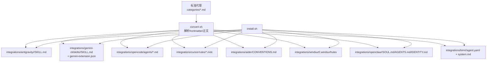
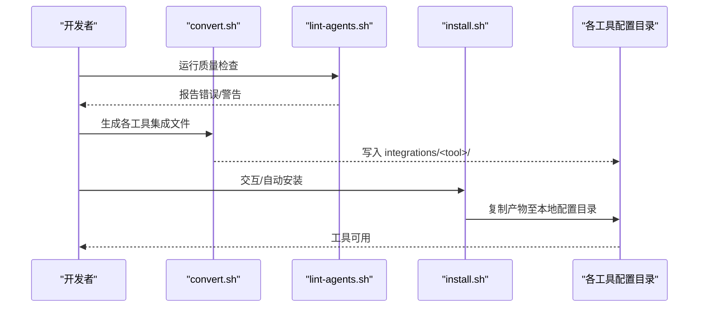
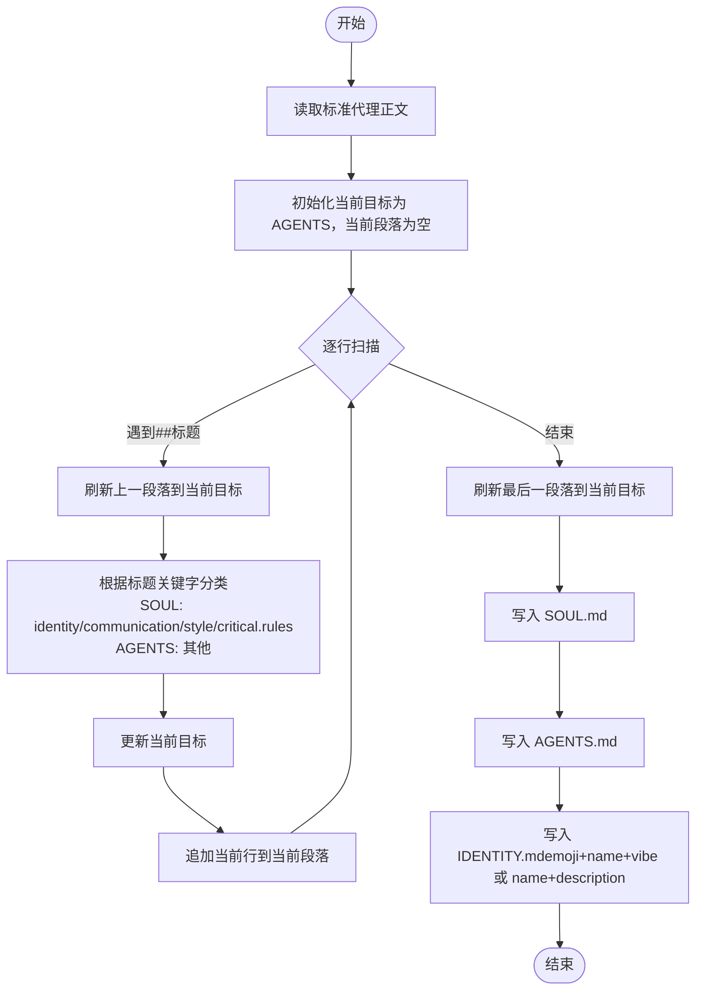

# 转换系统

<cite>
**本文引用的文件**
- [convert.sh](file://scripts/convert.sh)
- [install.sh](file://scripts/install.sh)
- [lint-agents.sh](file://scripts/lint-agents.sh)
- [README.md](file://README.md)
- [CONTRIBUTING.md](file://CONTRIBUTING.md)
- [integrations/README.md](file://integrations/README.md)
- [integrations/antigravity/README.md](file://integrations/antigravity/README.md)
- [integrations/gemini-cli/README.md](file://integrations/gemini-cli/README.md)
- [integrations/github-copilot/README.md](file://integrations/github-copilot/README.md)
- [integrations/cursor/README.md](file://integrations/cursor/README.md)
- [engineering-frontend-developer.md](file://engineering/engineering-frontend-developer.md)
- [design-ui-designer.md](file://design/design-ui-designer.md)
</cite>

## 目录
1. [简介](#简介)
2. [项目结构](#项目结构)
3. [核心组件](#核心组件)
4. [架构总览](#架构总览)
5. [详细组件分析](#详细组件分析)
6. [依赖关系分析](#依赖关系分析)
7. [性能考量](#性能考量)
8. [故障排查指南](#故障排查指南)
9. [结论](#结论)
10. [附录](#附录)

## 简介
本文件面向“转换系统”的技术文档，聚焦于如何将标准化的代理（Agent）Markdown文件转换为不同AI工具所需的特定格式。系统通过统一的转换脚本，将同一套“标准代理”内容适配到多种工具：Claude Code 的 .md 文件、GitHub Copilot 的 agents 目录结构、Antigravity 的 SKILL.md 格式、Gemini CLI 的 extension.json 配置与技能目录、Cursor 的 .mdc 规则文件、OpenCode 的 .md 代理文件、Aider 的单文件约定、Windsurf 的 .windsurfrules、OpenClaw 的 SOUL/AGENTS/IDENTITY 工作区，以及 Kimi Code 的 YAML + system.md 规范。

该系统采用“适配器模式”思想：以统一的前端元数据（YAML frontmatter）和正文结构为基础，针对每个工具的文件布局、命名规范、最小化 frontmatter 字段、分隔策略或目录结构进行定制化生成；同时提供并行执行能力、可交互安装流程与一致性校验脚本，确保在多工具生态中保持一致体验与高质量交付。

## 项目结构
- 脚本层
  - scripts/convert.sh：核心转换脚本，负责读取标准代理、解析 frontmatter、按工具规则生成目标格式，并写入 integrations/<tool>/。
  - scripts/install.sh：安装脚本，扫描已安装工具、复制转换产物至各工具的本地配置目录。
  - scripts/lint-agents.sh：代理文件质量检查脚本，验证 frontmatter 必填项与推荐结构。
- 内容层
  - 各领域代理文件位于 categories 目录（如 engineering/、design/ 等），均采用统一的 YAML frontmatter + 结构化正文。
- 集成层
  - integrations/：存放 convert.sh 生成的中间产物，供 install.sh 安装使用。
  - integrations/<tool>/：各工具的产物目录，遵循其文件命名与目录结构约定。

图表来源
- [convert.sh:480-636](file://scripts/convert.sh#L480-L636)
- [install.sh:496-510](file://scripts/install.sh#L496-L510)

章节来源
- [README.md:508-590](file://README.md#L508-L590)
- [integrations/README.md:1-48](file://integrations/README.md#L1-L48)

## 核心组件
- 转换脚本 convert.sh
  - 输入：标准代理（categories/*.md），要求首行含 frontmatter 分隔符“---”，且 frontmatter 中包含 name、description 等字段。
  - 处理：逐个读取代理，提取 frontmatter 字段与正文；根据工具类型调用对应转换器；对部分工具进行并行处理；生成单文件工具（Aider、Windsurf）时先累积到临时文件，最后一次性写出。
  - 输出：写入 integrations/<tool>/ 对应目录，遵循各工具的文件名与目录结构规范。
- 安装脚本 install.sh
  - 检测已安装工具，支持交互式选择或非交互自动检测；按工具复制产物到其本地配置目录。
  - 支持并行安装，避免重复输出。
- 质量检查脚本 lint-agents.sh
  - 校验 frontmatter 开闭、必填字段（name、description、color）、推荐结构（Identity/Core Mission/Critical Rules）与正文长度。

章节来源
- [convert.sh:83-106](file://scripts/convert.sh#L83-L106)
- [convert.sh:108-478](file://scripts/convert.sh#L108-L478)
- [convert.sh:480-636](file://scripts/convert.sh#L480-L636)
- [install.sh:125-162](file://scripts/install.sh#L125-L162)
- [install.sh:496-510](file://scripts/install.sh#L496-L510)
- [lint-agents.sh:33-79](file://scripts/lint-agents.sh#L33-L79)

## 架构总览
转换系统由“输入解析—适配器—输出生成—安装部署”四阶段构成，辅以质量校验与并行优化。

图表来源
- [lint-agents.sh:33-79](file://scripts/lint-agents.sh#L33-L79)
- [convert.sh:480-636](file://scripts/convert.sh#L480-L636)
- [install.sh:515-637](file://scripts/install.sh#L515-L637)

## 详细组件分析

### 前端元数据与正文解析器
- 功能要点
  - 提取单字段：get_field(field, file) 从 frontmatter 中读取指定键值。
  - 去除前导 frontmatter：get_body(file) 返回正文部分。
  - 名称规范化：slugify(name) 将人类可读名称转为小写下划线连接的 slug。
- 使用场景
  - 所有转换器均依赖上述函数读取 name、description、color、emoji、vibe、tools 等字段，并据此生成目标格式。

章节来源
- [convert.sh:85-99](file://scripts/convert.sh#L85-L99)
- [convert.sh:103-105](file://scripts/convert.sh#L103-L105)

### Antigravity（Gemini Antigravity）适配器
- 输入：标准代理 frontmatter（name、description、emoji、vibe 可选）。
- 适配策略
  - 输出目录：integrations/antigravity/agency-<slug>/
  - 输出文件：SKILL.md，frontmatter 包含 name、description、risk、source、date_added。
  - slug 前缀：agency-，避免与现有技能冲突。
- 典型字段映射
  - name → name（带前缀）
  - description → description
  - date_added → 今日日期
  - risk/source 固定值

章节来源
- [convert.sh:109-133](file://scripts/convert.sh#L109-L133)
- [integrations/antigravity/README.md:37-49](file://integrations/antigravity/README.md#L37-L49)

### Gemini CLI 适配器
- 输入：标准代理 frontmatter（name、description）。
- 适配策略
  - 输出目录：integrations/gemini-cli/skills/<slug>/
  - 输出文件：SKILL.md，frontmatter 仅包含 name、description。
  - 同步生成扩展清单：gemini-extension.json（name、version）。
- 典型字段映射
  - name → name
  - description → description

章节来源
- [convert.sh:135-156](file://scripts/convert.sh#L135-L156)
- [convert.sh:605-612](file://scripts/convert.sh#L605-L612)
- [integrations/gemini-cli/README.md:24-34](file://integrations/gemini-cli/README.md#L24-L34)

### OpenCode 适配器
- 输入：标准代理 frontmatter（name、description、color）。
- 适配策略
  - 输出目录：integrations/opencode/agents/
  - 输出文件：agents/<slug>.md，frontmatter 包含 name、description、mode、color。
  - color 解析：resolve_opencode_color 将颜色名映射为大写十六进制（如 #RRGGBB），默认灰色。
- 典型字段映射
  - name → name
  - description → description
  - color → 归一化后的十六进制色值

章节来源
- [convert.sh:158-200](file://scripts/convert.sh#L158-L200)
- [convert.sh:202-226](file://scripts/convert.sh#L202-L226)

### Cursor 适配器
- 输入：标准代理 frontmatter（name、description）。
- 适配策略
  - 输出目录：integrations/cursor/rules/
  - 输出文件：rules/<slug>.mdc，frontmatter 包含 description、globs、alwaysApply。
  - 正文直接复制到文件体。
- 典型字段映射
  - description → description
  - globs/alwaysApply → 默认空串与 false

章节来源
- [convert.sh:228-249](file://scripts/convert.sh#L228-L249)
- [integrations/cursor/README.md:16-32](file://integrations/cursor/README.md#L16-L32)

### OpenClaw 适配器（SOUL/AGENTS/IDENTITY）
- 输入：标准代理正文（按标题分组）。
- 适配策略
  - 输出目录：integrations/openclaw/<slug>/
  - 输出文件：
    - SOUL.md：包含 Identity、Communication、Style、Critical Rules、Rules You Must Follow 等相关段落。
    - AGENTS.md：其余段落（Mission、Deliverables、Workflow 等）。
    - IDENTITY.md：优先使用 emoji + name + vibe，否则回退到 name + description。
- 标题关键字分类
  - SOUL 关键字：identity、memory（与 identity 配对）、communication、style、critical rule、rules you must follow。
  - AGENTS 关键字：其他所有段落。

章节来源
- [convert.sh:251-340](file://scripts/convert.sh#L251-L340)

### Qwen Code 适配器
- 输入：标准代理 frontmatter（name、description，tools 可选）。
- 适配策略
  - 输出目录：integrations/qwen/agents/
  - 输出文件：agents/<slug>.md，frontmatter 包含 name、description；若源文件存在 tools 字段则保留。
  - Qwen 不使用 color、emoji、vibe 等字段，因此不写入。
- 典型字段映射
  - name → name
  - description → description
  - tools → 条件性保留

章节来源
- [convert.sh:342-375](file://scripts/convert.sh#L342-L375)
- [CONTRIBUTING.md:219-222](file://CONTRIBUTING.md#L219-L222)

### Kimi Code 适配器
- 输入：标准代理 frontmatter（name、description）。
- 适配策略
  - 输出目录：integrations/kimi/<slug>/
  - 输出文件：
    - agent.yaml：包含 version、agent.name（slug）、extend（默认继承）、system_prompt_path（指向 system.md）。
    - system.md：包含 name、description 与正文。
- 典型字段映射
  - name → agent.name
  - description → system.md 的头部描述

章节来源
- [convert.sh:377-408](file://scripts/convert.sh#L377-L408)

### Aider 与 Windsurf 单文件适配器
- 输入：标准代理正文。
- 适配策略
  - Aider：将所有代理正文累积到 integrations/aider/CONVENTIONS.md（带固定头部注释）。
  - Windsurf：将所有代理正文累积到 integrations/windsurf/.windsurfrules（带固定头部注释与分隔线）。
- 特殊处理
  - 使用临时文件（mktemp）保存累积内容，最后一次性写出，避免多次 IO。

章节来源
- [convert.sh:410-414](file://scripts/convert.sh#L410-L414)
- [convert.sh:440-478](file://scripts/convert.sh#L440-L478)
- [convert.sh:618-628](file://scripts/convert.sh#L618-L628)

### 并行执行与进度反馈
- convert.sh
  - 当工具为 all 时，对独立工具（antigravity、gemini-cli、opencode、cursor、openclaw、qwen）采用并行执行，缓冲输出保证每类工具输出顺序稳定。
  - 并行作业数默认取 nproc 或 sysctl，可通过 --jobs N 调整。
- install.sh
  - 支持并行安装，通过环境变量隔离各工具安装输出，避免交叉污染。

章节来源
- [convert.sh:566-590](file://scripts/convert.sh#L566-L590)
- [convert.sh:575-578](file://scripts/convert.sh#L575-L578)
- [install.sh:606-615](file://scripts/install.sh#L606-L615)
- [install.sh:611-614](file://scripts/install.sh#L611-L614)

### 数据处理流程图（以 OpenClaw 为例）

图表来源
- [convert.sh:251-340](file://scripts/convert.sh#L251-L340)

## 依赖关系分析
- 组件耦合
  - convert.sh 与各工具适配器之间为松耦合：通过函数式适配器模式，新增工具只需实现对应转换器并接入 run_conversions 分发逻辑。
  - install.sh 与 convert.sh 通过 integrations/ 目录解耦：install.sh 仅依赖 convert.sh 生成的产物。
- 外部依赖
  - 各工具的本地配置路径（如 ~/.gemini、~/.github、~/.copilot、~/.cursor 等）由 install.sh 检测与复制。
- 潜在循环依赖
  - 无直接循环；install.sh 仅读取 integrations/，不反向依赖源代理。

图表来源
- [convert.sh:480-636](file://scripts/convert.sh#L480-L636)
- [install.sh:515-637](file://scripts/install.sh#L515-L637)
- [lint-agents.sh:33-79](file://scripts/lint-agents.sh#L33-L79)

章节来源
- [convert.sh:538-544](file://scripts/convert.sh#L538-L544)
- [install.sh:104-104](file://scripts/install.sh#L104-L104)

## 性能考量
- 并行化
  - convert.sh 与 install.sh 均支持并行执行，显著缩短多工具批量处理时间；默认并发数依据系统核数动态确定。
- I/O 优化
  - Aider 与 Windsurf 采用临时文件累积后一次性写出，减少多次磁盘写入。
- 正则与文本处理
  - frontmatter 解析与正文截取使用高效流式处理（awk、sed、grep），避免一次性加载大文件。
- 建议
  - 在大型仓库中建议使用 --parallel 与 --jobs N 提升吞吐。
  - 新增工具时尽量保持纯函数式适配器，避免引入复杂状态共享。

[本节为通用指导，无需特定文件引用]

## 故障排查指南
- 常见问题与定位
  - integrations/ 缺失：install.sh 会提示先运行 convert.sh。
  - 工具未检测到：install.sh 通过命令是否存在或目录是否存在进行检测；可在非交互模式下强制安装。
  - 转换器未知：convert.sh 会列出有效工具列表；确认传参正确。
  - 代理格式错误：lint-agents.sh 会报告缺失 frontmatter、必填字段或正文过短等问题。
- 排查步骤
  - 运行质量检查：./scripts/lint-agents.sh
  - 重新生成集成文件：./scripts/convert.sh
  - 交互式安装：./scripts/install.sh
  - 强制安装某工具：./scripts/install.sh --tool <tool>
  - 并行加速：./scripts/convert.sh --parallel 与 ./scripts/install.sh --parallel

章节来源
- [install.sh:125-130](file://scripts/install.sh#L125-L130)
- [install.sh:534-544](file://scripts/install.sh#L534-L544)
- [lint-agents.sh:33-79](file://scripts/lint-agents.sh#L33-L79)

## 结论
转换系统以“统一输入 + 适配器模式 + 工具特定输出”为核心，实现了从一套标准代理到多工具生态的一致化交付。通过并行执行、质量检查与交互式安装，系统在易用性与可维护性之间取得平衡。对于扩展新工具，建议遵循现有适配器模板，新增转换器函数并在 run_conversions 中注册，即可无缝接入整体流水线。

[本节为总结性内容，无需特定文件引用]

## 附录

### 工具适配器一览表
- Antigravity：SKILL.md，目录 <slug>，前缀 agency-
- Gemini CLI：extension.json + skills/<slug>/SKILL.md
- OpenCode：agents/<slug>.md，归一化 color
- Cursor：rules/<slug>.mdc，frontmatter 描述与开关
- OpenClaw：SOUL/AGENTS/IDENTITY 三文件工作区
- Qwen Code：agents/<slug>.md，最小 frontmatter
- Kimi Code：agent.yaml + system.md
- Aider：CONVENTIONS.md（项目级）
- Windsurf：.windsurfrules（项目级）

章节来源
- [convert.sh:109-408](file://scripts/convert.sh#L109-L408)
- [convert.sh:618-628](file://scripts/convert.sh#L618-L628)
- [integrations/README.md:6-18](file://integrations/README.md#L6-L18)

### 示例代理文件参考
- 工程师类代理：工程前端专家（Frontend Developer）
- 设计类代理：UI 设计师（UI Designer）

章节来源
- [engineering-frontend-developer.md:1-225](file://engineering/engineering-frontend-developer.md#L1-L225)
- [design-ui-designer.md:1-383](file://design/design-ui-designer.md#L1-L383)